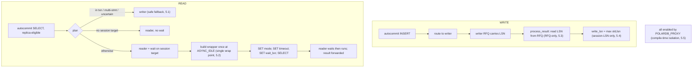
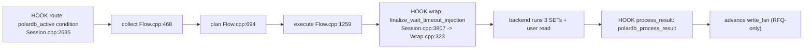

# 01 — Background and Design Rationale

> Scope: the read-your-writes problem, the PolarDB WAL-LSN mechanism, why an LSN-only first slice, the design principles, and the shared glossary | Audience: R/M/O/C | Status: stable | Prereqs: this is the entry deep-dive; read alongside `POLARDB_ARCHITECTURE.md`; follow-on detail in `06-ROUTING-PIPELINE.md`, `07-QUERY-WRAPPING.md`, `09-PUBLISH-AND-WRITE-TRACKING.md`, `14-INVARIANTS-AND-FAILURE-MODES.md` | Verified against: this branch

---

## 1. What this document is

This is the first deep-dive document for the PolarDB LSN-only feature in ProxySQL. It explains:

- The consistency problem the feature solves (read-your-writes when reads go to replicas).
- The PolarDB mechanism it uses (a WAL log position called an LSN, reported on the wire, plus a backend wait).
- Why this first version covers only the LSN path and leaves several larger features for later.
- The five design rules the code follows.
- The glossary that fixes one word per concept for the whole document set.

Every other document in this set uses the terms defined here in Section 8. If a term is unclear elsewhere, the glossary in this document is the single authority.

The whole feature is compiled in only when the build flag `POLARDB_PROXY` is set. When `POLARDB_PROXY=0`, every PolarDB declaration and call site compiles out and the binary behaves like upstream ProxySQL. Build details are in `02-BUILD-TOGGLE-AND-LIBPQ.md`.

---

## 2. The read-your-writes problem

### 2.1 Read/write splitting, in plain words

A PolarDB cluster has two kinds of backend node:

| Node kind | Also called | Accepts writes? | Up to date? |
|---|---|---|---|
| primary | writer | yes | always current |
| replica | reader | no (read-only) | may lag behind the primary |

ProxySQL groups backend servers into numbered **hostgroups** (HGs). For PolarDB, one admin row pairs a **writer hostgroup** (holds the primary) with a **reader hostgroup** (holds the replicas). To spread load, ProxySQL can send writes to the writer and reads to a reader. This is **read/write splitting**.

A replica is not an exact copy at every instant. The primary records each change in its **write-ahead log (WAL)** and the replicas replay that log to catch up. Replay takes time, so a replica is usually a little behind the primary. That small delay is **replication lag**.

### 2.2 Why naive replica routing breaks correctness

The danger is simple. Suppose a single client does this in order:

1. `INSERT` a row (goes to the writer).
2. `SELECT` that same row right away (sent to a reader to save load).

If the reader has not yet replayed the WAL that contains the `INSERT`, the `SELECT` returns no row. The client just wrote data and cannot see its own write. This breaks an expectation almost every application has:

> **Read-your-writes (RYW):** after a session writes data, that same session's later reads must see the write, even when the read is served by a replica.

Plain read/write splitting with no extra care does **not** give RYW, because a reader can be behind the writer at the moment of the read.

### 2.3 The two endpoints of the trade-off

| Approach | RYW correct? | Reader load relief? |
|---|---|---|
| Send all reads to the writer | yes | none (writer does all reads) |
| Send all reads to any reader, no checks | no | full, but unsafe |

The goal is to get most of the load relief of the second row while keeping the correctness of the first. The PolarDB LSN mechanism is how this feature does that: send a read to a reader, but make the reader wait until it has caught up to the data the same session just wrote, before it answers.

```
client                ProxySQL                    PolarDB
  | INSERT row           |  route -> writer          (writer)
  |--------------------->|-------------------------->| applies write, advances WAL
  |                      |                           |
  | SELECT that row      |  route -> reader          (reader, may be behind)
  |--------------------->|--- "wait until you have ->|  waits to catch up,
  |                      |     the write, then run"  |  then runs SELECT
  |<---------------------|<--------------------------|  returns the row (RYW kept)
```

---

## 3. The PolarDB LSN mechanism

### 3.1 The LSN

A **Log Sequence Number (LSN)** is a 64-bit position in PostgreSQL's write-ahead log. A larger LSN means a more recent point in the write history. In code the type is `XLogRecPtr`, a `typedef` for `uint64_t`, with the constant `InvalidXLogRecPtr = 0` standing for "no LSN" (`include/PgSQL_PolarDB.h:353-354`).

The key property the feature relies on:

> A replica that has replayed up to LSN X can serve any read whose data was committed at or before LSN X.

So if ProxySQL knows the LSN of a session's last write, and it can make a replica wait until its own replay reaches that LSN, then a read on that replica is guaranteed to see the write. The LSN is the link between "what this session wrote" and "has this replica caught up".

### 3.2 LSN on the wire: the extended ReadyForQuery

After a backend finishes a command, it sends a PostgreSQL wire message called **ReadyForQuery (RFQ)** meaning "ready for the next query". A standard PostgreSQL RFQ carries only a one-byte transaction-status flag.

PolarDB, with a small patch to the client library (libpq), can append the backend's current WAL LSN to the RFQ message. ProxySQL then reads that LSN directly from the message it already receives, with **no extra query and no extra round-trip** (a round-trip is one request sent to a backend plus the reply that comes back). This is what makes the mechanism cheap on the **hot path** — the per-query code that runs for every single client query, where any added work multiplies across all traffic.

This RFQ-LSN behavior is not in stock libpq. ProxySQL ships a libpq patch (`deps/postgresql/polardb_libpq.patch`) that adds three small functions:

| libpq function | What it does |
|---|---|
| `PQsetPolarSendLSN(conn, 1)` | turn on LSN parsing for this connection (tells the parser to expect an appended LSN) |
| `PQhasLSN(conn)` | did the last RFQ carry an LSN? |
| `PQgetLSN(conn)` | return the LSN from the last RFQ (0 if none) |

These are exported as libpq ordinals 188, 189, and 190 (`deps/postgresql/polardb_libpq.patch:8-10`). The patch surface is documented in full in `02-BUILD-TOGGLE-AND-LIBPQ.md` and `11-CONNECTION-AND-LIBPQ.md`.

> **Deployment requirement.** The RYW guarantee depends on the patched libpq and a genuine PolarDB backend. Without the patch, no LSN reaches ProxySQL and the feature cannot wait correctly. This requirement is stated for operators in `17-OPERATOR-GUIDE.md`.

### 3.3 The wait condition on the replica

Knowing the target LSN is half the mechanism. The other half is making the replica wait. PolarDB exposes a backend setting (a **GUC** — a PostgreSQL runtime setting changed with `SET name = value`) called:

```
polar_xact_split_wait_lsn
```

When ProxySQL sends `SET polar_xact_split_wait_lsn = '<target>'` to a replica before a read, the replica blocks until its replay LSN passes that target, and only then runs the read. **This `SET` enforces read-your-writes correctness.** The replica does the waiting; ProxySQL only supplies the target.

Two more GUCs shape the wait:

| GUC | Set from | Effect |
|---|---|---|
| `polar_consistency_mode` | the wait-timeout mode knob | chooses what happens on timeout: `best_effort` or `strict` |
| `polar_proxy_wait_timeout_ms` | the resolved wait timeout | bounds how long the replica waits (0 = wait without a PolarDB timeout) |

### 3.4 best_effort versus strict on timeout

The wait is bounded by a timeout. When the replica cannot catch up to the target LSN before the timeout, the chosen mode decides the outcome:

| Mode | On timeout the replica... | What ProxySQL sees | Result for the client |
|---|---|---|---|
| best_effort | returns possibly-stale data with a **WARNING/NOTICE** | a NoticeResponse | the read still returns rows; the warning is forwarded so the client knows |
| strict | raises an **ERROR** and aborts the statement | an ErrorResponse | the read fails; no stale data is returned |

`best_effort` favors availability (you still get an answer, possibly slightly behind, with a warning). `strict` favors correctness (no answer rather than a stale one). In this version the timeout mode is chosen by one global knob, `pgsql-polardb_wait_timeout_mode` (default `best_effort`); there is no per-hostgroup or per-session override for it. ProxySQL emits the resolved value as the `SET polar_consistency_mode` statement on every wrapped read. (This is a different knob from the consistency mode in Section 8, which does have three-tier resolution.) The detailed timeout and notice handling is in `08-WAIT-TIMEOUT-AND-NOTICES.md`.

### 3.5 How ProxySQL applies the wait: the wait wrapper

ProxySQL does not run a separate `SET` round-trip before the read. Instead it builds a single multi-statement query — the **wait wrapper** — that runs three SETs and then the user's read, all in one packet the client never sees split:

```
SET polar_consistency_mode = 'best_effort'|'strict';   -- statement 1 (mode)
SET polar_proxy_wait_timeout_ms = <resolved_ms>;        -- statement 2 (timeout bound)
SET polar_xact_split_wait_lsn = '<session_target_lsn>'; -- statement 3 (the wait step)
<original user query>                                    -- statement 4 (the real result)
```

The wrapper is built by `build_wrapped_wait_query()` (`lib/PgSQL_PolarDB_Wrap.cpp:261`). It is installed exactly once, at one point in the code (covered in Section 7.2 and in `07-QUERY-WRAPPING.md`).

Each prepended SET returns its own result set. The connection layer silently drops those three SET results and forwards only the fourth result — the user's read — to the client. **Consuming** these dropped SET results is described in `07-QUERY-WRAPPING.md` and `11-CONNECTION-AND-LIBPQ.md`.

### 3.6 Putting it together: write then read

```
WRITE PATH
  client INSERT --> ProxySQL routes to writer --> writer applies it
  writer's RFQ carries its new LSN
  ProxySQL records that LSN as this session's write position
     (polardb_session_consistency.write_lsn = max(old, new))

READ PATH (same session, a read marked replica-eligible)
  client SELECT --> ProxySQL plans: send to a reader, with a wait on
     polardb_session_consistency.write_lsn
  ProxySQL wraps the SELECT with the three SETs and sends it to the reader
  reader blocks on SET polar_xact_split_wait_lsn until it has caught up
  reader runs the SELECT and returns rows --> RYW kept
```

The write side recording the LSN is **process_result** (Section 7.3, full detail in `09-PUBLISH-AND-WRITE-TRACKING.md`). The read side choosing a reader and preparing the wait is the **routing pipeline** plus the **wrap** (Sections 7.1 and 7.2, full detail in `06-ROUTING-PIPELINE.md` and `07-QUERY-WRAPPING.md`).

---

## 4. Why an LSN-only first slice

The full PolarDB design has more than the LSN path. This first version ships only the LSN path on purpose. This section explains what is in and what is out, and why.

### 4.1 What is in this version

- **Read-your-writes for autocommit reads.** Track each session's last write LSN and make replica reads wait on it.
- **Simple-query transaction split.** When `txn_split_enabled=1`, an eligible read inside an open transaction can take a replica connection from the pool after the writer has returned RFQ XID and LSN evidence. That connection is returned after the read; the transaction stays on the writer connection.
- **Session-LSN consistency only.** The feature guarantees a session sees its own writes. It does not coordinate consistency across different sessions.
- **Routing, wrapping, waiting, and result processing** for the simple-query path (the normal `'Q'` query message).

### 4.2 What is out of this version (deferred)

| Deferred capability | One-line description | Future doc |
|---|---|---|
| CSN global consistency | a commit-counter (Commit Sequence Number) for cross-session consistency | `18-FUTURE-CSN-DESIGN.md` |
| Transaction-split extensions | advanced split-mode ranking and CSN integration around the shipped simple-query split path | `19-FUTURE-TXN-SPLIT-DESIGN.md` |
| Reader-failure recovery extensions | per-error-class policy tables, retry budgets, and reader circuit-breaker quarantine beyond the shipped wait/split reader-failure policy | `20-FUTURE-READER-FAILURE-RETRY-DESIGN.md` |
| Extended-protocol RYW | wait wrapping for Parse/Bind/Execute reads | `15-LIMITATIONS-AND-ROADMAP.md` |
| Millisecond lag cap | a time-based replica lag cap | Section 8 glossary + `15-LIMITATIONS-AND-ROADMAP.md` |

> **CSN is experimental and not in this version.** Where you see CSN mentioned anywhere in this set, treat it as a future, experimental feature. It requires PolarDB backend support, it applies only in a global-consistency mode, and its wait behavior is not reliably verified. The 18-doc describes it strictly as a delta from this version. None of it is present in the code this document verifies.

The transaction-split source file (`lib/PgSQL_PolarDB_Split.cpp`) is active in this tree for simple-query split reads. The branch also includes split counters, lazy warmup, and the common reader-failure model (RETRY / FORWARD / TERMINATE) for wait reads and split reads. Advanced split ranking, CSN integration, and circuit-breaker-style reader quarantine remain future work.

### 4.3 The reasoning behind the slice

There are four reasons to ship the LSN path first.

1. **It is smaller than the full feature.** The LSN path plus simple-query split is much smaller than the full feature. The full implementation still adds split-mode policy, warmup, additional counters, CSN integration, and the broader reader-failure model.

2. **It is the foundation everything else builds on.** CSN, transaction split, and reader-failure recovery all reuse the same four pipeline stages and the same backend-wait mechanism. Getting collect/plan/execute/process_result right first means later features extend an implementation already exercised by tests rather than redesigning it. The structs were deliberately designed to leave room for later features (for example, the wait snapshot keeps a spare merge point for CSN; see `03-TYPES-AND-ENUMS.md`).

3. **Simple-query split keeps the rules bounded.** A transaction-split read only temporarily uses a second replica backend after the primary has returned RFQ XID and LSN evidence for the open transaction. The transaction-owning connection remains the primary connection for `BEGIN`, writes, `COMMIT`, and fallback paths. The routing rules are in `06-ROUTING-PIPELINE.md`.

4. **No CSN means no dependency on unverified backend behavior.** CSN-wait behavior is not reliably verified and needs specific backend support. Leaving it out means the shipped feature depends only on the LSN wait, which is the well-understood part.

The full status of what ships versus what is deferred lives in `15-LIMITATIONS-AND-ROADMAP.md`.

---

## 5. Design principles

The code follows five rules. Each rule has a one-line statement, the reason, and where it shows up in code. Detailed invariants and failure cases are in `14-INVARIANTS-AND-FAILURE-MODES.md`.

### 5.1 Safe writer fallback

**Rule:** when any precondition for a safe replica read is missing or uncertain, send the read to the writer instead.

**Why:** the writer is always up to date. Routing a doubtful read to the writer is always correct; it only costs some load. Routing a doubtful read to a possibly-behind replica risks breaking RYW. So whenever the feature cannot be sure, it picks the safe side.

**Where:** the routing plan returns `FORCE_PRIMARY` (route to the writer) for every uncertain case — an explicit transaction, a multi-statement read, an extended-protocol read with a known or unknown LSN target, the lag cap exceeded, a `route=primary` hint, or `PRIMARY_ONLY` mode. Each case carries a recorded reason. The full list with file:line is in `06-ROUTING-PIPELINE.md`. If building the wait wrapper fails, the failure handler sets a session flag (`polardb_wait_disabled = true`) so later reads use the writer, and the wrap call site returns an error for the current read rather than silently sending an unwrapped read to a replica (`lib/PgSQL_Session.cpp:3807`).

### 5.2 Single wrap point

**Rule:** the wait wrapper is built and installed in exactly one place in the code.

**Why:** building the wrapper in one place means there is one spot to get the packet construction, the SET count, and the safe writer-fallback behavior right. Scattering it would multiply the chance of a wrong packet or a missed safety check.

**Where:** `finalize_wait_timeout_injection()` (`lib/PgSQL_PolarDB_Wrap.cpp:323`) is the only function that builds the wrapper. It is called from one site: the `ASYNC_IDLE` block in `PgSQL_Session::handler()` at `lib/PgSQL_Session.cpp:3807`, after the backend connection exists and just before the query runs. The earlier routing stage only saves the intent (which reader, which target LSN); it does not build the wrapper. Detail is in `07-QUERY-WRAPPING.md`.

### 5.3 RFQ-only result processing (no SQL fallback)

**Rule:** the session's write LSN is learned only from the LSN carried on the ReadyForQuery message. There is no separate SQL query to fetch an LSN on the request/response hot path.

**Why:** reading the LSN from the RFQ that ProxySQL already receives costs nothing extra. Issuing a separate `SELECT pg_current_wal_lsn()` would add a round-trip to every write and slow the hot path. All SQL-based LSN probing is confined to the background monitor, never the per-query path.

**Where:** `polardb_process_result()` (`lib/PgSQL_PolarDB_Flow.cpp`) reads the LSN via `myds->myconn->get_polardb_lsn()`, which calls the native `PQhasLSN()`/`PQgetLSN()` and issues no SQL. If the RFQ carried no LSN, the session write position is left unchanged and the event is accounted through the missing-LSN flags/counters. Detail is in `09-PUBLISH-AND-WRITE-TRACKING.md`.

### 5.4 Session-LSN only (no global fallback)

**Rule:** the wait target is the session's own highest write LSN, and only that. There is no fallback to a cluster-wide LSN or to a monitor-observed LSN.

**Why:** this version guarantees read-your-writes for one session. A session's own write LSN is exactly the right target for that guarantee. Falling back to some global LSN would either over-wait (slower than needed) or risk targeting the wrong position. Keeping it strictly session-scoped keeps the meaning precise.

**Where:** the write LSN lives on the session as `polardb_session_consistency.write_lsn`. Result processing advances it only when a write query's RFQ carried an LSN, using `max()` so it only ever moves forward (`lib/PgSQL_PolarDB_Flow.cpp:498-503`). The planner builds a wait only when this session value is non-zero; there is no global-LSN branch (covered in `06-ROUTING-PIPELINE.md`). One important detail: `polardb_session_consistency.write_lsn` is deliberately **not** cleared on a `RESET`, so the RYW target survives a session reset and lives for the whole client session.

### 5.5 Compile-time isolation

**Rule:** the entire feature is behind one compile flag, `POLARDB_PROXY`. With the flag off, the binary is the same as upstream ProxySQL.

**Why:** ProxySQL produces both PolarDB and non-PolarDB builds from one codebase. Putting the whole feature behind one build flag means a non-PolarDB build carries none of this code and behaves exactly like upstream. It also keeps the feature easy to reason about as a self-contained addition.

**Where:** every PolarDB declaration and every core call site is wrapped in `#if POLARDB_PROXY`. The flag defaults on (`POLARDB_PROXY ?= 1` at `Makefile:149`) and becomes the `-DPOLARDB_PROXY` define in each build stage. A dedicated translation unit `lib/PgSQL_PolarDB_Stubs.cpp` is reserved for link-time no-op stubs; today it is intentionally empty (`#if !POLARDB_PROXY` with only a comment, `lib/PgSQL_PolarDB_Stubs.cpp:28`) because every seam is already protected. The libpq RFQ-LSN patch is applied only when `POLARDB_PROXY=1`, so a `POLARDB_PROXY=0` build links vanilla libpq. Full detail is in `02-BUILD-TOGGLE-AND-LIBPQ.md`.

> **Note on byte-equivalence.** "`POLARDB_PROXY=0` is byte-equivalent to upstream" is the in-code design contract stated in the stub TU comment (`lib/PgSQL_PolarDB_Stubs.cpp:10-23`). Source inspection shows the calls compile out; byte equivalence still requires building and comparing both binaries.

---

## 6. How the principles fit together

The five rules reinforce one mechanism. A short walk through one write-then-read shows each rule in its place.

```
WRITE (autocommit INSERT)
  route to writer (writes always go to the writer)
  writer answers; its RFQ carries an LSN
  process_result reads that LSN from the RFQ            <- RFQ-only result processing (5.3)
  polardb_session_consistency.write_lsn = max(old, lsn)  <- session-LSN only (5.4)

READ (autocommit SELECT, marked replica-eligible)
  collect inputs, then plan:
     in a transaction?     -> writer             <- route to writer (5.1)
     multi-statement?      -> writer             <- route to writer (5.1)
     no session target?    -> reader, no wait
     otherwise             -> reader + wait on session target
  at ASYNC_IDLE, build the wrapper once          <- single wrap point (5.2)
     SET mode; SET timeout; SET wait_lsn; SELECT
  reader waits then runs; user result forwarded

ALL OF THE ABOVE is compiled in only when POLARDB_PROXY is set  <- compile-time isolation (5.5)
```

---

## 7. The four pipeline stages and four hooks (high level)

This document stays at a high level on the mechanics; the deep-dives cover the details. The feature runs as four stages, all methods of `PgSQL_Session`, in `lib/PgSQL_PolarDB_Flow.cpp`:

| Stage | Function (file:line) | One line | Detail doc |
|---|---|---|---|
| collect | `polardb_collect` (`lib/PgSQL_PolarDB_Flow.cpp:468`) | snapshot all routing inputs into a `PolarDB_Query_RouteCtx` (`include/PgSQL_PolarDB.h:2426`); also repairs stale session LSN state when the writer group or epoch changed | `06-ROUTING-PIPELINE.md` |
| plan | `polardb_plan` (`lib/PgSQL_PolarDB_Flow.cpp:694`) | turn that context into a `PolarDB_Query_RoutePlan` (`include/PgSQL_PolarDB.h:2580`) with action PASSTHROUGH / FORCE_PRIMARY / REPLICA_WITH_WAIT | `06-ROUTING-PIPELINE.md` |
| execute | `polardb_execute` (`lib/PgSQL_PolarDB_Flow.cpp:1259`) | apply the decision, returning a `PolarDB_Query_ExecuteResult` (`include/PgSQL_PolarDB.h:3056`); prepare the wait state | `06-ROUTING-PIPELINE.md` |
| process_result | `polardb_process_result` (`lib/PgSQL_PolarDB_Flow.cpp`) | read RFQ payloads; advance session write/observed LSN state | `09-PUBLISH-AND-WRITE-TRACKING.md` |

The four stages run behind four hooks in the session/connection hot path. The same flow is repeated as Mermaid diagram A.3 at the end of this document:

```
HOOK route: polardb_active condition          (lib/PgSQL_Session.cpp:2635)
        |
        v
   collect  (Flow.cpp:468)  -->  plan (Flow.cpp:694)  -->  execute (Flow.cpp:1259)
        |
        v
HOOK wrap: finalize_wait_timeout_injection   (Session.cpp:3807 -> Wrap.cpp:323)
        |   builds the 3 SETs + user read into one packet
        v
   backend runs:  SET mode; SET timeout; SET wait_lsn; <user read>
        |
        v
HOOK process_result: polardb_process_result    ()
        |   reads the RFQ LSN, advances the session write LSN (RFQ-only)
        v
(the fourth hook, connect/enable, runs earlier on the write that set the LSN)
```

### 7.1 The route hook (condition into the pipeline)

The pipeline runs only when at least one PolarDB hostgroup is configured. The route hook is in `PgSQL_Session::get_pkts_from_client()`, enabled by the atomic master flag `PgHGM->status.polardb_active`:

- The pipeline checks `polardb_active` at `lib/PgSQL_Session.cpp:2635`.
- `polardb_collect(...)` is called at `lib/PgSQL_Session.cpp:2660`.
- `polardb_plan(...)` is called at `lib/PgSQL_Session.cpp:2688`.
- `polardb_execute(...)` is called at `lib/PgSQL_Session.cpp:2692`, and its result overwrites `current_hostgroup`.

If `polardb_active` is false (no PolarDB hostgroup configured), the whole pipeline is skipped and routing is left to the normal query rules. This is the cheap fast-bypass.

### 7.2 The wrap hook (the condition, single wrap point)

When the plan chose `REPLICA_WITH_WAIT`, the wait wrapper is built once at `ASYNC_IDLE` by `finalize_wait_timeout_injection()` (call site `lib/PgSQL_Session.cpp:3807`; function `lib/PgSQL_PolarDB_Wrap.cpp:323`). On failure it returns an error and ends the request instead of sending an unwrapped read to a replica. This is the condition that turns the routing intent into the actual SET-wrapped query on the wire.

### 7.3 The process_result hook (write tracking)

On the success response path, `RequestEnd()` calls `polardb_process_result()` (call site `lib/PgSQL_Session.cpp`; function `lib/PgSQL_PolarDB_`), protected by `polardb_config.is_polardb_enabled`. This reads the writer's RFQ LSN and advances the session write LSN. This is RFQ-only (Section 5.3).

The fourth hook (connect/enable, which turns on LSN parsing for a PolarDB connection) is covered in `10-SESSION-INTEGRATION.md` and `11-CONNECTION-AND-LIBPQ.md`. The full four-hook map is in `POLARDB_ARCHITECTURE.md`.

---

## 8. Glossary

This is the single authority for terminology across the whole document set. One term per concept. Future-only terms are marked **FUTURE**; they are not in this version's code.

| Term | Definition |
|---|---|
| PolarDB | An Alibaba PostgreSQL-compatible database with one primary (writer) node and read replicas. ProxySQL's PolarDB feature adds read-your-writes consistency routing for it. |
| POLARDB_PROXY | The compile-time macro / make variable (default 1) that controls the entire PolarDB feature. Set via `-DPOLARDB_PROXY` (`lib/Makefile`, `src/Makefile`; `Makefile:149`). When 0, all PolarDB declarations and call sites compile out and the binary is byte-equivalent to upstream ProxySQL (design contract, `lib/PgSQL_PolarDB_Stubs.cpp:10-23`). |
| LSN (Log Sequence Number) | A 64-bit position in PostgreSQL's write-ahead log (WAL); larger = more recent. Carried as `XLogRecPtr` (typedef `uint64_t`, `InvalidXLogRecPtr=0`, `include/PgSQL_PolarDB.h:353-354`). A replica that has replayed up to LSN X can serve any read whose data was committed at or before X. |
| WAL (Write-Ahead Log) | PostgreSQL/PolarDB's append-only log of all changes; replicas replay it to catch up to the primary. LSN is a position in this log. |
| RYW (read-your-writes) | The guarantee that after a session writes, its own later reads see that write, even when reads are routed to a replica. Implemented by recording the session's writer LSN and making a replica wait until it has replayed past that LSN before answering. |
| RFQ (ReadyForQuery) | The PostgreSQL wire-protocol message a backend sends after each command meaning "ready for the next query". With the PolarDB libpq patch the backend appends its current WAL LSN to RFQ; ProxySQL reads it via `PQgetLSN()` with no extra round-trip. |
| hostgroup (HG) | A ProxySQL numbered group of backend servers. A PolarDB replication-hostgroup row pairs a writer hostgroup (primary) with a reader hostgroup (replicas) and is marked with `check_type='polardb'`. |
| writer / primary | The backend that accepts writes and is always up to date; the only node that can hold a transaction. Field name `writer_hg`. Every FORCE_PRIMARY and safe fallback path routes here. "writer" and "primary" are used interchangeably. |
| reader / replica | A read-only backend that replays the primary's WAL and may lag behind it. Field name `reader_hg` (-1 if none). Reads route here only on a PASSTHROUGH-to-reader or REPLICA_WITH_WAIT decision. "reader" and "replica" are used interchangeably. |
| HGM (HostGroups Manager) | `PgSQL_HostGroups_Manager`: the class that owns backend topology and the global `PgHGM->status` struct holding all PolarDB atomic counters and the `polardb_active` condition. |
| polardb_active | An `atomic<bool>` on `HGM::status` (`include/PgSQL_HostGroups_Manager.h:1252`, set at `lib/PgSQL_HostGroups_Manager.cpp:2770` from whether any PolarDB hostgroup is configured). The cheap master condition: every HGM PolarDB accessor and the route pipeline (`lib/PgSQL_Session.cpp:2635`) check it first to fail safe when no PolarDB hostgroup is configured. |
| consistency mode | The per-query routing policy, resolved by precedence session override > per-HG > global. Values in this version: OFF=0 (no PolarDB routing, query rules decide), SESSION_LSN=1 (wait on the session's write LSN before a replica read), GLOBAL_LSN=2 (wait on max(session target, writer-mirror LSN)), PRIMARY_ONLY=3 (force all reads to the writer). Enum `PolarDB_ConsistencyMode` at `include/PgSQL_PolarDB.h:1162`; default global value `'off'`. The value `'default'` / -1 means "not set, defer to the lower tier". **FUTURE** adds CSN modes. |
| 3-tier resolution | Choosing the effective consistency mode by precedence: session override (client SET) > per-HG schema value > global thread-local knob, via `polardb_resolve_consistency_mode` (`include/PgSQL_PolarDB.h:1277`), called by `polardb_collect()`; -1 is the "not set" sentinel at each non-global tier. |
| wait wrapper / wrapped read | A replica-eligible autocommit read that ProxySQL prefixes with three SET statements (`polar_consistency_mode`, `polar_proxy_wait_timeout_ms`, `polar_xact_split_wait_lsn='<target>'`) so the replica blocks until it has replayed past the client's last write before answering. Built once at ASYNC_IDLE by `build_wrapped_wait_query` (`lib/PgSQL_PolarDB_Wrap.cpp:261`); sent as one simple-query packet the client never sees split. |
| wrap point | The single place the wrapper is built and installed: `finalize_wait_timeout_injection` (`lib/PgSQL_PolarDB_Wrap.cpp:323`), called once from `lib/PgSQL_Session.cpp:3807`. |
| consume (the SET results) | Silently dropping the SET result sets a wrapped read produces, so only the user's read result reaches the client. The connection layer is the sole owner of this; the count to drop is hardcoded to 3 for a consistency wait. |
| result processing | The response-path stage `polardb_process_result` (`lib/PgSQL_PolarDB_Flow.cpp`) that reads RFQ payloads, advances session write/observed LSN state, maintains missing-LSN flags, and refreshes the per-server LSN cache. RFQ-only; no SQL. |
| GUC | Grand Unified Configuration variable — a PostgreSQL runtime setting changed with `SET name = value`. PolarDB adds `polar_consistency_mode`, `polar_proxy_wait_timeout_ms`, `polar_xact_split_wait_lsn`. |
| polar_xact_split_wait_lsn | The PolarDB backend GUC that is the actual RYW wait condition: on a replica the backend blocks until its replay LSN passes this target before answering. Appended by `append_polar_wait_set` (`include/PgSQL_PolarDB.h:2336`); appends nothing for a zero/NONE target. |
| polar_consistency_mode | The PolarDB GUC choosing timeout behavior on the replica: `best_effort` (return stale data + WARNING) or `strict` (raise ERROR). Set by ProxySQL from the wait-timeout-mode knob; cached and rebuilt only on change (`build_polar_consistency_mode_set`, `lib/PgSQL_PolarDB_Wrap.cpp:163`). |
| polar_proxy_wait_timeout_ms | The PolarDB GUC bounding the wait. >0 = wait that many ms; 0 = disable only the PolarDB wait-timeout branch (statement_timeout/cancel/terminate can still stop it). Always emitted (including 0) so a pooled backend cannot reuse a stale value. |
| best_effort vs strict (wait timeout mode) | What the replica does when it cannot reach the target LSN before the timeout: best_effort returns possibly-stale data with a WARNING/NOTICE; strict raises an ERROR. Enum `PolarDB_WaitMode {BEST_EFFORT=1, STRICT=2}` at `include/PgSQL_PolarDB.h:383`; global default best_effort. |
| lag cap (max_lag_bytes) | An optional safety-only byte bound on `primary_lsn - reader_lsn`. The planner attaches the cap to `PolarDB_Query_ReaderPlan`; `get_MyConn_polardb_reader()` enforces it while acquiring the actual reader. -1 inherits the global byte-lag knob; 0 disables the cap; >0 enforces it. When every reader exceeds it (or has stale/missing LSN under an enabled cap) the read uses the writer instead of an unsafe replica. It is NOT the correctness enforcement — the wait SET is. |
| replica_eligible | A per-query-rule tri-state integer (-1 unset / 0 force-primary / 1 auto) carried on the query rule and the query-processor output. Only when 1 does a read opt into the PolarDB automatic replica-routing pipeline; anything else passes through to the writer. |
| force_primary_hint | A boolean parsed from the query's first SQL comment `/* route=primary */`. When set, the plan forces the writer (action reason HINT_PRIMARY). There is no `/* route=replica */` hint. |
| collect / plan / execute / process_result | The PolarDB request/response pipeline stages, all methods of `PgSQL_Session` in `lib/PgSQL_PolarDB_Flow.cpp`: collect (snapshot plus writer-epoch repair), plan (pure decision), execute (side effects), process_result (response-path LSN tracking). |
| PASSTHROUGH | Plan action meaning "do not override routing". With target -1 the caller leaves the hostgroup chosen by query rules; with target >=0 the caller uses that HG (e.g. the writer when not replica-eligible). |
| FORCE_PRIMARY | Plan action that overrides the target to the writer hostgroup, carrying a reason explaining why. |
| REPLICA_WITH_WAIT | Plan action: route the read to a replica and prepend the LSN-wait wrapper. The only action that produces a wait wrapper. |
| action reason | The recorded planner reason on a FORCE_PRIMARY or degraded plan: NONE, EXTENDED_PROTOCOL, IN_TRANSACTION, MULTI_STATEMENT, MODE_PRIMARY, HINT_PRIMARY, WRITE_LSN_UNKNOWN, OBSERVED_LSN_UNKNOWN, PRIMARY_LSN_UNKNOWN. Lag-cap failures are acquisition-time `PolarDB_ReaderStatus` values, not planner action reasons. |
| safe writer fallback | The design rule: when any safety precondition for a replica read is missing or uncertain, ProxySQL does not continue in a weaker mode. It routes to the writer, which is always consistent, rather than risk a stale read. Never silently break RYW. |
| polardb_wait_disabled | A session flag set true when a wait wrapper cannot be built; while true, replica-with-wait reads fall back to the writer so RYW is never silently broken. Cleared on RESET. |
| polardb_session_consistency.write_lsn | This session's highest observed write LSN = the RYW target a later read waits on. Advanced monotonically via `max()` only when a write query's RFQ carried an LSN (`lib/PgSQL_PolarDB_Flow.cpp:498-503`); has NO global/monitored fallback and is DELIBERATELY NOT cleared on RESET (it lives for the whole session). |
| extended protocol | PostgreSQL's Parse/Bind/Execute message flow (as opposed to the simple `'Q'` query). The text-only LSN wait wrapper cannot be injected there. In this implementation, manual reader routes are honored without a wrapper; automatic extended reads with no prior write LSN may use a reader; automatic extended reads after a known write/observed LSN target or unknown RFQ target are forced to the writer. |
| is_write_query | A prefix heuristic in `PolarDB_Protocol::is_write_query` (`lib/PgSQL_PolarDB.cpp:102`) used ONLY on the result-processing path (never in plan): SELECT/SHOW/EXPLAIN are reads; everything else is a write; `SELECT ... FOR ...` is a write (takes locks); `WITH` (CTE) is treated as a write. Decides whether result processing advances the session write LSN. |
| structured-marker detection | Recognizing a genuine PolarDB LSN wait timeout by matching the structured error/notice field `PG_DIAG_MESSAGE_DETAIL` against the constant `POLARDB_LSN_WAIT_TIMEOUT_DETAIL = "polar_proxy_lsn_wait_timeout"` (`include/PgSQL_PolarDB.h:94`), instead of matching human-readable text (which user SQL could fake). |
| stats_pgsql_global | The ProxySQL admin table (name, value rows) exposing PostgreSQL global status counters, including all PolarDB counters generated from `include/PgSQL_PolarDB_Counters.h`. `polardb_active` is an internal condition, not a counter. The same counters are also exported as `proxysql_polardb_*_total` Prometheus metrics. |
| thread-local knob (pgsql_thread___polardb_*) | A per-OS-thread copy (C++ `__thread` storage) of a global admin variable `pgsql-polardb_*`, read lock-free on the hot path; refreshed from `PgSQL_Thread::variables` on config commit. |
| thread-confined / session-confined / connection-confined | State touched by only one thread at a time (the thread currently driving a given session or connection), so it needs no locks or atomics. Contrast HGM state, which is shared across threads and uses atomics or the HGM write lock. |
| polardb_lag_ms | **DEFERRED / INERT.** A registered millisecond replica-lag knob with no producer in this version (`include/PgSQL_Thread.h:1008`, "no PgSQL producer yet"; helper `polardb_lag_ms_within_cap` at `include/PgSQL_PolarDB.h:544`, documented with the note "TODO: wire only after PgSQL/PolarDB has a real millisecond-lag producer" at `include/PgSQL_PolarDB.h:536`). The runtime variable accepts only `0` in this implementation and has no behavioral effect today. |
| PolarDB_LSN_Stale_Count | **ACTIVE for byte-lag safety.** A counter for primary/reader LSN samples rejected as missing or stale when `max_lag_bytes` is enabled. It is not a millisecond-lag signal; that producer remains deferred. |
| CSN (Commit Sequence Number) | **FUTURE, EXPERIMENTAL.** A 64-bit counter PolarDB increments once per commit (it counts commits, not WAL bytes), for cross-session consistency. Not present in this version. Requires PolarDB backend support, applies only in a global-consistency mode, and its wait behavior is not reliably verified. See `18-FUTURE-CSN-DESIGN.md`. |
| transaction split | Running a read-only statement inside an open `BEGIN..COMMIT` by temporarily using a replica backend, while the write transaction stays on the primary. Active when `txn_split_enabled=1` (`lib/PgSQL_PolarDB_Split.cpp`). Advanced ranking and CSN remain future work; see `19-FUTURE-TXN-SPLIT-DESIGN.md`. |
| reader-failure recovery | **MOSTLY FUTURE.** This branch retries one autocommit wait-wrapped read on the writer after strict LSN wait timeout or reader connection loss, when no user result has started. The general retry/forward/terminate model for failed offloaded reads remains future work. See `20-FUTURE-READER-FAILURE-RETRY-DESIGN.md`. |

---

## 9. Where to go next

| You want | Read |
|---|---|
| the whole-feature picture and the source map | `POLARDB_ARCHITECTURE.md` |
| every struct, field, and counter | `POLARDB_STRUCTURES.md` |
| how the build flag and the libpq patch work | `02-BUILD-TOGGLE-AND-LIBPQ.md` |
| the routing decision in full (the truth table) | `06-ROUTING-PIPELINE.md` |
| how the wrapper is built and the SET results consumed | `07-QUERY-WRAPPING.md` |
| timeout handling, best_effort vs strict, notices | `08-WAIT-TIMEOUT-AND-NOTICES.md` |
| how the write LSN is captured and advanced | `09-PUBLISH-AND-WRITE-TRACKING.md` |
| the RYW guarantee stated precisely and the safe fallback checks | `14-INVARIANTS-AND-FAILURE-MODES.md` |
| what is deferred and the path to the future features | `15-LIMITATIONS-AND-ROADMAP.md` |

---

## Appendix: Mermaid diagrams

### A.1 The read-your-writes problem and its fix

```mermaid
sequenceDiagram
    participant C as client
    participant P as ProxySQL
    participant W as writer (primary)
    participant R as reader (replica)
    C->>P: INSERT row
    P->>W: route write to writer
    W-->>P: ok; RFQ carries new LSN
    Note over P: process_result: write_lsn = max(old, new)
    C->>P: SELECT that row (replica-eligible)
    P->>R: wrapped read: SET wait_lsn = session target; SELECT
    Note over R: block until replay reaches the target LSN
    R-->>P: rows (now visible)
    P-->>C: rows (RYW kept)
```

### A.2 Write-then-read with the five principles



### A.3 The four stages and their hooks



---

Verified against this branch.
