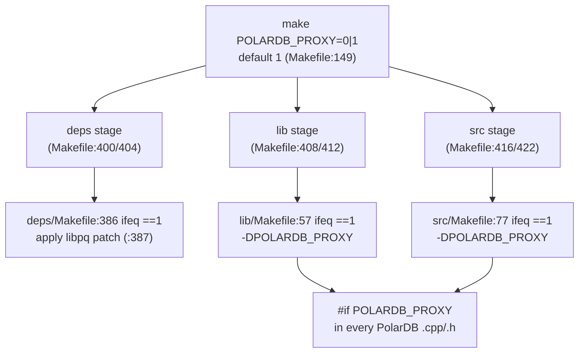
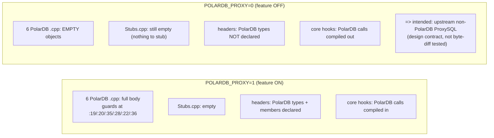
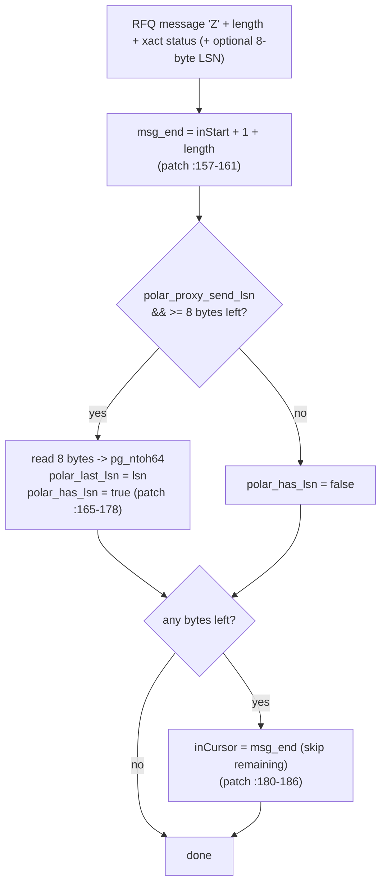
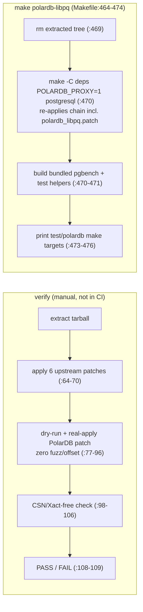

# 02 — Build, Compile Toggle, and libpq RFQ-LSN Patch

> Scope: how the LSN-only PolarDB feature is gated at build time (`POLARDB_PROXY`), why the empty stub translation unit exists, the design contract that both build tiers are equivalent, and the patched libpq that carries the WAL LSN on ReadyForQuery (which parts of the patch are used vs accepted-but-unused, and how the patch is verified/regenerated). | Audience: M (ProxySQL maintainer), C (future contributor) | Status: stable | Prereqs: [01-BACKGROUND-AND-DESIGN.md](01-BACKGROUND-AND-DESIGN.md), [03-TYPES-AND-ENUMS.md](03-TYPES-AND-ENUMS.md) | Verified against: this branch

---

## 1. What this document covers

This document explains two related things:

1. **The compile toggle.** The entire PolarDB feature is behind one switch named `POLARDB_PROXY`. This section shows where the switch lives, how it turns into a C++ macro, how every PolarDB line of code is guarded by it, and why a build with the feature turned off is meant to behave exactly like normal (upstream) ProxySQL.
2. **The libpq patch.** PolarDB read-your-writes consistency needs the proxy to learn the backend's WAL LSN (Log Sequence Number) without sending an extra query. ProxySQL gets it by patching its bundled copy of libpq (the PostgreSQL client C library) so the backend appends the LSN to the ReadyForQuery wire message, and libpq exposes it through three new functions. This section goes through the whole patch, separates what the proxy actually uses from what the patch accepts but never reads, and covers the script that checks the patch still applies.

### 1.1 Terms used in this document (defined on first use)

| Term | Meaning |
|---|---|
| **PolarDB** | An Alibaba PostgreSQL-compatible database with one primary (writer) node and read replicas. The feature in this tree adds read-your-writes routing for it. |
| **LSN (Log Sequence Number)** | A 64-bit position in PostgreSQL's write-ahead log (WAL). A larger LSN means "more recent". A replica that has replayed up to LSN X can serve any read whose data was written at or before X. |
| **WAL (Write-Ahead Log)** | PostgreSQL/PolarDB's append-only log of all changes. Replicas replay it to catch up to the primary. An LSN is a position in this log. |
| **RYW (read-your-writes)** | The guarantee that after a session writes, its own later reads see that write, even when the read goes to a replica. |
| **RFQ (ReadyForQuery)** | The PostgreSQL wire-protocol message a backend sends after each command to say "ready for the next query". The PolarDB patch makes the backend append its current WAL LSN to this message. |
| **libpq** | The official PostgreSQL client C library. ProxySQL bundles its own copy under `deps/postgresql/` and links against it to talk to PostgreSQL/PolarDB backends. |
| **TU (translation unit)** | One `.cpp` source file compiled on its own into one object file. |
| **`POLARDB_PROXY`** | The compile-time switch (a make variable and a C++ macro) that turns the whole PolarDB feature on or off. Default is on (`1`). |
| **conninfo / startup packet** | The connection settings libpq sends to the backend when it opens a connection. The PolarDB params are added to these settings. |
| **GUC** | "Grand Unified Configuration" variable — a PostgreSQL runtime setting changed with `SET name = value`. |

---

## 2. The `POLARDB_PROXY` build toggle

### 2.1 One switch, default on

The whole PolarDB feature is gated by a single make variable. Its default is **on**:

```make
POLARDB_PROXY ?= 1
```

This default lives in the top-level Makefile at `Makefile:149`, with a comment that explains the off case: building with `POLARDB_PROXY=0` compiles the PolarDB code to no-op stubs with "no behavior change vs upstream" (`Makefile:147-148`).

To compile the feature out, build with:

```sh
make POLARDB_PROXY=0
```

### 2.2 How the make variable becomes a C++ macro

The make variable does not directly affect the source. Each compile stage turns `POLARDB_PROXY=1` into the C++ define `-DPOLARDB_PROXY`. A bare `-DPOLARDB_PROXY` defines the macro to the value `1`, which is what the source tests for with `#if POLARDB_PROXY`.

There are two compile stages that build PolarDB code, and each has the same small block:

| Stage | File:line | What it does |
|---|---|---|
| Library compile (`libproxysql.a`) | `lib/Makefile:56-59` | `ifeq ($(POLARDB_PROXY),1)` → set `PSQLPOLAR := -DPOLARDB_PROXY` |
| Binary compile (`proxysql`) | `src/Makefile:76-79` | `ifeq ($(POLARDB_PROXY),1)` → set `PSQLPOLAR := -DPOLARDB_PROXY` |

In the library stage, `PSQLPOLAR` is added to the C++ flags at `lib/Makefile:94` (the `MYCXXFLAGS` line lists `$(PSQLPOLAR)` among the other feature flags). The same pattern wires it into the `src` stage flags.

There is also an optional verbose-trace switch. Setting `POLARDB_DEBUG=1` appends `-DPOLARDB_DEBUG=1` to the same `PSQLPOLAR` flags (`lib/Makefile:60-62`, `src/Makefile:80-82`). That only controls extra tracing (the `POLARDB_TRACE` macro); it does not change behavior and is independent of whether the feature itself is on. This document does not cover the trace output further.

### 2.3 The build pipeline forwards the flag

ProxySQL builds in three stages: `deps` (vendored libraries, including libpq), then `lib` (the core library), then `src` (the final binary). The top-level Makefile passes `POLARDB_PROXY` down into all three so the whole tree builds consistently:

| Forwarded into | File:line |
|---|---|
| `deps` (release / debug) | `Makefile:400`, `Makefile:404` |
| `lib` (release / debug) | `Makefile:408`, `Makefile:412` |
| `src` (release / debug) | `Makefile:416`, `Makefile:422` |

Each of those lines passes `POLARDB_PROXY=$(POLARDB_PROXY)` so the value chosen at the top flows everywhere.

### 2.4 Helper targets

The top-level Makefile adds a few convenience targets:

| Target | File:line | What it does |
|---|---|---|
| `polardb` | `Makefile:441-447` | Build the binary with `POLARDB_PROXY=1` (the release tier, optimized, no trace). The target is named `polardb` (comment at `Makefile:441-443`, recipe at `:444-447`). |
| `polardb-debug` | `Makefile:432-439` | Build with `POLARDB_PROXY=1 POLARDB_DEBUG=1` (verbose PolarDB trace enabled). |
| `polardb-check` | `Makefile:449-462` | Clean-build **both** tiers in sequence and leave the tree at `POLARDB_PROXY=1`. |
| `polardb-libpq` | `Makefile:464-474` | Re-extract PostgreSQL, re-apply the libpq patch stack, rebuild libpq, build bundled PostgreSQL 16 pgbench, and build the PolarDB C helper tests. |

The `polardb-check` target is the one that exercises tier equivalence at the build level. It runs three clean builds: `POLARDB_PROXY=1`, then `POLARDB_PROXY=0` (described in the echo as "stubs"), then `POLARDB_PROXY=1` again to restore the working tree (`Makefile:453-461`). Each build is preceded by `make clean` so objects from one tier never leak into the other. It proves both tiers **compile and link**; it does not byte-compare the two binaries (see §4 for what equivalence is and is not).

ASCII view of the toggle wiring:

```
                      make POLARDB_PROXY=0|1   (default 1, Makefile:149)
                                  |
        +-------------------------+-------------------------+
        |                         |                         |
     deps stage               lib stage                 src stage
  (Makefile:400/404)      (Makefile:408/412)        (Makefile:416/422)
        |                         |                         |
   deps/Makefile             lib/Makefile               src/Makefile
   :386 ifeq ==1             :57 ifeq ==1               :77 ifeq ==1
        |                    -> -DPOLARDB_PROXY          -> -DPOLARDB_PROXY
   apply libpq patch              |                          |
   (:387)                    #if POLARDB_PROXY          #if POLARDB_PROXY
                             in every PolarDB .cpp/.h   in core call sites
```

---

## 3. How the code is gated, and the empty stub TU

### 3.1 Every declaration and every call site is guarded

The feature uses **one** guarding strategy everywhere: both the PolarDB **declarations** (types, struct members, method prototypes) and every core **call site** are wrapped in `#if POLARDB_PROXY`.

- The six PolarDB feature source files guard their **entire body**. With `POLARDB_PROXY=0` each one compiles to an empty object file:

| Feature TU | Whole-body guard at | Lines |
|---|---|---|
| `lib/PgSQL_PolarDB.cpp` | `:19` | 111 |
| `lib/PgSQL_PolarDB_Consistency.cpp` | `:20` | 62 |
| `lib/PgSQL_PolarDB_Wrap.cpp` | `:35` | 449 |
| `lib/PgSQL_PolarDB_Flow.cpp` | `:28` | 1030 |
| `lib/PgSQL_PolarDB_Notices.cpp` | `:22` | 293 |
| `lib/PgSQL_PolarDB_Failure.cpp` | `:36` | 322 |

- The PolarDB declarations in the shared headers (`include/PgSQL_PolarDB.h`, plus the PolarDB members added to `include/PgSQL_Session.h`, `include/PgSQL_Connection.h`, `include/PgSQL_HostGroups_Manager.h`) are themselves under `#if POLARDB_PROXY`. When the feature is off, the PolarDB types and the PolarDB struct members do not exist.
- Every place in the always-compiled core (for example the route hook in `PgSQL_Session.cpp` and the connect/result-processing hooks in `PgSQL_Connection.cpp`) wraps its PolarDB calls in `#if POLARDB_PROXY` too, so those calls disappear when the feature is off.

The list of files carrying `#if POLARDB_PROXY` and the exact hook lines are inventoried in [POLARDB_ARCHITECTURE.md](POLARDB_ARCHITECTURE.md) and [10-SESSION-INTEGRATION.md](10-SESSION-INTEGRATION.md) / [11-CONNECTION-AND-LIBPQ.md](11-CONNECTION-AND-LIBPQ.md). This document only needs the rule itself: **declarations and call sites are guarded together.**

### 3.2 Why there is a stub TU, and why it is empty

`lib/PgSQL_PolarDB_Stubs.cpp` is a seventh PolarDB source file. It is compiled in **both** tiers (it is listed in the always-built object list at `lib/Makefile:113`). Its job is to hold link-time **no-op stubs** for any PolarDB symbol that the always-compiled core might reference when the feature is off.

The pattern such a stub file uses: if some core code calls a PolarDB function **without** wrapping the call in `#if POLARDB_PROXY`, then with `POLARDB_PROXY=0` the linker would still need a definition of that function or the binary would not link. The stub file would provide an empty (do-nothing) definition under `#if !POLARDB_PROXY`.

In this tree that situation does not arise, because of the rule in §3.1: every call site is guarded, so there is no unguarded reference left over when the feature is off. As a result the stub file's body is **intentionally empty**. Its whole active region is:

```cpp
#if !POLARDB_PROXY

// Intentionally empty: ... no always-compiled seam symbol that needs a link-time stub.

#endif // !POLARDB_PROXY
```

That guard and comment are at `lib/PgSQL_PolarDB_Stubs.cpp:28-34`. The file's header comment (`:1-24`) states the contract in full: because both the declarations and every core call site are guarded, the `POLARDB_PROXY=0` build has "no always-compiled seam symbol to stub today," and the build is meant to be byte-for-byte upstream non-PolarDB behavior.

The header also records the **maintenance rule** for the future (`:18-23`): if a later commit ever adds an **unguarded** core reference to a PolarDB symbol, its no-op stub must be added to this file — and that stub must **not** name any PolarDB type, because PolarDB types are undeclared when `POLARDB_PROXY=0`.

ASCII view of the two tiers:

```
POLARDB_PROXY=1  (feature ON)
  PgSQL_PolarDB.cpp ............ full body compiles  (guard #if at :19)
  PgSQL_PolarDB_Consistency.cpp  full body           (:20)
  PgSQL_PolarDB_Wrap.cpp ....... full body           (:35)
  PgSQL_PolarDB_Flow.cpp ....... full body           (:28)
  PgSQL_PolarDB_Notices.cpp .... full body           (:22)
  PgSQL_PolarDB_Failure.cpp .... full body           (:36)
  PgSQL_PolarDB_Stubs.cpp ...... empty (#if !POLARDB_PROXY false)
  headers ...................... PolarDB types + members declared
  core hooks ................... PolarDB calls compiled in

POLARDB_PROXY=0  (feature OFF)
  PgSQL_PolarDB*.cpp (the 6) ... compile to EMPTY objects
  PgSQL_PolarDB_Stubs.cpp ...... still empty (nothing to stub)
  headers ...................... PolarDB types + members NOT declared
  core hooks ................... PolarDB calls compiled OUT
  => intended result: upstream non-PolarDB ProxySQL
```

---

## 4. Both-tier equivalence is a design contract, not a tested fact

The claim "a `POLARDB_PROXY=0` build is byte-equivalent to upstream non-PolarDB ProxySQL" is stated in the source itself (`lib/PgSQL_PolarDB_Stubs.cpp:17` and the surrounding header comment `:10-23`). It is worth being precise about what kind of claim this is.

| Claim | Status |
|---|---|
| Every PolarDB declaration is `#if POLARDB_PROXY` guarded | Design rule, visible in the headers and the stub TU comment. |
| Every PolarDB call site in core code is `#if POLARDB_PROXY` guarded | Design rule, stated in `Stubs.cpp:10-15`. |
| The stub TU is empty because there is no unguarded seam to stub | True in this tree (`Stubs.cpp:28-34`); verified by reading the file. |
| Both tiers **compile and link** | Checked structurally by the `polardb-check` target (`Makefile:449-462`); it clean-builds both. |
| The `POLARDB_PROXY=0` binary is **byte-for-byte** identical to upstream | **Stated as a design contract, NOT build/diff-tested.** No step in this tree compiles both and byte-compares the outputs, and no CI job records such a comparison. |

So: the **mechanism** for equivalence (everything `#if`-guarded plus an empty stub TU) is real and verifiable from source. The **byte-for-byte result** is a contract the code asserts, not something proven by a build-and-diff in this tree. A maintainer who needs byte-equivalence as a hard fact should build both tiers and diff the binaries; the foundation analysis explicitly did not do that build/diff.

Also note: §3.2's "intentionally empty" is true **today**. If a future change introduces an unguarded core reference, the stub file would gain content and the off-tier would differ from a pristine upstream by exactly those no-op stubs — still functionally equivalent, but no longer literally byte-identical. The contract is written to keep that from happening silently.

---

## 5. The libpq RFQ-LSN patch

### 5.1 Where the patch lives and when it is applied

The patch file is `deps/postgresql/polardb_libpq.patch`. ProxySQL bundles its own PostgreSQL source under `deps/postgresql/` and applies a chain of patches to libpq during the `deps` build. The PolarDB patch is applied **last** in that chain, and **only** when `POLARDB_PROXY=1`:

```make
ifeq ($(POLARDB_PROXY),1)
	cd postgresql/postgresql && patch -p0 < ../polardb_libpq.patch
endif
```

This block is at `deps/Makefile:382-388`. The comment there (`:382-385`) states the two facts that matter: the patch is applied **after** `sslkeylogfile.patch` (the last upstream patch, applied at `:381`), and the `ifeq` guard keeps a `POLARDB_PROXY=0` build on **vanilla libpq**. So when the feature is off, libpq is unpatched and there is no PolarDB LSN behavior in the client library at all.

The upstream patch chain that runs before it (in order) is, per `deps/Makefile`: `get_result_from_pgconn`, `handle_row_data`, `fmt_err_msg` (`:378`), `bind_fmt_text` (`:379`), `pqsendpipelinesync` (`:380`), `sslkeylogfile` (`:381`), and then the PolarDB patch (`:387`).

### 5.2 What the patch changes (file by file)

The patch touches five libpq files. The table summarizes each; the detailed description follows.

| libpq file patched | What the patch adds | Patch lines |
|---|---|---|
| `exports.txt` | Exports 3 new public functions as ordinals 188-190 | `:1-10` |
| `libpq-fe.h` | `#include <stdint.h>`; declares the 3 new functions | `:229-252` |
| `libpq-int.h` | New fields on `struct pg_conn`: 3 runtime LSN fields + 11 conninfo option strings | `:254-283` |
| `fe-connect.c` | Registers the 11 conninfo options; converts the send-lsn string to a bool; frees the new strings; writes the params into the startup packet | `:11-145`, `:193-228` |
| `fe-protocol3.c` | The core change: `getReadyForQuery()` reads the LSN appended to RFQ and skips any trailing bytes | `:146-191` |

### 5.3 The three new public functions

The patch exports three functions (the export list change is at `:1-10`, declarations at `:247-249`, implementations at `:121-145`):

| Function | Signature | What it does | Reads/writes (on `struct pg_conn`) | Impl at |
|---|---|---|---|---|
| `PQgetLSN` | `uint64_t PQgetLSN(const PGconn*)` | Return the LSN captured from the most recent RFQ; 0 if none or no connection | reads `polar_last_lsn` | `:121-127` |
| `PQhasLSN` | `int PQhasLSN(const PGconn*)` | Was an LSN present in the most recent RFQ? (1/0) | reads `polar_has_lsn` | `:130-136` |
| `PQsetPolarSendLSN` | `void PQsetPolarSendLSN(PGconn*, int enable)` | Turn the runtime flag that makes the RFQ parser look for an appended LSN on/off | writes `polar_proxy_send_lsn` | `:139-145` |

The header also adds `#include <stdint.h>` so `uint64_t` is available (`:236`). It is `<stdint.h>` (the C header), **not** `<cstdint>`, because `libpq-fe.h` is a C header used by C code.

How ProxySQL uses these (the proxy side, not the patch):

- After a successful connect to a PolarDB hostgroup, ProxySQL calls `PQsetPolarSendLSN(pgsql_conn, 1)` to enable LSN parsing for that connection. The enabling function `polardb_init_connection_tracking()` is **defined** at `lib/PgSQL_Connection.cpp:1325`, and the `PQsetPolarSendLSN(pgsql_conn, 1)` **call** is at `lib/PgSQL_Connection.cpp:1335`. (These are two different lines: `:1325` is the function, `:1335` is the call inside it.) The function only enables LSN parsing when the hostgroup is a PolarDB hostgroup (`:1332`).
- On the response path, ProxySQL reads the LSN with no extra round-trip via `PgSQL_Connection::get_polardb_lsn()` (`lib/PgSQL_Connection.cpp:1349-1360`), which calls `PQhasLSN()` then `PQgetLSN()` (`:1355-1356`).

The full connection/result-processing integration is in [11-CONNECTION-AND-LIBPQ.md](11-CONNECTION-AND-LIBPQ.md) and [09-PUBLISH-AND-WRITE-TRACKING.md](09-PUBLISH-AND-WRITE-TRACKING.md).

### 5.4 The new `struct pg_conn` fields

The patch adds fields to libpq's internal connection struct (`libpq-int.h`, patch `:256-279`). There are two groups.

**Runtime LSN state (3 fields):**

| Field | Type | Purpose |
|---|---|---|
| `polar_proxy_send_lsn` | `bool` | When true, `getReadyForQuery()` looks for an appended LSN |
| `polar_last_lsn` | `uint64` | The LSN read from the last RFQ |
| `polar_has_lsn` | `bool` | Whether the last RFQ carried an LSN |

**Connection-string option strings (11 fields), patch `:266-279`:**

| Group | Fields |
|---|---|
| PG11-style names (work with PolarDB 11 and 15) | `_polar_send_lsn`, `_polar_origin_client_ip`, `_polar_origin_client_port` |
| PG15 aliases | `_polar_proxy_client_host`, `_polar_proxy_client_port`, `_polar_proxy_send_lsn` |
| PG15-only metadata | `_polar_proxy_session_id`, `_polar_proxy_cancel_key`, `_polar_proxy_use_ssl`, `_polar_proxy_ssl_version`, `_polar_proxy_ssl_cipher_name` |

### 5.5 Conninfo registration and lifecycle (`fe-connect.c`)

The 11 option strings are wired into libpq's normal connection-option machinery:

1. **Registered in the option table.** All 11 are added to `PQconninfoOptions[]` (patch `:13-67`). Each entry maps an option name (for example `_polar_send_lsn`) to its field offset in `struct pg_conn`.
2. **Converted to the runtime bool.** In `connectOptions2()` (patch `:68-85`), the send-lsn string is turned into the `polar_proxy_send_lsn` bool. The PG11 name wins over the PG15 alias when both are present: it first checks `_polar_send_lsn`, and only if that is unset checks `_polar_proxy_send_lsn` (patch `:81-84`). The value is true only when the string equals `"true"`.
3. **Freed on close.** All 11 strings are freed in `freePGconn()` (patch `:89-107`) so the connection cleans up.

### 5.6 Startup-packet injection (`fe-connect.c`)

When libpq builds the startup packet, the PolarDB params are written as **direct startup options**, not inside the normal options block, so PolarDB's server-side `ProcessStartupPacket()` can read them. This is in `build_startup_packet()` (patch `:193-228`). The pattern is "prefer the PG11 name; fall back to the PG15 alias" for the send-lsn flag, the client host, and the client port (patch `:202-213`), and a plain "emit if set" for the PG15-only metadata fields (patch `:214-224`). A field is only written if it is non-empty.

### 5.7 The `getReadyForQuery()` change — the core of the feature

The one behavioral change that makes RYW possible is in `getReadyForQuery()` in `fe-protocol3.c` (patch `:146-191`). After libpq's normal RFQ parsing, the patch adds these steps:

1. **Compute the true message end.** It reads the 4-byte network-order length field at `inStart+1` and computes `msg_end = inStart + 1 (type byte) + length_value` (patch `:157-161`). It defines a helper `MSG_REMAINING()` = `msg_end - inCursor` (patch `:163`).
2. **Parse the LSN if requested and present.** It clears `polar_has_lsn`, then — only if `polar_proxy_send_lsn` is set **and** at least 8 bytes remain — reads an 8-byte network-order `uint64`, byte-swaps it with `pg_ntoh64`, stores it in `polar_last_lsn`, and sets `polar_has_lsn = true` (patch `:165-178`).
3. **Skip any unparsed trailing bytes.** If any bytes remain after the LSN, it advances the cursor to the message end: `conn->inCursor = msg_end` (patch `:180-186`).

Step 3 is the important safety step. The boundary check (compute `msg_end` from the length field, then skip to it) lets libpq handle a backend that appends **more or fewer** bytes than the proxy expected, without getting out of sync on the next message. The patch comment (`:180-184`) names the two cases it handles: the backend appending extra fields the proxy did not ask for, and future PolarDB protocol changes. This is the fix for the extended-protocol length mismatch noted in the project memory.

ASCII view of the RFQ parse with the patch:

```
RFQ wire message on a PolarDB backend (read-your-writes enabled):

  +------+------------------+-------------------+------------------+
  | 'Z'  | length (4 bytes) | xact status byte  | LSN (8 bytes)... |
  +------+------------------+-------------------+------------------+
   type   includes itself     normal RFQ field    PolarDB extra

getReadyForQuery() after the patch:
  1. msg_end = inStart + 1 + length         (patch :157-161)
  2. if polar_proxy_send_lsn && >=8 left:
        read 8 bytes -> pg_ntoh64 -> polar_last_lsn ; polar_has_lsn=true
                                                      (patch :165-178)
  3. if any bytes left:  inCursor = msg_end  (skip the rest)
                                                      (patch :180-186)
```

### 5.8 Used vs accepted-but-unused

The patch is broad on purpose: it **accepts** all 11 startup params and **both** send-lsn spellings, but only a small part of that actually changes any behavior. There are two layers to look at.

**Inside libpq** (what the patch acts on):

| Surface | Behavioral effect inside libpq? |
|---|---|
| `_polar_send_lsn` / `_polar_proxy_send_lsn` | YES — converted to `polar_proxy_send_lsn` (patch `:81-84`), which gates the RFQ LSN parse (patch `:167`). |
| The other 9 option strings | NO — they are written verbatim into the startup packet and never read back by libpq. They exist so a PolarDB backend can read them server-side. |

**What this implementation actually emits** when connecting to a PolarDB backend is profile-driven. The function that writes the params is `PgSQL_Connection::append_polardb_startup_params()` (`lib/PgSQL_Connection.cpp:1398-1436`), called from the connect path after it resolves the per-hostgroup/global `proxy_protocol` startup profile:

| Param | Accepted by the patch | Emitted by this tree | Note |
|---|---|---|---|
| `_polar_send_lsn=true` | yes | **YES**, when effective protocol is `legacy` (`PgSQL_Connection.cpp:1435`) | Requests RFQ LSN using the legacy startup dialect. |
| `_polar_origin_client_ip` | yes | **YES**, when effective protocol is `legacy` (`:1433`) | Client/fallback identity passthrough. |
| `_polar_origin_client_port` | yes | **YES**, when effective protocol is `legacy` (`:1434`) | Client/fallback identity passthrough. |
| `_polar_proxy_send_lsn=true` (PG15 alias) | yes | **YES**, when effective protocol is `v15` (`:1428`) | Requests RFQ LSN using the v15 startup dialect. |
| `_polar_proxy_client_host` / `_polar_proxy_client_port` | yes | **YES**, when effective protocol is `v15` (`:1426-1427`) | Client/fallback identity passthrough using v15 names. |
| `_polar_proxy_session_id` / `_polar_proxy_cancel_key` | yes | no | Cancel-routing metadata; unused here. |
| `_polar_proxy_use_ssl` / `_polar_proxy_ssl_version` / `_polar_proxy_ssl_cipher_name` | yes | no | SSL passthrough metadata; unused here. |

So in this LSN-only tree, the proxy emits exactly one three-parameter dialect per RFQ-requesting connection: either v15 (`_polar_proxy_client_host`, `_polar_proxy_client_port`, `_polar_proxy_send_lsn=true`) or legacy (`_polar_origin_client_ip`, `_polar_origin_client_port`, `_polar_send_lsn=true`).
The remaining metadata parameters are accepted by the patch but never emitted here. A grep across `lib/`, `include/`, and `src/` finds no other setter for them in this tree (confirmed).

Why the patch keeps the unused metadata params: it was written once to support both PolarDB 11 and PolarDB 15 startup styles and a larger proxy feature set. This implementation emits the active LSN/client-identity dialect selected by the startup profile, while leaving cancel-routing and SSL metadata for future features.

### 5.9 Related deferred items in this tree (cross-reference)

Two deferred areas connect to the patch's metadata params. They are listed here
for completeness and tracked in
[15-LIMITATIONS-AND-ROADMAP.md](15-LIMITATIONS-AND-ROADMAP.md):

- This implementation has no session-side mirror fields for `_polar_proxy_session_id` /
  `_polar_proxy_cancel_key`. Those parameters are accepted by the libpq patch
  but never emitted by ProxySQL here; a future PolarDB15 cancel-session
  extension should add the session state, generators, startup emission, cancel
  request flow, tests, and docs together.
- The **DEFERRED** lag item elsewhere in the feature is the admin knob `pgsql-polardb_lag_ms`: it has no producer today and accepts only `0`. `PolarDB_LSN_Stale_Count` is active for the separate byte-lag safety path when `max_lag_bytes` is enabled. Neither item is part of the build/libpq surface; details are in [04-ADMIN-SCHEMA-AND-CONFIG.md](04-ADMIN-SCHEMA-AND-CONFIG.md), [12-THREADVARS-AND-OBSERVABILITY.md](12-THREADVARS-AND-OBSERVABILITY.md), and [15-LIMITATIONS-AND-ROADMAP.md](15-LIMITATIONS-AND-ROADMAP.md).

---

## 6. Verifying and regenerating the patch

### 6.1 The verification script

The script `scripts/verify-polardb-libpq-lsn-patch.sh` checks that the PolarDB patch still applies cleanly as the **last** patch on top of the vendored PostgreSQL source plus all upstream libpq patches. It is a standalone tool: a grep across `Makefile`, `deps/Makefile`, `lib/Makefile`, `src/Makefile`, `test/Makefile`, and `.github/` finds **no reference** to it, so nothing in the build or CI runs it automatically — it is meant to be run by hand (for example after changing libpq patches or bumping the PostgreSQL version).

What the script does, in order (`scripts/verify-polardb-libpq-lsn-patch.sh`):

| Step | Lines | Action |
|---|---|---|
| Resolve the tree root | `:22` | Defaults to the parent of `scripts/`; an optional first argument overrides it. |
| Sanity-check inputs | `:40-48` | The patch file, a `postgresql-*.tar.gz` tarball, and all six upstream patch files must exist. |
| Extract to a scratch dir | `:50-62` | Untar PostgreSQL into a temp dir and locate the source root that contains `src/interfaces/libpq`. |
| Apply the 6 upstream patches in order | `:64-70` | `get_result_from_pgconn`, `handle_row_data`, `fmt_err_msg`, `bind_fmt_text`, `pqsendpipelinesync`, `sslkeylogfile` (the order is fixed at `:29-36`). |
| Clean `.orig` residue | `:72-75` | Remove `.orig` files the upstream patches left, so the next check only sees the PolarDB patch's effect. |
| Dry-run the PolarDB patch | `:77-88` | `patch --dry-run`; **fail** if it reports any `fuzz`, `offset`, `FAILED`, or `hunk` problem. The patch must apply perfectly clean. |
| Real-apply the PolarDB patch | `:90-96` | Apply for real and **fail** if it produced any `.orig` file (which would mean fuzz). |
| CSN/Xact-free check | `:98-106` | **Fail** if the patch contains real CSN/Xact tokens (`csn`, `xact`, `xid`, `splittable`, `wal_pending`), allowing only known-safe substrings like `xactStatus`, `PQTRANS`, `exactly`, and `next message`. This enforces that the LSN-only patch carries no transaction-split or CSN content. |
| Result | `:108-109` | Print `PASS` and exit 0, or `fail()` (`:38`) prints `FAIL: ...` and exits non-zero. |

The "must apply with zero fuzz/offset" rule is stricter than a normal `patch` run. It guarantees the committed patch matches the exact upstream-patched baseline it was generated against, so an accidental drift (e.g. a renumbered hunk) is caught.

### 6.2 Regenerating the patch and rebuilding libpq

The `polardb-libpq` make target (`Makefile:464-474`) is the rebuild path:

1. Remove the previously extracted PostgreSQL tree (`Makefile:469`).
2. Rebuild `postgresql` with `POLARDB_PROXY=1`, which re-extracts the tarball and re-applies the whole patch chain including the PolarDB patch (`Makefile:470`; the patch application itself is `deps/Makefile:387`).
3. Build bundled PostgreSQL 16 pgbench and the PolarDB C helper tests (`Makefile:470-471`), then print the `test/polardb/Makefile` run targets for live-cluster execution (`Makefile:473-476`).

The C helpers it builds include `test/polardb/bin/libpq_lsn_test` and `test/polardb/bin/proxysql_extended_protocol_test` (compiled from `test/polardb/test-c/*.c`, linked against the patched `-lpq`). The direct libpq helper exercises the new libpq functions against a real PolarDB cluster using the `POLARDB_*` environment variables. The test details are in [16-TESTING-AND-VALIDATION.md](16-TESTING-AND-VALIDATION.md).

ASCII view of patch verify vs rebuild:

```
verify (manual, not in CI):                 rebuild (make polardb-libpq):
  scripts/verify-polardb-libpq-lsn-patch.sh    Makefile:464-474
    extract tarball                              rm extracted tree (:469)
    apply 6 upstream patches (:64-70)            make -C deps POLARDB_PROXY=1 postgresql (:470)
    dry-run + real-apply PolarDB patch             -> re-applies whole chain
       must be zero fuzz/offset (:77-96)            incl. polardb_libpq.patch (deps/Makefile:387)
    CSN/Xact-free check (:98-106)               build bundled pgbench + test helpers (:470-471)
    PASS / FAIL (:108-109)                       print make targets (:473-476)
```

---

## 7. Build commands and the deployment requirement

### 7.1 Common commands

| Goal | Command |
|---|---|
| Build with the feature on (default) | `make` |
| Build with the feature off (stubs) | `make POLARDB_PROXY=0` |
| Build both tiers and leave on | `make polardb-check` |
| Build release tier explicitly | `make polardb` |
| Build with verbose PolarDB trace | `make polardb-debug` |
| Rebuild patched libpq, bundled pgbench, and PolarDB C helpers | `make polardb-libpq` |
| Verify the patch still applies clean | `scripts/verify-polardb-libpq-lsn-patch.sh` |

### 7.2 The patched libpq is mandatory for RYW

The read-your-writes guarantee depends on the LSN arriving on RFQ, which only happens with the patched libpq. The build wiring makes this exact:

- With `POLARDB_PROXY=1`, the patch is applied (`deps/Makefile:386-388`) and the proxy enables LSN parsing per PolarDB connection (`PgSQL_Connection.cpp:1335`).
- With `POLARDB_PROXY=0`, the `ifeq` guard skips the patch (`deps/Makefile:386-388`), so libpq is **vanilla** and has no `PQgetLSN`/`PQhasLSN`/`PQsetPolarSendLSN` and no RFQ LSN parsing. The whole feature is compiled out anyway.

There is no middle state in a normal build: you cannot get the PolarDB C++ code without the patched libpq, because both are gated by the same `POLARDB_PROXY` switch and built from the same tree. The operational consequence — what RYW needs at deploy time (a genuine PolarDB backend plus this patched libpq) and what happens without it — is covered in [17-OPERATOR-GUIDE.md](17-OPERATOR-GUIDE.md) and [14-INVARIANTS-AND-FAILURE-MODES.md](14-INVARIANTS-AND-FAILURE-MODES.md).

---

## 8. Quick reference

| Fact | Where |
|---|---|
| Toggle default (`POLARDB_PROXY ?= 1`) | `Makefile:149` |
| `-DPOLARDB_PROXY` define (lib / src) | `lib/Makefile:57-58`, `src/Makefile:77-78` |
| Flag forwarded to deps/lib/src | `Makefile:400-422` |
| `polardb-check` (both tiers, clean) | `Makefile:449-462` |
| Stub TU, intentionally empty | `lib/PgSQL_PolarDB_Stubs.cpp:28-34` (contract `:10-23`) |
| Stub TU in always-built object list | `lib/Makefile:113` |
| Byte-equivalence stated as contract | `lib/PgSQL_PolarDB_Stubs.cpp:17` |
| Patch applied last, only if on | `deps/Makefile:382-388` |
| 3 new libpq functions exported | patch `:1-10` (impl `:121-145`, decl `:247-249`) |
| New `pg_conn` fields | patch `:256-279` |
| RFQ LSN parse + skip-remaining | patch `:146-191` (skip `:185-186`) |
| Proxy emits 3 of 11 params | `lib/PgSQL_Connection.cpp:1306-1314` |
| `PQsetPolarSendLSN` definition vs call | def `lib/PgSQL_Connection.cpp:1325`, call `:1335` |
| `get_polardb_lsn()` uses `PQhasLSN`/`PQgetLSN` | `lib/PgSQL_Connection.cpp:1355-1356` |
| Patch verify script | `scripts/verify-polardb-libpq-lsn-patch.sh` (not wired into any build/CI) |
| Patch rebuild target | `Makefile:464-474` |

---

## Appendix: Mermaid diagrams

### A. Toggle wiring (make variable → C++ macro → guards)



### B. Two build tiers



### C. RFQ parse with the libpq patch



### D. Patch verify vs rebuild



---

Verified against this branch.
