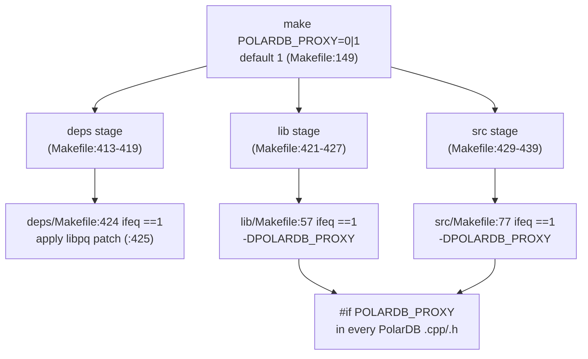
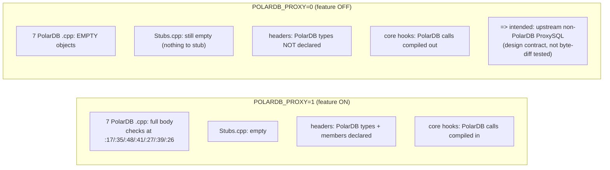
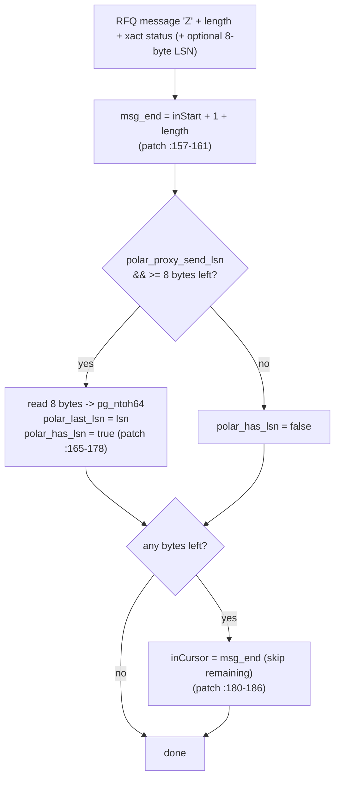
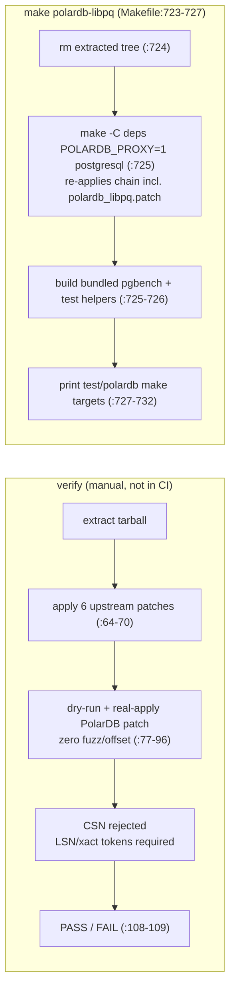

# 02 — Build, Compile Toggle, and libpq RFQ-LSN Patch

> Scope: how PolarDB-specific behavior is controlled by `POLARDB_PROXY`, which generic extended-protocol fixes remain shared, why the stub translation unit is empty, and the patched libpq RFQ/transaction/`W` ABI and wire contract. | Audience: M (ProxySQL maintainer), C (future contributor) | Status: stable | Prereqs: [01-BACKGROUND-AND-DESIGN.md](01-BACKGROUND-AND-DESIGN.md), [03-TYPES-AND-ENUMS.md](03-TYPES-AND-ENUMS.md) | Verified against: this branch

---

## 1. What this document covers

This document explains two related things:

1. **The compile toggle.** PolarDB routing, configuration, counters, startup negotiation, `W`, and patched-libpq calls are behind `POLARDB_PROXY`. Generic extended frame ownership, error boundaries, and RFQ sequencing are deliberately shared by both builds.
2. **The libpq patch.** PolarDB read-your-writes consistency learns WAL LSN and transaction metadata from ReadyForQuery and can stage an in-band `W` with an extended command. This section defines the public ABI, fixed wire layout, and regeneration/verification workflow.

### 1.1 Terms used in this document (defined on first use)

| Term | Meaning |
|---|---|
| **PolarDB** | An Alibaba PostgreSQL-compatible database with one primary (writer) node and read replicas. The feature in this tree adds read-your-writes routing for it. |
| **LSN (Log Sequence Number)** | A 64-bit position in PostgreSQL's write-ahead log (WAL). A larger LSN means "more recent". A replica that has replayed up to LSN X can serve any read whose data was written at or before X. |
| **WAL (Write-Ahead Log)** | PostgreSQL/PolarDB's append-only log of all changes. Replicas replay it to catch up to the primary. An LSN is a position in this log. |
| **RYW (read-your-writes)** | The guarantee that after a session writes, its own later reads see that write, even when the read goes to a replica. |
| **RFQ (ReadyForQuery)** | The PostgreSQL wire-protocol message a backend sends after each command to say "ready for the next query". The PolarDB patch makes the backend append its current WAL LSN to this message. |
| **libpq** | The official PostgreSQL client C library. ProxySQL bundles its own copy under `deps/postgresql/` and links against it to talk to PostgreSQL/PolarDB backends. |
| **TU (translation unit)** | One `.cpp` source file compiled on its own into one object file. |
| **`POLARDB_PROXY`** | The compile-time switch controlling PolarDB-specific runtime surfaces. Default is on (`1`); generic extended-protocol correctness code is not controlled by it. |
| **conninfo / startup packet** | The connection settings libpq sends to the backend when it opens a connection. The PolarDB params are added to these settings. |
| **GUC** | "Grand Unified Configuration" variable — a PostgreSQL runtime setting changed with `SET name = value`. |

---

## 2. The `POLARDB_PROXY` build toggle

### 2.1 One switch, default on

The whole PolarDB feature is enabled by a single make variable. Its default is **on**:

```make
POLARDB_PROXY ?= 1
```

This default lives in the top-level Makefile at `Makefile:150`. Building with `POLARDB_PROXY=0` removes PolarDB routing/configuration/counters/startup/`W`, links vanilla libpq, and keeps generic extended-protocol framing and error-boundary fixes shared. The contract is ordinary PostgreSQL behavioral compatibility, not source or binary identity with upstream.

To compile the feature out, build with:

```sh
make POLARDB_PROXY=0
```

### 2.2 How the make variable becomes a C++ macro

The make variable does not directly affect the source. Each compile stage turns `POLARDB_PROXY=1` into the C++ define `-DPOLARDB_PROXY`. A bare `-DPOLARDB_PROXY` defines the macro to the value `1`, which is what the source tests for with `#if POLARDB_PROXY`.

There are two compile stages that build PolarDB code, and each has the same small block:

| Stage | File:line | What it does |
|---|---|---|
| Library compile (`libproxysql.a`) | `lib/Makefile:58-61` | `ifeq ($(POLARDB_PROXY),1)` → set `PSQLPOLAR := -DPOLARDB_PROXY` |
| Binary compile (`proxysql`) | `src/Makefile:76-79` | `ifeq ($(POLARDB_PROXY),1)` → set `PSQLPOLAR := -DPOLARDB_PROXY` |

In the library stage, `PSQLPOLAR` is added to the C++ flags at `lib/Makefile:102` (the `MYCXXFLAGS` line lists `$(PSQLPOLAR)` among the other feature flags). The same pattern wires it into the `src` stage flags.

There is also an optional verbose-trace switch. Setting `POLARDB_DEBUG=1` appends `-DPOLARDB_DEBUG=1` to the same `PSQLPOLAR` flags (`lib/Makefile:62-64`, `src/Makefile:80-82`). That only controls extra tracing (the `POLARDB_TRACE` macro); it does not change behavior and is independent of whether the feature itself is on. This document does not cover the trace output further.

Two additional **diagnostic** build flags exist, both **default off**, wired the same way in `lib/Makefile:65-70`:

| Flag | Make block | What it adds |
|---|---|---|
| `POLARDB_PROFILE=1` | `lib/Makefile:65-67` → `-DPOLARDB_PROFILE=1` | pool-lock and idle-ping timing counters, plus wrap/reader-acquire/split timing and reader-target / RFQ-candidate diagnostic breakdowns (the `POLARDB_PROFILE_*_COUNTER_LIST` sublists in `include/PgSQL_PolarDB_Counters.h`) |
| `POLARDB_PERF_DEBUG=1` | `lib/Makefile:68-70` → `-DPOLARDB_PERF_DEBUG=1` | direct-frontend writev / plain-send byte/iov/packet histograms and writev skip-reason counters (the `POLARDB_PERF_DEBUG_*_COUNTER_LIST` sublist) |

Neither flag is set in default or production builds, so their counters are compiled out unless you opt in. They only add observability; they do not change routing behavior. The counters each one adds are catalogued in [12-THREADVARS-AND-OBSERVABILITY.md](12-THREADVARS-AND-OBSERVABILITY.md) (profile / perf-debug diagnostic counters); the always-on counter surface is unaffected.

### 2.3 The build pipeline forwards the flag

ProxySQL builds in three stages: `deps` (vendored libraries, including libpq), then `lib` (the core library), then `src` (the final binary). The top-level Makefile passes `POLARDB_PROXY` down into all three so the whole tree builds consistently:

| Forwarded into | File:line |
|---|---|
| `deps` (release / debug) | `Makefile:413-419` |
| `lib` (release / debug) | `Makefile:421-427` |
| `src` (release / debug) | `Makefile:429-439` |

Each of those lines passes `POLARDB_PROXY=$(POLARDB_PROXY)` so the value chosen at the top flows everywhere.

### 2.4 Helper targets

The top-level Makefile adds a few convenience targets:

| Target | File:line | What it does |
|---|---|---|
| `polardb` | `Makefile:506-512` | Build the binary with `POLARDB_PROXY=1` (the release tier, optimized, no trace). |
| `polardb-debug` | `Makefile:467-474` | Build with `POLARDB_PROXY=1 POLARDB_DEBUG=1` (verbose PolarDB trace enabled). |
| `polardb-check` | `Makefile:707-716` | Clean-build **both** tiers in sequence and leave the tree at `POLARDB_PROXY=1`. |
| `polardb-libpq` | `Makefile:723-727` | Re-extract PostgreSQL, re-apply the libpq patch stack, rebuild libpq, build bundled PostgreSQL 16 pgbench, and build the PolarDB C helper tests. |

The `polardb-check` target is the one that exercises tier equivalence at the build level. It runs two clean builds: `POLARDB_PROXY=0`, then `POLARDB_PROXY=1` to leave the working tree at the PolarDB release variant (`Makefile:708-714`). Each build is preceded by `make clean` so objects from one tier never leak into the other. It shows both tiers **compile and link**; it does not byte-compare the two binaries (see §4 for what equivalence is and is not).

ASCII view of the toggle wiring:

```
                      make POLARDB_PROXY=0|1   (default 1, Makefile:149)
                                  |
        +-------------------------+-------------------------+
        |                         |                         |
     deps stage               lib stage                 src stage
  (Makefile:413-419)      (Makefile:421-427)        (Makefile:429-439)
        |                         |                         |
   deps/Makefile             lib/Makefile               src/Makefile
   :424 ifeq ==1             :57 ifeq ==1               :77 ifeq ==1
        |                    -> -DPOLARDB_PROXY          -> -DPOLARDB_PROXY
   apply libpq patch              |                          |
   (:425)                    #if POLARDB_PROXY          #if POLARDB_PROXY
                             in every PolarDB .cpp/.h   in core call sites
```

---

## 3. How the code is controlled, and the empty stub TU

### 3.1 PolarDB-specific declarations and calls are protected

PolarDB-specific declarations, state, and calls are wrapped in `#if POLARDB_PROXY`. The dedicated implementation files cover consistency, failure, flow, notices, protocol, ReaderPool, split, topology, and wrapper behavior; their PolarDB bodies compile only in the enabled tier.

- PolarDB types and members in shared headers are guarded.
- Core routing, connection, monitor, thread-variable, schema, counter, and startup-profile hooks guard their PolarDB calls.
- The bundled libpq patch is applied only in the enabled build.
- Generic `ExtendedQueryFrameState`, implicit-prepare lifecycle, frontend error/RFQ ownership, and related session handlers are intentionally always compiled. They solve PostgreSQL extended-protocol correctness independently of PolarDB and call no PolarDB symbol in the off build.

The exact hook inventory is in [POLARDB_ARCHITECTURE.md](POLARDB_ARCHITECTURE.md), [10-SESSION-INTEGRATION.md](10-SESSION-INTEGRATION.md), and [11-CONNECTION-AND-LIBPQ.md](11-CONNECTION-AND-LIBPQ.md).

### 3.2 Why there is a stub TU, and why it is empty

`lib/PgSQL_PolarDB_Stubs.cpp` is compiled in both tiers. It is reserved for link-time no-op definitions if generic always-compiled code ever needs a PolarDB symbol in the off build. That situation does not arise today, so its active body is intentionally empty:

```cpp
#if !POLARDB_PROXY

// No always-compiled seam symbol needs a link-time stub.
#endif
```

The file header states the actual contract: off mode has no PolarDB runtime surface and links vanilla libpq; generic extended-protocol correctness remains shared. This is behavioral compatibility, not byte identity.

Maintenance rule: if generic code gains an unguarded PolarDB reference, either restore the guard or add a type-independent no-op definition here.

ASCII view of the two tiers:

```
both tiers
  generic extended frame/error/RFQ ownership ........ compiled

POLARDB_PROXY=1
  PolarDB routing/config/counters/startup/W .......... compiled
  bundled libpq ...................................... PolarDB patch applied

POLARDB_PROXY=0
  PolarDB-specific runtime surface ................... absent
  bundled libpq ...................................... vanilla
  ordinary PostgreSQL protocol behavior .............. compatible, not byte-identical
```

---

## 4. Off-build compatibility contract

| Claim | Status |
|---|---|
| PolarDB routing, configuration, counters, startup profiles, and `W` are absent | Source/preprocessor contract. |
| Bundled libpq is vanilla | `deps/Makefile` skips the PolarDB patch when the flag is off. |
| Generic extended frame/error/RFQ fixes remain | Intentional shared correctness behavior. |
| Both tiers compile and link from clean state | Checked by `make polardb-check`. |
| Ordinary PostgreSQL behavior remains compatible | Required behavioral contract; focused off-mode protocol tests should cover it. |
| Binary byte identity with upstream | **Not claimed.** Shared generic fixes make that claim false even when PolarDB functionality is absent. |

Release qualification must therefore use clean dual builds and behavioral protocol tests, not binary comparison.

---

## 5. The libpq RFQ-LSN patch

### 5.1 Where the patch lives and when it is applied

The patch file is `deps/postgresql/polardb_libpq.patch`. ProxySQL bundles its own PostgreSQL source under `deps/postgresql/` and applies a chain of patches to libpq during the `deps` build. The PolarDB patch is applied **last** in that chain, and **only** when `POLARDB_PROXY=1`:

```make
ifeq ($(POLARDB_PROXY),1)
	cd postgresql/postgresql && patch -p0 < ../polardb_libpq.patch
endif
```

This block is at `deps/Makefile:424-426`. The comment there (`:420-423`) states the two facts that matter: the patch is applied **after** `sslkeylogfile.patch` (the last upstream patch, applied at `:419`), and the `ifeq` check keeps a `POLARDB_PROXY=0` build on **vanilla libpq**. So when the feature is off, libpq is unpatched and there is no PolarDB LSN behavior in the client library at all.

The upstream patch chain that runs before it (in order) is, per `deps/Makefile`: `get_result_from_pgconn`, `handle_row_data`, `fmt_err_msg` (`:416`), `bind_fmt_text` (`:417`), `pqsendpipelinesync` (`:418`), `sslkeylogfile` (`:419`), and then the PolarDB patch (`:425`).

### 5.2 What the patch changes (file by file)

The patch touches eight libpq files. The table summarizes each; the detailed description follows.

| libpq file patched | What the patch adds | Patch lines |
|---|---|---|
| `exports.txt` | Exports 10 PolarDB APIs at ordinals 188-194 and 199-201, plus four row-run helpers at 195-198 | patch header |
| `libpq-fe.h` | Declares the row-run, RFQ LSN/xact, and compound `W` send APIs | public declarations near the end of the header |
| `libpq-int.h` | Adds runtime RFQ state, startup option strings, and output-buffer checkpoint helpers | `struct pg_conn` and internal declarations |
| `fe-connect.c` | Registers the 13 conninfo options; converts send-LSN/send-xact strings to bools; frees new strings/state; writes params into the startup packet | startup option handling |
| `fe-exec.c` | Implements the LSN/xact accessors, row-run helpers, and atomic `W` + Parse/Bind/Execute send paths | query-send and result helpers |
| `fe-misc.c` | Adds no-auto-flush message completion and output-buffer checkpoint/restore support for compound sends | output-buffer helpers |
| `fe-protocol3.c` | Parses RFQ LSN/xact metadata, recognizes `W` pipeline results, and skips trailing RFQ bytes | protocol parser |
| `fe-trace.c` | Decodes the fixed-size `W` message for libpq tracing | trace decoder |

### 5.3 The public functions

The patch exports three LSN functions used by this branch's active RYW path:

| Function | Signature | What it does | Reads/writes (on `struct pg_conn`) | Impl at |
|---|---|---|---|---|
| `PQgetLSN` | `uint64_t PQgetLSN(const PGconn*)` | Return the LSN captured from the most recent RFQ; 0 if none or no connection | reads `polar_last_lsn` | `:121-127` |
| `PQhasLSN` | `int PQhasLSN(const PGconn*)` | Was an LSN present in the most recent RFQ? (1/0) | reads `polar_has_lsn` | `:130-136` |
| `PQsetPolarSendLSN` | `void PQsetPolarSendLSN(PGconn*, int enable)` | Turn the runtime flag that makes the RFQ parser look for an appended LSN on/off | writes `polar_proxy_send_lsn` | `:139-145` |

It also exports four transaction-split RFQ helpers used by the transaction-split path:

| Function | Signature | What it does | Reads/writes (on `struct pg_conn`) | Impl at |
|---|---|---|---|---|
| `PQgetXactSplitXids` | `const char *PQgetXactSplitXids(const PGconn*)` | Return the XID list captured from the most recent RFQ, or `NULL` if absent | reads `polar_xact_xids` | `:170-177` |
| `PQisXactSplittable` | `int PQisXactSplittable(const PGconn*)` | Whether the backend reported the open transaction as replica-splittable (`'x'` marker) | reads `polar_xact_splittable` | `:179-186` |
| `PQisXactWalPending` | `int PQisXactWalPending(const PGconn*)` | Whether the backend supplied XIDs but WAL is not safe for replica split yet (`'w'` marker) | reads `polar_xact_wal_pending` | `:188-195` |
| `PQsetPolarSendXact` | `void PQsetPolarSendXact(PGconn*, int enable)` | Turn the runtime flag that makes the RFQ parser look for xact metadata on/off | writes `polar_proxy_send_xact` | `:197-203` |

Three additional APIs stage a versioned `W` wait message together with the
extended-protocol operation that consumes its confirmation. They preserve normal
libpq nonblocking semantics and publish the compound command with one flush:

| Function | Operation composed after `W` | Export ordinal |
|---|---|---|
| `PQsendQueryParamsPolarWait(...)` | unnamed Parse + Bind + Describe + Execute | 199 |
| `PQsendPreparePolarWait(...)` | Parse | 200 |
| `PQsendQueryPreparedPolarWait(...)` | Bind + Describe + Execute | 201 |

#### Authoritative `W` wire layout

After the standard frontend type byte `W` and four-byte length, the payload is exactly:

| Offset in payload | Width | Field | Required value/encoding |
|---:|---:|---|---|
| 0 | 1 | version | `1` |
| 1 | 1 | consistency mode | `PQ_POLAR_CONSISTENCY_BEST_EFFORT` or `PQ_POLAR_CONSISTENCY_STRICT` |
| 2 | 2 | flags | `0`, network byte order |
| 4 | 4 | timeout_ms | unsigned 32-bit, network byte order; `0` means no PolarDB wait deadline |
| 8 | 8 | target_lsn | nonzero unsigned 64-bit, high word then low word in network byte order |

The payload is 16 bytes and the protocol length field is 20 (length field plus payload). The target begins at a wire offset that must not be read through an alignment-dependent cast; the server decoder uses message accessors that copy and convert it. `W` is accepted only after startup negotiation of `_pq_.polar_proxy_wait_v1=1`. That startup field is capability metadata, not cryptographic proxy authentication, so direct backend access still requires network and HBA restrictions.

The header also adds `#include <stdint.h>` so `uint64_t` is available (`:236`). It is `<stdint.h>` (the C header), **not** `<cstdint>`, because `libpq-fe.h` is a C header used by C code.

How ProxySQL uses these (the proxy side, not the patch):

- After a successful connect, `polardb_enable_requested_rfq_parsing()` enables exactly the RFQ payloads negotiated by the connection startup profile (`lib/PgSQL_Connection.cpp:2057-2067`); the `PQsetPolarSendLSN()` call is at `:2062`.
- On the response path, `PgSQL_Connection::get_polardb_lsn()` reads the cached RFQ value with no extra round-trip (`lib/PgSQL_Connection.cpp:2072-2082`); `PQhasLSN()` and `PQgetLSN()` are called at `:2078-2079`.
- The xact helpers back the transaction-split path through the accessors at `lib/PgSQL_Connection.cpp:2096-2116`.
- The three `PQsend*PolarWait` APIs are selected only for negotiated `v15_wait` connections; they append `W` immediately before the semantic extended-protocol operation without adding a network round trip.

The full connection/result-processing integration is in [11-CONNECTION-AND-LIBPQ.md](11-CONNECTION-AND-LIBPQ.md) and [09-PUBLISH-AND-WRITE-TRACKING.md](09-PUBLISH-AND-WRITE-TRACKING.md).

### 5.4 The new `struct pg_conn` fields

The patch adds fields to libpq's internal connection struct (`libpq-int.h`). There are three groups.

**Runtime LSN state (3 fields):**

| Field | Type | Purpose |
|---|---|---|
| `polar_proxy_send_lsn` | `bool` | When true, `getReadyForQuery()` looks for an appended LSN |
| `polar_last_lsn` | `uint64` | The LSN read from the last RFQ |
| `polar_has_lsn` | `bool` | Whether the last RFQ carried an LSN |

**Runtime xact RFQ state (4 fields):**

| Field | Type | Purpose |
|---|---|---|
| `polar_proxy_send_xact` | `bool` | When true, `getReadyForQuery()` looks for xact metadata after the LSN bytes |
| `polar_xact_xids` | `char *` | XID list copied from the last RFQ, when present |
| `polar_xact_splittable` | `bool` | RFQ marker `'x'`: WAL is safe for a replica split read |
| `polar_xact_wal_pending` | `bool` | RFQ marker `'w'`: XIDs are known, but WAL is not safe for a replica split read yet |

**Connection-string option strings (13 fields):**

| Group | Fields |
|---|---|
| PG11-style names (work with PolarDB 11 and 15) | `_polar_send_lsn`, `_polar_send_xact`, `_polar_origin_client_ip`, `_polar_origin_client_port` |
| PG15 aliases | `_polar_proxy_client_host`, `_polar_proxy_client_port`, `_polar_proxy_send_lsn`, `_polar_proxy_send_xact` |
| PG15-only metadata | `_polar_proxy_session_id`, `_polar_proxy_cancel_key`, `_polar_proxy_use_ssl`, `_polar_proxy_ssl_version`, `_polar_proxy_ssl_cipher_name` |

### 5.5 Conninfo registration and lifecycle (`fe-connect.c`)

The 13 option strings are wired into libpq's normal connection-option machinery:

1. **Registered in the option table.** All 13 are added to `PQconninfoOptions[]`. Each entry maps an option name (for example `_polar_send_lsn`) to its field offset in `struct pg_conn`.
2. **Converted to runtime bools.** In `connectOptions2()`, the send-LSN string is turned into `polar_proxy_send_lsn`, and the send-xact string is turned into `polar_proxy_send_xact`. The PG11 name wins over the PG15 alias when both are present. Values are true only when the string equals `"true"`.
3. **Freed on close.** All 13 strings are freed in `freePGconn()`, and the copied `polar_xact_xids` buffer is freed there as connection-owned RFQ state.

### 5.6 Startup-packet injection (`fe-connect.c`)

When libpq builds the startup packet, the PolarDB params are written as **direct startup options**, not inside the normal options block, so PolarDB's server-side `ProcessStartupPacket()` can read them. The pattern is "prefer the PG11 name; fall back to the PG15 alias" for the send-LSN flag, the send-xact flag, the client host, and the client port, and a plain "emit if set" for the PG15-only metadata fields. A field is only written if it is non-empty.

### 5.7 The `getReadyForQuery()` change — the core of the feature

The one behavioral change that makes RYW possible is in `getReadyForQuery()` in `fe-protocol3.c`. After libpq's normal RFQ parsing, the patch adds these steps:

1. **Compute the true message end.** It reads the 4-byte network-order length field at `inStart+1` and computes `msg_end = inStart + 1 (type byte) + length_value`. It defines a helper `MSG_REMAINING()` = `msg_end - inCursor`.
2. **Parse the LSN if requested and present.** It clears `polar_has_lsn`, then — only if `polar_proxy_send_lsn` is set **and** at least 8 bytes remain — reads an 8-byte network-order `uint64`, byte-swaps it with `pg_ntoh64`, stores it in `polar_last_lsn`, and sets `polar_has_lsn = true`.
3. **Parse xact metadata if requested and present.** It clears the previous xact flags and frees the previous XID buffer. If `polar_proxy_send_xact` is enabled and the RFQ has a marker byte, marker `'x'` means the transaction is replica-splittable and marker `'w'` means WAL is still pending; in both cases a NUL-terminated XID list may follow and is copied into connection-owned memory.
4. **Skip any unparsed trailing bytes.** If any bytes remain after the parsed fields, it advances the cursor to the message end: `conn->inCursor = msg_end`.

Step 4 is the important safety step. The boundary check (compute `msg_end` from the length field, then skip to it) lets libpq handle a backend that appends **more or fewer** bytes than the proxy expected, without getting out of sync on the next message. The patch comment names the two cases it handles: the backend appending xact data the proxy did not ask for, and future PolarDB protocol changes.

ASCII view of the RFQ parse with the patch:

```
RFQ wire message on a PolarDB backend (read-your-writes enabled):

  +------+------------------+-------------------+------------------+-----------------------+
  | 'Z'  | length (4 bytes) | xact status byte  | LSN (8 bytes)... | xact marker/XIDs ...  |
  +------+------------------+-------------------+------------------+-----------------------+
   type   includes itself     normal RFQ field    PolarDB extra     staged split metadata

getReadyForQuery() after the patch:
  1. msg_end = inStart + 1 + length
  2. if polar_proxy_send_lsn && >=8 left:
        read 8 bytes -> pg_ntoh64 -> polar_last_lsn ; polar_has_lsn=true
  3. if polar_proxy_send_xact && marker is 'x' or 'w':
        copy NUL-terminated XID list and set the matching xact flag
  4. if any bytes left:  inCursor = msg_end  (skip the rest)
```

### 5.8 Used vs accepted-but-unused

The patch is broad on purpose: it **accepts** all 13 startup params and both spellings of the send-LSN and send-xact flags, but only a small part of that is emitted by this branch. There are two layers to look at.

**Inside libpq** (what the patch acts on):

| Surface | Behavioral effect inside libpq? |
|---|---|
| `_polar_send_lsn` / `_polar_proxy_send_lsn` | YES — converted to `polar_proxy_send_lsn` (patch `:81-84`), which controls the RFQ LSN parse (patch `:167`). |
| `_polar_send_xact` / `_polar_proxy_send_xact` | YES — converted to `polar_proxy_send_xact`, which controls the RFQ xact marker/XID parse. ProxySQL emits it for every non-`off` PolarDB profile; `txn_split_enabled` decides whether result processing observes it for split routing. |
| The other 9 option strings | NO — they are written verbatim into the startup packet and never read back by libpq. They exist so a PolarDB backend can read them server-side. |

**What this implementation actually emits** when connecting to a PolarDB backend is profile-driven. The function that writes the params is `PgSQL_Connection::polardb_append_startup_params()` (`lib/PgSQL_Connection.cpp:1963-2052`), called from the connect path after it resolves the per-hostgroup/global `proxy_protocol` startup profile:

| Param | Accepted by the patch | Emitted by this tree | Note |
|---|---|---|---|
| `_polar_send_lsn=true` | yes | **YES**, when effective protocol is `legacy` (`PgSQL_Connection.cpp:2039-2044`) | Requests RFQ LSN using the legacy startup dialect. |
| `_polar_origin_client_ip` | yes | **YES**, when effective protocol is `legacy` (`:2040`) | Client/fallback identity passthrough. |
| `_polar_origin_client_port` | yes | **YES**, when effective protocol is `legacy` (`:2041`) | Client/fallback identity passthrough. |
| `_polar_proxy_send_lsn=true` (PG15 alias) | yes | **YES**, when effective protocol is `v15` or `v15_wait` (`:2023-2029`) | Requests RFQ LSN using the v15 startup dialect. |
| `_polar_proxy_client_host` / `_polar_proxy_client_port` | yes | **YES**, when effective protocol is `v15` or `v15_wait` (`:2025-2026`) | Client/fallback identity passthrough using v15 names. |
| `_pq_.polar_proxy_wait_v1=1` | yes | **YES**, only for `v15_wait` (`:2033-2034`) | Negotiates server acceptance of the `W` message. |
| `_polar_send_xact=true` / `_polar_proxy_send_xact=true` | yes | when effective protocol is `legacy` or `v15` | Requests transaction-split RFQ evidence at startup; `txn_split_enabled` controls its use in planning and split-read dispatch. |
| `_polar_proxy_session_id` / `_polar_proxy_cancel_key` | yes | no | Cancel-routing metadata; unused here. |
| `_polar_proxy_use_ssl` / `_polar_proxy_ssl_version` / `_polar_proxy_ssl_cipher_name` | yes | no | SSL passthrough metadata; unused here. |

So the proxy emits one identity/LSN dialect per RFQ-requesting connection: either v15 (`_polar_proxy_client_host`, `_polar_proxy_client_port`, `_polar_proxy_send_lsn=true`) or legacy (`_polar_origin_client_ip`, `_polar_origin_client_port`, `_polar_send_lsn=true`). When the PolarDB hostgroup has `txn_split_enabled=1`, it adds the matching xact request key (`_polar_proxy_send_xact=true` or `_polar_send_xact=true`) so result processing can observe split-readable transaction state. The remaining metadata parameters are accepted by the patch but never emitted here.

Why the patch keeps the unused metadata params: it was written once to support both PolarDB 11 and PolarDB 15 startup styles and a larger proxy feature set. This implementation emits the active LSN/client-identity dialect selected by the startup profile, while leaving cancel-routing and SSL metadata for future features.

### 5.9 Related deferred items in this tree (cross-reference)

Two deferred areas connect to the patch's metadata params. They are listed here
for completeness and tracked in
[15-LIMITATIONS-AND-ROADMAP.md](15-LIMITATIONS-AND-ROADMAP.md):

- This implementation has no session-side mirror fields for `_polar_proxy_session_id` /
  `_polar_proxy_cancel_key`. Those parameters are accepted by the libpq patch
  but never emitted by ProxySQL here; a future PolarDB15 cancel-session
  extension should add the session state, generators, startup emission, cancel
  request flow, tests, and docs together.
- The **DEFERRED** lag item elsewhere in the feature is the admin knob `pgsql-polardb_max_reader_lag_ms`: it has no producer today and accepts only `0`. `PolarDB_LSN_Stale_Count` is active for the separate byte-lag safety path when `max_lag_bytes` is enabled. Neither item is part of the build/libpq surface; details are in [04-ADMIN-SCHEMA-AND-CONFIG.md](04-ADMIN-SCHEMA-AND-CONFIG.md), [12-THREADVARS-AND-OBSERVABILITY.md](12-THREADVARS-AND-OBSERVABILITY.md), and [15-LIMITATIONS-AND-ROADMAP.md](15-LIMITATIONS-AND-ROADMAP.md).

---

## 6. Verifying and regenerating the patch

### 6.1 The verification script

The script `scripts/verify-polardb-libpq-lsn-patch.sh` checks that the PolarDB patch still applies cleanly as the **last** patch on top of the vendored PostgreSQL source plus all upstream libpq patches. It is a standalone tool: a grep across `Makefile`, `deps/Makefile`, `lib/Makefile`, `src/Makefile`, `test/Makefile`, and `.github/` finds **no reference** to it, so nothing in the build or CI runs it automatically — it is meant to be run by hand (for example after changing libpq patches or bumping the PostgreSQL version).

What the script does, in order (`scripts/verify-polardb-libpq-lsn-patch.sh`):

| Step | Lines | Action |
|---|---|---|
| Resolve the tree root | `:22` | Defaults to the parent of `scripts/`; an optional first argument overrides it. |
| Sanity-check inputs | `:40-48` | The patch file, a `postgresql-*.tar.gz` tarball, and all six upstream patch files must exist. |
| Extract to a scratch dir | `:50-62` | Untar PostgreSQL into a temp dir and locate the source root that contains `src/interfaces/libpq`. |
| Apply the 6 upstream patches in order | `:64-70` | `get_result_from_pgconn`, `handle_row_data`, `fmt_err_msg`, `bind_fmt_text`, `pqsendpipelinesync`, `sslkeylogfile` (the order is fixed at `:29-36`). |
| Clean `.orig` residue | `:72-75` | Remove `.orig` files the upstream patches left, so the next check only sees the PolarDB patch's effect. |
| Dry-run the PolarDB patch | `:77-88` | `patch --dry-run`; **fail** if it reports any `fuzz`, `offset`, `FAILED`, or `hunk` problem. The patch must apply perfectly clean. |
| Real-apply the PolarDB patch | `:90-96` | Apply for real and **fail** if it produced any `.orig` file (which would mean fuzz). |
| CSN rejection | `:98-101` | **Fail** if the patch contains deferred CSN tokens (`PQgetCSN`, `_polar_send_csn`, `polar_last_csn`, and related names). |
| Required LSN/xact token check | `:103-121` | **Fail** if the patch is missing the active LSN API or xact RFQ API. |
| Result | `:123-124` | Print `PASS` and exit 0, or `fail()` (`:38`) prints `FAIL: ...` and exits non-zero. |

The "must apply with zero fuzz/offset" rule is stricter than a normal `patch` run. It guarantees the committed patch matches the exact upstream-patched baseline it was generated against, so an accidental drift (e.g. a renumbered hunk) is caught.

### 6.2 Regenerating the patch and rebuilding libpq

The committed regeneration path is:

```bash
scripts/regenerate-polardb-libpq-patch.sh --verify
```

The wrapper builds the same upstream-patched PostgreSQL baseline as the verifier, diffs that baseline against the current expanded `deps/postgresql/postgresql` libpq files, replaces `deps/postgresql/polardb_libpq.patch`, and optionally runs the verifier. Use this after editing the expanded vendored libpq files; do not hand-maintain patch hunks.

The `polardb-libpq` make target (`Makefile:723-727`) is the rebuild path:

1. Remove the previously extracted PostgreSQL tree (`Makefile:724`).
2. Rebuild `postgresql` with `POLARDB_PROXY=1`, which re-extracts the tarball and re-applies the whole patch chain including the PolarDB patch (`Makefile:725`; the patch application itself is `deps/Makefile:425`).
3. Build bundled PostgreSQL 16 pgbench and the PolarDB C helper tests (`Makefile:725-726`), then print the `test/polardb/Makefile` run targets for live-cluster execution (`Makefile:727-732`).

The C helpers it builds include `test/polardb/bin/libpq_lsn_test`, `test/polardb/bin/libpq_xact_test`, and `test/polardb/bin/proxysql_extended_protocol_test` (compiled from `test/polardb/test-c/*.c`, linked against the patched `-lpq`). The direct libpq helpers exercise the new libpq functions against a real PolarDB cluster using the `POLARDB_*` environment variables. The test details are in [16-TESTING-AND-VALIDATION.md](16-TESTING-AND-VALIDATION.md).

ASCII view of patch verify vs rebuild:

```
verify (manual, not in CI):                 rebuild (make polardb-libpq):
  scripts/verify-polardb-libpq-lsn-patch.sh    Makefile:723-727
    extract tarball                              rm extracted tree (:724)
    apply 6 upstream patches (:64-70)            make -C deps POLARDB_PROXY=1 postgresql (:725)
    dry-run + real-apply PolarDB patch             -> re-applies whole chain
       must be zero fuzz/offset (:77-96)            incl. polardb_libpq.patch (deps/Makefile:425)
    CSN rejected; LSN/xact tokens required       build bundled pgbench + test helpers (:470-471)
    PASS / FAIL                                  print make targets (:473-476)
```

---

## 7. Build commands and the deployment requirement

### 7.1 Common commands

| Goal | Command |
|---|---|
| Build with the feature on (default) | `make` |
| Build with the feature off (stubs) | `make POLARDB_PROXY=0` |
| Build both tiers and leave on | `make polardb-check` |
| Build release tier explicitly | `make polardb` |
| Build with verbose PolarDB trace | `make polardb-debug` |
| Rebuild patched libpq, bundled pgbench, and PolarDB C helpers | `make polardb-libpq` |
| Regenerate `deps/postgresql/polardb_libpq.patch` from the expanded vendored source | `scripts/regenerate-polardb-libpq-patch.sh --verify` |
| Verify the patch still applies clean | `scripts/verify-polardb-libpq-lsn-patch.sh` |

### 7.2 The patched libpq is mandatory for RYW

The read-your-writes guarantee depends on the LSN arriving on RFQ, which only happens with the patched libpq. The build wiring makes this exact:

- With `POLARDB_PROXY=1`, the patch is applied (`deps/Makefile:424-426`) and the proxy enables requested LSN parsing per PolarDB connection (`PgSQL_Connection.cpp:2057-2063`).
- With `POLARDB_PROXY=0`, the `ifeq` check skips the patch (`deps/Makefile:424-426`), so libpq is vanilla and has no PolarDB LSN/xact/`W` API or RFQ parsing extension. Generic extended-protocol correctness remains compiled in but cannot enter PolarDB routing.

There is no middle state in a normal build: you cannot get the PolarDB C++ code without the patched libpq, because both are enabled by the same `POLARDB_PROXY` switch and built from the same tree. The operational consequence — what RYW needs at deploy time (a genuine PolarDB backend plus this patched libpq) and what happens without it — is covered in [17-OPERATOR-GUIDE.md](17-OPERATOR-GUIDE.md) and [14-INVARIANTS-AND-FAILURE-MODES.md](14-INVARIANTS-AND-FAILURE-MODES.md).

---

## 8. Quick reference

| Fact | Where |
|---|---|
| Toggle default (`POLARDB_PROXY ?= 1`) | `Makefile:149` |
| `-DPOLARDB_PROXY` define (lib / src) | `lib/Makefile:57-58`, `src/Makefile:77-78` |
| Flag forwarded to deps/lib/src | `Makefile:413-439` |
| `polardb-check` (both tiers, clean) | `Makefile:707-716` |
| Stub TU, intentionally empty | `lib/PgSQL_PolarDB_Stubs.cpp:28-34` (contract `:10-23`) |
| Stub TU in always-built object list | `lib/Makefile:121` |
| Byte-equivalence stated as contract | `lib/PgSQL_PolarDB_Stubs.cpp:17` |
| Patch applied last, only if on | `deps/Makefile:424-426` |
| 10 PolarDB libpq APIs exported | 7 RFQ LSN/xact APIs at 188-194 and 3 compound `W` send APIs at 199-201; row-run helpers occupy 195-198 |
| New `pg_conn` fields | patch `:256-279` |
| RFQ LSN parse + skip-remaining | patch `:146-191` (skip `:185-186`) |
| Proxy emits one profile-selected startup dialect | `lib/PgSQL_Connection.cpp:1963-2052` |
| `PQsetPolarSendLSN` connection call | `lib/PgSQL_Connection.cpp:2062` |
| `get_polardb_lsn()` uses `PQhasLSN`/`PQgetLSN` | `lib/PgSQL_Connection.cpp:2078-2079` |
| Patch verify script | `scripts/verify-polardb-libpq-lsn-patch.sh` (not wired into any build/CI) |
| Patch rebuild target | `Makefile:723-727` |

---

## Appendix: Mermaid diagrams

### A. Toggle wiring (make variable → C++ macro → checks)



### B. Two build tiers



### C. RFQ parse with the libpq patch



### D. Patch verify vs rebuild



---

Verified against this branch.
