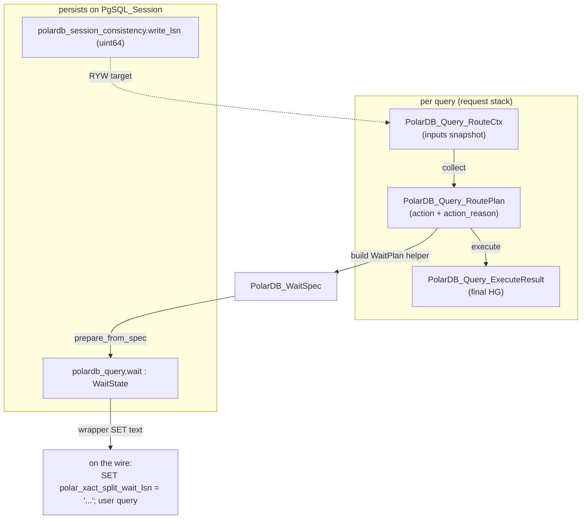
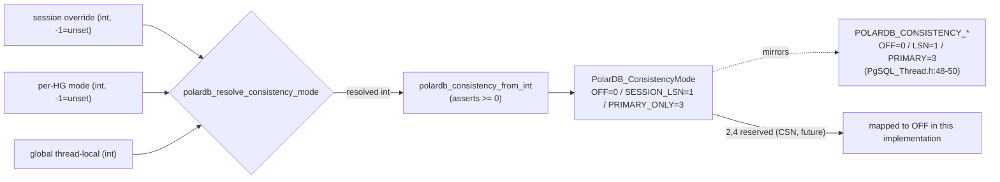
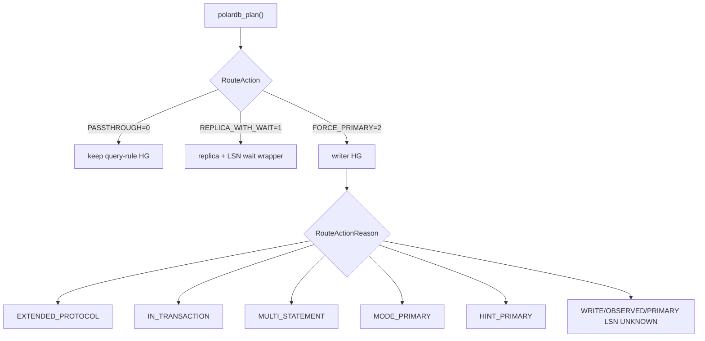

# 03 - Types, Enums, and Constants

> Scope: Every enum, core struct, and constant declared in the PolarDB header `include/PgSQL_PolarDB.h` — their values, meaning, wire mapping, where each is read, plus naming conventions and defaults. | Audience: R/M/O/C | Status: stable | Prereqs: [01-BACKGROUND-AND-DESIGN.md](01-BACKGROUND-AND-DESIGN.md), [02-BUILD-TOGGLE-AND-LIBPQ.md](02-BUILD-TOGGLE-AND-LIBPQ.md) | Verified against: this branch

---

## 1. Overview and where this sits

This document is the type dictionary for the PolarDB read-your-writes (RYW) feature. Everything described here lives in one header, `include/PgSQL_PolarDB.h`. That header holds the enums, the small plain-data structs, the inline policy helper functions, the `PolarDB_Protocol` helper class, and the feature's constants. The runtime logic that *uses* these types lives in the `lib/PgSQL_PolarDB_*.cpp` files and in the integration points on `PgSQL_Session`, `PgSQL_Connection`, and `PgSQL_HostGroups_Manager`.

Terms used in this document, defined once here (the README glossary is the authority for common terms):

- **PolarDB**: an Alibaba PostgreSQL-compatible database with one primary (writer) node and read replicas.
- **LSN (Log Sequence Number)**: a 64-bit position in PostgreSQL's write-ahead log (WAL). A larger LSN means a more recent write. A replica that has replayed up to LSN X can serve any read whose data was committed at or before X.
- **RYW (read-your-writes)**: the guarantee that after a session writes, its own later reads see that write, even when reads go to a replica.
- **RFQ (ReadyForQuery)**: the PostgreSQL wire message a backend sends after each command to say "ready for the next query". A patched PolarDB backend appends its current WAL LSN to RFQ; ProxySQL reads it with no extra round trip.
- **Hostgroup (HG)**: a numbered ProxySQL group of backend servers. A PolarDB replication-hostgroup row pairs a writer HG with a reader HG.
- **Wait wrapper**: a replica-eligible read that ProxySQL prefixes with `SET` statements so the replica blocks until it has replayed past the client's last write LSN before answering.
- **GUC (Grand Unified Configuration variable)**: a PostgreSQL runtime setting changed with `SET name = value`.

The whole header is wrapped in `#if POLARDB_PROXY` (`include/PgSQL_PolarDB.h:82`), so all of these types exist only in a PolarDB build. When `POLARDB_PROXY=0`, none of them are compiled and ProxySQL behaves as upstream (see [02-BUILD-TOGGLE-AND-LIBPQ.md](02-BUILD-TOGGLE-AND-LIBPQ.md)).

The full field-by-field reference for each struct (lifecycle, ownership, thread-safety, written-by / read-by) lives in [POLARDB_STRUCTURES.md](POLARDB_STRUCTURES.md). This document keeps the struct sections short and points there for the long tables.

### How the types fit the request pipeline

```
  per query (request stack)                       persists (session)
  ------------------------                         -------------------
  PolarDB_Query_RouteCtx   --collect-->            PolarDB_SessionConsistency
        |  immutable input snapshot                PolarDB_QueryState
        v
  PolarDB_Query_RoutePlan  --plan-->   action +    reader_plan + wait spec
        |  decision        action_reason             polardb_query.wait : WaitState
        v
  PolarDB_Query_ExecuteResult --execute--> final HG
        |
        v  (wait staged)
  PolarDB_WaitSpec --> PolarDB_Query_WaitState --> wrapper SET text on the wire
                                                     (connection drops the SET results)
```

`PolarDB_Query_RouteCtx` is the immutable input bundle the planner reads.
`PolarDB_Query_WaitPlan` is a helper output inside planning; its `WaitSpec`
is copied into the final `RoutePlan` and then into `QueryState.wait`.
`PolarDB_HealthCheck` is the monitor's parse output. The enums below tag the
state at each step.

---

## 2. Enums

All enums are declared in `include/PgSQL_PolarDB.h`. The table lists each enum, its underlying integer type, its values, what it means, and the file:line of its declaration. Sections 2.1 through 2.10 then give each enum's wire mapping and where the code reads it.

| Enum | Underlying type | Values | Purpose | Declared at |
|------|-----------------|--------|---------|-------------|
| `PolarDB_NodeType` | `int` (default) | UNKNOWN=0, PRIMARY=1, REPLICA=2, STANDBY=3 | Backend role from the `polar_node_type()` health check | `:109` |
| `PolarDB_WaitType` | `uint8_t` | NONE=0, LSN=2 | Kind of consistency wait to apply before a read | `:122` |
| `PolarDB_WaitMode` | `uint8_t` | BEST_EFFORT=1, STRICT=2 | What the replica does on a wait timeout | `:130` |
| `PolarDB_RfqRoutePolicy` | `uint8_t` | BEST_EFFORT=1, STRICT=2 | What routing does when an RFQ-derived target is unknown | `:143` |
| `PolarDB_SessionLsnBaseline` | `uint8_t` | OBSERVED=1, PRIMARY=2 | First-read SESSION_LSN target source | `:155` |
| `PolarDB_ProxyProtocol` | `uint8_t` | OFF=0, LEGACY=1, V15=2 | PolarDB proxy startup parameter dialect | `:183` |
| `PolarDB_StartupIdentitySource` | `uint8_t` | NONE=0, CLIENT=1, LISTENER_PROXY=2, CONFIGURED_FALLBACK=3 | Source of client identity sent in startup params | `:189` |
| `PolarDB_Query_WrapperKind` | `uint8_t` | NONE=0, CONSISTENCY_WAIT=1 | Tags which family of wrapper SETs precedes a query | `:172` |
| `PolarDB_ConsistencyMode` | `uint8_t` | OFF=0, SESSION_LSN=1, PRIMARY_ONLY=3 | Resolved per-session routing mode | `:184` |
| `PolarDB_Query_ConsistencyRouteHint` | `uint8_t` | NONE=0, PRIMARY=1, REPLICA=2 | Advisory hint from the wait helper; not the final route | `:218` |
| `PolarDB_WaitStage` | `uint8_t` | IDLE=0, WAITING=1 | Whether a wait is in flight | `:227` |
| `PolarDB_WrapFinalizeResult` | `uint8_t` | CONTINUE=0, FAILED=1 | Outcome of attaching the wrapper before dispatch | `:240` |
| `PolarDB_ReaderStatus` | `uint8_t` | ACQUIRED=0, READER_UNAVAILABLE, READER_BUSY, RFQ_UNAVAILABLE, PRIMARY_LSN_UNKNOWN, READER_LSN_UNKNOWN, READER_LSN_STALE, READER_LAG_EXCEEDED | Outcome of acquiring a reader for an LSN-targeted query | `:167` |
| `PolarDB_Query_RoutePlan::RouteAction` | `uint8_t` | PASSTHROUGH=0, REPLICA_WITH_WAIT=1, FORCE_PRIMARY=2 | The routing decision | `:835` |
| `PolarDB_Query_RoutePlan::RouteActionReason` | `uint8_t` | NONE=0, EXTENDED_PROTOCOL, IN_TRANSACTION, MULTI_STATEMENT, MODE_PRIMARY, HINT_PRIMARY, WRITE_LSN_UNKNOWN, OBSERVED_LSN_UNKNOWN, PRIMARY_LSN_UNKNOWN | Why the planner forced a replica route or degraded it | `:1253` |

Two of the enums are nested inside the `PolarDB_Query_RoutePlan` struct (`RouteAction`, `RouteActionReason`). The rest are top-level.

### 2.1 `PolarDB_NodeType` (`:109`)

Backend node roles, as reported by the PolarDB SQL function `polar_node_type()`.

| Value | Int | Meaning |
|-------|-----|---------|
| UNKNOWN | 0 | Role not known (e.g. plain PostgreSQL, or parse failure) |
| PRIMARY | 1 | Writer node |
| REPLICA | 2 | Read-only replica on shared storage |
| STANDBY | 3 | Standby node on separate storage |

- **Wire mapping**: parsed from the text of the health-check result column. `PolarDB_Protocol::parse_node_type()` (`:580`) maps `"primary"`/`"master"` to PRIMARY, `"replica"` to REPLICA, `"standby"` to STANDBY, anything else to UNKNOWN.
- **Where read**: the monitor converts it to ProxySQL's `read_only` flag with `PolarDB_Protocol::node_type_to_read_only()` (returns 0 for writer, 1 for reader; `:614`), called at `lib/PgSQL_Monitor.cpp:745`. The helper predicates `is_writer()` (`:598`) and `is_reader()` (`:605`) classify the value.
- **Stored in**: `PolarDB_HealthCheck.node_type` (see §3.1).

### 2.2 `PolarDB_WaitType` (`:122`)

The kind of consistency wait applied to a read before it runs on a replica.

| Value | Int | Meaning |
|-------|-----|---------|
| NONE | 0 | No wait needed |
| LSN | 2 | Wait for a WAL LSN (the `polar_xact_split_wait_lsn` GUC) |

- **Why the value is 2, not 1**: only NONE and LSN exist in this implementation. The value 2 is deliberate — the header comment (`:119-121`) states it "preserves the wire mapping for `polar_xact_split_wait_lsn`". There is no value 1; that slot is reserved so a future commit-sequence-number (CSN) wait type can be added without renumbering. This is a forward-compatibility choice, not an active feature today.
- **Wire mapping**: when `WaitSpec.type == LSN`, `PolarDB_Protocol::append_polar_wait_set()` appends one statement `SET polar_xact_split_wait_lsn = '<target>'; ` to the wrapper. When the type is NONE (or the target is 0) it appends nothing and returns false.
- **Where read**: carried in `PolarDB_WaitSpec` and therefore available as `WaitPlan.spec.type`, `RoutePlan.wait_spec.type`, and `WaitState.spec.type`. Read in the wrapper builder, in the LSN-sent counter bump, in latency accounting, and in timeout accounting.

### 2.3 `PolarDB_WaitMode` (`:130`)

What the replica does when it cannot reach the target LSN before the timeout expires.

| Value | Int | Meaning |
|-------|-----|---------|
| BEST_EFFORT | 1 | Wait up to the timeout, then return possibly-stale data with a WARNING/NOTICE |
| STRICT | 2 | Wait up to the timeout, then raise an ERROR and abort the query |

- **Wire mapping**: the same two values pick the `polar_consistency_mode` GUC word that the wrapper sends. STRICT maps to the backend mode word `strict`; everything else maps to `best_effort`. The word is written by `build_polar_consistency_mode_set()` (`lib/PgSQL_PolarDB_Wrap.cpp:95`). Note the exact source: that function reads the thread-local int `pgsql_thread___polardb_wait_timeout_mode` directly (`lib/PgSQL_PolarDB_Wrap.cpp:96`) and compares it to `STRICT` (`lib/PgSQL_PolarDB_Wrap.cpp:104`); it does not read the per-query `wait_mode` field. The carried `wait_mode` fields below hold the same value, so the result is identical.
- **Source of the value**: the global knob `pgsql-polardb_wait_timeout_mode` (string `best_effort`/`strict`) is parsed into the thread-local int `pgsql_thread___polardb_wait_timeout_mode` (1 or 2). The route context carries it as `wait_timeout_mode` (`include/PgSQL_PolarDB.h:820`), and the planner copies it into the wait plan and wait state.
- **Where read**: carried in `PolarDB_WaitSpec.mode`, copied through `WaitPlan.spec`, `RoutePlan.wait_spec`, and `WaitState.spec`. It changes only the backend's timeout behavior; it does not change the routing decision.

### 2.3a RFQ policy and startup enums

This implementation adds four small enums around RFQ startup and missing-target routing.

`PolarDB_RfqRoutePolicy` backs `pgsql-polardb_route_rfq_policy`:

| Value | Int | Meaning |
|---|---:|---|
| BEST_EFFORT | 1 | Route an eligible read to a reader without an RFQ wait target and record degraded routing |
| STRICT | 2 | Use the writer when no RFQ wait target can be enforced |

`PolarDB_SessionLsnBaseline` backs `pgsql-polardb_session_lsn_baseline`:

| Value | Int | Meaning |
|---|---:|---|
| OBSERVED | 1 | A first read-only SESSION_LSN read with no session target uses ordinary reader routing; its RFQ LSN becomes the observed target if present |
| PRIMARY | 2 | A first read tries to seed its target from the replication group's primary LSN mirror |

`PolarDB_ProxyProtocol` backs the global `pgsql-polardb_proxy_protocol` knob and the per-HG `pgsql_replication_hostgroups.proxy_protocol` column:

| Value | Int | Startup params |
|---|---:|---|
| OFF | 0 | no PolarDB proxy params |
| LEGACY | 1 | `_polar_origin_client_ip`, `_polar_origin_client_port`, `_polar_send_lsn=true` |
| V15 | 2 | `_polar_proxy_client_host`, `_polar_proxy_client_port`, `_polar_proxy_send_lsn=true` |

`PolarDB_StartupIdentitySource` records where the identity used in those startup params came from: no identity, client endpoint, listener/local proxy endpoint, or the configured fallback. RFQ-requesting profiles require a valid non-wildcard identity before connection creation proceeds.

The startup profile request bits are `REQUEST_RFQ_LSN`, `REQUEST_RFQ_CSN`, and `REQUEST_RFQ_XID`. They describe what ProxySQL requested in the startup packet. They do not confirm that the backend will send those RFQ payloads; confirmation comes later from result RFQs that actually carry LSN.

### 2.4 `PolarDB_Query_WrapperKind` (`:172`)

Tags which family of prepended `SET` statements precedes the user's query, so the connection layer knows what it is skipping.

| Value | Int | Meaning |
|-------|-----|---------|
| NONE | 0 | No PolarDB wrapper SET results to consume |
| CONSISTENCY_WAIT | 1 | A mode + timeout + wait-target SET prefix precedes the user query |

- **Wire mapping**: not on the wire itself. It is a tag used to coordinate the session and the connection. CONSISTENCY_WAIT is set after the wrapper is installed (`lib/PgSQL_PolarDB_Wrap.cpp:242`), copied to the connection's `dispatch_state.wrapper_kind` (`lib/PgSQL_Connection.cpp:1725`), then reset to NONE on the session (`lib/PgSQL_Connection.cpp:1727`).
- **Where read**: passed into `PolarDB_Query_WrapState.begin(...)` at `query_start()` so the connection's result loop knows it is in a consistency-wait wrap (`lib/PgSQL_Connection.cpp:1442-1443`).

### 2.5 `PolarDB_ConsistencyMode` (`:184`)

The resolved per-session routing mode. This is the enum the planner switches on to pick the routing branch. It is the result of the 3-tier resolution (session override > per-HG > global).

| Value | Int | Meaning |
|-------|-----|---------|
| OFF | 0 | No PolarDB consistency routing; query rules decide routing |
| SESSION_LSN | 1 | Track this session's write LSN; wait on a replica before a read |
| PRIMARY_ONLY | 3 | Route all reads to the writer (no replica reads) |

- **No value 2**: the gap is deliberate. Value 2 is reserved for a future per-session CSN mode, and value 4 for a future global CSN mode. Those are not present in this implementation. The enum's underlying values are the same integers used as the resolved config value, which is why the gap matters for forward compatibility.
- **Matching int constants**: `POLARDB_CONSISTENCY_OFF=0`, `POLARDB_CONSISTENCY_LSN=1`, `POLARDB_CONSISTENCY_PRIMARY=3` in `include/PgSQL_Thread.h:48-50`. These plain ints are used wherever an `int` plus a `-1` "unset" sentinel is needed (config tiers); the enum is used in the planner. They intentionally mirror each other.
- **Wire mapping**: not directly on the wire. The mode picks the routing branch in the planner; the resulting wait behavior reaches the backend through the three wrapper GUCs, not as a single mode value.
- **Conversion**: `polardb_consistency_from_int(int v)` (`:192`) turns a resolved int into the typed enum. It asserts `v >= 0` (the caller must already have resolved the `-1` "unset" sentinel) and maps any unsupported value (including the reserved 2 and 4) to OFF.
- **Where read**: the route context holds the resolved int `effective_consistency_mode` (`:819`). The planner converts it at `lib/PgSQL_PolarDB_Flow.cpp:246` and branches on it: PRIMARY_ONLY (`:249`), OFF (`:260`), SESSION_LSN falls through to the wait-plan path (`:305`).

### 2.6 `PolarDB_Query_ConsistencyRouteHint` (`:218`)

An advisory hint produced by the wait helper. It is **not** the final route. The planner still decides the route after checking query rules, transaction state, protocol shape, reader availability, and lag.

| Value | Int | Meaning |
|-------|-----|---------|
| NONE | 0 | The consistency policy has no routing preference |
| PRIMARY | 1 | The consistency mode itself requires the writer (a hard requirement from the mode) |
| REPLICA | 2 | The consistency policy allows a replica with the wait payload (informational only) |

- **Wire mapping**: none. Purely internal advice.
- **Where set**: `PolarDB_Query_WaitPlan::build_consistency()` sets it — PRIMARY for PRIMARY_ONLY mode (`:478`), REPLICA when the default HG is a reader (`:474`).
- **Where read**: stored on `PolarDB_Query_WaitPlan.route_hint`. The planner inspects the PRIMARY case at `lib/PgSQL_PolarDB_Flow.cpp:308-313` (a defensive branch; see §2.6 note below).
- **Note**: in this implementation this hint's PRIMARY branch in the planner is effectively unreachable, because PRIMARY_ONLY already returns earlier at `lib/PgSQL_PolarDB_Flow.cpp:249`. The header documents the hint as advisory and keeps the branch as a safety net. This is recorded as a defensive/dead path in [15-LIMITATIONS-AND-ROADMAP.md](15-LIMITATIONS-AND-ROADMAP.md).

### 2.7 `PolarDB_WaitStage` (`:227`)

Whether a consistency wait is currently in flight. This drives wrap-state filtering.

| Value | Int | Meaning |
|-------|-----|---------|
| IDLE | 0 | No wait active |
| WAITING | 1 | Wait prefix staged; the connection is filtering SET results before the user result |

- **Wire mapping**: none.
- **Where set**: set to WAITING in `polardb_execute()` (`lib/PgSQL_PolarDB_Flow.cpp:722`) when a replica-with-wait route is taken; reset to IDLE on each new query and on reset (via `PolarDB_Query_WaitState.reset()`).
- **Where read**: the session helper `polardb_wait_active()` returns true when the stage is WAITING (`include/PgSQL_Session.h:735`); the notice path checks it (`lib/PgSQL_PolarDB_Notices.cpp:129`).

### 2.8 `PolarDB_WrapFinalizeResult` (`:240`)

The outcome of trying to attach the wait wrapper to the query just before it is sent to the backend.

| Value | Int | Meaning |
|-------|-----|---------|
| CONTINUE | 0 | Safe to run: either no wrapper was needed, or the wrapper attached successfully |
| FAILED | 1 | A replica-with-wait route was chosen but the wrapper could not be attached; the caller must NOT run the original query unwrapped on the replica |

- **Wire mapping**: none.
- **Where returned**: `finalize_wait_timeout_injection()` returns CONTINUE on success and on the no-wait case (`lib/PgSQL_PolarDB_Wrap.cpp:201`, `:204`, `:252`); the failure helper `fail_wait_wrap_finalize()` returns FAILED (`lib/PgSQL_PolarDB_Wrap.cpp:197`).
- **Where read**: the session checks for FAILED at `lib/PgSQL_Session.cpp:3596` and sends a clean error then ends the request — this is the wrapping-step safety path: the read stops instead of being sent unwrapped to a replica.

### 2.10 `RouteAction` and `RouteActionReason` (nested in `PolarDB_Query_RoutePlan`)

These two enums are declared inside the `PolarDB_Query_RoutePlan` struct (`:835` and `:841`). The planner sets them to record its decision: `RouteAction` is what to do, `RouteActionReason` is why that action was selected.

**`RouteAction`** — the routing decision:

| Value | Int | Meaning |
|-------|-----|---------|
| PASSTHROUGH | 0 | No PolarDB override; the caller keeps the HG chosen by query rules (or pins `target_hg` if set) |
| REPLICA_WITH_WAIT | 1 | Route the read to a replica and prepend the LSN-wait wrapper. The only action that produces a wait wrapper |
| FORCE_PRIMARY | 2 | Override the target to the writer HG, carrying a consistency/safety RouteActionReason |

**`RouteActionReason`** — why a replica route was rejected (recorded on a FORCE_PRIMARY plan):

| Value | Int | Meaning | Set at |
|-------|-----|---------|--------|
| NONE | 0 | No action reason (default) | (default) |
| EXTENDED_PROTOCOL | 1 | Extended protocol has a session RYW target; this implementation cannot wait-wrap Parse/Bind/Execute | `lib/PgSQL_PolarDB_Flow.cpp` |
| IN_TRANSACTION | 2 | Inside an explicit transaction; the LSN feature is autocommit-only | `lib/PgSQL_PolarDB_Flow.cpp` |
| MULTI_STATEMENT | 3 | Multi-statement read; never offloaded to a replica | `lib/PgSQL_PolarDB_Flow.cpp` |
| MODE_PRIMARY | 4 | Consistency mode is PRIMARY_ONLY | `lib/PgSQL_PolarDB_Flow.cpp` |
| HINT_PRIMARY | 5 | The query carried a `/* route=primary */` first-comment hint | `lib/PgSQL_PolarDB_Flow.cpp` |
| WRITE_LSN_UNKNOWN | 6 | A prior writer query completed without RFQ LSN; automatic LSN-mode reads follow `route_rfq_policy` until a primary-sourced RFQ clears the latch | `lib/PgSQL_PolarDB_Flow.cpp` |
| OBSERVED_LSN_UNKNOWN | 7 | A tracked SESSION_LSN read completed without RFQ LSN; later automatic reads use the RFQ route policy until a primary-sourced RFQ clears the latch | `lib/PgSQL_PolarDB_Flow.cpp` |
| PRIMARY_LSN_UNKNOWN | 8 | `session_lsn_baseline=primary` was requested, but the primary mirror has no LSN | `lib/PgSQL_PolarDB_Flow.cpp` |

- **Wire mapping**: none. These tag the in-process decision. Under `pgsql-polardb_route_rfq_policy=strict`, unknown-LSN cases produce `FORCE_PRIMARY`; under `best_effort`, they produce `PASSTHROUGH` to a reader with `degraded_rfq_route=true`.
- **Lag-cap failures are not planner action reasons.** The planner attaches a `PolarDB_Query_ReaderPlan`; `get_MyConn_polardb_reader()` later reports `PolarDB_ReaderStatus::PRIMARY_LSN_UNKNOWN`, `READER_LSN_UNKNOWN`, `READER_LSN_STALE`, or `READER_LAG_EXCEEDED` for acquisition-time safety failures.
- **Where read**: `polardb_execute()` reads `plan.action` to set the final HG and to decide whether to stage the wait (`lib/PgSQL_PolarDB_Flow.cpp:394-400` for FORCE_PRIMARY). The action reason is carried on the plan for the trace line and for [06-ROUTING-PIPELINE.md](06-ROUTING-PIPELINE.md)'s decision matrix.
- **Future split extension**: the future transaction-split feature adds a `REPLICA_TXN_SPLIT` action and split-specific action reasons to this same route-plan family. See [19-FUTURE-TXN-SPLIT-DESIGN.md](19-FUTURE-TXN-SPLIT-DESIGN.md).

---

## 3. Core structs

These are all plain value types — no virtual methods, no internal locks. Their thread-safety comes from where they live (request stack, session, or connection), documented fully in [POLARDB_STRUCTURES.md](POLARDB_STRUCTURES.md). This section gives a brief description, the fields, and the file:line of each. The struct relationships are shown in the §1 diagram.

| Struct | Scope | Built by | Declared at |
|--------|-------|----------|-------------|
| `PolarDB_HealthCheck` | stack (monitor) | `parse_polardb_full_health_check()` | `:256` |
| `PolarDB_WaitSpec` | value copy | `PolarDB_WaitSpec::lsn()` / `WaitPlan::build_consistency()` | wait payload shape |
| `PolarDB_Query_WaitPlan` | request helper | `PolarDB_Query_WaitPlan::build_consistency()` | consistency helper output |
| `PolarDB_Query_WaitState` | session query state | `prepare_from_spec()` in execute | in-flight wait runtime |
| `PolarDB_StartupProfile` | connection | `build_polardb_startup_profile()` | startup protocol and `REQUEST_RFQ_*` bits requested on a backend connection |
| `PolarDB_Query_RouteCtx` | request stack | `polardb_collect()` | `:811` |
| `PolarDB_Query_RoutePlan` | request stack | `polardb_plan()` | `:834` |
| `PolarDB_Query_ExecuteResult` | request stack | `polardb_execute()` | `:867` |

The 64-bit WAL position type used by these structs is `XLogRecPtr`, a `typedef uint64_t` with `InvalidXLogRecPtr = 0` and a helper `XLogRecPtrIsInvalid()` (`:101-103`).

### 3.1 `PolarDB_HealthCheck` (`:256`)

The output of one health check. Built by `parse_polardb_full_health_check()` (`lib/PgSQL_PolarDB.cpp:75`) from the three columns of `POLARDB_CHECK_WITH_LSN_QUERY`, consumed by the monitor.

| Field | Type | Default | Meaning |
|-------|------|---------|---------|
| `node_type` | `PolarDB_NodeType` | UNKNOWN | Role, from `polar_node_type()` (col 0) |
| `is_available` | `bool` | `true` | False = node in maintenance mode, from `polar_is_available()` (col 1) |
| `current_lsn` | `uint64_t` | 0 | Current WAL position (col 2) |

`is_available` defaults to true so a plain PostgreSQL backend (which has no maintenance concept) is treated as available. Read by the monitor at `lib/PgSQL_Monitor.cpp:746` (availability) and `:747` (LSN).

### 3.2 `PolarDB_WaitSpec`

| Field | Type | Default | Meaning |
|-------|------|---------|---------|
| `type` | `PolarDB_WaitType` | NONE | LSN today, or NONE |
| `target` | `uint64_t` | 0 | Target value to wait for (LSN today; CSN can widen here later) |
| `timeout_ms` | `uint32_t` | `POLARDB_DEFAULT_WAIT_TIMEOUT_MS` (1000) | Resolved wait timeout |
| `mode` | `PolarDB_WaitMode` | BEST_EFFORT | Wait behavior preference |

`WaitSpec` is the immutable wait payload shape. It has no runtime fields and
does not decide routing. Planning builds it, execute copies it into
`polardb_query.wait`, and the wrapper renderer turns it into backend SETs.

### 3.3 `PolarDB_Query_WaitPlan`

The consistency helper output inside `polardb_plan()`. The final route plan
copies only the `spec`; the `route_hint` remains a planning recommendation.

| Field | Type | Default | Meaning |
|-------|------|---------|---------|
| `spec` | `PolarDB_WaitSpec` | default spec | Wait payload shape |
| `route_hint` | `PolarDB_Query_ConsistencyRouteHint` | NONE | Advisory hint only |

It has a `reset()` method. The `route_hint` is the helper's recommendation, not the final route (see §2.6).

### 3.4 `PolarDB_Query_WaitState` (`:356`)

The in-flight wait state for one wrapped read. Prepared from a `PolarDB_Query_WaitPlan` before dispatch, this is what drives wrap-state filtering. Lives on the session as `polardb_query.wait`.

| Field | Type | Default | Meaning |
|-------|------|---------|---------|
| `spec` | `PolarDB_WaitSpec` | default spec | Wait payload copied from the sealed route plan |
| `wait_stage` | `PolarDB_WaitStage` | IDLE | IDLE or WAITING |
| `wrapper_stmts` | `uint32_t` | 0 | Number of prepended SET results to skip before the user result |
| `wait_started_at_us` | `uint64_t` | 0 | Monotonic start time; doubles as the latency base and the de-dup guard |
| `wrapper_finalized` | `bool` | false | True after the wait wrapper is finalized |
| `timeout_error` | `bool` | false | True after a structured strict wait-timeout ERROR |
| `fallback_writer_hg` | `int` | -1 | Writer HG for retrying this failed wait read |
| `original_query` | `std::string` | empty | The original user query, captured before wrapping |

It has `reset()` and `prepare_from_spec(const PolarDB_WaitSpec&)`. The
`wait_started_at_us` field is the de-dup guard: it is zeroed on first
accounting, so 0 means "no active wait or already accounted" (see
[08-WAIT-TIMEOUT-AND-NOTICES.md](08-WAIT-TIMEOUT-AND-NOTICES.md)).

### 3.5 `PolarDB_Query_RouteCtx` (`:811`)

All inputs for the routing decision, filled once per query by `polardb_collect()` and immutable after. Request-stack scoped only — never persisted across an async boundary (header comment `:808-810`). The full per-field table (with the exact set-by line for each) is in [POLARDB_STRUCTURES.md](POLARDB_STRUCTURES.md); a brief version:

| Field | Type | Default | Meaning |
|-------|------|---------|---------|
| `writer_scope` | `PolarDB_WriterScope` | invalid | Current writer hostgroup + epoch from topology |
| `session` | `PolarDB_SessionConsistency` | empty | Value snapshot of this session's write/observed LSNs and missing-LSN latches |
| `wait_timeout_ms` | `uint32_t` | 1000 | Resolved wait timeout (HG or global) |
| `reader_hg` | `int` | -1 | Reader HG (-1 if none) |
| `effective_consistency_mode` | `int` | 0 | Resolved once: session > HG > global |
| `wait_timeout_mode` | `int` | BEST_EFFORT (1) | Best-effort vs strict |
| `max_lag_bytes` | `int` | -1 | Reader byte-lag cap; -1 = use thread default |
| `is_polar_hg` | `bool` | false | From the HGM cache |
| `replica_eligible` | `bool` | false | From query rules (`qpo->replica_eligible`) |
| `is_multi_statement` | `bool` | false | Semicolon-scan safety guard |
| `is_extended_protocol` | `bool` | false | Parse/Bind/Execute -> no wait wrapper |
| `in_transaction` | `bool` | false | Inside an explicit transaction |
| `force_primary_hint` | `bool` | false | `/* route=primary */` first-comment hint |

Note for readers of the decision matrix in [06-ROUTING-PIPELINE.md](06-ROUTING-PIPELINE.md): there is no "current query is a write" field here. The route decision uses the session target, `route_ctx.session.target()`, which is `max(write_lsn, observed_lsn)`. The write/read classification of the *current* query (`is_write_query()`) is used only on the result-processing path, never in the route decision.

### 3.6 `PolarDB_Query_RoutePlan` (`:834`)

The routing decision produced by `polardb_plan()` and consumed by `polardb_execute()`. Request-stack scoped only. Contains the two nested enums (§2.10).

| Field | Type | Default | Meaning |
|-------|------|---------|---------|
| `wait_spec` | `PolarDB_WaitSpec` | default spec | Wait payload for REPLICA_WITH_WAIT |
| `reader` | `PolarDB_Query_ReaderPlan` | default reader plan | Reader acquisition requirements |
| `target_hg` | `int` | -1 | Final HG (-1 = caller keeps current) |
| `action` | `RouteAction` | PASSTHROUGH | The routing decision |
| `action_reason` | `RouteActionReason` | NONE | Why a replica route was forced |
| `degraded_rfq_route` | `bool` | `false` | Best-effort reader route taken without an enforceable RFQ wait target (set by `rfq_unavailable()` under `route_rfq_policy=best_effort`; read in `polardb_execute()` to bump the `rfq_best_effort_degraded_routes` counter and emit the degraded-route notice/warning) |

### 3.7 `PolarDB_Query_ExecuteResult` (`:867`)

The result of `polardb_execute()`. Holds the final HG after any execute-time fallback (execute may override `plan.target_hg`). Request-stack scoped.

| Field | Type | Default | Meaning |
|-------|------|---------|---------|
| `final_target_hg` | `int` | -1 | Final hostgroup after fallback |
| `executed_action` | `PolarDB_Query_RoutePlan::RouteAction` | PASSTHROUGH | The action actually applied |

### 3.8 `PolarDB_Protocol` (helper class, `:575`)

Not a data struct — a class of all-static parsing and formatting helpers, holding no state. Listed here for completeness because it lives in the same header. Its methods are referenced throughout this document: `parse_node_type` (`:580`), `is_writer` (`:598`), `is_reader` (`:605`), `node_type_to_read_only` (`:614`), `parse_is_available` (`:622`), `parse_lsn_string` (`:635`), `is_write_query` (declared `:661`, defined `lib/PgSQL_PolarDB.cpp:102`), `append_polar_wait_set` (`:671`), and `append_polar_timeout_set` (`:691`).

### 3.9 `PolarDB_Query_ReaderPlan` and `PolarDB_ReaderResult` (reader acquisition pair)

These two value types are the input/output pair of consistency-target reader acquisition (`get_MyConn_polardb_reader()`). They are referenced in §2.10, §3.6 (the `RoutePlan.reader` field), and in [10-SESSION-INTEGRATION.md](10-SESSION-INTEGRATION.md). The full per-field reference lives in [POLARDB_STRUCTURES.md](POLARDB_STRUCTURES.md); this is a short additive note on the members the wait-bypass path touches.

`PolarDB_Query_ReaderPlan` — the per-query reader acquisition requirements the planner attaches to the route plan and execute copies into `polardb_query.reader_plan`. Its consistency-target members name the target and the reader-side check explicitly:

| Member | Kind | Meaning |
|--------|------|---------|
| `consistency_target_lsn` | `uint64_t` field | The session consistency target this read must reach. `0` means no target. |
| `has_consistency_target_lsn()` | predicate | True when `consistency_target_lsn > 0`; the hot-path condition that decides whether to use the LSN-aware reader getter. |
| `reader_lsn_reaches_consistency_target(reader_lsn)` | predicate | True when a candidate reader's fresh cached LSN is at or beyond `consistency_target_lsn`. Used to build the target-reached prefix. |

`PolarDB_ReaderResult` — the typed outcome of `get_MyConn_polardb_reader()`. It carries the acquired connection (if any), a `PolarDB_ReaderStatus`, and the wait-bypass authorization bit:

| Field | Type | Default | Meaning |
|-------|------|---------|---------|
| `conn` | `PgSQL_Connection*` | `nullptr` | The acquired reader connection, or null on a non-`ACQUIRED` status |
| `srv` | `PgSQL_SrvC*` | `nullptr` | The acquired reader's server container, set together with `conn` on an `ACQUIRED` status; null otherwise |
| `status` | `PolarDB_ReaderStatus` | (see §2 row) | Outcome of the acquisition (ACQUIRED, safety status, or transient pool status) |
| `wait_bypass_allowed` | `bool` | `false` | True only when the selected reader came from the fresh **target-reached prefix** (its cached LSN already reaches `consistency_target_lsn`). The session may then skip the wait wrapper for this specific reader; the staged wait would be a no-op. For any reader **not** from that prefix it stays `false` and the wait wrapper remains the read-your-writes correctness gate. See [06-ROUTING-PIPELINE.md](06-ROUTING-PIPELINE.md) §E.3, [07-QUERY-WRAPPING.md](07-QUERY-WRAPPING.md) §4.5, and [14-INVARIANTS-AND-FAILURE-MODES.md](14-INVARIANTS-AND-FAILURE-MODES.md) I9. |

`acquired()` is the predicate for `status == ACQUIRED`. The wait-bypass mechanics (the two session bypass paths, the `PolarDB_Wait_Wrap_Bypassed` counter) are in [10-SESSION-INTEGRATION.md](10-SESSION-INTEGRATION.md) §4.3 and [12-THREADVARS-AND-OBSERVABILITY.md](12-THREADVARS-AND-OBSERVABILITY.md).

---

## 4. Constants and defaults

| Constant | Value | Type | Declared at | Purpose |
|----------|-------|------|-------------|---------|
| `POLARDB_LSN_WAIT_TIMEOUT_DETAIL` | `"polar_proxy_lsn_wait_timeout"` | `const char*` | `:94` | The stable structured marker the backend puts in the error/notice detail field for a proxy LSN wait timeout. ProxySQL matches this instead of human-readable text |
| `XLogRecPtr` | `uint64_t` | typedef | `:101` | PostgreSQL WAL position type, carried through unchanged |
| `InvalidXLogRecPtr` | `0` | macro | `:102` | The "no LSN" sentinel |
| `POLARDB_DEFAULT_WAIT_TIMEOUT_MS` | `1000` | `uint32_t` | `:135` | Default wait timeout (1 second). Used as the default for `wait_timeout_ms` on every wait struct |
| `POLARDB_DEBUG` | `0` (default) | macro | `:66` | Build-time switch for opt-in numbered FSM tracing |
| `POLARDB_CONSISTENCY_OFF` | `0` | `int` | `PgSQL_Thread.h:48` | Mirrors `PolarDB_ConsistencyMode::OFF` for config-tier ints |
| `POLARDB_CONSISTENCY_LSN` | `1` | `int` | `PgSQL_Thread.h:49` | Mirrors `PolarDB_ConsistencyMode::SESSION_LSN` |
| `POLARDB_CONSISTENCY_PRIMARY` | `3` | `int` | `PgSQL_Thread.h:50` | Mirrors `PolarDB_ConsistencyMode::PRIMARY_ONLY` |

The `POLARDB_TRACE(...)` macro (`:77`) expands to `proxy_info(...)` only in a `POLARDB_PROXY && POLARDB_DEBUG` build and to a no-op `do {} while (0)` otherwise (`:79`), so it costs nothing in a release build. Build a trace binary with `make polardb-debug`. Details in [02-BUILD-TOGGLE-AND-LIBPQ.md](02-BUILD-TOGGLE-AND-LIBPQ.md).

### Inline policy helpers (header-only, side-effect free)

The header also carries the deterministic policy helpers used by the planner. They are listed here because they define the meaning of several enum/constant interactions; their full logic is covered in [04-ADMIN-SCHEMA-AND-CONFIG.md](04-ADMIN-SCHEMA-AND-CONFIG.md), [05-MONITOR-AND-HGM-LSN-STATE.md](05-MONITOR-AND-HGM-LSN-STATE.md), and [06-ROUTING-PIPELINE.md](06-ROUTING-PIPELINE.md).

| Helper | Declared at | One-line role |
|--------|-------------|---------------|
| `polardb_consistency_from_int(int)` | `:192` | Resolved int -> `PolarDB_ConsistencyMode` (unsupported -> OFF) |
| `polardb_resolve_wait_timeout_ms(int hg, int global)` | `:417` | Tri-state HG timeout resolution (-1 inherit / 0 indefinite / >0 explicit) |
| `polardb_resolve_consistency_mode(int sess, int hg, int global)` | `:435` | 3-tier mode resolution (returns -1 only if all inputs are -1) |
| `PolarDB_Query_WaitPlan::build_consistency(mode, session_lsn, timeout_ms, wait_mode, prefer_replica)` | header | Build a `PolarDB_Query_WaitPlan` from the resolved session target and wait policy |
| `polardb_lsn_cache_fresh(updated_at_us, now_us, freshness_ms)` | `:525` | Is a cached LSN timestamp still fresh |
| `polardb_lag_ms_within_cap(lag_us, max_lag_ms)` | `:544` | **DEFERRED** ms-lag predicate (see §6) |
| `PolarDB_Query_ReaderPlan::within_byte_cap(replica_lsn)` | `:1604` | Byte-lag safety cap predicate (ReaderPlan member; compares `replica_lsn` against the plan's stored `primary_lsn` + `max_lag_bytes`) |
| `polardb_should_update_monitor_lsn(monitor_lsn_updates, observed_lsn)` | `:564` | Should a monitor health result update the per-server LSN cache |

There is one more `polardb_resolve_wait_timeout_ms(int hg_timeout_ms)` declared as a non-inline free function (`:764`, defined in `lib/PgSQL_PolarDB_Consistency.cpp:30`) — a one-argument wrapper that resolves against the global thread-local. Do not confuse it with the two-argument inline helper above.

---

## 5. Naming conventions

The PolarDB types follow consistent rules. Knowing the rules makes the names predictable.

| Rule | Pattern | Examples |
|------|---------|----------|
| Type prefix | `PolarDB_` on every enum, struct, and the protocol class | `PolarDB_NodeType`, `PolarDB_HealthCheck`, `PolarDB_Protocol` |
| Per-query types | `PolarDB_Query_` infix for anything scoped to one query | `PolarDB_Query_RouteCtx`, `PolarDB_Query_RoutePlan`, `PolarDB_Query_WaitState`, `PolarDB_Query_WaitPlan`, `PolarDB_QueryState`, `PolarDB_Query_ExecuteResult`, `PolarDB_Query_WrapperKind`, `PolarDB_Query_ConsistencyRouteHint` |
| Enum values | `UPPER_SNAKE_CASE` | `REPLICA_WITH_WAIT`, `BEST_EFFORT`, `SESSION_LSN` |
| Struct/field names | `snake_case` | `write_lsn`, `wait_timeout_ms`, `wait_started_at_us` |
| Constants/macros | `UPPER_SNAKE_CASE` with a `POLARDB_` prefix | `POLARDB_DEFAULT_WAIT_TIMEOUT_MS`, `POLARDB_LSN_WAIT_TIMEOUT_DETAIL` |
| Free functions | `polardb_` prefix, `snake_case` | `polardb_collect`, `polardb_resolve_consistency_mode`, `PolarDB_Query_WaitPlan::build_consistency` |
| Session fields | `polardb_` prefix on `PgSQL_Session` members | `polardb_session_consistency.write_lsn`, `polardb_query.wait`, `polardb_wait_disabled` |

---

## 6. Deferred and forward-compatibility notes

These items appear in the header but are deferred, reserved, or otherwise special in this implementation. They belong in [15-LIMITATIONS-AND-ROADMAP.md](15-LIMITATIONS-AND-ROADMAP.md); they are flagged here because they touch the types and constants.

| Item | Where | Status |
|------|-------|--------|
| `polardb_lag_ms_within_cap()` | header `:544` | **DEFERRED**. The header carries a `TODO` (`:536`): "wire only after PgSQL/PolarDB has a real millisecond-lag producer." There is no millisecond-lag producer in this implementation, so this predicate is not used as a routing gate. Today the supported lag gate is the byte cap (`PolarDB_Query_ReaderPlan::within_byte_cap`) |
| Millisecond replica lag (`polardb_lag_ms` knob) | header comment `:504-507` | **DEFERRED**. The header states the PgSQL/PolarDB path does not produce a per-reader time-lag value yet, and that the full implementation has the same gap. The runtime variable accepts only `0` in this implementation and has no behavioral effect |
| `PolarDB_LSN_Stale_Count` counter | reader-acquisition counter | **ACTIVE for byte-lag safety**. It increments when an enabled `max_lag_bytes` check cannot trust a primary or reader LSN sample. It is not a millisecond-lag signal; that producer remains deferred. See [12-THREADVARS-AND-OBSERVABILITY.md](12-THREADVARS-AND-OBSERVABILITY.md) |
| `PolarDB_WaitType` value 1 reserved | enum `:122` | Forward-compat: the gap (NONE=0, LSN=2) reserves value 1 for a future CSN wait type. Not active in this implementation |
| `PolarDB_ConsistencyMode` values 2 and 4 reserved | enum `:184` | Forward-compat: values 2 (per-session CSN) and 4 (global CSN) are reserved; `polardb_consistency_from_int()` maps them to OFF today. Not active in this implementation |
| `PolarDB_WaitSpec.target` | struct comment | Forward-compat: LSN today; future CSN can widen this single wait payload boundary when implemented |
| `proxy_protocol=auto` version helpers | future feature | Not present in this implementation. Future automatic protocol selection should be per replication group / hostgroup, not process-global |

CSN (commit sequence number) is a future, experimental capability. It is not in this tree at all; it requires PolarDB backend support, applies only in a global-consistency mode, and its wait behavior is not reliably verified. The reserved enum values above are the only trace of it in this implementation. See [18-FUTURE-CSN-DESIGN.md](18-FUTURE-CSN-DESIGN.md).

---

## 7. Notes for reviewers

- **One header, one gate.** Every type here is inside `#if POLARDB_PROXY` (`:82`). There is no partial compilation: in a `POLARDB_PROXY=0` build none of these symbols exist.
- **Enum value gaps are deliberate.** `PolarDB_WaitType` skips 1; `PolarDB_ConsistencyMode` skips 2 and 4. Both gaps reserve room for CSN. A reviewer should not "tidy" them — the values are tied to forward compatibility and (for `WaitType`) a wire mapping.
- **Two parallel constant sets that must stay in sync.** `PolarDB_ConsistencyMode` (enum) and `POLARDB_CONSISTENCY_*` (ints in `PgSQL_Thread.h:48-50`) intentionally mirror each other. The enum is used in the planner; the ints carry a `-1` "unset" sentinel through the config tiers. `polardb_consistency_from_int()` (`:192`) is the one bridge and it asserts the input is already resolved (`>= 0`).
- **Hints are not routes.** `PolarDB_Query_ConsistencyRouteHint` and `PolarDB_Query_WaitPlan.route_hint` are advisory. The final route is always `PolarDB_Query_RoutePlan.action`. The header repeats this in several comments (`:204-217`, `:326-329`).
- **"is-write" trap in the route context.** `PolarDB_Query_RouteCtx` has no "current query is a write" flag. The decision matrix uses the session target, `route_ctx.session.target()`, which can come from a positioned write or from a fresher positioned read observation. Keep this distinction explicit when reading [06-ROUTING-PIPELINE.md](06-ROUTING-PIPELINE.md).
- **Counter count.** There are 26 exported PolarDB stat counters plus one internal `polardb_active` gate. The gate is an `atomic<bool>`, not a `fetch_add` counter. See [12-THREADVARS-AND-OBSERVABILITY.md](12-THREADVARS-AND-OBSERVABILITY.md).

---

## Appendix: Mermaid diagrams

### Type flow through the request pipeline



### Consistency mode resolution and its int mirror



### Route plan actions and action reasons



---

Verified against this branch.
