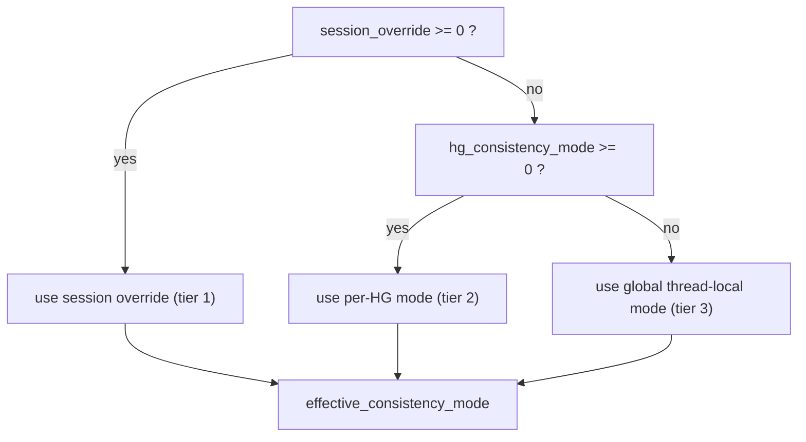
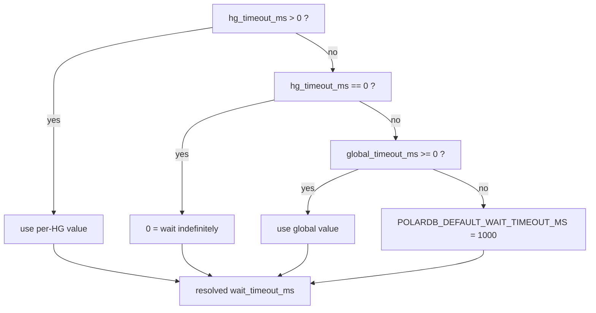

# 04 - Admin Schema and Configuration Model

> Scope: the `pgsql_replication_hostgroups` columns that drive LSN routing, the global `pgsql-polardb_*` knobs, this feature's RFQ startup/routing policy, mode resolution, and the admin load/persist path. | Audience: R/M/O/C | Status: stable | Prereqs: [01-BACKGROUND-AND-DESIGN.md](01-BACKGROUND-AND-DESIGN.md), [03-TYPES-AND-ENUMS.md](03-TYPES-AND-ENUMS.md), [05-MONITOR-AND-HGM-LSN-STATE.md](05-MONITOR-AND-HGM-LSN-STATE.md) | Verified against: this branch

---

## 1. Scope and where this sits

This document describes how an operator configures the PolarDB read-your-writes (RYW) feature, and how that configuration flows from on-disk SQLite tables into the per-query routing decision.

Term definitions used throughout are defined once here; the project glossary in `README.md` is the authority for this documentation set:

- **PolarDB** - an Alibaba PostgreSQL-compatible database with one primary (writer) node and read replicas.
- **LSN (Log Sequence Number)** - a 64-bit position in PostgreSQL's write-ahead log (WAL). A larger LSN means "more recent". A replica that has replayed up to LSN X can serve any read whose data was committed at or before X.
- **RYW (read-your-writes)** - the guarantee that after a session writes, its own later reads see that write even when reads go to a replica.
- **Hostgroup (HG)** - a numbered group of backend servers in ProxySQL. A PolarDB replication-hostgroup row pairs a `writer_hostgroup` (primary) with a `reader_hostgroup` (replicas).
- **Knob / admin variable** - a `pgsql-polardb_*` runtime setting an operator changes with `SET pgsql-... = ...; LOAD PGSQL VARIABLES TO RUNTIME;`.
- **Thread-local** - a per-OS-thread copy (`__thread` storage in C++) of a knob, read on the hot path with no lock.
- **GUC** - a PostgreSQL runtime setting (Grand Unified Configuration variable) changed with `SET name = value`.

There are two configuration surfaces:

1. **Per-hostgroup policy**, stored in the writable admin table `pgsql_replication_hostgroups` (one row per writer/reader pair).
2. **Global knobs**, stored as `pgsql-polardb_*` admin variables and mirrored into thread-local copies the routing code reads.

Both feed resolution steps (Section 5) that produce the effective consistency
mode, wait timeout, lag cap, RFQ routing policy, session target, and backend
startup profile used around a single query.

```
  admin SQLite tables                       routing pipeline (per query)
  ===================                       ============================

  pgsql_replication_hostgroups  --commit--> HGM repl_config / topology maps --+
   (writer/reader + LSN policy)                                               |
                                                                              v
  pgsql-polardb_* admin vars --refresh--> pgsql_thread___polardb_* (thread)  resolvers
   (global knobs)                                                             |
                                                                              v
  client SET proxysql.polardb_consistency_mode --> session override ---------+--> effective
                                                                                  mode/timeout/cap
```

The whole feature is enabled by the compile flag `POLARDB_PROXY` (default `1`). When `POLARDB_PROXY=0`, the schema, knobs, and resolvers below are not compiled and the tables keep their plain upstream shape. The build toggle itself is covered in [02-BUILD-TOGGLE-AND-LIBPQ.md](02-BUILD-TOGGLE-AND-LIBPQ.md); this document only notes where each schema/knob branches on the flag.

---

## 2. The `pgsql_replication_hostgroups` schema

### 2.1 Current PolarDB schema

The enabled build selects `ADMIN_SQLITE_TABLE_PGSQL_REPLICATION_HOSTGROUPS_V3_0_9_V15_WAIT`; the off build selects the four-column upstream `V3_0_2` table. The runtime mirror and HGM schema must use the same shape.

| Column | Type / CHECK | Default | Meaning |
|---|---|---|---|
| `writer_hostgroup` | nonnegative INT, primary key | none | writer hostgroup |
| `reader_hostgroup` | nonnegative INT, unique, different from writer | none | reader hostgroup |
| `check_type` | `read_only` or `polardb` | `read_only` | enables PolarDB policy for the pair |
| `txn_split_enabled` | 0 or 1; 1 requires `check_type=polardb` | 0 | enables simple-query transaction split |
| `consistency_mode` | `default`, `off`, `eventual`, `session_lsn`, `global_lsn` | `default` | per-hostgroup consistency policy |
| `max_lag_bytes` | INT | -1 | reader byte-lag cap; -1 inherits, 0 disables |
| `lsn_wait_timeout_ms` | INT | -1 | wait timeout; -1 inherits, 0 disables only the PolarDB deadline |
| `proxy_protocol` | `default`, `v15_wait`, `v15`, `legacy`, `off` | `default` | backend startup dialect; `v15_wait` negotiates `W` |
| `comment` | text | empty | operator comment |

The LSN and startup columns affect routing only when `check_type=polardb`. `GLOBAL_LSN` is WAL-position consistency, not CSN. CSN values are absent. When `POLARDB_PROXY=0`, the table keeps the upstream four-column shape and no PolarDB policy can be configured.

### 2.2 Startup profile implications

`legacy`, `v15`, and `v15_wait` request RFQ LSN metadata. Transaction split additionally requests RFQ XID metadata. Only `v15_wait` negotiates `_pq_.polar_proxy_wait_v1=1` and may receive an extended frontend `W`. A target-bearing extended request on any other profile fails closed to the writer.

---

## 3. Global configuration and hot-path copies

### 3.1 Coherent profiles and individual settings

`pgsql-polardb_profile` selects a coherent policy bundle. The factory profile is `session_fallback`: SESSION_LSN, replica read target, primary fallback for unavailable evidence or wait timeout, replica-then-primary on connection loss, `v15` startup, monitor LSN updates enabled, and demand split warmup enabled.

The current registry in `lib/PgSQL_Thread.cpp` is authoritative. Core policy settings are:

| Admin variable (`pgsql-...`) | Default | Meaning |
|---|---|---|
| `polardb_profile` | `session_fallback` | coherent policy bundle |
| `polardb_consistency_mode` | `session_lsn` | `off`, `eventual`, `session_lsn`, or `global_lsn` |
| `polardb_read_target` | `replica` | normal automatic read placement |
| `polardb_action_read_fallback` | `primary` | primary or error when reader placement cannot be satisfied |
| `polardb_action_lsn_timeout` | `primary` | primary, warning, or error after a structured LSN wait timeout |
| `polardb_action_missing_lsn` | `primary` | primary, warning, or error when required LSN evidence is unavailable |
| `polardb_action_replica_loss` | `replica_then_primary` | retry target after connection loss |
| `polardb_action_replica_error` | `primary` | action for retryable replica SQL errors |
| `polardb_proxy_protocol` | `v15` | `v15_wait`, `v15`, `legacy`, or `off` |
| `polardb_lsn_wait_timeout_ms` | `1000` | backend LSN wait timeout |
| `polardb_max_reader_lsn_gap_bytes` | `0` | byte-lag cap; 0 disables |
| `polardb_reader_lsn_max_age_ms` | `5000` | normal cached-reader-LSN freshness |
| `polardb_lag_cap_freshness_ms` | `250` | stricter freshness used with a finite byte-lag cap |
| `polardb_monitor_lsn_updates` | `true` | monitor may publish LSN observations |
| `polardb_lazy_warmup_split` | `true` | demand warmup for empty split-reader pools |

Additional registry entries control ReaderPool ranking/retention, output coalescing, row-run/direct-write experiments, warmup capacity, and startup identity. Their names, ranges, and defaults come from the variable registry and `POLARDB_DEFAULT_PROFILE_DEFINITION`; do not copy historical knob names from older branches.

### 3.2 Resolution and worker-local access

Consistency resolves in this order:

```
session override (-1 means unset)
        -> per-hostgroup consistency_mode (`default` means unset)
        -> worker-local global configuration
```

Per-hostgroup wait timeout and byte-lag cap resolve over their worker-local global defaults. Startup protocol resolves per hostgroup over the worker-local startup profile. Config commits parse words once and publish typed values to worker-local snapshots; query routing does not lock the global variable registry or reparse strings.

The live enum is:

```
OFF=0, SESSION_LSN=1, GLOBAL_LSN=2, EVENTUAL=3
```

`SESSION_LSN` waits on the session target. `GLOBAL_LSN` raises it to the current group LSN and cannot degrade to a target-free reader. `EVENTUAL` permits reader placement without an LSN wait. Writer-only placement is configured independently through `polardb_read_target=primary` or selected by a safety/fallback action.

### 3.3 Validation at commit

Schema CHECK constraints reject invalid per-hostgroup words. The variable registry rejects invalid global words and ranges. Runtime commit validates cross-field policy, including impossible GLOBAL_LSN degradation and SESSION_LSN with `proxy_protocol=off`, and warns or rejects according to the owning configuration boundary. Startup identity fields are capability metadata, not authentication; direct backend access remains restricted by network and HBA policy.

---

## 4. From configuration text to routing values

Configuration is parsed and validated before publication. Query workers consume integer and boolean snapshots; they do not parse strings, take the admin lock, or consult SQLite on the query path.

### 4.1 Canonical public values

| Setting | Accepted values |
|---|---|
| `polardb_profile` | `off`, `eventual`, `session_warning`, `session_fallback`, `session_error`, `global_fallback`, `global_error`, `custom` |
| `polardb_consistency_mode` | `off`, `eventual`, `session_lsn`, `global_lsn` |
| `polardb_read_target` | `primary`, `replica` |
| `polardb_action_read_fallback` | `primary`, `error` |
| `polardb_action_missing_lsn` | `primary`, `warning`, `error` |
| `polardb_action_lsn_timeout` | `warning`, `primary`, `error`, `disconnect` |
| `polardb_action_replica_loss` | `replica_then_primary`, `replica_then_error`, `primary`, `error`, `disconnect` |
| `polardb_action_replica_error` | `primary`, `error`, `disconnect` |
| `polardb_proxy_protocol` | `v15_wait`, `v15`, `legacy`, `off` |

The parser table is `polardb_profile_settings()` in `include/PgSQL_PolarDB.h`. A named profile expands to one complete policy bundle. Changing a profile-owned setting individually changes the profile to `custom`; a named profile may not be committed with settings that disagree with its definition.

### 4.2 Hostgroup row parsing

A row with `check_type='polardb'` is the topology opt-in. The loader parses its per-hostgroup `consistency_mode`, `max_lag_bytes`, `lsn_wait_timeout_ms`, `proxy_protocol`, and `txn_split_enabled` fields. `default` or the schema sentinel means inherit. Invalid combinations are rejected before the topology snapshot is published.

`proxy_protocol=v15_wait` is required when an extended request with a non-zero target is to use a reader. `v15`, `legacy`, and `off` may still serve target-free or eventual traffic, but a target-bearing extended request fails closed to the writer.

### 4.3 Global publication and worker copies

`PgSQL_Threads_Handler` owns the committed global bundle. `LOAD PGSQL VARIABLES TO RUNTIME` parses a complete candidate, validates it, then publishes it under the existing thread-variable version mechanism. Each worker refreshes `pgsql_thread___polardb_*` values when it observes the version change. The per-query pipeline therefore reads worker-local plain values.

## 5. Resolution rules

### 5.1 Consistency mode: three tiers

`polardb_resolve_consistency_mode()` resolves:

1. session override from `SET proxysql.polardb_consistency_mode`, when present;
2. per-hostgroup `consistency_mode`, when not `default`;
3. global `pgsql-polardb_consistency_mode`.

The resolved value is one of `OFF`, `EVENTUAL`, `SESSION_LSN`, or `GLOBAL_LSN`. Writer placement is not a consistency enum: `pgsql-polardb_read_target=primary` independently selects the writer and records `READ_TARGET_PRIMARY`.

### 5.2 Wait timeout: two tiers

`polardb_resolve_wait_timeout_ms()` uses the per-hostgroup `lsn_wait_timeout_ms` when configured, otherwise `pgsql-polardb_lsn_wait_timeout_ms`. Zero means no PolarDB-specific wait deadline; cancellation, `statement_timeout`, disconnect, and shutdown can still end the command.

The complete timeout outcome is global/profile-owned through `pgsql-polardb_action_lsn_timeout`. `warning` derives backend `best_effort`; `primary`, `error`, and `disconnect` derive backend `strict`, then ProxySQL applies the configured outcome.

### 5.3 Byte-lag cap: two tiers

Per-hostgroup `max_lag_bytes >= 0` overrides `pgsql-polardb_max_reader_lsn_gap_bytes`; `-1` inherits and `0` disables the cap. Reader freshness uses `pgsql-polardb_reader_lsn_max_age_ms` and `pgsql-polardb_lag_cap_freshness_ms`. The reserved `pgsql-polardb_max_reader_lag_ms` accepts only zero because no trustworthy millisecond-lag producer is implemented.

### 5.4 Missing LSN and first-read behavior

`pgsql-polardb_action_missing_lsn` owns missing required evidence:

| Action | Result |
|---|---|
| `primary` | use the writer |
| `warning` | allow the explicitly degraded simple-query reader path and emit a warning |
| `error` | fail the request without backend execution |

`GLOBAL_LSN` rejects `warning`, and extended unknown-target requests do not degrade because there is no target to encode in `W`. There is no session-baseline variable. A new `SESSION_LSN` session has target zero, may use a reader without waiting, and learns `observed_lsn` from that reader's RFQ. `GLOBAL_LSN` instead requires the current group observation from the start.

### 5.5 Resolution summary

| Input | Tiers | Hot-path representation |
|---|---|---|
| consistency mode | session -> hostgroup -> global | `route_ctx.effective_consistency_mode` |
| wait timeout | hostgroup -> global | `route_ctx.wait_timeout_ms` |
| byte-lag cap | hostgroup -> global | `route_ctx.max_lag_bytes` plus reader freshness settings |
| read target and read fallback | global/profile | worker-local integers |
| missing-LSN, timeout, replica-loss, replica-error actions | global/profile | captured into route and reader plans |
| proxy protocol | hostgroup -> global/profile | immutable startup profile for each backend connection |

## 6. Config load, persist, and round-trip

This section traces how the per-hostgroup PolarDB columns and the `replica_eligible` query-rule column move between disk, runtime, and admin output. The prior design notes noted these paths were confirmed by representative grep only; the file:line below were each opened and verified for this document.

### 6.1 Reading the table into the HGM (load to runtime)

When the admin runs `LOAD PGSQL SERVERS TO RUNTIME`, the HGM dumps the writable table and feeds it to the parser in Section 4. The dump SELECT is PolarDB-aware (`lib/PgSQL_HostGroups_Manager.cpp:1932-1938`):

```
#if POLARDB_PROXY
  SELECT writer_hostgroup, reader_hostgroup, check_type, txn_split_enabled, consistency_mode, max_lag_bytes, lsn_wait_timeout_ms, proxy_protocol, comment FROM pgsql_replication_hostgroups
#else
  SELECT writer_hostgroup, reader_hostgroup, check_type, comment FROM pgsql_replication_hostgroups
#endif
```

The 9-column result set is exactly the field order Section 4.1 parses. The 4-column non-PolarDB form keeps the upstream shape.

### 6.2 Writing runtime back to the admin tables (persist / dump)

When the admin dumps runtime state back into the `runtime_` (and on save, the writable) tables, the replication-hostgroups dump branches on the flag. The PolarDB branch inserts all nine columns:

```
INSERT INTO [runtime_]pgsql_replication_hostgroups VALUES(%s,%s,'%s',%s,'%s',%s,%s,'%s','%s')
   -- writer, reader, check_type, txn_split_enabled, consistency_mode, max_lag_bytes, lsn_wait_timeout_ms, proxy_protocol, comment
```

The dump path restates the 0..8 field order. `check_type`, `consistency_mode`, `proxy_protocol`, and `comment` are escaped before being formatted in. The non-PolarDB branch inserts only the four upstream columns. Because the load SELECT (6.1) and the persist INSERT (6.2) use the same column set and order, a row survives a `LOAD ... TO RUNTIME` / `SAVE ... FROM RUNTIME` round-trip unchanged.

### 6.3 The `replica_eligible` query-rule column

A second PolarDB schema addition lives on `pgsql_query_rules`: the `replica_eligible` tri-state column (`-1` unset / `0` force-primary / `1` auto), placed between `multiplex` and `log` (schema at `include/ProxySQL_Admin_Tables_Definitions.h:295`; runtime mirror at `:327`). It opts a matched read into the automatic replica-routing pipeline. Its load/persist paths also branch on the flag:

- Load to runtime (the SELECT that reads the rules): `lib/ProxySQL_Admin.cpp:8624-8628` - the PolarDB SELECT lists `replica_eligible` between `multiplex` and `log`.
- Persist runtime back (the INSERT): `lib/ProxySQL_Admin.cpp:5120-5131` (statement) and `:5193-5198` (the field is emitted; `-1` is written as the literal `-1`, a real NOT NULL value, not SQL `NULL`). The field count differs by tier: 35 fields with PolarDB vs 34 without (`lib/ProxySQL_Admin.cpp:5136-5140`).

The query-rule semantics of `replica_eligible` (how it controls the pipeline) are covered in [06-ROUTING-PIPELINE.md](06-ROUTING-PIPELINE.md); here we only document that it persists like any other rule column.

### 6.4 Online schema upgrade (disk upgrade)

On startup ProxySQL upgrades an older on-disk `pgsql_replication_hostgroups`
table to the current schema (`lib/ProxySQL_Admin_Disk_Upgrade.cpp`). The PolarDB
build recognizes six historical shapes:

1. **pre-3.0.2 -> current** (always present): if the table matches the V3_0_1 shape, rename it aside and recreate it from the current macro, copying `writer_hostgroup`, `reader_hostgroup`, a forced `'read_only'` `check_type`, and `comment` (`lib/ProxySQL_Admin_Disk_Upgrade.cpp:636-660`).
2. **V3_0_2 -> V3_0_3** (PolarDB build only): if the table matches V3_0_2, recreate it and copy the four old columns while defaulting the LSN columns to `consistency_mode='default'`, `max_lag_bytes=-1`, and `lsn_wait_timeout_ms=-1`.
3. **V3_0_3 -> V3_0_4** (PolarDB build only): if the table matches V3_0_3, recreate it and copy the existing columns while defaulting `proxy_protocol='default'`.
4. **V3_0_4 -> V3_0_5** (PolarDB build only): if the table matches V3_0_4, recreate it and copy the existing columns while defaulting `txn_split_enabled=0`.
5. **V3_0_5 -> V3_0_9** (PolarDB build only): normalize historical consistency words to `off`, `eventual`, `session_lsn`, or `global_lsn` while preserving the transaction-split and startup-profile fields.
6. **V3_0_9 -> V3_0_9_V15_WAIT** (PolarDB build only): preserve all values while widening the `proxy_protocol` CHECK to accept `v15_wait`.

So an operator upgrading a non-PolarDB ProxySQL to a PolarDB build keeps all existing rows; the new LSN columns appear with safe "inherit/off" defaults, `txn_split_enabled` appears disabled, and no row becomes a PolarDB pair until `check_type` is set to `polardb`.

### 6.5 Round-trip diagram

```
   disk (config.db)                admin SQLite (memory)            HGM runtime
   ===============                 =====================            ===========
   pgsql_replication_hostgroups
        |  startup
       v  disk_upgrade (Disk_Upgrade.cpp:633)  -- migrate through V3_0_9_V15_WAIT
   pgsql_replication_hostgroups (current schema)
        |  LOAD ... TO RUNTIME
        |  dump_table_pgsql SELECT  -- 9 cols
        v
   generate_pgsql_replication_hostgroups_table (HGM.cpp:1790)
        |  parse fields 0..8, parse mode and proxy_protocol
        v
   repl_config + topology maps (HGM.cpp:1836-1842)
        ^  SAVE ... FROM RUNTIME
        |  INSERT 9 cols
   runtime_pgsql_replication_hostgroups / pgsql_replication_hostgroups
```

---

## 7. Deferred lag knob and byte-lag counter

One configuration-visible knob is reserved today, and one related counter is active only for byte-lag safety. An operator must not treat either as a millisecond-lag feature.

| Item | Where it appears | Status | Operator meaning |
|---|---|---|---|
| `pgsql-polardb_max_reader_lag_ms` knob | admin var, runtime range `0` only, default `0`; thread-local `pgsql_thread___polardb_max_reader_lag_ms` | DEFERRED / inert | there is no PgSQL millisecond-lag producer. The future predicate is compiled only under `POLARDB_PROXY_TODO`; setting this knob has no routing effect. |
| `PolarDB_LSN_Stale_Count` counter | exposed in `stats_pgsql_global` | active for byte-lag safety | increments when an enabled `max_lag_bytes` check finds missing or stale group/reader LSN state. It is not a millisecond-lag signal. See [12-THREADVARS-AND-OBSERVABILITY.md](12-THREADVARS-AND-OBSERVABILITY.md). |

The supported LSN-only lag controls today are: (1) the byte lag cap `polardb_max_reader_lsn_gap_bytes` / per-hostgroup `max_lag_bytes`; (2) the cached-LSN age `polardb_reader_lsn_max_age_ms`; (3) the wait timeout around `polar_xact_split_wait_lsn` (`include/PgSQL_PolarDB.h:498-502`). The millisecond-lag cap is intentionally deferred; the full implementation has the same gap. The full deferred-item list and roadmap live in [15-LIMITATIONS-AND-ROADMAP.md](15-LIMITATIONS-AND-ROADMAP.md).

CSN note: the `csn` consistency mode and the `'session'` / `'global'` modes are not part of this schema (Section 2.4). They belong to a future, experimental CSN feature that requires PolarDB backend support, applies only in global-consistency mode, and whose wait behavior is not reliably verified. See [18-FUTURE-CSN-DESIGN.md](18-FUTURE-CSN-DESIGN.md).

---

## 8. Notes for reviewers

- **One condition decides "is this a PolarDB pair":** `check_type='polardb'` (`lib/PgSQL_HostGroups_Manager.cpp:1824`). The LSN columns exist on every row but are inert for a `read_only` pair.
- **`-1` is the universal "not set" sentinel** at the session and per-hostgroup tiers, both in the schema defaults (`max_lag_bytes`, `lsn_wait_timeout_ms` default `-1`) and in the parsed `consistency_mode_enum`. The resolvers fall through on `-1` (or, for the timeout, distinguish `0` = wait forever from `-1` = inherit).
- **The session tier exists only for consistency mode.** Wait timeout and lag cap have no session override; only mode does. This is deliberate (a client can pick its own consistency strictness, but cannot widen the operator's timeout/lag safety bounds).
- **Word knobs are validated at `SET` time, not at refresh time.** `polardb_consistency_mode` and `polardb_lsn_wait_timeout_action` reject unknown words immediately; the refresh mapping is total (any leftover unknown maps to the safe default), so a bad value can never reach routing. The configured fallback startup identity is also validated at `SET` time across host and port, with `port=0` allowed only as an incomplete host-before-port staging state.
- **Schema strings must stay in sync in three places:** the writable macro, the runtime macro, and the HGM-internal copy. All three carry the current V3_0_9 `v15_wait` column list and CHECKs.
- **Counter terminology:** there are 299 exported stat counters (252 thread-backed + 47 global-only) plus the internal `polardb_active` condition; this document only touches the schema/knob surface. See [12-THREADVARS-AND-OBSERVABILITY.md](12-THREADVARS-AND-OBSERVABILITY.md).

---

## 9. Status and deferred

| Capability | Status in this implementation | Notes |
|---|---|---|
| `check_type='polardb'` pairs | implemented | the condition for all LSN routing |
| `consistency_mode` off/eventual/session_lsn/global_lsn | implemented | per-HG, 3-tier resolved |
| `max_lag_bytes` per-HG + global | implemented | safety-only byte cap |
| `lsn_wait_timeout_ms` per-HG + global | implemented | `0` = wait forever |
| 28 global knobs + thread-local mirrors | implemented | validated at SET; refreshed on commit |
| session-tier mode override | implemented | `SET proxysql.polardb_consistency_mode` |
| disk upgrade to V3_0_9_V15_WAIT | implemented | PolarDB build only; older rows get safe defaults and the widened `v15_wait` CHECK |
| `pgsql-polardb_max_reader_lag_ms` | DEFERRED / inert | no producer (Section 7) |
| `consistency_mode` global_lsn | implemented | committed-state read-all-observed-writes wait |
| `consistency_mode` csn/session/global | not in this implementation | future, experimental CSN (Section 2.4, doc 18) |
| `txn_split_enabled` column | implemented as stored config | persisted and published; enables RFQ XID observation and split-read dispatch (doc 19) |

---

## Appendix: Mermaid diagrams

### A1. Configuration sources feeding the resolvers


### A2. Three-tier consistency-mode resolution



### A3. Wait-timeout (two-tier) resolution



### A4. Config round-trip

```mermaid
flowchart LR
    DISK["disk: pgsql_replication_hostgroups"] -->|startup disk_upgrade\nDisk_Upgrade.cpp:633| MIG["migrate through V3_0_9_V15_WAIT"]
    MIG -->|LOAD TO RUNTIME\ndump SELECT HGM.cpp:1935| PARSE["generate_pgsql_replication_hostgroups_table\nHGM.cpp:1790"]
    PARSE -->|parse fields 0..8 + mode/protocol| RC["repl_config + topology maps"]
    RC -->|SAVE FROM RUNTIME\nINSERT 9 cols| RT["runtime_/writable tables"]
```



---

Verified against this branch.
