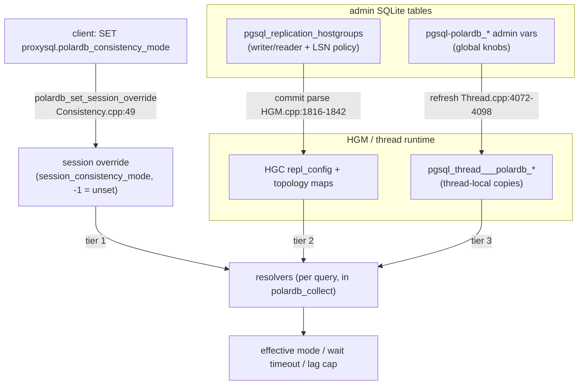
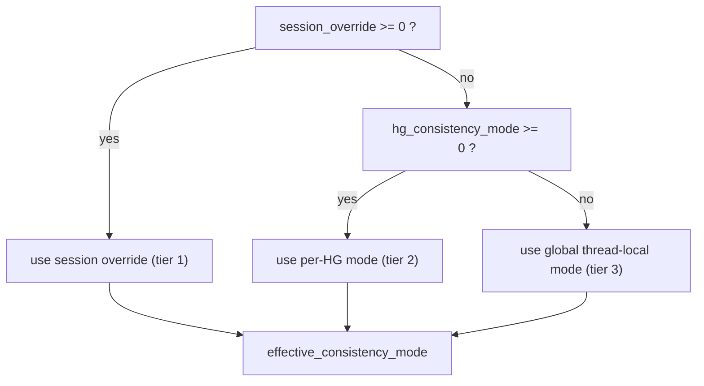
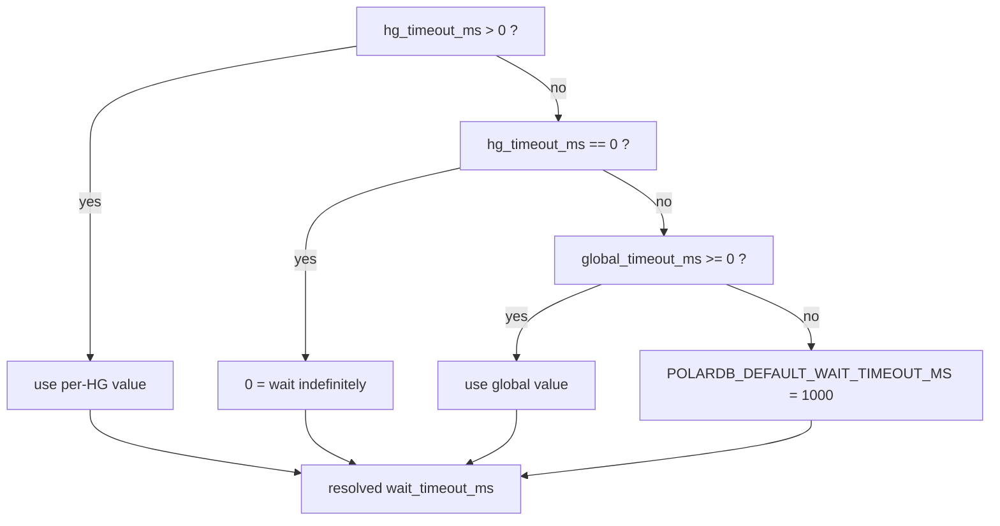

# 04 - Admin Schema and Configuration Model

> Scope: the `pgsql_replication_hostgroups` columns that drive LSN routing, the global `pgsql-polardb_*` knobs, this feature's RFQ startup/routing policy, mode resolution, and the admin load/persist path. | Audience: R/M/O/C | Status: stable | Prereqs: [01-BACKGROUND-AND-DESIGN.md](01-BACKGROUND-AND-DESIGN.md), [03-TYPES-AND-ENUMS.md](03-TYPES-AND-ENUMS.md), [05-MONITOR-AND-HGM-LSN-STATE.md](05-MONITOR-AND-HGM-LSN-STATE.md) | Verified against: this branch

---

## 1. Scope and where this sits

This document describes how an operator configures the PolarDB read-your-writes (RYW) feature, and how that configuration flows from on-disk SQLite tables into the per-query routing decision.

Term definitions used throughout (defined once here; the project glossary in `README.md` is the authority for this docset, and the curated prior design notes glossary lives at `doc/polardb-arch/34-DOCS-FOUNDATION-PACK.md` in the full implementation):

- **PolarDB** - an Alibaba PostgreSQL-compatible database with one primary (writer) node and read replicas.
- **LSN (Log Sequence Number)** - a 64-bit position in PostgreSQL's write-ahead log (WAL). A larger LSN means "more recent". A replica that has replayed up to LSN X can serve any read whose data was committed at or before X.
- **RYW (read-your-writes)** - the guarantee that after a session writes, its own later reads see that write even when reads go to a replica.
- **Hostgroup (HG)** - a numbered group of backend servers in ProxySQL. A PolarDB replication-hostgroup row pairs a `writer_hostgroup` (primary) with a `reader_hostgroup` (replicas).
- **Knob / admin variable** - a `pgsql-polardb_*` runtime setting an operator changes with `SET pgsql-... = ...; LOAD PGSQL VARIABLES TO RUNTIME;`.
- **Thread-local** - a per-OS-thread copy (`__thread` storage in C++) of a knob, read on the hot path with no lock.
- **GUC** - a PostgreSQL runtime setting (Grand Unified Configuration variable) changed with `SET name = value`.

There are two configuration surfaces:

1. **Per-hostgroup policy**, stored in the writable admin table `pgsql_replication_hostgroups` (one row per writer/reader pair).
2. **Global knobs**, stored as `pgsql-polardb_*` admin variables and mirrored into thread-local copies the routing code reads.

Both feed resolution steps (Section 5) that produce the effective consistency mode, wait timeout, lag cap, RFQ routing policy, session-LSN baseline, and backend startup profile used around a single query.

```
  admin SQLite tables                       routing pipeline (per query)
  ===================                       ============================

  pgsql_replication_hostgroups  --commit--> HGM repl_config / topology maps --+
   (writer/reader + LSN policy)                                               |
                                                                              v
  pgsql-polardb_* admin vars --refresh--> pgsql_thread___polardb_* (thread)  resolvers
   (global knobs)                                                             |
                                                                              v
  client SET proxysql.polardb_consistency_mode --> session override ---------+--> effective
                                                                                  mode/timeout/cap
```

The whole feature is gated by the compile flag `POLARDB_PROXY` (default `1`). When `POLARDB_PROXY=0`, the schema, knobs, and resolvers below are not compiled and the tables keep their plain upstream shape. The build toggle itself is covered in [02-BUILD-TOGGLE-AND-LIBPQ.md](02-BUILD-TOGGLE-AND-LIBPQ.md); this document only notes where each schema/knob branches on the flag.

---

## 2. The `pgsql_replication_hostgroups` schema

### 2.1 Versioned table macros

The writable admin table is built from a versioned C macro. The PolarDB build selects the V3_0_4 macro; the non-PolarDB build selects V3_0_2. The `runtime_pgsql_replication_hostgroups` mirror table is chosen the same way. The HostGroups Manager keeps its own internal copy of the V3_0_4 schema string that must stay in sync.

```
#if POLARDB_PROXY
  ..._PGSQL_REPLICATION_HOSTGROUPS == ..._V3_0_4   (8 columns)
#else
  ..._PGSQL_REPLICATION_HOSTGROUPS == ..._V3_0_2   (4 columns, upstream)
#endif
```

This implementation settles on V3_0_4 as this LSN-only eight-column schema. Its RFQ startup-profile surface is the `proxy_protocol` column plus the `REQUEST_RFQ_LSN` request bit selected by `v15` and `legacy` profiles. `REQUEST_RFQ_CSN` and `REQUEST_RFQ_XID` are named request-bit vocabulary for future protocol payloads; they do not add columns or widen V3_0_4. Any future CSN, XID, or transaction-split schema expansion must use a later coordinated schema version and migration, for example V3_0_5 or the next available bump.

### 2.2 V3_0_4 columns (the PolarDB schema)

Full text is in `include/ProxySQL_Admin_Tables_Definitions.h` and mirrored in `include/PgSQL_HostGroups_Manager.h`.

| Column | Type / CHECK | Default | Meaning |
|---|---|---|---|
| `writer_hostgroup` | `INT`, `>= 0`, PRIMARY KEY | (none) | writer (primary) hostgroup id |
| `reader_hostgroup` | `INT`, `<> writer_hostgroup`, `>= 0`, UNIQUE | (none) | reader (replica) hostgroup id |
| `check_type` | `VARCHAR` in `('read_only','polardb')` | `'read_only'` | `'polardb'` turns this pair into a PolarDB pair; only then do the three LSN columns below apply |
| `consistency_mode` | `VARCHAR` in `('default','off','lsn','primary')` | `'default'` | per-hostgroup consistency policy; `'default'` defers to the global knob |
| `max_lag_bytes` | `INT` | `-1` | per-hostgroup reader lag cap in bytes; `-1` = inherit global, `0` = off, `>0` = cap |
| `lsn_wait_timeout_ms` | `INT` | `-1` | per-hostgroup wait timeout in ms; `-1` = inherit global, `0` = wait indefinitely, `>0` = explicit |
| `proxy_protocol` | `VARCHAR` in `('default','v15','legacy','off')` | `'default'` | per-hostgroup startup protocol override; `'default'` inherits `pgsql-polardb_proxy_protocol` |
| `comment` | `VARCHAR` | `''` | free text |

Notes:

- `consistency_mode` is a SQLite `CHECK` constraint, so the table rejects any value outside the four allowed words at INSERT/UPDATE time.
- The LSN/RFQ columns (`consistency_mode`, `max_lag_bytes`, `lsn_wait_timeout_ms`, `proxy_protocol`) are stored for every row regardless of `check_type`, but they only influence routing and startup when `check_type='polardb'` (Section 4.2).
- `'lsn'` is the only mode that performs an RYW wait. `'primary'` forces all reads to the writer. `'off'` disables PolarDB routing (query rules decide). `'default'` means "not set at this tier, fall through to the global knob".

### 2.3 The V3_0_2 fallback (non-PolarDB build)

When `POLARDB_PROXY=0`, the table is V3_0_2 (`include/ProxySQL_Admin_Tables_Definitions.h:305`): four columns (`writer_hostgroup`, `reader_hostgroup`, `check_type`, `comment`), with `check_type` restricted to `('read_only')` only. This is byte-identical to upstream ProxySQL. No LSN columns exist in that build.

### 2.4 Full-implementation fields not in this V3_0_4

The full implementation carries a larger schema for the complete PolarDB feature. This V3_0_4 deliberately excludes the parts that belong to features it does not ship.

| Future item | Form in the full implementation | Why it is not in this V3_0_4 |
|---|---|---|
| `txn_split_enabled` column | `INT IN (0,1)`, allowed only when `check_type='polardb'`, default `0` | the transaction-split feature is not part of the LSN-only series (see [19-FUTURE-TXN-SPLIT-DESIGN.md](19-FUTURE-TXN-SPLIT-DESIGN.md)) |
| `consistency_mode` values `'csn'`, `'session'`, `'global'` | full implementation allows `('default','off','lsn','csn','session','global')` | CSN (Commit Sequence Number) and the multi-LSN global/session modes are out of scope here; only `off` / `lsn` / `primary` remain (CSN is a future, experimental feature - see [18-FUTURE-CSN-DESIGN.md](18-FUTURE-CSN-DESIGN.md)) |

The LSN-only tree therefore has no `txn_split_enabled` writable/runtime column and no HGM/session runtime state for it. The integer-constant set also leaves a gap at value `2`, which is where the future CSN mode would sit (Section 3). These future items must not be retrofitted into V3_0_4; they need the next schema bump and disk-upgrade path.

> Caution for cross-tree readers: the full implementation's line numbers for these dropped items differ from this tree. Treat any full-implementation citation as directional only; do not map line numbers 1:1 between the two trees.

---

## 3. The global knobs

The feature exposes twelve `pgsql-polardb_*` admin variables. They are the global (lowest) tier of resolution. The word-valued strings are validated on `SET` and parsed into integers for the hot path.

### 3.1 Storage struct and registration

- Storage: the fields live on `PgSQL_Thread::variables`.
- Name registry (what `SHOW VARIABLES` lists): `lib/PgSQL_Thread.cpp:375-381`.
- Defaults loaded at thread init: `lib/PgSQL_Thread.cpp:1123-1129`.
- Integer ranges (the `make_tuple(ptr, min, max, ...)` registrations): `lib/PgSQL_Thread.cpp:2416-2419`.
- Bool registration (`polardb_monitor_lsn_updates`): `lib/PgSQL_Thread.cpp:2254`.
- Word-value validation on `SET`: `lib/PgSQL_Thread.cpp` rejects anything outside the listed words. Fallback startup identity validation also happens at `SET` time for the host/port pair.
- Freed at shutdown (the two string knobs): `lib/PgSQL_Thread.cpp:2817-2818`.

### 3.2 Knob table

| Admin variable (`pgsql-...`) | Type | Range | Default | Meaning |
|---|---|---|---|---|
| `polardb_consistency_mode` | word | `off` \| `lsn` \| `primary` | `off` | global consistency policy (the lowest resolution tier) |
| `polardb_wait_timeout_mode` | word | `best_effort` \| `strict` | `best_effort` | on a wait timeout: `best_effort` returns possibly-stale data with a WARNING; `strict` raises an ERROR |
| `polardb_lag_bytes` | int | `0 .. INT_MAX` | `0` | global reader lag cap in bytes; `0` = off |
| `polardb_lag_ms` | int | `0` only | `0` | Reserved in this implementation - runtime accepts only `0`; no PgSQL millisecond-lag producer exists (Section 7) |
| `polardb_lag_wait_ms` | int | `0 .. 60000` | `1000` | global wait timeout in ms; `0` = wait indefinitely inside the PolarDB wait loop |
| `polardb_lsn_freshness_ms` | int | `100 .. 60000` | `5000` | max age of a cached per-server LSN that routing will still trust |
| `polardb_monitor_lsn_updates` | bool | `0` \| `1` | `1` (true) | allow the monitor to refresh the per-server LSN cache |
| `polardb_proxy_protocol` | word | `v15` \| `legacy` \| `off` | `v15` | global startup protocol for PolarDB proxy parameters; per-HG `proxy_protocol='default'` inherits it |
| `polardb_route_rfq_policy` | word | `strict` \| `best_effort` | `strict` | route policy when an automatic SESSION_LSN read needs an RFQ-derived target but the target is unknown |
| `polardb_session_lsn_baseline` | word | `observed` \| `primary` | `observed` | first-read SESSION_LSN target source when the session has no write or observed target |
| `polardb_proxy_identity_host` | string | empty or non-wildcard IP literal | empty | fallback identity host for RFQ-requesting startup profiles |
| `polardb_proxy_identity_port` | int | `0 .. 65535` | `0` | fallback identity port; `0` means unset |

The integer ranges are enforced by the variable registry. Word knobs reject unsupported values with `proxy_error`: `proxy_protocol` accepts only `v15|legacy|off`, route RFQ policy only `strict|best_effort`, and session LSN baseline only `observed|primary`. `polardb_proxy_identity_host` is either empty or a non-wildcard IP literal. A non-empty host can be staged while `polardb_proxy_identity_port=0`, so operators can set host before port; once the port is set, the completed fallback identity must be a usable non-wildcard IP literal plus port `1..65535`. If a host is already configured, setting the port back to `0` is rejected until the host is cleared.

How `polardb_lsn_freshness_ms` is used: the reader acquisition treats a cached per-server LSN as trustworthy only if it was sampled within this window (`lib/PgSQL_HostGroups_Manager.cpp:4522-4523` and `:4640-4641`, via the `polardb_lsn_cache_fresh()` predicate at `include/PgSQL_PolarDB.h:525-531`). A value of `0` falls back to a compile-time default; see [05-MONITOR-AND-HGM-LSN-STATE.md](05-MONITOR-AND-HGM-LSN-STATE.md).

How `polardb_lag_wait_ms` is used: it is the global fallback for the per-hostgroup `lsn_wait_timeout_ms` and feeds the `polar_xact_split_wait_lsn` wait gate (Section 5.3).

### 3.3 Thread-local copies (the values routing actually reads)

The hot path never reads `PgSQL_Thread::variables` directly. On each config commit, the knobs are copied into global `__thread` variables. Each worker thread reads its own copy with no lock.

| Thread-local variable | Type | Notes |
|---|---|---|
| `pgsql_thread___polardb_consistency_mode` | int | word parsed to int: `off`=0, `lsn`=1, `primary`=3 |
| `pgsql_thread___polardb_lag_bytes` | int | byte lag cap |
| `pgsql_thread___polardb_lag_ms` | int | deferred (no producer); see Section 7 |
| `pgsql_thread___polardb_lag_wait_ms` | int | global wait timeout fallback |
| `pgsql_thread___polardb_lsn_freshness_ms` | int | LSN cache freshness window |
| `pgsql_thread___polardb_monitor_lsn_updates` | bool | monitor LSN updates on/off |
| `pgsql_thread___polardb_wait_timeout_mode` | int | word parsed to int: `best_effort`=1, `strict`=2 |
| `pgsql_thread___polardb_proxy_protocol` | int | word parsed to int: `off`=0, `legacy`=1, `v15`=2 |
| `pgsql_thread___polardb_route_rfq_policy` | int | word parsed to int: `best_effort`=1, `strict`=2 |
| `pgsql_thread___polardb_session_lsn_baseline` | int | word parsed to int: `observed`=1, `primary`=2 |
| `pgsql_thread___polardb_proxy_identity_host` | char* | fallback identity host |
| `pgsql_thread___polardb_proxy_identity_port` | int | fallback identity port |

The refresh happens in `PgSQL_Thread::refresh_variables()` (`lib/PgSQL_Thread.cpp:4146`):

- The integer/bool knobs are copied directly (`lib/PgSQL_Thread.cpp:4072-4076`).
- `polardb_consistency_mode` string is mapped to an int: `lsn`->1, `primary`->3, anything else->0 (`lib/PgSQL_Thread.cpp:4078-4087`).
- `polardb_wait_timeout_mode` string is mapped to an int: `best_effort`->1, `strict`->2, anything else->best_effort (`lib/PgSQL_Thread.cpp:4088-4098`).
- `polardb_proxy_protocol`, `polardb_route_rfq_policy`, and `polardb_session_lsn_baseline` are parsed into their hot-path integer enums.
- `polardb_proxy_identity_host` is copied as a per-thread string and `polardb_proxy_identity_port` as an int.

```
SET pgsql-polardb_consistency_mode='lsn'
        |
        v  (validated at SET time, Thread.cpp:1749-1757)
variables.polardb_consistency_mode = "lsn"   (string on PgSQL_Thread::variables)
        |
        v  LOAD PGSQL VARIABLES TO RUNTIME -> commit refresh (Thread.cpp:4078-4087)
pgsql_thread___polardb_consistency_mode = 1   (int, per-thread, read on the hot path)
```

### 3.4 Mode integer constants and the typed enum

The integer constants used wherever an `int` plus a `-1` "unset" sentinel is needed (thread variables, hostgroup policy, admin SQL parsing) are at `include/PgSQL_Thread.h:48-50`:

```
POLARDB_CONSISTENCY_OFF     = 0
POLARDB_CONSISTENCY_LSN     = 1
POLARDB_CONSISTENCY_PRIMARY = 3
```

Value `2` is intentionally skipped - it is the gap left by the dropped CSN mode. The typed enum mirrors these exactly: `PolarDB_ConsistencyMode { OFF=0, SESSION_LSN=1, PRIMARY_ONLY=3 }` (`include/PgSQL_PolarDB.h:184-188`). Any unsupported integer maps to `OFF` via `polardb_consistency_from_int()` (`include/PgSQL_PolarDB.h:192-202`). The wait-mode enum is `PolarDB_WaitMode { BEST_EFFORT=1, STRICT=2 }` (`include/PgSQL_PolarDB.h:130-133`). Full enum reference is in [03-TYPES-AND-ENUMS.md](03-TYPES-AND-ENUMS.md).

---

## 4. From schema strings to routing integers

When the admin layer commits `pgsql_replication_hostgroups`, the HostGroups Manager (HGM) parses each row and caches the result in two places that the per-query routing pipeline reads: topology maps (writer<->reader pairing) and a per-writer-hostgroup policy struct. This section follows that parse so the routing input in Section 5 is grounded.

### 4.1 The commit-time parse

`generate_pgsql_replication_hostgroups_table()` reads the incoming result set, which carries the eight PolarDB columns in this fixed field order:

```
0 = writer_hostgroup
1 = reader_hostgroup
2 = check_type
3 = consistency_mode
4 = max_lag_bytes
5 = lsn_wait_timeout_ms
6 = proxy_protocol
7 = comment
```

The fields are parsed at `lib/PgSQL_HostGroups_Manager.cpp:1816-1821`.

### 4.2 The `polardb` gate

A pair is treated as PolarDB only when `check_type` equals `polardb` (`lib/PgSQL_HostGroups_Manager.cpp:1824`). Only then are the writer and reader hostgroup ids inserted into the topology maps `polardb_hostgroups_`, `polardb_reader_to_writer_`, and `polardb_writer_to_reader_` (`lib/PgSQL_HostGroups_Manager.cpp:1825-1828`). A `read_only` row is mirrored into the table like upstream but adds nothing to the PolarDB caches.

### 4.3 String mode to int

The `consistency_mode` string becomes an int through `polardb_consistency_mode_from_string()` (declared `include/PgSQL_PolarDB.h:751`, called in `generate_pgsql_replication_hostgroups_table()` at `lib/PgSQL_HostGroups_Manager.cpp:2059`):

| Input string | Result int | Meaning |
|---|---|---|
| `default`, empty, or unknown | `-1` | not set at this tier; fall through to the global knob |
| `off` | `0` (`POLARDB_CONSISTENCY_OFF`) | PolarDB routing off for this hostgroup |
| `lsn` | `1` (`POLARDB_CONSISTENCY_LSN`) | per-session LSN wait |
| `primary` | `3` (`POLARDB_CONSISTENCY_PRIMARY`) | force reads to the writer |

### 4.4 Where the parsed values land

The parsed values are cached on the **writer** hostgroup's config object (`PgSQL_HGC::repl_config`, an anonymous struct at `include/PgSQL_HostGroups_Manager.h:284-294`), populated under the HGM write lock during commit (`lib/PgSQL_HostGroups_Manager.cpp:1836-1842`):

| repl_config field | Source field | Read by routing? |
|---|---|---|
| `configured` | (set true on commit) | yes - gates the policy read |
| `reader_hostgroup` | field 1 | no (topology read via the maps) |
| `check_type` | field 2 | no (string kept for reference) |
| `consistency_mode` (string) | field 3 | no (only the parsed enum is read) |
| `consistency_mode_enum` | parsed field 3 | yes |
| `max_lag_bytes` | field 4 | yes |
| `lsn_wait_timeout_ms` | field 5 | yes |
| `proxy_protocol` (string) | field 6 | no (only parsed enum is read) |
| `proxy_protocol_enum` | parsed field 6 | yes; `-1` inherits the global startup protocol |
| `polardb_primary_lsn` (shared atomic cell) | runtime, not from schema | yes (primary baseline and lag calc); cell is preserved across reload and reset only on writer identity change |
| `polardb_writer_epoch` (shared atomic cell) | runtime, not from schema | yes (session target/latch invalidation after writer identity change); cell is preserved across reload and increments only on writer identity change |

The routing pipeline reads these through `get_polardb_hg_config()`, which uses the generation-cached `PolarDB_TopologySnapshot` in the steady state instead of taking the HGM lock. The snapshot contains a small plain-value policy plus shared atomic cells for the writer's runtime LSN state (`include/PgSQL_HostGroups_Manager.h:1005-1021`, populated at `lib/PgSQL_HostGroups_Manager.cpp:1911-1939`):

```
PolarDB_HG_Config {
  bool is_polardb_hostgroup;
  int writer_hostgroup;
  int reader_hostgroup;
  PolarDB_HG_Policy policy {
    int consistency_mode;
    int lsn_wait_timeout_ms;
    int max_lag_bytes;
    int proxy_protocol;
  };
  shared atomic primary_lsn;        // writer's runtime primary LSN cell
  shared atomic writer_epoch;       // writer identity epoch cell
}
```

So at routing/startup time the per-hostgroup tier is four tri-state ints, each using `-1` to mean "not set, fall through". The detail of the HGM cache, locking, and topology maps belongs to [05-MONITOR-AND-HGM-LSN-STATE.md](05-MONITOR-AND-HGM-LSN-STATE.md).

---

## 5. Three-tier resolution

For one query, the routing pipeline resolves the effective consistency mode, wait timeout, lag cap, route-RFQ policy, and session-LSN baseline. Backend connection creation also resolves a startup protocol from per-HG `proxy_protocol` over the global `pgsql-polardb_proxy_protocol`.

```
   TIER 1  session override   (client: SET proxysql.polardb_consistency_mode)
              |  highest priority
   TIER 2  per-hostgroup      (pgsql_replication_hostgroups column for this HG)
              |
   TIER 3  global knob        (pgsql-polardb_* -> pgsql_thread___polardb_*)
              |  lowest priority / fallback
```

The `-1` value is the "not set" sentinel at every non-global tier; the global tier is always a concrete value. The resolvers are pure functions (no side effects). They run at two points in the per-query pipeline, both in `lib/PgSQL_PolarDB_Flow.cpp`:

- The consistency-mode resolver and the wait-timeout resolver run in `polardb_collect()` (the snapshot stage, `lib/PgSQL_PolarDB_Flow.cpp:233`).
- The lag-cap two-tier resolution runs later, inside `polardb_reader_lag_plan()`, which attaches the effective cap and primary-LSN mirror to the per-query reader plan. Collect only copies the per-hostgroup value into the context; the fall-through to the global value happens in that function, and the actual per-reader cap check happens during backend acquisition.

### 5.1 Consistency mode - all three tiers

The resolver is one inline function (`include/PgSQL_PolarDB.h:1277`):

```
int polardb_resolve_consistency_mode(session_override, hg_consistency_mode, global_mode):
    if session_override   >= 0:  return session_override     # tier 1
    if hg_consistency_mode >= 0: return hg_consistency_mode   # tier 2
    return global_mode                                        # tier 3
```

The single call site wires the three tiers explicitly (`lib/PgSQL_PolarDB_Flow.cpp:66-69`):

```
route_ctx.effective_consistency_mode = polardb_resolve_consistency_mode(
    polardb_config.session_consistency_mode,    // tier 1: session override
    policy.consistency_mode,                     // tier 2: per-HG (parsed enum)
    pgsql_thread___polardb_consistency_mode);    // tier 3: global thread-local
```

Tier sources:

- **Tier 1 - session override.** Stored as `int session_consistency_mode = -1` on the session's `polardb_config` (`include/PgSQL_Session.h:499`). It is set when a client runs `SET proxysql.polardb_consistency_mode`, which calls `PgSQL_Session::polardb_set_session_override()` (`lib/PgSQL_PolarDB_Consistency.cpp:49`). `-1` means no override. It is cleared back to `-1` on a session reset (see [10-SESSION-INTEGRATION.md](10-SESSION-INTEGRATION.md)).
- **Tier 2 - per-hostgroup.** `policy.consistency_mode`, i.e. the parsed `consistency_mode_enum` from Section 4. `-1` here means the row had `consistency_mode='default'` (or an unknown value).
- **Tier 3 - global.** The thread-local `pgsql_thread___polardb_consistency_mode`, refreshed from the `pgsql-polardb_consistency_mode` knob.

### 5.2 Wait timeout - two tiers (no session tier)

The wait timeout has no session-level override. It resolves from the per-hostgroup value, then the global knob, via a two-input resolver (`include/PgSQL_PolarDB.h:417-423`):

```
uint32_t polardb_resolve_wait_timeout_ms(hg_timeout_ms, global_timeout_ms):
    if hg_timeout_ms  > 0:  return hg_timeout_ms                         # explicit per-HG
    if hg_timeout_ms == 0:  return 0                                     # per-HG says wait forever
    if global_timeout_ms >= 0: return global_timeout_ms                  # fall to global
    return POLARDB_DEFAULT_WAIT_TIMEOUT_MS                               # 1000 (header :135)
```

A one-argument convenience overload fills the global from the thread-local (`lib/PgSQL_PolarDB_Consistency.cpp:30-33`):

```
uint32_t polardb_resolve_wait_timeout_ms(hg_timeout_ms):
    return polardb_resolve_wait_timeout_ms(hg_timeout_ms, pgsql_thread___polardb_lag_wait_ms);
```

The call site is `lib/PgSQL_PolarDB_Flow.cpp:72`:

```
route_ctx.wait_timeout_ms = polardb_resolve_wait_timeout_ms(policy.lsn_wait_timeout_ms);
```

Important meaning of `0`: a resolved timeout of `0` means "wait indefinitely inside the PolarDB LSN wait loop". It is not a zero-length wait. PostgreSQL `statement_timeout`, a client cancel, administrator termination, or connection loss can still interrupt the statement (documented at `include/PgSQL_PolarDB.h:405-410`).

### 5.3 Lag cap (`max_lag_bytes`) - two tiers (no session tier)

The lag cap also has no session tier. It resolves per-hostgroup, then global (`lib/PgSQL_PolarDB_Flow.cpp:148-149`):

```
int max_lag = (route_ctx.max_lag_bytes >= 0) ? route_ctx.max_lag_bytes
                                        : pgsql_thread___polardb_lag_bytes;
```

`route_ctx.max_lag_bytes` is set from `policy.max_lag_bytes` in collect (`lib/PgSQL_PolarDB_Flow.cpp:74`). The cap is a **safety-only** byte bound on `primary_lsn - reader_lsn`. It is NOT the correctness gate; the actual RYW gate is the `polar_xact_split_wait_lsn` SET emitted onto the replica read (see [07-QUERY-WRAPPING.md](07-QUERY-WRAPPING.md)). When the cap is enabled (`>0`) and a reader exceeds it - or has a stale/missing LSN under an enabled cap - the read **uses the writer instead of that replica**. This is the safe writer fallback: when the proxy is unsure a replica is safe, it sends the read to the writer (always up to date) instead of risking a stale answer (`lib/PgSQL_PolarDB_Flow.cpp:145-178`). Section 6 of [06-ROUTING-PIPELINE.md](06-ROUTING-PIPELINE.md) covers the safe fallback cases.

### 5.4 Wait timeout MODE (best_effort vs strict) - global only

The wait-timeout mode (`best_effort` vs `strict`) is read straight from the thread-local with no per-hostgroup or session tier (`lib/PgSQL_PolarDB_Flow.cpp:73`):

```
route_ctx.wait_timeout_mode = pgsql_thread___polardb_wait_timeout_mode;
```

It does not change the routing action; it only changes what the replica does when a wait times out (return stale data with a WARNING, or raise an ERROR). That behavior is described in [08-WAIT-TIMEOUT-AND-NOTICES.md](08-WAIT-TIMEOUT-AND-NOTICES.md).

### 5.5 Resolution summary

| Resolved value | Tiers | Resolver (file:line) | Call site (file:line) |
|---|---|---|---|
| consistency mode | session > per-HG > global | `polardb_resolve_consistency_mode` (`include/PgSQL_PolarDB.h:1277`) | `lib/PgSQL_PolarDB_Flow.cpp:233` |
| wait timeout (ms) | per-HG > global > default 1000 | `polardb_resolve_wait_timeout_ms` (`include/PgSQL_PolarDB.h:417-423`, 1-arg `lib/PgSQL_PolarDB_Consistency.cpp:30-33`) | `lib/PgSQL_PolarDB_Flow.cpp:72` |
| lag cap (bytes) | per-HG > global | inline (`lib/PgSQL_PolarDB_Flow.cpp:148-149`) | `lib/PgSQL_PolarDB_Flow.cpp:74`, used `:148` |
| wait timeout mode | global only | (direct read) | `lib/PgSQL_PolarDB_Flow.cpp:73` |
| route RFQ policy | global only | `polardb_rfq_route_policy_from_int` | collected into route context and used by unknown-LSN routing |
| session LSN baseline | global only | `polardb_session_lsn_baseline_from_int` | collected into route context and used by first-read target selection |
| startup proxy protocol | per-HG > global | `build_polardb_startup_profile()` | backend connection creation |

### 5.6 RFQ startup and missing-target policy

`proxy_protocol` controls what PolarDB proxy startup parameters are emitted:

| Effective protocol | Startup parameters |
|---|---|
| `v15` | `_polar_proxy_client_host`, `_polar_proxy_client_port`, `_polar_proxy_send_lsn=true` |
| `legacy` | `_polar_origin_client_ip`, `_polar_origin_client_port`, `_polar_send_lsn=true` |
| `off` | no PolarDB proxy startup parameters |

`v15` and `legacy` create startup profiles that request `REQUEST_RFQ_LSN`. Accepting the startup packet is not RFQ capability confirmation; the first/result RFQ that carries LSN confirms useful LSN behavior for that connection/profile.

RFQ-requesting profiles require a usable identity. ProxySQL resolves it from the client endpoint, then the listener/local proxy endpoint, then `pgsql-polardb_proxy_identity_host` plus `pgsql-polardb_proxy_identity_port`. Empty, invalid, wildcard, or unset fallback identity fails connection creation for RFQ-requesting profiles.

`LOAD PGSQL SERVERS TO RUNTIME` and `LOAD PGSQL VARIABLES TO RUNTIME` warn, but do not reject the load, when a PolarDB row resolves to `consistency_mode='lsn'` while its effective `proxy_protocol` resolves to `off`. That combination disables RFQ LSN startup requests for the group. The same effective-policy check also warns conservatively when at least one PolarDB row resolves to an RFQ-capable startup protocol and the configured fallback identity is partially set but unusable; a completely unset fallback is not warned because client or listener identity can satisfy client-backed connections.

`pgsql-polardb_route_rfq_policy` applies when SESSION_LSN routing needs an RFQ-derived target but the target is unknown:

| Policy | Behavior |
|---|---|
| `strict` | force the writer for safe service |
| `best_effort` | allow an eligible read to proceed without a wait, increment the degraded-route counter, and log the degradation |

Hard query-shape forces still force the writer before this policy is considered.

`pgsql-polardb_session_lsn_baseline` controls the first read-only SESSION_LSN read with no session target:

| Baseline | Behavior |
|---|---|
| `observed` | use ordinary reader routing; if the read RFQ carries LSN, that LSN becomes the observed target for later monotonic reads |
| `primary` | try to seed the first target from the replication group's primary LSN mirror; if the mirror is unknown, `PRIMARY_LSN_UNKNOWN` goes through `route_rfq_policy` |

---

## 6. Config load, persist, and round-trip

This section traces how the per-hostgroup PolarDB columns and the `replica_eligible` query-rule column move between disk, runtime, and admin output. The prior design notes noted these paths were confirmed by representative grep only; the file:line below were each opened and verified for this document.

### 6.1 Reading the table into the HGM (load to runtime)

When the admin runs `LOAD PGSQL SERVERS TO RUNTIME`, the HGM dumps the writable table and feeds it to the parser in Section 4. The dump SELECT is PolarDB-aware (`lib/PgSQL_HostGroups_Manager.cpp:1932-1938`):

```
#if POLARDB_PROXY
  SELECT writer_hostgroup, reader_hostgroup, check_type, consistency_mode, max_lag_bytes, lsn_wait_timeout_ms, proxy_protocol, comment FROM pgsql_replication_hostgroups
#else
  SELECT writer_hostgroup, reader_hostgroup, check_type, comment FROM pgsql_replication_hostgroups
#endif
```

The 8-column result set is exactly the field order Section 4.1 parses. The 4-column non-PolarDB form keeps the upstream shape.

### 6.2 Writing runtime back to the admin tables (persist / dump)

When the admin dumps runtime state back into the `runtime_` (and on save, the writable) tables, the replication-hostgroups dump branches on the flag. The PolarDB branch inserts all eight columns:

```
INSERT INTO [runtime_]pgsql_replication_hostgroups VALUES(%s,%s,'%s','%s',%s,%s,'%s','%s')
   -- writer, reader, check_type, consistency_mode, max_lag_bytes, lsn_wait_timeout_ms, proxy_protocol, comment
```

The dump path restates the 0..7 field order. `check_type`, `consistency_mode`, `proxy_protocol`, and `comment` are escaped before being formatted in. The non-PolarDB branch inserts only the four upstream columns. Because the load SELECT (6.1) and the persist INSERT (6.2) use the same column set and order, a row survives a `LOAD ... TO RUNTIME` / `SAVE ... FROM RUNTIME` round-trip unchanged.

### 6.3 The `replica_eligible` query-rule column

A second PolarDB schema addition lives on `pgsql_query_rules`: the `replica_eligible` tri-state column (`-1` unset / `0` force-primary / `1` auto), placed between `multiplex` and `log` (schema at `include/ProxySQL_Admin_Tables_Definitions.h:295`; runtime mirror at `:327`). It opts a matched read into the automatic replica-routing pipeline. Its load/persist paths also branch on the flag:

- Load to runtime (the SELECT that reads the rules): `lib/ProxySQL_Admin.cpp:8624-8628` - the PolarDB SELECT lists `replica_eligible` between `multiplex` and `log`.
- Persist runtime back (the INSERT): `lib/ProxySQL_Admin.cpp:5120-5131` (statement) and `:5193-5198` (the field is emitted; `-1` is written as the literal `-1`, a real NOT NULL value, not SQL `NULL`). The field count differs by tier: 35 fields with PolarDB vs 34 without (`lib/ProxySQL_Admin.cpp:5136-5140`).

The query-rule semantics of `replica_eligible` (how it gates the pipeline) are covered in [06-ROUTING-PIPELINE.md](06-ROUTING-PIPELINE.md); here we only document that it persists like any other rule column.

### 6.4 Online schema upgrade (disk upgrade)

On startup ProxySQL upgrades an older on-disk `pgsql_replication_hostgroups` table to the current schema (`lib/ProxySQL_Admin_Disk_Upgrade.cpp:633-689`). There are two migration steps:

1. **pre-3.0.2 -> current** (always present): if the table matches the V3_0_1 shape, rename it aside and recreate it from the current macro, copying `writer_hostgroup`, `reader_hostgroup`, a forced `'read_only'` `check_type`, and `comment` (`lib/ProxySQL_Admin_Disk_Upgrade.cpp:636-660`).
2. **V3_0_2 -> V3_0_3** (PolarDB build only): if the table matches V3_0_2, recreate it and copy the four old columns while defaulting the LSN columns to `consistency_mode='default'`, `max_lag_bytes=-1`, and `lsn_wait_timeout_ms=-1`.
3. **V3_0_3 -> V3_0_4** (PolarDB build only): if the table matches V3_0_3, recreate it and copy the existing columns while defaulting `proxy_protocol='default'`.

So an operator upgrading a non-PolarDB ProxySQL to a PolarDB build keeps all existing rows; the new LSN columns appear with safe "inherit/off" defaults, and no row becomes a PolarDB pair until `check_type` is set to `polardb`.

### 6.5 Round-trip diagram

```
   disk (config.db)                admin SQLite (memory)            HGM runtime
   ===============                 =====================            ===========
   pgsql_replication_hostgroups
        |  startup
        v  disk_upgrade (Disk_Upgrade.cpp:633)  -- migrate to V3_0_4
   pgsql_replication_hostgroups (current schema)
        |  LOAD ... TO RUNTIME
        |  dump_table_pgsql SELECT  -- 8 cols
        v
   generate_pgsql_replication_hostgroups_table (HGM.cpp:1790)
        |  parse fields 0..7, parse mode and proxy_protocol
        v
   repl_config + topology maps (HGM.cpp:1836-1842)
        ^  SAVE ... FROM RUNTIME
        |  INSERT 8 cols
   runtime_pgsql_replication_hostgroups / pgsql_replication_hostgroups
```

---

## 7. Deferred lag knob and byte-lag counter

One configuration-visible knob is reserved today, and one related counter is active only for byte-lag safety. An operator must not treat either as a millisecond-lag feature.

| Item | Where it appears | Status | Operator meaning |
|---|---|---|---|
| `pgsql-polardb_lag_ms` knob | admin var, runtime range `0` only, default `0` (`include/PgSQL_Thread.h:1008`; `lib/PgSQL_Thread.cpp:1125`, `:2417`); thread-local `pgsql_thread___polardb_lag_ms` | DEFERRED / inert | there is no PgSQL millisecond-lag producer; the helper `polardb_lag_ms_within_cap()` (`include/PgSQL_PolarDB.h:544-547`) is documented as not wired (`include/PgSQL_PolarDB.h:504-507`, `:536`). Setting it has no routing effect. |
| `PolarDB_LSN_Stale_Count` counter | exposed in `stats_pgsql_global` | active for byte-lag safety | increments when an enabled `max_lag_bytes` check finds missing or stale primary/reader LSN state. It is not a millisecond-lag signal. See [12-THREADVARS-AND-OBSERVABILITY.md](12-THREADVARS-AND-OBSERVABILITY.md). |

The supported LSN-only lag controls today are: (1) the byte lag cap `polardb_lag_bytes` / per-hostgroup `max_lag_bytes`; (2) the cached-LSN age `polardb_lsn_freshness_ms`; (3) the wait timeout around `polar_xact_split_wait_lsn` (`include/PgSQL_PolarDB.h:498-502`). The millisecond-lag cap is intentionally deferred; the full implementation has the same gap. The full deferred-item list and roadmap live in [15-LIMITATIONS-AND-ROADMAP.md](15-LIMITATIONS-AND-ROADMAP.md).

CSN note: the `csn` consistency mode and the `'session'` / `'global'` modes are not part of this schema (Section 2.4). They belong to a future, experimental CSN feature that requires PolarDB backend support, applies only in global-consistency mode, and whose wait behavior is not reliably verified. See [18-FUTURE-CSN-DESIGN.md](18-FUTURE-CSN-DESIGN.md).

---

## 8. Notes for reviewers

- **One gate decides "is this a PolarDB pair":** `check_type='polardb'` (`lib/PgSQL_HostGroups_Manager.cpp:1824`). The LSN columns exist on every row but are inert for a `read_only` pair.
- **`-1` is the universal "not set" sentinel** at the session and per-hostgroup tiers, both in the schema defaults (`max_lag_bytes`, `lsn_wait_timeout_ms` default `-1`) and in the parsed `consistency_mode_enum`. The resolvers fall through on `-1` (or, for the timeout, distinguish `0` = wait forever from `-1` = inherit).
- **The session tier exists only for consistency mode.** Wait timeout and lag cap have no session override; only mode does. This is deliberate (a client can pick its own consistency strictness, but cannot widen the operator's timeout/lag safety bounds).
- **Word knobs are validated at `SET` time, not at refresh time.** `polardb_consistency_mode` and `polardb_wait_timeout_mode` reject unknown words immediately; the refresh mapping is total (any leftover unknown maps to the safe default), so a bad value can never reach routing. The configured fallback startup identity is also validated at `SET` time across host and port, with `port=0` allowed only as an incomplete host-before-port staging state.
- **Schema strings must stay in sync in three places:** the writable macro, the runtime macro, and the HGM-internal copy. All three carry the same V3_0_4 column list and CHECKs.
- **Counter terminology:** there are 26 exported stat counters plus the internal `polardb_active` gate; this document only touches the schema/knob surface. See [12-THREADVARS-AND-OBSERVABILITY.md](12-THREADVARS-AND-OBSERVABILITY.md).

---

## 9. Status and deferred

| Capability | Status in this implementation | Notes |
|---|---|---|
| `check_type='polardb'` pairs | implemented | the gate for all LSN routing |
| `consistency_mode` off/lsn/primary | implemented | per-HG, 3-tier resolved |
| `max_lag_bytes` per-HG + global | implemented | safety-only byte cap |
| `lsn_wait_timeout_ms` per-HG + global | implemented | `0` = wait forever |
| 7 global knobs + thread-local mirror | implemented | validated at SET; refreshed on commit |
| session-tier mode override | implemented | `SET proxysql.polardb_consistency_mode` |
| disk upgrade to V3_0_4 | implemented | PolarDB build only; older rows get `proxy_protocol='default'` |
| `pgsql-polardb_lag_ms` | DEFERRED / inert | no producer (Section 7) |
| `consistency_mode` csn/session/global | not in this implementation | future, experimental CSN (Section 2.4, doc 18) |
| `txn_split_enabled` column | not in this implementation | transaction split dropped (doc 19) |

---

## Appendix: Mermaid diagrams

### A1. Configuration sources feeding the resolvers



### A2. Three-tier consistency-mode resolution



### A3. Wait-timeout (two-tier) resolution



### A4. Config round-trip

```mermaid
flowchart LR
    DISK["disk: pgsql_replication_hostgroups"] -->|startup disk_upgrade\nDisk_Upgrade.cpp:633| MIG["migrate to V3_0_4"]
    MIG -->|LOAD TO RUNTIME\ndump SELECT HGM.cpp:1935| PARSE["generate_pgsql_replication_hostgroups_table\nHGM.cpp:1790"]
    PARSE -->|parse fields 0..7 + mode/protocol| RC["repl_config + topology maps"]
    RC -->|SAVE FROM RUNTIME\nINSERT 8 cols| RT["runtime_/writable tables"]
```



---

Verified against this branch.
