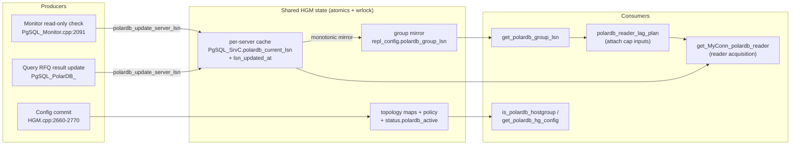
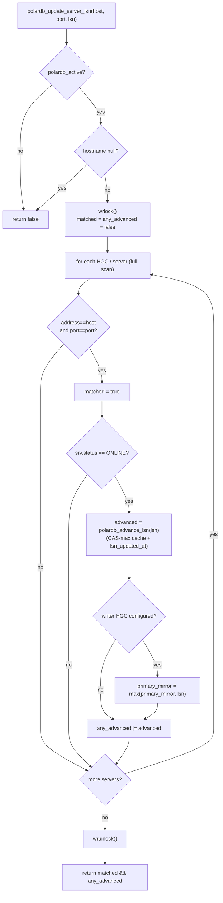
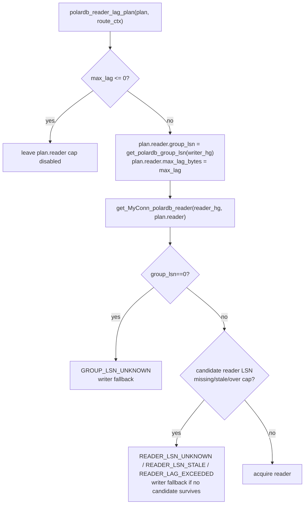
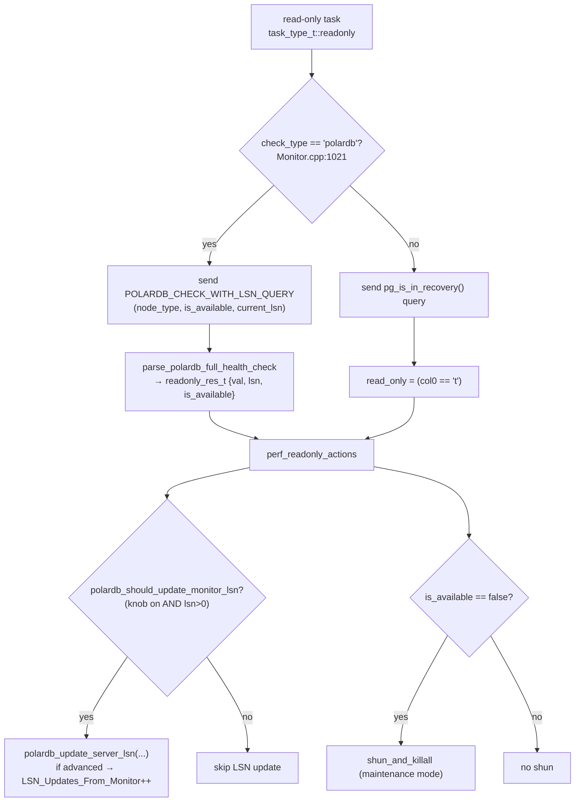

# 05 — Monitor and HostGroups-Manager LSN State

> Scope: the monitor LSN feed (health probe, parse, update cadence), the per-server LSN cache on `PgSQL_SrvC`, the topology maps and `is_polardb_hostgroup`, the byte-lag cap and freshness condition, and the routing-path locking model. | Audience: R/M/O/C | Status: stable | Prereqs: [01-BACKGROUND-AND-DESIGN.md](01-BACKGROUND-AND-DESIGN.md), [03-TYPES-AND-ENUMS.md](03-TYPES-AND-ENUMS.md), [04-ADMIN-SCHEMA-AND-CONFIG.md](04-ADMIN-SCHEMA-AND-CONFIG.md) | Verified against: this branch

---

## 1. What this document covers

This document describes the two background subsystems that keep PolarDB Log Sequence Number (LSN) state for the read-your-writes (RYW) feature:

1. **The Monitor** (`lib/PgSQL_Monitor.cpp`) — the periodic health-check loop. For a PolarDB backend it asks each server for its role, availability, and current WAL LSN, and feeds that LSN into the shared cache.
2. **The HostGroups Manager** (HGM, `lib/PgSQL_HostGroups_Manager.cpp`) — the class that owns backend topology. It holds the per-server LSN cache, the writer/reader topology maps, the per-hostgroup PolarDB policy, and the accessor functions the routing pipeline calls.

This is the only PolarDB state shared across threads, so this document also explains the locking model that protects it.

### Term definitions (first use)

| Term | Meaning |
|------|---------|
| **LSN** (Log Sequence Number) | A 64-bit position in PostgreSQL's write-ahead log (WAL). Larger means more recent. A replica that has replayed up to LSN X can serve any read whose data was committed at or before X. Stored as `XLogRecPtr` (a `typedef uint64_t`, with `InvalidXLogRecPtr = 0`). |
| **WAL** (Write-Ahead Log) | PostgreSQL's append-only log of all changes. Replicas replay it to catch up to the primary. |
| **RYW** (read-your-writes) | The guarantee that after a session writes, its own later reads see that write even when reads go to a replica. |
| **Hostgroup (HG)** | A ProxySQL numbered group of backend servers. A PolarDB pair has a writer HG (the primary) and a reader HG (the replicas). |
| **writer / primary** | The backend that takes writes and is always up to date. Used interchangeably. |
| **reader / replica** | A read-only backend that replays the primary's WAL and may lag behind it. Used interchangeably. |
| **RFQ** (ReadyForQuery) | The PostgreSQL wire message a backend sends after each command. With the PolarDB libpq patch the backend appends its current LSN to RFQ. (RFQ is the query-feedback LSN source; the monitor is the other source.) |
| **Monitor** | ProxySQL's background health-check module. For PostgreSQL it is `PgSQL_Monitor`. |
| **HGM** (HostGroups Manager) | `PgSQL_HostGroups_Manager`. Owns topology and the global `PgHGM->status` struct. |
| **Atomic** | A value read and written with `std::atomic` so two threads cannot read a half-written value. No lock is needed for a single field. |
| **`wrlock()` / `wrunlock()`** | The HGM's single write lock. The PolarDB accessors take it for both reads and writes of the shared maps. |
| **Safe writer fallback** | The safe default used throughout this feature: when the proxy is not sure a replica read is safe, it sends the read to the writer instead. The writer is always up to date, so a read sent to the writer is always correct. This is used the same way in every section below. |

---

## 2. Where this sits in the feature

The LSN cache has **two producers** (sources that write LSN values) and **one consumer family** (the routing pipeline that reads them).

```
   PRODUCERS                                         SHARED STATE (HGM)                 CONSUMER
   ─────────                                         ──────────────────                 ────────
                                                  ┌───────────────────────┐
  (1) Monitor readonly check  ── polardb_update_server_lsn ─► per-server cache:    │   ┌──► get_MyConn_polardb_reader
      (PgSQL_Monitor.cpp:2091)                      │   PgSQL_SrvC          │   │    (lag-cap safety)
                                                    │   .polardb_current_lsn│   │
  (2) Query RFQ result update       ── polardb_update_server_lsn ─►  .lsn_updated_at      ├───┤
      (PgSQL_PolarDB_)                  │                       │   └──► get_polardb_group_lsn
                                                    │ writer HGC mirror:    │        (lag-cap safety)
                                                    │   repl_config         │
                                                    │   .polardb_group_lsn│
                                                    └───────────────────────┘
                                                  ┌───────────────────────┐
  config commit ──────────────────────────────────► topology maps + policy │──► is_polardb_hostgroup,
      (PgSQL_HostGroups_Manager.cpp:2660-2770)     │ + status.polardb_active │    get_polardb_hg_config
                                                    └───────────────────────┘
```

Two facts to keep in mind from the start:

- **The per-server LSN cache is a SAFETY input, not the correctness enforcement.** The RYW guarantee comes from the wait `SET` that the proxy prepends to a replica read (`SET polar_xact_split_wait_lsn = '<target>'`), which makes the replica block until it has caught up. The cache is used only by the optional byte-lag cap, described in section 7. See [06-ROUTING-PIPELINE.md](06-ROUTING-PIPELINE.md) and [07-QUERY-WRAPPING.md](07-QUERY-WRAPPING.md).
- **The monitor is a freshness helper, not a requirement.** RYW works from the RFQ LSN feed alone. The monitor keeps recent LSN values in the cache between queries, so the lag cap (when enabled) still has data even for a replica that has not served a query recently.

---

## 3. The monitor LSN feed

### 3.1 How a server gets the PolarDB health query

The monitor runs several task types per server (ping, connect, read-only, replication-lag). The LSN feed is added to the **read-only check** (`task_type_t::readonly`), which already runs on every monitored server on the read-only interval. No new task type and no new timer are added.

The list of read-only servers is built by a JOIN of `pgsql_servers` with `pgsql_replication_hostgroups`, and that SELECT carries the `check_type` column (`PgSQL_Monitor.cpp:607`):

```sql
SELECT hostgroup_id, hostname, port, MAX(use_ssl) use_ssl, check_type, reader_hostgroup
  FROM pgsql_servers JOIN pgsql_replication_hostgroups
    ON hostgroup_id=writer_hostgroup OR hostgroup_id=reader_hostgroup
  WHERE status NOT IN (2,3) GROUP BY hostname, port ORDER BY RANDOM()
```

Because the JOIN matches both `writer_hostgroup` and `reader_hostgroup`, every server in a PolarDB pair (writer **and** readers) appears in this list and inherits the pair's `check_type`. The value is copied onto the per-server task descriptor `mon_srv_t.check_type` (`PgSQL_Monitor.cpp:344`, set at `:572`).

### 3.2 The PolarDB health query

When building the read-only task's SQL, `get_task_query()` checks the per-server `check_type`. If it equals `"polardb"` (case-insensitive), it sends the 3-column PolarDB query; otherwise it sends the plain PostgreSQL `pg_is_in_recovery()` query (`PgSQL_Monitor.cpp:1016-1025`).

The PolarDB query is `POLARDB_CHECK_WITH_LSN_QUERY` (`PgSQL_Monitor.cpp:62-67`):

```sql
SELECT polar_node_type()   as node_type,
       polar_is_available() as is_available,
       CASE WHEN pg_is_in_recovery() THEN pg_last_wal_replay_lsn()::text
            ELSE pg_current_wal_lsn()::text END as current_lsn
```

| Column | Source function | Meaning |
|--------|-----------------|---------|
| `node_type` | `polar_node_type()` | Role string. Parsed to `PolarDB_NodeType` (UNKNOWN/PRIMARY/REPLICA/STANDBY). |
| `is_available` | `polar_is_available()` | Whether the node is serving (false during maintenance mode). Standard PG always reports true. |
| `current_lsn` | `pg_current_wal_lsn()` on the primary, `pg_last_wal_replay_lsn()` on a replica | The current WAL LSN as text. On a replica this is "how far it has replayed". |

The `current_lsn` expression deliberately reports the **replay** LSN on a replica (what it has caught up to) and the **insert** LSN on the primary (the latest write position). This is exactly the pair the byte-lag cap needs: primary position minus replica replay position equals replica lag in bytes.

### 3.3 Parsing the result

The read-only result handler runs on the async-query path. When `POLARDB_PROXY` is set and the result has 3 or more columns, it parses the PolarDB health columns (`PgSQL_Monitor.cpp:789-873`):

```
col_count >= 3  ──► parse_polardb_full_health_check(col0, col1, col2, health)
                    invalid role/value? increment the matching monitor counter
                    read_only_val = node_type_to_read_only(health.node_type)
                    is_available  = health.is_available
                    lsn           = health.current_lsn
col_count <  3  ──► standard PG: read_only_val = (col0 == "t")
```

`parse_polardb_full_health_check()` (`lib/PgSQL_PolarDB.cpp:254-262`) fills a `PolarDB_HealthCheck` value (`include/PgSQL_PolarDB.h:1486`) by delegating to three static helpers in `PolarDB_Protocol`: `parse_node_type`, `parse_is_available`, and `parse_lsn_string`. The parsed LSN, the read-only flag, and the availability flag are stored in a `readonly_res_t` result object that survives until the action phase (`PgSQL_Monitor.cpp:407-413`):

Invalid health fields are accounted before the result is handed to the action
phase. The monitor keeps role and value problems separate:

- Role text accepted for routing is `primary`/`master`, `replica`, or `standby`.
  Any other role maps to ProxySQL `UNKNOWN` and increments
  `PolarDB_Monitor_Health_Invalid_Role`. PolarDB itself can return the literal
  role `unknown` for `POLAR_UNKNOWN` while a node has no established role yet,
  or for `POLAR_STANDALONE_DATAMAX` (DataMax), which is not a read/write target.
  That is expected data, but it is not a routable backend role.
- Availability text must be a single `t`/`T`/`f`/`F`. Other values, such as an
  empty string or `maybe`, increment `PolarDB_Monitor_Health_Invalid_Values`.
  Invalid availability text is treated as available so bad text does not shun a
  healthy server.
- LSN text must parse as a PostgreSQL WAL LSN such as `0/4201DD30`. Invalid LSN
  text is kept out of the LSN cache and increments
  `PolarDB_Monitor_Health_Invalid_Values`. A valid zero LSN such as `0/0` is
  not counted as invalid; the normal LSN update condition ignores zero.

```c
struct readonly_res_t {
    int32_t val;          // read_only flag (0/1)
#if POLARDB_PROXY
    uint64_t lsn;         // PolarDB: current WAL LSN from the health check
    bool is_available;    // PolarDB: polar_is_available(); true for standard PG
#endif
};
```

### 3.4 Feeding the cache (the action phase)

After a successful read-only check, `perf_readonly_actions()` runs the normal read-only bookkeeping, then the PolarDB block (`PgSQL_Monitor.cpp:2062-2095`):

```c
#if POLARDB_PROXY
    if (!op_result->is_available) {
        proxy_warning("PolarDB: server %s:%d reports not available (maintenance mode), shunning\n", ...);
        PgHGM->shun_and_killall(...);
        apply_read_only_action = false;
    }
    // ... read_only_action_v2() runs here unless the server was shunned ...
    if (op_result->is_available &&
            polardb_should_update_monitor_lsn(
                pgsql_thread___polardb_monitor_lsn_updates, op_result->lsn)) {
        if (PgHGM->polardb_update_server_lsn(srv.addr.c_str(), srv.port, op_result->lsn)) {
            PgHGM->status.polardb_lsn_updates_from_monitor.fetch_add(1, ...relaxed);
        }
    }
#endif
```

Three effects:

1. **LSN update.** The condition predicate `polardb_should_update_monitor_lsn()` (`include/PgSQL_PolarDB.h:564-567`) returns true only when the `pgsql-polardb_monitor_lsn_updates` knob is on **and** the observed LSN is greater than 0. The block additionally runs the update only when the server also reported `is_available=true` (the shun path runs first). It then calls `polardb_update_server_lsn()` (section 5). The monitor counter `PolarDB_LSN_Updates_From_Monitor` is bumped **only when `polardb_update_server_lsn()` returns true**, that is, only when the LSN actually advanced. See section 8.
2. **Invalid health accounting.** If the role is not routable, `PolarDB_Monitor_Health_Invalid_Role` increments. If availability or LSN text is invalid, `PolarDB_Monitor_Health_Invalid_Values` increments. The row still flows through fail-safe defaults: an invalid role is not treated as a reader, invalid availability text cannot shun the server, and invalid LSN text cannot update the cache.
3. **Availability shun.** If `polar_is_available()` reported false (PolarDB maintenance mode), the monitor shuns the server with `shun_and_killall()`. Standard PostgreSQL always reports available, so this is a no-op for non-PolarDB backends. Recovery is automatic: a later check that returns `is_available=true` lets the standard shun-recovery timer bring the server back.

### 3.5 Update cadence

| Property | Value | Source |
|----------|-------|--------|
| Which task carries the LSN | the read-only check (`task_type_t::readonly`) | `PgSQL_Monitor.cpp:789-873` |
| How often | the monitor's read-only interval (the same rate as ordinary read-only / replica detection; not a separate PolarDB timer) | added to the existing read-only loop |
| Which servers | every server in a `check_type='polardb'` replication pair (writer and readers) | JOIN at `PgSQL_Monitor.cpp:607` |
| On/off switch | `pgsql-polardb_monitor_lsn_updates` (default `true`) | `PgSQL_Thread.cpp:1128` (default); condition at `include/PgSQL_PolarDB.h:564-567` predicate |
| Skipped when | the observed LSN is 0, or the knob is off, or no PolarDB HG is configured | predicate `include/PgSQL_PolarDB.h:564-567`; `polardb_update_server_lsn` condition `HGM.cpp:5780` |

There is no dedicated PolarDB monitor thread and no separate PolarDB interval knob. The feed is a small addition to the read-only path that already exists.

### 3.6 Monitor vs query-feedback: two sources, one cache

The per-server cache has two writers. They differ in coverage and timing:

| | Monitor feed | Query RFQ feed |
|---|---|---|
| Where | `PgSQL_Monitor.cpp:2091` | `PgSQL_PolarDB_` (the result-processing stage) |
| When | every read-only interval, in the background | at the end of every query whose RFQ carried an accepted current-group/current-epoch LSN |
| Covers | all online PolarDB servers, even idle ones | only servers that just served a query |
| Counter | `PolarDB_LSN_Updates_From_Monitor` (counts **advances** only) | `PolarDB_Server_LSN_Updates_From_RFQ` (counts **accepted current-group/current-epoch** RFQs that carried an LSN) |
| Purpose | keep the cache fresh between queries | learn LSN with zero extra round-trips on the hot path |

Both call the same `polardb_update_server_lsn()` so the cache is consistent regardless of which source wrote it. The result-processing feed is documented in detail in [09-PUBLISH-AND-WRITE-TRACKING.md](09-PUBLISH-AND-WRITE-TRACKING.md); this document covers the shared cache they both write.

---

## 4. The per-server LSN cache on `PgSQL_SrvC`

Every backend server is a `PgSQL_SrvC` object. Under `POLARDB_PROXY` it carries two atomic LSN fields (`include/PgSQL_HostGroups_Manager.h:368-369`):

| Field | Type (default) | Purpose | Thread-safety |
|-------|----------------|---------|---------------|
| `polardb_current_lsn` | `std::atomic<uint64_t>` (=0) | Latest WAL LSN observed for this server (from monitor or RFQ) | atomic, `memory_order_relaxed` |
| `lsn_updated_at` | `std::atomic<unsigned long long>` (=0) | `monotonic_time()` microseconds when a valid LSN sample was last observed; used by the lag-cap freshness check | atomic, `memory_order_relaxed` |

Notes:

- Both survive ordinary config reloads, but are reset for the affected writer and reader hostgroups when the PolarDB writer identity set changes.
- The `address` field on `PgSQL_SrvC` (`include/PgSQL_HostGroups_Manager.h:187`) is what `polardb_update_server_lsn()` matches against, together with `port`.
- The header comment block (`include/PgSQL_HostGroups_Manager.h:349-367`) states two things: these two fields are read without a lock by the reader acquisition and by the lag/freshness helpers; and millisecond replica lag is a deferred PolarDB TODO (lines 357-359), because PgSQL does not currently produce a real value for `aws_aurora_current_lag_us`. See sections 7 and 9.

There is also a **mirror of the group LSN** on the writer hostgroup's runtime config (`PgSQL_HGC::repl_config.polardb_group_lsn`), described in section 6. It is a shared atomic cell copied into the published topology snapshot, so snapshot readers can load it without holding an HGM lock. The lag cap needs both sides: the primary position from the mirror and the replica position from the per-server cache.

---

## 5. `polardb_update_server_lsn()` — the single cache writer

Both producers call `PgSQL_HostGroups_Manager::polardb_update_server_lsn()` (`lib/PgSQL_HostGroups_Manager.cpp`). The monitor uses the host/port scan overload; RFQ result update resolves the backend hostgroup's generation-snapshot config once and passes it to the direct server-pointer overload with the backend hostgroup plus the request writer scope (a single `PolarDB_WriterScope` carrying the request writer hostgroup and epoch):

```c
bool polardb_update_server_lsn(const char* hostname, uint16_t port, uint64_t lsn);
bool polardb_update_server_lsn(PgSQL_SrvC* srv,
                       unsigned int backend_hostgroup_id,
                       const PolarDB_HG_Config& backend_config,
                       uint64_t lsn,
                       const PolarDB_WriterScope& request_scope);
```

Behavior, step by step:

| Step | Code | Detail |
|------|------|--------|
| 1. Fast condition | `HGM.cpp:5780` | If `status.polardb_active` is false, return `false` immediately (no PolarDB HG configured). |
| 2. Null check | `HGM.cpp:5781` | If `hostname == nullptr` or the direct `PgSQL_SrvC*` is missing, return `false`. |
| 3. Take lock / snapshot | `HGM.cpp` | Host/port overload takes `wrlock()` before scanning HGCs. RFQ result update resolves the backend hostgroup through the generation snapshot once before calling the direct overload. The direct RFQ overload does **not** take the HGM lock and updates only atomics. |
| 4. Find the server | `HGM.cpp` | Host/port overload only: walk every HGC and every server; match `strcmp(srv->address, hostname) == 0 && srv->port == port`. Direct RFQ already has the `PgSQL_SrvC*` from the active backend connection. |
| 5. Stale/offline check | `HGM.cpp` | Host/port monitor samples skip any server object whose status is not `MYSQL_SERVER_STATUS_ONLINE`. Direct RFQ skips when the request writer hostgroup/epoch is missing, resolves to a different writer hostgroup, or no longer equals the current writer epoch. It does not read mutable server status in the result hot path. |
| 6. Compute advance | `HGM.cpp:5806` | `advanced = (lsn > current polardb_current_lsn)`. |
| 7. Store | `PgSQL_SrvC::polardb_advance_lsn()` | CAS-max the per-server LSN and refresh `lsn_updated_at` on every valid non-zero LSN sample. |
| 8. Mirror group LSN | `HGM.cpp` | Host/port monitor samples and direct RFQ samples advance the writer-scope shared LSN cell after the current writer epoch check. The cell is monotonic (`lsn > current_primary`) and represents the latest trusted group LSN observed by ProxySQL, not an exact current primary WAL tip. |
| 9. Return | `HGM.cpp:5825` | Return `matched && any_advanced` (the host/port overload does not early-return; it walks every server and reports whether any per-server LSN moved forward). |
| 10. No match | `HGM.cpp:5825` | If no server matched, unlock and return `false`. |

Two subtleties an operator or reviewer should note:

- **Return values are overload-specific.** The monitor host/port overload returns `true` only when the cached LSN strictly advanced, so the monitor counter counts advances. The direct RFQ overload returns `true` when the RFQ was accepted for the current writer group+epoch, so the RFQ counter counts accepted current-group/current-epoch RFQ-carried LSNs, advance or not. See section 8.
- **The writer-scope LSN mirror is monotonic within a writer epoch.** Step 8 never lowers `polardb_group_lsn`; an older observation cannot pull the cached position backward. The value is a trusted lower-bound observation for the replication group. Primary RFQ is backend-session scoped, replica RFQ is replay scoped, and monitor samples are role-specific; all three can safely advance the shared cell with `max()`. When the writer identity set changes, HGM bumps the writer epoch and resets the shared mirror plus the affected per-server LSN caches to avoid carrying old-timeline values forward.
- **Writer publication is role-aware.** A host/port monitor sample can still refresh reader per-server cache entries, but it cannot mirror primary state from an `OFFLINE_HARD` writer entry. The direct RFQ path requires a current request writer hostgroup and epoch, so old-timeline or cross-group query results cannot repopulate cleared writer or reader LSN cache after an epoch bump.
- **Direct RFQ result update is lock-free by construction.** The active backend connection keeps its `PgSQL_SrvC` parent alive until result processing completes; the direct overload touches only `PgSQL_SrvC` atomics and the snapshot's shared primary-LSN/epoch cells. It deliberately avoids reading mutable `PgSQL_HGC` fields or server status in the result path.

```
polardb_update_server_lsn(host, port, lsn)
        │  status.polardb_active? ── no ─► return false
        │  hostname null?         ── yes ─► return false
        ▼  wrlock()
   matched = any_advanced = false
   for each HGC / each srv:                     (no early return; full scan)
        if srv.address==host && srv.port==port:
            matched = true
            if srv.status != ONLINE:
                continue
            advanced = srv.polardb_advance_lsn(lsn)  ──► (per-server cache, CAS-max)
            if writer HGC configured:
                primary_mirror = max(primary_mirror, lsn)   ──► (writer-scope group mirror)
            any_advanced |= advanced
   wrunlock(); return matched && any_advanced
```

---

## 6. Topology maps, policy, and `is_polardb_hostgroup`

### 6.1 The three topology maps

The HGM keeps three private containers describing the PolarDB topology (`include/PgSQL_HostGroups_Manager.h:1696-1698`):

| Field | Type | Purpose |
|-------|------|---------|
| `polardb_writer_to_reader_` | `unordered_map<uint,uint>` | writer HG id -> reader HG id |
| `polardb_reader_to_writer_` | `unordered_map<uint,uint>` | reader HG id -> writer HG id |
| `polardb_hostgroups_` | `unordered_set<uint>` | every HG id (writer and reader) that is part of a PolarDB pair |

All three are cleared and rebuilt during a config commit, inside `PgSQL_HostGroups_Manager` while holding the write lock. For each row of `pgsql_replication_hostgroups` whose `check_type` is `"polardb"` (`HGM.cpp:2692-2695`):

```c
polardb_hostgroups_.insert(writer_hg);
polardb_hostgroups_.insert(reader_hg);
polardb_reader_to_writer_[reader_hg] = writer_hg;
polardb_writer_to_reader_[writer_hg] = reader_hg;
```

After the loop, the master condition is set from whether the set is non-empty (`HGM.cpp:2770`):

```c
status.polardb_active.store(!polardb_hostgroups_.empty(), std::memory_order_relaxed);
```

So `polardb_active` becomes true the instant at least one `check_type='polardb'` pair is loaded, and false again if all such pairs are removed.

### 6.2 Per-hostgroup policy (`repl_config`)

The per-pair policy is cached on the **writer** hostgroup container `PgSQL_HGC::repl_config` (an anonymous struct, `include/PgSQL_HostGroups_Manager.h:465-488`), populated in the same commit loop (`HGM.cpp:2703-2711`):

| Field | Type | Filled from | Read by |
|-------|------|-------------|---------|
| `configured` | bool (=false) | set true for any writer in the table | the LSN cache mirror, the policy accessor |
| `reader_hostgroup` | unsigned int (=0) | the row's reader HG | (topology lookups use the maps; this copy is not used for routing) |
| `writer_hostgroup` | unsigned int (=0) | row's writer HG | diagnostics/future local policy |
| `check_type` | std::string | the row's `check_type` | — (only the comparison at commit time matters) |
| `consistency_mode` | std::string | the row's `consistency_mode` word | — (only the parsed enum is read) |
| `consistency_mode_enum` | int (=-1) | `polardb_consistency_mode_from_string(...)` | the routing pipeline (per-HG tier) |
| `max_lag_bytes` | int (=0) | the row's `max_lag_bytes` | the lag cap (section 7) |
| `lsn_wait_timeout_ms` | int (=0) | the row's `lsn_wait_timeout_ms` | the wait-timeout resolver |
| `proxy_protocol` | std::string | the row's `proxy_protocol` word | — (only the parsed enum is read) |
| `proxy_protocol_enum` | int (=-1) | `polardb_proxy_protocol_from_string(...)` | reader acquisition: `get_MyConn_polardb_reader` selects the RFQ-LSN startup profile (`HGM.cpp` `policy.proxy_protocol`); -1 inherits the global `polardb_proxy_protocol` |
| `polardb_writer_identity` | std::string (="") | **runtime**, sorted live writer `address\tport` set; the writer-epoch source of truth | epoch reset detection (writer identity-set change bumps `polardb_writer_epoch` and resets the group mirror) |
| `polardb_writer_identity_initialized` | bool (=false) | **runtime**, set true once the first identity is recorded | epoch reset detection (checks the first identity sample) |
| `polardb_group_lsn` | `shared_ptr<atomic<uint64_t>>` (=0 cell) | **runtime**, by `polardb_update_server_lsn()`; reset on writer identity change | group target and lag cap |
| `polardb_writer_epoch` | `shared_ptr<atomic<uint64_t>>` (=0 cell) | bumped on active writer identity-set change | collect-side session epoch repair |

`polardb_consistency_mode_from_string()` maps the schema word to an int: `default` or unknown -> `-1` (means "not set, defer to lower tier"), `off` -> 0, `lsn` -> 1, `primary` -> 3 (defined `include/PgSQL_PolarDB.h:751-767`, called at `HGM.cpp:2686`). The string-to-int and 3-tier resolution details are in [04-ADMIN-SCHEMA-AND-CONFIG.md](04-ADMIN-SCHEMA-AND-CONFIG.md).

Note that `polardb_group_lsn` is **not reset on a pure reload**. It is reset only when the sorted non-`OFFLINE_HARD` writer `address:port` set changes for that writer HG; the same epoch bump also clears the affected per-server LSN caches.

### 6.3 `get_polardb_hg_config()` — reading policy for one HG

The routing pipeline asks for a hostgroup's PolarDB config through `get_polardb_hg_config()` (`HGM.cpp:5726-5731`), which resolves it via the `find_polardb_hg_config()` helper (`HGM.cpp:5713-5724`). It returns a `PolarDB_HG_Config` from the generation-cached topology snapshot. The config bundles `is_polardb_hostgroup`, the resolved writer/reader HG ids, the policy (consistency mode, lag cap, wait timeout), and the shared `group_lsn` / `writer_epoch` cells. Logic:

1. Fast condition: if `polardb_active` is false, return the default (not configured) (`HGM.cpp:5715`).
2. Take the thread-local generation-cached topology snapshot via `get_polardb_topology_snapshot_cached()`; if there is none, return the default (`HGM.cpp:5717-5718`).
3. Look up `snapshot->by_hostgroup.find(hostgroup_id)` and return the stored `PolarDB_HG_Config` (`HGM.cpp:5719-5723`).

The reader->writer mapping and the policy copy happen once at commit time when the snapshot is built: the commit loop stores the *same* `PolarDB_HG_Config` (writer-side policy) under BOTH the writer id and the reader id (`HGM.cpp:2733-2734`). So a lookup by either id yields the writer-side policy, and the maps `polardb_reader_to_writer_` / `polardb_writer_to_reader_` and the writer HGC's `repl_config` are NOT consulted by this accessor at query time.

This means a query that arrives pointed at the **reader** HG still resolves the correct writer-side policy. `get_polardb_hg_policy()` is a thin wrapper that returns just the `.policy` part (`HGM.cpp:5733`).

There is deliberately no per-connection cache for `PolarDB_HG_Config`. The
accessor already reads the thread-local generation-keyed topology snapshot and
does not take the HGM lock in the steady state. A connection-local copy would
save only a small map lookup while duplicating every `PolarDB_HG_Config` field
and risking drift when CSN/split policy fields are added. Reconsider only with
bench evidence that this snapshot lookup is material under many hostgroups.

### 6.4 `is_polardb_hostgroup()` — the membership test

Two layers wrap the same set lookup:

- **HGM:** `PgSQL_HostGroups_Manager::is_polardb_hostgroup()` (`HGM.cpp:5680-5690`): fast condition on `polardb_active`, then a lock-free `get_polardb_topology_snapshot_cached()` lookup returning `snapshot->by_hostgroup.count(id) > 0` (no `wrlock()`). The `polardb_hostgroups_` set is only populated at config-commit time (`HGM.cpp:2692-2693`); the steady-state membership test reads the generation-cached snapshot.
- **Session:** `PgSQL_Session::is_polardb_hostgroup()` (`lib/PgSQL_PolarDB_Consistency.cpp:55-57`) simply delegates to `PgHGM->is_polardb_hostgroup(id)`. Its job is to keep direct `PgHGM` calls out of session logic.

### 6.5 The fail-safe pattern: `polardb_active` first, everywhere

Every public PolarDB HGM accessor checks `status.polardb_active` (an atomic load, no lock) before doing anything, and returns a "not configured" answer when it is false. This is the cheap master condition: when no PolarDB pair is configured, every accessor returns a safe "not configured" answer and never touches the shared maps.

| Accessor | condition site | Returns when condition off |
|----------|-----------|-----------------------|
| `is_polardb_hostgroup` | `HGM.cpp:5681` | `false` |
| `get_writer_hostgroup_for_reader` | `HGM.cpp:5693` | `-1` |
| `get_reader_hostgroup_for_writer` | `HGM.cpp:5701` | `-1` |
| `get_polardb_hg_config` | `HGM.cpp:5715` | default (not configured) |
| `polardb_update_server_lsn` | `HGM.cpp:5780` | `false` |
| `get_polardb_group_lsn` | `HGM.cpp:5900` | `0` |

The route pipeline itself also checks the same condition before doing any PolarDB work (`PgSQL_Session.cpp:2543`). See [06-ROUTING-PIPELINE.md](06-ROUTING-PIPELINE.md).

---

## 7. The byte-lag cap and the freshness condition

### 7.1 What the lag cap is (and is not)

`max_lag_bytes` is an **optional safety bound** on `group_lsn - reader_lsn` (the replica's lag in WAL bytes). It is **not** the RYW correctness enforcement. The correctness enforcement is the wait `SET` the proxy prepends to the read; the lag cap is a separate check that refuses a replica that has fallen too far behind, regardless of the wait. When the cap is exceeded the read uses the writer instead of that replica.

Resolution (two tiers, no session tier): per-HG `max_lag_bytes` when `>= 0`, otherwise the global `pgsql_thread___polardb_max_reader_lsn_gap_bytes` (`PgSQL_PolarDB_Flow.cpp:148-149`). Values: `0` = cap disabled, `>0` = enforce.

### 7.2 The cap check on the routing path

The planner no longer scans readers up front. `PgSQL_Session::polardb_reader_lag_plan()` resolves the effective byte cap, reads the writer HG's group LSN mirror once, and stores both values in `plan.reader` (`PolarDB_Query_ReaderPlan`). The actual per-reader check happens later in `PgSQL_HostGroups_Manager::get_MyConn_polardb_reader()`, in the same locked pass that chooses the connection.

```
polardb_reader_lag_plan(plan, route_ctx):
    max_lag = (route_ctx.max_lag_bytes >= 0) ? route_ctx.max_lag_bytes
                                       : pgsql_thread___polardb_max_reader_lsn_gap_bytes
    if max_lag <= 0:  return                  # cap off
    plan.reader.group_lsn = PgHGM->get_polardb_group_lsn(writer_hg)
    plan.reader.max_lag_bytes = max_lag

get_MyConn_polardb_reader(reader_hg, session, plan.reader):
    if max_lag_bytes > 0 and group_lsn == 0:
        return GROUP_LSN_UNKNOWN
    for each online/capacity-eligible reader:
        if LSN missing:       skip and remember READER_LSN_UNKNOWN
        if LSN stale:         skip and remember READER_LSN_STALE
        if byte lag too high: skip and remember READER_LAG_EXCEEDED
        otherwise keep candidate
    acquire weighted preferred caught-up set, else full candidate set
```

Those safety statuses are not `RouteActionReason` values. The session dispatch path maps them to a one-query writer redirect and increments `PolarDB_Consistency_Writer_Fallback`. `RFQ_UNAVAILABLE` is policy-controlled: strict redirects to writer; best-effort degrades to a reader without a wait target and emits a client warning.

The byte-distance predicate `PolarDB_Query_ReaderPlan::within_byte_cap(uint64_t replica_lsn)` (`include/PgSQL_PolarDB.h:1604-1609`, called from `PgSQL_HostGroups_Manager.cpp:5609` and `PgSQL_Thread.cpp:6191`). The member reads `group_lsn` and `max_lag_bytes` from its own `PolarDB_Query_ReaderPlan` fields; only `replica_lsn` is a parameter:

```c
if (max_lag_bytes <= 0)         return true;   // cap off
if (primary == 0 || replica==0) return false;  // unknown -> reject reader; caller can use writer
if (primary <= replica)         return true;   // replica caught up or ahead
return (primary - replica) <= max_lag_bytes;
```

When the cap is enabled and either side is unknown (LSN 0), acquisition rejects the reader and uses the writer with `GROUP_LSN_UNKNOWN` or `READER_LSN_UNKNOWN`.

### 7.3 Reader freshness condition

`get_MyConn_polardb_reader()` evaluates freshness per candidate when either an LSN target or a byte-lag cap is active:

The freshness predicate `polardb_lsn_cache_fresh()` (`include/PgSQL_PolarDB.h:525-531`):

```c
if (updated_at_us == 0)      return false;  // never updated -> not fresh
if (now_us < updated_at_us)  return true;   // clock-skew check
return (now_us - updated_at_us) <= freshness_ms * 1000;
```

So a cached LSN counts only if it was set within `pgsql-polardb_reader_lsn_max_age_ms` (default 5000 ms). A stale entry can still be part of the ordinary wait-capable set when only `consistency_target_lsn` is present, because the backend wait remains the correctness enforcement. Under an enabled byte-lag cap, stale or missing reader LSNs are hard skips; if every candidate is rejected this way, the query uses the writer.

### 7.4 `get_polardb_group_lsn()`

`get_polardb_group_lsn()` returns the writer-scope mirrored group LSN through the generation-cached topology snapshot: fast check on `polardb_active`, snapshot map lookup by writer HG, then `group_lsn->load()`. It does **not** take the HGM lock and it does not retain a `PgSQL_HGC` pointer. There is **no freshness check on this shared cell** — within a writer epoch it is treated as a monotonic trusted lower-bound observation, not as an exact current primary WAL tip. If it is still 0 (no write/RFQ/monitor sample yet, or immediately after writer-epoch reset), the cap check rejects the reader and uses the writer (section 7.2).

### 7.5 Lag-cap data flow

```
polardb_reader_lag_plan(plan, route_ctx)
        │ max_lag <= 0 ─► no reader cap
        ▼
   plan.reader.group_lsn = get_polardb_group_lsn(writer_hg)
   plan.reader.max_lag_bytes = max_lag
        ▼
get_MyConn_polardb_reader(reader_hg, session, plan.reader)
        │ group_lsn == 0 ─► GROUP_LSN_UNKNOWN
        │ reader LSN == 0  ─► READER_LSN_UNKNOWN
        │ reader LSN stale ─► READER_LSN_STALE
        │ byte lag > cap   ─► READER_LAG_EXCEEDED
        ▼
   acquire a weighted candidate that satisfied the cap
```

---

## 8. Counters fed from these subsystems

Five of the 299 exported PolarDB stat counters are the primary feeds from the
monitor/HGM LSN state area covered here; the byte-lag cap in this area also feeds
the `PolarDB_Lag_Cap_*` family, documented in
[12-THREADVARS-AND-OBSERVABILITY.md](12-THREADVARS-AND-OBSERVABILITY.md).
`polardb_active` is an internal boolean condition, not a counter. Storage
depends on update owner:

- monitor-side global-only counters (`PolarDB_LSN_Updates_From_Monitor`,
  `PolarDB_Monitor_Health_Invalid_Role`,
  `PolarDB_Monitor_Health_Invalid_Values`) remain global atomics;
- RFQ / reader-acquisition thread-backed counters
  (`PolarDB_Server_LSN_Updates_From_RFQ`, `PolarDB_LSN_Stale_Count`) are
  per-thread counters plus a global counter.

All five still surface through the same admin table rows in `stats_pgsql_global`
and the matching `proxysql_polardb_*_total` Prometheus counters.

| Counter (display name) | Increment site | Counts | Lockstep partner | Operator reading |
|------------------------|----------------|--------|------------------|------------------|
| `PolarDB_Server_LSN_Updates_From_RFQ` | `PgSQL_PolarDB_Flow.cpp:1502` | every finished query whose RFQ carried an LSN and passed the direct current-group/current-epoch HGM update condition (writes and reads) | none | grows under normal traffic; flat-zero with traffic means the RFQ-LSN path is not active or RFQs are rejected as stale/missing writer group/epoch data |
| `PolarDB_LSN_Updates_From_Monitor` | `PgSQL_Monitor.cpp:2092` | monitor read-only checks where the LSN **advanced** (`polardb_update_server_lsn()` returned true) | none | grows = healthy background refresh; flat-zero = monitor updates off, no advance seen, or no PolarDB HG |
| `PolarDB_Monitor_Health_Invalid_Role` | `PgSQL_Monitor.cpp` read-only result parsing | PolarDB health rows with a role ProxySQL cannot route to | none | should stay zero; non-zero means the backend role result was sanitized before it could affect reader state; ProxySQL `UNKNOWN` commonly means PolarDB returned `unknown` for `POLAR_UNKNOWN` or `POLAR_STANDALONE_DATAMAX` |
| `PolarDB_Monitor_Health_Invalid_Values` | `PgSQL_Monitor.cpp` read-only result parsing | PolarDB health rows with invalid availability or invalid LSN text | none | should stay zero; non-zero means backend health values were sanitized before they could affect availability or LSN state |
| `PolarDB_LSN_Stale_Count` | `PgSQL_HostGroups_Manager.cpp` reader acquisition | byte-lag stale/missing-LSN skip counter | none | active when `max_lag_bytes` is enabled and primary or reader LSN samples are missing or stale |

Declaration lines: `polardb_server_lsn_updates_from_rfq`, `polardb_lsn_updates_from_monitor`, `polardb_monitor_health_invalid_role`, `polardb_monitor_health_invalid_values`, `polardb_lsn_stale_count`, and the condition `polardb_active` are in `include/PgSQL_HostGroups_Manager.h`.

### 8.1 Why the RFQ and monitor counters are not directly comparable

The monitor hostname/port `polardb_update_server_lsn()` path returns `true` only on a strict advance (section 5), so `PolarDB_LSN_Updates_From_Monitor` counts **advances**. The direct RFQ `polardb_update_server_lsn(parent, backend_hg, backend_config, lsn, request_scope)` path returns `true` when it accepts an RFQ for the current writer group+epoch, even if the cached LSN was already equal or newer. `PolarDB_Server_LSN_Updates_From_RFQ` therefore counts **accepted current-group/current-epoch RFQs that carried an LSN**, advance or not. Do not expect the two to track each other.

### 8.2 `PolarDB_LSN_Stale_Count` is active for byte-lag safety

This counter is exported and active for the byte-lag check: reader acquisition increments it when an enabled `max_lag_bytes` check cannot trust the group mirror or a reader LSN sample. The separate `pgsql-polardb_max_reader_lag_ms` runtime variable still accepts only `0`, has no millisecond-lag producer, and remains deferred in [15-LIMITATIONS-AND-ROADMAP.md](15-LIMITATIONS-AND-ROADMAP.md).

The active byte-lag-cap path also increments `PolarDB_LSN_Stale_Count` for primary-unknown, missing-reader-LSN, and stale-reader-LSN skips. The deferred millisecond-lag branch behind `POLARDB_PROXY_TODO` can also increment it if that future code is enabled.

Full counter semantics are in [12-THREADVARS-AND-OBSERVABILITY.md](12-THREADVARS-AND-OBSERVABILITY.md).

---

## 9. The routing-path locking model

### 9.1 Two thread-safety regimes

| State | Where | Protection |
|-------|-------|------------|
| Per-server LSN fields (`polardb_current_lsn`, `lsn_updated_at`) | `PgSQL_SrvC` | `std::atomic`, `memory_order_relaxed` — read locklessly |
| Group mirror (`polardb_group_lsn`) | shared atomic cell owned by writer `repl_config` and copied into `PolarDB_TopologySnapshot` | `std::atomic`, `memory_order_relaxed` |
| Writer epoch (`polardb_writer_epoch`) | shared atomic cell owned by writer `repl_config` and copied into `PolarDB_TopologySnapshot` | `std::atomic`; bumped under HGM mutation paths |
| Topology maps + the `configured` flag and policy ints | HGM private maps + generation-cached snapshot + `repl_config` | writes under HGM mutation paths; query reads use the snapshot |
| `polardb_active` condition | `PgHGM->status` | `std::atomic<bool>` |

The atomics let the hot path read an individual LSN/epoch without taking the lock. The topology/policy accessors read the generation-cached snapshot in steady state. Server-list walks, such as reader acquisition in `get_MyConn_polardb_reader()`, still take the HGM lock because they iterate mutable containers.

### 9.2 Which accessors take `wrlock()` and how often

| Accessor | Lock | Called on the routing path? |
|----------|------|-----------------------------|
| `is_polardb_hostgroup` | none in steady state; snapshot lookup | yes, indirectly via `get_polardb_hg_config` during collect |
| `get_polardb_hg_config` | none in steady state; snapshot lookup | **yes, once per query** (collect stage) |
| `get_polardb_group_lsn` | none; snapshot lookup + atomic load | only when the lag cap or group target is used |
| `polardb_update_server_lsn` | host/port overload takes `wrlock()` for scan/update; direct RFQ overload is lock-free and uses the topology snapshot plus atomics | once per query on result processing (RFQ feed), plus the monitor feed |
| `get_MyConn_polardb_reader` | `wrlock()` | only for targeted consistency reads during backend acquisition |
| `get_writer_hostgroup_for_reader` / `get_reader_hostgroup_for_writer` | none in steady state; snapshot lookup | as needed |

The important cost to be aware of: reader acquisition still takes the HGM lock when it walks server lists. An enabled byte-lag cap performs one locked acquisition pass, not a separate pre-scan plus acquisition. `get_polardb_hg_config()` and `get_polardb_group_lsn()` are snapshot lookups in steady state and do not take that lock; adding a per-connection copy of the HG config would trade a small map lookup for duplicated policy state, so this implementation keeps the single snapshot accessor.

### 9.3 Why this is correct

- The LSN atomics use `memory_order_relaxed` (the cheapest atomic mode). Relaxed is enough here for two reasons. First, no other memory read depends on the order in which these LSN fields are written; each LSN field stands alone and is only read for the lag-cap check or as the latest feedback value. Second, each field only ever moves forward (it is monotonic). The atomic still prevents a torn read (a half-written 64-bit value); only the cross-field ordering, which this code does not rely on, is dropped.
- The topology/policy snapshot is built completely during HGM mutation paths and then published atomically with a generation. Routing reads use one published snapshot and can never see a half-rebuilt topology.
- The `polardb_active` condition is checked first in every accessor and in the route pipeline, so when no PolarDB pair is configured the whole subsystem returns "not configured" without touching the maps.

### 9.4 Reader acquisition note (`get_MyConn_polardb_reader`)

`get_MyConn_polardb_reader()` (`HGM.cpp:5939`) is the reader-picking function. Two facts matter for this document:

1. Without a byte-lag cap, it deliberately does **not** reject a replica whose `polardb_current_lsn` is below the consistency target. The `consistency_target_lsn` argument narrows preference to fresh cached readers already at or beyond the target. If one of those readers is acquired, `wait_bypass_allowed` lets the session skip the wrapper for that selected backend. If no target-reaching reader connection can be acquired, acquisition falls back to the full online/capacity-filtered set, increments `PolarDB_Target_LSN_Fallback_Wait`, and relies on the backend wait `SET`.
2. With a byte-lag cap, missing/stale/over-lagged readers are hard skips. If no reader satisfies the cap, acquisition returns a safety status and the session redirects the current consistency read to the writer.
3. When both lag and contention exist, consistency-safety statuses rank above `READER_BUSY`: a within-cap-but-busy reader can yield to a writer redirect if every available reader is stale, missing LSN, or over cap. This is safe and bounds tail latency, but it can increase writer load during simultaneous lag and pool contention.

---

## 10. Status and deferred items in this area

| Item | Status | Notes |
|------|--------|-------|
| Monitor LSN feed (read-only check, 3-column query, parse, cache update) | implemented | `PgSQL_Monitor.cpp:607, 789-873, 2062-2095` |
| Monitor invalid-health accounting | implemented | invalid role increments `PolarDB_Monitor_Health_Invalid_Role`; invalid availability/LSN text increments `PolarDB_Monitor_Health_Invalid_Values`; both use fail-safe defaults |
| Availability shun from `polar_is_available()` | implemented | `PgSQL_Monitor.cpp:2067-2072` |
| Per-server LSN cache (`polardb_current_lsn`, `lsn_updated_at`) | implemented | `HGM.h:368-369` |
| Group LSN mirror (`polardb_group_lsn`) | implemented, monotonic within writer epoch, shared through topology snapshot | reset on writer identity change |
| Writer epoch (`polardb_writer_epoch`) | implemented | bumps on sorted active writer identity-set change; collect/process_result scopes stale session targets/flags |
| Topology maps + `is_polardb_hostgroup` + `polardb_active` condition | implemented | `HGM.cpp:2660-2770`, `:5680` |
| Byte-lag cap + freshness condition | implemented (safety-only, off by default) | `Flow.cpp:145-178`, `HGM.cpp:5939` |
| `PolarDB_Server_LSN_Updates_From_RFQ`, `PolarDB_LSN_Updates_From_Monitor` | implemented | `Flow.cpp:1502`, `Monitor.cpp:2092` |
| **Millisecond replica-lag cap (`pgsql-polardb_max_reader_lag_ms`)** | **deferred / inert** | no PgSQL producer; default 0; `HGM.cpp:5536-5537` |
| **`PolarDB_LSN_Stale_Count`** | **active for byte-lag** | increments when an enabled byte-lag cap sees missing or stale group/reader LSN state |
| Reader LSN preference in `get_MyConn_polardb_reader` | implemented | `consistency_target_lsn` prefers fresh cached readers already at the target; successful preferred acquisition bypasses the wait wrapper, fallback still relies on it |
| Per-server LSN / lag exposed as a stat gauge | not present | tracked in memory but not exported |

In-code TODO/FIXME/deferred notes found in this area (for [15-LIMITATIONS-AND-ROADMAP.md](15-LIMITATIONS-AND-ROADMAP.md)):

- `HGM.cpp:5536` — `pgsql-polardb_max_reader_lag_ms` is deferred; no real millisecond replica-lag producer; use byte lag and freshness instead.
- `POLARDB_PROXY_TODO` reader millisecond-lag branch — future catch-up-time cap; this implementation normally relies on LSN preference plus the wait wrapper.
- `HGM.cpp:4637`, `:4661-4668` — deferred millisecond-lag safety filter; keep visibly protected until a producer exists; suggested `estimated_catchup_ms = byte_lag / recent_replay_bytes_per_ms`.
- `include/PgSQL_PolarDB.h:504-524` — same deferred millisecond-lag design note on `pgsql-polardb_max_reader_lag_ms`.
- `include/PgSQL_PolarDB.h:536` — `polardb_reader_lag_ms_within_cap()` is a predicate for a future monitor-observed time-lag cap; wire only after a real producer exists.
- `PgSQL_Monitor.cpp:2131` — (non-PolarDB, nearby) override-replication is hardcoded to false, to be revisited.

---

## Appendix: Mermaid diagrams

### A. Two producers, one shared cache, lag-cap consumers



### B. polardb_update_server_lsn control flow



### C. Lag-cap evaluation on the routing path



### D. Monitor read-only path with the PolarDB branch



---

Verified against this branch.
