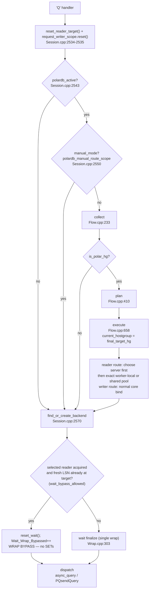
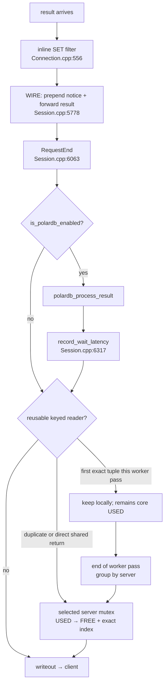
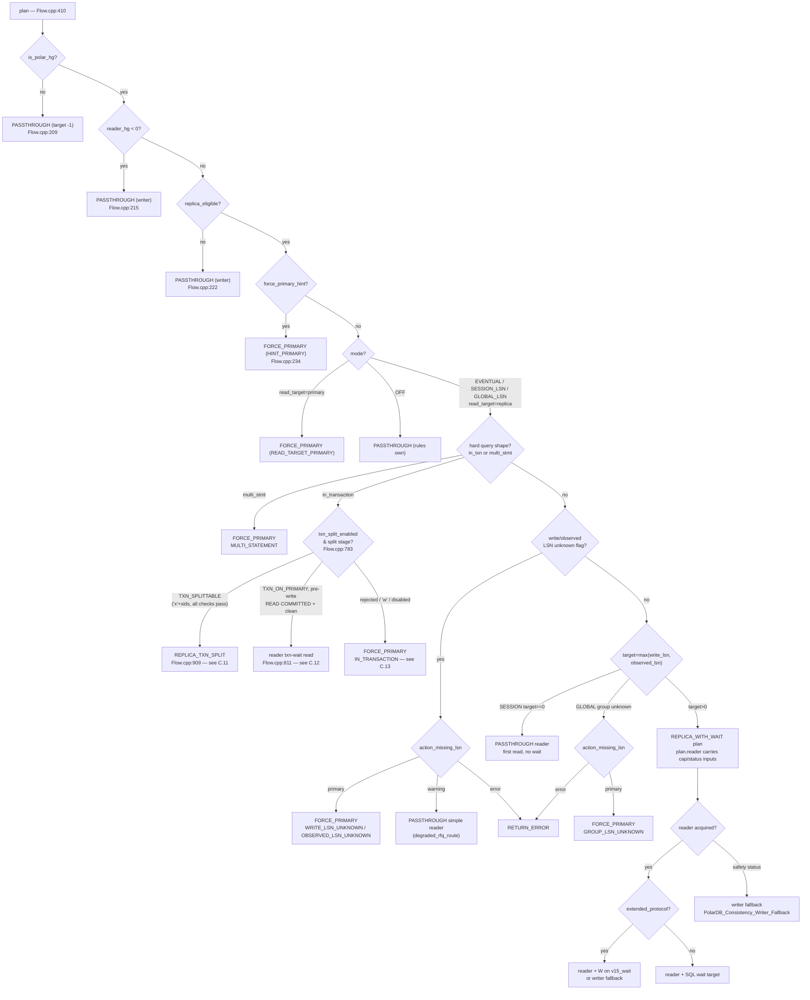
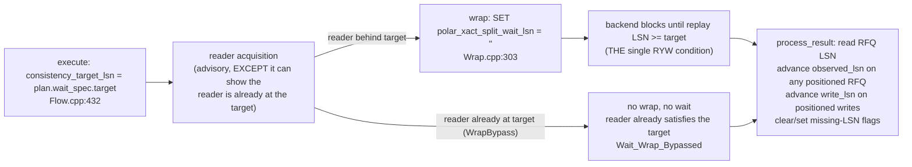

# PolarDB Routing Pipeline — Flow Reference (v2)

> Flow-reference view of the current PolarDB routing pipeline.
> This document uses compact stage IDs, boxed per-stage detail, and
> end-to-end ASCII traces (request *and* return path) for every scenario, including the
> transaction-split and reader-failure paths (C.11–C.16).
>
> Source of truth: `lib/PgSQL_PolarDB_Flow.cpp` (the four stage functions),
> `lib/PgSQL_Session.cpp` (orchestration and the response path),
> `lib/PgSQL_PolarDB_Wrap.cpp` (the single wrap point),
> `lib/PgSQL_Connection.cpp` (inline SET filtering),
> `lib/PgSQL_PolarDB_Notices.cpp` (timeout-notice capture).
>
> Verified against this branch.

---

## 0. Compact Stage IDs

```
Request path  (client → backend):
  [consistency_target_lsn reset] → [worker-local active?] → [manual-mode?] → collect → plan → execute
                       → select reader → local exact or shared pool → backend_bind
                       → wait_finalize → dispatch

Response path (backend → client):
  set_filter → wire (forward notice + result) → request_end → [is_polardb_enabled?]
             → process_result → keep for worker pass or return shared → writeout
```

**Fast-exit conditions (so a non-PolarDB query pays almost nothing):**
- `PgSQL_Thread::polardb_is_active()` reads a worker-local boolean snapshot and
  skips the entire collect / plan / execute pipeline when no PolarDB hostgroup
  is configured. HGM publishes the shared atomic condition on topology changes;
  workers consume it on wake/maintenance, not once per query.
- `is_polardb_enabled` (session bool): skips the `polardb_process_result()` call on the
  response path for any session that never connected to a PolarDB hostgroup
  (`lib/PgSQL_Session.cpp:6102-6103`).

**Always-on safety, even before the condition:**
- The per-query reader plan and writer scope are reset unconditionally at the very
  top of the handler, before the `polardb_active` check, so a stale LSN can never
  leak into a passthrough read (`polardb_query.reset_reader_target(); polardb_query.request_writer_scope.reset();`,
  `lib/PgSQL_Session.cpp:2534-2535`). `reset_reader_target()` resets the whole reader
  plan (`group_lsn`, `max_lag_bytes`, fallback writer, complete failure actions,
  consistency mode, and reader flags), not just one target field.

> Transaction split note: when `txn_split_enabled=1` and primary RFQ evidence is
> complete, this tree dispatches one in-transaction read to a temporary replica
> backend. Split routing, lazy warmup, and the common reader-failure policy are
> **current, active behavior** — traced end-to-end in scenarios C.11–C.16 below.
> Only advanced split ranking and CSN integration remain roadmap work
> ([19-FUTURE-TXN-SPLIT-DESIGN.md](19-FUTURE-TXN-SPLIT-DESIGN.md) for the deeper
> ranking design; [20-FUTURE-READER-FAILURE-RETRY-DESIGN.md](20-FUTURE-READER-FAILURE-RETRY-DESIGN.md)
> for the failure-policy rationale).

---

## A. Request Path — Detailed Stages

```
Stage 0  FAST EXIT + PER-QUERY RESET                      Session.cpp:2534,2546,2550
  Domain:   Session orchestration
  Reset:    polardb_query.reset_reader_target() + request_writer_scope.reset()  (always, before the condition)   :2534-2535
  check:    if (thread->polardb_is_active())
            If no PolarDB hostgroup is configured, skip Stages 1-3 entirely.
  Manual:   bool manual_mode = polardb_manual_route_scope(...)  (== replica_eligible < 0 && dest >= 0)   :2550-2552
            If a query rule set a destination and left replica_eligible
            unset, the user is doing manual routing — skip the pipeline and
            leave current_hostgroup as the rule set it (see E.5, scenario C.9).

Stage 1  COLLECT                                          Flow.cpp:233
  Domain:   Session + HGM snapshot; may repair session epoch state
  Function: polardb_collect(route_ctx, current_hg, qpo_replica_eligible, force_primary_hint)
  What:     Zero-init PolarDB_Query_RouteCtx, then snapshot every routing input:
            is_polar_hg, writer_hg/reader_hg, effective_consistency_mode,
            wait_timeout_ms/action, action_missing_lsn, read_target/fallback,
            max_lag_bytes, writer_scope, session.write_lsn, session.observed_lsn,
            write/observed missing-LSN flags, replica_eligible,
            is_multi_statement (own semicolon scan, eligible reads only),
            is_extended_protocol, in_transaction, force_primary_hint.
            If the writer_epoch differs from the session's stored epoch, collect
            reseeds the writer scope and clears session write/observed LSNs
            and both missing-LSN flags before copying them into route_ctx. It
            increments PolarDB_Session_Target_Epoch_Reset only if at least one
            target or flag was actually discarded.
  Fast exit: if the current HG is not a PolarDB HG, return immediately          :51-57
  Output:   PolarDB_Query_RouteCtx (request stack, immutable after collect)

Stage 2  PLAN                                             Flow.cpp:410
  Domain:   Pure decision (no mutations; one read of cached HGM LSNs for lag)
  Function: polardb_plan(route_ctx) → PolarDB_Query_RoutePlan
  What:     A flat, strictly top-down sequence of if-checks. First match returns.
              L-1  Fast paths       !is_polar_hg / reader_hg<0 / !replica_eligible
              L0   Hint override    force_primary_hint → FORCE_PRIMARY
              L1   Placement/mode   read_target=primary → FORCE_PRIMARY ; OFF → PASSTHROUGH
              L2   Query-shape      in_txn / multi-stmt → FORCE_PRIMARY
              L3   Missing target   write/observed/group LSN unknown → action_missing_lsn
              L4   Consistency      SESSION=max(write_lsn, observed_lsn); GLOBAL also includes group LSN
              L5   No-target path   target==0 → PASSTHROUGH to reader, no wait        (Flow.cpp:569-577)
              L6   Extended proto   target-bearing autocommit reads keep REPLICA_WITH_WAIT;
                                    execute requires v15_wait or falls back to writer
              L7   Lag-cap inputs   polardb_reader_lag_plan() attaches group_lsn/max_lag_bytes
                                    to plan.reader (NOT a plan FORCE_PRIMARY); the per-reader cap is
                                    enforced at backend acquisition, where over-cap → writer fallback
                                    counted as PolarDB_Consistency_Writer_Fallback (see C.8)   (Flow.cpp:595-597)
              L8   Otherwise        REPLICA_WITH_WAIT (target = reader)                (Flow.cpp:599-609)
  Output:   PolarDB_Query_RoutePlan { action, target_hg, wait, action_reason, ... }

Stage 3  EXECUTE                                          Flow.cpp:658
  Domain:   Session side effects (intent only — no packet rewrite here)
  Function: polardb_execute(plan, route_ctx, pkt) → PolarDB_Query_ExecuteResult
  What:     Always reset the per-query wait state first (:385-386). Then per action:
              PASSTHROUGH       → return plan.target_hg unchanged
              FORCE_PRIMARY     → final_target_hg = route_ctx.writer_hg
              REPLICA_WITH_WAIT → validate, then STAGE the wait:
                                  set polardb_query.reader_plan.consistency_target_lsn = plan.wait_spec.target,
                                  bump polardb_session_lsn_routing,
                                  fill PolarDB_Query_WaitPlan, prepare_from_spec(plan.wait_spec),
                                  wait_stage = WAITING, wait_started_at_us = now,
                                  snapshot the user query text,
                                  bump polardb_wait_wrap_prepared.
                                  (The wrapper SQL is NOT built here.)
  Runtime writer fallback: malformed packet (pkt.size<7, :408) or polardb_wait_disabled
                       flag set (:422) → override to FORCE_PRIMARY (writer).
  Output:   PolarDB_Query_ExecuteResult { final_target_hg }

Stage 4  BACKEND BIND  (+ reader acquire / wrap-bypass branch)   Session.cpp:2570, 5726-5805
  Domain:   Session orchestration
  Function: find_or_create_backend(current_hostgroup)
  What:     ReaderPool first selects the server from global topology and load.
            Only after that choice, try an exact connection retained by this
            worker for the current pass; on miss, use the selected server's
            shared FREE list under its pool mutex. Reset or create remains on
            that same selected server. For a
            pooled or fresh PolarDB connection, set is_polardb_enabled = true
            (Session.cpp:5696 pooled, :5710 fresh). Init the query on the data
            stream. The original (unwrapped) packet still sits on the stream.
  Wrap bypass branch (only when reader_plan.has_consistency_target_lsn()):
            If the acquired reader is ALREADY at the consistency target, the
            staged wait is a no-op, so it is cleared here and Stage 5 wraps
            NOTHING. If selection confirmed the reader's fresh cached LSN already
            reached the target and acquisition stayed on that reader,
            get_MyConn_polardb_reader() returns it with
            wait_bypass_allowed set → reset_wait() + reset_reader_target();
            wait_wrap_bypassed++ ;
            trace "PolarDB WRAP BYPASS: route-smart reader reached
            consistency_target_lsn=...".
            Any OTHER acquired reader keeps the staged wait — the wrapper is the
            correctness enforcement (PolarDB_Target_LSN_Fallback_Wait). See E.3.

Stage 5  WAIT FINALIZE (single wrapping point)            Wrap.cpp:303  (called Session.cpp:3607)
  Domain:   Session + packet rewrite
  Function: finalize_wait_timeout_injection(conn, myds)
  What:     After the connection is established (ASYNC_IDLE), build the wrapped
            query ONCE from the saved snapshot:
              build_polar_consistency_mode_set()  → "SET polar_consistency_mode = '...';"   :222
              build_wrapped_wait_query()          → mode SET + timeout SET + wait SET + query :224
            Replace the packet on the data stream; set the expected SET-result
            count. If the build cannot run safely, call fail_wait_wrap_finalize()
            (see B/Stage and section 8), which fails the query closed.
  Note:     PolarDB backends always support the wait/timeout GUCs, so there is no
            per-connection probe (see E.1).

Stage 6  DISPATCH                                         Connection.cpp (async_query / query_start)
  Domain:   Connection / libpq
  Function: PgSQL_Connection::async_query() → query_start() → PQsendQuery()
  What:     Begin the per-connection wrap-state countdown
            (polardb_query_wrap_state, Connection.h:776) with the wrapper
            statement count, so the connection layer can consume the prepended
            SET results inline. Send the query to the backend via the libpq async
            API.

Connection setup (cold path, once per backend connection):
  build_polardb_startup_profile() + append_polardb_startup_params()
    Resolve per-HG `proxy_protocol` over global `pgsql-polardb_proxy_protocol`.
    v15 emits `_polar_proxy_client_host`, `_polar_proxy_client_port`,
    `_polar_proxy_send_lsn=true`; legacy emits `_polar_origin_client_ip`,
    `_polar_origin_client_port`, `_polar_send_lsn=true`; off emits no PolarDB
    proxy startup params. RFQ-requesting profiles require a usable identity.
  polardb_init_connection_tracking()
    Called after successful connect. Calls PQsetPolarSendLSN(conn,1) only when
    the recorded startup profile requested REQUEST_RFQ_LSN. This is requested,
    not confirmed: backend RFQ LSN capability is confirmed only by later RFQs
    that actually carry LSN.
```

---

## B. Response Path — Detailed Stages

```
Stage 1  SET FILTER (inline, in the connection handler)   Connection.cpp:556
  Domain:   Connection handler NEXT_IMMEDIATE loop
  Function: PgSQL_Connection::handler() inline block
  What:     "Deterministic inline consumption of wrapped prepended SET results."
            For a wrapped read, the first N completed results are the SET
            statements. The connection counts them down (stmt_total) and loops
            back without forwarding them. When the count reaches zero, the next
            result is the user's result and is forwarded normally.
            The connection is the sole owner of SET-result consumption; the
            session/WIRE never sees the prepended SET results.

Stage 2  WIRE (forward notice + result)                  Session.cpp:5778
  Domain:   Session result routing
  Function: PgSQL_Result_to_PgSQL_wire(conn, myds)
  What:     If a best_effort wait timed out, the backend emitted a WARNING/NOTICE
            while the wrapped SELECT ran; it was captured to pending_notices.
            WIRE prepends those captured notices to the client output buffer so
            the client sees them ahead of the SELECT result (:5820-5828), then
            forwards the user result. Ownership of the notice bytes transfers to
            the output array (cleared without freeing).

Stage 3  REQUEST END                                     Session.cpp:6063
  Domain:   Session cleanup + tracking
  Function: RequestEnd(myds, called_on_failure)
  What:     On the success branch, caller-side condition:
              if (!called_on_failure && polardb_config.is_polardb_enabled)
                  polardb_process_result(myds, query_digest_text);
            Then account the wait time once and clear per-query state:
              record_wait_latency(polardb_query.wait);                           :6317
              polardb_query.reset_for_new_query();                               :6318
              clear_pending_notices(/*free_buffers=*/true);                      :6319
  Note:     reset_for_new_query() (include/PgSQL_PolarDB.h:1651) clears ALL per-query
            PolarDB state — reader plan (reader_plan.reset()), request_writer_scope,
            wait, wrapped_query_buf, and the dispatch-wrapper fields — not just
            consistency_target_lsn. clear_pending_notices(true) then frees any notice
            buffers not forwarded on error paths.
  Note:     The caller-side condition avoids a function call and a log line on the
            skip path for non-PolarDB sessions.

Stage 4  PROCESS_RESULT
  Domain:   Consistency / write tracking
  Function: polardb_process_result(myds, query_digest_text)
  What:     Read the backend WAL LSN from ReadyForQuery ONCE
            (myds->myconn->get_polardb_lsn() — no extra round-trip; 0 if
            the RFQ carried no LSN).
            Classify the query with is_write_query() (:498) — the only use of the
            write/read heuristic in the pipeline.
            Advance polardb_session_consistency.observed_lsn on any positioned RFQ LSN.
            Advance polardb_session_consistency.write_lsn only for positioned writes. Protected
            reads wait on max(write_lsn, observed_lsn). A primary-sourced
            positioned RFQ clears write/observed missing-LSN flags; a
            replica-sourced RFQ updates observed/cache state but does not clear
            those flags. Refresh the per-server LSN cache and bump
            polardb_server_lsn_updates_from_rfq only after the direct HGM
            update condition accepts an LSN-bearing RFQ for the current writer group+epoch.

Stage 5  CONNECTION RETURN                                (finishQuery / worker pass)
  Domain:   Core pool ownership
  What:     If multiplexing permits return, keep at most one exact reader
            connection per selected server, startup generation, and key for the
            current worker pass. A duplicate returns directly to that server's
            shared FREE list. At pass end, group retained entries by server and
            return each group under one server mutex. The connection remains in
            core USED while retained; worker inventory never selects a server.

Stage 6  WRITEOUT                                         (Session writeout path)
  Domain:   Protocol output
  What:     Flush the client output buffer to the network. The session returns to
            waiting for the next request.
```

> Transaction split adds a small completion step after the temporary replica read:
> `polardb_complete_txn_split_read()` restores the primary backend after success,
> and `polardb_abort_txn_split_read()` blocks later splits in the same transaction
> after a failed split read.

---

## C. End-to-End Scenario Traces

The traces use the same notation as the full implementation document: `CLIENT ──▶` is a
client packet, `├─` is a step, `│` is the same request continuing, `BACKEND ──▶`
/ `REPLICA ──▶` is a result arriving, `──✗` is a backend failure. Every trace shows the
**return path** as well as the request path — for the split scenarios (C.11–C.16) the
return leg is where the real work lands (wrapper-SET filtering, result forwarding, the
reader→primary backend restore, temporary-reader cleanup, and commit accounting).

The split traces (C.11–C.16) use two PolarDB-specific concepts:

- **Split markers** — bytes the patched libpq reads from the primary's extended
  ReadyForQuery payload (`deps/postgresql/polardb_libpq.patch:280-321`): `'x'` =
  **splittable** (WAL flushed, an XID list follows, so a read may be split to a replica);
  `'w'` = **WAL pending** (XIDs present but the replica wait is not yet safe, so the read
  fails closed to the writer). These are separate from the ordinary transaction-status
  byte `'I'`/`'T'`/`'E'` (idle / in-txn / failed-txn).
- **Split stages** (`PolarDB_TransactionSplitStage`, set by `observe_primary_rfq()`,
  `PgSQL_PolarDB.h:1739-1780`): `TXN_ON_PRIMARY` (in a txn, no split evidence yet —
  pre-write), `TXN_SPLITTABLE` (`'x'`+XIDs seen — a read may split), and
  `TXN_SPLIT_READ_ACTIVE` (a split read is in flight on a temporary reader backend).

### C.1 Regular Query (non-PolarDB hostgroup)

```
CLIENT ──▶ handler() receives 'Q' packet
           │
           ├─ polardb_query.reset_reader_target() + request_writer_scope.reset()   ← always reset (Session.cpp:2534-2535)
           ├─ thread->polardb_is_active() == false                  ← worker-local fast bypass
           │    skip collect / plan / execute entirely
           │    cost: one predictable worker-local branch
           │
           ├─ find_or_create_backend(current_hostgroup)             Session.cpp:2570
           ├─ query runs (no wrapping, wrap-state not started)
           │
     BACKEND ──▶ result arrives
           │
           ├─ Connection::handler()  — no wrapped read → no inline filter
           ├─ PgSQL_Result_to_PgSQL_wire() — forward result as-is
           ├─ RequestEnd()  — is_polardb_enabled == false → process_result NOT called
           └─ writeout() → client
```

### C.2 Session Consistency (LSN wait, autocommit SELECT) — the core case

```
CLIENT ──▶ handler() receives 'Q' packet: SELECT ...
           │
           ├─ polardb_collect(route_ctx, hg=100, replica_eligible=1, hint=false)   Flow.cpp:233
           │    route_ctx.is_polar_hg = true
           │    route_ctx.writer_hg = 100, route_ctx.reader_hg = 101
           │    route_ctx.effective_consistency_mode = SESSION_LSN
           │    route_ctx.session.write_lsn = 0/1A3B400
           │    route_ctx.session.observed_lsn = 0/1A3B200
           │    route_ctx.in_transaction = false, route_ctx.is_multi_statement = false,
           │    route_ctx.is_extended_protocol = false
           │
           ├─ polardb_plan(route_ctx)                                              Flow.cpp:410
           │    L-1 eligible, reader present
           │    L1  mode = SESSION_LSN, read_target = replica
           │    L2  not in txn / not multi / not extended
           │    L4  target=max(write_lsn, observed_lsn)=0/1A3B400 → has_wait
           │    L5  reader lag within cap → allowed
           │    → action = REPLICA_WITH_WAIT, target_hg = 101, plan.wait_spec.target = 0/1A3B400
           │
           ├─ polardb_execute(plan, route_ctx, pkt)                               Flow.cpp:658
           │    reset per-query wait state                                   :385-386
           │    polardb_query.reader_plan.consistency_target_lsn = 0/1A3B400                 :432
           │    bump polardb_session_lsn_routing                            :433
           │    stage wait: wait_stage=WAITING, snapshot "SELECT ..."       :436-448
           │    bump polardb_wait_wrap_prepared                            :451
           │    → final_target_hg = 101    (wrapper deferred to finalize)
           │
           ├─ find_or_create_backend(101)                                  ← replica
           │    backend acquisition: if the acquired reader is ALREADY at
           │    0/1A3B400 (fresh selected-reader LSN confirmation sets
           │    wait_bypass_allowed):
           │      reset_wait(); polardb_wait_wrap_bypassed++
           │      → wrapper SKIPPED, the bare "SELECT ..." is dispatched (no SETs).
           │    Otherwise (reader behind target) the staged wait stands and the
           │    trace continues on the wrap path below (Target_LSN_Fallback_Wait).
           │
           ├─ finalize_wait_timeout_injection(conn, myds)                   Wrap.cpp:303 (Session.cpp:3607)
           │    build_polar_consistency_mode_set() → "SET polar_consistency_mode = 'best_effort'; "
           │    build_wrapped_wait_query():
           │      "SET polar_consistency_mode = 'best_effort'; "
           │      "SET polar_proxy_wait_timeout_ms = 1000; "
           │      "SET polar_xact_split_wait_lsn = '0/1A3B400'; "
           │      "SELECT ..."
           │    replace packet on data stream; expected SET results = 3
           │    bump polardb_wait_lsn_sent
           │
           ├─ async_query() → query_start() → PQsendQuery(wrapped query)
           │    begin polardb_query_wrap_state (stmt_total = 3)
           │
     REPLICA ──▶ results arrive (3 SET results, then the SELECT)
           │
           ├─ Connection::handler() inline filter                          Connection.cpp:556
           │    consume 3 SET results (countdown 3→0), then forward the SELECT
           │
           ├─ PgSQL_Result_to_PgSQL_wire()                                 Session.cpp:5778
           │    (best_effort: if a timeout NOTICE was captured, prepend it)  :5820-5828
           │    forward SELECT result to client
           │
           ├─ RequestEnd()                                                 Session.cpp:6063
           │    polardb_process_result(myds, "SELECT")                            :6103 →
           │      read RFQ LSN from the replica connection
           │      not a write → polardb_session_consistency.write_lsn unchanged
           │      refresh per-server LSN cache (replica), bump *_from_rfq
           │    record_wait_latency(polardb_query.wait)                    :6317
           │    polardb_query.reset_for_new_query()                        :6318  ← clears reader plan, writer scope, wait, wrapped buffer, dispatch fields
           │    clear_pending_notices(true)                                :6319
           │
           └─ writeout() → client gets the SELECT result only
```

### C.3 First read of a session / no session target

```
CLIENT ──▶ SELECT ...   (autocommit, SESSION_LSN, but the session has no write or observed target)
           │
           ├─ polardb_collect(route_ctx, ...)
           │    route_ctx.session.write_lsn = 0
           │    route_ctx.session.observed_lsn = 0
           │
           ├─ polardb_plan(route_ctx)
           │    SESSION_LSN target==0 → PASSTHROUGH to reader_hg (101), no wait.
           │    If the RFQ carries LSN, result processing records it as observed for later reads.
           │    GLOBAL_LSN instead includes the current group LSN from the first read;
           │    an unknown group observation goes through pgsql-polardb_action_missing_lsn.
           │
           ├─ execute: PASSTHROUGH → final_target_hg = 101 (no wrapper), or
           │    REPLICA_WITH_WAIT when GLOBAL_LSN supplied a non-zero group target
           ├─ find_or_create_backend(101) ← replica, query runs unwrapped
           └─ normal response path; result processing refreshes the per-server LSN cache
              and records the observed LSN when RFQ carries one
```

### C.4 Read target = primary

```
CLIENT ──▶ SELECT ...
           │
           ├─ polardb_collect(route_ctx, ...) → route_ctx.read_target = PRIMARY
           │
           ├─ polardb_plan(route_ctx)
           │    read_target == PRIMARY → FORCE_PRIMARY, reason = READ_TARGET_PRIMARY
           │
           ├─ execute: FORCE_PRIMARY → final_target_hg = writer_hg (100)
           ├─ find_or_create_backend(100) ← primary, no wrapping, no wait
           └─ normal response path (process_result still runs for LSN tracking)
```

### C.5 In an explicit transaction (route to writer)

```
CLIENT ──▶ BEGIN ; ... ; SELECT ...   (the SELECT is inside an explicit transaction)
           │
           ├─ polardb_collect(route_ctx, ...) → route_ctx.in_transaction = true
           │
           ├─ polardb_plan(route_ctx)
           │    L2  in_transaction → FORCE_PRIMARY, action reason = IN_TRANSACTION         Flow.cpp:269-276
           │
           ├─ execute: FORCE_PRIMARY → writer_hg (100)
           └─ the read runs on the primary (always consistent)

  NOTE: routing to the writer (above) is the default for an in-transaction read, but it
  is not the only behavior. When `txn_split_enabled=1` (per-HG,
  `pgsql_replication_hostgroups.txn_split_enabled`, default `0`) the read may instead be
  split to a replica — see the full end-to-end traces **C.11** (splittable read after a
  write), **C.12** (pre-write reader wait), and **C.13** (why a read is rejected back to
  the writer). Only advanced split ranking and CSN integration remain roadmap work
  ([19-FUTURE-TXN-SPLIT-DESIGN.md](19-FUTURE-TXN-SPLIT-DESIGN.md)).
```

### C.6 Multi-statement read (route to writer)

```
CLIENT ──▶ SELECT a; SELECT b;   (replica_eligible, but more than one statement)
           │
           ├─ polardb_collect(route_ctx, ...)
           │    own semicolon scan: trim, drop one trailing ';', any ';' left?   Flow.cpp:85-96
           │    → route_ctx.is_multi_statement = true
           │
           ├─ polardb_plan(route_ctx)
           │    L2  is_multi_statement → FORCE_PRIMARY, action reason = MULTI_STATEMENT    Flow.cpp:277-284
           │
           └─ the read runs on the primary
              (a wrapped read must be a single statement so the connection layer
               can count SET results correctly)
```

### C.7 Extended autocommit protocol

```
CLIENT ──▶ Parse / Bind / Execute   (extended query protocol)
           │
           ├─ Manual destination_hostgroup reader route:
           │    honored as manual policy, no automatic wait.
           │
           ├─ Automatic replica_eligible read with no target:
           │    reader passthrough; no W is needed.
           │
           ├─ Automatic read with a known target and target-ready reader:
           │    reader route; confirmed-cache bypass emits no W.
           │
           ├─ Automatic read with a known target and behind reader:
           │    v15_wait emits W immediately before Parse or Bind/Execute in the
           │    same libpq flush; no extra round trip.
           │
           └─ Unsupported profile, unknown target, unsafe frame shape, or transaction:
                writer route. Once any command is sent, the complete Sync frame
                remains pinned to that backend.
```

Flush does not end this ownership. A later operation in the same Sync cycle is
replanned against fresh session-local state, but it may only run on the already
pinned backend. A newer target can therefore add `W` on a pinned
`v15_wait` reader; it cannot switch the open frame to another backend.
Ambiguous or multi-operation cycles are sent to the writer before the first
backend command.

If that later operation selects another hostgroup, ProxySQL rejects it before
backend dispatch with SQLSTATE `P0001`. At a Flush boundary the client receives
only ErrorResponse; ProxySQL discards the rest of the cycle through client Sync,
then emits the one ReadyForQuery owned by that Sync. This is the deliberate
mixed-hostgroup limitation: no operation after the conflicting route is sent to
either backend.

Flush also does not provide the final RFQ that positions successful Execute
results. ProxySQL aggregates their writer/read classification, writer scope,
and confirmed wait target in `polardb_extended_rfq`. When Sync obtains the
backend RFQ, one result-processing pass applies that RFQ to the aggregate and
then emits the single client RFQ. If the backend is lost before that RFQ, an
aggregated write is abandoned fail-closed by marking the session write position
unknown. A following Simple Query injects the missing backend Sync even when
the client-message queue was already drained by Flush.

After ErrorResponse, ProxySQL discards queued and newly received frame messages
until client Sync, exactly as PostgreSQL does. Backend pipeline recovery happens
first; the client receives exactly one ReadyForQuery for its Sync, never one at
the preceding Flush boundary.

When ProxySQL must issue an implicit backend Parse before the client's Execute
or Describe, `implicit_prepare_continuation` owns that one logical return point.
It survives a controlled writer retry and is cleared exactly once at the central
request terminal boundary. The existing `previous_status` stack remains solely
the transport continuation across connect, reset, and init-connect work.

### C.8 Reader acquisition fails the lag-cap safety check

```
CLIENT ──▶ SELECT ...   (autocommit, SESSION_LSN, session has written)
           │
           ├─ polardb_plan(route_ctx)
           │    L4  target=max(write_lsn, observed_lsn) > 0 → has_wait
           │    L5  polardb_reader_lag_plan(): attach group_lsn + max_lag_bytes
           │    → REPLICA_WITH_WAIT plan with plan.reader requirements
           │
           ├─ get_MyConn_polardb_reader(reader_hg, plan.reader)
           │    cap enabled; candidate readers are missing/stale/over-lagged
           │    → GROUP_LSN_UNKNOWN / READER_LSN_UNKNOWN /
           │      READER_LSN_STALE / READER_LAG_EXCEEDED
           │
           └─ session dispatch redirects this one read to the writer and bumps
              PolarDB_Consistency_Writer_Fallback

  NOTE: the lag cap is a SAFETY check, not the consistency condition. The RYW guarantee
  comes from the wait SET, not from the cap (see E.3). The cap only avoids picking
  a replica so far behind that the wait would probably time out. When lag and
  contention collide, safety statuses outrank READER_BUSY, so the query may use
  the writer instead of waiting for a busy but in-cap reader.
```

### C.9 Manual mode (pipeline bypass)

```
Setup: a query rule sets destination_hostgroup=105 and leaves replica_eligible unset.

CLIENT ──▶ SELECT /* analytics */ count(*) FROM big_table
           │
           ├─ qpo: destination_hostgroup = 105, replica_eligible = -1 (unset)
           ├─ current_hostgroup = 105 (from the rule)
           │
           ├─ manual_mode = polardb_manual_route_scope(...) = true               Session.cpp:2550-2552
           │    (manual ≡ replica_eligible < 0 && dest >= 0)
           │    → SKIP the pipeline entirely (collect/plan/execute not run)
           │
           ├─ find_or_create_backend(105)
           ├─ query runs on HG 105 as-is (no wrapping, no wait, no consistency)
           └─ normal response path

  NOTE: a manually-routed read gets neither the SQL wrapper nor protocol W. Consistency for
  this path is the operator's responsibility. This is the one bypass that is NOT
  protected by automatic writer fallback (see section 8 / E.5). Auto-installed rules set replica_eligible=1
  (auto mode), not a destination, so they do not trigger manual mode.
```

### C.10 Wrapper build fails -> writer-fallback flag

```
CLIENT ──▶ SELECT ...   (plan said REPLICA_WITH_WAIT, execute staged the wait)
           │
           ├─ finalize_wait_timeout_injection(conn, myds)                       Wrap.cpp:303
           │    a precondition is missing:
           │      missing backend connection or data stream                      :214
           │      missing original-query snapshot                                :218
           │      wrapped query came out empty                                   :248
           │    → fail_wait_wrap_finalize(reason)                                :260
           │        set polardb_wait_disabled = true   (flag for this session)  :268
           │        bump polardb_wait_wrap_safety_abort                          :267
           │
           ├─ the CURRENT query is NOT silently sent to the replica:
           │    return a clean ERROR packet and end the request                  Session.cpp:3607
           │
           └─ EVERY later read in this session now uses the writer
              via the execute-time wait_disabled check                          Flow.cpp:705
              (until a RESET clears the flag, Wrap.cpp:330)
```

### C.11 Transaction split — read after a write, warm reader pool (the core split case)

```
  Precondition: client is in an explicit txn that has already written; the last primary
  RFQ carried split marker 'x' + a non-empty XID list, so observe_primary_rfq() set
  stage=TXN_SPLITTABLE, primary_lsn=0/1A3B400.        Consistency.cpp:238-246 / PgSQL_PolarDB.h:1774

CLIENT ──▶ handler() receives 'Q': SELECT ...   (in txn, replica_eligible=1)
           │
           ├─ polardb_collect(route_ctx, hg=100)                                  Flow.cpp:233
           │    in_transaction = true, txn_split_enabled = 1
           │    transaction_split.stage = TXN_SPLITTABLE           ('x' evidence)
           │    transaction_split_xids = [4711,4712]  primary_lsn = 0/1A3B400
           │
           ├─ polardb_plan(route_ctx)                                             Flow.cpp:783
           │    in_transaction → polardb_txn_split_rejection_reason() = NONE      PgSQL_PolarDB.h:2690
           │      (not multi/extended, not FOR UPDATE, is SELECT, write_lsn+
           │       observed_lsn known, not blocked, not 'w', xids != empty)
           │    queries_in_splittable_txn++ :786   queries_split_eligible++ :918
           │    → action = REPLICA_TXN_SPLIT, target_hg = 101,                    Flow.cpp:909-913
           │      wait target = primary_lsn = 0/1A3B400, wait_mode = STRICT (forced),
           │      allow_reader_without_target = false
           │
           ├─ polardb_execute → polardb_prepare_txn_split_read(plan)              Flow.cpp:1310 / Split.cpp:462
           │    required checks pass: reader_hg>=0, xids != empty, wait_spec.has_wait() :480
           │    acquire reader: get_MyConn_polardb_reader(TXN_READER_ONLY_POOLED) :524
           │      → POOL HIT  split_pool_hit++ :566 ; attach reader backend
           │    build wrapped query (4 SET stmts):                               Split.cpp:631
           │      "SET polar_xact_split_xids = '4711,4712'; "       (XID import)  :661
           │      "SET polar_consistency_mode = 'strict'; "                       Wrap.cpp:208
           │      "SET polar_proxy_wait_timeout_ms = 1000; "
           │      "SET polar_xact_split_wait_lsn = '0/1A3B400'; "
           │      "SELECT ..."      (WrapBypass reduces this to just the xids SET
           │                         + query when the reader is already at target)
           │    polardb_begin_txn_split_read():                                   Split.cpp:297
           │      save primary_backend, SWAP mybe = reader_backend :279-283
           │      stage = TXN_SPLIT_READ_ACTIVE :324 ; split_reads_total++ :615 ;
           │      split_lsn_wait_count++ :620
           │    → final_target_hg = 101   (writer connection stays OPEN, idle-in-txn)
           │
     REPLICA ──▶ results arrive: 4 SET results, then the SELECT
           │
           ├─ Connection::handler() inline filter                                Connection.cpp:775
           │    consume 4 SET results (countdown 4→0), forward only the SELECT
           │
           ├─ PgSQL_Result_to_PgSQL_wire() → forward SELECT to client            Session.cpp:3940
           │
           ├─ polardb_split_completed → polardb_complete_txn_split_read()        Session.cpp:3978 / Split.cpp:757
           │    finish_txn_reader_read(success): split_reads_success++ :721 ; did_split=true
           │    reset_txn_split_read(): RESTORE mybe = primary_backend :699 ; free original_pkt ;
           │      stage → TXN_SPLITTABLE :738
           │    release temp reader → reusable → current-pass local entry or shared pool  Split.cpp:819
           │      split_conn_cleanup_success++ :851
           │      (a later non-split query on that reader first prepends
           │       SET polar_xact_split_xids='' to normalize it — Connection.cpp:2366)
           │
           └─ transaction CONTINUES on the primary backend (never left the writer)
              …later COMMIT → primary RFQ status 'I' →
                txn_committed_with_split++  Consistency.cpp:230 ; split state cleared
```

### C.12 Transaction split — read BEFORE the first write (reader txn-wait, not a split)

```
  Precondition: client is in an explicit txn that has NOT written yet, so the primary
  RFQ carried no XID list → stage = TXN_ON_PRIMARY. Session is READ COMMITTED with clean
  local state. This is the ordinary session-LSN wait taken inside a txn — NOT a split
  (no XIDs to import); the primary txn backend is kept open and restored afterward.

CLIENT ──▶ 'Q': SELECT ...   (in txn, before any write, replica_eligible=1)
           │
           ├─ polardb_collect → in_transaction=true, txn_split_enabled=1          Flow.cpp:233
           │    transaction_split.stage = TXN_ON_PRIMARY, xids = empty
           │
           ├─ polardb_plan                                                        Flow.cpp:799
           │    split_reason = IN_TRANSACTION, stage==TXN_ON_PRIMARY, xids empty,
           │      is_txn_split_safe_read = true
           │    txn_reader_wait_isolation_read_committed && local_state_clean ?    Flow.cpp:805
           │      YES → allow_transaction_wait_read, plan.txn_wait_read = true,
           │            target_hg = reader_hg (101), route_txn_wait_planned++      Flow.cpp:811-813
           │      NO  → FORCE_PRIMARY (IN_TRANSACTION)   [safe fallback]           Flow.cpp:826
           │    target = max(write_lsn, observed_lsn)  (session target, NOT primary_lsn)
           │
           ├─ polardb_execute → polardb_prepare_txn_wait_read                     Split.cpp:336
           │    save primary_backend, SWAP mybe = reader_backend                  Split.cpp:279
           │    wrapped query = 3 SETs (mode / timeout / wait_lsn) + SELECT   (no xids SET)
           │    → final_target_hg = 101   (writer connection stays OPEN, idle-in-txn)
           │
     REPLICA ──▶ 3 SET results, then the SELECT
           │
           ├─ Connection filter: consume 3 SETs, forward the SELECT              Connection.cpp:775
           ├─ forward SELECT to client                                           Session.cpp:3940
           ├─ complete → finish_txn_reader_read(success)                         Split.cpp:708
           │    RESTORE mybe = primary_backend, release reader to current-pass local entry
           │    or the selected server's shared pool                              Split.cpp:699/819
           │
           └─ transaction CONTINUES on the primary backend; a later write moves the
              stage to TXN_SPLITTABLE and subsequent reads may take the C.11 path
```

### C.13 Transaction split rejected → stay on the primary (ordered checks)

```
  Any in-transaction read that is NOT provably splittable stays on the writer. The first
  failing condition wins; each bumps its own counter, then the read runs on the primary with
  no wrapper and a normal (unswapped) return.

CLIENT ──▶ 'Q': <in-transaction read>
           │
           ├─ polardb_plan → polardb_txn_split_rejection_reason()                 PgSQL_PolarDB.h:2690
           │    evaluated in order; first hit → FORCE_PRIMARY + counter:
           │      txn_split_enabled = 0        → HG_SPLIT_DISABLED   (no split ctr)      :2702
           │      is_multi_statement           → MULTI_STATEMENT     split_rejected_multistatement       Flow.cpp:834
           │      is_extended_protocol         → EXTENDED_PROTOCOL   (no split ctr)      :2704
           │      FOR UPDATE / FOR SHARE       → SPLIT_LOCKING_READ  split_rejected_for_update           Flow.cpp:840
           │      not a plain SELECT           → SPLIT_NOT_SELECT    split_rejected_not_select           Flow.cpp:837
           │      write_lsn unknown            → SPLIT_WRITE_LSN_UNKNOWN     split_rejected_write_lsn_unknown    Flow.cpp:843
           │      observed_lsn unknown         → SPLIT_OBSERVED_LSN_UNKNOWN  split_rejected_observed_lsn_unknown Flow.cpp:846
           │      split faulted earlier (txn)  → SPLIT_BLOCKED       split_blocked_reads                 Flow.cpp:863
           │      RFQ marker 'w' (WAL pending) → WAL_PENDING         split_wal_pending                   Flow.cpp:849
           │      stage != TXN_SPLITTABLE      → IN_TRANSACTION      (→ C.12 pre-write, else primary)
           │      xids empty at SPLITTABLE     → INVARIANT_VIOLATION split_invariant_violations          Flow.cpp:866
           │      primary_lsn == 0             → NO_TXN_LSN          (no split ctr)      :2715
           │      all pass                     → NONE → SPLITTABLE (see C.11)
           │
           ├─ execute: FORCE_PRIMARY → final_target_hg = writer_hg (100)
           └─ read runs on the primary, normal response path (no wrapper, no backend swap)

  NOTE: the 'w' (WAL-pending) marker means the primary flushed XIDs but the replica wait
  is not yet safe, so a 'w' read fails closed to the writer — distinct from the 'x'
  (splittable) marker that C.11 acts on.
```

### C.14 Split reader pool empty → writer fallback + background warmup (lazy, demand)

```
  Plan said REPLICA_TXN_SPLIT (as C.11), but no compatible reader is pooled. The CURRENT
  read is never blocked on a connect: it falls back to the writer, and a warmup request
  is enqueued for FUTURE reads WITHOUT holding the HGM lock.

CLIENT ──▶ 'Q': <splittable in-txn read>   (stage=TXN_SPLITTABLE, 'x'+xids)
           │
           ├─ polardb_plan → REPLICA_TXN_SPLIT, target_hg = reader_hg (101)       Flow.cpp:909
           │
           ├─ polardb_execute → polardb_prepare_txn_split_read                    Split.cpp:462
           │    acquire reader (TXN_READER_ONLY_POOLED) → NOT acquired            Split.cpp:524
           │      split_fallback_* / split_pool_empty++                           Split.cpp:538
           │      split_warmup_can_help(status)?  (UNAVAILABLE/BUSY/RFQ_UNAVAIL)  PgSQL_PolarDB.h:501
           │        → polardb_request_txn_split_warmup(reader_hg,"demand")        Split.cpp:547
           │            enqueue under split_warmup_mutex_ ONLY (HGM lock NOT held) ReaderPool.cpp:394
           │            dedup: split_warmup_dedup_queued / _dedup_inflight
           │            queue full (1024) → split_warmup_queue_full, else
           │            push + split_warmup_requested++, warmup_pending gauge++,
           │            notify split_warmup_thread ───────────────┐
           │    prepare returns FALSE                             │
           │                                                      │
           ├─ execute FALLBACK: final_target_hg = writer_hg (100) │             Flow.cpp:1327
           │    split_reads_fallback++                            │             Flow.cpp:1328
           │                                                      ▼
           └─ CURRENT read runs on the PRIMARY (normal return)    background: warm_split_pools()
                                                                  connects readers for future
                                                                  reads; takes hgm wrlock only on
                                                                  the worker thread   ReaderPool.cpp:978/1021
```

### C.15 Split reader dies mid-read → retry another reader, then writer (reroute)

```
  The C.11 read was dispatched to a reader whose connection was LOST before the result
  started. The failed endpoint is captured and excluded; the read is retried once on
  another compatible reader, and only then on the writer. The transaction is never broken.

REPLICA#1 ──✗ connection lost during the split read
           │
           ├─ polardb_on_failure (classified split_read; capture pkt/xids/wait_spec)  Failure.cpp:184/421
           │    split_error_query_failed++ ; !connected → split_error_connection_lost++  Failure.cpp:307/309
           │    resolve_writer_state → LIVE (writer txn still good)                    Failure.cpp:486
           │    reader_death_action = retry ; kind = CONNECTION_LOST ;
           │    split_read && reader_retry_attempts < 1 → OTHER_READER + SKIP_READER   Failure.cpp:567-586
           │
           ├─ result NOT started → polardb_try_redispatch_to_other_reader             Failure.cpp:871
           │    acquire reader EXCLUDING the failed addr/port                          Failure.cpp:937
           │    rebuild wrapper, begin_txn_split_read, reader_retry_attempts++,
           │    split_reads_retried_on_reader++                                        Failure.cpp:964-970
           │    set_reader_skip(addr,port) → excluded on next acquire                  Failure.cpp:608 / Split.cpp:512
           │      │
           │      ├─ REPLICA#2 acquired → dispatch retry → normal C.11 return path
           │      └─ no other reader / declines → writer LIVE →
           │           polardb_try_redispatch_to_writer (split_reads_retried++)        Failure.cpp:804/864
           │           FORCE_WRITER: set_force_writer(writer_hg) →                     Failure.cpp:597
           │           all later txn reads forced to writer (READER_FAILURE_FORCE_WRITER)  Flow.cpp:720
           │
           └─ client sees only the successful retried result; transaction intact
```

### C.16 Split reader returns an ERROR → forward it, keep the txn alive ('T')

```
  The reader ran but the query itself errored (a real SQL error, reusable connection).
  ProxySQL does NOT fabricate transaction control on a live txn: it forwards the reader's
  real error to the client followed by ReadyForQuery('T'), so the client's transaction
  stays open on the writer and it can retry the statement or ROLLBACK.

REPLICA ──▶ ErrorResponse (query error), connection reusable
           │
           ├─ polardb_on_failure (split_read)                                     Failure.cpp:184
           │    split_error_query_failed++                                        Failure.cpp:307
           │    kind = REUSABLE_ERROR ; reader_error_action = forward (default)   Failure.cpp:536/554
           │    (any retry decline here also falls through to forward)
           │
           ├─ polardb_forward_and_continue                                        Failure.cpp:980
           │    emit the CAPTURED reader error to the client,
           │      followed by ReadyForQuery('T')  ← txn stays alive on the writer Failure.cpp:982
           │    split_reads_forwarded++                                           Failure.cpp:983
           │    RESTORE mybe = primary_backend, release reader
           │
           └─ client sees the real error; its transaction is still open on the primary →
              it decides to retry the statement or ROLLBACK

  Terminate variant: reader_error_action=terminate (or the writer resolved LOST) →
  polardb_terminate_reader (reader_terminations++) and the session is closed.      Failure.cpp:345/995
```

### Genuinely future scenarios

The scenarios that are **implemented today** now have full end-to-end traces above:
transaction split (C.11), pre-write reader wait (C.12), split rejection (C.13), lazy
warmup on pool-empty (C.14), and reader-failure reroute/forward (C.15, C.16). Only the
following are not in this tree:

| Scenario | Status | Design |
|---|---|---|
| CSN / global consistency wait | not implemented (enum slot reserved) | [18-FUTURE-CSN-DESIGN.md](18-FUTURE-CSN-DESIGN.md) (experimental) |
| Extended-protocol transaction split | not implemented; autocommit RYW is implemented with `v15_wait`, see C.7 | [19-FUTURE-TXN-SPLIT-DESIGN.md](19-FUTURE-TXN-SPLIT-DESIGN.md) |
| Advanced / CSN-aware split ranking | roadmap (basic split is current, C.11) | [19-FUTURE-TXN-SPLIT-DESIGN.md](19-FUTURE-TXN-SPLIT-DESIGN.md) |

---

## D. Function Reference

### Pipeline stage functions (`lib/PgSQL_PolarDB_Flow.cpp`)

| Function | Line | Stage | Side effects |
|----------|------|-------|--------------|
| `polardb_collect` | 233 | collect | repairs stale session LSN targets/flags when writer group or epoch changes |
| `polardb_plan` | 410 | plan | none (one read of cached HGM LSNs for the lag cap) |
| `polardb_execute` | 658 | execute | sets target HG; stages per-query wait state; bumps counters |
| `polardb_process_result` | 846 | result processing | advances session write/observed LSN state; refreshes per-server LSN cache |

### Helper functions called by the pipeline

| Function | File:line | Called by |
|----------|-----------|-----------|
| `polardb_resolve_consistency_mode` | `include/PgSQL_PolarDB.h:1277` | collect (three-tier mode resolution) |
| `polardb_resolve_wait_timeout_ms` | `lib/PgSQL_PolarDB_Consistency.cpp:33` | collect (timeout resolution) |
| `PolarDB_Query_WaitPlan::build_consistency` | `include/PgSQL_PolarDB.h:1102` | plan (build the wait payload) |
| `polardb_reader_lag_plan` | `lib/PgSQL_PolarDB_Flow.cpp:358` | plan (attach byte-lag inputs to `plan.reader`) |
| `PolarDB_Query_ReaderPlan::within_byte_cap` | `include/PgSQL_PolarDB.h:1608` | acquisition-time byte-lag-cap predicate (called by reader acquisition in HGM and Thread) |
| `is_polardb_hostgroup` | `lib/PgSQL_PolarDB_Consistency.cpp:58` (delegates to HGM) | collect |
| `build_polar_consistency_mode_set` | `lib/PgSQL_PolarDB_Wrap.cpp:157` | wait finalize |
| `build_wrapped_wait_query` | `lib/PgSQL_PolarDB_Wrap.cpp:202` | wait finalize |
| `finalize_wait_timeout_injection` | `lib/PgSQL_PolarDB_Wrap.cpp:303` | session (single wrap point) |
| `fail_wait_wrap_finalize` | `lib/PgSQL_PolarDB_Wrap.cpp:260` | wait finalize (on failure) |
| `record_wait_latency` | `lib/PgSQL_PolarDB_Wrap.cpp:376` | WIRE / RequestEnd / failed-wait accounting |
| `PolarDB_Protocol::is_write_query` | `lib/PgSQL_PolarDB.cpp:77` | result processing (the only write/read classification) |
| `get_polardb_lsn` | `include/PgSQL_Connection.h:830` | result processing (read RFQ LSN) |

### Session orchestration call sites (`lib/PgSQL_Session.cpp`)

| What | Line | Context |
|------|------|---------|
| Per-query reader-plan + writer-scope reset | 2534-2535 | top of the 'Q' handler, before the condition |
| `polardb_active` master condition | 2543 | enter the pipeline only if true |
| Manual-mode check | 2550-2552 | `polardb_manual_route_scope()` (≡ `replica_eligible < 0 && dest >= 0`) → skip the pipeline |
| `polardb_collect()` | 2554 | gather inputs |
| `if (route_ctx.is_polar_hg)` check | 2555 | only plan for a PolarDB HG |
| `polardb_plan()` | 2556 | the decision |
| `polardb_execute()` | 2558 | apply, set `current_hostgroup` |
| Backend bind | 2570 | `find_or_create_backend(current_hostgroup)` |
| Wait finalize | 3595 | `finalize_wait_timeout_injection()` at ASYNC_IDLE |
| Backend-acquisition consume | — | clear `polardb_query.reader_plan.consistency_target_lsn` and `polardb_query_reader_plan` once acquisition is handled |
| WIRE | 5778 | `PgSQL_Result_to_PgSQL_wire()` (notice + result) |
| RequestEnd | 6063 | response-path cleanup + process_result condition |
| Process result | — | `polardb_process_result()` (caller-side controlled) |
| Wait-latency accounting | 6317 | `record_wait_latency()` |

### Connection-level SET filtering (`lib/PgSQL_Connection.cpp`)

| What | Line | Context |
|------|------|---------|
| Init connection tracking | 456 | `polardb_init_connection_tracking()` on connect success |
| Inline SET consume | 556 | wrapped prepended-SET consumption in `handler()` |
| `PQsetPolarSendLSN(conn,1)` | 1335 | enable RFQ-LSN parsing (def at 1325) |
| Fresh-connect startup profile | connection setup | emit v15/legacy/off PolarDB proxy startup params from the resolved profile |
| Wrap-state runtime | `include/PgSQL_Connection.h:776` | `polardb_query_wrap_state` (`was_wrapped` :747, `stmt_total` :749) |

---

## E. Design Decisions

### E.1 No GUC probe

PolarDB backends always support the wait and timeout GUCs (`polar_consistency_mode`,
`polar_proxy_wait_timeout_ms`, `polar_xact_split_wait_lsn`). The LSN-only tree
therefore has **no** per-connection probe — no extra round-trip, no probe state
machine, no "GUC supported?" flag to check before wrapping. The wait finalize
step always injects the SETs for a PolarDB connection. This is a deliberate
simplification over earlier designs that probed `polar_proxy_wait_timeout_ms`
on first use.

### E.2 Deferred wrapping (single wrap point)

The pipeline uses intent-then-wrap:

1. `polardb_execute()` saves the wait intent — type, target, timeout, and a
   snapshot of the original query text — and bumps `polardb_wait_wrap_prepared`.
   It does **not** build any SQL (`lib/PgSQL_PolarDB_Flow.cpp:719-725`).
2. `finalize_wait_timeout_injection()` builds the wrapped query exactly once, at
   `ASYNC_IDLE`, after the backend connection exists
   (`lib/PgSQL_PolarDB_Wrap.cpp:303`).

There is one place that builds the wrapper, which removes any chance of building
it twice (an earlier two-phase design built once without the timeout, then rebuilt
with it). The original unwrapped packet sits on the data stream until finalize
replaces it.

**Build failure stops the read; it is not best-effort.** If the wrapper cannot be built
safely, `fail_wait_wrap_finalize()` sets the `polardb_wait_disabled` flag and the
caller returns a clean error for the current query rather than sending an
unwrapped read to a replica (see scenario C.10 and section 8).

### E.3 The `consistency_target_lsn` and wait-bypass rule

Once plan picks a wait target, reader acquisition uses the target as a
preference. It is not a hard proxy-side rejection condition for the whole reader set:
fallback readers may still be selected and protected by the backend wait.

- `polardb_query.reader_plan.consistency_target_lsn` is a per-query field set by execute from
  `plan.wait_spec.target`. It is an **advisory hint** to reader acquisition, not a hard
  filter.
- Consistency-target reader acquisition first prefers ONLINE readers with a fresh cached
  LSN greater than or equal to the target and balances among that subset. If it
  acquires one of those readers, `PolarDB_ReaderResult.wait_bypass_allowed` lets
  the session clear the staged wait and increment `PolarDB_Wait_Wrap_Bypassed`.
  If it cannot acquire a preferred connection, it falls back to the full original
  candidate set and relies on the wait wrapper. `PolarDB_Target_LSN_Preferred`,
  `PolarDB_Target_LSN_Fallback_Wait`, and `PolarDB_Wait_Wrap_Bypassed` account
  these paths.
- For reads that require RFQ LSN, pool acquisition skips free pooled connections
  whose startup profile did not request `REQUEST_RFQ_LSN`. It increments
  `PolarDB_RFQ_Profile_Skipped`. Among RFQ-capable free connections on the same
  server, the pool still uses the regular PostgreSQL reuse preference: same
  connection options, no reset required, then more matching session
  variables/schema. If fresh connection creation is allowed and max-connection
  capacity is blocked by old-profile free connections, it evicts enough
  incompatible free connections to leave room for one RFQ-LSN-capable
  replacement, incrementing `PolarDB_RFQ_Profile_Evicted` for each evicted
  connection.
- The default RYW condition is the `SET polar_xact_split_wait_lsn = '<target>'`
  statement on the wire. The backend itself blocks until its replay LSN passes
  the target (or the timeout fires). The only bypass is after binding a specific
  reader whose fresh cached LSN already reaches the same consistency target.
- A mandatory proxy-side "caught-up" check would not add correctness unless the
  feature grows an explicit lag cap for this purpose. Cached LSN freshness is
  used only to prefer and optionally bypass the wait for a specific selected
  reader; fallback readers still use the backend wait as the correctness enforcement.

So the contract is: **plan and execute choose a reader and set up the wait; the
wait is skipped only when backend acquisition shows the selected reader already
reaches the same consistency target.**

### E.3.1 Reader balancing depends on topology and request type

Selection uses only globally visible server state. Worker-local connection history and
matching-connection counts never influence the server choice.

- One reader: use it when it passes the request checks.
- Two readers: preserve the hostgroup weighted sequence. The peer is used when the
  first choice is unusable or the request requires another candidate.
- Three or more equal-weight readers: an ordinary read with no LSN target, lag cap,
  excluded reader, or pooled-only restriction samples two distinct healthy readers and
  chooses the lower active load. An exact tie is random.
- Special requests, unequal weights, or an unusable sample use the complete candidate
  scan with status, LSN, lag, exclusion, and weight checks.

There is no operator variable for the sampled comparison. Configured server `weight`
still controls the weighted paths. The `PolarDB_Reader_Pool_P2C_*` counters report
sampled comparisons and whether active load or a random tie-break selected the result;
their full catalog is in
[12-THREADVARS-AND-OBSERVABILITY.md](12-THREADVARS-AND-OBSERVABILITY.md).

### E.4 Safe writer fallback is the safety rule

When any precondition for a safe replica read is missing or uncertain, the
pipeline routes to the writer (always consistent) rather than risk a stale read.
It never silently sends an unwrapped read to a replica. The complete list of
safe fallback paths is in section 8.

### E.5 `replica_eligible` 3-way semantics and manual mode

The `replica_eligible` query-rule field controls how the pipeline interacts with
user routing. Three values, three behaviors:

| Value | Meaning | Pipeline behavior |
|-------|---------|-------------------|
| `1` | Auto mode | The pipeline runs and decides routing + wrapping. |
| `0` | Force primary | The L-1 fast path returns PASSTHROUGH to the writer. No wrapping. |
| `-1` | Unset | If a destination HG is also set (`dest >= 0`) → **manual mode**, the pipeline is skipped. If no destination is set → the pipeline runs as auto mode. |

Manual mode is decided by the helper `PgSQL_Session::polardb_manual_route_scope()`
(defined in `lib/PgSQL_PolarDB_Flow.cpp:89`), invoked from `lib/PgSQL_Session.cpp:2550-2552`:

```cpp
int replica_eligible = -1;
int dest_hg = -1;
int manual_scope_hg = -1;
bool manual_mode =
    polardb_manual_route_scope(&manual_scope_hg, &dest_hg, &replica_eligible);
```

The helper returns `false` when `rule_replica_eligible >= 0 || rule_dest_hg < 0` —
i.e. manual mode is equivalent to `replica_eligible < 0 && destination_hostgroup >= 0` —
and additionally resolves the writer scope hostgroup (`current_hostgroup` inside a
sticky transaction, otherwise the rule's destination HG) used for later LSN
attribution. The boolean `(replica_eligible < 0 && dest >= 0)` is an explanation of
the helper's return value, not the literal call-site code. Note that
The route gate is `thread->polardb_is_active()`, not the shared HGM atomic or the
manual-mode computation; the manual-mode decision lives in the helper call near :2550.

Why not just check the destination HG: a rule may set both a destination and
`replica_eligible=1` (auto mode with a preferred default HG); in that case the
pipeline should still run. Only when `replica_eligible` is explicitly unset does
the operator signal "I am handling routing." Existing `destination_hostgroup`-only
rules therefore keep their exact behavior.

### E.6 Writer-to-reader HG mapping is always populated

The HostGroups Manager keeps a writer→reader map so collect can fill
`route_ctx.reader_hg`. This map is populated for **every** PolarDB hostgroup pair, not
only when some optional feature is enabled. If the map returned `-1`, plan's L-1
fast path would send every SELECT to the writer regardless of consistency
configuration — so a fully-populated map is what lets consistency-only setups
route eligible reads to the reader at all.

### E.7 Routing hint `/* route=primary */` (implemented); others are future

The query processor parses a `/* route=primary */` first-comment hint into
`qpo->force_primary_hint`. collect copies it into the context
(`force_primary_hint`), and plan's L0 turns it into `FORCE_PRIMARY` with action reason
`HINT_PRIMARY` (`lib/PgSQL_PolarDB_Flow.cpp:234-241`). This is the only routing
hint wired in this implementation.

The full implementation also sketches `/* route=replica */` (force replica, skip the wait —
expert use) and `/* split=off */` (disable split for a query/transaction). These
are not in this branch; split dispatch is controlled only by the per-hostgroup
`txn_split_enabled` policy. See
[15-LIMITATIONS-AND-ROADMAP.md](15-LIMITATIONS-AND-ROADMAP.md).

### E.6 Query-result cache interaction (`cache_ttl`)

ProxySQL's generic query-result cache (the `cache_ttl` query-rule field, served from
`GloPgQC`) is consulted in the query-rules phase — **before** `polardb_collect()` /
`polardb_plan()` run — so at cache-lookup time there is no route plan yet. Left
unguarded, a cached replica result could be returned to a later read **without** the
LSN wait, defeating read-your-writes.

`PgSQL_Session::polardb_query_cache_disabled_for_current_rule()`
(`lib/PgSQL_PolarDB_Flow.cpp:117`) closes this. It is called as
`&& !polardb_query_cache_disabled_for_current_rule()` at **both** the cache GET
(`lib/PgSQL_Session.cpp:5526`) and the cache SET (`:6053`), and re-derives the
planner's decision from the inputs that exist before planning (its own comment:
*"Cache lookup happens before collect()/plan(), so no reader plan exists yet. Use the
same cheap inputs the planner will later read…"*):

1. **condition** — only an automatic, `replica_eligible == 1` read with `polardb_active`
   set is a candidate; anything else caches normally.
2. **Route hostgroup** — compute the HG the planner will use (`current_hostgroup`, or
   the rule's `destination_hostgroup` outside a sticky transaction); no HG → cache
   normally.
3. **PolarDB hostgroup?** — if the route HG is not a PolarDB hostgroup → cache
   normally.
4. **Resolve policy** with the same inputs as planning: `read_target=primary`
   disables cache; consistency `off` or `eventual` allows it; `global_lsn`
   disables it because the group target is not represented by an ordinary cache
   entry.
5. **SESSION_LSN obligation** — disable cache once the session has a target or a
   missing-LSN flag. A new target-free SESSION_LSN session may use cache until a
   positioned reader RFQ establishes its observed target.

Why this closes the hole correctly:

- **No route plan needed** — it uses only the session-level and rule-level signals
  available before planning.
- **Re-evaluated per query against current session state** — a read issued before the
  session has written may be cached, but the moment the session writes
  (`target() > 0`) the next read's GET sees the obligation, returns `true`, and is
  forced to miss → it takes the normal wait path. A stale pre-write result can never
  be served after the write.
- **Symmetric (GET and SET)** — a result is stored only when there is no obligation
  and served only when there is no obligation, so neither side can leak a stale
  result into a consistency read.
- **Fail-closed** — any missing-LSN flag disables the cache until policy resolves it.

See invariant I10 in
[14-INVARIANTS-AND-FAILURE-MODES.md](14-INVARIANTS-AND-FAILURE-MODES.md).

### E.8 Reader placement and independent failure actions

Routing has separate axes; no setting is overloaded to mean both consistency and placement:

| Axis | Current setting | Meaning |
|---|---|---|
| consistency | `off`, `eventual`, `session_lsn`, `global_lsn` | whether a reader needs no PolarDB policy, placement only, a session target, or a group-plus-session target |
| preferred target | `read_target=primary|replica` | where an eligible read should run |
| unavailable replica | `action_read_fallback=primary|error` | result when the selected reader target cannot be served |
| missing LSN | `action_missing_lsn=primary|warning|error` | result when required LSN evidence is unavailable |
| wait timeout | `action_lsn_timeout=warning|primary|error|disconnect` | result after a finite backend wait expires |

Common combinations are:

| Behavior | Settings | Result |
|---|---|---|
| writer-only | `read_target=primary` | `FORCE_PRIMARY` with `READ_TARGET_PRIMARY` before LSN planning |
| eventual offload | `consistency_mode=eventual`, `read_target=replica` | reader placement without an LSN wait |
| session fallback | `session_lsn`, missing/timeout actions `primary` | use a reader when enforceable; otherwise safely use the writer |
| session warning | `session_lsn`, missing/timeout actions `warning` | explicitly permit stale simple-query results with client warnings |
| strict error | missing/timeout/read-fallback actions `error` | fail rather than execute on a weaker target |
| global fallback | `global_lsn`, missing/timeout actions `primary` | wait on max(session, group); use writer when evidence or wait fails |

`GLOBAL_LSN` rejects `warning` for either missing LSN or timeout because it cannot satisfy a cross-session target by returning stale data. Extended requests with a known target can use `v15_wait`; extended unknown-target requests never take the warning-reader path. The planner stores these independent actions in the route and reader plans so acquisition, timeout, connection-loss, and error handling use the policy captured for that request.

## F. Deferred Cleanup / Known Gaps (this implementation)

Items that are real but low-risk, deferred to keep the LSN-only feature focused.
The full list, with operator impact, is in
[15-LIMITATIONS-AND-ROADMAP.md](15-LIMITATIONS-AND-ROADMAP.md).

### F.1 Missing RFQ LSN does not invent a target

`polardb_session_consistency.write_lsn` advances only on positioned writes, and
`polardb_session_consistency.observed_lsn` advances only on positioned RFQs. If a write RFQ carries no
LSN, ProxySQL sets `polardb_session_consistency.write_unknown` and increments
`PolarDB_Write_Missing_LSN`. If a tracked SESSION_LSN read RFQ carries no LSN,
ProxySQL sets `polardb_session_consistency.observed_unknown` and increments
`PolarDB_Read_Missing_LSN`. Later automatic reads route through
`pgsql-polardb_action_missing_lsn`: `primary` forces the writer; `warning`
allows a degraded reader route and increments
`PolarDB_RFQ_Best_Effort_Degraded_Routes`. ProxySQL also queues a PostgreSQL
`NoticeResponse` ahead of the result so the client sees that the read was routed
without an enforceable RFQ LSN wait target. ProxySQL does not guess a
replacement target from monitor or global state.

The always-on proxy log for degraded RFQ routing is edge-limited per client
session while the degradation remains active; the counter and client notice are
per degraded simple-query route. Extended-protocol unknown-target reads force
the writer instead of degrading in this implementation.

### F.2 Millisecond lag cap is inert

`pgsql-polardb_max_reader_lag_ms` is reserved and currently accepts only zero,
because PgSQL/PolarDB has no trustworthy millisecond-lag producer.
`PolarDB_LSN_Stale_Count` remains active for byte-lag stale/missing samples when
`max_lag_bytes` is enabled; it is not a millisecond-lag signal.

### F.3 Writer placement is independent of consistency mode

The old writer-only consistency enum no longer exists. `read_target=primary`
forces the writer before LSN target planning and records `READ_TARGET_PRIMARY`.
This keeps placement independent from `OFF`, `EVENTUAL`, `SESSION_LSN`, and
`GLOBAL_LSN` semantics.

### F.4 The `pkt.size < 7` check is in practice unreachable

A simple-query packet is `'Q'` + 4-byte length + query + NUL, so the query
processor has already parsed it before execute runs. The `pkt.size < 7` check
(`lib/PgSQL_PolarDB_Flow.cpp:408`) checks against a `size_t` underflow on
`orig_len = pkt.size - 5 - 1` rather than a real input.

---

## G. Roadmap (future, not in this implementation)

These are designed but not implemented in the LSN-only tree. Each has a
future-design document; this section gives the one-paragraph shape for each.

- **Transaction-split read offload** — offload an in-transaction read to a replica
  while a write transaction is open, using PolarDB's transaction-split GUCs and a
  small FSM (NONE → ON_PRIMARY → SPLITTABLE → SPLIT_READ_ACTIVE). Today the
  pipeline routes to the writer for any in-transaction read (action reason
  `IN_TRANSACTION`). Full design:
  [19-FUTURE-TXN-SPLIT-DESIGN.md](19-FUTURE-TXN-SPLIT-DESIGN.md).
- **CSN / global consistency (experimental)** — a commit-sequence-number wait for
  cross-session consistency. The enum slot (value `2`) is reserved. It depends on
  PolarDB backend support, applies mainly in global-consistency mode, and its wait
  behavior is not reliably verified, so it is described as experimental. Full
  design: [18-FUTURE-CSN-DESIGN.md](18-FUTURE-CSN-DESIGN.md).
- **Extended-protocol transaction split** — autocommit Parse/Bind/Execute RYW is implemented through `v15_wait`, but split XID import and split-reader ownership remain simple-query only. In-transaction extended reads use the writer.
- **Multi-reader-group routing (1:N)** — let one writer map to several reader
  groups (for example OLTP vs analytics, or tiered consistency), selected in plan
  by policy and lag. The current schema is a strict 1:1 writer↔reader mapping; the
  manual-mode bypass (C.9) is the current workaround. Sketch in
  [21-FUTURE-OTHER-CAPABILITIES.md](21-FUTURE-OTHER-CAPABILITIES.md).
- **Graduated wait timeout with retry** — inject a small initial timeout, then
  retry with a larger one or fall back to the writer, so a lagging replica does not
  block for the full configured timeout. Would live in the wait-finalize step plus
  a retry handler after dispatch.

---

## H. Recent Refactoring Changes

These are already in the LSN-only tree (they shaped the current structure).

### H.1 `polardb_active` fast-bypass

A worker-local `polardb_is_active()` check controls the whole pipeline. The
shared `PgHGM->status.polardb_active` atomic is consumed only when workers refresh
published topology state. A non-PolarDB query does not load shared state,
allocate a `RouteCtx`, call `is_polardb_hostgroup()`, or log anything.

### H.2 Caller-side `is_polardb_enabled` condition on process_result

`polardb_process_result()` is called only when the session is PolarDB-enabled
(`lib/PgSQL_Session.cpp:6102-6103`), instead of being called unconditionally and
self-skipping. This avoids the call and a log line for non-PolarDB sessions.

### H.3 `polardb_init_connection_tracking()` extraction

The per-connection LSN-tracking setup (enable RFQ-LSN parsing) is a single method
(`lib/PgSQL_Connection.cpp:456` call site, `1325` definition) instead of inline
code in the connect-success path. Cold path, once per connection.

### H.4 `polardb_export_stats()` extraction

The PolarDB stat-counter exports are a single file-static function
(`lib/PgSQL_Thread.cpp:4518`, called at `:4946`) instead of inline code in the
admin status handler. Admin-query path only — no hot-path impact.

---

## I. TODO Items (production readiness)

### I.1 Downgrade `proxy_info` to `proxy_debug` in hot paths

The pipeline currently logs at `proxy_info` in the collect / plan / execute /
result-processing stages, which means string formatting and I/O on every PolarDB query.
Before production these should move to `proxy_debug` (or behind a verbosity flag),
keeping `proxy_error` / `proxy_warning` for real errors. (No logging is removed
until the feature is stable — this is a downgrade-when-stable note, not an action
to take blindly.)

### I.2 `polardb_active` early-out in HGM helpers

Several HostGroups Manager helpers (reader lookup, policy lookup, per-server LSN
update, global-LSN read) could skip work when `polardb_active == false`. Most
valuable for the lock-protected scan/update functions in non-PolarDB deployments.

### I.3 Connection inline sites — assessed, mostly intentional

The inline PolarDB sites in the connection handler are hot-path one-liners or the
wrap-state consume loop (which uses `NEXT_IMMEDIATE`/goto and cannot be
extracted cleanly). Only the connection-setup block was extracted (H.3). The rest
stay inline on purpose — wrapping them in methods would add call overhead for no
clarity gain.

---

## Appendix: Mermaid diagrams

The diagrams above are the normative, in-text ASCII. These Mermaid versions are an
extra convenience for renderers that prefer them; they carry no information beyond
the ASCII.

### A.1 Request path (stage IDs)



### A.2 Response path (stage IDs)



### A.3 The plan decision (top-down, first match wins)



### A.4 The single RYW condition is the SET



For a read that wraps, the SET is the single RYW condition. The one exception is
WrapBypass: when reader selection and acquisition show the selected reader has already reached
the target and set `wait_bypass_allowed`, there is nothing to wait for — the wrap and the
backend condition are skipped and read-your-writes is carried by that freshness confirmation
instead of the SET (`PolarDB_Wait_Wrap_Bypassed`). The confirmation is required: any reader
not confirmed at the target keeps the SET as the condition.

---

## Cross-references

- [06-ROUTING-PIPELINE.md](06-ROUTING-PIPELINE.md) — the prose companion (decision matrix, safe fallback checks)
- [03-TYPES-AND-ENUMS.md](03-TYPES-AND-ENUMS.md) — `RouteCtx`, `RoutePlan`, `RouteAction`, `RouteActionReason`, `ConsistencyMode`
- [04-ADMIN-SCHEMA-AND-CONFIG.md](04-ADMIN-SCHEMA-AND-CONFIG.md) — schema, knobs, three-tier resolution
- [05-MONITOR-AND-HGM-LSN-STATE.md](05-MONITOR-AND-HGM-LSN-STATE.md) — the per-server LSN cache the lag cap reads
- [07-QUERY-WRAPPING.md](07-QUERY-WRAPPING.md) — how the wait wrapper is built and injected (the deferred step)
- [08-WAIT-TIMEOUT-AND-NOTICES.md](08-WAIT-TIMEOUT-AND-NOTICES.md) — best_effort vs strict and notice forwarding
- [09-PUBLISH-AND-WRITE-TRACKING.md](09-PUBLISH-AND-WRITE-TRACKING.md) — the full result-processing stage and `polardb_session_consistency.write_lsn`
- [12-THREADVARS-AND-OBSERVABILITY.md](12-THREADVARS-AND-OBSERVABILITY.md) — the counters this pipeline bumps
- [13-QUERY-LIFECYCLE-AND-TRACES.md](13-QUERY-LIFECYCLE-AND-TRACES.md) — more worked end-to-end traces
- [51-READERPOOL-TRANSFER-AND-LOCKING.md](51-READERPOOL-TRANSFER-AND-LOCKING.md) — worker-local and shared transfer ownership and lock order
- [99-GLOBAL-PIPELINE-AND-LOCKING.md](99-GLOBAL-PIPELINE-AND-LOCKING.md) — complete request, response, failure, and locking view
- [14-INVARIANTS-AND-FAILURE-MODES.md](14-INVARIANTS-AND-FAILURE-MODES.md) — the RYW invariant and safe fallback checks
- [15-LIMITATIONS-AND-ROADMAP.md](15-LIMITATIONS-AND-ROADMAP.md) — deferred items and the path to CSN/split
- [18-FUTURE-CSN-DESIGN.md](18-FUTURE-CSN-DESIGN.md), [19-FUTURE-TXN-SPLIT-DESIGN.md](19-FUTURE-TXN-SPLIT-DESIGN.md), [21-FUTURE-OTHER-CAPABILITIES.md](21-FUTURE-OTHER-CAPABILITIES.md) — future designs

---

Verified against this branch.
