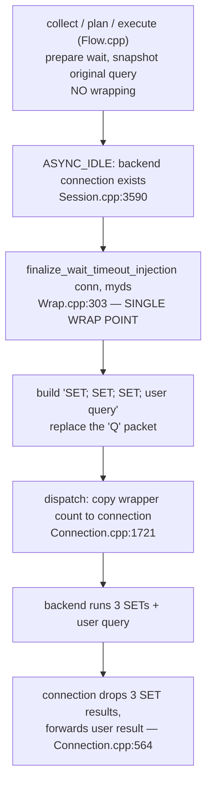
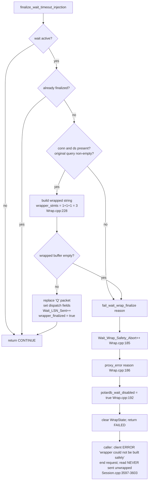
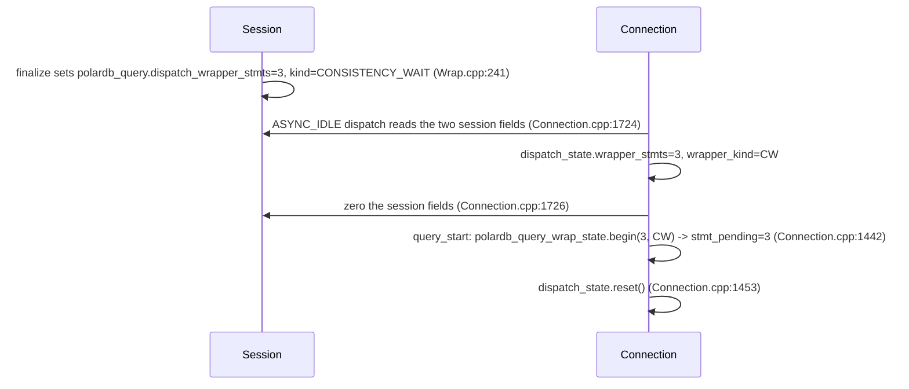
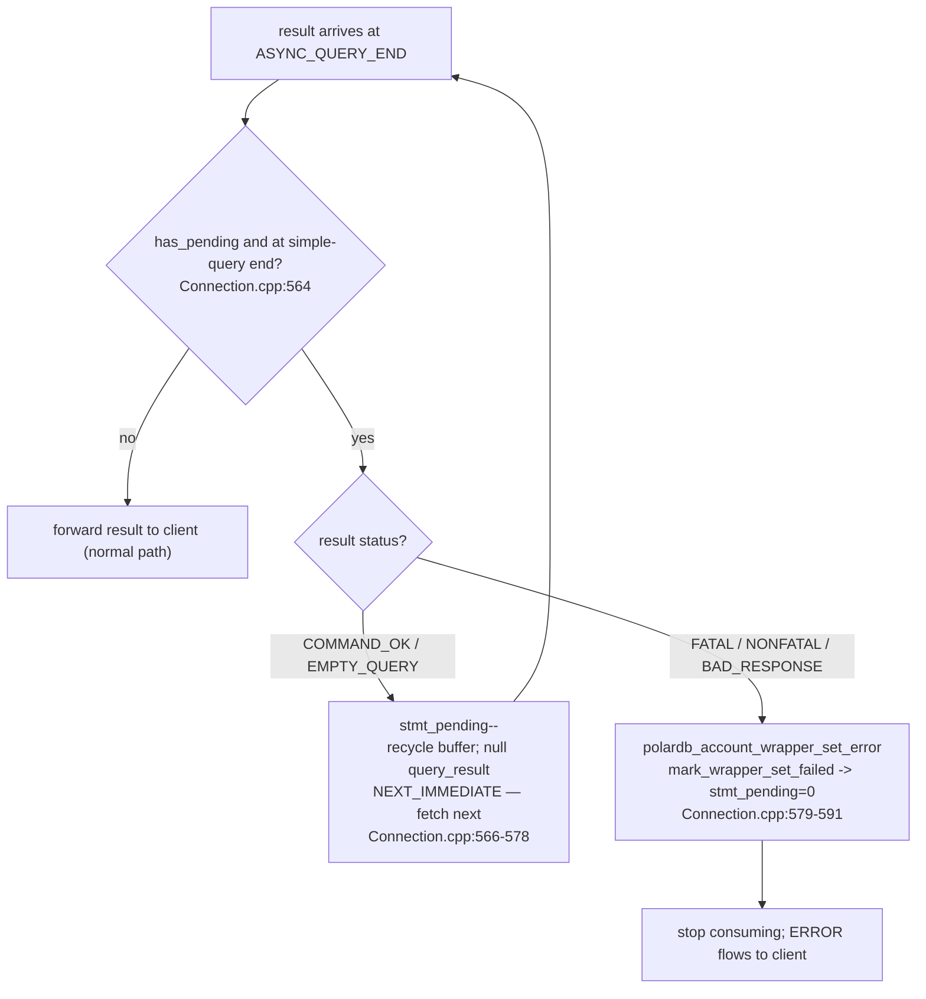

# 07 — Query Wrapping and Wait-LSN Injection

> Scope: how ProxySQL turns a replica-eligible read into a "wrapped read" — three `SET` statements glued in front of the user query so the replica waits for the client's last write LSN before answering; the single wrapping point; the `dispatch_state` handoff; the leading-skip consume loop; the safety path that stops unprotected replica reads; and the missing capability probe. | Audience: R/M/O/C | Status: stable | Prereqs: [06-ROUTING-PIPELINE.md](06-ROUTING-PIPELINE.md), [03-TYPES-AND-ENUMS.md](03-TYPES-AND-ENUMS.md), [01-BACKGROUND-AND-DESIGN.md](01-BACKGROUND-AND-DESIGN.md) | Verified against: this branch

---

## 1. What this document covers

The routing pipeline (doc 06) decides *where* a read goes. When it decides "send this read to a replica and make the replica catch up first" (the `REPLICA_WITH_WAIT` action), something has to rewrite the query so the replica actually waits. That rewrite is **query wrapping**, and it lives in `lib/PgSQL_PolarDB_Wrap.cpp`.

This document explains, at full depth:

- The exact shape of a wrapped read: three `SET` statements then the user query (Section 3).
- The one and only place the wrapping happens: `finalize_wait_timeout_injection()` (Section 4).
- How the count of "extra results to drop" travels from the session to the backend connection via `dispatch_state` (Section 5).
- The leading-skip consume loop: how the connection layer silently drops the three `SET` results and forwards only the user's result (Section 6).
- The wrapper safety path: if the wrapper cannot be built, the read never goes to the replica unwrapped (Section 7).
- The capability-probe gap: ProxySQL does not check whether the backend actually understands these GUCs (Section 8).

### 1.1 Terms used here (defined on first use)

| Term | Plain meaning |
|------|---------------|
| **LSN** (Log Sequence Number) | A 64-bit position in PostgreSQL's write-ahead log (WAL). Bigger = newer. A replica that has replayed up to LSN X can serve any read whose data was committed at or before X. |
| **RYW** (read-your-writes) | The guarantee that after a client writes, its own later reads see that write even when reads go to a replica. |
| **writer / primary** | The backend that accepts writes and is always up to date. Used interchangeably. |
| **reader / replica** | A read-only backend that replays the writer's WAL and may lag behind it. Used interchangeably. |
| **GUC** | A PostgreSQL runtime setting changed with `SET name = value`. PolarDB adds the three GUCs used here. |
| **wrapped read / wait wrapper** | The user's read with three `SET` statements glued in front of it, sent as one simple-query packet so the replica blocks until it has replayed past the client's last write before answering. |
| **simple query** | PostgreSQL's `'Q'` protocol message: one text string the backend parses, plans, and runs. The opposite is the **extended protocol** (`Parse`/`Bind`/`Execute`), which is not wrapped — see doc 06. |
| **RFQ** (ReadyForQuery) | The PostgreSQL message a backend sends after each command. With the PolarDB libpq patch it carries the backend's current LSN. Used by result processing (doc 09), not by wrapping. |
| **session-confined / connection-confined** | State touched by only one thread at a time (the thread driving that session or connection), so it needs no locks. |

The single most important nuance: the wait `SET` is the **correctness gate** for RYW. The lag cap (doc 05) is a separate safety bound, not the gate. This document is about building and delivering that gate correctly.

---

## 2. Where wrapping sits in the pipeline

Wrapping is split deliberately across **two moments** in the request:

1. **Plan/execute time** (doc 06): `polardb_execute()` only *decides and saves intent*. It snapshots the original query text and prepares the wait state. It does **not** build the wrapped string (`lib/PgSQL_PolarDB_Flow.cpp:658`; original-query snapshot at `:725`).
2. **Dispatch time** (this document): at the `ASYNC_IDLE` state, after a backend connection exists, `finalize_wait_timeout_injection()` builds the wrapped string exactly once and swaps it into the outgoing packet (`lib/PgSQL_PolarDB_Wrap.cpp:303`).

Why the split? The wrapped string must replace the actual outgoing simple-query packet on a specific backend data stream. That packet and that backend connection only exist later, at `ASYNC_IDLE`, right before the query is sent. Building earlier would have nowhere to write the result.

```
 collect ──► plan ──► execute            [Flow.cpp]   request enters here
   (snapshot)  (decide)  (prepare wait, save original query text; NO wrapping)
                                  │
                                  ▼
 ASYNC_IDLE (a backend connection now exists)         [Session.cpp:3590]
                                  │
                                  ▼
 finalize_wait_timeout_injection(conn, myds)          [Wrap.cpp:303]   ◄── SINGLE WRAP POINT
   build "SET; SET; SET; <user query>"  →  replace the 'Q' packet
                                  │
                                  ▼
 dispatch: copy wrapper count into the connection      [Connection.cpp:1721]
                                  │
                                  ▼
 backend runs 3 SETs + the user query
   connection drops the 3 SET results, forwards the user result  [Connection.cpp:564]
```

---

## 3. The wrapped read shape

When the planner chose `REPLICA_WITH_WAIT` and the session has a non-zero write LSN to wait for, ProxySQL rewrites the outgoing query. The client never sees this change. The backend receives **one** multi-statement string built from four pieces:

```
SET polar_consistency_mode = 'best_effort'|'strict';   -- statement 1: timeout behavior
SET polar_proxy_wait_timeout_ms = <resolved_ms>;        -- statement 2: how long to wait
SET polar_xact_split_wait_lsn = '<session_target_lsn>'; -- statement 3: THE wait gate
<original user query>                                    -- statement 4: the real result
```

The whole string is assembled by `build_wrapped_wait_query()` (`lib/PgSQL_PolarDB_Wrap.cpp:136`) into a per-session buffer `polardb_query.wrapped_query_buf` that is reused across queries to reduce memory allocation.

### 3.1 The three SET statements, one by one

| # | Statement | What it does | Built by | Always emitted? |
|---|-----------|--------------|----------|-----------------|
| 1 | `SET polar_consistency_mode = '...'` | Tells the backend what to do **on timeout**: `best_effort` returns possibly-stale data with a WARNING; `strict` raises an ERROR. | `build_polar_consistency_mode_set()` (`Wrap.cpp:95`) — cached, rebuilt only when the mode knob changes (`Wrap.cpp:101-111`) | Yes (for a wrapped read) |
| 2 | `SET polar_proxy_wait_timeout_ms = <ms>` | Bounds the wait. `>0` = wait that many milliseconds; `0` = disable only the PolarDB wait-timeout branch (PostgreSQL `statement_timeout`, client cancel, admin terminate can still stop it). | `PolarDB_Protocol::append_polar_timeout_set()` (`include/PgSQL_PolarDB.h:1480`) | Yes — even value `0` |
| 3 | `SET polar_xact_split_wait_lsn = '<target>'` | The actual RYW wait gate. On a replica, the backend blocks until its replay LSN passes this target before answering. | `PolarDB_Protocol::append_polar_wait_set()` (`include/PgSQL_PolarDB.h:1460`) | Only when the target is a real LSN (see below) |

The "Always emitted?" column describes a read that **actually wraps**. A consistency read can also be served **without any wrapper** when backend acquisition proves the selected reader is already at the target — then none of these three SETs are emitted. That bypass is described in §4.5 (Wrapper bypass); it does not change the rule that, *when* a read wraps, all three SETs are emitted.

### 3.2 Why statements 1 and 2 are always emitted

Backend connections are **pooled and reused** across client sessions. If ProxySQL skipped a `SET` because "the value did not change", a pooled connection could carry a stale `polar_consistency_mode` or `polar_proxy_wait_timeout_ms` left by a previous client. To avoid that, statements 1 and 2 are emitted on every wrapped read, including when the timeout value is `0` (`include/PgSQL_Connection.h:689-695`; the always-emit note is in the comment at `:689`).

These `SET` statements are not handled as normal ProxySQL session variables.
They are not parsed into `PgSQL_Variables`, replayed on backend switch, or used
to disable multiplexing. They are per-query backend instructions installed only
in the outgoing wrapped packet. That is safe only under this invariant:

- A setting that can affect a later query must be emitted on every wrapped read,
  so pooled connections cannot keep a stale value.
- A setting that is not emitted on every wrapped read must be cleared by the
  backend when the wrapped read finishes or aborts.

Today, `polar_consistency_mode` and `polar_proxy_wait_timeout_ms` use the first
rule: they are always emitted. `polar_xact_split_wait_lsn` uses the second rule:
the backend consumes or rolls back the wait target for that read. A future PolarDB
GUC must follow one of these two rules before it can be added to the wrapper.

The names must stay in the registered underscore form (`polar_*`). Dotted names
such as `polardb.xact_split_wait_lsn` are not equivalent: PostgreSQL can accept
unknown dotted names as custom-option placeholders, which would make the batch
succeed without making the PolarDB wait run. The underscore names fail loudly on a
backend that does not support them, which is safer than a successful stale read.

### 3.3 When statement 3 is skipped

`append_polar_wait_set()` (`include/PgSQL_PolarDB.h:1460`) appends **nothing** and returns `false` when:

- the wait type is not `LSN`, or
- the target LSN is `0` (zero is the "no wait needed" / invalid value).

Likewise, `build_wrapped_wait_query()` returns early and produces an empty buffer (`out.clear()`) when the original query is empty, the wait type is `NONE`, or an `LSN` wait has an invalid (zero) target (`Wrap.cpp:139-152`). An empty buffer is treated as a build failure downstream (see Section 7). In this LSN-only PolarDB feature, `REPLICA_WITH_WAIT` is only chosen when there is a real LSN to wait for, so in practice statement 3 is always present for a wrapped read.

### 3.4 The consistency-mode cache

Statement 1's text is cached on the session in `polardb_consistency_mode_set_cache`, keyed by `polardb_consistency_mode_set_cache_mode`. `build_polar_consistency_mode_set()` rebuilds the string only when `pgsql-polardb_wait_timeout_mode` differs from the cached mode or the cache is empty (`Wrap.cpp:101-111`). The mapping is:

| `pgsql-polardb_wait_timeout_mode` | Cached statement |
|-----------------------------------|------------------|
| `2` = strict | `SET polar_consistency_mode = 'strict'; ` |
| anything else (`1` = best_effort) | `SET polar_consistency_mode = 'best_effort'; ` |

Note this is the **wait timeout mode** knob, not the consistency mode knob. The consistency mode (off/lsn/primary) decides routing in doc 06; the wait timeout mode (best_effort/strict) decides what the replica does when the wait times out. Behavior on timeout is covered in doc 08.

---

## 4. The single wrapping point: `finalize_wait_timeout_injection()`

The wrap is applied **exactly once per wrapped read**, by `finalize_wait_timeout_injection()` (`lib/PgSQL_PolarDB_Wrap.cpp:303`). It is called from one place: `PgSQL_Session::handler()` inside the `if (myconn->async_state_machine == ASYNC_IDLE)` block, right before `SetQueryTimeout()` and `RunQuery()` (`lib/PgSQL_Session.cpp:3607`).

### 4.1 What it does, step by step

| Step | Action | file:line |
|------|--------|-----------|
| 1 | If no wait is active (`!polardb_wait_active()`), return `CONTINUE` immediately (nothing to wrap). | `Wrap.cpp:201` |
| 2 | If already finalized (`polardb_query.wait.wrapper_finalized`), return `CONTINUE` (idempotent — never wrap twice). | `Wrap.cpp:202-205` |
| 3 | (Debug builds only) optional one-shot fault injection to test the fail path. | `Wrap.cpp:207-211` |
| 4 | If the backend connection or data stream is missing, fail (Section 7). | `Wrap.cpp:213-215` |
| 5 | If the original query snapshot is empty, fail (Section 7). | `Wrap.cpp:217-219` |
| 6 | Build the consistency-mode `SET` (from cache), then assemble the full wrapped string into `polardb_query.wrapped_query_buf`. | `Wrap.cpp:222-225` |
| 7 | Set the wrapper-statement count to `1 + 1 + 1 = 3` (mode + timeout + wait). | `Wrap.cpp:228-231` |
| 8 | If the wrapped buffer is non-empty, replace the outgoing `'Q'` packet with it; otherwise fail. | `Wrap.cpp:239-240, 247-249` |
| 9 | Write the count and kind to the session handoff fields; bump the `PolarDB_Wait_LSN_Sent` counter for an LSN wait. | `Wrap.cpp:241-245` |
| 10 | Mark `wrapper_finalized = true` and return `CONTINUE`. | `Wrap.cpp:251-252` |

`polardb_wait_active()` is a one-line check: it returns true when `polardb_query.wait.wait_stage == WAITING` (`include/PgSQL_Session.h:734-736`). That stage is set to `WAITING` back at execute time (doc 06), so finalize knows there is a wait to install.

### 4.2 The hardcoded "3"

The wrapper-statement count is written literally as three additions, one per `SET`:

```cpp
polardb_query.wait.wrapper_stmts =
    1   // consistency-mode SET
  + 1   // timeout SET
  + 1;  // wait SET
```

(`Wrap.cpp:228-231`.) This count is the contract with the consume loop: it tells the connection layer exactly how many leading result sets to drop. Because all three SETs are always emitted for a wrapped read (Sections 3.2–3.3), the count is always 3. (This applies to reads that actually wrap; a consistency read whose selected reader is already at the target is not wrapped at all, so no count is set — see §4.5 Wrapper bypass.)

### 4.3 The packet swap

`replace_simple_query_packet()` (`Wrap.cpp:47-62`) rebuilds the raw PostgreSQL simple-query packet in place on the backend data stream's `pgsql_real_query.pkt`:

- byte 0 = `'Q'` (simple query),
- bytes 1–4 = the message length in network byte order,
- the wrapped query bytes,
- a trailing `'\0'` terminator.

It frees the old packet buffer and points `QueryPtr`/`QuerySize` at the new body. The user's original packet is gone from the wire; the backend will receive the wrapped multi-statement instead.

### 4.4 Why it is idempotent

`handler()` can re-enter the `ASYNC_IDLE` block. The `wrapper_finalized` guard at step 2 makes a second call a no-op (`Wrap.cpp:202-205`). The flag is part of `PolarDB_Query_WaitState` (`include/PgSQL_PolarDB.h:364`) and is reset on every new query and on RESET, so the next query starts unfinalized.

### 4.5 Wrapper bypass (a consistency read that does not wrap at all)

Sections 3 and 4 describe a read that *wraps*. But the wrapper is the optimization counterpart to "prefer caught-up readers": when the reader selected for a consistency read has **already** reached the session's consistency target (proven by its fresh cached RFQ LSN), the wait would be a no-op, so ProxySQL **skips the wrapper entirely** and sends the bare user query. The three SETs are never built.

The decision is made during backend/reader acquisition, before this wrap step runs. The session clears the staged wait so `finalize_wait_timeout_injection()` sees no active wait and returns `CONTINUE` at step 1 (`Wrap.cpp:201`) — emitting nothing. There are two bypass paths (full mechanics in [10-SESSION-INTEGRATION.md](10-SESSION-INTEGRATION.md) §4.3 and [06-ROUTING-PIPELINE.md](06-ROUTING-PIPELINE.md) §E.3):

1. **Thread-local cache hit** — `get_MyConn_local_polardb_reader()` returns a cached, RFQ-capable backend already at the target. The session calls `polardb_query.reset_wait()` and `polardb_query.reset_reader_target()`, bumps `PolarDB_Wait_Wrap_Bypassed` (internal `polardb_wait_wrap_bypassed`) and `PolarDB_TL_Cache_Bypassed_For_Target`, and traces `PolarDB WRAP BYPASS: thread-local reader reached consistency_target_lsn=...`.
2. **Route-smart acquisition** — `get_MyConn_polardb_reader()` returns an acquired connection from the fresh **target-reached prefix** with `PolarDB_ReaderResult::wait_bypass_allowed == true` (and bumps `PolarDB_Target_LSN_Preferred`). The session calls `polardb_query.reset_wait()`, bumps `PolarDB_Wait_Wrap_Bypassed`, and traces `PolarDB WRAP BYPASS: route-smart reader reached consistency_target_lsn=...`.

The key sequencing point: `reset_wait()` clears the staged wait **before** `finalize_wait_timeout_injection()` runs, so the wrapper produces nothing — no consistency-mode SET, no timeout SET, no wait SET, and no wrapper-statement count is set on the connection. The bare read goes to the already-caught-up reader and the `PolarDB_Wait_Wrap_Bypassed` counter (Prometheus `proxysql_polardb_wait_wrap_bypassed_total`) records it.

This never weakens RYW. The bypass is allowed **only** for a reader proven caught up (a thread-local cached backend at the target, or one acquired from the fresh target-reached prefix). For any other reader the wait wrapper of §3 and §4 remains the read-your-writes correctness gate, exactly as described above; the bypass only skips a wait that would have been a no-op. The safety invariant is stated in [14-INVARIANTS-AND-FAILURE-MODES.md](14-INVARIANTS-AND-FAILURE-MODES.md) (I9).

---

## 5. The `dispatch_state` handoff (session → connection)

The wrapped string is built by the **session**, but the **connection** layer is the one that must drop the extra result sets. The count of statements to drop crosses that boundary in two hops, both on the same thread (no locking).

### 5.1 Hop 1 — finalize writes session handoff fields

After installing the wrapper, finalize writes two session fields (`Wrap.cpp:241-242`):

| Session field | Value | Declared |
|---------------|-------|----------|
| `polardb_query.dispatch_wrapper_stmts` | `3` (the wrapper count) | `include/PgSQL_Session.h:524` |
| `polardb_query.dispatch_wrapper_kind`  | `CONSISTENCY_WAIT`      | `include/PgSQL_Session.h:525` |

### 5.2 Hop 2 — dispatch snapshots into the connection, then zeroes the session fields

At the connection's `ASYNC_IDLE` dispatch (`lib/PgSQL_Connection.cpp:1716-1729`), the count and kind are copied into the connection's `dispatch_state`, and the session fields are zeroed so they cannot leak into the next query:

```cpp
dispatch_state.reset();
if (!extended_query_info && myds && myds->sess &&
    myds->sess->polardb_query.dispatch_wrapper_stmts > 0) {
    dispatch_state.wrapper_stmts = myds->sess->polardb_query.dispatch_wrapper_stmts;
    dispatch_state.wrapper_kind  = myds->sess->polardb_query.dispatch_wrapper_kind;
    myds->sess->polardb_query.dispatch_wrapper_stmts = 0;
    myds->sess->polardb_query.dispatch_wrapper_kind  = PolarDB_Query_WrapperKind::NONE;
}
```

Two things to note:

- The snapshot is **skipped when `extended_query_info` is set** — only simple queries are wrapped. The extended protocol is never wrapped (doc 06 forces extended-protocol reads to the writer), so it never carries a wrapper count.
- `dispatch_state` is a small struct `PolarDB_Query_DispatchState { uint32_t wrapper_stmts; PolarDB_Query_WrapperKind wrapper_kind; }` on `PgSQL_Connection` (`include/PgSQL_Connection.h:661-669`). It exists precisely to decouple the connection's result-skipping from session state.

### 5.3 Hop 3 — `query_start()` begins the per-query consumer

When the connection actually starts the query, `query_start()` consumes `dispatch_state` into the per-query countdown object and then resets `dispatch_state` so it cannot be reused (`lib/PgSQL_Connection.cpp:1440-1453`):

```cpp
polardb_query_wrap_state.clear();
if (dispatch_state.wrapper_stmts > 0) {
    polardb_query_wrap_state.begin(dispatch_state.wrapper_stmts,
                                       dispatch_state.wrapper_kind);
}
...
dispatch_state.reset();  // Consumed — prevent stale reuse
```

`begin(n, kind)` sets the sticky flag `was_wrapped = (n > 0)`, the totals, and the countdown `stmt_pending = n` (`include/PgSQL_Connection.h:760-766`). `PolarDB_Query_WrapState` is the object that the consume loop counts down.

### 5.4 Handoff summary diagram

```
[SESSION]                                   [CONNECTION]
finalize_wait_timeout_injection             ASYNC_IDLE dispatch
  polardb_query.dispatch_wrapper_stmts = 3   ──►   dispatch_state.wrapper_stmts = 3
  polardb_query.dispatch_wrapper_kind  = CW  ──►   dispatch_state.wrapper_kind  = CW
  (session fields zeroed by dispatch) ◄───   (zero the session fields)
                                                       │
                                            query_start()
                                              polardb_query_wrap_state.begin(3, CW)
                                                stmt_pending = 3   ◄── the countdown
                                              dispatch_state.reset()
```

---

## 6. The leading-skip consume loop

The backend runs all four statements and returns **four result sets** in order: three `SET` completions, then the user query's result. ProxySQL must drop the first three and forward only the fourth. This is the **leading-skip consume loop**, and the connection layer is its sole owner — the session and client only ever see the user result.

```
backend sends 4 result sets for a wrapped read:

   [ SET ok ] [ SET ok ] [ SET ok ] [ user query result ]
      drop       drop       drop        forward to client
   stmt_pending: 3 → 2 → 1 → 0, then forward
```

### 6.1 Where it runs

The loop lives in `PgSQL_Connection::handler()` at the `ASYNC_USE_RESULT_CONT` path, gated to the simple-query end state (`lib/PgSQL_Connection.cpp:555-593`). The gate condition is:

```cpp
if (polardb_query_wrap_state.has_pending() &&
    fetch_result_end_st == ASYNC_QUERY_END) {
```

`has_pending()` is `stmt_pending > 0` (`include/PgSQL_Connection.h:753`). Wrapped reads are simple queries, so the loop only triggers at the simple-query end state.

### 6.2 The two cases inside the loop

| Result status | What it means | What the loop does | file:line |
|---------------|---------------|--------------------|-----------|
| `PGRES_COMMAND_OK` or `PGRES_EMPTY_QUERY` | a `SET` completed normally | `stmt_pending--`; recycle the result buffer into `query_result_reuse`; null `query_result`; fetch the next result with `NEXT_IMMEDIATE(ASYNC_USE_RESULT_START)`. The dropped `SET` result never reaches the client. | `Connection.cpp:566-578` |
| `PGRES_FATAL_ERROR`, `PGRES_NONFATAL_ERROR`, or `PGRES_BAD_RESPONSE` | a wrapper `SET` itself errored (for example a strict-mode wait timeout surfaced as an ERROR) | call `polardb_account_wrapper_set_error(...)`, then **stop consuming** so the error flows to the client through the normal path below. | `Connection.cpp:579-591` |

When the three `SET` results have been dropped, `stmt_pending` reaches `0`, `has_pending()` becomes false, and the loop no longer intercepts. The next result — the user query's result — falls through to the normal forwarding code and reaches the client.

### 6.3 The error branch in detail

`polardb_account_wrapper_set_error()` is a file-local helper (`lib/PgSQL_Connection.cpp:31-77`). Its job on a wrapper `SET` error:

1. If there is no connection or the connection was not wrapped (`!was_wrapped`), do nothing (`:34-42`).
2. If the session has no active wait, mark the wrapper failed without accounting (`:45-52`).
3. Check whether the error is a genuine PolarDB LSN wait timeout by matching the structured field `PG_DIAG_MESSAGE_DETAIL` against the constant `POLARDB_LSN_WAIT_TIMEOUT_DETAIL` (via `polardb_is_lsn_wait_timeout_result()`, `:26-29`). It does **not** match human-readable text, which user SQL could fake.
4. If it is the marked LSN timeout, account it through `sess->polardb_account_wait_timeout("result-error")` (`:69-71`). This is the **strict-mode** timeout accounting site. The marker and accounting are covered in doc 08.
5. Mark the connection WrapState failed via `mark_wrapper_set_failed()`, which sets `stmt_failed = true` and forces `stmt_pending = 0` (`include/PgSQL_Connection.h:767`) so the loop stops consuming and the error packet reaches the client.

The `was_wrapped` and `stmt_failed` flags are "sticky" — they survive consumption — so later code can still tell that this query was wrapped and whether a wrapper statement failed.

### 6.4 Why the connection owns the skip (not the session)

The comment at `Connection.cpp:556-563` states the design directly: the connection is the sole owner of `SET` consumption, so the session and the client only ever see the user result. Putting the skip on the connection does two things: (a) it keeps the session unaware of the wire-level multi-statement detail, and (b) it ties the skip count to the actual backend connection that received the wrapped packet.

### 6.5 A known limitation of the consume model

The wrapper only skips **leading** result sets. There is no trailing-skip counter. The header comment is explicit (`include/PgSQL_Connection.h:702-704`): a `SET` appended **after** the user query is not supported and would be forwarded to the client as an extra result. This implementation's wrapped read only ever prepends, so this limitation is not hit, but it constrains any future feature that wants to append statements.

---

## 7. The wrapper safety path

RYW must never be silently broken. If ProxySQL cannot build or install the wait wrapper, it must **not** send the original read unwrapped to a replica (that read could return stale data the client already wrote). The safety fence enforces this.

### 7.1 `fail_wait_wrap_finalize()` — what a build failure does

When finalize hits any failure condition (Section 4.1 steps 4, 5, 8), it calls `fail_wait_wrap_finalize(reason)` (`lib/PgSQL_PolarDB_Wrap.cpp:184-198`). That helper:

| Action | file:line |
|--------|-----------|
| Bump `PolarDB_Wait_Wrap_Safety_Abort` (`polardb_wait_wrap_safety_abort`). | `Wrap.cpp:185` |
| Emit a `proxy_error(...)` log line naming the reason and the session pointer. | `Wrap.cpp:186-187` |
| Set `polardb_wait_disabled = true` so **future** reads in this session use the writer instead of an unwrapped replica read. | `Wrap.cpp:192` |
| Clear the wrapped buffer and reset the per-query wait state and wait plan. | `Wrap.cpp:193-195` |
| Return `PolarDB_WrapFinalizeResult::FAILED`. | `Wrap.cpp:197` |

The failure reasons passed to it are: `"missing backend connection or data stream"`, `"missing original query snapshot"`, `"wrapped query is empty"`, and (debug only) `"debug fault injection"` (`Wrap.cpp:209, 214, 218, 248`).

### 7.2 The always-on `proxy_error` and the client error packet

The caller in `PgSQL_Session::handler()` checks the return value. On `FAILED`, it does **not** run the query. Instead it sends a clean error to the client and ends the request (`lib/PgSQL_Session.cpp:3607`):

```cpp
if (finalize_wait_timeout_injection(myconn, myds) ==
    PolarDB_WrapFinalizeResult::FAILED) {
    client_myds->setDSS_STATE_QUERY_SENT_NET();
    client_myds->myprot.generate_error_packet(true, true,
        "PolarDB LSN wait wrapper could not be built safely",
        PGSQL_ERROR_CODES::ERRCODE_INTERNAL_ERROR, false, true);
    RequestEnd(myds, true);
    finishQuery(myds, myconn, false);
    goto __exit_DSS__STATE_NOT_INITIALIZED;
}
```

So a wrapper build failure produces:

1. a `proxy_error` log line (from `fail_wait_wrap_finalize`, always on, not gated by trace),
2. a client-facing `ERROR` with message **"PolarDB LSN wait wrapper could not be built safely"** and SQLSTATE `ERRCODE_INTERNAL_ERROR`,
3. the request ends with `called_on_failure = true` (so process_result does not run),
4. the original read is **never** sent to the replica unwrapped.

### 7.3 The `polardb_wait_disabled` latch

`fail_wait_wrap_finalize()` sets `polardb_wait_disabled = true` (`Wrap.cpp:192`). This is a session latch. While it is true, the planner (doc 06) will not route a read to a replica with a wait — it forces the writer instead (read at `Flow.cpp:422`). The latch is cleared back to `false` on RESET, via `polardb_clear_staged_wait_state_for_reset()` (`Wrap.cpp:330`), so a fresh session state starts from normal wait behavior.

This means a single wrapper build failure both (a) fails the current query closed, and (b) keeps the rest of the session safe by sending later reads to the writer until a RESET clears the latch.

### 7.4 Wrapper safety summary

```
finalize_wait_timeout_injection
  │
  ├─ no wait active / already finalized ─► CONTINUE (normal, not a failure)
  │
  ├─ missing conn/ds, empty original query, empty wrapped buf
  │       └─► fail_wait_wrap_finalize(reason)
  │             • Wait_Wrap_Safety_Abort++          [Wrap.cpp:185]
  │             • proxy_error(reason)               [Wrap.cpp:186]
  │             • polardb_wait_disabled = true       [Wrap.cpp:192]
  │             • clear WrapState
  │             • return FAILED
  │                   └─► caller sends client ERROR, ends request  [Session.cpp:3597-3603]
  │                         (read is NEVER sent unwrapped to a replica)
  │
  └─ success ─► replace 'Q' packet; wrapper_stmts=3; Wait_LSN_Sent++; CONTINUE
```

---

## 8. The capability-probe gap (a recommended follow-up)

PolarDB-specific GUCs (`polar_consistency_mode`, `polar_proxy_wait_timeout_ms`, `polar_xact_split_wait_lsn`) only exist on a real PolarDB backend with proxy support. ProxySQL emits all three `SET` statements **without first checking** whether this backend actually understands them.

The code says so plainly:

- `finalize_wait_timeout_injection()`'s doc comment: *"PolarDB backends are assumed to support the wait/timeout GUCs (the per-connection capability probe is intentionally not used by this feature), so the mode and timeout SETs are always injected for wrapped reads."* (`lib/PgSQL_PolarDB_Wrap.cpp:177-179`).
- `append_polar_timeout_set()`'s comment: *"The caller is responsible for the capability check."* (`include/PgSQL_PolarDB.h:689`) — and no caller performs one.

### 8.1 What this means in practice

| Situation | What happens today |
|-----------|--------------------|
| The reader hostgroup really is a PolarDB replica with proxy support | The three `SET`s succeed; the wait works; RYW holds. This is the intended deployment. |
| The reader hostgroup is **not** PolarDB (or is PolarDB without proxy support) | The first `SET polar_consistency_mode` errors with an "unrecognized configuration parameter" ERROR. The consume loop sees that error on a wrapper `SET` (Section 6.3), accounts nothing (it is not the LSN-timeout marker), marks the wrapper failed, and the ERROR flows to the client. The read fails rather than silently returning stale data. |

So the gap is not a correctness hole for RYW — a non-PolarDB backend produces a hard error, not a silent stale read — but it is a **usability and clarity problem**: the operator sees a raw PostgreSQL "unrecognized configuration parameter" error instead of a clear "this hostgroup is not a PolarDB backend" message, and every wrapped read against a misconfigured hostgroup fails one at a time.

### 8.2 Status

This is recorded as a **recommended follow-up** in the PR-readiness review and is carried into [15-LIMITATIONS-AND-ROADMAP.md](15-LIMITATIONS-AND-ROADMAP.md). A future fix would probe each backend connection once (for example by detecting the GUCs or the PolarDB version) and either skip wrapping with a clear diagnostic or use the writer when the backend cannot support the wait. It is deliberately out of scope for this LSN-only feature.

---

## 9. Reviewer notes and subtleties

- **One wrap point, period.** Wrapping happens only in `finalize_wait_timeout_injection()` at `ASYNC_IDLE` (`Wrap.cpp:303`, called from `Session.cpp:3607`). `polardb_execute()` saves intent only and never builds the string. If you are looking for "where the SETs are added", it is exactly this one function.
- **The "3" is a contract.** `wrapper_stmts = 3` (`Wrap.cpp:228-231`) must match what the consume loop drops. If a future feature adds or removes a `SET`, this count and the consume loop must change together, or the client will see leaked `SET` results (or lose its real result). This count only exists for a read that wraps; a bypassed consistency read (§4.5) sets no count because no wrapper and no `SET` results are produced.
- **Idempotency comes from `wrapper_finalized`.** Re-entering `ASYNC_IDLE` is safe (`Wrap.cpp:202-205`). Do not remove that guard.
- **`dispatch_state` is zeroed twice on purpose** — at dispatch (`Connection.cpp:1726-1727` zeroes the session fields) and again after `query_start()` consumes it (`Connection.cpp:1453`). This prevents a stale wrapper count from a previous query bleeding into a non-wrapped query.
- **Wrapper errors are accounted on the connection, in the loop.** The strict-mode timeout is charged from `polardb_account_wrapper_set_error()` at `Connection.cpp:70` — not from the session handler. The full accounting and de-dup story is in doc 08; here it matters only that the consume loop stops on a wrapper error so the ERROR reaches the client.
- **Extended protocol is never wrapped.** The dispatch snapshot is skipped when `extended_query_info` is set (`Connection.cpp:1722`). Doc 06 already forces extended-protocol reads to the writer; this is the second guard that keeps the text-only wrapper off the extended path.
- **The `Wait_LSN_Sent` counter is bumped only on a successful install** (`Wrap.cpp:243-245`), inside the `wait_type == LSN` branch. The neighboring comment at `Wrap.cpp:246` ("Future CSN support should add the parallel type-specific sent counter here") marks where a CSN wait (a future feature) would add its own sent counter — CSN is not present in this implementation.

---

## 10. Status and deferred items

| Item | Status in this implementation (LSN-only) | Notes |
|------|-------------------------|-------|
| Wrapped read shape (3 SETs + user query) | Implemented | `Wrap.cpp:136-167` |
| Single wrap point at `ASYNC_IDLE` | Implemented | `Wrap.cpp:303`, called from `Session.cpp:3607` |
| `dispatch_state` handoff + leading-skip consume loop | Implemented | `Connection.cpp:1721`, `:1440`, `:564` |
| Wrapper safety path | Implemented | `Wrap.cpp:263`, client error at `Session.cpp:3595` |
| Capability probe (does this backend support the GUCs?) | **Not implemented** | Intentionally omitted (`Wrap.cpp:178`, `PgSQL_PolarDB.h:689`); a recommended follow-up → doc 15 |
| Trailing-SET skip (append after the user query) | **Not supported** | No trailing-skip counter (`PgSQL_Connection.h:702-704`); leading-skip only |
| Per-connection SET de-duplication (skip unchanged mode/timeout SETs) | **Deferred** | Documented postponed optimization (`PgSQL_Connection.h:737-744`); would need state on the connection, not the session |
| CSN wait type / second wrapper kind | **Future, not in this implementation** | Marked at `Wrap.cpp:246`; experimental and out of scope (see doc 18) |

The behavior of the replica *during* the wait (best_effort WARNING vs strict ERROR) and the timeout accounting are covered in [08-WAIT-TIMEOUT-AND-NOTICES.md](08-WAIT-TIMEOUT-AND-NOTICES.md). What happens after the read succeeds (reading the RFQ LSN and advancing the session write LSN) is in [09-PUBLISH-AND-WRITE-TRACKING.md](09-PUBLISH-AND-WRITE-TRACKING.md).

---

## Appendix: Mermaid diagrams

### A. Wrapping in the request pipeline (Section 2)



### B. `finalize_wait_timeout_injection()` and the wrapper safety path (Sections 4 + 7)



### C. The `dispatch_state` handoff (Section 5)



### D. The leading-skip consume loop (Section 6)



---

Verified against this branch.
