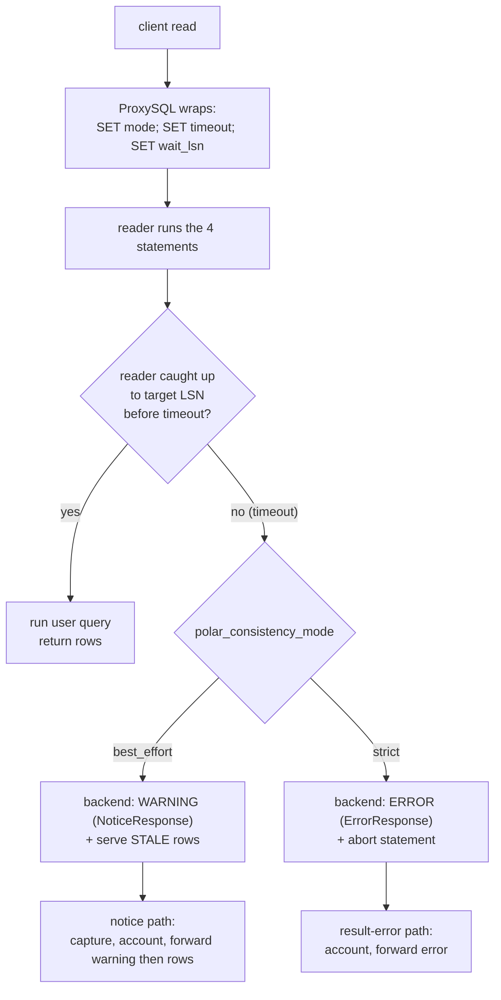
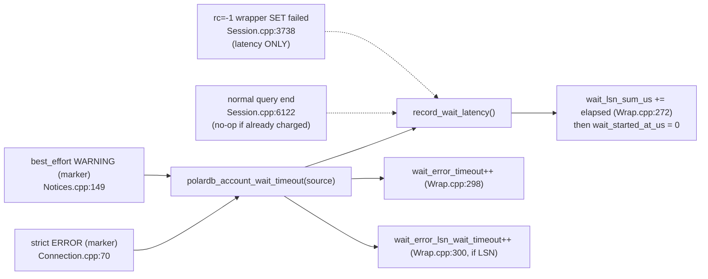
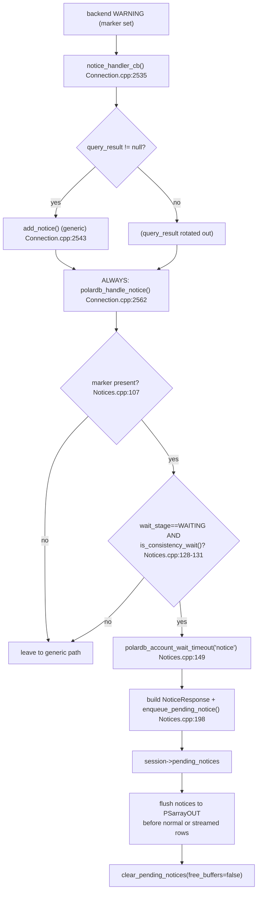
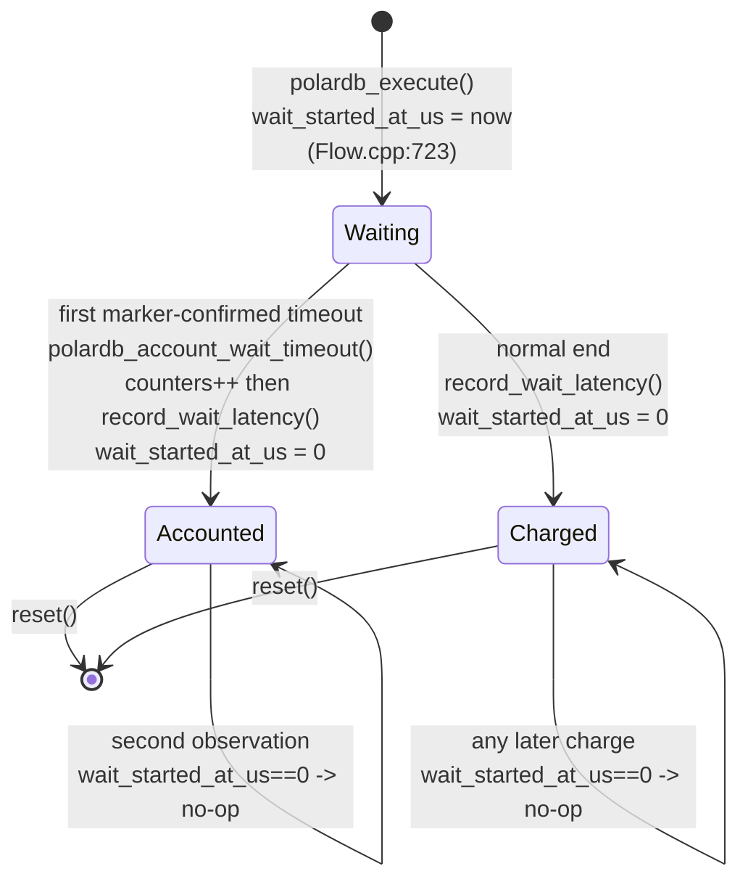

> Scope: how a replica wait can time out, what best_effort and strict mode do on timeout, how ProxySQL detects a real PolarDB timeout, how it counts the timeout exactly once, how it forwards the timeout warning to the client, and how a failed wait-wrapped read can be retried on the writer after strict timeout or reader connection loss. | Audience: R/M/O/C | Status: stable | Prereqs: [07-QUERY-WRAPPING.md](07-QUERY-WRAPPING.md), [06-ROUTING-PIPELINE.md](06-ROUTING-PIPELINE.md), [09-PUBLISH-AND-WRITE-TRACKING.md](09-PUBLISH-AND-WRITE-TRACKING.md), [11-CONNECTION-AND-LIBPQ.md](11-CONNECTION-AND-LIBPQ.md) | Verified against: this branch

# 08 — Wait, Timeout, and Notice Handling

## 1. Scope and where this sits

This document covers what happens **after** ProxySQL has wrapped a read for read-your-writes (RYW) consistency and sent it to a replica. Doc [07-QUERY-WRAPPING.md](07-QUERY-WRAPPING.md) explains how the wrapper is built and injected. This doc picks up at the point where the replica runs the wrapped read and may not have caught up to the needed write yet.

It explains four things:

1. The **replica wait** itself, and the two ways it can end on timeout: `best_effort` (a WARNING, then stale data) and `strict` (an ERROR on the reader, then one safe retry on the writer when possible).
2. **Structured-marker detection** — how ProxySQL knows a backend WARNING or ERROR really came from the PolarDB wait path.
3. The **three timeout-accounting sites** and the **de-duplication** rule that guarantees one backend timeout is counted exactly once.
4. **Notice capture and forward-once-to-client** — how a `best_effort` timeout WARNING is captured and sent to the client ahead of the query result, even though the leading `SET` results were already dropped.
5. **Strict timeout retry** — how a strict timeout ERROR is recognized and the original user query is retried once on the writer when no user result has started.

### 1.1 Terms used in this document (defined on first use)

| Term | Meaning |
|------|---------|
| **LSN** (Log Sequence Number) | A 64-bit position in PostgreSQL's write-ahead log (WAL). A higher LSN means a newer write. A replica that has "replayed up to LSN X" can serve any read whose data was written at or before X. |
| **RYW** (read-your-writes) | The guarantee that after a client writes, its own later reads see that write, even when the read runs on a replica. |
| **writer / reader** | The writer is the PolarDB primary node. A reader is a read-only replica. (This doc uses "writer/reader", not "primary/replica", except where quoting PolarDB's own role names.) |
| **wait wrapper** | The three `SET` statements ProxySQL prepends in front of a user read so the reader blocks until it has replayed past the client's last write LSN. Built in `PgSQL_PolarDB_Wrap.cpp`. |
| **GUC** | A PostgreSQL server setting changed with `SET name = value`. |
| **RFQ** (ReadyForQuery) | The PostgreSQL wire message a backend sends when it is ready for the next query. |
| **NoticeResponse** | The PostgreSQL wire message (`'N'`) that carries a WARNING or NOTICE to the client. It is informational; it does not abort the query. |
| **ErrorResponse** | The PostgreSQL wire message (`'E'`) that carries an ERROR. It aborts the current statement. |
| **structured field / marker** | A machine-readable field inside a NoticeResponse or ErrorResponse, identified by a one-letter code, not by human-readable text. |
| **de-dup** | Short for de-duplication: making sure the same event is counted only once. |

### 1.2 Build gate

Everything in this document is compiled only when the build flag `POLARDB_PROXY` is set. With `POLARDB_PROXY=0` all of this code is compiled out and ProxySQL behaves like upstream. The two source files for this doc both wrap their whole body in `#if POLARDB_PROXY` (`lib/PgSQL_PolarDB_Wrap.cpp:35`, `lib/PgSQL_PolarDB_Notices.cpp:28`).

---

## 2. Overview: the wrapped read and where a timeout appears

A wrapped read is one SQL string the client never sees split out. The backend receives four statements as one simple-query packet:

```
SET polar_consistency_mode = 'best_effort'|'strict';   -- statement 1: timeout behavior
SET polar_proxy_wait_timeout_ms = <resolved_ms>;        -- statement 2: how long to wait
SET polar_xact_split_wait_lsn = '<session_target_lsn>'; -- statement 3: the wait step
<original user query>                                    -- statement 4: the real result
```

(See doc [07-QUERY-WRAPPING.md](07-QUERY-WRAPPING.md) for how this string is built.)

On a reader, statement 3 (`polar_xact_split_wait_lsn`) makes the backend block: it loops until its replay LSN reaches the target LSN, or until the timeout from statement 2 fires. The timeout is the moment this doc is about. **Statement 1 decides what the backend does at that moment.**

```
ASCII: the wrapped read on a reader, two timeout outcomes

  client read  ──►  ProxySQL wraps  ──►  reader runs 4 statements
                                            │
                          SET mode; SET timeout; SET wait_lsn   (statements 1-3)
                                            │
                                  reader waits for target LSN
                                            │
                         ┌──────────────────┴───────────────────┐
                  caught up in time                        timed out
                         │                                       │
                  run the user query                  ┌──────────┴──────────┐
                  return rows                   best_effort              strict
                                                      │                     │
                                          WARNING (NoticeResponse)   ERROR (ErrorResponse)
                                          + serve STALE rows         + abort the statement
                                                      │                     │
                                          ProxySQL captures the      ProxySQL sees the
                                          notice, accounts the       ErrorResponse, accounts
                                          timeout, forwards          the timeout, and
                                          warning then rows          retries on writer
```

The wait loop runs **inside the PolarDB backend**. ProxySQL does not poll or time the wait itself; it only sets the GUCs and then reads whatever the backend sends back. The backend-side wait loop is documented in a long comment block in `include/PgSQL_Connection.h:706-736` (the "PolarDB backend facts used here" and "Result by case" subsections); that comment is the only record of the backend internals and was not independently verified against PolarDB server source.

---

## 3. The wait on the replica: best_effort vs strict

The wait gate (`polar_xact_split_wait_lsn`) behaves the same in both modes: the reader blocks until it has replayed past the target LSN or the timeout fires. The two modes differ **only in what the backend does on timeout**.

| Mode | GUC value (statement 1) | On timeout the backend... | What ProxySQL receives on the wire | ProxySQL handling path |
|------|-------------------------|---------------------------|-------------------------------------|------------------------|
| **best_effort** | `SET polar_consistency_mode = 'best_effort'` | emits a **WARNING/NOTICE**, then serves **stale** data — the user query still returns rows | a NoticeResponse, then the normal result | the notice path (`lib/PgSQL_PolarDB_Notices.cpp`) |
| **strict** | `SET polar_consistency_mode = 'strict'` | raises an **ERROR** and aborts the statement on the reader (the wrapper SETs roll back) | an ErrorResponse | the result-error path marks the timeout, then the session retries the original read once on the writer when safe |

Plain-language summary:

- **best_effort** = "answer anyway." The client gets possibly-stale rows plus a warning telling it the wait did not finish. RYW is not guaranteed for that one read, but the client is told.
- **strict** = "do not answer stale from a reader." The reader returns an ERROR on timeout. If no user result has started, ProxySQL retries the original read once on the writer. If that retry is not safe or the writer also fails, the existing error path handles the statement.

### 3.1 Which mode is in effect

The wait-timeout mode is read from the per-thread setting `pgsql_thread___polardb_wait_timeout_mode` during the collect stage (`lib/PgSQL_PolarDB_Flow.cpp:269`, inside `PgSQL_Session::polardb_collect()`: `route_ctx.wait_timeout_mode = pgsql_thread___polardb_wait_timeout_mode;`) and carried on the route context / wait spec. The resolved mode is later mapped to a GUC by `build_polar_consistency_mode_set()` (`lib/PgSQL_PolarDB_Wrap.cpp:157`), which receives the mode as a `PolarDB_WaitMode` parameter. The integer-to-mode mapping is:

| `pgsql_thread___polardb_wait_timeout_mode` | `PolarDB_WaitMode` | GUC emitted |
|--------------------------------------------|--------------------|-------------|
| `1` | `BEST_EFFORT` | `SET polar_consistency_mode = 'best_effort';` |
| `2` | `STRICT` | `SET polar_consistency_mode = 'strict';` |

The `STRICT` branch is at `lib/PgSQL_PolarDB_Wrap.cpp:168-171`; the `best_effort` branch (the default, used for any value that is not `STRICT`) is at `lib/PgSQL_PolarDB_Wrap.cpp:173-174`. The function returns a reference to one of two `static const std::string` literals (`lib/PgSQL_PolarDB_Wrap.cpp:163-166`) — there is no per-session cache. The `PolarDB_WaitMode` enum values are at `include/PgSQL_PolarDB.h:309-311`. The resolved mode is passed in from the wait spec at the call site `lib/PgSQL_PolarDB_Wrap.cpp:326` (`build_polar_consistency_mode_set(polardb_query.wait.spec.mode)`).

> Note on `polar_proxy_wait_timeout_ms = 0`: a zero timeout disables **only** the PolarDB wait-timeout branch. The wait gate can still be interrupted by ordinary PostgreSQL `statement_timeout`, query cancel, or session terminate. This is documented at the helper that emits the timeout SET, `PolarDB_Protocol::append_polar_timeout_set()` (definition `include/PgSQL_PolarDB.h:691`, doc comment `:683-690`). When the timeout is `0`, a PolarDB wait timeout simply never fires, so none of the timeout handling in this doc runs.

---

## 4. Structured-marker detection

### 4.1 The problem: a WARNING is just text

When a `best_effort` wait times out, the backend sends a NoticeResponse. When a `strict` wait times out, the backend sends an ErrorResponse. Both messages carry human-readable text (for example, a message saying the LSN wait timed out). ProxySQL must decide: "is this the PolarDB wait timeout, or is it some unrelated notice/error?"

The naive approach is to match the human-readable text. **That is unsafe.** Any client can run SQL that produces a WARNING or ERROR with the same wording — for example `RAISE WARNING '...'` in a PL/pgSQL block, or an error message that happens to contain the same phrase. If ProxySQL matched on text, a client could fake a "timeout" and corrupt the counters, or worse, a real unrelated error could be mistaken for a timeout.

### 4.2 The solution: a structured backend marker

PostgreSQL error and notice messages carry **structured fields**, each identified by a one-letter code, separate from the human-readable text. One such field is `PG_DIAG_MESSAGE_DETAIL` (the "Detail" field). The PolarDB backend, **only** from its proxy LSN-wait path, sets this Detail field to a fixed marker string using `errdetail_internal()`. Because it is set by `errdetail_internal()` from one specific code path in the backend, ordinary user SQL cannot reproduce it.

The marker constant is defined once:

```c
// include/PgSQL_PolarDB.h:94
static constexpr const char* POLARDB_LSN_WAIT_TIMEOUT_DETAIL =
    "polar_proxy_lsn_wait_timeout";
```

The header comment at `include/PgSQL_PolarDB.h:91-93` states the rule directly: ProxySQL uses this structured field "instead of matching human-readable WARNING/ERROR text."

### 4.3 Why structured-marker detection is required

This is the single most important correctness point in this document. The structured marker is safer than text matching for four concrete reasons:

| Reason | Text matching | Structured marker |
|--------|---------------|-------------------|
| **Spoofing** | A client can emit a WARNING/ERROR with the same text and be miscounted as a timeout. | The Detail field is set only by the backend's `errdetail_internal()` wait path; client SQL cannot set it. |
| **Localization / wording drift** | If PolarDB ever changes the message wording, text matching silently breaks. | The marker string is a stable contract, independent of the human-readable wording. |
| **False positives** | An unrelated error whose text mentions "lsn" or "timeout" gets misclassified. | Only the exact marker `polar_proxy_lsn_wait_timeout` matches. |
| **One source of truth** | Each check site would carry its own copy of the text to match. | One `constexpr` constant is compared at both check sites. |

The same marker is compared at exactly two check sites, one per wire path:

| Check site | What it inspects | file:line |
|------------|------------------|-----------|
| `polardb_is_lsn_wait_timeout_result()` | a `PGresult` (an ErrorResponse, strict path) | `lib/PgSQL_Connection.cpp:26-29` |
| inline in `polardb_handle_notice()` | a `PGresult` carrying a notice (best_effort path) | `lib/PgSQL_PolarDB_Notices.cpp:107-109` |

Both call `PQresultErrorField(result, PG_DIAG_MESSAGE_DETAIL)` and compare with `strcmp(...) == 0` against `POLARDB_LSN_WAIT_TIMEOUT_DETAIL`. The result-path helper:

```c
// lib/PgSQL_Connection.cpp:26-29
static bool polardb_is_lsn_wait_timeout_result(const PGresult* result) {
    const char* detail = result ? PQresultErrorField(result, PG_DIAG_MESSAGE_DETAIL) : nullptr;
    return detail && strcmp(detail, POLARDB_LSN_WAIT_TIMEOUT_DETAIL) == 0;
}
```

The notice-path check is the same comparison inlined at `lib/PgSQL_PolarDB_Notices.cpp:107-109`. If the marker is absent, both sites treat the message as "not a PolarDB timeout" and leave it to the normal handling — the notice path returns early (`lib/PgSQL_PolarDB_Notices.cpp:111-113`) and the result path simply does not call `polardb_account_wait_timeout()` (`lib/PgSQL_Connection.cpp:69-71`).

---

## 5. Timeout accounting: one helper, three call sites, one de-dup rule

### 5.1 The central accounting helper

All timeout counting goes through one function:

```c
// lib/PgSQL_PolarDB_Wrap.cpp:286
bool PgSQL_Session::polardb_account_wait_timeout(const char* source);
```

When it decides to count a timeout, it does three things (`lib/PgSQL_PolarDB_Wrap.cpp:298-302`):

1. increments `polardb_wait_error_timeout` (the total timeout counter) — `:298`;
2. if the wait is an LSN wait (it always is in this feature), increments `polardb_wait_error_lsn_wait_timeout` (the LSN subset) — `:299-301`;
3. calls `record_wait_latency()` to charge the elapsed wait time — `:302`.

The function's own doc comment states the contract: call it **only after** the caller has proved the event is a real PolarDB wait timeout (via the structured marker), and it "owns counter updates and consumes `wait_started_at_us` through `record_wait_latency()`, so repeated observations of the same backend event do not double-count" (`lib/PgSQL_PolarDB_Wrap.cpp:277-285`).

### 5.2 The three accounting sites

There are three places that touch wait-timeout or wait-latency accounting. They are **not** three different timeouts; they are the three different wire situations in which a wait can finish or fail. Each one is reached for a different backend outcome.

| # | Site | file:line | When it fires | What it does |
|---|------|-----------|----------------|--------------|
| 1 | **notice path** (best_effort) | `lib/PgSQL_PolarDB_Notices.cpp:149` | a `best_effort` WARNING carrying the marker arrives while the wait is active | calls `polardb_account_wait_timeout("notice")` — full timeout accounting |
| 2 | **result-error path** (strict) | `lib/PgSQL_Connection.cpp:70` | a `strict` ERROR carrying the marker arrives while the wait is active | marks the wait as a timeout error and calls `polardb_account_wait_timeout("result-error")` — full timeout accounting |
| 3 | **rc=-1 wrapper-set-failure path** | `lib/PgSQL_Session.cpp:3738` | a wrapper SET failed (connection-level `rc=-1`) AND a wait is still active | calls `record_wait_latency()` **only** — it does **not** call `polardb_account_wait_timeout()` |

Why site 3 is different: an `rc=-1` failure is a connection-level failure of a wrapper statement, not a confirmed PolarDB timeout. ProxySQL has no marker to prove it was a timeout, so it deliberately charges only the elapsed latency and does **not** bump the timeout counters. The comment makes this explicit: "Timeout accounting is deliberately not done here: only marker-confirmed PolarDB timeout events are charged" (`lib/PgSQL_Session.cpp:3727-3730`). This keeps the timeout counters honest — they count **proven** timeouts, never guesses.

There is also a fourth latency touch that is not a separate timeout source: at the end of every query, `RequestEnd()`'s cleanup calls `record_wait_latency(polardb_query.wait)` (`lib/PgSQL_Session.cpp:6122`). This charges elapsed time for any wait that completed normally and was not already accounted. It is a no-op when the timer was already consumed (see the de-dup rule below).

```
ASCII: the three accounting sites feed one helper

  best_effort WARNING (marker)   ──► Notices.cpp:149  ──┐
  strict ERROR (marker)          ──► Connection.cpp:70 ──┼─► polardb_account_wait_timeout(source)
                                                          │      ├─ wait_error_timeout++          (Wrap.cpp:298)
                                                          │      ├─ wait_error_lsn_wait_timeout++  (Wrap.cpp:300, if LSN)
                                                          │      └─ record_wait_latency()          (Wrap.cpp:302)
                                                          │
  rc=-1 wrapper SET failed       ──► Session.cpp:3738 ───┘ (record_wait_latency ONLY — no timeout count)

  normal query end               ──► Session.cpp:6122 ───► record_wait_latency() (no-op if already charged)
```

### 5.3 The de-dup rule: `wait_started_at_us == 0`

A single backend timeout event can, in principle, be observed more than once on the ProxySQL side. For example, a `best_effort` timeout WARNING might be seen by the notice receiver and also be visible as a result-level message. Without protection, the same timeout could be counted twice. The de-dup mechanism is a single timestamp field.

**The field.** `polardb_query.wait.wait_started_at_us` is a monotonic microsecond timestamp set **once**, when the wait starts in `polardb_execute()` (`lib/PgSQL_PolarDB_Flow.cpp:723`). At that point `wait_stage` is set to `WAITING` (`:722`) and the wait state is prepared from the plan. The field is declared at `include/PgSQL_PolarDB.h:1146` and reset to `0` by `PolarDB_Query_WaitState::reset()`.

**The rule.** `record_wait_latency()` returns immediately if the field is already `0`; otherwise it adds the elapsed time and sets the field back to `0` (`lib/PgSQL_PolarDB_Wrap.cpp:266-275`):

```c
// lib/PgSQL_PolarDB_Wrap.cpp:266-275
void PgSQL_Session::record_wait_latency(PolarDB_Query_WaitState& state) {
    if (state.wait_started_at_us == 0) {
        return;   // no wait was active (or already accounted)
    }
    uint64_t elapsed_us = monotonic_time() - state.wait_started_at_us;
    if (state.spec.type == PolarDB_WaitType::LSN) {
        POLARDB_THREAD_COUNT(thread, wait_lsn_sum_us,
            static_cast<unsigned long long>(elapsed_us));
    }
    state.wait_started_at_us = 0;
}
```

`polardb_account_wait_timeout()` also checks the same field up front and refuses to count if it is already `0` (`lib/PgSQL_PolarDB_Wrap.cpp:292-296`), and it also refuses if the wait is no longer active (`:287-291`).

**Why this works — idempotency proof.** The de-dup is correct because the **first** successful accounting zeroes the timer (through `record_wait_latency()`), and **every** entry point checks that same field before counting:

1. `polardb_account_wait_timeout()` is called only with the structured marker confirmed (sites 1 and 2).
2. On its first call for a given wait, `wait_started_at_us != 0`, so it bumps the two timeout counters and calls `record_wait_latency()`, which adds latency and sets `wait_started_at_us = 0`.
3. On any **second** observation of the same event, `polardb_account_wait_timeout()` finds `wait_started_at_us == 0` at `lib/PgSQL_PolarDB_Wrap.cpp:292` and returns `false` without touching any counter.
4. The end-of-query latency charge at `lib/PgSQL_Session.cpp:6122` and the `rc=-1` charge at `:3738` also call `record_wait_latency()`, which is a no-op once the timer is `0`.

So across all four touch points, the two timeout counters move at most once per wait, and the latency sum is charged exactly once per wait.

> Note: the `rc=-1` site also double-guards by checking `polardb_query.wait.wait_started_at_us != 0` itself before calling `record_wait_latency()` (`lib/PgSQL_Session.cpp:3736-3737`), so it never even enters the cleanup block for an already-accounted wait.

---

## 6. Notice capture and forward-once-to-client

This section is the `best_effort` path in full. A `best_effort` timeout produces a WARNING, and the client must see that WARNING — but the wrapped read makes that delivery tricky.

### 6.1 Why capture is non-trivial

A wrapped read returns four result sets: three for the prepended SETs, then one for the user query. The connection layer **drops** the three SET results so the client sees only its own result (this is the consume loop, documented in doc [07-QUERY-WRAPPING.md](07-QUERY-WRAPPING.md) and at `lib/PgSQL_Connection.cpp:564-592`). The generic path owns notices attached to the user query result. The PolarDB pending-notice path exists only for timing windows where libpq delivers the structured timeout notice while ProxySQL is still consuming hidden wrapper SET results. In that case the SET result is not forwarded to the client, so a notice stored only on that hidden result could be lost. The PolarDB path rescues only structured LSN-timeout notices for an active consistency wait and forwards them once before the user result.

### 6.2 The capture path step by step

```
ASCII: best_effort timeout WARNING capture and forward

  backend WARNING (NoticeResponse, marker set)
        │
        ▼
  notice_handler_cb()                         Connection.cpp:2535
   ├─ query_result != null ? add_notice()     Connection.cpp:2540-2544  (generic path)
   └─ ALWAYS: polardb_handle_notice()          Connection.cpp:2562       (never skipped)
        │
        ▼
  polardb_handle_notice()                     Notices.cpp:97
   ├─ marker present?                          Notices.cpp:107-113   (else return, leave to generic)
   ├─ wait_stage == WAITING                    Notices.cpp:128-129
   │   AND wrapper is a consistency wait?      Notices.cpp:130-131   (else return, leave to generic)
   ├─ polardb_account_wait_timeout("notice")   Notices.cpp:149      (count the timeout, once)
   └─ build a fresh NoticeResponse packet      Notices.cpp:168-196
        └─ enqueue_pending_notice()            Notices.cpp:198
                │
                ▼
  session->pending_notices  (a PtrSizeArray, lazily allocated)   Notices.cpp:71-80
                │
                ▼  (when the user result is written to the client)
  flush pending_notices to client_myds->PSarrayOUT,
  THEN normal or streamed result rows
```

**Step 1 — the notice receiver always falls through.** libpq calls `notice_handler_cb()` (`lib/PgSQL_Connection.cpp:2535`) for every backend notice. If a `query_result` exists, it records the notice there for the generic inline path (`:2540-2544`). But it **always** continues to `polardb_handle_notice(conn, result)` (`:2562`), even when `query_result` is null (`:2545-2556`). The comment is explicit: "Runs regardless of `query_result` so wrapped-wait timeout notices are never dropped" (`:2559-2561`).

**Step 2 — confirm it is really a PolarDB timeout for the current wait.** `polardb_handle_notice()` (`lib/PgSQL_PolarDB_Notices.cpp:97`) applies three gates, in order:

1. **Marker gate.** If `PG_DIAG_MESSAGE_DETAIL` is not the marker, return and leave the notice to the generic path (`lib/PgSQL_PolarDB_Notices.cpp:107-113`).
2. **Session gate.** Find the session from the connection; if there is none, return (`lib/PgSQL_PolarDB_Notices.cpp:123-126`).
3. **Active-wait gate.** Require both `wait_stage == WAITING` (`lib/PgSQL_PolarDB_Notices.cpp:128-129`) and the connection WrapState `is_consistency_wait()` (`:130-131`). If either is false, return and leave the notice to the generic path (`:138-142`). This proves the notice belongs to the **current** PolarDB consistency wait and is not some unrelated WARNING.

   Note one deliberate choice: this gate does **not** require `stmt_pending > 0`. The timeout WARNING arrives after the leading SET results may already be consumed, so requiring pending SETs would miss it. `wait_active` plus `wrapper_kind == CONSISTENCY_WAIT` is the correct signal (`lib/PgSQL_PolarDB_Notices.cpp:118-122`). `is_consistency_wait()` is defined at `include/PgSQL_Connection.h:756-758`.

**Step 3 — account the timeout (once).** With all gates passed, the handler calls `polardb_account_wait_timeout("notice")` (`lib/PgSQL_PolarDB_Notices.cpp:149`). This is accounting site 1 from Section 5. The de-dup rule from Section 5.3 ensures it counts at most once.

**Step 4 — build a fresh NoticeResponse and queue it.** The handler does not reuse the backend's raw bytes; it builds a clean PostgreSQL NoticeResponse packet from the structured fields of the result (`lib/PgSQL_PolarDB_Notices.cpp:153-196`):
   - reads `PG_DIAG_SEVERITY`, `PG_DIAG_SQLSTATE`, and `PG_DIAG_MESSAGE_PRIMARY` (`:153-155`);
   - builds a `'N'` message: type byte, 4-byte length, then field entries `S` (severity), `C` (SQLSTATE), `M` (primary message), then a `'\0'` field-list terminator (`:168-196`);
   - enqueues it with `enqueue_pending_notice(pkt, size)` (`:198`).

   `enqueue_pending_notice()` (`lib/PgSQL_PolarDB_Notices.cpp:71-80`) lazily allocates the per-session queue `pending_notices` (a `PtrSizeArray*`, declared at `include/PgSQL_Session.h:533`) on the first notice and appends the packet. After enqueue, the session owns those bytes.

### 6.3 Forward-once-to-client

The captured notice must reach the client **exactly once**, and **before** the query result, so the client sees the same ordering it would have seen without wrapping (a WARNING before the rows).

This flush is centralized in `PgSQL_Session::polardb_flush_pending_notices_to_client()`
(`lib/PgSQL_PolarDB_Notices.cpp`). The session calls it before normal result
forwarding in `PgSQL_Result_to_PgSQL_wire()`, and also before the first
threshold-triggered streamed result chunk in `PROCESSING_QUERY`.

```c
// Normal completion path and first streamed-chunk path:
polardb_flush_pending_notices_to_client();
```

Two important details:

1. **Order.** The notices are appended to `PSarrayOUT` **before** the result
   rows are appended, including the large-result streaming path. So on the wire
   the client receives: NoticeResponse(s), then the result.
2. **Ownership transfer, not free.** The flush calls
   `clear_pending_notices(free_buffers=false)`. This empties and deletes the
   queue **without** freeing the packet bytes, because ownership of those bytes
   has transferred to `PSarrayOUT`, which will free them after sending. Freeing
   them here would be a double-free.

`clear_pending_notices()` always deletes and nulls the queue, even when `free_buffers` is false (`lib/PgSQL_PolarDB_Notices.cpp:42-59`). So once flushed, the queue is empty and the same notice cannot be sent again on a later path.

### 6.4 Freeing the queue on the paths that do not forward

On any path that does **not** forward the notice to the client, the queue is freed with `free_buffers=true` so the packet bytes are not leaked:

| Path | Call | file:line |
|------|------|-----------|
| query-end cleanup (`RequestEnd` `__cleanup`) | `clear_pending_notices(true)` | `lib/PgSQL_Session.cpp:6128` |
| `rc=-1` wrapper-set-failure teardown | `clear_pending_notices(true)` | `lib/PgSQL_Session.cpp:3741` |
| session `reset()` | `clear_pending_notices(true)` | `lib/PgSQL_Session.cpp:394` |
| RESET / RESET ALL / DISCARD ALL / RESET CONNECTION | `clear_pending_notices(true)` | `lib/PgSQL_PolarDB_Wrap.cpp:329` |

This split — `free_buffers=false` on the one forward path, `free_buffers=true` everywhere else — is what makes the design both leak-free and double-free-free.

> Independence note: notice **forwarding** and timeout **accounting** are independent. Accounting is de-duped (Section 5.3) so a timeout is counted once. Forwarding is not de-duped against accounting: if the backend emits a second WARNING, ProxySQL still forwards it to the client rather than hiding it (`lib/PgSQL_PolarDB_Notices.cpp:144-148`). The accounting just won't count the second one.

---

## 7. The strict path in detail (the result-error route)

The `strict` path is simpler than the notice path because an ERROR is a normal result-level message, not an out-of-band notice.

When a `strict` wait times out, the backend raises an ERROR. ProxySQL meets this in the connection's result loop. There are two sub-cases, both routed through `polardb_account_wrapper_set_error()` (`lib/PgSQL_Connection.cpp:31`):

1. **The wrapper SET result itself errored.** In the consume loop, if a result being consumed is `PGRES_FATAL_ERROR`, `PGRES_NONFATAL_ERROR`, or `PGRES_BAD_RESPONSE`, the loop stops dropping results and calls `polardb_account_wrapper_set_error(this, result.get(), ...)` (`lib/PgSQL_Connection.cpp:579-590`). The session failure path then decides whether the original query can be retried on the writer.
2. **The error surfaces after the wrapper SETs were consumed.** A strict timeout can appear at the point where the backend would run the user SELECT, after all three SET results were already consumed. This is handled at `lib/PgSQL_Connection.cpp:700-702`, which also calls `polardb_account_wrapper_set_error()`.

`polardb_account_wrapper_set_error()` (`lib/PgSQL_Connection.cpp:31-77`) does the marker check and accounting:

- it only acts if the connection WrapState `was_wrapped` (`:34`);
- if there is no active session wait, it just marks the wrapper failed and returns without accounting (`:44-52`);
- it checks the structured marker via `polardb_is_lsn_wait_timeout_result(result)` (`:54`);
- **only if** the marker matches, it sets `WaitState::timeout_error` and calls `polardb_account_wait_timeout("result-error")` (`:69-71`) — this is accounting site 2 from Section 5;
- if a wrapper SET was being consumed, it marks the wrapper failed (`:73-76`).

The comment at `lib/PgSQL_Connection.cpp:63-68` explains the marker guard for this path: "Charge only the PolarDB timeout marker while the query wait is active, so ordinary user-query errors after wrapper consumption are not misclassified even when their text happens to look like an LSN timeout."

The third connection-level error spot (`lib/PgSQL_Connection.cpp:522`) also calls `polardb_account_wrapper_set_error(this, nullptr, ...)` with a `nullptr` result; because the result is null, `polardb_is_lsn_wait_timeout_result()` returns false (`:27`), so that spot never counts a timeout — it only marks the wrapper failed if appropriate.

After a strict timeout or reader connection loss, the session `rc == -1` branch captures the failed wait-wrapped reader query before generic error handling mutates the reader stream. It retries only if the captured state proves a wait-wrapped read, either the timeout marker was seen or the reader connection was lost, no user result started, the writer hostgroup is known, and the original query text was saved. The retry releases the reader according to connection state, installs a fresh simple-query packet on the writer data stream, and re-enters writer acquisition. Ordinary SQL errors do not use this path.

The strict-timeout retry, reader connection-loss accounting, and writer fallback are implemented in `lib/PgSQL_PolarDB_Failure.cpp`: `polardb_capture_wait_read_failure()` (`lib/PgSQL_PolarDB_Failure.cpp:159`), `polardb_retry_wait_read_on_writer()` (`:204`), `polardb_redirect_to_writer()` (`:295`), and `build_simple_query_packet()` (`:135`). The whole file is gated on `#if POLARDB_PROXY` (`lib/PgSQL_PolarDB_Failure.cpp:36`). The `PolarDB_WaitReadFailure` struct these use is declared in `include/PgSQL_Session.h:929`. The session `rc == -1` branch in `PgSQL_Session.cpp` only invokes them — `polardb_capture_wait_read_failure()` at `lib/PgSQL_Session.cpp:3745` and `polardb_retry_wait_read_on_writer()` at `:3764`, with `polardb_redirect_to_writer()` called from the reader-acquisition fallback at `:5833`.

---

## 8. Counters: the two timeout counters and their lockstep

This doc owns two timeout counters, one reader-connection-loss counter, and one retry counter. (The full counter catalogue is in doc [12-THREADVARS-AND-OBSERVABILITY.md](12-THREADVARS-AND-OBSERVABILITY.md). There are 26 exported stat counters plus the internal `polardb_active` gate; the gate is not a counter.)

| Counter (display name in `stats_pgsql_global`) | Increment site | Meaning | Lockstep partner |
|------------------------------------------------|----------------|---------|------------------|
| `PolarDB_Wait_Error_Timeout` | `lib/PgSQL_PolarDB_Wrap.cpp:298` | total proven wait timeouts (best_effort WARNING + strict ERROR, both marker-confirmed) | `PolarDB_Wait_Error_LSN_Wait_Timeout` (it is the LSN subset) |
| `PolarDB_Wait_Error_LSN_Wait_Timeout` | `lib/PgSQL_PolarDB_Wrap.cpp:300` | the LSN-wait subset of the total; bumped right after the total when `wait_type == LSN` | `PolarDB_Wait_Error_Timeout` (the total it is part of) |
| `PolarDB_Wait_Error_Connection_Lost` | `lib/PgSQL_Session.cpp` | wait-wrapped reader queries whose reader connection was lost before completion | none |
| `PolarDB_Wait_Reads_Retried_On_Writer` | `lib/PgSQL_PolarDB_Failure.cpp:248` (`polardb_retry_wait_read_on_writer`) | wait-wrapped reader queries retried once on the writer before any user result reached the client | none |

A third counter related to waits, `PolarDB_Wait_LSN_Sum_Us` (`lib/PgSQL_PolarDB_Wrap.cpp:272`), is the running total of microseconds spent in LSN waits; it is charged by `record_wait_latency()` and is fully documented in doc [12-THREADVARS-AND-OBSERVABILITY.md](12-THREADVARS-AND-OBSERVABILITY.md).

**Lockstep in this feature.** In the LSN-only feature, LSN is the only wait type, so:

```
PolarDB_Wait_Error_Timeout == PolarDB_Wait_Error_LSN_Wait_Timeout   (always, in this feature)
```

They are bumped one line apart in `polardb_account_wait_timeout()` (`:298` then `:300`, the second guarded by `wait_type == LSN`). The only way they could diverge is if a future, non-LSN wait family (such as CSN — see Section 11) were added: then the total would count those too while the LSN subset would not.

The timeout and connection-loss counters are thread-backed counters, so they use
the per-thread counter path plus a global counter. The retry-on-writer counter
is global-only and remains a global atomic. All surface in the admin table
`stats_pgsql_global` and as `proxysql_polardb_*_total` Prometheus counters.
See doc [12-THREADVARS-AND-OBSERVABILITY.md](12-THREADVARS-AND-OBSERVABILITY.md)
for the full export path.

### 8.1 What a non-zero timeout counter tells an operator

| Observation | What it means | What to check |
|-------------|---------------|---------------|
| `PolarDB_Wait_Error_Timeout` rising | RYW waits are timing out: readers cannot catch up within `pgsql-polardb_lag_wait_ms` | replica replication lag; or the timeout is too tight |
| `PolarDB_Wait_Error_Connection_Lost` rising | readers are losing connections while serving protected reads | backend restarts, network errors, or pool/server instability |
| in **strict** mode, timeouts rising while retry counter also rises | readers are timing out but affected reads are being recovered on the writer | reduce lag, raise the timeout, or accept temporary writer load |
| connection-loss counter rising while retry counter also rises | readers are failing but affected reads are being recovered on the writer | investigate reader health and watch writer load |
| in **strict** mode, timeouts rising without matching retries | strict timeout happened but retry was unsafe or unavailable | check whether user results started, writer hostgroup was known, and writer acquisition was possible |
| in **best_effort** mode, timeouts rising | clients are getting WARNINGs and stale data | same causes; the read still succeeds but is stale |
| the two counters **diverge** | only possible if a non-LSN wait family was added (not in this feature) | confirm what feature added the divergence |

---

## 9. Worked traces

The two traces below show the same wrapped read finishing two different ways.

### 9.1 best_effort timeout (trace T2)

Setup: the session has written before, so `polardb_session_consistency.write_lsn > 0`. The next read is replica-eligible. `pgsql-polardb_wait_timeout_mode = best_effort`. The chosen reader is lagging and cannot catch up in time.

| Step | What happens | State / counter change |
|------|--------------|------------------------|
| 1 | `polardb_execute()` starts the wait | `wait_stage = WAITING`, `wait_started_at_us = now` (`Flow.cpp:721-723`) |
| 2 | `finalize_wait_timeout_injection()` wraps the read with `SET mode='best_effort'; SET timeout; SET wait_lsn` | `polardb_wait_lsn_sent++` (`Wrap.cpp:244`) |
| 3 | backend runs 3 SETs; ProxySQL drops the 3 SET results | `stmt_pending` counts down 3 → 0 (`Connection.cpp:564-578`) |
| 4 | wait times out; backend emits a **WARNING** with the marker, then serves stale rows | — |
| 5 | `notice_handler_cb` → `polardb_handle_notice`: marker + active wait confirmed | — |
| 6 | account the timeout (first observation) | `polardb_wait_error_timeout++` (`Wrap.cpp:298`), `polardb_wait_error_lsn_wait_timeout++` (`Wrap.cpp:300`), latency charged and `wait_started_at_us → 0` (`Wrap.cpp:302`) |
| 7 | a fresh NoticeResponse is built and queued | `pending_notices` has 1 packet (`Notices.cpp:198`) |
| 8 | the user result is written: notice flushed first, then rows | notice appended to `PSarrayOUT`, then result; the same helper runs before the first streamed result chunk; queue cleared with `free_buffers=false` |
| 9 | `RequestEnd` cleanup: `record_wait_latency` | no-op (timer already `0`); `clear_pending_notices(true)` is a no-op (queue already empty) |

Client outcome: one WARNING, then (possibly stale) rows. Counters: `Wait_Error_Timeout = 1`, `Wait_Error_LSN_Wait_Timeout = 1`.

### 9.2 strict timeout (trace T3)

Setup: identical, except `pgsql-polardb_wait_timeout_mode = strict`.

| Step | What happens | State / counter change |
|------|--------------|------------------------|
| 1-3 | same as T2 steps 1-3, but statement 1 is `SET polar_consistency_mode = 'strict'` | `polardb_wait_lsn_sent++` |
| 4 | wait times out; backend raises an **ERROR** with the marker; the statement aborts | — |
| 5 | the connection result loop meets the error and calls `polardb_account_wrapper_set_error()` (`Connection.cpp:590` or `:701`) | — |
| 6 | marker confirmed → account the timeout (first observation) | `polardb_wait_error_timeout++` (`Wrap.cpp:298`), `polardb_wait_error_lsn_wait_timeout++` (`Wrap.cpp:300`), latency charged, `wait_started_at_us → 0` |
| 7 | the session failure path captures the failed wait read before generic error handling | retry preconditions checked |
| 8 | if safe, the reader is released, a fresh original-query packet is installed on the writer stream, and the session enters writer acquisition | `polardb_wait_reads_retried_on_writer++` |

Client outcome: normally the writer result. If retry is unsafe, the existing error path handles the statement. Counters: `Wait_Error_Timeout = 1`, `Wait_Error_LSN_Wait_Timeout = 1`, and `Wait_Reads_Retried_On_Writer = 1` when retry is installed.

---

## 10. Notes for reviewers (subtleties and gotchas)

- **One backend event → at most one count.** The de-dup rule in Section 5.3 is the whole guarantee. It rests on `wait_started_at_us` being set exactly once (`Flow.cpp:723`) and zeroed by the first successful `record_wait_latency()` (`Wrap.cpp:274`), with every counting/charging entry point checking that field first.
- **Counters count only proven timeouts.** The `rc=-1` path (`Session.cpp:3738`) deliberately charges latency but **not** the timeout counters, because there is no marker to prove the failure was a timeout. The counters never include guesses.
- **Marker, never text.** Both check sites (`Connection.cpp:26-29`, `Notices.cpp:107-109`) compare the structured `PG_DIAG_MESSAGE_DETAIL` field against one constant (`PgSQL_PolarDB.h:94`). No human-readable text is ever matched. This is what makes detection un-spoofable and wording-independent.
- **The notice path must run even with a null `query_result`.** The receiver falls through to `polardb_handle_notice()` unconditionally (`Connection.cpp:2562`). If that fall-through were removed, `best_effort` timeout WARNINGs would be lost whenever the leading SET rotated `query_result` out.
- **Forward-once is an ownership handoff.** The flush uses `clear_pending_notices(free_buffers=false)` precisely because `PSarrayOUT` now owns the bytes. Every non-forward path uses `free_buffers=true` instead. Mixing these up would cause a leak (forward path) or a double-free (cleanup path).
- **Capability is assumed, not probed.** When ProxySQL builds a wait wrapper, it emits the mode and timeout SETs; it does not run a per-connection probe to check the backend supports the wait GUCs. The comment at `Wrap.cpp:177-179` records this: "the per-connection capability probe is intentionally not used by this feature." This is listed as a deferred item; see Section 12 and doc [15-LIMITATIONS-AND-ROADMAP.md](15-LIMITATIONS-AND-ROADMAP.md).
- **Backend wait internals are unverified here.** The wait-loop behavior on the PolarDB side is described only in a comment block (`PgSQL_Connection.h:706-736`); it was not checked against PolarDB server source. ProxySQL's side — what it sends and how it reacts — is fully verified.

---

## 11. Future / not in this feature: CSN and a second wait family

The following describes the **full implementation**, not this LSN-only branch. It is framed as a delta from this feature (what would change), and it is **experimental**.

- **CSN (Commit Sequence Number)** is a second consistency mechanism. It is INCOMPLETE and EXPERIMENTAL: (1) it requires PolarDB backend support; (2) it applies only in global-consistency mode; (3) its wait behavior is **not reliably verified**. Several CSN paths in the full implementation are explicit no-ops (for example, the monitor's CSN update). CSN is not present in this branch at all.
- **Delta to this doc if CSN were added.** A CSN wait would be a second `PolarDB_WaitType` value alongside `NONE` and `LSN`. The accounting helper already leaves a seam for it: the LSN-subset counter is bumped only `if (wait_type == LSN)` (`lib/PgSQL_PolarDB_Wrap.cpp:299-301`), and `finalize_wait_timeout_injection()` carries the comment "Future CSN support should add the parallel type-specific sent counter here" (`lib/PgSQL_PolarDB_Wrap.cpp:246`). With CSN added, `PolarDB_Wait_Error_Timeout` (the total) would count CSN timeouts too, while `PolarDB_Wait_Error_LSN_Wait_Timeout` would not — so the two counters would no longer be equal. CSN would need its own marker (or marker extension) and its own latency counter.
- **No 1:1 line mapping.** The full implementation uses different file:line locations. Do not map line numbers between trees; treat every full-implementation reference as directional only. The full-implementation details belong in doc [18-FUTURE-CSN-DESIGN.md](18-FUTURE-CSN-DESIGN.md).

---

## 12. Status and deferred items

| Item | Status in this feature (this branch) |
|------|----------------------------|
| best_effort timeout: WARNING + serve stale | **Implemented** (`Notices.cpp`) |
| strict timeout: ERROR on reader, then writer retry when safe | **Implemented** (`Connection.cpp:69-71`, session `rc == -1` retry path) |
| structured-marker detection (no text matching) | **Implemented** (`PgSQL_PolarDB.h:94`; checks at `Connection.cpp:26-29`, `Notices.cpp:107-109`) |
| three accounting sites + de-dup | **Implemented** (`Wrap.cpp:286`, de-dup at `Wrap.cpp:267,292`) |
| notice capture + forward-once | **Implemented** (`Notices.cpp`: capture and flush helper; `Session.cpp`: normal result and first streamed-chunk call sites) |
| two timeout counters (`Wait_Error_Timeout` / `_LSN_Wait_Timeout`) | **Implemented** (`Wrap.cpp:298,300`) |
| wait-read retry counter (`Wait_Reads_Retried_On_Writer`) | **Implemented** (session retry path for strict timeout and reader connection loss) |
| reader connection-loss counter (`Wait_Error_Connection_Lost`) | **Implemented** (session retry path) |
| per-connection capability probe for the wait GUCs | **Deferred** — intentionally not used (`Wrap.cpp:177-179`) |
| CSN wait family (a second wait type) | **Not in this feature** — experimental in the full implementation only (see Section 11) |

In-code deferred / future notes found in this surface (collected for doc [15-LIMITATIONS-AND-ROADMAP.md](15-LIMITATIONS-AND-ROADMAP.md)):

- `lib/PgSQL_PolarDB_Wrap.cpp:177-179` — the per-connection capability probe is intentionally not used.
- `lib/PgSQL_PolarDB_Wrap.cpp:246` — "Future CSN support should add the parallel type-specific sent counter here."
- `include/PgSQL_PolarDB.h` — `PolarDB_WaitSpec` is the wait payload boundary future CSN/global support would extend.

---

## Appendix: Mermaid diagrams

### Two timeout outcomes of a wrapped read



### The three accounting sites feed one helper



### best_effort notice capture and forward-once



### De-dup state machine for one wait



---

Verified against this branch.
