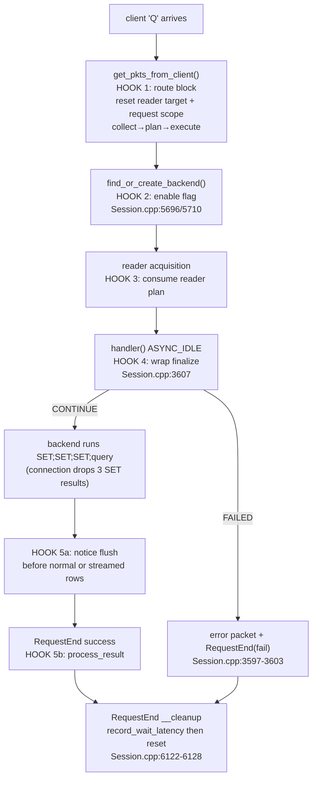
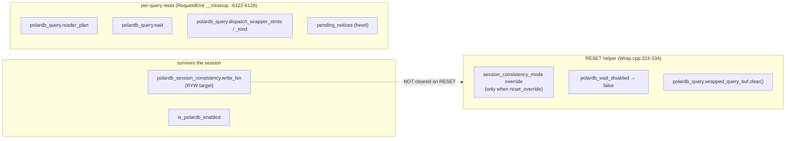
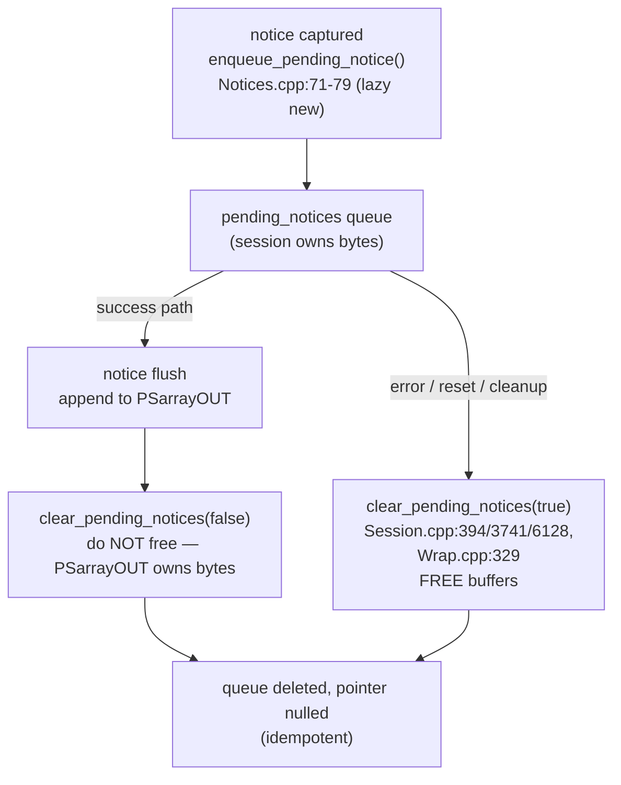
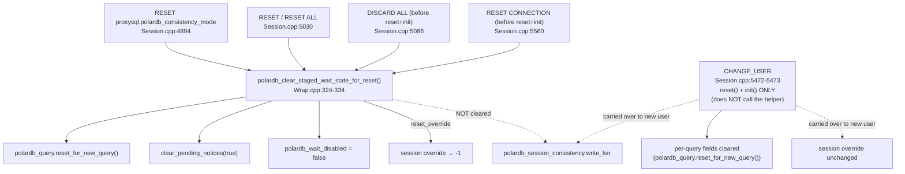

# 10 — Session Integration

> Scope: the PolarDB fields on `PgSQL_Session`, the hook points in the session hot path, per-query reset and session reset / RESET CONNECTION / CHANGE_USER paths (no cross-client leak), and cleanup ordering | Audience: R/M/O/C | Status: stable | Prereqs: [POLARDB_STRUCTURES.md](POLARDB_STRUCTURES.md), [06-ROUTING-PIPELINE.md](06-ROUTING-PIPELINE.md), [07-QUERY-WRAPPING.md](07-QUERY-WRAPPING.md), [08-WAIT-TIMEOUT-AND-NOTICES.md](08-WAIT-TIMEOUT-AND-NOTICES.md), [09-PUBLISH-AND-WRITE-TRACKING.md](09-PUBLISH-AND-WRITE-TRACKING.md) | Verified against: this branch

---

## 1. What this document covers

`PgSQL_Session` is the ProxySQL object that represents one client connection to ProxySQL. It runs the per-query state machine: it reads the client packet, picks a backend hostgroup, sends the query, reads the result, and sends it back. The PolarDB read-your-writes (RYW) feature lives **inside** this object as a set of extra fields and a handful of hook points in the hot path.

This document is the single place that explains:

- **The PolarDB fields on `PgSQL_Session`** — what each one is, when it is set, when it is read, and when it is cleared (grouped by role).
- **The hook points in the session hot path** — the exact five places in `lib/PgSQL_Session.cpp` where PolarDB code runs during a query, with file:line.
- **Per-query reset and session reset** — how state is cleared after each query, and how it is cleared on `RESET`, `DISCARD ALL`, `RESET CONNECTION`, and `CHANGE_USER`, so PolarDB state never leaks from one client to the next when a backend connection is pooled and reused.
- **Cleanup ordering** — why `record_wait_latency()` runs before the per-query reset, and why `polardb_session_consistency.write_lsn` is deliberately **not** cleared on a `RESET`.

The deeper "why" of routing, wrapping, waiting, and result processing lives in the sibling docs listed in the header. This document is about where that state lives on the session and how it is managed safely.

### Terms used here (defined on first use)

- **LSN (Log Sequence Number)**: a 64-bit position in PostgreSQL's write-ahead log (WAL). A bigger LSN means "further ahead in the write history". A replica that has replayed up to LSN X can serve any read whose data was committed at or before X.
- **RYW (read-your-writes)**: the guarantee that after a session writes data, its own later reads see that write even when the read is routed to a replica.
- **RFQ (ReadyForQuery)**: the PostgreSQL wire message a backend sends after each command to say "ready for the next query". A patched PolarDB backend appends its current WAL LSN to this message.
- **Hostgroup (HG)**: a numbered ProxySQL group of backend servers. A PolarDB pair has a writer HG (primary, takes writes) and a reader HG (replicas, may lag).
- **Wait wrapper / wrapped read**: a replica-eligible read that ProxySQL prefixes with three `SET` statements so the replica blocks until it has replayed past the session's last write LSN before answering.
- **Session-confined**: state that is touched by only one OS thread at a time (the thread currently driving this `PgSQL_Session`), so it needs **no locks and no atomics**. ProxySQL drives one session from one thread at a time. All PolarDB session fields are session-confined.
- **Pooled / pooled connection**: a backend connection that ProxySQL reuses for a later query instead of opening a new one. A pooled connection skips the connect path.

All of the code in this document compiles only when the build flag `POLARDB_PROXY` is set (`include/PgSQL_Session.h:476`, `:534`). With `POLARDB_PROXY=0` every field and every hook compiles out and the session behaves exactly like upstream ProxySQL.

---

## 2. Where the session sits in the pipeline

The PolarDB pipeline has four logical stages — collect, plan, execute, process_result — plus a wrap step. All five are **methods of `PgSQL_Session`**, but they run at different points in the per-query state machine. This document maps each one to its call site on the session.

```
  client query 'Q' arrives
        |
        v
  get_pkts_from_client()  ── HOOK 2: route block ───────────────┐
        |  collect -> plan -> execute  (Session.cpp:2543-2568)   |
        |  result overwrites current_hostgroup                    |
        v                                                         |
  find_or_create_backend(current_hostgroup)                       |
        |  (pooled or fresh) ── HOOK 1b: enable flag ────────────┤
        |  (Session.cpp:5696-5697 pooled / 5710-5711 fresh)       |
        v                                                         |
  reader acquisition consumes polardb_query.reader_plan           |
        |  (get_MyConn_polardb_reader returns PolarDB_ReaderResult) |
        v                                                         |
  handler(): ASYNC_IDLE ── HOOK 3a: wrap finalize ───────────────┤
        |  finalize_wait_timeout_injection() (Session.cpp:3607)   |
        v                                                         |
  backend runs: SET; SET; SET; <user query>                       |
        |  (connection layer drops the 3 SET results)             |
        v                                                         |
  notice flush ── HOOK 3b ──────────────────────────────────────┤
        |  forward pending_notices, then rows                    |
        v                                                         |
  RequestEnd(success) ── HOOK 4: process_result ─────────────────┤
        |  polardb_process_result()                               |
        v                                                         |
  RequestEnd __cleanup ── per-query reset ───────────────────────┘
           record_wait_latency() then reset (Session.cpp:6122-6128)
```

The connect-time enable (`HOOK 1`) lives in `lib/PgSQL_Connection.cpp` and is documented in [11-CONNECTION-AND-LIBPQ.md](11-CONNECTION-AND-LIBPQ.md); the session-side enable for pooled and fresh backends (`HOOK 1b` above) is covered here because it is a session method call. The four numbered hooks A/1–4 are listed in [POLARDB_ARCHITECTURE.md](POLARDB_ARCHITECTURE.md).

---

## 3. The PolarDB fields on `PgSQL_Session`

All PolarDB session state is declared in one `#if POLARDB_PROXY` block on
`PgSQL_Session` (`include/PgSQL_Session.h`). Related state is grouped into small
value types: `polardb_session_consistency` for long-lived session LSN state and
`polardb_query` for per-query reader/wait/wrapper state. This keeps the feature
local to `PgSQL_Session` without scattering reset invariants across loose fields.

Every field is initialized by a C++ in-class member initializer at construction (for example `= 0`, `= false`, `= -1`, `= nullptr`). Per-query and per-reset clearing is then **explicit** in the hot path (sections 5 and 6). Because the session is session-confined, none of these fields use locking or atomics.

The fields fall into four groups by role.

### 3.1 Group A — config and enable

These two fields say "is PolarDB on for this session, and which mode did the client ask for". They live in the nested `polardb_config` struct (`include/PgSQL_Session.h:495-500`).

| Field | Type (default) | Role | Set by | Read by | Cleared |
|-------|----------------|------|--------|---------|---------|
| `polardb_config.is_polardb_enabled` | bool (`false`) | True once the session is bound to a PolarDB hostgroup. Gates the result-processing hook. | Fresh connect (`lib/PgSQL_Connection.cpp:1219`); pooled attach (`lib/PgSQL_Session.cpp:5697`); fresh-create attach (`:5711`) | result-processing guard in `RequestEnd`; `polardb_process_result` | **Never reset to false.** Once on, it stays on for the life of the session object. |
| `polardb_config.session_consistency_mode` | int (`-1`) | Per-session consistency-mode override; `-1` means "inherit per-HG / global". Tier 1 of the 3-tier mode resolution. | `polardb_set_session_override()` from a client `SET proxysql.polardb_consistency_mode` (`lib/PgSQL_PolarDB_Consistency.cpp:49`, called at `lib/PgSQL_Session.cpp:4707`) | collect, via the mode resolver (`lib/PgSQL_PolarDB_Flow.cpp:67`) | Reset to `-1` on `RESET`/`DISCARD ALL`/`RESET CONNECTION` via `polardb_clear_staged_wait_state_for_reset(reset_override=true)` (`lib/PgSQL_PolarDB_Wrap.cpp:332`) |

This implementation deliberately has no session-id/cancel-key fields in `polardb_config`.
PolarDB15 cancel-session routing is a future extension, not inert state in the
LSN-only session model.

### 3.2 Group B — the LSN write position (the RYW target)

| Field | Type (default) | Role | Set by | Read by | Cleared |
|-------|----------------|------|--------|---------|---------|
| `polardb_session_consistency.write_lsn` | uint64_t (`0`) | Own-write component of the RYW target. A later replica-eligible read waits on `max(write_lsn, observed_lsn)`. | `polardb_process_result`, advanced monotonically with `max()` on a write that carried an LSN | collect, as part of the wait target | **Deliberately NOT cleared on `RESET`** (see section 6.4). Lives for the whole session. Zero-initialized per new client session object. |
| `polardb_session_consistency.observed_lsn` | uint64_t (`0`) | Monotonic observed component. Any positioned RFQ result, read or write, can move it forward. | `polardb_process_result`, advanced monotonically with `max()` on positioned results | collect, as part of the wait target | Same lifetime as `write_lsn`. |
| `polardb_session_consistency.write_unknown` | bool (`false`) | A writer query completed without RFQ LSN, so later automatic LSN-mode reads cannot prove RYW from that write. | `polardb_process_result` missing-RFQ path | plan latch policy | Cleared by a primary-sourced positioned result, or by writer-scope reset. |
| `polardb_session_consistency.observed_unknown` | bool (`false`) | A tracked read completed without RFQ LSN, so later reads cannot prove monotonic-read continuity from that observation. | `polardb_process_result` missing-RFQ path | plan latch policy | Cleared by a primary-sourced positioned result, or by writer-scope reset. |

`write_lsn` and `observed_lsn` are the bridge between completed results and later
reads: result processing advances them, and collect reads them to decide whether
and how long to wait. The wait target is the defensive `max(write_lsn,
observed_lsn)`. In normal LSN mode `observed_lsn` subsumes `write_lsn` because
writes are also observations, but the write component stays separate for
diagnostics and future split/CSN policy.

The writer-scope fields sit beside the LSN state and protect it from cross-cluster movement and failover/timeline changes:

| Field | Type (default) | Role | Set by | Read by | Cleared |
|-------|----------------|------|--------|---------|---------|
| `polardb_session_consistency.writer_scope` | `PolarDB_WriterScope` | Writer hostgroup + writer-identity epoch attached to this session's LSN targets/latches. `hg < 0` means no scope is attached yet. | clean first PolarDB collect seeds it; accepted result processing tags created state with the request writer scope; later writer-scope mismatches update it | collect, `polardb_process_result` | On writer-HG or epoch mismatch, collect reseeds the scope and clears `write_lsn`, `observed_lsn`, and both missing-LSN latches. If collect finds LSN state before any scope was attached, it clears that unscoped state. `PolarDB_Session_Target_Epoch_Reset` increments only if at least one target or latch was actually discarded. |
| `polardb_query.request_writer_scope` | `PolarDB_WriterScope` | Writer hostgroup + epoch captured for the current request. `hg < 0` means no request scope was captured. | collect, or manual-route staging from the effective scope hostgroup | `polardb_process_result` | Reset before each routed query and in `RequestEnd` cleanup. |

### 3.3 Group C — per-query route and wait state

These fields describe the wait for **one** query. They are reset before each query, filled by execute when the read is routed to a replica with a wait, consumed by the wrap step, and reset again at query end.

| Field | Type (default) | Role | Set by | Read by | Cleared |
|-------|----------------|------|--------|---------|---------|
| `polardb_query.reader_plan` | `PolarDB_Query_ReaderPlan` | Per-query reader acquisition requirements: consistency target LSN, primary LSN mirror for lag-cap checks, max lag, fallback writer HG, and RFQ fallback policy. The `has_consistency_target_lsn()` predicate is the hot-path condition. | execute from the route plan | `get_MyConn_polardb_reader()` through `PolarDB_ReaderResult` | `reset_reader_target()` at query intake, after reader acquisition handling, query-end cleanup, and RESET. |
| `polardb_query.wait` | `PolarDB_Query_WaitState` | In-flight wait state for the current wrapped read. Drives wrap-state filtering and latency accounting. | `prepare_from_spec(plan.wait_spec)` then `wait_stage=WAITING`, `wait_started_at_us`, `original_query` | `polardb_wait_active()` checks `wait_stage`; the wrap step reads `original_query` and `spec.mode` | `reset_wait()` on session reset, query-end, wrapper-set-failure, and RESET. |

`PolarDB_Query_WaitState` carries the per-wait timestamp
`wait_started_at_us`. That timestamp is both the latency base and the de-dup
guard for timeout accounting — see section 6.2 and
[08-WAIT-TIMEOUT-AND-NOTICES.md](08-WAIT-TIMEOUT-AND-NOTICES.md). Its `reset()`
and `prepare_from_spec()` bodies live with the type. `prepare_from_spec()` sets
`wait_stage = IDLE`; execute raises it to `WAITING` only after it has also
captured the original query, so a wait is "active" only after execute fully prepares
it.

### 3.4 Group D — wrap buffers, dispatch handoff, safety latch, and notices

| Field | Type (default) | Role | Set by | Read by | Cleared |
|-------|----------------|------|--------|---------|---------|
| `polardb_query.wrapped_query_buf` | std::string | Reused buffer holding the wrapped query text (`SET;SET;SET;<user query>`). | wrap finalize | the packet-replace step in wrap | `.clear()` on RESET and per-query cleanup |
| `polardb_query.dispatch_wrapper_stmts` | uint32_t (`0`) | How many wrapper `SET` results the connection must skip. Handed off to the connection at dispatch. | wrap finalize | the connection snapshot at dispatch | Connection zeroes it after copying; also reset by `polardb_query.reset_for_new_query()`. |
| `polardb_query.dispatch_wrapper_kind` | `PolarDB_Query_WrapperKind` (`NONE`) | Wrapper kind for the same handoff. | wrap finalize | the connection snapshot at dispatch | Connection clears it after copying; also reset by `polardb_query.reset_for_new_query()`. |
| `polardb_wait_disabled` | bool (`false`) | **Safety latch.** When true, the session forces the writer instead of an unwrapped replica read. Set when a wrapper build fails. | `fail_wait_wrap_finalize()` (`lib/PgSQL_PolarDB_Wrap.cpp:192`) | execute writer-fallback safety check (`lib/PgSQL_PolarDB_Flow.cpp:422`) | Reset to false on RESET (`lib/PgSQL_PolarDB_Wrap.cpp:330`) |
| `pending_notices` | `PtrSizeArray*` (`nullptr`) | Heap-owned queue of captured `NoticeResponse` packets (e.g. a best-effort wait-timeout WARNING), forwarded ahead of the user result. | lazily `new`-ed on first capture (`lib/PgSQL_PolarDB_Notices.cpp`) | `polardb_flush_pending_notices_to_client()` before normal result forwarding and before the first streamed chunk | `clear_pending_notices()` — see section 6.3 |

The dispatch handoff (`polardb_query.dispatch_wrapper_stmts` / `_kind`) is the
one place session state is **handed to** the connection. The connection
snapshots the two fields into its own `dispatch_state` and immediately zeroes the
session copies, so the count is owned by exactly one layer at a time. This
handoff is detailed in [07-QUERY-WRAPPING.md](07-QUERY-WRAPPING.md) and
[11-CONNECTION-AND-LIBPQ.md](11-CONNECTION-AND-LIBPQ.md).

`pending_notices` is the only heap-owned PolarDB field on the session. Its memory management is the subtlest part of the cleanup story (section 6.3).

---

## 4. The hook points in the session hot path

There are six PolarDB hook points inside `lib/PgSQL_Session.cpp`. Each one is guarded by `#if POLARDB_PROXY`. The table lists them in the order they run for one query.

| # | Hook | What it does | Method / state | file:line |
|---|------|--------------|----------------|-----------|
| 1 | Route block | Reset the per-query reader target and request writer scope, then (if any PolarDB HG is active and the user did not do manual routing) run collect -> plan -> execute and overwrite `current_hostgroup`. Manual destination mode only stages the writer scope for result processing. | `polardb_collect`, `polardb_plan`, `polardb_execute` | `lib/PgSQL_Session.cpp` route block |
| 2 | Enable flag (pooled / fresh) | When attaching a backend for a PolarDB HG, set `is_polardb_enabled=true` if it is not already, so result processing and waits work on a reused connection. | `polardb_config.is_polardb_enabled` | backend attach path |
| 3 | Reader acquisition | When `polardb_query.reader_plan.has_consistency_target_lsn()` is true, acquire a reader through `get_MyConn_polardb_reader(..., polardb_query.reader_plan, ...)`. The typed `PolarDB_ReaderResult` either returns a connection, returns a connection with `wait_bypass_allowed`, degrades RFQ under best_effort, redirects this query to the writer for safety statuses, or leaves normal retry/wait behavior for transient pool statuses. | `polardb_query.reader_plan` | backend acquisition path |
| 4 | Wrap finalize | At `ASYNC_IDLE`, build and inject the wait wrapper exactly once; on failure send a clean error and end the query instead of sending it unwrapped to a replica. | `finalize_wait_timeout_injection` | `lib/PgSQL_Session.cpp:3590-3605` |
| 5 | Wait-read retry | In the `rc == -1` branch, retry one wait-wrapped reader query on the writer when either the strict timeout marker was seen or the reader connection was lost, and no user result started. | `PolarDB_WaitReadFailure`, `polardb_retry_wait_read_on_writer` | backend error path |
| 6a | Notice flush | Before forwarding the user result, prepend any captured notices, then clear the queue without freeing (ownership moved). The same helper runs before the first streamed result chunk. | `pending_notices` | `lib/PgSQL_PolarDB_Notices.cpp`, `lib/PgSQL_Session.cpp` |
| 6b | Process result | On the success path, reject stale writer-epoch RFQs; otherwise capture the backend RFQ LSN, update session LSN state, and update the HGM per-server LSN cache for accepted RFQs. | `polardb_process_result` | `RequestEnd` success path |

The per-query reset that runs in `RequestEnd`'s `__cleanup` label is not a "hook" so much as a teardown; it is covered in section 6.

### 4.1 Hook 1 — the route block (collect/plan/execute)

The route block sits inside the simple-query (`'Q'`) handler in `get_pkts_from_client()`, just before `find_or_create_backend(current_hostgroup)` (`lib/PgSQL_Session.cpp:2570`).

The block does three things in order:

1. **Unconditional per-query reset** of the reader target and request writer scope, so a stale LSN can never leak into a passthrough read: `polardb_query.reset_reader_target(); polardb_query.request_writer_scope.reset();`. This runs whether or not PolarDB is active.
2. **The active gate**: the rest runs only if `PgHGM->status.polardb_active` is true (`:2543`). This is the cheap atomic master gate that is false when no PolarDB hostgroup is configured, so the pipeline costs nothing on a non-PolarDB deployment.
3. **The manual-mode bypass**: it reads the query-rule output `qpo->replica_eligible` (tri-state: `1`=auto, `0`=force primary, `-1`=unset) and `qpo->destination_hostgroup`. When `replica_eligible` is unset (`-1`) and a `destination_hostgroup` is explicitly set by a query rule, the user is doing manual routing and the pipeline does not override it. The request RFQ scope is still staged for result processing: normally from `destination_hostgroup`, but from the transaction-persistent `current_hostgroup` when ProxySQL is already pinned and will ignore the query-rule destination.

If not in manual mode, it runs collect (`:2554`), and only when the collected context says this really is a PolarDB HG (`polardb_route_ctx.is_polar_hg` at `:2555`) does it run plan (`:2556`). The result is applied two ways:

- If the plan action is not `PASSTHROUGH`, run execute and set `current_hostgroup = result.final_target_hg` (`:2557-2559`).
- If the plan action is `PASSTHROUGH` but carries an explicit `target_hg >= 0` (for example the writer when a query is not replica-eligible), pin that HG (`:2560-2564`). A `target_hg == -1` means "leave routing to the query rules".

The decision logic itself is in [06-ROUTING-PIPELINE.md](06-ROUTING-PIPELINE.md).

### 4.2 Hook 2 — the enable flag on pooled and fresh backends

`is_polardb_enabled` is the gate that lets result processing run at all (HOOK 5b checks it). On a fresh connect it is set in the connection layer when the startup conninfo is built (`lib/PgSQL_Connection.cpp:1219`). But a **pooled** connection is reused without running connect, so that site never fires for it. To cover the pooled case, the session also sets the flag when it gets or creates a backend for a PolarDB HG:

- Pooled path (`lib/PgSQL_Session.cpp:5696-5697`): `if (!polardb_config.is_polardb_enabled && PgHGM->is_polardb_hostgroup(mybe->hostgroup_id)) polardb_config.is_polardb_enabled = true;`
- Fresh-create path (`lib/PgSQL_Session.cpp:5710-5711`): the same check, set up front so the pipeline is active even before connect completes.

Without this hook, result processing and the wait pipeline would never activate on a reused connection. The flag is only ever turned **on**; it is never turned off, because a session that has ever talked to a PolarDB backend should keep capturing LSNs.

### 4.3 Hook 3 — reader acquisition consumes the per-query plan

After the backend HG is chosen, the session asks the pool for a connection. When `polardb_query.reader_plan.has_consistency_target_lsn()` (a replica read with a wait was prepared by execute), reader acquisition uses the LSN-aware route helper instead of the generic pool getter:

```
if (polardb_query.reader_plan.has_consistency_target_lsn()) {
    PolarDB_ReaderResult reader_result =
        PgHGM->get_MyConn_polardb_reader(mybe->hostgroup_id, this,
                                         polardb_query.reader_plan, false);
    if (reader_result.acquired()) {
        mc = reader_result.conn;
        if (reader_result.wait_bypass_allowed)
            polardb_query.reset_wait();
        polardb_query.reset_reader_target();
    } else if (reader_result.status == PolarDB_ReaderStatus::RFQ_UNAVAILABLE &&
               route_rfq_policy == BEST_EFFORT) {
        polardb_enqueue_degraded_rfq_notice(...);
        polardb_query.reset_reader_target();
        polardb_query.reset_wait();
    } else if (reader_result.status == PolarDB_ReaderStatus::RFQ_UNAVAILABLE ||
               polardb_reader_status_redirects_to_writer(reader_result.status)) {
        // RFQ-strict / consistency-safety statuses require a deterministic
        // one-query writer redirect; do not fall through to an unfiltered reader.
        int writer_hg = polardb_query.reader_plan.fallback_writer_hg;
        if (!polardb_redirect_to_writer(writer_hg,
                polardb_reader_status_name(reader_result.status))) {
            // No known fallback writer; let the normal retry path handle it.
            polardb_reader_acquisition_handled = true;
        }
    }
}
```

The targeted-reader state is reset as soon as acquisition is handled (via `polardb_query.reset_reader_target()`, defined in `include/PgSQL_PolarDB.h:1638` as `reader_plan.reset()`), so it is genuinely one-shot. When `wait_bypass_allowed` is true, only the staged wait is cleared before wrap finalize; the query still uses the selected reader connection. The writer-redirect branch does not set `current_hostgroup` or call `find_or_create_backend` inline; instead it calls the helper `PgSQL_Session::polardb_redirect_to_writer(writer_hg, reason)` (`lib/PgSQL_PolarDB_Failure.cpp:295`). That helper bumps the writer-fallback counter via the per-thread counter macro `POLARDB_THREAD_COUNT_ONE(thread, consistency_writer_fallback)` (`Failure.cpp:306`) — not a direct `PgHGM->status.polardb_consistency_writer_fallback++` — then resets the reader target and wait, sets `current_hostgroup = writer_hg`, calls `find_or_create_backend(current_hostgroup)`, and transfers the staged simple-query packet to the writer stream. It returns `false` only when no writer HG is known (`writer_hg < 0`), in which case the session leaves the normal pool/retry path in control. The session branch lives at `lib/PgSQL_Session.cpp:5828-5840`. `READER_UNAVAILABLE` and `READER_BUSY` are not safety failures; they leave normal ProxySQL retry/wait behavior in control. The reader acquisition logic in the HostGroups Manager is in [05-MONITOR-AND-HGM-LSN-STATE.md](05-MONITOR-AND-HGM-LSN-STATE.md).

### 4.4 Hook 4 — wrap finalize (the single wrapping point)

At the `ASYNC_IDLE` state in `handler()`, after the backend connection exists, the session calls `finalize_wait_timeout_injection(myconn, myds)` exactly once (`lib/PgSQL_Session.cpp:3607`). This is the single point where the wrapped query is actually built. The earlier execute stage only saved intent (it snapshotted `original_query` and set `wait_stage=WAITING`); it did not build the wrapped SQL.

The call stops safely if wrapping cannot be completed:

```
if (finalize_wait_timeout_injection(myconn, myds) == PolarDB_WrapFinalizeResult::FAILED) {  // :3595
    client_myds->setDSS_STATE_QUERY_SENT_NET();
    client_myds->myprot.generate_error_packet(true, true,
        "PolarDB LSN wait wrapper could not be built safely", ...);                          // :3598
    RequestEnd(myds, true);                                                                  // :3601
    finishQuery(myds, myconn, false);                                                        // :3602
    goto __exit_DSS__STATE_NOT_INITIALIZED;                                                  // :3603
}
```

When the wrapper cannot be built safely, the session sends the client a clean ERROR and ends the query rather than silently running the unwrapped read on a replica (which would break RYW). The build failure also sets the session safety latch `polardb_wait_disabled=true` inside `fail_wait_wrap_finalize()` (`lib/PgSQL_PolarDB_Wrap.cpp:192`), so all later reads in this session use the writer instead of an unwrapped replica read too. The wrap mechanics are in [07-QUERY-WRAPPING.md](07-QUERY-WRAPPING.md).

### 4.5 Hook 5a — the notice flush (forward once, ahead of rows)

A best-effort wait timeout arrives as a backend WARNING/NOTICE while the wrapped `SELECT` runs. The notice path (in the connection layer) captures it into `pending_notices` (section 6.3). The session then flushes those notices to the client **once**, ahead of the user result, inside `PgSQL_Result_to_PgSQL_wire()`:

```
polardb_flush_pending_notices_to_client();
```

The bytes are appended to the client output array `PSarrayOUT`, which now owns them, so the queue is cleared **without** freeing the buffers (`free_buffers=false`). The helper is called before normal result forwarding and before the first threshold-triggered streamed chunk. This preserves the ordering the client would have seen without wrapping: the warning comes before rows. Notice handling end to end is in [08-WAIT-TIMEOUT-AND-NOTICES.md](08-WAIT-TIMEOUT-AND-NOTICES.md).

### 4.6 Hook 5b — process result

On the success path of `RequestEnd()` (`called_on_failure == false`), and only when `polardb_config.is_polardb_enabled`, the session calls result processing:

```
if (polardb_config.is_polardb_enabled) {
    polardb_process_result(myds, query_digest_text);
}
```

`polardb_process_result()` reads the backend WAL LSN from the extended RFQ (no extra round-trip), advances observed/write session LSN state, maintains missing-LSN latches, and refreshes the per-server LSN cache; see [09-PUBLISH-AND-WRITE-TRACKING.md](09-PUBLISH-AND-WRITE-TRACKING.md). Note this hook runs **before** the `__cleanup` label, so it sees the wait state for the query that just finished; the per-query reset happens after it.

---

## 5. Per-query reset

PolarDB per-query state must be gone before the next query starts, so a wait or a captured notice from query N never bleeds into query N+1 on the same client. There are two per-query reset points, and they clear the **same set** of fields.

### 5.1 The two per-query reset sites

| Site | When it runs | What it clears |
|------|--------------|----------------|
| Route-block top | At query intake, before routing | clear `polardb_query.reader_plan` and `polardb_query.request_writer_scope` before this query can plan or manually stage a writer scope. |
| `RequestEnd` `__cleanup` | At the end of every query, success or failure | `record_wait_latency()`, then the full per-query field set. |

The full per-query reset in `__cleanup` is:

```
record_wait_latency(polardb_query.wait);                  // BEFORE the reset
polardb_query.reset_for_new_query();
clear_pending_notices(/*free_buffers=*/true);             // FREE on this path
```

Note what is **not** in this list: `polardb_session_consistency.write_lsn`
(the RYW target survives the query, on purpose — see section 6.4),
`polardb_config.is_polardb_enabled`, and `polardb_wait_disabled`. The dispatch
fields inside `polardb_query` are cleared here as a backstop even though the
connection normally zeroes them at dispatch (section 3.4).

### 5.2 The third teardown: wrapper-set-failure

If a wait-wrapped reader query failed (for example a strict-mode timeout surfaced as an ERROR, or the reader connection was lost), the rc=-1 query-failure branch in `handler()` tears down the staged wait state early (`lib/PgSQL_Session.cpp:3744-3785`):

```
// Capture the failed wait-wrapped reader query before generic error handling
// mutates the reader data stream (Session.cpp:3744-3745).
const PolarDB_WaitReadFailure polardb_failure =
    polardb_capture_wait_read_failure(myds);                              // :3744-3745
...
if (polardb_wait_active() &&
    (polardb_failure.wrapper_set_failure ||
     polardb_failure.timeout_error ||
     polardb_failure.connection_lost) &&                                  // :3777-3780
    polardb_query.wait.wait_started_at_us != 0) {                         // :3781
    record_wait_latency(polardb_query.wait);  // account the failed wait's elapsed time :3782
    polardb_query.reset_wait();                                          // :3783
    clear_pending_notices(/*free_buffers=*/true);                        // :3784
}
```

The three failure flags (`wrapper_set_failure`, `timeout_error`, `connection_lost`) are read from the `PolarDB_WaitReadFailure` returned by `polardb_capture_wait_read_failure(myds)`, not from a locally recomputed bool. So this teardown also fires for strict timeout-error and reader-connection-loss failures, not only wrapper-SET failures; ordinary SQL errors (none of the three flags set) keep the normal error flow.

This path **only** records latency; it deliberately does not call `polardb_account_wait_timeout()`, because only marker-confirmed PolarDB timeout events are charged as timeouts (the marker check lives in the notice and result paths — see [08-WAIT-TIMEOUT-AND-NOTICES.md](08-WAIT-TIMEOUT-AND-NOTICES.md)). The `wait_started_at_us != 0` guard at `:3781` makes this teardown idempotent against the `__cleanup` reset that follows: once `record_wait_latency()` zeroes the timer, the later call at query-end is a no-op.

---

## 6. Cleanup ordering and the no-leak guarantees

This section explains the four parts of cleanup that have to be ordered or
scoped correctly: the latency-before-reset ordering, the timeout-accounting
de-dup, the `pending_notices` free/no-free split, and the deliberate survival of
`polardb_session_consistency.write_lsn`.

### 6.1 Why `record_wait_latency()` runs before the reset

In both teardown paths (`__cleanup` and wrapper-set-failure),
`record_wait_latency(polardb_query.wait)` is called **before**
`polardb_query.reset_wait()` or `polardb_query.reset_for_new_query()`:

- `__cleanup`: `:6122` (latency) then `:6124` (reset).
- wrapper-set-failure: `:3782` (latency) then `:3783` (reset).

The order matters because `record_wait_latency()` reads `wait_started_at_us`
from `polardb_query.wait` and adds the elapsed time to the
`PolarDB_Wait_LSN_Sum_Us` counter. If `reset()` ran first it would zero
`wait_started_at_us` and the wait's elapsed time would be lost. The code comment
near the cleanup path states this explicitly. `record_wait_latency()` is a no-op
when no wait was active (its body checks the timer first), so calling it on every
query end is safe.

### 6.2 The timeout-accounting de-dup (`wait_started_at_us == 0`)

The same `wait_started_at_us` timestamp that anchors latency also serves as the de-dup guard for timeout accounting. It is set once when a wait starts (`lib/PgSQL_PolarDB_Flow.cpp:723`). The first successful accounting call zeroes it through `record_wait_latency()`. After that, both:

- `record_wait_latency()` returns immediately if the timer is already `0` (`lib/PgSQL_PolarDB_Wrap.cpp:376`), and
- `polardb_account_wait_timeout()` returns false (no counting) if the wait is inactive or the timer is `0` (`lib/PgSQL_PolarDB_Wrap.cpp:403`).

So if the same backend timeout event is observed twice (for example a best-effort WARNING seen on both the notice and result paths), it cannot double-count counters or latency. This is why the wrapper-set-failure teardown (section 5.2) is guarded by `wait_started_at_us != 0` and why query-end latency is harmless after an early accounting. Full detail is in [08-WAIT-TIMEOUT-AND-NOTICES.md](08-WAIT-TIMEOUT-AND-NOTICES.md).

### 6.3 `pending_notices` — free vs. no-free, and lazy allocation

`pending_notices` is the one heap-owned PolarDB field, so its lifecycle is the trickiest. The rules:

- **Lazily allocated.** It is `nullptr` until the first notice is captured; `enqueue_pending_notice()` `new`-s a `PtrSizeArray` on first use (`lib/PgSQL_PolarDB_Notices.cpp:75-79`). A session that never hits a wait timeout never allocates it.
- **`clear_pending_notices(free_buffers)`** is the single teardown helper (`lib/PgSQL_PolarDB_Notices.cpp:42-59`). It returns immediately if the pointer is already `nullptr` (idempotent), removes every entry (freeing each buffer only when `free_buffers==true`), then `delete`s the array and sets the pointer back to `nullptr`.

The free/no-free choice depends on whether the bytes were handed to the client:

| Caller | `free_buffers` | Why | file:line |
|--------|----------------|-----|-----------|
| notice flush | `false` | Bytes were transferred to `PSarrayOUT`, which now owns them. | `polardb_flush_pending_notices_to_client()` |
| Session `reset()` (per-query/recycle) | `true` | Any notice not yet forwarded (error paths) is the session's to free. | `lib/PgSQL_Session.cpp:394` |
| `RequestEnd` `__cleanup` | `true` | Same — free anything not forwarded. | `lib/PgSQL_Session.cpp:6128` |
| wrapper-set-failure teardown | `true` | Free on the failure path. | `lib/PgSQL_Session.cpp:3784` |
| RESET / DISCARD ALL / RESET CONNECTION | `true` | Free the queue on a session reset. | `lib/PgSQL_PolarDB_Wrap.cpp:329` |

Because the helper `delete`s and nulls the array, and is idempotent on `nullptr`, calling it more than once per query (flush with `false`, then `__cleanup` with `true`) is safe: after the flush the array is gone, and the `__cleanup` call sees `nullptr` and returns. The destructor frees it too, indirectly, by calling `reset()` (`lib/PgSQL_Session.cpp:436`), which clears it with `free_buffers=true`.

### 6.4 Why `polardb_session_consistency.write_lsn` survives a RESET

`polardb_session_consistency.write_lsn` is the RYW target. It is **not** cleared
by any per-query reset, nor by `RESET`, `RESET ALL`, `DISCARD ALL`, or `RESET
CONNECTION`. The reasoning, stated in code comments:

- The `__cleanup` comment (`lib/PgSQL_Session.cpp:6116-6118`): the write position records that this client has observed committed writes and must survive across queries.
- The RESET-helper comment (`lib/PgSQL_PolarDB_Wrap.cpp:316-320`): RESET resets session *configuration*, not the fact that the client has written; RYW must survive a RESET.

A `RESET` clears your session settings; it does not undo your writes. If
`polardb_session_consistency.write_lsn` were cleared, a client that wrote, then
issued `RESET`, then read would silently lose RYW. So the field deliberately
lives for the whole session object. It is only ever zero-initialized when a
brand-new `PgSQL_Session` is constructed, which means a brand-new client
connection.

---

## 7. Session reset, RESET CONNECTION, and CHANGE_USER — no cross-client leak

ProxySQL reuses backend connections across clients via its pool. The safety property that must hold is: **PolarDB session state from client A must never be visible to client B.** Two mechanisms enforce this.

1. The PolarDB session fields live on the `PgSQL_Session` object, which is **per client connection**, not per backend connection. A new client gets a fresh `PgSQL_Session` with all PolarDB fields at their in-class defaults (`polardb_session_consistency.write_lsn = 0`, etc.). So a backend connection moving from client A's session to client B's session carries no PolarDB session state with it — that state lived on A's session object.
2. Within one client's lifetime, the explicit-reset commands (`RESET`, `RESET ALL`, `DISCARD ALL`, `RESET CONNECTION`) clear the staged per-query state and (when appropriate) the per-session override, via one helper.

The one exception to "a new client gets a fresh session object" is
`CHANGE_USER`, where a new user takes over the **same** session object. That
path is covered in section 7.5: it clears all per-query state but, by design,
carries `polardb_session_consistency.write_lsn` and the per-session override
across.

### 7.1 The reset helper

`polardb_clear_staged_wait_state_for_reset(bool reset_override)` (`lib/PgSQL_PolarDB_Wrap.cpp:324-334`) is the single function the reset commands call. It clears:

```
polardb_query.reset_for_new_query();
clear_pending_notices(/*free_buffers=*/true);  // FREE the queue
polardb_wait_disabled = false;               // RESET starts from normal wait behavior
polardb_rfq_degraded_route_warning_sent = false;
if (reset_override) {
    polardb_set_session_override(-1);         // clear the per-session mode override
}
```

It deliberately does **not** clear `polardb_session_consistency.write_lsn`
(section 6.4) and does not dispose backend connections (comment at `:313-314`).
The `reset_override` flag controls whether the per-session consistency-mode
override is also cleared.

### 7.2 The four reset call sites

| Command (client side) | Handler | `reset_override` | Effect |
|-----------------------|---------|------------------|--------|
| `RESET proxysql.polardb_consistency_mode` | inline in the RESET handler (`lib/PgSQL_Session.cpp:4893-4894`) | `true` | Clears staged wait state and the per-session mode override. |
| Generic `RESET` / `RESET ALL` | RESET handler (`lib/PgSQL_Session.cpp:5026-5030`) | passed in (`reset_override`) | The handler decides: only `RESET ALL` and `RESET proxysql.polardb_consistency_mode` clear the override; a plain `RESET <var>` clears staged state but leaves the override (comment at `:5027-5029`). |
| `DISCARD ALL` | DISCARD handler (`lib/PgSQL_Session.cpp:5082-5086`), runs **before** `reset()` + `init()` | `true` | Full session reset; frees `pending_notices` before re-init so a later re-init cannot leak an allocated queue (comment at `:5083-5085`). |
| `RESET CONNECTION` (`_MYSQL_COM_RESET_CONNECTION`) | reset-connection handler (`lib/PgSQL_Session.cpp:5556-5560`), runs **before** `reset()` + `init()` | `true` | Same full-reset shape as `DISCARD ALL`. |

The `DISCARD ALL` and `RESET CONNECTION` handlers run the helper **before** `reset()` and `init()` on purpose: `reset()` already frees `pending_notices`, but freeing it first (with `reset_override=true`) also clears the override and the safety latch, and the ordering guarantees no allocated queue survives into the re-initialized session.

### 7.3 Where the override is set

The only place the per-session override is **set** (other than cleared to `-1`) is the client `SET proxysql.polardb_consistency_mode` handler. It parses the value, maps it to a mode int, and calls `polardb_set_session_override(mode)` (`lib/PgSQL_Session.cpp:4707`, via `lib/PgSQL_PolarDB_Consistency.cpp:49`). An invalid value returns an error packet before the call (`lib/PgSQL_Session.cpp:4692-4699`). This makes the override the only PolarDB session field a client can change directly with SQL.

### 7.4 The session `reset()` and the destructor

`PgSQL_Session::reset()` is the generic session-recycle reset. Its PolarDB block
clears the per-query fields and frees `pending_notices` with
`free_buffers=true`, matching the `__cleanup` set, so a recycled session never
carries a stale wait or leaks a captured notice. It does **not** clear
`polardb_session_consistency.write_lsn` or the override here — those are handled
by the explicit reset helper when a reset command runs. The destructor
`~PgSQL_Session()` calls `reset()`, which is the final free of `pending_notices`
when the client disconnects.

### 7.5 CHANGE_USER — a different client takes over the same session

`CHANGE_USER` is the one path where a **different database user** takes over the **same** `PgSQL_Session` object without the client disconnecting. The handler is `handler___status_WAITING_CLIENT_DATA___STATE_SLEEP___MYSQL_COM_CHANGE_USER()` (`lib/PgSQL_Session.cpp:5467`). For a PostgreSQL (or SQLite-admin) session it calls `reset()` then `init()` up front (`lib/PgSQL_Session.cpp:5472-5473`), before it re-authenticates the new user.

What this means for PolarDB state:

- `reset()` runs the per-query PolarDB block, so the staged wait, reader plan,
  dispatch handoff fields, wrapper buffer, and `pending_notices` are all cleared
  (and `pending_notices` is freed). No stale per-query state survives.
- `reset()` does **not** call `polardb_clear_staged_wait_state_for_reset()`. So
  `CHANGE_USER` does **not** clear `polardb_session_consistency.write_lsn` and
  does **not** clear the per-session consistency override
  (`session_consistency_mode`). Those two fields carry over to the new user on
  the same session object.

This is a deliberate consequence of the same rule as section 6.4:
`polardb_session_consistency.write_lsn` is only ever zero-initialized for a
brand-new `PgSQL_Session`, and `CHANGE_USER` reuses the existing object rather
than building a new one. In the LSN-only tree the practical effect is small —
the carried-over write LSN only makes the new user's first replica reads wait
for an LSN the previous user already reached, which is safe (it never serves
*less* fresh data) — but it is a real cross-user carry-over and is called out
here for completeness. A client that needs a clean PolarDB consistency state
after `CHANGE_USER` should issue `RESET ALL` (which does run the helper with
`reset_override=true`).

> Note on the command name: `_MYSQL_COM_CHANGE_USER` is a MySQL-protocol command constant. ProxySQL also dispatches it on the PostgreSQL session path (`lib/PgSQL_Session.cpp:2002-2003`), which is why the PgSQL handler exists.

---

## 8. Field-lifecycle summary table

This table summarizes every PolarDB session field's scope and clearing, for quick reference. "Per-query" means cleared at `RequestEnd` `__cleanup`; "RESET" means cleared by the reset helper; "session" means it survives both and lives for the whole session object.

| Field | Scope | Cleared by per-query reset? | Cleared by RESET helper? | Survives the session? |
|-------|-------|-----------------------------|--------------------------|-----------------------|
| `polardb_config.is_polardb_enabled` | session | no | no | yes (until session object dies) |
| `polardb_config.session_consistency_mode` | session, client-settable | no | yes, only when `reset_override` | yes otherwise |
| `polardb_session_consistency.write_lsn` | session (RYW target) | no | **no** (deliberate) | yes |
| `polardb_session_consistency.observed_lsn` | session (monotonic read target) | no | **no** (deliberate) | yes |
| `polardb_query.reader_plan` | per-query reader target | yes | yes | no |
| `polardb_query.wait` | per-query wait state | yes | yes | no |
| `polardb_query.dispatch_wrapper_stmts` | per-query (handoff) | yes | yes | no |
| `polardb_query.dispatch_wrapper_kind` | per-query (handoff) | yes | yes | no |
| `polardb_query.wrapped_query_buf` | per-query buffer | yes (`.clear()`) | yes (`.clear()`) | buffer object lives, contents reused |
| `polardb_wait_disabled` | session safety latch | no | yes (back to false) | yes until RESET |
| `pending_notices` | per-query, heap-owned | yes (freed) | yes (freed) | no |

---

## 9. Notes for reviewers

- **No locking on session fields is correct.** Every PolarDB session field is session-confined: only the one thread driving this `PgSQL_Session` touches it. The only PolarDB state shared across threads is in the HostGroups Manager (atomics / `wrlock()`), covered in [05-MONITOR-AND-HGM-LSN-STATE.md](05-MONITOR-AND-HGM-LSN-STATE.md). This was checked by reading the cross-references; no monitor or admin path was found writing these session fields.
- **The dispatch handoff is the one cross-layer write.** `polardb_query.dispatch_wrapper_stmts` / `_kind` are written by the session (wrap finalize) and read+zeroed by the connection at dispatch. Both happen on the same thread, in sequence, so there is no race; the zeroing makes the count owned by one layer at a time.
- **The two per-query reset sites are not redundant.** The route-block clear is
  a cheap, unconditional belt-and-braces clear of the reader target plus request
  writer scope, run before routing even decides anything. The `__cleanup` reset
  is the full teardown. Both exist on purpose.
- **`record_wait_latency()` before `reset()` is important.** Reversing the order would silently lose every wait's latency from `PolarDB_Wait_LSN_Sum_Us`. See section 6.1.
- **`polardb_session_consistency.write_lsn` surviving RESET is intentional and is the RYW guarantee.** Do not "tidy" it into the reset helper. See section 6.4. This is the single most important nuance in this document.
- **`pending_notices` free vs. no-free is correct but subtle.** The flush path must use `free_buffers=false` (ownership moved to `PSarrayOUT`); every other path uses `true`. A mismatch would either double-free or leak. See section 6.3.
- **Cancel-session metadata is not present in this implementation.** It should return only as a
  complete PolarDB15 cancel-session extension.

---

## 10. Status: implemented vs. deferred

| Item | Status in this LSN-only tree |
|------|------------------------------|
| Flat session fields for config, LSN target, per-query wait, dispatch handoff, notices | Implemented |
| Five hot-path hooks (route, enable, reader-acquisition, wrap-finalize, notice-flush + process-result) | Implemented |
| Per-query reset (two sites + wrapper-set-failure teardown) | Implemented |
| RESET / RESET ALL / DISCARD ALL / RESET CONNECTION clearing via one helper | Implemented |
| `polardb_session_consistency.write_lsn` survives RESET (RYW across RESET) | Implemented |
| Cancel-session metadata | Not present. Future PolarDB15 cancel-session extension, see [15-LIMITATIONS-AND-ROADMAP.md](15-LIMITATIONS-AND-ROADMAP.md). |
| Per-session CSN write position (`polardb_session_write_csn`) and CSN target | Not present. Future / not in this implementation; see [18-FUTURE-CSN-DESIGN.md](18-FUTURE-CSN-DESIGN.md). CSN is experimental, requires PolarDB backend support, applies only in a future global-consistency mode, and its wait behavior is not reliably verified. |
| In-transaction read offload session state (split FSM) | Not present. Future / not in this implementation; see [19-FUTURE-TXN-SPLIT-DESIGN.md](19-FUTURE-TXN-SPLIT-DESIGN.md). |
| Reader-failure / force-writer-pin session state | Not present. Future / not in this implementation; see [20-FUTURE-READER-FAILURE-RETRY-DESIGN.md](20-FUTURE-READER-FAILURE-RETRY-DESIGN.md). |

---

## Appendix: Mermaid diagrams

### A.1 Session hot-path hooks for one query



### A.2 Per-query and RESET clearing of session fields



### A.3 pending_notices ownership and free/no-free



### A.4 RESET / DISCARD / RESET CONNECTION call paths



---

Verified against this branch.
