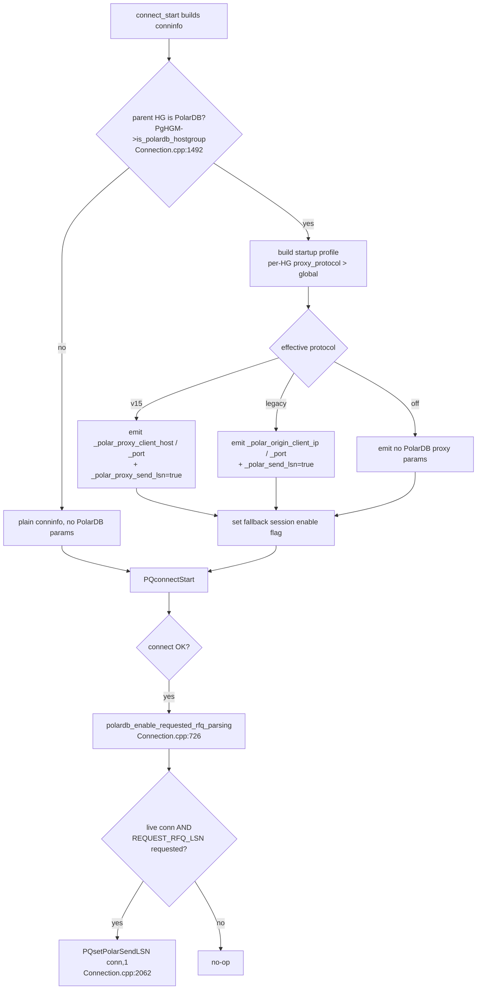
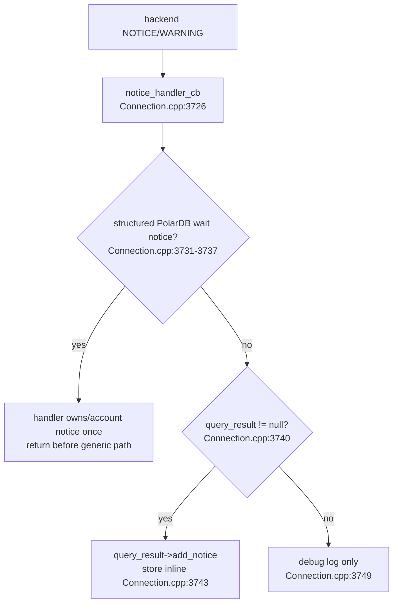
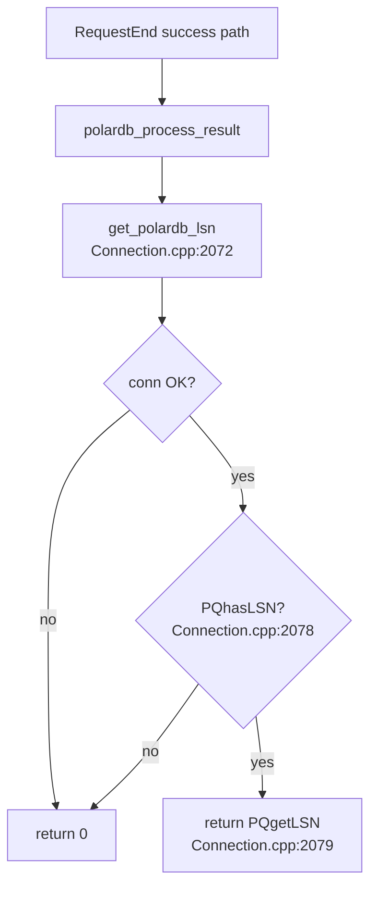

# 11 — Connection and libpq Integration

> Scope: how the backend-connection layer (`PgSQL_Connection`) carries the PolarDB LSN feature — startup profiles, proxy protocol parameters, fallback session activation on connect/attach, the ReadyForQuery (RFQ) LSN accessor, the notice receiver, the `dispatch_state` session-to-connection bridge, and the `WrapState` filter. | Audience: R/M/O/C | Status: stable | Prereqs: [10-SESSION-INTEGRATION.md](10-SESSION-INTEGRATION.md), [07-QUERY-WRAPPING.md](07-QUERY-WRAPPING.md), [08-WAIT-TIMEOUT-AND-NOTICES.md](08-WAIT-TIMEOUT-AND-NOTICES.md), [09-PUBLISH-AND-WRITE-TRACKING.md](09-PUBLISH-AND-WRITE-TRACKING.md), [02-BUILD-TOGGLE-AND-LIBPQ.md](02-BUILD-TOGGLE-AND-LIBPQ.md) | Verified against: this branch

---

## 1. Scope and status

This document covers the parts of the PolarDB read-your-writes (RYW) feature that live on the **backend-connection** layer, the class `PgSQL_Connection`. A `PgSQL_Connection` is one TCP connection from ProxySQL to a PostgreSQL/PolarDB backend server, wrapped around a libpq `PGconn`.

The connection layer does four PolarDB jobs:

1. **Request PolarDB RFQ payloads on the connection.** When the backend belongs to a PolarDB hostgroup, ProxySQL resolves a startup profile from per-HG/global `proxy_protocol`, emits the matching PolarDB proxy startup parameters, and records the profile on the connection.
2. **Read the LSN back with no extra query.** A pure accessor, `get_polardb_lsn()`, returns the LSN that libpq parsed from the most recent ReadyForQuery (RFQ) message.
3. **Filter the wrapped-read result.** A consistency read is sent as several `SET` statements glued in front of the user query. The connection layer silently drops the leading `SET` result sets and forwards only the user's result. It is the **sole owner** of that filtering.
4. **Capture the wait-timeout notice.** The libpq notice receiver always forwards backend notices to the PolarDB handler, so a best-effort wait-timeout WARNING is counted and re-queued even when the generic result object (`query_result`) has already been recycled and set to null.

PolarDB connection tracking, startup profiles, wait sends, and patched-libpq calls are controlled by `POLARDB_PROXY`. Generic extended-protocol ownership and error-boundary fixes remain shared by both builds. Off mode links vanilla libpq and has no PolarDB `W` behavior (see [02-BUILD-TOGGLE-AND-LIBPQ.md](02-BUILD-TOGGLE-AND-LIBPQ.md)).

**Status:** stable. Everything in this document is implemented and active in this branch.

### 1.1 Terms used in this document (defined once)

| Term | Plain meaning |
|------|---------------|
| **LSN** (Log Sequence Number) | A 64-bit number marking a position in PostgreSQL's write-ahead log (WAL). Bigger means newer. A replica that has replayed up to LSN X can serve any read whose data was written at or before X. |
| **RYW** (read-your-writes) | The guarantee that after a session writes, its own later reads see that write, even when the read goes to a replica. |
| **RFQ** (ReadyForQuery) | The PostgreSQL wire message a backend sends after each command to say "ready for the next query". A patched PolarDB backend appends its current LSN to this message. |
| **conninfo** | The libpq connection string (a space-separated list of `key=value` options) used to open a backend connection. |
| **startup parameter** | An option sent in the PostgreSQL startup packet at connect time. This implementation emits either v15 names (`_polar_proxy_client_host`, `_polar_proxy_client_port`, `_polar_proxy_send_lsn`) or legacy names (`_polar_origin_client_ip`, `_polar_origin_client_port`, `_polar_send_lsn`). |
| **startup profile** | Connection-local record of the protocol and `REQUEST_RFQ_*` bits ProxySQL requested. It is requested capability, not RFQ confirmation. |
| **GUC** | A PostgreSQL server setting changed with `SET name = value`. |
| **wrapped read** | A replica-eligible read that ProxySQL rewrites by prepending three `SET` statements (mode, timeout, wait-LSN) so the replica blocks until it has replayed past the session's last write LSN. |
| **wrapper SET** | One of those three prepended `SET` statements. Each returns its own result set the connection layer must drop. |
| **HG** (hostgroup) | A numbered group of backend servers in ProxySQL. A PolarDB pair has a writer HG (the primary) and a reader HG (replicas). |
| **pooled connection** | A backend connection reused from ProxySQL's connection pool. It does not run the connect path again. |

---

## 2. Overview — where the connection layer sits in the pipeline

The PolarDB feature has four integration hooks across the request/response cycle. The connection layer owns parts of **Hook 1** (connect/enable) and all of **Hook 3** (the wire-level wrap-state filter and the notice receiver). It also supplies the RFQ LSN accessor that **Hook 4** (`polardb_process_result`) reads. The session layer (see [10-SESSION-INTEGRATION.md](10-SESSION-INTEGRATION.md)) owns Hook 2 (routing) and drives Hooks 1 and 4.

```
                  PgSQL_Session                         PgSQL_Connection (this doc)
                  -------------                         --------------------------
client read  ─►  route pipeline (Hook 2)
                 polardb_execute: prepare wait,
                 snapshot user query
                       │
                 ASYNC_IDLE:
                 finalize_wait_timeout_injection
                 builds "SET;SET;SET;<query>"  ───────► dispatch_state snapshot
                 sets polardb_dispatch_wrapper_*        (ASYNC_IDLE, Connection.cpp:2545)
                                                              │
                                                        query_start():
                                                        begin(n) consumer  (2200)
                                                              │
                                                        backend runs 3 SETs + query
                                                              │
                                                        WIRE filter (Hook 3):
                                                        drop 3 SET results,        (859)
                                                        forward only user result
                                                              │
                                                        notice_handler_cb (Hook 3):
                                                        classify wait notice first (3731)
                       ◄──────────────────────────── user result + pending notice
                 RequestEnd success (Hook 4):
                 polardb_process_result reads ───────────────► get_polardb_lsn()  (2072)
                 the RFQ LSN                             (PQhasLSN / PQgetLSN)
```

Two things connect at the conninfo step (Hook 1): the conninfo may gain profile-driven PolarDB proxy startup parameters, and the session is marked PolarDB-enabled so the result-processing stage will run later. A successful startup only shows the server accepted the parameters; RFQ LSN is confirmed later when result RFQs actually carry LSN.

---

## 3. Functions and members — signature, responsibility, file:line

This section lists every PolarDB item the connection layer adds, in the order a request meets them. All declarations are in `include/PgSQL_Connection.h`; all definitions are in `lib/PgSQL_Connection.cpp`.

### 3.1 Public methods

| Member | Declared | Defined | Responsibility |
|--------|----------|---------|----------------|
| `void polardb_enable_requested_rfq_parsing()` | `PgSQL_Connection.h:1077` | `PgSQL_Connection.cpp:2057` | After a successful connect, enable only the RFQ payload parsers requested by the recorded startup profile. No-op without a live connection. |
| `uint64_t get_polardb_lsn()` | `PgSQL_Connection.h:1102` | `PgSQL_Connection.cpp:2072` | Return the LSN libpq cached from the last RFQ. Pure accessor; issues no SQL query. Returns 0 if the RFQ carried no LSN or there is no connection. |

### 3.2 Private method

| Member | Declared | Defined | Responsibility |
|--------|----------|---------|----------------|
| `PolarDB_StartupProfile polardb_build_startup_profile(unsigned int hid) const` | `PgSQL_Connection.h:1172` | `PgSQL_Connection.cpp:1814` | Resolve the effective startup protocol from per-HG `proxy_protocol` over global `pgsql-polardb_proxy_protocol`. |
| `bool polardb_append_startup_params(...)` | `PgSQL_Connection.h:1194` | `PgSQL_Connection.cpp:1963` | Append profile-driven PolarDB startup parameters. Fails connection creation early when an RFQ-requesting profile has no usable identity. |
| `PolarDB_StartupIdentity polardb_resolve_startup_identity(...) const` | `PgSQL_Connection.h:1226` | `PgSQL_Connection.cpp:1846` | Choose the identity source allowed by the configured mode. Returns `NONE` when no usable identity exists. |

### 3.3 The libpq notice receiver

| Member | Declared | Defined | Responsibility |
|--------|----------|---------|----------------|
| `static void notice_handler_cb(void* arg, const PGresult* result)` | `PgSQL_Connection.h:1152` | `PgSQL_Connection.cpp:3726` | libpq notice receiver. Registered in `query_start()` at `PgSQL_Connection.cpp:2225`. A recognized wait notice is owned once by the PolarDB handler; ordinary notices continue to generic result ownership. |

### 3.4 File-local helpers (in `lib/PgSQL_Connection.cpp`)

These two are file-static, not class members. They live only in the `.cpp`.

| Helper | Defined | Responsibility |
|--------|---------|----------------|
| `bool polardb_is_lsn_wait_timeout_result(const PGresult* result)` | `PgSQL_PolarDB_Notices.cpp` | Return true only when both `PG_DIAG_MESSAGE_DETAIL` equals `POLARDB_LSN_WAIT_TIMEOUT_DETAIL` and `PG_DIAG_SOURCE_FUNCTION` equals `polar_proxy_wait_for_lsn`. |
| `static void polardb_account_wrapper_set_error(PgSQL_Connection* conn, const PGresult* result, const char* msg)` | `PgSQL_Connection.cpp:182` | When a wrapper SET (or the user query after wrapper consumption) errors, decide whether it is a PolarDB wait timeout and, if so, account it; then mark the wrap-state state as failed so consumption stops. |

`polardb_handle_notice()` itself is **declared** in this file (`PgSQL_Connection.cpp:38`) but **defined** in `lib/PgSQL_PolarDB_Notices.cpp:225` (see [08-WAIT-TIMEOUT-AND-NOTICES.md](08-WAIT-TIMEOUT-AND-NOTICES.md)).

### 3.5 Persistent connection-local state

| Member | Type | Declared | Purpose |
|--------|------|----------|---------|
| `dispatch_state` | `PolarDB_Query_DispatchState { uint32_t wrapper_stmts; PolarDB_Query_WrapperKind wrapper_kind; }` | `PgSQL_Connection.h:701` (struct `:691`) | Per-dispatch handoff: how many wrapper SET results to skip and which wrapper kind. Snapshotted from the session at dispatch, consumed by `query_start()`. |
| `polardb_query_wrap_state` | `PolarDB_Query_WrapState` | `PgSQL_Connection.h:840` (struct `:778`) | Per-query countdown of wrapper result sets. Drops the leading SETs and forwards only the user result. `was_wrapped`/`stmt_failed` are sticky (survive consumption). |
| `polardb_startup_profile` | `PolarDB_StartupProfile` | `PgSQL_Connection.h` | Protocol and RFQ request bits requested when this backend connection was created. |

Both are **connection-confined**: a `PgSQL_Connection` is driven by exactly one worker thread at a time on the hot path, so there is no locking on either field. See [10-SESSION-INTEGRATION.md](10-SESSION-INTEGRATION.md) for the matching session-side fields, and `POLARDB_STRUCTURES.md` for the full field inventory.

---

## 4. Hook 1 — enabling PolarDB on the connection

Session activation is owned by routing, not by connection creation. The
connection and backend-attach paths also set the one-way session flag as
lifecycle fallbacks because pooled connections do not run the connect path.

### 4.1 conninfo: resolve startup profile and mark the session enabled (fresh connect)

When `connect_start()` builds the conninfo for a **client-backed** session connection, it checks whether the backend's hostgroup is a PolarDB hostgroup. If so, it builds a startup profile, appends the profile-driven PolarDB startup parameters, records that profile on the connection, and sets the session enable flag.

The check and the two actions are at `PgSQL_Connection.cpp:1491-1595`:

| Step | What it does | file:line |
|------|--------------|-----------|
| `is_polar = parent && PgHGM->is_polardb_hostgroup(parent->myhgc->hid)` | Ask the HostGroups Manager if this HG is a PolarDB HG. | `PgSQL_Connection.cpp:1492` |
| `append_polardb_startup_params(conninfo, profile, ...)` | Append profile-driven v15 or legacy startup params, or none for `off`. | `PgSQL_Connection.cpp` |
| `myds->sess->polardb_config.is_polardb_enabled = true` | Mark the session PolarDB-enabled so the response-path result-processing stage runs. | `PgSQL_Connection.cpp:1595` |

There is a second conninfo branch for **non-client** connections (monitor / internal) to a PolarDB hostgroup. It uses the same profile builder. If the profile requests RFQ LSN, a configured fallback identity is normally required because there is no real client endpoint. It does **not** set any session enable flag, because there is no client session yet:

```
PgSQL_Connection.cpp:1633-1637
  if (!(myds && myds->sess && myds->sess->client_myds) &&
      parent && PgHGM->is_polardb_hostgroup(parent->myhgc->hid)) {
      append_polardb_startup_params(conninfo, polardb_startup_profile, parent->myhgc->hid);
  }
```

### 4.2 `append_polardb_startup_params` — what it actually emits

The effective protocol comes from per-HG `pgsql_replication_hostgroups.proxy_protocol` when it is not `default`, otherwise from global `pgsql-polardb_proxy_protocol`.

| Protocol | Emitted parameters |
|---|---|
| `v15` | `_polar_proxy_client_host=<host>`, `_polar_proxy_client_port=<port>`, `_polar_proxy_send_lsn=true`, `_polar_proxy_send_xact=true` |
| `v15_wait` | v15 fields plus `_pq_.polar_proxy_wait_v1=1` |
| `legacy` | `_polar_origin_client_ip=<host>`, `_polar_origin_client_port=<port>`, `_polar_send_lsn=true`, `_polar_send_xact=true` |
| `off` | no PolarDB proxy startup parameters |

Notes:

- These must be **top-level** connection parameters, not inside the libpq `options` block, so PolarDB's `ProcessStartupPacket()` reads them. The conninfo `options` block is closed (the trailing `'`) at `PgSQL_Connection.cpp:1578`, before these parameters are appended at `:1580+`.
- The function is called only for PolarDB hostgroups. A vanilla PostgreSQL backend would reject an unknown startup option, so checking the call keeps non-PolarDB connections safe (`PgSQL_Connection.cpp:1584`).
- The identity is selected from the client endpoint, then listener/proxy endpoint, then `pgsql-polardb_proxy_identity_host` plus `pgsql-polardb_proxy_identity_port`.
- RFQ-requesting profiles require valid identity. Empty, invalid, wildcard, or unset identity fails connection creation before `PQconnectStart()`. The configured fallback is validated on `SET`: host must be empty or a non-wildcard IP literal, and a completed fallback pair requires port `1..65535`.
- The request bit names are `REQUEST_RFQ_LSN`, `REQUEST_RFQ_CSN`, and `REQUEST_RFQ_XID`. Current `v15` and `legacy` profiles request `REQUEST_RFQ_LSN` and `REQUEST_RFQ_XID`; `off` requests none. XID is requested at startup for capability, while `txn_split_enabled` controls whether result processing uses the XID evidence for split routing.

### 4.3 `polardb_enable_requested_rfq_parsing` — turn on requested libpq RFQ parsing

After a successful connect, the connection calls `polardb_enable_requested_rfq_parsing()`:

```
PgSQL_Connection.cpp:723-729
  #if POLARDB_PROXY
      polardb_enable_requested_rfq_parsing();
  #endif
```

The function itself checks the live connection and then enables each parser whose
startup bit was requested:

| Step | Behavior | file:line |
|------|----------|-----------|
| check: live connection | Return early if `pgsql_conn` is null or `PQstatus(...) != CONNECTION_OK`. | `PgSQL_Connection.cpp:2058-2060` |
| LSN action | If `polardb_startup_profile.requests_rfq_lsn()`, call `PQsetPolarSendLSN(pgsql_conn, 1)`. | `PgSQL_Connection.cpp:2061-2063` |
| XID action | If `polardb_startup_profile.requests_rfq_xid()`, call `PQsetPolarSendXact(pgsql_conn, 1)`. | `PgSQL_Connection.cpp:2064-2066` |

Citation precision: `PQsetPolarSendLSN` and `PQsetPolarSendXact` are **defined** in the libpq patch. Their connection call sites are centralized in `polardb_enable_requested_rfq_parsing()`.

This is still not capability confirmation. It only tells patched libpq to parse RFQ payloads if the backend later sends them. Missing RFQ LSN is handled in result processing and routing policy; missing transaction-split RFQ metadata simply leaves the observed split state primary-only.

### 4.4 Route activation and pooled/fresh fallbacks

A pooled backend connection is attached to a session **without** running
`connect_start()`, so connection setup alone cannot own activation. Normal
automatic and manual PolarDB routing call
`polardb_activate_session_for_request()` after binding the current writer scope.
That call is the correctness boundary: on the first activation it also marks
the write position unknown, because a writer request might have completed
before the worker observed the topology publication.

The backend lifecycle keeps two fallback sites for pooled and newly created
connections:

| Path | Action | file:line |
|------|--------|-----------|
| Pooled (got a pooled connection) | `polardb_config.is_polardb_enabled = true` | `PgSQL_Session.cpp:6302` |
| Fresh (no pooled connection; will create new) | `polardb_config.is_polardb_enabled = true` | `PgSQL_Session.cpp:6316` |

Net effect: routing activates early enough to preserve correctness, while an
unusual lifecycle entry cannot bypass result processing. The flag is **never
reset to false** during the session; it only ever flips on. Full detail is in
[10-SESSION-INTEGRATION.md](10-SESSION-INTEGRATION.md).

---

## 5. Hook 3 — the wrap-state filter and the notice receiver

This is the connection layer's largest PolarDB responsibility. A consistency read arrives at the backend as one simple-query packet containing three wrapper SETs followed by the user query (built by `finalize_wait_timeout_injection`, see [07-QUERY-WRAPPING.md](07-QUERY-WRAPPING.md)). The backend returns one result set per statement, in order:

```
[ SET ok ][ SET ok ][ SET ok ][ user SELECT result ]
  drop      drop      drop       forward to client
```

The connection layer must drop the first three and forward only the fourth. It is the **sole owner** of this filtering; the session and client only ever see the user result.

### 5.1 The dispatch_state bridge (session → connection, same thread)

The count of SETs to drop travels from the session to the connection in two hops, both on the same worker thread, so no locking is needed.

**Hop 1 — snapshot at dispatch (`ASYNC_IDLE`).** When the query is submitted, the connection snapshots the session's handoff fields into its own `dispatch_state` and zeroes the session fields so they cannot be reused:

```
PgSQL_Connection.cpp:2545-2550  (inside the ASYNC_IDLE case of async_query)
  dispatch_state.reset();
  if (!extended_query_info && myds && myds->sess &&
      myds->sess->polardb_query.dispatch_wrapper_stmts > 0) {
      dispatch_state.wrapper_stmts = myds->sess->polardb_query.dispatch_wrapper_stmts;
      dispatch_state.wrapper_kind  = myds->sess->polardb_query.dispatch_wrapper_kind;
      myds->sess->polardb_query.reset_dispatch_wrapper();
  }
```

Two design points:

- Only **simple queries** receive the SQL wrapper and wrapper-result count. Extended Parse/Bind/Execute waits use the negotiated `W` message and connection-local extended-wait state instead, so the SQL snapshot remains intentionally skipped.
- The session fields are zeroed here so a later query on the same session cannot accidentally re-skip results.

**Hop 2 — consume at `query_start()`.** When the query starts, the connection turns the snapshot into the per-query countdown and then resets the snapshot:

```
PgSQL_Connection.cpp:2200-2222
  polardb_query_wrap_state.clear();
  if (dispatch_state.wrapper_stmts > 0) {
      polardb_query_wrap_state.begin(dispatch_state.wrapper_stmts,
                                         dispatch_state.wrapper_kind);
      ...
  }
  ...
  dispatch_state.reset();   // Consumed — prevent stale reuse
```

`begin(n, kind)` (defined inline in `PgSQL_Connection.h`) sets the wrapper count and kind. For an ordinary, non-wrapped query, `wrapper_stmts` is 0, so `begin()` is never called and `polardb_query_wrap_state` stays empty — the result path then skips the filter entirely.

`dispatch_state` is also reset on connection cleanup (`PgSQL_Connection.cpp:4117`), and `polardb_query_wrap_state` is cleared on the same cleanup (`:4118`), so a connection returned to the pool carries no stale wrapper state.

### 5.2 The leading-skip consume loop (the wire filter)

The actual filtering runs in the result loop of `PgSQL_Connection::handler()`, in the `ASYNC_USE_RESULT_CONT` state. For each backend result, while there are still wrapper results pending and we are at the simple-query end state:

```
PgSQL_Connection.cpp:775-819
  if (polardb_query_wrap_state.has_pending() &&
      fetch_result_end_st == ASYNC_QUERY_END) {
      if (exec_status_type == PGRES_COMMAND_OK ||
          exec_status_type == PGRES_EMPTY_QUERY) {
          polardb_query_wrap_state.stmt_pending--;          // one SET done
          // recycle this result's buffer, null query_result, fetch next
          if (query_result) {
              if (query_result_reuse) delete query_result_reuse;
              query_result_reuse = query_result;
              query_result = nullptr;
          }
          NEXT_IMMEDIATE(ASYNC_USE_RESULT_START);                // next result
      } else if (exec_status_type == PGRES_FATAL_ERROR ||
                 exec_status_type == PGRES_NONFATAL_ERROR ||
                 exec_status_type == PGRES_BAD_RESPONSE) {
          // a wrapper SET errored (e.g. strict-mode wait timeout as ERROR)
          polardb_account_wrapper_set_error(this, result.get(),
                                            PQresultErrorMessage(result.get()));
          // fall through: let the error flow to the client
      }
  }
```

Two branches:

| Result status | Meaning | Connection action | file:line |
|---------------|---------|-------------------|-----------|
| `PGRES_COMMAND_OK` or `PGRES_EMPTY_QUERY` | A wrapper SET finished cleanly. | Decrement `stmt_pending`, recycle the result buffer into `query_result_reuse`, null `query_result`, and immediately fetch the next result. The dropped SET result never reaches the client. | `PgSQL_Connection.cpp:777-798` |
| `PGRES_FATAL_ERROR`, `PGRES_NONFATAL_ERROR`, or `PGRES_BAD_RESPONSE` | A wrapper SET itself errored (for example, a strict-mode wait timeout surfaces as an ERROR). | Call `polardb_account_wrapper_set_error()` (accounts a confirmed timeout, marks the connection WrapState failed), then **stop** consuming so the error flows to the client through the normal path below. | `PgSQL_Connection.cpp:799-818` |

The condition `has_pending()` (`stmt_pending > 0`, defined in `PgSQL_Connection.h:787`) plus the `fetch_result_end_st == ASYNC_QUERY_END` check at `PgSQL_Connection.cpp:776` mean the filter only runs while wrapper SETs are still pending and only for simple queries (the only thing that can be wrapped). After `stmt_pending` reaches 0, the next result — the user query — falls through to the normal result-forwarding code and reaches the client.

### 5.3 The other two error-account sites

A wrapper SET error can also surface outside the consume loop, on paths where libpq reports the connection as already in error. Both call the same helper so a confirmed timeout is still accounted:

| Site | When | file:line |
|------|------|-----------|
| `ASYNC_USE_RESULT_START`, error present before fetching | The fetch start sees an error already set; account it before ending the result. | `PgSQL_Connection.cpp:734` |
| `ASYNC_USE_RESULT_CONT`, FATAL / bad-response default branch | A FATAL/non-fatal/bad result after the error is set from the result; account it. | `PgSQL_Connection.cpp:930` |

There is also a trace-only block in the `ASYNC_QUERY_START`/`ASYNC_QUERY_CONT` early-error paths (`PgSQL_Connection.cpp:692-697` and `:712-719`); those only log (under `POLARDB_DEBUG`) and do not account anything.

### 5.4 `polardb_account_wrapper_set_error` — the accounting decision

Defined at `PgSQL_Connection.cpp:182`. It is the single place that decides whether a wrapper-path error is a PolarDB wait timeout to charge. Its logic, step by step:

| Step | Behavior | file:line |
|------|----------|-----------|
| check: was wrapped | If there is no connection or the connection's result was not wrapped (`!was_wrapped`), do nothing. | `PgSQL_Connection.cpp:186-194` |
| check: wait active | If there is no session or the session's wait is not active (`!polardb_wait_active()`), just mark the connection WrapState failed and return (no accounting). | `PgSQL_Connection.cpp:214-231` |
| Classify | `is_lsn_timeout = polardb_is_lsn_wait_timeout_result(result)` — check the structured marker. | `PgSQL_Connection.cpp:205-206` |
| Classify for retry | If `is_lsn_timeout`, set the query wait state's timeout flag. The session failure path uses this flag to decide whether the original read can be retried on the writer. | `PgSQL_Connection.cpp:246-248` |
| Account | If `is_lsn_timeout`, call `sess->polardb_account_wait_timeout("result-error")`. | `PgSQL_Connection.cpp:249-251` |
| Mark failed | If still consuming a wrapper SET, mark the connection WrapState failed (stops consumption). | `PgSQL_Connection.cpp:253-256` |

The comment at `PgSQL_Connection.cpp:241-245` explains the "wait active" condition: in strict mode the timeout can surface after all wrapper SET results were already consumed (the wait was started by `SET polar_xact_split_wait_lsn`, then the backend raises ERROR before running the user SELECT). Charging only the structured-marker event while the wait is active prevents an ordinary user-query error — whose text might coincidentally look like a timeout — from being miscounted. The timeout flag is separate from accounting because accounting is idempotent and may consume the latency timer before the session's `rc == -1` branch runs. The counters touched by `polardb_account_wait_timeout()` and by retry are documented in [08-WAIT-TIMEOUT-AND-NOTICES.md](08-WAIT-TIMEOUT-AND-NOTICES.md) and [12-THREADVARS-AND-OBSERVABILITY.md](12-THREADVARS-AND-OBSERVABILITY.md).

### 5.5 The structured timeout marker (no text matching)

ProxySQL does **not** match human-readable WARNING/ERROR text, because user SQL could fabricate it. It requires two exact PostgreSQL diagnostics:

```
include/PgSQL_PolarDB.h:186-187
  static constexpr const char* POLARDB_LSN_WAIT_TIMEOUT_DETAIL =
      "polar_proxy_lsn_wait_timeout";
  static constexpr const char* POLARDB_LSN_WAIT_TIMEOUT_SOURCE_FUNCTION =
      "polar_proxy_wait_for_lsn";
```

The connection-side check is `polardb_is_lsn_wait_timeout_result()`:

```
PgSQL_PolarDB_Notices.cpp
  const char* detail = result ? PQresultErrorField(result, PG_DIAG_MESSAGE_DETAIL) : nullptr;
  const char* source = result ? PQresultErrorField(result, PG_DIAG_SOURCE_FUNCTION) : nullptr;
  return detail && source &&
      strcmp(detail, POLARDB_LSN_WAIT_TIMEOUT_DETAIL) == 0 &&
      strcmp(source, POLARDB_LSN_WAIT_TIMEOUT_SOURCE_FUNCTION) == 0;
```

The pair separates a real backend wait timeout from ordinary SQLSTATE 57014 cancellation and from user-generated text or DETAIL fields. It is classification evidence on a trusted proxy/backend connection, not authentication. The same helper is used by ERROR and WARNING handling. See [08-WAIT-TIMEOUT-AND-NOTICES.md](08-WAIT-TIMEOUT-AND-NOTICES.md).

### 5.6 The notice receiver — inline `add_notice` vs `pending_notices`

A best-effort wait timeout arrives as a backend WARNING/NOTICE **while the wrapped SELECT obtains its snapshot**. By that point the leading SET results may already have been consumed: the connection recycled their result buffers and set its generic `query_result` pointer to null (see §5.2). So `query_result` can be null when the notice arrives. The capture path must still work in that case.

libpq's notice receiver is `notice_handler_cb()`, registered per query in `query_start()` (`PgSQL_Connection.cpp:2225`). Its body starts at `PgSQL_Connection.cpp:3726`:

```
PgSQL_Connection.cpp:3731-3753
#if POLARDB_PROXY
  if (polardb_handle_lsn_wait_timeout_notice(conn, result)) {
      return;
  }
#endif

  if (conn->query_result != nullptr) {
      // Generic upstream path: store the notice inline in the active result so
      // its NoticeResponse is forwarded with that result and its bytes accounted.
      const unsigned int bytes_recv = conn->query_result->add_notice(result);
      conn->update_bytes_recv(bytes_recv);
  } else {
      // No active generic result (for example during RESET SESSION).
      proxy_debug(...);   // debug log only
  }
```

Two paths, and why there is no client duplicate:

| Situation | What `notice_handler_cb` does | Where the NoticeResponse goes to the client |
|-----------|------------------------------|---------------------------------------------|
| Structured PolarDB wait-timeout marker | `polardb_handle_lsn_wait_timeout_notice()` owns accounting and either attaches the notice to the client-visible result or queues it for the session-owned result boundary, then returns true. | The early return prevents generic `add_notice()` from duplicating it. |
| Ordinary notice with an active `query_result` | The PolarDB classifier declines it; `query_result->add_notice(result)` stores it inline. | The notice is forwarded with that result. |
| Ordinary notice without an active `query_result` | The PolarDB classifier declines it and the generic path only logs at debug level. | No result owns the notice, matching the existing out-of-result behavior. |

The key is explicit ownership before the generic branch: a recognized wait notice returns immediately, while a declined notice follows normal libpq result ownership. This keeps hidden implicit-Parse results, visible Execute results, and SQL-wrapper results from double-publishing or dropping a warning. The session-side notice queue and forward-once flush are covered in [08-WAIT-TIMEOUT-AND-NOTICES.md](08-WAIT-TIMEOUT-AND-NOTICES.md) and [10-SESSION-INTEGRATION.md](10-SESSION-INTEGRATION.md).

`add_notice` itself is a method of `PgSQL_Query_Result` (declared `include/PgSQL_Protocol.h:517`); it returns the byte count so the connection can update its received-bytes statistic.

---

## 6. Hook 4 (read side) — `get_polardb_lsn`, the RFQ-only accessor

The result-processing stage (Hook 4) needs the backend's WAL LSN after a successful query. It reads it through `get_polardb_lsn()`, which is **RFQ-only**: it returns the LSN libpq already parsed from the most recent ReadyForQuery message and issues **no** SQL query.

```
PgSQL_Connection.cpp:2072-2082
  uint64_t PgSQL_Connection::get_polardb_lsn() {
      if (!pgsql_conn || PQstatus(pgsql_conn) != CONNECTION_OK) {
          return 0;
      }
      if (PQhasLSN(pgsql_conn)) {           // did the last RFQ carry an LSN?
          return PQgetLSN(pgsql_conn);      // 64-bit LSN
      }
      return 0;                             // RFQ carried no LSN
  }
```

| Property | Detail | file:line |
|----------|--------|-----------|
| No round-trip | Calls only the native libpq accessors `PQhasLSN()` / `PQgetLSN()`. Safe on the hot request/result-processing path. | `PgSQL_Connection.cpp:2078-2079` |
| Returns 0 when absent | No connection, connection not OK, or the RFQ carried no LSN -> returns 0. | `PgSQL_Connection.cpp:2073-2075`, `:2082` |
| Enabled by | `polardb_enable_requested_rfq_parsing()` calls `PQsetPolarSendLSN(conn,1)` only when the startup profile requested RFQ LSN. | `PgSQL_Connection.cpp:2057-2063` |

The caller is `polardb_process_result()` (defined in `lib/PgSQL_PolarDB_Flow.cpp`), reached from `PgSQL_Session::RequestEnd()` on the success path. Everything the result-processing stage does with the returned LSN — advancing session write/observed LSN state, maintaining missing-LSN flags, and refreshing the per-server cache — is documented in [09-PUBLISH-AND-WRITE-TRACKING.md](09-PUBLISH-AND-WRITE-TRACKING.md). The deliberate "RFQ-only, never SQL" rule keeps all SQL-based LSN probing in the monitor; see [05-MONITOR-AND-HGM-LSN-STATE.md](05-MONITOR-AND-HGM-LSN-STATE.md).

> **The LSN a client reads is not always the raw backend LSN.** `get_polardb_lsn()` above reads what the *backend* reported on ProxySQL's connection to it. The LSN ProxySQL then forwards to an LSN-aware *client* — the value that client's patched libpq exposes through `PQhasLSN()` / `PQgetLSN()` — is chosen separately by `PgSQL_Session::polardb_client_ready_lsn()`. It may be **raised** above the backend value to a writer-confirmed session target or a successful wait target, so the client's LSN stream never moves backwards when consecutive queries use different backend connections. That behavior and the `PolarDB_Client_RFQ_LSN_Raised_{To_Target,By_Writer,By_Wait}` counters are documented in [09-PUBLISH-AND-WRITE-TRACKING.md §6](09-PUBLISH-AND-WRITE-TRACKING.md).

---

## 7. The libpq patch surface this layer depends on

The connection layer depends on the PolarDB-specific libpq patch: active LSN functions, xact RFQ functions, and accepted startup parameters. None exist in stock libpq; they are all added by the patch `deps/postgresql/polardb_libpq.patch`, which is applied only when `POLARDB_PROXY=1` (see [02-BUILD-TOGGLE-AND-LIBPQ.md](02-BUILD-TOGGLE-AND-LIBPQ.md) for the full patch review). This connection layer consumes LSN functions for consistency and xact RFQ functions for transaction-split observation.

| libpq item | Kind | Used by connection layer at | What it does |
|------------|------|------------------------------|--------------|
| `PQsetPolarSendLSN(PGconn*, int enable)` | function | `PgSQL_Connection.cpp:2062` | Turn on the runtime flag that makes libpq's RFQ parser look for an appended LSN. |
| `PQhasLSN(const PGconn*)` | function | `PgSQL_Connection.cpp:2078` | Was an LSN present in the last RFQ? |
| `PQgetLSN(const PGconn*)` | function | `PgSQL_Connection.cpp:2079` | Return the LSN captured from the last RFQ (0 if none). |
| `PQgetXactSplitXids` / `PQisXactSplittable` / `PQisXactWalPending` / `PQsetPolarSendXact` | functions | connection/result processing, planner inputs, split-read dispatch | Request and read transaction-split RFQ evidence; the planner may name a split route, and execution can take a compatible replica connection from the pool for that read. |
| `_polar_send_lsn` / `_polar_proxy_send_lsn` | startup parameter | emitted according to the resolved startup profile | Ask the backend to append its WAL LSN to every RFQ. |
| `_polar_send_xact` / `_polar_proxy_send_xact` | startup parameter | emitted for non-`off` PolarDB profiles | Ask the backend to append transaction-split metadata to RFQ; result processing observes it only when `txn_split_enabled=1`, and the planner can recognize split-readable state. |

### 7.1 Accepted startup parameters and emitted subset

The patch accepts more parameters than this tree emits. This implementation emits the LSN, XID, and client-identity parameters for the selected proxy protocol, and leaves cancel-routing / SSL metadata unused.

| Capability accepted by the patch | Emitted by this tree? | Note |
|----------------------------------|-----------------------|------|
| `_polar_send_lsn` / `_polar_origin_client_ip` / `_polar_origin_client_port` (legacy names) | **yes, when effective protocol is `legacy`** | Legacy startup dialect. |
| `_polar_proxy_send_lsn` / `_polar_proxy_client_host` / `_polar_proxy_client_port` (v15 names) | **yes, when effective protocol is `v15`** | Default startup dialect. |
| `_polar_send_xact` / `_polar_proxy_send_xact` | **yes, when effective protocol is `legacy` or `v15`** | Request transaction-split RFQ evidence at startup; `txn_split_enabled` decides whether result processing observes it for split routing. |
| `_polar_proxy_session_id` / `_polar_proxy_cancel_key` | no | Cancel-routing metadata; not used here. |
| `_polar_proxy_use_ssl` / `_polar_proxy_ssl_version` / `_polar_proxy_ssl_cipher_name` | no | SSL passthrough metadata; not used here. |

The patch registers the legacy names, the v15 names, xact RFQ names, cancel metadata, SSL metadata, the three LSN functions (`PQgetLSN`, `PQhasLSN`, `PQsetPolarSendLSN`), and the four xact functions.

**Not present at all in this tree's patch: CSN.** The commit-sequence-number (CSN) parameter `_polar_send_csn` and the functions `PQgetCSN` / `PQhasCSN` are a **future** feature and are **not** in the final-tree patch. The final-tree patch `deps/postgresql/polardb_libpq.patch` contains no CSN block; that block exists only in the full implementation's copy of the patch (full implementation). CSN is also experimental: it needs PolarDB backend support, it applies only in global-consistency mode, and its wait behavior is not reliably verified. See §9 and [18-FUTURE-CSN-DESIGN.md](18-FUTURE-CSN-DESIGN.md).

This implementation has no session-side mirror fields for `_polar_proxy_session_id` /
`_polar_proxy_cancel_key`. Those accepted-but-unused params are reserved for a
future PolarDB15 cancel-session extension.

---

## 8. Notes for reviewers (subtleties and gotchas)

- **The connection layer is the sole owner of `WrapState` filtering.** The session and client never see the dropped SET results. If a future change moved this filtering elsewhere, the count must stay consistent with the count copied through `dispatch_state` (`PgSQL_Connection.cpp:2545-2550`).
- **The filter is bounded by `stmt_pending` and the simple-query end state.** The `consuming_wrapper_set() && fetch_result_end_st == ASYNC_QUERY_END` gate (`PgSQL_Connection.cpp:859-860`) means a stray extra result after `stmt_pending` reaches 0 is **not** dropped. The wrap point only ever prepends, so this is safe today.
- **`get_polardb_lsn()` is intentionally side-effect-free.** It never issues SQL. This is what makes it safe to call on the result-processing hot path. Any future LSN probe that needs SQL must go in the monitor, not here.
- **Enable is one-way and multi-sourced.** Route-time activation is primary and
  marks the first writer position unknown; connect and backend-attach sites are
  lifecycle fallbacks. The flag is never cleared.
- **Notice ownership is selected before the generic path.** A recognized wait-timeout notice is handled once and returns; ordinary notices use `query_result->add_notice()` when a result exists (`PgSQL_Connection.cpp:3731-3749`).
- **Two-field timeout provenance, not text.** Classification requires the exact DETAIL token and `PG_DIAG_SOURCE_FUNCTION == "polar_proxy_wait_for_lsn"`. Marker-less SQLSTATE 57014 remains cancellation/statement-timeout ownership and is never replayed on the writer.
- **Both wrap-state and dispatch state are cleared on cleanup.** `PgSQL_Connection.cpp:4117-4118` resets `dispatch_state` and clears `polardb_query_wrap_state` so a connection returning to the pool carries no stale wrapper state into the next session.

---

## 9. Status and deferred items

### 9.1 Implemented in this branch

| Capability | Status |
|------------|--------|
| Profile-driven startup params (`v15`, `legacy`, `off`) | implemented |
| Connection-local `polardb_startup_profile` with `REQUEST_RFQ_LSN` controlling | implemented |
| Route-time session activation with fresh-connect and backend-attach fallbacks | implemented (`polardb_activate_session_for_request`) |
| `polardb_enable_requested_rfq_parsing` / `PQsetPolarSendLSN` | implemented (`PgSQL_Connection.cpp:2057`, `:2062`) |
| `get_polardb_lsn` RFQ-only accessor | implemented (`PgSQL_Connection.cpp:2072`) |
| Wrap-state filter (drop N SETs, forward user result) | implemented (`PgSQL_Connection.cpp:851-918`) |
| Wrapper-error accounting via structured marker | implemented (`PgSQL_Connection.cpp:182`, `:250`) |
| Notice receiver ownership through `polardb_handle_lsn_wait_timeout_notice` | implemented (`PgSQL_Connection.cpp:3726-3754`) |
| `dispatch_state` session→connection bridge | implemented (`PgSQL_Connection.cpp:2545-2550`, `:2200-2222`) |

### 9.2 Deferred / not present in this branch

These belong to future features (see [15-LIMITATIONS-AND-ROADMAP.md](15-LIMITATIONS-AND-ROADMAP.md) and the future-design docs):

- **CSN over the connection layer.** `_polar_send_csn`, `PQgetCSN`/`PQhasCSN`, and `get_polardb_csn()` are **not** present here. They are also **not** in this tree's libpq patch: the final-tree patch `deps/postgresql/polardb_libpq.patch` has no CSN block; the CSN libpq block lives only in the full implementation's patch (full implementation). CSN is a future and experimental feature: it requires PolarDB backend support, it applies only in global-consistency mode, and its wait behavior is not reliably verified. See [18-FUTURE-CSN-DESIGN.md](18-FUTURE-CSN-DESIGN.md). (CSN is experimental throughout — treat any CSN reference as future/unverified.)
- **Cancel and SSL metadata parameters.** Accepted by the patch but not emitted here (§7.1).
- **No session-side cancel mirror fields.** `_polar_proxy_session_id` and
  `_polar_proxy_cancel_key` are accepted by the patch but ProxySQL does not emit
  them and keeps no session-side state for them in this implementation.
- **Trailing-skip support.** The wrap-state filter has no counter for a SET *after* the user query (`PgSQL_Connection.h:734-736`); not needed today because the wrap only prepends.

---

## Appendix: Mermaid diagrams

### A. Connection fallback enable and post-connect LSN parsing



### B. Hook 3 — dispatch_state bridge and the wrap-state filter

```mermaid
flowchart TD
  S[session finalize_wait_timeout_injection<br/>sets polardb_query.dispatch_wrapper_stmts=3] --> A{ASYNC_IDLE, simple query?<br/>Connection.cpp:2546}
  A -- yes --> B[snapshot into dispatch_state<br/>reset session handoff<br/>Connection.cpp:2548-2550]
  A -- no/extended --> Z[no snapshot]
  B --> C[query_start: begin n,kind<br/>Connection.cpp:2200-2203]
  C --> D[backend runs 3 SETs + user query]
  D --> E{consuming wrapper SET AND<br/>simple-query end? Connection.cpp:859]
  E -- COMMAND_OK / EMPTY_QUERY --> F[stmt_pending--, recycle buffer,<br/>fetch next Connection.cpp:861-906]
  F --> E
  E -- error status --> G[polardb_handle_wrapper_set_error<br/>stop consuming Connection.cpp:907-918]
  E -- pending==0 --> H[forward user result to client]
  G --> H
```

### C. Hook 3 — notice receiver (inline vs pending_notices, no duplicate)



### D. Hook 4 (read side) — RFQ-only LSN accessor



---

Verified against this branch.
