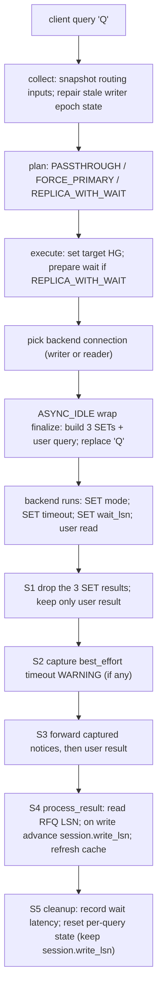
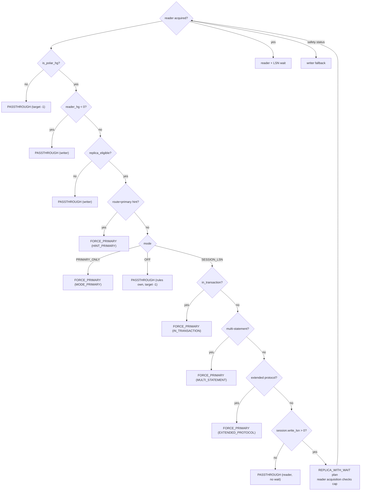
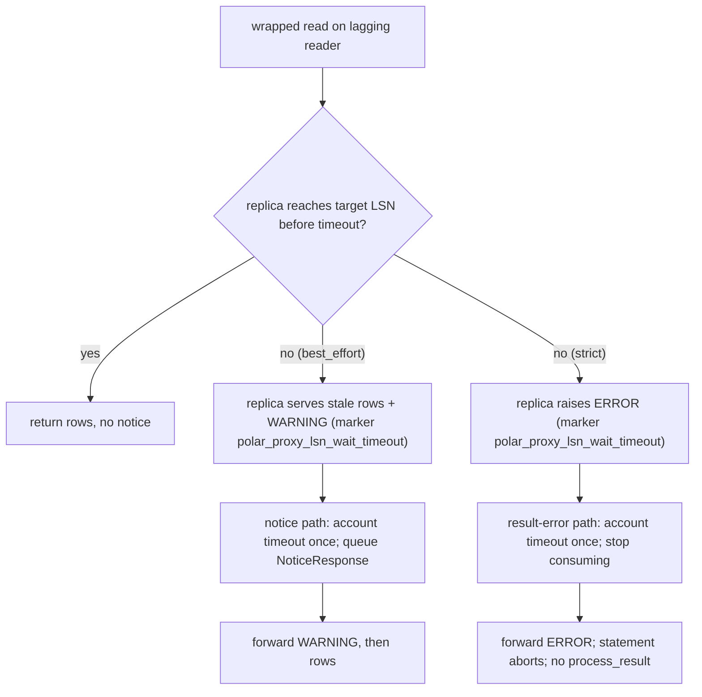

# 13 — Query Lifecycle and Worked Traces

> Scope: the full request/response lifecycle of one PostgreSQL query through the PolarDB LSN-only read-your-writes feature, shown first as a file-agnostic logical-stage pipeline, then as concrete request and response stages with file:line, then as six worked traces with the exact GUCs emitted and the session state before and after each stage. | Audience: R/M/O/C | Status: stable | Prereqs: [06-ROUTING-PIPELINE.md](06-ROUTING-PIPELINE.md), [07-QUERY-WRAPPING.md](07-QUERY-WRAPPING.md), [08-WAIT-TIMEOUT-AND-NOTICES.md](08-WAIT-TIMEOUT-AND-NOTICES.md), [09-PUBLISH-AND-WRITE-TRACKING.md](09-PUBLISH-AND-WRITE-TRACKING.md), [10-SESSION-INTEGRATION.md](10-SESSION-INTEGRATION.md), [11-CONNECTION-AND-LIBPQ.md](11-CONNECTION-AND-LIBPQ.md) | Verified against: this branch

---

## 1. What this document is

This document follows a single PostgreSQL query from the moment ProxySQL reads it off the client socket to the moment ProxySQL has finished replying. It does this three ways, from most abstract to most concrete:

1. **The logical-stage pipeline** (section 3): the stages a query passes through, named without reference to any file. This is the mental model.
2. **The request and response stages with file:line** (sections 4 and 5): the same stages, mapped to the exact functions and lines of this implementation.
3. **Six worked traces** (section 6): canonical real scenarios. Each trace shows the SQL ProxySQL actually sends to the backend (including the `SET` statements it injects), and the session state fields before and after each stage. The worked traces are the part you cannot get from reading the code top-to-bottom, because they show how the per-query state and the per-session state interact over time.

### 1.1 Terms used in this document

These terms are defined once here and used the same way throughout. The project glossary in `README.md` is the authority for this documentation set; this is a working subset.

| Term | Plain definition |
|------|------------------|
| PolarDB | An Alibaba PostgreSQL-compatible database with one primary (writer) node and read replicas. |
| LSN (Log Sequence Number) | A 64-bit position in PostgreSQL's write-ahead log (WAL). A larger LSN means "more recent". A replica that has replayed up to LSN X can serve any read whose data was committed at or before X. |
| RYW (read-your-writes) | The guarantee that after a session writes data, its own later reads see that write, even when the read is sent to a replica. |
| RFQ (ReadyForQuery) | The PostgreSQL wire message a backend sends after each command to say "ready for the next query". With the PolarDB libpq patch, the backend appends its current WAL LSN to this message, so ProxySQL learns the LSN with no extra query. |
| Hostgroup (HG) | A numbered ProxySQL group of backend servers. A PolarDB pair has a writer hostgroup (the primary) and a reader hostgroup (the replicas). "writer" and "primary" mean the same thing; "reader" and "replica" mean the same thing. |
| GUC | A PostgreSQL runtime setting changed with `SET name = value`. PolarDB adds `polar_consistency_mode`, `polar_proxy_wait_timeout_ms`, and `polar_xact_split_wait_lsn`. |
| Wait wrapper / wrapped read | A replica-eligible read that ProxySQL prefixes with three `SET` statements so the replica blocks until it has replayed past the session's last write LSN before answering. The client never sees the change. |
| Consistency mode | The per-query routing policy. In this feature the values are `OFF` (no PolarDB routing), `SESSION_LSN` (wait on the session's write LSN before a replica read), and `PRIMARY_ONLY` (force all reads to the writer). |
| Safe writer fallback | The design rule: when any precondition for a safe replica read is missing or uncertain, route to the writer instead, because the writer is always consistent. |

The whole feature compiles only when the build flag `POLARDB_PROXY` is set. When it is `0`, every PolarDB hook compiles out and ProxySQL behaves like upstream. All file:line references below are inside `#if POLARDB_PROXY` blocks.

---

## 2. The four pipeline stages, in one picture

The PolarDB feature adds four stages to the normal ProxySQL query path. All four are methods of `PgSQL_Session`.

| Stage | Function | File:line | When it runs | Side effects? |
|-------|----------|-----------|--------------|---------------|
| collect | `polardb_collect()` | `lib/PgSQL_PolarDB_Flow.cpp:468` | request path, in the `'Q'` handler | Usually reads inputs; clears stale session LSN targets/flags if the writer group or epoch changed |
| plan | `polardb_plan()` | `lib/PgSQL_PolarDB_Flow.cpp:694` | request path, right after collect | None (may attach lag-cap inputs to the per-query reader plan) |
| execute | `polardb_execute()` | `lib/PgSQL_PolarDB_Flow.cpp:1259` | request path, right after plan | Yes — sets the target HG, stages the wait state |
| process_result | `polardb_process_result()` | `lib/PgSQL_PolarDB_Flow.cpp:1846` | response path, on success | Yes — advances session write/observed LSN state, maintains missing-LSN flags, refreshes the per-server LSN cache |

Between execute and process_result there is one more PolarDB step that is not a "stage" but is essential: the **wrap finalize** step, `finalize_wait_timeout_injection()` (`lib/PgSQL_PolarDB_Wrap.cpp:323`), which builds the actual wrapped SQL once the backend connection exists.

```
 REQUEST PATH                                       RESPONSE PATH
 ───────────                                        ─────────────

 client query 'Q'
   │
   ▼
 [collect]  snapshot all routing inputs; repair stale writer epoch state
   │        (may clear old session LSN targets/flags after writer change)
   ▼
 [plan]     decide: PASSTHROUGH / FORCE_PRIMARY / REPLICA_WITH_WAIT
   │        (no side effects)
   ▼
 [execute]  set target HG; if REPLICA_WITH_WAIT, prepare the wait state
   │        and snapshot the original query text
   ▼
 pick backend connection (writer or reader)
   │
   ▼
 ASYNC_IDLE: [wrap finalize] build the 3 SETs + user query, replace 'Q'
   │
   ▼
 backend runs:  SET mode; SET timeout; SET wait_lsn; <user read>
   │                                                    │
   │  (drop the 3 SET results; keep only the user result)
   │  (a best_effort timeout WARNING is captured here)  │
   │                                                    ▼
   │                                  forward captured notices, then user result
   │                                                    │
   │                                                    ▼
   │                                  [process_result] read RFQ LSN; on a write advance
   │                                            session.write_lsn; refresh cache
   ▼                                                    │
 per-query cleanup: record wait latency, reset per-query state
```

---

## 3. The logical-stage pipeline (file-agnostic)

This is the mental model. It does not name files. It names the questions each stage answers and the data each stage produces. Sections 4 and 5 then map each stage to code.

### 3.1 Request stages (R-stages)

| Stage | Question it answers | Output it produces |
|-------|--------------------|--------------------|
| **R0 — condition** | Is any PolarDB hostgroup configured at all? Is the user doing manual routing? | If no PolarDB HG is active, or the user manually routed the query, the pipeline does nothing and normal ProxySQL routing applies. |
| **R1 — collect** | What are all the routing inputs right now (topology, mode, timeout, lag cap, this session's LSN targets/flags, writer group/epoch, query shape)? | A routing-input snapshot. If the writer group or epoch changed, stale session LSN targets and missing-LSN flags are cleared before the snapshot is copied. |
| **R2 — plan** | Given that snapshot, where should this read go, and does it need a wait? | One of three decisions: pass through, force to the writer, or send to a replica with a wait. Plus a reason if the writer was forced. |
| **R3 — execute** | Apply the decision. Which hostgroup is the final target? If a wait is needed, prepare it. | The final target hostgroup. For a replica-with-wait, the prepared per-query wait state and a snapshot of the original query text. |
| **R4 — bind backend** | Which actual backend connection serves this query? | A backend connection in the target hostgroup. For a replica-with-wait, the connection picker prefers a replica caught up to the required LSN. If the picked reader is already at the target (a `wait_bypass_allowed` route-smart acquisition), R4 clears the staged wait and bumps `PolarDB_Wait_Wrap_Bypassed`, so R5 wraps nothing (§4.5). |
| **R5 — wrap finalize** | Build the real wrapped SQL now that a backend exists. | The `'Q'` packet on the wire is replaced with the three `SET`s plus the user query. The count of `SET` results to drop is handed to the connection. (Skipped entirely on the wrapper-bypass branch from R4 — the staged wait was already cleared, so finalize emits nothing.) |

### 3.2 Response stages (S-stages)

| Stage | Question it answers | Output it produces |
|-------|--------------------|--------------------|
| **S1 — drop wrapper results** | The backend sent N+1 result sets for a wrapped read. Which ones does the client see? | The three `SET` result sets are silently dropped. Only the user's result is kept. A wrapper `SET` that errored (strict-mode timeout) is accounted and then flows to the client. |
| **S2 — capture notice** | Did a best_effort wait time out (a WARNING)? | If so, the WARNING is recognized by a structured marker, the timeout is accounted, and a fresh NoticeResponse packet is queued to send ahead of the user result. |
| **S3 — forward** | Send the reply. | Any captured notices are written to the client output first, then the user result. |
| **S4 — process_result** | Did this query carry an accepted current-group/current-epoch LSN, and was it a write? | On a write whose RFQ LSN is accepted by the direct HGM update condition, the session write LSN advances. Any accepted LSN-bearing RFQ refreshes the per-server LSN cache. |
| **S5 — cleanup** | Tidy up for the next query. | Per-query wait state is reset; the wait's elapsed time is charged to the latency counter; pending notices are freed if any survived. The session write LSN is deliberately NOT reset. |

### 3.3 The single most important point

The actual read-your-writes guarantee comes from **one** thing: the `SET polar_xact_split_wait_lsn = '<target>'` statement in the wrapper makes the replica block until it has caught up. It is **not** enforced by comparing LSNs in the proxy. The proxy's lag cap (a byte bound on how far behind a replica may be) is a **safety** check only — it avoids picking a replica so far behind that the wait would probably time out. If you remember one thing about this pipeline, remember that the wait `SET` is the condition and the lag cap is not (`lib/PgSQL_PolarDB_Flow.cpp:132-140`).

---

## 4. Request path, with file:line

This section maps R0–R5 to the exact code of this implementation.

### 4.1 R0 — condition (skip-or-enter)

The pipeline lives inside the simple-query (`'Q'`) handler in
`PgSQL_Session::get_pkts_from_client()`. Before it runs, the per-query reader
target and request writer scope are cleared unconditionally so a stale LSN can
never leak into a passthrough read.

```
Session.cpp  polardb_query.reset_reader_target();
Session.cpp  polardb_query.request_writer_scope.reset();
Session.cpp  if (PgHGM->status.polardb_active...) {        // any PolarDB HG configured?
Session.cpp    int re   = qpo ? qpo->replica_eligible : -1;
Session.cpp    int dest = qpo ? qpo->destination_hostgroup : -1;
Session.cpp    bool manual_mode = (re < 0 && dest >= 0);     // user did manual routing
Session.cpp    if (!manual_mode) { ... run collect/plan/execute ... }
```

Two conditions skip the pipeline:
- `PgHGM->status.polardb_active` is false (no PolarDB hostgroup loaded). This is a cheap atomic condition set at `lib/PgSQL_HostGroups_Manager.cpp:2770`. (`lib/PgSQL_Session.cpp:2635`)
- **Manual mode**: the query rule did not set `replica_eligible` (it is `-1`, "unset") but did set an explicit `destination_hostgroup`. That means the user routed the query by hand, so the pipeline must not override it (`lib/PgSQL_Session.cpp:2636-2645`).

`replica_eligible` is a tri-state from the matching query rule: `1` = auto (the pipeline decides), `0` = force the writer, `-1` = unset (`lib/PgSQL_Session.cpp:2632-2634`).

### 4.2 R1 — collect

`polardb_collect()` zero-initializes a `PolarDB_Query_RouteCtx` and fills it.
It reads the current writer hostgroup and writer epoch from the topology
snapshot. On a clean first PolarDB collect for a session it records that writer
scope; if it finds existing LSN state before any scope was attached, it clears
that unscoped state. On a later writer-HG or epoch mismatch it clears
`polardb_session_consistency.write_lsn`,
`polardb_session_consistency.observed_lsn`, and both missing-LSN flags before
copying session state into `route_ctx`; those targets belonged to another replication
group or an old writer/timeline. If any target or flag was actually discarded,
`PolarDB_Session_Target_Epoch_Reset` is incremented. If the current hostgroup is
not a PolarDB hostgroup it returns immediately and the caller's
`route_ctx.is_polar_hg` check stops the pipeline.

| Input field | Source | File:line |
|-------------|--------|-----------|
| `is_polar_hg` | HGM config lookup | `:476` |
| `writer_hg` | HG config writer (falls back to current HG if `<0`) | `:485-486` |
| `reader_hg` | HG config reader (`-1` if none) | `:487` |
| `effective_consistency_mode` | `polardb_resolve_consistency_mode(session, HG, global)` (session override > per-HG > global) | `:494-495` |
| `wait_timeout_ms` | `polardb_resolve_wait_timeout_ms(HG policy)` | `:503` |
| `wait_timeout_mode` | thread var (best_effort vs strict) | `:504` |
| `max_lag_bytes` | HG policy lag cap | `:507` |
| `writer_epoch` | topology snapshot writer epoch for this replication group | `:488-491` |
| `session.write_lsn` | `polardb_session_consistency.write_lsn` (own-write component) after epoch repair | collect |
| `session.observed_lsn` | `polardb_session_consistency.observed_lsn` (monotonic observed component) after epoch repair | collect |
| `replica_eligible` | `qpo_replica_eligible == 1` | `:534` |
| `is_multi_statement` | semicolon scan of the query, computed only when `replica_eligible` | `:543-547` |
| `is_extended_protocol` | `extended_query_phase != EXTQ_PHASE_IDLE` | `:562` |
| `in_transaction` | `is_in_transaction()` | `:570` |
| `force_primary_hint` | `/* route=primary */` first-comment hint | `:579` |

### 4.3 R2 — plan

`polardb_plan()` is a pure function over the snapshot. It returns a
`PolarDB_Query_RoutePlan` whose `action` is `PASSTHROUGH`, `FORCE_PRIMARY`, or
`REPLICA_WITH_WAIT`, plus a `RouteActionReason` when the action needs an
operator-visible reason. It is evaluated strictly top-down; the first matching
rule returns.

| Order | Condition | Result | Action reason | File:line |
|-------|-----------|--------|-------------|-----------|
| fast | not a PolarDB HG | PASSTHROUGH (target `-1`) | — | `:699-704` |
| fast | no reader HG | PASSTHROUGH (target = writer) | — | `:705-711` |
| fast | not replica-eligible | PASSTHROUGH (target = writer) | — | `:712-718` |
| L0 | `/* route=primary */` hint | FORCE_PRIMARY | HINT_PRIMARY | `:736-743` |
| L1 | mode = PRIMARY_ONLY | FORCE_PRIMARY | MODE_PRIMARY | `:751-758` |
| L1 | mode = OFF | PASSTHROUGH (target `-1`, rules own routing) | — | `:762-768` |
| L2 | in an explicit transaction | FORCE_PRIMARY | IN_TRANSACTION | `:871-878` |
| L2 | multi-statement read | FORCE_PRIMARY | MULTI_STATEMENT | `:936-943` |
| L3 | write/observed/primary target unknown | strict: FORCE_PRIMARY; best_effort: degraded reader only for simple query; extended: FORCE_PRIMARY | WRITE_LSN_UNKNOWN / OBSERVED_LSN_UNKNOWN / PRIMARY_LSN_UNKNOWN | `Flow.cpp:956+` |
| L4 | no wait needed (`session_lsn == 0`) | PASSTHROUGH (target = reader) | — | `Flow.cpp:1037+` |
| L5 | extended protocol with a known wait target | FORCE_PRIMARY | EXTENDED_PROTOCOL | `Flow.cpp:1051+` |
| L6 | byte-lag cap configured | attach cap inputs to `plan.reader`; final reader/writer choice happens during backend acquisition | acquisition returns `PolarDB_ReaderStatus` on failure | `Flow.cpp`, `HGM.cpp` |
| L7 | otherwise | REPLICA_WITH_WAIT (target = reader) | NONE | `Flow.cpp:1070+` |

The wait payload at L3/L6 comes from
`PolarDB_Query_WaitPlan::build_consistency()`. For `SESSION_LSN` it sets a wait
only when `session_lsn > 0` (there is no global-LSN fallback). The decision
matrix in full is in [06-ROUTING-PIPELINE.md](06-ROUTING-PIPELINE.md).

### 4.4 R3 — execute

`polardb_execute()` (`lib/PgSQL_PolarDB_Flow.cpp:1259`) applies the plan and returns the final target hostgroup. It always first resets the per-query wait state.

- **PASSTHROUGH**: return `plan.target_hg` unchanged (`:1296-1300`).
- **FORCE_PRIMARY**: set the final target to `route_ctx.writer_hg` (`:1302-1308`).
- **REPLICA_WITH_WAIT**: two runtime safety overrides first, then prepare the wait:
  - malformed `'Q'` packet (`pkt.size < 7`) → override to the writer (`:1341-1347`).
  - `polardb_route_state.wait_disabled` flag set (an earlier wrap build failed) → override to the writer (`:1354-1360`).
  - otherwise prepare: copy `plan.reader` into `polardb_query.reader_plan`, bump
    `polardb_session_lsn_routing`, call
    `polardb_query.wait.prepare_from_spec(plan.wait_spec)`, set
    `wait_stage = WAITING`, record `wait_started_at_us = monotonic_time()`,
    snapshot the original query text into `original_query`, and bump
    `polardb_wait_wrap_prepared`.

Execute does **not** build the wrapped SQL. It only saves intent. The wrapping is deferred to R5 so it happens exactly once, after a backend exists (`:1370-1372`).

### 4.5 R4 — bind backend

Back in the session, `find_or_create_backend(current_hostgroup)` runs (`lib/PgSQL_Session.cpp:2570`). When the backend connection is picked from the pool and a per-query LSN target is prepared, the connection picker prefers a replica that has caught up:

```
if (polardb_reader_v2_eligible) {   // a per-query consistency target is prepared
    const PolarDB_WaitSpec& polardb_wait_spec = polardb_query.wait.spec;
    PolarDB_ReaderResult reader_result =
        PgHGM->get_MyConn_polardb_reader(hostgroup_id, this,
                                         polardb_query.reader_plan, polardb_wait_spec, false);
    if (reader_result.acquired()) {
        mc = reader_result.conn;
        if (reader_result.wait_bypass_allowed) {
            polardb_query.reset_wait();  // selected reader already reached target
        }
        polardb_query.reset_reader_target();
    } else if (reader_result.status == RFQ_UNAVAILABLE && best_effort_allowed) {
        polardb_query.reset_reader_target();
        polardb_query.reset_wait();  // retry reader without wait
    } else if (reader_result.status == RFQ_UNAVAILABLE ||
               polardb_reader_status_redirects_to_writer(reader_result.status)) {
        polardb_query.reset_reader_target();
        polardb_query.reset_wait();
        current_hostgroup = fallback_writer_hg;
    }
```

At the same point, the session learns it is on a PolarDB backend and turns on the enable flag. This happens for both a reused pooled connection (`lib/PgSQL_Session.cpp:5696-5697`) and a fresh connection (`:5710-5711`), because a pooled connection never re-runs the connect path where the flag is otherwise set. The enable flag is what later allows the result-processing stage to run.

**Wrapper bypass branch.** If the acquired reader is already at the consistency target, R4 clears the staged wait so R5 produces no wrapper:

- A route-smart acquisition: `get_MyConn_polardb_reader()` returns a connection from the fresh target-reached prefix with `reader_result.wait_bypass_allowed == true`. The session bumps `PolarDB_Wait_Wrap_Bypassed` and calls `polardb_query.reset_wait()`, then emits the trace `PolarDB WRAP BYPASS: route-smart reader reached target_lsn=...`.

Because `reset_wait()` runs before R5, `finalize_wait_timeout_injection()` sees no active wait and returns CONTINUE without building anything — the bare read goes to the reader already at the consistency target, with no SETs and no `wrapper_stmts` count ([07-QUERY-WRAPPING.md](07-QUERY-WRAPPING.md) §4.5). This is only ever taken for a reader confirmed to have reached the consistency target; for any other reader the wait wrapper remains the RYW enforcement step (invariant I9 in [14-INVARIANTS-AND-FAILURE-MODES.md](14-INVARIANTS-AND-FAILURE-MODES.md)).

### 4.6 R5 — wrap finalize

At `ASYNC_IDLE`, after the backend connection exists, the session calls `finalize_wait_timeout_injection()` exactly once (`lib/PgSQL_Session.cpp:3807`). This is the single wrapping point.

`finalize_wait_timeout_injection()` (`lib/PgSQL_PolarDB_Wrap.cpp:323`) does, in order:
1. Return CONTINUE if no wait is active or it is already finalized.
2. Fail (return FAILED) if the connection or data stream is missing, or the original-query snapshot is empty.
3. Build the consistency-mode `SET` string, cached and rebuilt only when the mode changed.
4. Build the wrapped query via `build_wrapped_wait_query()`.
5. Set `polardb_query.wait.wrapper_stmts = 1 + 1 + 1 = 3` (mode + timeout + wait).
6. Replace the `'Q'` packet on the data stream with the wrapped string.
7. Hand the count and kind to the session-to-connection bridge fields and bump `polardb_wait_lsn_sent`.
8. Mark finalized.

If finalize returns FAILED, the caller does **not** silently send the unwrapped read to a replica. It sets a clean error packet, ends the request, and finishes the query. The failure path inside `fail_wait_wrap_finalize()` also sets `polardb_route_state.wait_disabled = true` so every later read this session uses the writer instead of an unwrapped replica read.

The wrapped query string is exactly:

```
SET polar_consistency_mode = 'best_effort'|'strict'; SET polar_proxy_wait_timeout_ms = <ms>; SET polar_xact_split_wait_lsn = '<target>'; <original user query>
```

- mode `SET`: built by `build_polar_consistency_mode_set()` in `lib/PgSQL_PolarDB_Wrap.cpp`.
- timeout `SET`: always emitted, including value `0`, by `append_polar_timeout_set()` in `include/PgSQL_PolarDB.h`.
- wait `SET`: by `append_polar_wait_set()` (`include/PgSQL_PolarDB.h:1456`); it emits nothing for a zero/NONE target.
- assembly order: mode, then timeout, then wait, then the user query in `build_wrapped_wait_query()`.

---

## 5. Response path, with file:line

This section maps S1–S5 to code.

### 5.1 S1 — drop wrapper results

The backend sends four result sets for a wrapped read: one per `SET`, then the user result. The connection layer is the sole owner of dropping the `SET` results. In `PgSQL_Connection::handler()` (`lib/PgSQL_Connection.cpp:775-819`):

- While `polardb_query_wrap_state.has_pending()` and at the simple-query end state (`:775-776`):
  - a `SET` completing (`PGRES_COMMAND_OK` / `PGRES_EMPTY_QUERY`) → decrement the pending count, recycle the result buffer, null `query_result`, and fetch the next result (`:777-798`). The dropped `SET` result never reaches the client.
  - a `SET` that errored (`PGRES_FATAL_ERROR` / `PGRES_NONFATAL_ERROR` / `PGRES_BAD_RESPONSE`) → this is a wrapper `SET` failure, for example a strict-mode timeout surfacing as an ERROR. Account it via `polardb_account_wrapper_set_error()` and stop consuming so the error flows to the client (`:799-818`).

The countdown value (3) reached this consumer through the session-to-connection bridge: `finalize_wait_timeout_injection()` set the session handoff fields, the dispatch step snapshotted them into the connection's `dispatch_state`, and `query_start()` consumed them into `polardb_query_wrap_state.begin(3)` ([11-CONNECTION-AND-LIBPQ.md](11-CONNECTION-AND-LIBPQ.md) covers the bridge).

### 5.2 S2 — capture notice (best_effort timeout only)

A best_effort timeout arrives as a backend WARNING/NOTICE while the wrapped read obtains its snapshot. By then the leading `SET` results may already be dropped, so the generic result object may be null. The capture path still works because the libpq notice receiver always calls `polardb_handle_notice()` even when the generic result is null (`lib/PgSQL_Connection.cpp:3359-3366`).

`polardb_handle_notice()` (`lib/PgSQL_PolarDB_Notices.cpp:225`):
- ignores any notice whose structured `PG_DIAG_MESSAGE_DETAIL` field is not the marker `polar_proxy_lsn_wait_timeout` (`include/PgSQL_PolarDB.h:186`). ProxySQL matches the structured marker, never human-readable text, so user SQL cannot fake a timeout (`lib/PgSQL_PolarDB_Notices.cpp:235-241`).
- confirms the consistency wait is active (`:257-273`).
- accounts the timeout via `polardb_account_wait_timeout("notice")` (`:281`).
- builds a fresh NoticeResponse packet and queues it with `enqueue_pending_notice()` (`:314-323`).

### 5.3 S3 — forward (notices first, then rows)

Pending notices are flushed exactly once by `polardb_flush_pending_notices_to_client()`. The normal result path calls it before appending the result, and the threshold streaming path calls it before the first streamed chunk. Each queued packet is appended to the client output array, then `clear_pending_notices(free_buffers=false)` empties the queue without freeing the bytes (ownership moved to the client output). This preserves the order the client would have seen without wrapping: notice before rows.

### 5.4 S4 — process_result

On the success path of `PgSQL_Session::RequestEnd()` (`called_on_failure == false`), when the session is PolarDB-enabled, `polardb_process_result()` runs.

`polardb_process_result()`:
- reads the backend LSN from the RFQ via `get_polardb_lsn()` — native only, no extra round-trip, `0` if the RFQ carried no LSN.
- classifies the query as write or read via `is_write_query()`. SELECT/SHOW/EXPLAIN are reads; `SELECT ... FOR UPDATE/SHARE` and everything else are writes; a data-modifying CTE (`WITH ...`) is treated as a write.
- if a positioned RFQ is accepted for the current writer group+epoch: advance
  `polardb_session_consistency.observed_lsn=max(old, lsn)`.
- if that accepted positioned RFQ was from a write: also advance `write_lsn=max(old, lsn)`.
- if a required RFQ LSN was missing: set the corresponding missing-LSN flag and increment the missing-LSN counter.

### 5.5 S5 — cleanup

After process_result, at the `__cleanup` label of `RequestEnd()`, the per-query PolarDB state is reset by `polardb_clear_request_state_for_query_end()` (`lib/PgSQL_Session.cpp:6746`; body `lib/PgSQL_PolarDB_Wrap.cpp:540-557`):
- `record_wait_latency()` runs first, so a completed wait charges its elapsed time to the latency counter; it is a no-op if no wait was active (`Wrap.cpp:554`).
- the per-query reader target, wait state, wrapper buffer, and
  session-to-connection bridge fields are reset (`Wrap.cpp:555`).
- any pending notices that were not forwarded (error paths) are freed (`Wrap.cpp:556`).

The session write LSN (`polardb_session_consistency.write_lsn`) is
**deliberately NOT reset here**. It records that this client has observed
committed writes and must survive across queries for RYW to work.

There is a parallel reset on session reset / RESET / DISCARD via `polardb_clear_session_state_for_reset()` (`lib/PgSQL_PolarDB_Wrap.cpp:533`), and on the wrapper-set-failure result path (`rc == -1`) via `polardb_on_failure()` (`lib/PgSQL_PolarDB_Failure.cpp:184`, invoked from `lib/PgSQL_Session.cpp:3899`), where a wait timeout is charged at most once because the captured outcome carries `timeout_already_accounted` (only marker-confirmed timeouts are charged).

---

## 6. Worked traces

Each trace shows one realistic scenario end-to-end. For each, the trace gives:

- the **setup** (config and prior state),
- the **request** the client sends,
- the **GUCs / SQL** ProxySQL actually puts on the wire to the backend,
- the **state before and after** the key stages, in a table,
- the **result** the client sees.

The state fields tracked are the important ones:

| Field | Meaning | Scope |
|-------|---------|-------|
| `polardb_session_consistency.write_lsn` | the RYW target; the session's highest write LSN | session (survives queries and RESET) |
| `polardb_query.reader_plan.consistency_target_lsn` | the per-query LSN target handed to backend selection | per-query (reset before/after each query) |
| `polardb_query.wait.wait_stage` | IDLE or WAITING | per-query |
| `polardb_query.wait.wrapper_stmts` | how many `SET` results to drop (0 or 3) | per-query |
| `polardb_route_state.wait_disabled` | writer-fallback safety flag | session (cleared on RESET) |

Shared setup for traces T1–T5 (unless stated otherwise):

- One PolarDB replication-hostgroup pair: writer HG `0`, reader HG `1`, `check_type='polardb'`.
- Global `pgsql-polardb_consistency_mode = 'lsn'` (so the effective mode is SESSION_LSN unless overridden).
- Global `pgsql-polardb_wait_timeout_mode = 'best_effort'` unless the trace says strict.
- Global `pgsql-polardb_lag_wait_ms = 1000` (so the timeout GUC is `1000`).
- The lag cap is off (`max_lag_bytes = 0`), so the lag-cap check always allows the reader (`lib/PgSQL_PolarDB_Flow.cpp:150-153`).
- A query rule marks the read `SELECT` with `replica_eligible = 1`.
- `polardb_active` is true.

---

### 6.1 T1 — write then read, RYW success

This is the core scenario the feature exists for: a client writes, then reads, and the read must see the write even though it goes to a replica.

#### Step 1: the write `INSERT INTO t VALUES (1);`

The write is not replica-eligible (it is not a `SELECT`), so the plan passes it through to the writer (writer HG `0`).

| Stage | State before | What happens | State after |
|-------|--------------|--------------|-------------|
| collect | `session.write_lsn = 0` | snapshot; `replica_eligible = false` | unchanged |
| plan | — | not replica-eligible → PASSTHROUGH (target = writer) (`Flow.cpp:222-228`) | — |
| execute | — | PASSTHROUGH → final target HG `0` (`Flow.cpp:388-392`) | no wait prepared |
| wrap | — | no wait active → CONTINUE, no wrapping (`Wrap.cpp:201`) | — |
| (wire) | — | the writer runs `INSERT INTO t VALUES (1);` unmodified | — |
| process_result | `session.write_lsn = 0` | RFQ carried LSN `1000`; `is_write = true`; advance | `session.write_lsn = 1000` |

After the write, the session remembers the writer LSN:
**`polardb_session_consistency.write_lsn = 1000`**.

GUCs emitted to the backend for the write: **none** (writes are never wrapped).

#### Step 2: the read `SELECT * FROM t;`

| Stage | State before | What happens | State after |
|-------|--------------|--------------|-------------|
| collect | `session.write_lsn = 1000` | snapshot; `replica_eligible = true`, `session.write_lsn = 1000`, mode = SESSION_LSN | unchanged |
| plan | — | not in txn, single statement, simple protocol, `session_lsn > 0`, lag OK → REPLICA_WITH_WAIT, target = reader HG `1`, `plan.wait_spec.target = 1000` (`Flow.cpp:343-352`) | — |
| execute | `reader_plan.consistency_target_lsn = 0`, `wait_stage = IDLE` | copy `plan.reader`, prepare `polardb_query.wait` from `plan.wait_spec`, snapshot query | `reader_plan.consistency_target_lsn = 1000`, `wait_stage = WAITING`, `original_query = "SELECT * FROM t;"` |
| bind | `reader_plan.consistency_target_lsn = 1000` | acquire a reader via `get_MyConn_polardb_reader(plan.reader, wait_spec)`; prefer a fresh cached reader already at target, otherwise rely on the backend wait, or redirect/degrade based on `PolarDB_ReaderStatus` | per-query reader target state is cleared once acquisition is handled |
| wrap | `wrapper_stmts = 0` | build the three SETs + query; replace `'Q'`; `wait_lsn_sent++` | `wrapper_stmts = 3`, finalized |

GUCs / SQL ProxySQL sends to the reader (one packet):

```
SET polar_consistency_mode = 'best_effort'; SET polar_proxy_wait_timeout_ms = 1000; SET polar_xact_split_wait_lsn = '1000'; SELECT * FROM t;
```

The replica blocks until it has replayed past LSN `1000`, then runs the `SELECT`.

| Response stage | What happens |
|----------------|--------------|
| S1 drop | 3 `SET` results dropped; only the `SELECT` result kept (`Connection.cpp:777-798`) |
| S2 notice | replica caught up in time → no timeout, no notice |
| S3 forward | the `SELECT` result is sent to the client |
| S4 process_result | the read's RFQ carried LSN `1000`; `is_write = false`, so `session.write_lsn` is unchanged; the per-server cache is refreshed |
| S5 cleanup | `record_wait_latency` charges the wait time; per-query state reset; `session.write_lsn` stays `1000` |

**Result:** the client sees its own row. RYW held, and the read still ran on a replica.

---

### 6.2 T2 — best_effort timeout (serve stale, one WARNING)

Same as T1 step 2, but the replica is lagging and cannot reach LSN `1000` within `1000` ms. The mode is best_effort.

Setup difference: assume the replica is far behind; the lag cap is still off so the read is still sent to the reader.

GUCs / SQL sent to the reader:

```
SET polar_consistency_mode = 'best_effort'; SET polar_proxy_wait_timeout_ms = 1000; SET polar_xact_split_wait_lsn = '1000'; SELECT * FROM t;
```

| Response stage | What happens |
|----------------|--------------|
| S1 drop | 3 `SET` results dropped (`Connection.cpp:777-798`) |
| S2 notice | the replica gives up after 1000 ms and serves possibly-stale rows **with a WARNING**. The WARNING carries `PG_DIAG_MESSAGE_DETAIL = polar_proxy_lsn_wait_timeout`. `polardb_handle_notice()` matches the marker (`Notices.cpp:235-241`), accounts the timeout via `polardb_account_wait_timeout("notice")` (`Notices.cpp:281`), and queues a NoticeResponse (`Notices.cpp:314-323`) |
| S3 forward | the queued WARNING is sent first, then the (possibly stale) `SELECT` result; streaming results use the same notice-before-rows helper |
| S4 process_result | the read's RFQ LSN refreshes the per-server cache; `session.write_lsn` unchanged (read) |
| S5 cleanup | `record_wait_latency` charges the elapsed wait; per-query state reset |

Counters that move:
- `PolarDB_Wait_Error_Timeout` += 1 (`Wrap.cpp:298`)
- `PolarDB_Wait_Error_LSN_Wait_Timeout` += 1 (`Wrap.cpp:300`)
- `PolarDB_Wait_LSN_Sum_Us` += elapsed (`Wrap.cpp:272`)

| State | Before | After |
|-------|--------|-------|
| `session.write_lsn` | `1000` | `1000` (read does not change it) |
| `wait_stage` | WAITING | IDLE (reset in cleanup) |

**Result:** the client gets rows plus one WARNING. The data may be stale. The timeout is accounted exactly once — even though the same backend event could be observed twice — because the first accounting zeroes `wait_started_at_us` and the de-dup check then suppresses any second count (`Wrap.cpp:267-274`, `:287-296`).

---

### 6.3 T3 — strict timeout (retry on writer)

Same as T2, but the global mode is `pgsql-polardb_wait_timeout_mode = 'strict'`.

The only difference on the wire is the first `SET`. GUCs / SQL sent to the reader:

```
SET polar_consistency_mode = 'strict'; SET polar_proxy_wait_timeout_ms = 1000; SET polar_xact_split_wait_lsn = '1000'; SELECT * FROM t;
```

The mode string is `'strict'` (`Wrap.cpp:104-106`).

In strict mode the replica raises an **ERROR** instead of serving stale data. The ERROR carries the structured timeout marker. If no user result has started, the session releases the reader, rebuilds the original simple-query packet, and runs that query once on the writer. If that retry is not safe, the existing error path handles the failure.

| Response stage | What happens |
|----------------|--------------|
| S1 drop | the consumer sees an error status on the wrapped path. `polardb_account_wrapper_set_error()` recognizes the marker `polar_proxy_lsn_wait_timeout`, marks the in-flight wait as a timeout error, accounts the timeout (`source="result-error"`), and stops consuming wrapper results |
| S2 notice | not used in this path |
| S3 retry | the `rc == -1` session branch captures the failed wait-wrapped reader query before generic error handling. If the timeout marker was seen or the reader connection was lost, no user result started, and the writer hostgroup is known, it returns or destroys the reader connection according to its state, installs a fresh packet for the original query on the writer stream, and enters `CONNECTING_SERVER` |
| S4 process_result | if the writer retry succeeds, result processing handles the writer RFQ normally; if retry was not safe, no success processing runs for the failed reader result |
| S5 cleanup | per-query wait state is reset; `record_wait_latency` charges the elapsed wait |

Counters that move: same timeout counters as T2 (`Wait_Error_Timeout`, `Wait_Error_LSN_Wait_Timeout`, `Wait_LSN_Sum_Us`) for strict timeout, `PolarDB_Wait_Error_Connection_Lost` for reader connection loss, plus `PolarDB_Wait_Reads_Retried_On_Writer` when the writer retry is installed.

| State | Before | After |
|-------|--------|-------|
| `session.write_lsn` | `1000` | retry success may advance it from the writer RFQ; otherwise unchanged |
| `wait_stage` | WAITING | IDLE (reset) |

**Result:** the client normally gets the writer result. If retry is unsafe or the writer execution fails, the client sees the existing error path. Strict mode still never serves stale replica rows.

---

### 6.4 T4 — explicit transaction (stays on the writer)

The client runs a transaction and reads inside it:

```
BEGIN;
SELECT * FROM t;   -- inside the transaction
```

By the time the `SELECT` is planned, `active_transactions > 0`, so collect records `in_transaction = true` (`Flow.cpp:103`).

| Stage | State before | What happens | State after |
|-------|--------------|--------------|-------------|
| collect | — | snapshot; `replica_eligible = true`, `in_transaction = true` | unchanged |
| plan | — | mode is SESSION_LSN, but `in_transaction` → FORCE_PRIMARY, reason = IN_TRANSACTION | — |
| execute | — | FORCE_PRIMARY → final target HG `0` (writer) (`Flow.cpp:394-400`) | no wait prepared |
| wrap | `wrapper_stmts = 0` | no wait active → CONTINUE, no wrapping | unchanged |
| process_result | — | runs on the writer connection; advances `session.write_lsn` only if the query was a write (a `SELECT` is not) | unchanged |

GUCs emitted to the backend: **none**. The read runs unmodified on the writer.

| State | Before | After |
|-------|--------|-------|
| `reader_plan.consistency_target_lsn` | `0` | `0` (never prepared) |
| `wait_stage` | IDLE | IDLE |

**Result:** the read is served by the writer, which is always consistent. This feature is autocommit-only: any read inside an explicit transaction stays on the writer. (In-transaction read offload is a future feature, described in [19-FUTURE-TXN-SPLIT-DESIGN.md](19-FUTURE-TXN-SPLIT-DESIGN.md) and [15-LIMITATIONS-AND-ROADMAP.md](15-LIMITATIONS-AND-ROADMAP.md); it is **not in this feature**.)

---

### 6.5 T5 — extended protocol or multi-statement (forced to the writer)

Two related shapes both route to the writer because the text-only wait wrapper cannot be safely injected into them. Both keep `replica_eligible = 1` and mode SESSION_LSN.

#### T5a — multi-statement read

The client sends one packet with more than one statement, for example `SELECT 1; SELECT 2;`. collect scans for a semicolon (only when replica-eligible) and sets `is_multi_statement = true` (`Flow.cpp:544-546`).

| Stage | What happens |
|-------|--------------|
| plan | `is_multi_statement` → FORCE_PRIMARY, reason = MULTI_STATEMENT |
| execute | FORCE_PRIMARY → writer HG `0` |
| wrap | no wait active → no wrapping |

Reason: a wrapped read prepends three `SET`s, and the connection drops exactly the first three result sets. A multi-statement user query produces extra result sets, which would break the drop count, so multi-statement reads are never wrapped.

#### T5b - extended protocol read

The client uses Parse/Bind/Execute instead of the simple `'Q'` query. collect sets `is_extended_protocol = true` because `extended_query_phase != EXTQ_PHASE_IDLE`.

This implementation never injects the wait wrapper into extended-protocol packets. The route depends on whether an automatic RYW target exists:

| Case | Plan result | Wrapper |
|---|---|---|
| Manual `destination_hostgroup` reader route | manual route remains authoritative | none |
| Automatic extended read, no prior write LSN | reader passthrough is allowed because there is no session RYW target | none |
| Automatic extended read after a known session write LSN | FORCE_PRIMARY, reason `EXTENDED_PROTOCOL` | none |
| Automatic extended read after an unknown writer RFQ LSN | FORCE_PRIMARY, reason `WRITE_LSN_UNKNOWN` | none |

Reason: the wrapper is built as SQL text and replaces a simple `'Q'` packet. Extended-protocol messages are not a `'Q'` packet, so a future binary-aware wrapper would need a separate implementation and result-consumption model.

GUCs emitted to the backend for either T5a or T5b: **none**.

---

### 6.6 T6 — no PolarDB (passthrough)

This trace shows that when PolarDB is not in play, the pipeline costs almost nothing and changes nothing. There are two ways this happens.

#### T6a — no PolarDB hostgroup configured

No `pgsql_replication_hostgroups` row has `check_type='polardb'`, so `polardb_active` is false.

| Stage | What happens |
|-------|--------------|
| condition | `PgHGM->status.polardb_active` is false → the whole `if` block at `Session.cpp:2635` is skipped |
| (rest) | normal ProxySQL query-rule routing applies; no collect/plan/execute runs |
| process_result | the process_result hook is protected by `is_polardb_enabled`, which is false, so it does not run (`Session.cpp:6720`) |

The only PolarDB code that executes is the cheap atomic condition read and the
unconditional reader-target/request-scope reset at query intake.

#### T6b — PolarDB configured, but this query is on a non-PolarDB hostgroup, or manual mode

If a PolarDB pair exists but the current query targets a non-PolarDB hostgroup, collect returns early (`Flow.cpp:477-481`) and the caller's `is_polar_hg` check stops the pipeline (`Session.cpp:2662`). If the user manually routed the query (`replica_eligible` unset and a destination set), the manual-mode check skips the pipeline (`Session.cpp:2636-2645`).

GUCs emitted to the backend: **none**. State changes: **none**.

| State | Before | After |
|-------|--------|-------|
| `session.write_lsn` | n/a | unchanged |
| `reader_plan.consistency_target_lsn` | `0` | `0` |
| `wait_stage` | IDLE | IDLE |

**Result:** the query behaves exactly as upstream ProxySQL. When the feature is compiled out (`POLARDB_PROXY=0`) there is not even the condition read; the binary is byte-equivalent to upstream by design (see [02-BUILD-TOGGLE-AND-LIBPQ.md](02-BUILD-TOGGLE-AND-LIBPQ.md)).

---

## 7. Trace comparison at a glance

| Trace | Mode | Query shape | Plan action | Target | Wrapped? | GUCs sent | `session.write_lsn` after | Client sees |
|-------|------|-------------|-------------|--------|----------|-----------|---------------------------|-------------|
| T1 write | SESSION_LSN | `INSERT` | PASSTHROUGH | writer | no | none | advances (e.g. 1000) | OK |
| T1 read | SESSION_LSN | `SELECT` after write | REPLICA_WITH_WAIT | reader | yes (3 SETs) | mode + timeout + wait_lsn | unchanged | own write |
| T2 | SESSION_LSN best_effort | `SELECT`, replica lags | REPLICA_WITH_WAIT | reader | yes | mode='best_effort' + timeout + wait_lsn | unchanged | rows + 1 WARNING |
| T3 | SESSION_LSN strict | `SELECT`, replica lags | REPLICA_WITH_WAIT | reader | yes | mode='strict' + timeout + wait_lsn | unchanged | ERROR |
| T4 | SESSION_LSN | `SELECT` in txn | FORCE_PRIMARY (IN_TRANSACTION) | writer | no | none | unchanged | rows (from writer) |
| T5a | SESSION_LSN | multi-statement | FORCE_PRIMARY (MULTI_STATEMENT) | writer | no | none | unchanged | rows (from writer) |
| T5b | SESSION_LSN | extended protocol | FORCE_PRIMARY (EXTENDED_PROTOCOL) | writer | no | none | unchanged | rows (from writer) |
| T6 | any / off | any | pipeline skipped | rules | no | none | unchanged | upstream behavior |

---

## 8. Notes for reviewers

These are the subtle points worth checking against the code.

- **The wait `SET` is the default correctness enforcement.** REPLICA_WITH_WAIT prepares `SET polar_xact_split_wait_lsn = '<target>'`. Backend acquisition may clear that staged wait only when the selected reader has a fresh cached LSN at or beyond the same consistency target. Otherwise the proxy relies on the backend wait to block. The byte-lag cap is a safety bound only: `polardb_reader_lag_plan()` attaches cap inputs, and `get_MyConn_polardb_reader()` enforces them when acquiring the actual reader. It is off by default in the traces above.
- **"is-write" in the routing matrix is about history, not the current query.** The plan never classifies the current query as a write. What decides "reader with wait" vs "reader no wait" is whether the session has a write/observed LSN target. A *prior* positioned result set that value on the result-processing path; the current read never sets it. `is_write_query()` is used only in result processing, never in plan.
- **The per-query target is reset at every boundary.** `polardb_query.reader_plan` is reset before the pipeline, cleared when reader acquisition succeeds/degrades/redirects, and reset again at cleanup. This makes it impossible for a stale LSN target to leak into a later read.
- **The session write LSN survives, the per-query state does not.** `polardb_session_consistency.write_lsn` is the one PolarDB session field deliberately kept across queries and across RESET. Everything else per-query is reset.
- **Timeout accounting is idempotent.** The same backend timeout event could in principle be seen on both the notice and result paths. It is charged once because the first accounting zeroes `wait_started_at_us`, and both the latency function and the timeout-accounting function bail out when that timer is `0` (`Wrap.cpp:267-274`, `:287-296`).
- **Safe writer fallback never silently breaks RYW.** Every uncertain case routes to the writer: malformed packet (`Flow.cpp:1341-1347`), the `polardb_route_state.wait_disabled` flag (`Flow.cpp:1354-1360`), and a wrap-build failure that returns an error to the client instead of running the unwrapped read on a replica (`Session.cpp:3807-3822`).

---

## 9. Status and deferred items in this lifecycle

- **In this implementation (this branch):** autocommit RYW reads with an LSN wait, best_effort and strict timeout modes, one writer retry for a wait-wrapped read that fails before user output because of strict timeout or reader connection loss, the notice-forwarding path, RFQ-only result processing, and all safe fallback paths described above.
- **Deferred today:** the millisecond lag cap `pgsql-polardb_lag_ms` has no producer in this tree. `PolarDB_LSN_Stale_Count` is active only for byte-lag stale/missing samples when `max_lag_bytes` is enabled, and that cap is off in the traces above. See [12-THREADVARS-AND-OBSERVABILITY.md](12-THREADVARS-AND-OBSERVABILITY.md) and [15-LIMITATIONS-AND-ROADMAP.md](15-LIMITATIONS-AND-ROADMAP.md).
- **Future (not in this feature):** in-transaction read offload (which would change the T4 outcome), extended-protocol RYW (which would change T5b), and CSN-based consistency. CSN is incomplete and experimental even in the full implementation, applies only in global-consistency mode, needs PolarDB backend support, and its wait behavior is not reliably verified. These are described as deltas in [18-FUTURE-CSN-DESIGN.md](18-FUTURE-CSN-DESIGN.md), [19-FUTURE-TXN-SPLIT-DESIGN.md](19-FUTURE-TXN-SPLIT-DESIGN.md), and [20-FUTURE-READER-FAILURE-RETRY-DESIGN.md](20-FUTURE-READER-FAILURE-RETRY-DESIGN.md).

---

## Appendix: Mermaid diagrams

### A.1 The request/response pipeline (same as section 2)



### A.2 The plan decision (top-down)



### A.3 T1 write-then-read state over time

```mermaid
sequenceDiagram
    participant C as Client
    participant P as ProxySQL
    participant W as Writer (HG 0)
    participant R as Reader (HG 1)
    Note over P: session.write_lsn = 0
    C->>P: INSERT INTO t VALUES (1);
    P->>W: INSERT INTO t VALUES (1);  (PASSTHROUGH, no wrap)
    W-->>P: OK, RFQ LSN=1000
    Note over P: process_result: is_write && has_lsn -> session.write_lsn = 1000
    C->>P: SELECT * FROM t;
    Note over P: plan REPLICA_WITH_WAIT, plan.wait_spec.target=1000
    P->>R: SET polar_consistency_mode='best_effort'; SET polar_proxy_wait_timeout_ms=1000; SET polar_xact_split_wait_lsn='1000'; SELECT * FROM t;
    Note over R: block until replay LSN >= 1000, then run SELECT
    R-->>P: 3x SET OK + SELECT rows
    Note over P: drop 3 SET results, keep SELECT rows
    P-->>C: SELECT rows (sees the inserted row)
    Note over P: session.write_lsn stays 1000
```

### A.4 T2/T3 timeout handling (best_effort vs strict)



---

Verified against this branch.
