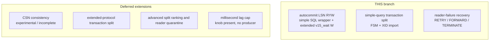
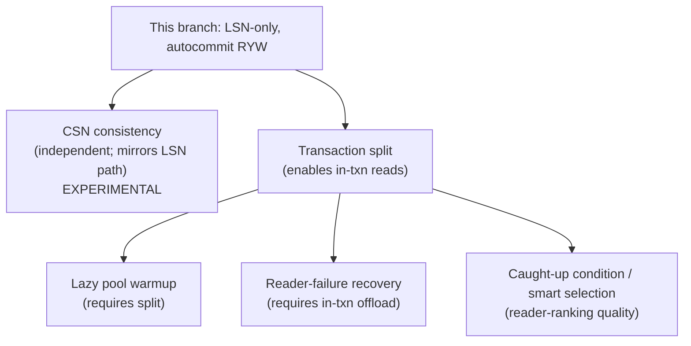
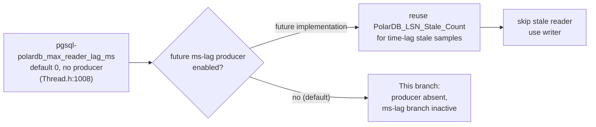

# 15 — Limitations, Deferred Items, and Roadmap

> Scope: what this PolarDB LSN/session-consistency branch does NOT do, every deferred or inert item, every in-code TODO/FIXME/"deferred"/"future" note, an implemented-vs-next status matrix, and the path to v2 | Audience: R/M/O/C | Status: stable | Prereqs: [POLARDB_ARCHITECTURE.md](POLARDB_ARCHITECTURE.md), [14-INVARIANTS-AND-FAILURE-MODES.md](14-INVARIANTS-AND-FAILURE-MODES.md), [06-ROUTING-PIPELINE.md](06-ROUTING-PIPELINE.md) | Verified against: this branch

---

## 1. What this document is

This is the **hub** for "what is not here yet." It does three jobs:

1. Lists every capability that is **out of scope for this feature** (the LSN-only branch), and says where each one is described in full.
2. Lists every item that is **deferred or inert today** — config knobs that exist but do nothing, active counters with deferred sub-paths, and code that is reserved for the future but unused now.
3. Collects **every in-code note** that flags future work: `TODO`, `FIXME`, "deferred", "not implemented", "no producer", and "future" comments found in this implementation.

It ends with an **implemented-vs-next status matrix** and the **extension path to v2** (CSN, transaction-split, reader-failure recovery).

### 1.1 Terms used here (defined once)

| Term | Plain definition |
|---|---|
| **This implementation** | The current LSN-only branch. This is the authority for its current behavior. |
| **the full implementation** | A separate reference branch kept only for mining future features. It is NOT shipped. Every citation into it is tagged "(full implementation)". Line numbers in the full implementation do **not** match this branch. |
| **LSN** (Log Sequence Number) | A 64-bit position in PostgreSQL's write-ahead log (WAL). Larger means more recent. A replica that replayed up to LSN X can serve any read whose data was committed at or before X. |
| **CSN** (Commit Sequence Number) | A 64-bit counter PolarDB bumps once per commit. It counts commits, not WAL bytes. **Not present in this implementation.** |
| **RYW** (read-your-writes) | The guarantee that after a session writes, its own later reads see that write even when reads go to a replica. |
| **RFQ** (ReadyForQuery) | The PostgreSQL message a backend sends when ready for the next command. A patched PolarDB backend appends its current LSN to it. |
| **wait wrapper** | The three `SET` statements ProxySQL prepends to a replica-eligible read so the replica blocks until it has replayed past the session's last write LSN. |
| **deferred** | Code or config that exists in this implementation but is intentionally not active. It compiles, but it has no behavioral effect today. |
| **inert** | A specific kind of deferred: the item is reachable in principle but, with default config, never runs. |

---

## 2. The scope in one sentence

> This implementation gives **read-your-writes consistency for autocommit simple and extended reads**, using a per-session write LSN and a server-side wait. Simple queries use `SET polar_xact_split_wait_lsn`; negotiated `v15_wait` extended queries use an in-band `W`, controlled behind the `POLARDB_PROXY` compile flag.

Everything outside that one sentence is out of scope. The next section lists exactly what that excludes.

---

## 3. Out of scope (explicit non-goals)

Each item below is a remaining non-goal or future extension. Some transaction-split foundation and dispatch code is active in this branch; the missing pieces are called out separately so they are not confused with the shipped path.

| # | Out-of-scope feature | What it would do | confirmation it is absent from this branch | Full design doc |
|---|---|---|---|---|
| 1 | **CSN commit-counter consistency** | Wait on a commit counter instead of a WAL position | The libpq patch has no `PQgetCSN`, `polar_wait_csn`, or `_polar_send_csn`; current modes are `OFF`, `SESSION_LSN`, `GLOBAL_LSN`, and `EVENTUAL`. `GLOBAL_LSN` is shipped WAL-position consistency, not CSN. | [18-FUTURE-CSN-DESIGN.md](18-FUTURE-CSN-DESIGN.md) |
| 2 | **Transaction-split extensions** | Add extended-protocol split, optional SMART/SIMPLE ranking, CSN integration, and richer retry/quarantine policy | Simple-query split dispatch, split counters, demand warmup, and common RETRY/FORWARD/TERMINATE handling are active. Extended-protocol split, CSN, split-mode ranking, and circuit-breaker policy remain absent. | [19-FUTURE-TXN-SPLIT-DESIGN.md](19-FUTURE-TXN-SPLIT-DESIGN.md), [20-FUTURE-READER-FAILURE-RETRY-DESIGN.md](20-FUTURE-READER-FAILURE-RETRY-DESIGN.md), [21-FUTURE-OTHER-CAPABILITIES.md](21-FUTURE-OTHER-CAPABILITIES.md) |
| 3 | **General reader-failure / retry recovery** | When a read offloaded to a replica fails mid-transaction, decide RETRY (re-run on the writer), FORWARD (real error, keep txn alive), or TERMINATE — instead of poisoning the session | This branch has the autocommit wait-read retry path plus the split-read failure policy in `lib/PgSQL_PolarDB_Failure.cpp`, including the `PolarDB_WriterState` tri-state and the `polardb_reader_{death,timeout,error}_action` knobs (`lib/PgSQL_Thread.cpp:519-521`). Only the general in-transaction (non-split) reader-failure policy remains future work | [20-FUTURE-READER-FAILURE-RETRY-DESIGN.md](20-FUTURE-READER-FAILURE-RETRY-DESIGN.md) |
| 4 | **Extended-protocol transaction split** | Run an in-transaction Parse/Bind/Execute read on a split reader | Autocommit extended RYW is implemented with `v15_wait`, but transaction-split XID import and split-reader ownership remain simple-query only; in-transaction extended reads use the writer | covered here in §4.1; future work, see [19-FUTURE-TXN-SPLIT-DESIGN.md](19-FUTURE-TXN-SPLIT-DESIGN.md) |
| 5 | **Millisecond replica-lag cap** | Reject a replica whose estimated catch-up *time* (not byte distance) is over a cap | The `polardb_max_reader_lag_ms` runtime variable is reserved and accepts only `0`; no producer exists; see §5.1 | covered here in §5.1; future direction at `include/PgSQL_PolarDB.h:509-523` |

Two cross-tree warnings that apply to all of the above:

- **CSN is incomplete and experimental even in the full implementation.** It is not "done somewhere else." See §7.3 for the working-vs-stubbed split before any reader assumes the full implementation "has CSN."

### 3.1 Picture: this branch's surface vs the full feature

```
  FULL PolarDB feature (not shipped)
  ┌─────────────────────────────────────────────────────────────────┐
  │  CSN consistency        Transaction-split      Reader-failure     │
  │  (Flow/Consistency/HGM  (Split.cpp 942 ln,     (Failure.cpp 1449  │
  │   CSN branches,         FSM, XID import,        ln, RETRY/FORWARD/ │
  │   global CSN, modes      warmup pool)           TERMINATE, writer  │
  │   2 & 4)                                        state tri-state)   │
  │  ┌───────────────────────────────────────────────────────────┐   │
  │  │              LSN-only RYW (THIS branch)                     │   │
  │  │  autocommit reads · session write LSN · wait wrapper       │   │
  │  │  7 .cpp files · 228 counters + 1 active condition · 24 knobs    │   │
  │  └───────────────────────────────────────────────────────────┘   │
  │  Extended transaction split     Millisecond lag cap               │
  │  (writer-only; autocommit W)    (knob present, no producer)       │
  └─────────────────────────────────────────────────────────────────┘
```

---

## 4. Detail on the two "partial" non-goals inside this branch

CSN and extended-protocol transaction split are absent. Simple-query split, warmup, counters, and the common reader-failure model are active. The other non-goals are narrower extensions whose hooks or adjacent infrastructure may already be visible; this section keeps that implemented-versus-future boundary explicit.

### 4.1 Extended-protocol RYW — implemented for autocommit with `v15_wait`

Simple-query RYW keeps its SQL wrapper. Extended autocommit RYW uses the negotiated `v15_wait` protocol instead: libpq appends one `W` immediately before the semantic Parse for a one-shot query or before Bind/Execute for a reused prepared statement. `W` and the operation are flushed together, so the wait adds no protocol round trip. The complete contract is documented beside `PolarDB_Query_RouteCtx` in `include/PgSQL_PolarDB.h`.

What this branch does instead:

- Manual `destination_hostgroup` routes remain authoritative and receive no automatic wait.
- Automatic target-free reads may use a reader without `W`; target-ready readers use the normal confirmed-cache bypass.
- A behind reader requires `v15_wait`. Profiles `v15`, `legacy`, and `off` use the writer when a target must be enforced.
- Unknown-target, ambiguous/multi-operation frame, and in-transaction extended reads use the writer. Extended transaction split remains future work.

The status matrix therefore marks autocommit prepared-statement RYW implemented and extended transaction split unavailable.

### 4.2 Millisecond replica-lag cap — knob registered, no producer

This branch supports exactly three lag controls (`include/PgSQL_PolarDB.h:498-507`):

1. LSN byte distance — `polardb_max_reader_lsn_gap_bytes` / per-HG `max_lag_bytes`.
2. Cached-LSN age — `polardb_reader_lsn_max_age_ms`.
3. The wait timeout around `polar_xact_split_wait_lsn`.

A fourth control, a **time-based** lag cap (`polardb_max_reader_lag_ms`), is registered but intentionally inert. The PgSQL/PolarDB path does not currently produce a real per-reader time-lag value, so there is nothing to compare against (`include/PgSQL_PolarDB.h:504-507`; `include/PgSQL_HostGroups_Manager.h:220-222`). The full details, the related stale-LSN counter, and the planned producer are in §5.

---

## 5. Deferred lag knob and related stale-LSN counter

This section separates the deferred millisecond-lag knob from the active byte-lag stale-sample counter so operators do not confuse the two.

### 5.1 `polardb_max_reader_lag_ms` knob — DEFERRED (no producer)

| Aspect | Value | file:line |
|---|---|---|
| Admin variable | `pgsql-polardb_max_reader_lag_ms` | registered at `lib/PgSQL_Thread.cpp:2417` |
| Storage field | `int polardb_max_reader_lag_ms` with the comment "TODO: deferred ms lag cap; no PgSQL producer yet" | `include/PgSQL_Thread.h:1008` |
| Default | `0` | `lib/PgSQL_Thread.cpp:1125` ("deferred: no PgSQL ms-lag producer yet") |
| Range | `0` only in this branch | `lib/PgSQL_Thread.cpp:2417` (reserved until PgSQL ms-lag producer exists) |
| Thread-local mirror | `pgsql_thread___polardb_max_reader_lag_ms` | `include/proxysql_structs.h:1142-1148` |
| The predicate it would feed | `polardb_reader_lag_ms_within_cap()` under `POLARDB_PROXY_TODO`; wire only after a real millisecond-lag producer exists | `include/PgSQL_PolarDB.h` |

**Behavior today:** none. The runtime variable accepts only `0` in this branch. The separate millisecond-lag branch that would use it is protected by `POLARDB_PROXY_TODO`.

**Planned producer (from the in-code note, `include/PgSQL_PolarDB.h:509-523`):** keep monitor samples of each reader's replay LSN and sample time, estimate `replay_bytes_per_ms` from consecutive samples, then `estimated_catchup_ms = byte_lag / recent_replay_bytes_per_ms`, and reject readers whose estimated catch-up time is over the cap. Missing, stale, or zero-rate samples under an enabled cap must reject the reader and use the writer if no safe reader remains. The note also warns: do **not** reuse the MySQL/Aurora `aws_aurora_current_lag_us` field as-is.

### 5.2 `PolarDB_LSN_Stale_Count` counter — ACTIVE for byte-lag safety

| Aspect | Value | file:line |
|---|---|---|
| Stats name (admin table `stats_pgsql_global`) | `PolarDB_LSN_Stale_Count` | export at `lib/PgSQL_Thread.cpp:4533-4534` |
| Increment sites | per-thread `POLARDB_THREAD_COUNT_ONE(..., lsn_stale_count)` | reader acquisition when byte-lag safety cannot trust group/reader LSN state; deferred ms-lag branch also has a protected future increment |
| Default behavior | normally flat unless `max_lag_bytes` is enabled and LSN samples are missing or stale | byte-lag cap is off by default |

**Behavior today:** the counter exists, is exported, and moves for byte-lag stale/missing samples when `max_lag_bytes` is enabled. The millisecond-lag producer remains deferred, so do not read this as a time-lag signal.

The full counter family is **228 exported stat counters + 1 internal `polardb_active` condition**; see [12-THREADVARS-AND-OBSERVABILITY.md](12-THREADVARS-AND-OBSERVABILITY.md).

### 5.3 Cancel-session metadata — not present in this branch

This branch keeps no `session_id` / `cancel_key` fields on `PgSQL_PolarDB_Config` and
does not emit `_polar_proxy_session_id` / `_polar_proxy_cancel_key`. PolarDB15
cancel-session routing is a future extension that should add the session state,
generators, startup parameter emission, cancel request flow, tests, and docs in
one coherent change.

### 5.4 HGM replication-config fields not used by routing

These fields on `PgSQL_HGC::repl_config` are set on config commit, but routing uses the parsed enum and the topology snapshot/maps instead. They are not bugs; they look kept for diagnostics, future local policy, or non-routing maintenance. Confirm with the owner before removing.

| Field | Status | file:line (set) |
|---|---|---|
| `repl_config.writer_hostgroup` | **set, not on routing path**; topology reads use the snapshot/maps | `lib/PgSQL_HostGroups_Manager.cpp:1836` |
| `repl_config.reader_hostgroup` | **set, not on routing path**; used by writer-epoch cache reset to clear the paired reader HG | `lib/PgSQL_HostGroups_Manager.cpp:1837` |
| `repl_config.check_type` (string) | **write-only** | `lib/PgSQL_HostGroups_Manager.cpp:1838` |
| `repl_config.consistency_mode` (string) | **write-only** (only the parsed `consistency_mode_enum` is read) | `lib/PgSQL_HostGroups_Manager.cpp:1839` |

### 5.5 Missing writer RFQ LSN (handled by writer-fallback flag and counter)

When a positioned write or tracked read completes without RFQ LSN, the session keeps the previous target, marks the corresponding unknown flag, and increments the missing-LSN counter. Later LSN-mode routing applies `pgsql-polardb_action_missing_lsn`: primary preserves correctness, warning permits the explicitly accounted simple-query degraded path, and error fails the request. Extended unknown-target reads use the writer or error because there is no target to encode in `W`. Remaining observability gaps are catalogued in [12-THREADVARS-AND-OBSERVABILITY.md](12-THREADVARS-AND-OBSERVABILITY.md).

### 5.6 libpq connection-string params and emitted startup profiles

The PolarDB libpq patch (`deps/postgresql/polardb_libpq.patch`) registers **13** PolarDB connection-string options — including **both** spellings of the send-LSN and send-xact flags — for compatibility with PolarDB 11 and PolarDB 15 backends. This branch currently emits one three-parameter startup dialect per RFQ-requesting connection (`PgSQL_Connection::append_polardb_startup_params`, `lib/PgSQL_Connection.cpp:1809`):

| Effective profile | Params emitted | Purpose |
|---|---|---|
| `v15` | `_polar_proxy_client_host`, `_polar_proxy_client_port`, `_polar_proxy_send_lsn=true`, `_polar_proxy_send_xact=true` | v15 RFQ LSN/XID request plus client/fallback identity passthrough |
| `legacy` | `_polar_origin_client_ip`, `_polar_origin_client_port`, `_polar_send_lsn=true`, `_polar_send_xact=true` | legacy RFQ LSN/XID request plus client/fallback identity passthrough |
| `off` | none | no RFQ LSN startup request |

The cancel-routing metadata (`_polar_proxy_session_id` / `_polar_proxy_cancel_key`) and SSL passthrough metadata (`_polar_proxy_use_ssl` / `_polar_proxy_ssl_version` / `_polar_proxy_ssl_cipher_name`) are **unused in this branch**: accepted by the patch but never emitted by ProxySQL. The transaction-split RFQ flags (`_polar_send_xact` / `_polar_proxy_send_xact`) are emitted for non-`off` PolarDB profiles because startup parameters are fixed for pooled backend connections; `txn_split_enabled` decides whether result processing uses XID/splittable state for split routing.

---

## 6. In-code TODO / deferred / future notes (exhaustive)

This is the full list of forward-looking notes found in this implementation (grep for `TODO`, `FIXME`, "deferred", "not implemented", "no producer", "future", "merge point", "for now"). Every one is verified at the cited line. Many are postponed on purpose; they are the seams a v2 implementer will reopen.

| # | Note (summary) | Kind | file:line | Belongs to |
|---|---|---|---|---|
| 1 | `polardb_max_reader_lag_ms` storage: "TODO: deferred ms lag cap; no PgSQL producer yet" | TODO/deferred | `include/PgSQL_Thread.h:1008` | §5.1 ms-lag |
| 2 | `polardb_max_reader_lag_ms` default 0: "deferred: no PgSQL ms-lag producer yet" | deferred | `lib/PgSQL_Thread.cpp:1125` | §5.1 ms-lag |
| 3 | `polardb_max_reader_lag_ms` registration: "TODO: deferred until PgSQL ms-lag producer exists" | TODO/deferred | `lib/PgSQL_Thread.cpp:2417` | §5.1 ms-lag |
| 4 | Per-server LSN block: "Millisecond replica lag is a deferred PolarDB TODO; PgSQL does not currently produce a real value for `aws_aurora_current_lag_us`" | TODO/deferred | `include/PgSQL_HostGroups_Manager.h:220-222` | §5.1 ms-lag |
| 5 | Lag controls note: "Millisecond replica lag is intentionally deferred… Do not treat `polardb_max_reader_lag_ms` as a supported routing condition" | deferred | `include/PgSQL_PolarDB.h:504-507` | §5.1 ms-lag |
| 6 | `polardb_max_reader_lag_ms` "Future direction" producer sketch (replay-rate estimate) | future | `include/PgSQL_PolarDB.h:509-523` | §5.1 ms-lag |
| 7 | `polardb_reader_lag_ms_within_cap()`: compiled only under `POLARDB_PROXY_TODO` until a real producer exists | TODO/future | `include/PgSQL_PolarDB.h` | §5.1 ms-lag |
| 8 | Reader acquisition "Filter 4: deferred millisecond-lag safety… Keep this branch visibly protected until that producer is implemented" (controls `PolarDB_LSN_Stale_Count`) | deferred | `lib/PgSQL_HostGroups_Manager.cpp:4436`, `:4661-4669` | §5.1/§5.2 |
| 9 | Reader acquisition: `consistency_target_lsn` narrows preference to fresh cached target-reaching readers when possible, allows wait bypass only for a selected target-reaching reader, but never rejects the original replica set; fallback readers still use `polar_xact_split_wait_lsn` as the correctness enforcement | design note / implemented preference | `lib/PgSQL_HostGroups_Manager.cpp:5109-5111`; `include/PgSQL_HostGroups_Manager.h:1073-1078` | §7.4 consistency-target preference |
| 10 | Consistency snapshot is "the future merge point for CSN/global consistency" (session CSN / global CSN / split keep XID payload separate) | future/merge point | `include/PgSQL_PolarDB.h:288-296` | §7.1 CSN |
| 11 | Wait-spec object kept separate "when CSN support is merged later… carry the CSN wait target/mode without changing the boundary" | future/merge point | `include/PgSQL_PolarDB.h:318-319` | §7.1 CSN |
| 12 | `PolarDB_WaitSpec.target` carries the current LSN wait value; a CSN merge would reuse the spec boundary with a new wait type | future | `include/PgSQL_PolarDB.h` | §7.1 CSN |
| 13 | Wait planning should extend `PolarDB_WaitSpec` and add CSN target selection only when CSN lands, while keeping split-specific XID payloads separate | future | `include/PgSQL_PolarDB.h` | §7.1 CSN / §7.2 split |
| 14 | Wrap sent-counter: "Future CSN support should add the parallel type-specific sent counter here." | future | `lib/PgSQL_PolarDB_Wrap.cpp:246` | §7.1 CSN |
| 15 | Counter family comment: counters "kept separate so future wait families (CSN…) can…" / pairs "can diverge once CSN…" | future | `include/PgSQL_HostGroups_Manager.h:694`, `:704` | §7.1 CSN |
| 16 | Extended-protocol RYW design note: `v15_wait` sends `W` before Parse or Execute in one flush; unsupported profiles and unsafe frame shapes use writer | design note / implemented | `include/PgSQL_PolarDB.h` (`PolarDB_Query_RouteCtx`) | §4.1 extended |
| 17 | Execute: "the actual query wrapping is deferred" (wrap built later at `ASYNC_IDLE`) | deferred (by design) | `lib/PgSQL_PolarDB_Flow.cpp:363`, `:442` | wrap timing, see [07-QUERY-WRAPPING.md](07-QUERY-WRAPPING.md) |
| 18 | `fail_wait_wrap_finalize`: "This session failed to attach a required wait wrapper. Future queries…" (writer-fallback flag) | design note | `lib/PgSQL_PolarDB_Wrap.cpp:189` | writer fallback, see [14-INVARIANTS-AND-FAILURE-MODES.md](14-INVARIANTS-AND-FAILURE-MODES.md) |
| 19 | Monitor LSN feed: "`polardb_update_server_lsn()` itself no-ops unless a PolarDB hostgroup is configured" | design note | `lib/PgSQL_Monitor.cpp:1942` | monitor, see [05-MONITOR-AND-HGM-LSN-STATE.md](05-MONITOR-AND-HGM-LSN-STATE.md) |

**Reading guide:** notes 1–8 are all the same deferred feature (ms-lag) seen from different files. Note 9 documents the implemented consistency-target reader preference, the selected-reader wait bypass, and the deliberately absent hard caught-up rejection condition in §7.4. Notes 10–15 are the deliberate CSN "merge points" left in this branch so CSN can be added without reshaping the wait boundary. Note 16 documents implemented extended autocommit waits and their writer fallbacks. Notes 17–19 are not future work — they document deliberate timing/safety choices and are listed only so the words "deferred"/"no-op"/"future" in the source are accounted for.

> Note on the monitor: the full implementation has an explicit **CSN** monitor no-op ("Keep monitor CSN as a no-op for now", full implementation `lib/PgSQL_Monitor.cpp:763`). That note does **not** exist in this branch, because this branch has no CSN at all. This branch's monitor only feeds the LSN cache (note 19).

---

## 7. Extension path to v2 — how this branch was shaped to admit the future

This branch was built so the out-of-scope features can be added **on top of the same pipeline**, not by rewriting it. The pipeline is `collect → plan → execute → process_result` plus the wrap layer (see [06-ROUTING-PIPELINE.md](06-ROUTING-PIPELINE.md)). This section describes, per future feature, the delta a v2 implementer adds and which hook in this branch it extends. It is directional; do **not** map full-implementation line numbers 1:1 onto this branch.

### 7.1 CSN / global consistency (EXPERIMENTAL — see warning)

> **CSN is experimental and incomplete.** Three hard caveats apply throughout: (1) it requires PolarDB **backend** support for CSN in the RFQ and the `polar_wait_csn` GUC; (2) it applies only in **global-consistency mode** for the cross-session case; (3) CSN-wait behavior is **not reliably verified** — parts of it are stubbed even in the full implementation (§7.3). Treat any "the full implementation has CSN" claim as "the full implementation has partial, unverified CSN."

**Why this branch admits it cleanly:** this branch leaves explicit CSN merge points (notes 10-15). The wait boundary already carries `PolarDB_WaitSpec.target` for the LSN value, and a CSN merge can add a CSN wait type without changing the caller boundary.

**Delta a CSN v2 adds (directional, full-implementation home tagged):**

| Layer | Hook in this branch it extends | What CSN adds (full implementation) |
|---|---|---|
| Enum/modes | `PolarDB_ConsistencyMode {OFF=0, SESSION_LSN=1, GLOBAL_LSN=2, EVENTUAL=3}` | add new non-colliding CSN values and map them explicitly |
| Schema | consistency-mode CHECK allows `default/off/eventual/session_lsn/global_lsn` | add unambiguous CSN spellings only with the complete server/policy implementation |
| State | per-session write LSN, per-server LSN, no global value | add per-session write CSN, per-server `polardb_current_csn`, and a cluster-wide `global_primary_csn` (full implementation) |
| collect | snapshots LSN inputs (`lib/PgSQL_PolarDB_Flow.cpp:233`) | also snapshot session CSN and global CSN |
| plan | builds an LSN wait or forces primary (`lib/PgSQL_PolarDB_Flow.cpp:410`) | emit a CSN wait, or force primary when no CSN target exists; `SESSION_CSN` has **no** fallback, `GLOBAL_CSN` uses the cluster CSN |
| wrap | emits `SET polar_xact_split_wait_lsn` | extend the existing wait-spec emission boundary to emit `SET polar_wait_csn` |
| libpq | RFQ carries LSN fields plus xact fields used for transaction-split observation (`deps/postgresql/polardb_libpq.patch`); no CSN surface | enable CSN RFQ parsing and `_polar_send_csn=true`; the full-implementation patch block already exists but is not in this branch |
| counters | 10 LSN counters | add the CSN counter family (stale, updates-from-query, updates-from-monitor, routing, wait-count, wait-sum-us) — full implementation |

Full design: [18-FUTURE-CSN-DESIGN.md](18-FUTURE-CSN-DESIGN.md).

### 7.2 Transaction-split read offload

**Why this branch admits it cleanly:** split is layered on the same pipeline. Ineligible in-transaction reads still force the writer with action reason `IN_TRANSACTION`; eligible reads use `REPLICA_TXN_SPLIT` and a temporary replica backend.

**Remaining split v2 delta (directional):** extended-protocol transaction split, optional `pgsql-polardb_split_mode` ranking, CSN integration, and richer retry/quarantine policy. Split counters, demand warmup, and the common failed-read policy are already active. Split continues to use an LSN wait because CSN does not advance mid-transaction. Full design: [19-FUTURE-TXN-SPLIT-DESIGN.md](19-FUTURE-TXN-SPLIT-DESIGN.md).

A companion, **lazy connection-pool warmup**, depends on split: only split reads queue a warmup request. See [21-FUTURE-OTHER-CAPABILITIES.md](21-FUTURE-OTHER-CAPABILITIES.md).

### 7.3 Reader-failure / retry recovery

**Why this branch admits it cleanly:** the `rc == -1` handler branch (the "backend query failed" seam) exists in this branch and upstream, and the `tx_poisoned` writer-loss path is shared base.

**Already wired in this branch (directional map):** `lib/PgSQL_PolarDB_Failure.cpp` carries the `polardb_capture_outcome` + `polardb_on_failure` dispatch at the `rc==-1` seam, the writer-state tri-state (LIVE / NOT_STARTED / LOST), the `READER_FAILURE_FORCE_WRITER` action reason already present in this branch's `RouteActionReason` enum (`include/PgSQL_PolarDB.h:2590-2622`), the writer-only route honored at three layers, three per-failure knobs, and the split/forwarding counters. The autocommit path additionally retries a wait-read on the writer for strict LSN wait timeout and reader connection loss before any user result, using a narrow `PolarDB_WaitReadFailure` snapshot, `PolarDB_Wait_Error_Connection_Lost`, and `PolarDB_Wait_Reads_Retried_On_Writer`. The remaining v2 delta is the general in-transaction (non-split) failure-policy matrix. **Prerequisite:** the general policy model only matters after in-transaction offload lands (split or in-txn wait); split already provides the first in-transaction replica reads to rescue, so the remaining work is the non-split cases. Full design: [20-FUTURE-READER-FAILURE-RETRY-DESIGN.md](20-FUTURE-READER-FAILURE-RETRY-DESIGN.md).

### 7.4 Consistency-target reader preference, without a hard "caught-up condition"

This branch **intentionally does not** use a hard reader-acquisition filter that rejects any replica whose cached LSN is below the consistency target. The selector comment is explicit: `consistency_target_lsn` narrows preference to fresh cached target-reaching readers when possible, but never rejects the original replica set. If a target-reaching reader is actually acquired, the session may clear the staged wait and count `PolarDB_Wait_Wrap_Bypassed`; otherwise `polar_xact_split_wait_lsn` in the wrapped query is the condition (`lib/PgSQL_HostGroups_Manager.cpp:5109-5111`, `include/PgSQL_HostGroups_Manager.h:1073-1078`).

The implemented order is preference-plus-bypass: build the normal weighted candidate set, also build a target-reaching subset whose cached LSN is fresh and `>= consistency_target_lsn`, choose weighted among that subset first, and increment `PolarDB_Target_LSN_Preferred` when it succeeds. That successful preferred acquisition also authorizes `PolarDB_Wait_Wrap_Bypassed`. If the subset is empty or no compatible connection can be acquired there, selection falls back to the full weighted candidate set, increments `PolarDB_Target_LSN_Fallback_Wait` on success, and relies on the wait wrapper. The future work is not "add target-LSN awareness"; it is richer split-mode ranking beyond this branch's preference, plus any explicit hard condition if a future feature chooses to add one.

### 7.5 Dependency order for layering v2 features

```
This branch (LSN-only, autocommit RYW)
        │
        ├── CSN consistency .............. independent of split; mirrors the LSN path everywhere
        │                                  (EXPERIMENTAL: partly stubbed; needs backend support)
        │
        └── Transaction split ............ enables reads inside open transactions
                 ├── Lazy pool warmup ..... only split reads queue warmup  (requires split)
                 ├── Reader-failure ....... only matters once reads run inside txns (requires split)
                 └── Split smart ranking .. richer reader-ranking quality
                                                beyond this branch's target-LSN preference
```

CSN can land before or after split. Warmup and reader-failure both **require** split first.

---

## 8. Implemented-vs-next status matrix

The single table the rest of the doc set links to. "Status" is one of: **Implemented**, **Writer-fallback only** (the hook is present but only as a safety action reason), **Inert** (present, no effect with default config), **Deferred** (present, intentionally off), or **Not present** (absent; full implementation only).

| Capability | Status | Notes | Next-step doc |
|---|---|---|---|
| LSN read-your-writes for **autocommit** reads | **Implemented** | shared route plan and wait intent; SQL wrapper for simple query, in-band `W` for negotiated `v15_wait` extended protocol | [06-ROUTING-PIPELINE.md](06-ROUTING-PIPELINE.md), [07-QUERY-WRAPPING.md](07-QUERY-WRAPPING.md) |
| Per-session write-LSN tracking (RFQ-only, no SQL probe) | **Implemented** | `polardb_process_result` (`lib/PgSQL_PolarDB_Flow.cpp:1846`) advances `polardb_session_consistency.write_lsn` via `max()` on write + has-LSN; `EXPLAIN ANALYZE <DML>` is classified as read, but still advances `observed_lsn` | [09-PUBLISH-AND-WRITE-TRACKING.md](09-PUBLISH-AND-WRITE-TRACKING.md) |
| Wait wire encoding | **Implemented** | simple query: three SETs at one `ASYNC_IDLE` wrap point; extended: one negotiated `W` immediately before the semantic operation in the same flush | [07-QUERY-WRAPPING.md](07-QUERY-WRAPPING.md), [11-CONNECTION-AND-LIBPQ.md](11-CONNECTION-AND-LIBPQ.md) |
| best_effort vs strict timeout, structured-marker detection | **Implemented** | matches `PG_DIAG_MESSAGE_DETAIL == polar_proxy_lsn_wait_timeout`, not text | [08-WAIT-TIMEOUT-AND-NOTICES.md](08-WAIT-TIMEOUT-AND-NOTICES.md) |
| Wait-read retry on writer | **Implemented** | autocommit LSN wait read, timeout marker seen or reader connection lost, no user result started | [08-WAIT-TIMEOUT-AND-NOTICES.md](08-WAIT-TIMEOUT-AND-NOTICES.md), [20-FUTURE-READER-FAILURE-RETRY-DESIGN.md](20-FUTURE-READER-FAILURE-RETRY-DESIGN.md) |
| 3-tier consistency-mode resolution (session > HG > global) | **Implemented** | `polardb_resolve_consistency_mode` (`include/PgSQL_PolarDB.h:2036`) | [04-ADMIN-SCHEMA-AND-CONFIG.md](04-ADMIN-SCHEMA-AND-CONFIG.md) |
| Byte lag cap (`max_lag_bytes` / `pgsql-polardb_max_reader_lsn_gap_bytes`) | **Implemented** | safety-only; NOT the consistency condition | [05-MONITOR-AND-HGM-LSN-STATE.md](05-MONITOR-AND-HGM-LSN-STATE.md) |
| Cached-LSN freshness condition (`pgsql-polardb_reader_lsn_max_age_ms`) | **Implemented** | age check on the per-server LSN | [05-MONITOR-AND-HGM-LSN-STATE.md](05-MONITOR-AND-HGM-LSN-STATE.md) |
| Monitor-driven per-server LSN cache | **Implemented** | enabled by `pgsql-polardb_monitor_lsn_updates` (default on) | [05-MONITOR-AND-HGM-LSN-STATE.md](05-MONITOR-AND-HGM-LSN-STATE.md) |
| Consistency-target reader preference and wait bypass | **Implemented** | fresh cached readers at or beyond `consistency_target_lsn` are preferred first; successful preferred acquisition skips the wait wrapper, fallback uses the full weighted set and the wait wrapper remains the condition | [06-ROUTING-PIPELINE.md](06-ROUTING-PIPELINE.md), [12-THREADVARS-AND-OBSERVABILITY.md](12-THREADVARS-AND-OBSERVABILITY.md) |
| Safe writer fallback (malformed packet, wrap fail, force-writer flag, lag/stale) | **Implemented** | full enumeration with file:line | [14-INVARIANTS-AND-FAILURE-MODES.md](14-INVARIANTS-AND-FAILURE-MODES.md) |
| `POLARDB_PROXY` compile toggle + empty stub TU | **Implemented** | Off mode removes PolarDB routing/config/counters/startup/W and links vanilla libpq; generic extended-protocol correctness remains shared. Compatibility is behavioral, not byte identity. | [02-BUILD-TOGGLE-AND-LIBPQ.md](02-BUILD-TOGGLE-AND-LIBPQ.md) |
| libpq RFQ patch (`PQgetLSN`/`PQhasLSN`/`PQsetPolarSendLSN`, plus xact RFQ accessors) | **Implemented** | the LSN functions are mandatory for RYW. When `txn_split_enabled=1`, ProxySQL also emits the xact RFQ startup request and reads XID/splittable state for split-read planning and dispatch. | [02-BUILD-TOGGLE-AND-LIBPQ.md](02-BUILD-TOGGLE-AND-LIBPQ.md), [11-CONNECTION-AND-LIBPQ.md](11-CONNECTION-AND-LIBPQ.md) |
| 299 always-on stat counters + warmup gauge + `polardb_active` condition | **Implemented** | SQL/Prometheus metadata is generated from the counter list; `polardb_active` is not exported | [12-THREADVARS-AND-OBSERVABILITY.md](12-THREADVARS-AND-OBSERVABILITY.md) |
| `PolarDB_LSN_Stale_Count` counter | **Active for byte-lag** | active for byte-lag enforcement; increments when `max_lag_bytes` cannot trust group/reader LSN samples | §5.2; [12-THREADVARS-AND-OBSERVABILITY.md](12-THREADVARS-AND-OBSERVABILITY.md) |
| `pgsql-polardb_max_reader_lag_ms` (millisecond lag cap) | **Deferred** | registered, accepts only zero, no PgSQL producer; not a routing condition today | §5.1 |
| Cancel-session metadata | **Not present** | future PolarDB15 extension | §5.3 |
| `repl_config.{writer_hostgroup,reader_hostgroup,check_type,consistency_mode}` | **Not used by routing in this branch** | routing uses maps + parsed enum instead; `reader_hostgroup` is used for writer-epoch cache reset | §5.4 |
| Missing writer RFQ LSN writer-fallback flag and counter | **Implemented** | `PolarDB_Write_Missing_LSN`, `proxy_warning`, and `WRITE_LSN_UNKNOWN` writer action reason | [09-PUBLISH-AND-WRITE-TRACKING.md](09-PUBLISH-AND-WRITE-TRACKING.md); [14-INVARIANTS-AND-FAILURE-MODES.md](14-INVARIANTS-AND-FAILURE-MODES.md) |
| Wait-success / FORCE_PRIMARY / per-server LSN gauge / tail-latency counters | **Not present** | known stat gaps | [12-THREADVARS-AND-OBSERVABILITY.md](12-THREADVARS-AND-OBSERVABILITY.md) |
| Extended-protocol RYW (prepared statements) | **Implemented for autocommit with `v15_wait`** | `W` precedes Parse or Bind/Execute in the same flush; target-ready bypass and safe writer fallback are shared with simple routing | §4.1; [06-ROUTING-PIPELINE.md](06-ROUTING-PIPELINE.md) |
| CSN (commit-counter) global consistency | **Not present** | GLOBAL_LSN (WAL-position) global consistency IS shipped; only the CSN commit-counter variant is absent, and it is experimental even in the full implementation | [18-FUTURE-CSN-DESIGN.md](18-FUTURE-CSN-DESIGN.md) |
| Transaction-split read offload (in-txn reads on replica) | **Implemented** | Eligible simple-query reads can use a replica when `txn_split_enabled=1`; split counters, demand warmup, and RETRY/FORWARD/TERMINATE handling are active. CSN integration and optional SMART/SIMPLE ranking remain future work. | [19-FUTURE-TXN-SPLIT-DESIGN.md](19-FUTURE-TXN-SPLIT-DESIGN.md) |
| Demand connection-pool warmup (for split reads) | **Implemented** | ReaderPool selects targets and HGM creates compatible connections outside the main HGM lock. | [21-FUTURE-OTHER-CAPABILITIES.md](21-FUTURE-OTHER-CAPABILITIES.md) |
| Reader-failure recovery (RETRY/FORWARD/TERMINATE) | **Implemented** | Active for autocommit wait reads and simple-query transaction-split reads; remaining work is richer per-error policy and retry budgets. | [20-FUTURE-READER-FAILURE-RETRY-DESIGN.md](20-FUTURE-READER-FAILURE-RETRY-DESIGN.md) |
| Hard "caught-up" reader-acquisition condition | **Not present (deliberately dropped)** | the backend wait is the condition: SQL SET wrapper for simple query, `W` for extended `v15_wait` | §7.4; [21-FUTURE-OTHER-CAPABILITIES.md](21-FUTURE-OTHER-CAPABILITIES.md) |
| Smart split-mode ranking beyond target-LSN preference / monitor CSN column | **Not present** | part of split / CSN; do not confuse this with this branch's implemented consistency-target preference | [21-FUTURE-OTHER-CAPABILITIES.md](21-FUTURE-OTHER-CAPABILITIES.md) |

---

## 9. Quick reference: what an operator must NOT rely on in this branch

A short list, because these are the easiest mistakes to make:

- **Do not set `pgsql-polardb_max_reader_lag_ms` and expect lag filtering.** It is deferred with no producer (§5.1).
- **Do not read `PolarDB_LSN_Stale_Count` as a millisecond-lag signal.** It is active only for byte-lag stale/missing samples in this branch (§5.2).
- **Do not expect extended RYW without `v15_wait`.** Automatic target-bearing extended reads on `v15`, `legacy`, or `off` use the writer; unknown-target and in-transaction extended reads are also writer-only (§4.1).
- **Do not expect every in-transaction read to use a replica.** Only eligible simple-query reads use transaction split when `txn_split_enabled=1` and the required RFQ evidence is complete; other reads stay on the writer.
- **Do not expect CSN commit-counter consistency.** The WAL-position `GLOBAL_LSN` mode is implemented; the separate CSN design remains experimental (§3 item 1, §7.1).
- **Do not look up full-implementation line numbers in this branch.** They differ; future-feature citations are tagged "(full implementation)" for this reason (§3).

Operator deployment requirements and troubleshooting recipes are in [17-OPERATOR-GUIDE.md](17-OPERATOR-GUIDE.md); testing scope and CI gaps are in [16-TESTING-AND-VALIDATION.md](16-TESTING-AND-VALIDATION.md).

---

## 10. Performance optimizations

Performance work in this implementation — the optimizations already in place, and the ones still planned.

### 10.1 Implemented

- `polardb_active` is isolated on its own cache line in the HostGroups Manager status block.
- `PgSQL_SrvC::polardb_current_lsn` and `lsn_updated_at` are isolated from
  surrounding server state so monitor/RFQ writers do not false-share with
  unrelated reader-selection fields.
- The 252 thread-backed PolarDB counters (the `T(...)` rows of the counter list) are off the global atomic hot path. Worker
  threads increment per-thread `PgSQL_Thread::polardb_status_variables.stvar[]`
  slots using `POLARDB_THREAD_COUNT(...)`, while the original global atomics
  remain as global counters for null-worker calls and worker teardown folds. The
  exported `stats_pgsql_global` value is the global counter plus live
  per-thread slots, so the external `PolarDB_*` names and values are unchanged.
- Worker teardown folds per-thread PolarDB counters back into the global
  counters in `PgSQL_Thread::~PgSQL_Thread()`. This keeps shutdown-time scrapes
  monotonic and preserves the old global-counter behavior if worker lifecycle
  handling is expanded later.
- The 38 global-only PolarDB counters (the `G(...)` rows) remain global atomics:
  the monitor LSN/health counters, the retry-on-writer and wait-retry decline
  family, RFQ profile eviction, session target epoch reset, wrap safety abort,
  and the split-warmup family.
- `generate_pgsql_replication_hostgroups_table()` publishes a plain-value PolarDB topology/policy snapshot with a generation counter.
- `is_polardb_hostgroup()`, `get_writer_hostgroup_for_reader()`, `get_reader_hostgroup_for_writer()`, and `get_polardb_hg_config()` read the generation snapshot instead of taking the HostGroups Manager global lock.
- There is intentionally no per-connection `PolarDB_HG_Config` cache: `get_polardb_hg_config()` is already lock-free through the thread-local generation snapshot, so such a cache would save only a small map lookup while duplicating policy fields that future CSN/split work will extend.
- Per-server LSN updates use a compare-and-swap "max" monotonic primitive and monotonic microsecond timestamps.
- The legacy `(host, port)` LSN update path updates all matching server entries.
- RFQ result update uses the direct `PgSQL_SrvC*` update overload instead of the locked `(host, port)` scan.
- Consistency-target PolarDB reader selection has a conservative thread-local fast path. It reuses a cached backend only when the backend is RFQ-LSN-capable, session-state-compatible, and already caught up to the target with a fresh LSN sample. Otherwise it falls through to the shared reader selection.
- Shared PolarDB reader selection applies the same ordinary server eligibility checks as the regular PostgreSQL path, including max-latency filtering, before applying the PolarDB RFQ/LSN filters.
- The weighted reader candidate is not retried in the fallback scan after it already failed under the HostGroups Manager write lock.
- RFQ-compatible pooled acquisition ranks compatible free connections with the regular PostgreSQL reuse preference: same connection options, no reset required, then more matching session variables/schema.
- The multi-statement check uses `CurrentQuery.QueryLength` instead of `strlen()`.
- The wait-mode SET string uses static literals instead of per-session cache fields.
- The `SELECT ... FOR ...` classifier uses a small ASCII token scan instead of `strcasestr(" FOR ")`, preserving the conservative over-classification rule while avoiding a generic substring search on every SELECT digest.

### 10.2 Planned

#### 10.2.1 P4: `PgSQL_SrvC*` lifetime audit / hardening

The direct RFQ result-processing path updates the server LSN through the
`PgSQL_SrvC*` already attached to the backend connection. That avoids the older
locked `(host, port)` scan and is the right performance direction. The remaining
work is a lifetime confirmation: `myconn->parent` must not be freed or replaced while a
thread-local or pooled connection can still reference it.

If the audit cannot show that invariant from existing reload / purge rules, the
path should be hardened with one of: a small refcount on the server container, a
reload/purge fence that flushes thread-local cached backends before freeing
server objects, or a fallback to the locked `(host, port)` update when the parent
pointer is not known to be stable. This is the only remaining blocker from the
immediate reader-selection performance pass.

#### 10.2.2 Counter aggregation benchmarking and cache-line tuning

Thread-backed PolarDB counters now use per-thread storage plus a global counter, so
the ordinary per-query path no longer performs a shared global
atomic increment for those rows. The remaining work is measurement: run the
contention benchmarks across CPU sockets/CCDs and check `perf c2c` or equivalent
profiles. If a global-counter cache line still shows up under a
degraded workload, isolate that group further or consider a wider alignment for
the affected fields.

Correctness of the aggregation/fallback/fold path is covered by the PolarDB HGM
unit test. The benchmark is still required before documenting a measured
throughput or latency improvement.

#### 10.2.3 Wrapper SET stickiness

Today every wrapped consistency read emits three leading statements:

```sql
SET polar_consistency_mode = ...;
SET polar_proxy_wait_timeout_ms = ...;
SET polar_xact_split_wait_lsn = ...;
<user query>
```

This is simple and correct because each wrapped read fully declares its policy
and target. The two policy SETs could be skipped when the same backend already
has the same mode and timeout applied; the wait-target SET must still be emitted
for every wrapped read.

The safe rule is commit-only promotion: track the backend's applied
`polar_consistency_mode` and `polar_proxy_wait_timeout_ms`, but update those
tracked values only after the wrapped batch completes successfully. A strict wait
timeout or user-query error aborts the multi-statement batch and PostgreSQL rolls
back the SETs, so updating the tracker at wrapper-build time would desynchronize
ProxySQL from the backend.

#### 10.2.4 Optional latency-awareness parity beyond max-latency filtering

PolarDB reader selection now applies the ordinary max-latency eligibility filter
before RFQ/LSN checks. Regular PostgreSQL selection also has optional
latency-awareness behavior around average latency and candidate pruning. PolarDB
does not yet mirror that second-stage behavior.

This is optional and not correctness-related. It should be considered only if
benchmarks show that PolarDB reader choice is worse than regular PostgreSQL under
mixed-latency replicas after the current max-latency filter is already in place.

#### 10.2.5 More aggressive thread-local reader reuse

The current PolarDB thread-local reader fast path is deliberately conservative:
it reuses a cached reader only when that backend is RFQ-LSN-capable,
session-state-compatible, and already caught up to the required LSN with a fresh
sample. It does not reuse a behind-but-waitable cached reader, because the shared
HostGroups Manager path may have another reader that is already caught up and
would avoid a backend wait.

If HostGroups Manager lock contention becomes the dominant cost, a later policy
can accept a local reader that is behind but still within `max_lag_bytes` /
freshness policy. That would trade a possible backend wait for fewer shared-pool
lookups. It should be benchmark-driven, not enabled by default blindly.

#### 10.2.6 Reusable wrapper buffer

Current wrapping builds a fresh string for wrapped reads. This is probably small
compared with network latency and backend wait time, but a reusable per-session
buffer could reduce allocation churn for very high-rate wrapped reads.

The buffer must remain request-local in behavior: it cannot keep stale wrapper
text across requests, and it must preserve the existing `wrapper_stmts` counting
and leading-result consumption contract.

#### 10.2.7 Snapshot-cache ownership cleanup

The per-worker PolarDB topology snapshot cache currently lives inside the
HostGroups Manager accessors. A later cleanup may move the cached
generation/pointer into the PostgreSQL worker thread object for clearer
ownership and easier instrumentation. This is a code-clarity item, not a known
hot-path blocker.

Before any planned item is promoted, validate with: a `POLARDB_PROXY=1` build; the PolarDB TAP and C tests; unit coverage for snapshot reload during query loops, compare-and-swap "max" regression attempts, update-all-matches, and stale-freshness boundaries; a soak test that drives query traffic while repeatedly loading PgSQL servers to runtime; and before/after `perf lock` contention captures for the HostGroups Manager plus the mode=off / non-PolarDB activation-tax baselines.

---

## Appendix: Mermaid diagrams

### A. This branch's surface vs the full feature (from §3.1)



### B. Dependency order for layering v2 features (from §7.5)



### C. The deferred ms-lag chain (from §5.1 and §5.2)



---

### Cross-references

- [POLARDB_ARCHITECTURE.md](POLARDB_ARCHITECTURE.md) — the architecture and the status summary this doc expands.
- [14-INVARIANTS-AND-FAILURE-MODES.md](14-INVARIANTS-AND-FAILURE-MODES.md) — the RYW invariant, safe fallback checks, and the known holes referenced here.
- [12-THREADVARS-AND-OBSERVABILITY.md](12-THREADVARS-AND-OBSERVABILITY.md) — the full counter catalogue and stat gaps.
- [06-ROUTING-PIPELINE.md](06-ROUTING-PIPELINE.md) — the collect/plan/execute decision the future features extend.
- [18-FUTURE-CSN-DESIGN.md](18-FUTURE-CSN-DESIGN.md), [19-FUTURE-TXN-SPLIT-DESIGN.md](19-FUTURE-TXN-SPLIT-DESIGN.md), [20-FUTURE-READER-FAILURE-RETRY-DESIGN.md](20-FUTURE-READER-FAILURE-RETRY-DESIGN.md), [21-FUTURE-OTHER-CAPABILITIES.md](21-FUTURE-OTHER-CAPABILITIES.md) — full design sketches for the out-of-scope features.
- [16-TESTING-AND-VALIDATION.md](16-TESTING-AND-VALIDATION.md), [17-OPERATOR-GUIDE.md](17-OPERATOR-GUIDE.md) — testing scope and operator guidance.

Verified against this branch.
