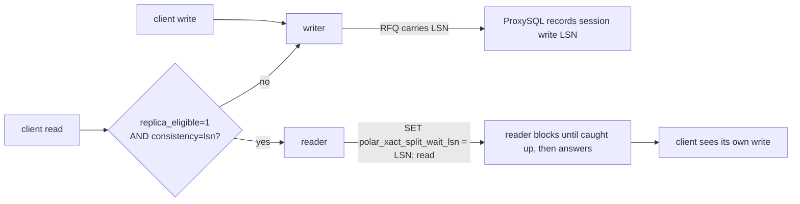
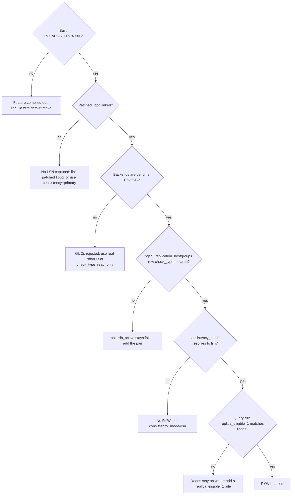
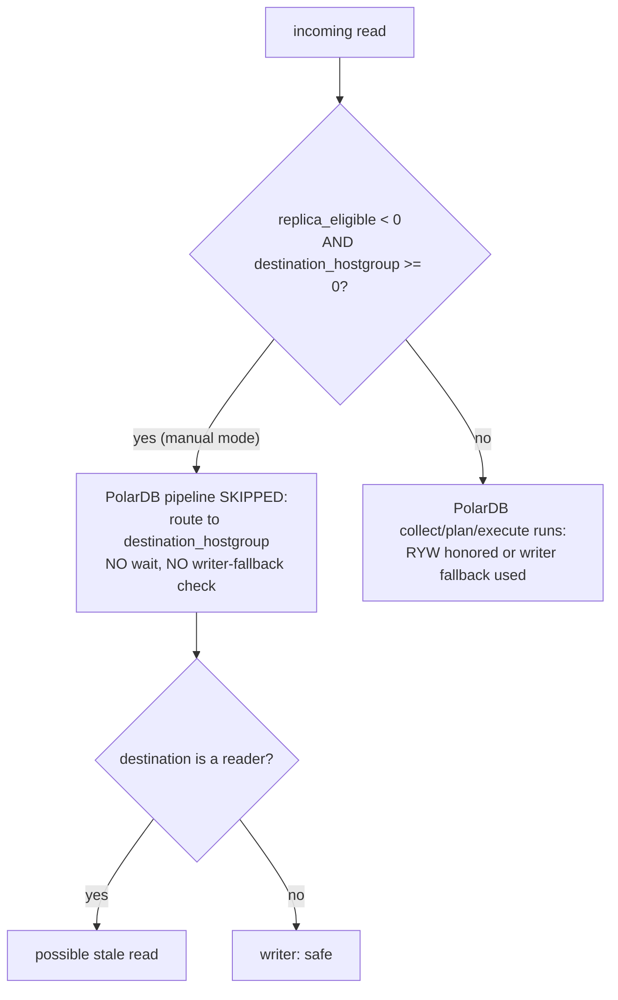
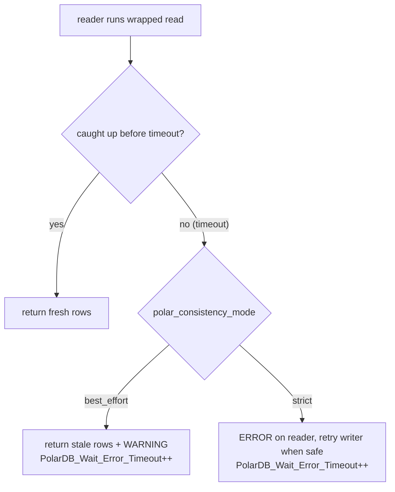

# 17 — Operator Guide

> Scope: how to deploy, configure, and troubleshoot the PolarDB LSN-only read-your-writes (RYW) feature in production, including this feature's RFQ startup/routing policy. | Audience: R/M/O/C (operator-first) | Status: stable | Prereqs: [01-BACKGROUND-AND-DESIGN.md](01-BACKGROUND-AND-DESIGN.md), [04-ADMIN-SCHEMA-AND-CONFIG.md](04-ADMIN-SCHEMA-AND-CONFIG.md), [12-THREADVARS-AND-OBSERVABILITY.md](12-THREADVARS-AND-OBSERVABILITY.md) | Verified against: this branch

---

## 1. What this guide is for

This guide tells a ProxySQL operator how to:

1. Meet the deployment requirements so the feature can work at all (Section 3).
2. Turn on read-your-writes (RYW) consistency for PolarDB read traffic (Section 5).
3. Pick a config recipe for your workload (Section 6).
4. Avoid the one routing trap that silently disables RYW (Section 7, the manual-route caveat).
5. Diagnose problems using the stat counters and the proxy log (Section 8).

It does not re-explain the design. For *why* the feature works the way it does, read [01-BACKGROUND-AND-DESIGN.md](01-BACKGROUND-AND-DESIGN.md). For the full counter semantics, read [12-THREADVARS-AND-OBSERVABILITY.md](12-THREADVARS-AND-OBSERVABILITY.md).

### Terms used in this guide (defined once, used the same way everywhere)

| Term | Plain definition |
|------|------------------|
| **PolarDB** | An Alibaba PostgreSQL-compatible database. It has one **writer** (primary) node that accepts writes, and one or more **reader** (replica) nodes that replay the writer's changes and may lag behind. |
| **LSN** (Log Sequence Number) | A 64-bit number marking a position in PostgreSQL's write-ahead log (WAL). Bigger means newer. A reader that has "replayed up to LSN X" can serve any read whose data was written at or before X. |
| **RYW** (read-your-writes) | The guarantee that after a client writes, its own later reads see that write, even when the read is sent to a reader. |
| **writer / primary** | The node that takes writes. Always up to date. We say "writer" throughout. |
| **reader / replica** | A read-only node that replays the writer's WAL and may lag. We say "reader" throughout. |
| **hostgroup (HG)** | A numbered group of backend servers in ProxySQL. A PolarDB pair links a writer HG and a reader HG in the `pgsql_replication_hostgroups` table. |
| **RFQ** (ReadyForQuery) | The PostgreSQL message a backend sends after each query. With the patched libpq, a PolarDB backend appends its current LSN to RFQ, so ProxySQL learns the LSN with no extra query. |
| **wait wrapper** | A reader-bound read that ProxySQL prefixes with three `SET` statements so the reader blocks until it has replayed past the client's last write LSN before answering. |
| **GUC** | A PostgreSQL runtime setting changed with `SET name = value`. |
| **patched libpq** | The PostgreSQL client library built with ProxySQL's `deps/postgresql/polardb_libpq.patch`. Without it, ProxySQL cannot read the LSN from RFQ. |
| **safe writer fallback** | When any precondition for a safe replica read is missing, ProxySQL does not continue in a weaker mode. It sends the read to the writer, which is always consistent, so RYW is never silently broken. |

---

## 2. The one-paragraph mental model

A client connects through ProxySQL to a PolarDB writer/reader pair. On backend connect, ProxySQL requests RFQ LSN payloads using the configured proxy protocol (`v15` by default, `legacy`, or `off`). When RFQs carry LSN, ProxySQL remembers the session's write and observed positions monotonically. On the client's next protected read, if a query rule marks that read as `replica_eligible` and consistency is enabled, ProxySQL routes the read to a reader and prefixes it with a `SET polar_xact_split_wait_lsn = '<target>'`, where the target is `max(write_lsn, observed_lsn)`. If anything makes that unsafe, `pgsql-polardb_route_rfq_policy=strict` sends the read to the writer; `best_effort` can allow an explicitly accounted degraded reader route without a wait target.

```
client writes ──► writer ──RFQ carries LSN──► ProxySQL records session write LSN
client reads  ──► (replica_eligible + consistency on) ──► reader
                       reader runs:  SET polar_xact_split_wait_lsn='<LSN>'; <read>
                       reader blocks until caught up, then answers ──► client sees its write
```

---

## 3. Deployment requirements

RYW needs three things in place. If any is missing, the feature degrades in a specific, documented way (Section 4).

| Requirement | Why it is needed | How to confirm it |
|---|---|---|
| **A. ProxySQL built with `POLARDB_PROXY=1`** | The whole feature is gated behind this compile flag. With `POLARDB_PROXY=0` every PolarDB declaration and call site compiles out and the binary behaves like upstream ProxySQL. | `POLARDB_PROXY ?= 1` is the default (`Makefile:149`). A `POLARDB_PROXY=1` build has the `pgsql-polardb_*` admin variables and the `replica_eligible` query-rule column; a `POLARDB_PROXY=0` build has neither (schema branches at `include/ProxySQL_Admin_Tables_Definitions.h:310-314`, `:295` vs `:297`). |
| **B. Patched libpq linked into ProxySQL** | RYW reads the writer's LSN from the RFQ message. Vanilla libpq throws those trailing bytes away. The patch adds `PQgetLSN`/`PQhasLSN`/`PQsetPolarSendLSN` and the `getReadyForQuery()` change that captures the LSN. | The patch is applied during the deps build, and **only** when `POLARDB_PROXY=1`: `deps/Makefile:386-388` (`ifeq ($(POLARDB_PROXY),1) ... patch -p0 < ../polardb_libpq.patch`). A `POLARDB_PROXY=0` build links vanilla libpq. |
| **C. Backends are genuine PolarDB** | The `SET polar_xact_split_wait_lsn` GUC and the LSN-on-RFQ behavior exist only in the PolarDB server. A plain PostgreSQL server does not block on that GUC and does not append the LSN. | The monitor's `polardb` health probe reads `polar_node_type()` and the backend LSN (`lib/PgSQL_Monitor.cpp:743`). On a real PolarDB backend the per-query path sees an LSN on RFQ; you can confirm with the counter `PolarDB_Server_LSN_Updates_From_RFQ` growing under stable traffic (Section 8). |

Requirements A and B normally travel together: the default build (`make`) sets `POLARDB_PROXY=1`, which both compiles the feature in and applies the libpq patch. The risk is a **mismatch** — for example a binary built `POLARDB_PROXY=1` but linked against a separately built vanilla libpq. Section 4 describes exactly what that looks like.

### Build commands (operator reference)

```
make                      # release build, POLARDB_PROXY=1 by default -> feature ON + libpq patched
make POLARDB_PROXY=0      # build with the feature compiled out + vanilla libpq
make polardb-check        # clean-builds BOTH tiers, leaves the tree at POLARDB_PROXY=1
```

(The `POLARDB_PROXY` flag becomes `-DPOLARDB_PROXY` in each compile stage: `lib/Makefile:57-58`, `src/Makefile:77-78`. The top-level Makefile forwards it into deps/lib/src.)

---

## 4. What happens WITHOUT each requirement

This is the most important table for an operator. Each missing requirement is handled safely — RYW either does not exist (`POLARDB_PROXY=0`) or the read uses the writer when an automatic LSN-mode read cannot be protected. Manual reader routes remain the operator's responsibility.

| Missing | Symptom | Why | Net effect |
|---|---|---|---|
| **A. `POLARDB_PROXY=0` binary** | No `pgsql-polardb_*` admin variables; `pgsql_replication_hostgroups` has only the 4 upstream columns; `pgsql_query_rules` has no `replica_eligible` column. | The whole feature is compiled out. The binary is the upstream ProxySQL binary. | The feature does not exist. Reads route by ordinary query rules. No RYW. |
| **B. Vanilla libpq (feature compiled in, but LSN parse missing)** | Counter `PolarDB_Server_LSN_Updates_From_RFQ` stays at 0 even under stable traffic. `PolarDB_Write_Missing_LSN` or `PolarDB_Read_Missing_LSN` may increment. | `get_polardb_lsn()` calls `PQhasLSN()`/`PQgetLSN()`; vanilla libpq does not export those / never captures the LSN. | Automatic LSN-mode reads follow `pgsql-polardb_route_rfq_policy` after missing RFQ LSN. **Fix: link the patched libpq and confirm `PolarDB_Server_LSN_Updates_From_RFQ` grows under stable traffic.** |
| **C. Plain PostgreSQL backend (not PolarDB)** | The `SET polar_xact_split_wait_lsn` is an unknown GUC; the backend errors on the wrapper SET, or simply does not block; no LSN on RFQ. | Plain PostgreSQL has none of the PolarDB GUCs or the RFQ-LSN behavior. | RYW cannot work. If the wrapper SET errors, the read errors (the wrapper SET ERROR flows to the client). Do not point this feature at non-PolarDB backends. Use `check_type='read_only'` instead, which disables PolarDB routing for that pair. |

**Key safety property:** in every "missing requirement" case, ProxySQL never *claims* RYW it cannot deliver by silently sending unwrapped reads to a reader when a wait *was required*. The execute stage forces the writer whenever a planned wait cannot be prepared (`polardb_wait_disabled` in `polardb_execute()`), and a failed wrapper build sends a clean error rather than running the read unwrapped (`lib/PgSQL_Session.cpp:3607`). A stale read remains possible only when the operator explicitly bypasses the automatic planner, for example with a manual reader hostgroup route. Manual routes are authoritative and are not given an LSN wait wrapper.

---

## 5. Enabling RYW — step by step

RYW needs three configuration pieces working together: a PolarDB hostgroup pair, a consistency mode, and at least one query rule that marks reads `replica_eligible=1`.

### Step 1 — Define the PolarDB hostgroup pair

Insert a row into `pgsql_replication_hostgroups` with `check_type='polardb'`. Only `check_type='polardb'` turns the LSN/RFQ columns on for that pair. The PolarDB schema is V3_0_4 in this implementation.

| Column | Type / allowed values | Default | Meaning |
|---|---|---|---|
| `writer_hostgroup` | INT, `>=0`, PRIMARY KEY | — | writer (primary) HG id |
| `reader_hostgroup` | INT, `<> writer`, `>=0`, UNIQUE | — | reader (replica) HG id |
| `check_type` | `'read_only'` or `'polardb'` | `'read_only'` | **must be `'polardb'`** for RYW |
| `consistency_mode` | `'default'`, `'off'`, `'lsn'`, `'primary'` | `'default'` | per-pair consistency policy; `'default'` defers to the global knob |
| `max_lag_bytes` | INT | `-1` | per-pair reader lag cap, bytes; `-1` = inherit global, `0` = off, `>0` = cap |
| `lsn_wait_timeout_ms` | INT | `-1` | per-pair wait timeout, ms; `-1` = inherit global, `0` = wait forever, `>0` = explicit |
| `proxy_protocol` | `'default'`, `'v15'`, `'legacy'`, `'off'` | `'default'` | per-pair startup protocol; `default` inherits global `pgsql-polardb_proxy_protocol` |
| `comment` | VARCHAR | `''` | free text |

```sql
INSERT INTO pgsql_replication_hostgroups
  (writer_hostgroup, reader_hostgroup, check_type, consistency_mode)
VALUES (0, 1, 'polardb', 'lsn');
LOAD PGSQL SERVERS TO RUNTIME;
SAVE PGSQL SERVERS TO DISK;
```

Once at least one `check_type='polardb'` pair is loaded to runtime, the master gate `polardb_active` flips true (set from whether the PolarDB hostgroup set is non-empty, `lib/PgSQL_HostGroups_Manager.cpp:1864`). Every PolarDB code path checks this gate first; with no PolarDB pair configured the feature is inert and cheap.

### Step 2 — Choose the consistency mode

The effective mode for each query is resolved by precedence: **session override > per-HG `consistency_mode` > global `pgsql-polardb_consistency_mode`** (resolver `polardb_resolve_consistency_mode`, `include/PgSQL_PolarDB.h:1277`; wired through `polardb_collect()`). A value of `-1`/`'default'` at any non-global tier means "not set, fall through to the next tier".

| Mode | Word value | What it does to reads |
|---|---|---|
| **off** | `off` (int 0) | PolarDB routing does nothing; query rules decide routing as usual. No RYW. |
| **lsn** | `lsn` (int 1) | The RYW mode: an eligible read is routed to a reader and wrapped with the catch-up wait. This is what you want for RYW. |
| **primary** | `primary` (int 3) | All eligible reads are forced to the writer. Strongest consistency, no reader offload. Useful as a safe fallback. |

To enable RYW globally:

```sql
SET pgsql-polardb_consistency_mode = 'lsn';
LOAD PGSQL VARIABLES TO RUNTIME;
SAVE PGSQL VARIABLES TO DISK;
```

(There is no integer mode `2`; that value is the gap where a future CSN mode would sit. See Section 9.)

### Step 3 — Mark reads `replica_eligible`

A read only enters the PolarDB auto-routing pipeline when a query rule sets `replica_eligible=1` on it. This is a tri-state per-rule integer: `-1` = unset, `0` = force the writer, `1` = opt into reader routing (`include/PgSQL_Query_Processor.h:11`; schema `replica_eligible INT CHECK (replica_eligible IN (-1,0,1)) NOT NULL DEFAULT -1` at `include/ProxySQL_Admin_Tables_Definitions.h:295`).

```sql
INSERT INTO pgsql_query_rules
  (rule_id, active, match_digest, replica_eligible, apply)
VALUES (10, 1, '^SELECT', 1, 1);
LOAD PGSQL QUERY RULES TO RUNTIME;
SAVE PGSQL QUERY RULES TO DISK;
```

Only `replica_eligible=1` opts a read into auto reader routing. Anything else (`-1` unset or `0`) leaves the read on the writer path. A client can also force the writer for a single statement with the SQL comment `/* route=primary */` at the start of the query (`force_primary_hint`, `include/PgSQL_Query_Processor.h:84-88`); there is no `/* route=replica */` hint.

### Putting it together — the enable checklist

```
[ ] ProxySQL built POLARDB_PROXY=1 (default)            -> Requirement A
[ ] Patched libpq linked (deps built with the flag)     -> Requirement B
[ ] Backends are genuine PolarDB                         -> Requirement C
[ ] pgsql_replication_hostgroups row, check_type='polardb'  -> polardb_active = true
[ ] consistency_mode resolves to 'lsn' (per-HG or global)
[ ] proxy_protocol resolves to 'v15' or 'legacy' for each LSN group
[ ] >=1 query rule with replica_eligible=1 matching your reads
[ ] LOAD ... TO RUNTIME for servers, variables, and query rules
```

---

## 6. Config recipes

All knobs below are admin variables named `pgsql-polardb_*`. They are stored on the thread config struct (`include/PgSQL_Thread.h:1006-1012`), defaulted in `lib/PgSQL_Thread.cpp:1123-1129`, and read on the hot path from per-thread copies. Set them with `SET pgsql-<name> = <value>` then `LOAD PGSQL VARIABLES TO RUNTIME`.

### The knobs

| Admin variable | Type | Range | Default | Meaning |
|---|---|---|---|---|
| `pgsql-polardb_consistency_mode` | word | `off`\|`lsn`\|`primary` | `off` | global consistency policy (lowest tier) |
| `pgsql-polardb_wait_timeout_mode` | word | `best_effort`\|`strict` | `best_effort` | what a reader does on a wait timeout (see below) |
| `pgsql-polardb_proxy_protocol` | word | `v15`\|`legacy`\|`off` | `v15` | startup parameter dialect for RFQ payload requests |
| `pgsql-polardb_route_rfq_policy` | word | `strict`\|`best_effort` | `strict` | what to do when an RFQ-derived target is unknown |
| `pgsql-polardb_session_lsn_baseline` | word | `observed`\|`primary` | `observed` | first-read SESSION_LSN target source |
| `pgsql-polardb_proxy_identity_host` | string | empty or non-wildcard IP literal | empty | fallback startup identity host |
| `pgsql-polardb_proxy_identity_port` | int | `0..65535` | `0` | fallback startup identity port; `0` = unset |
| `pgsql-polardb_lag_wait_ms` | int | `0..60000` | `1000` | global wait timeout in ms; `0` = wait indefinitely |
| `pgsql-polardb_lag_bytes` | int | `0..INT_MAX` | `0` | global reader lag cap in bytes; `0` = off |
| `pgsql-polardb_lsn_freshness_ms` | int | `100..60000` | `5000` | max age of a cached per-server LSN that routing will still trust |
| `pgsql-polardb_monitor_lsn_updates` | bool | `0`\|`1` | `1` | allow the monitor to refresh the per-server LSN cache |
| `pgsql-polardb_lag_ms` | int | `0` only | `0` | **Reserved in this implementation** — see note below |

Word-value validation rejects unsupported values on `SET`. The configured fallback startup identity is also checked on `SET`: the host may be empty, or a non-wildcard IP literal. A non-empty host can be staged while the port is still `0`, but once the port is set the host/port pair must be usable with port `1..65535`; clear the host before unsetting the port. RFQ-requesting startup profiles (`v15` or `legacy`) require a usable identity from the client endpoint, listener/proxy endpoint, or the configured fallback host/port.

### RFQ startup protocol and first-read baseline

| Setting | Operational effect |
|---|---|
| `pgsql-polardb_proxy_protocol='v15'` | Emit `_polar_proxy_client_host`, `_polar_proxy_client_port`, `_polar_proxy_send_lsn=true`. This is the default. |
| `pgsql-polardb_proxy_protocol='legacy'` | Emit `_polar_origin_client_ip`, `_polar_origin_client_port`, `_polar_send_lsn=true`. |
| `pgsql-polardb_proxy_protocol='off'` | Emit no PolarDB proxy startup params. Reads needing RFQ LSN will skip such pooled connections. |
| `pgsql-polardb_session_lsn_baseline='observed'` | First read-only SESSION_LSN read with no session target can use ordinary reader routing; its RFQ LSN becomes observed for later reads. |
| `pgsql-polardb_session_lsn_baseline='primary'` | First empty-session read tries to use the primary LSN mirror as the target. If the mirror is unknown, `route_rfq_policy` applies. |

Startup requested is not startup confirmed. A backend accepting `_polar_proxy_send_lsn` or `_polar_send_lsn` does not prove it will return RFQ LSN. Watch `PolarDB_Server_LSN_Updates_From_RFQ`, `PolarDB_Write_Missing_LSN`, and `PolarDB_Read_Missing_LSN`.

> **DEFERRED knob — `pgsql-polardb_lag_ms`.** This runtime variable accepts only `0` in this implementation and has **no effect today**: there is no PolarDB millisecond-lag producer wired up yet, and the helper that would consume it is documented as not wired. Do not rely on `pgsql-polardb_lag_ms` for tuning. `PolarDB_LSN_Stale_Count` is still active for the separate byte-lag safety path when `max_lag_bytes` is enabled. See [15-LIMITATIONS-AND-ROADMAP.md](15-LIMITATIONS-AND-ROADMAP.md).

### best_effort vs strict (the timeout-mode decision)

`pgsql-polardb_wait_timeout_mode` controls what the **reader** does when it cannot catch up to the target LSN within the timeout. ProxySQL emits it as `SET polar_consistency_mode = 'best_effort'|'strict'` ahead of the read.

| Mode | On a wait timeout the reader... | The client sees... | RYW guarantee | When to use |
|---|---|---|---|---|
| **best_effort** (default) | returns possibly-stale data and emits a WARNING | the rows, plus one WARNING notice forwarded ahead of the result | **best effort**: under lag the read may be stale | availability-first workloads that tolerate an occasional stale read; the safer default |
| **strict** | raises an ERROR and aborts the reader statement | normally the writer result after one safe retry; otherwise a PostgreSQL ERROR | **enforced**: a stale reader result is never returned | correctness-first workloads that must never read stale data and can accept temporary writer load under lag |

ProxySQL recognizes a real PolarDB wait timeout by a **structured** field, not by matching human-readable text: it checks `PG_DIAG_MESSAGE_DETAIL == "polar_proxy_lsn_wait_timeout"` (the constant `POLARDB_LSN_WAIT_TIMEOUT_DETAIL`, `include/PgSQL_PolarDB.h:100`; compared in `lib/PgSQL_PolarDB_Notices.cpp:107-109` and `lib/PgSQL_Connection.cpp:27-28`). User SQL cannot fake this, so the timeout counters only move on genuine PolarDB wait timeouts.

### Recipe A — Availability-first RYW (recommended starting point)

```sql
SET pgsql-polardb_consistency_mode   = 'lsn';
SET pgsql-polardb_wait_timeout_mode  = 'best_effort';
SET pgsql-polardb_lag_wait_ms        = 1000;     -- wait up to 1s for catch-up
SET pgsql-polardb_lag_bytes          = 0;        -- no hard lag cap
LOAD PGSQL VARIABLES TO RUNTIME; SAVE PGSQL VARIABLES TO DISK;
```

Reads go to readers and wait up to 1 second. If a reader is behind, the read still returns (with a WARNING) rather than failing. Watch `PolarDB_Wait_Error_Timeout` — a rising value means readers are lagging and you are serving some stale reads.

### Recipe B — Correctness-first RYW (strict)

```sql
SET pgsql-polardb_consistency_mode   = 'lsn';
SET pgsql-polardb_wait_timeout_mode  = 'strict';
SET pgsql-polardb_lag_wait_ms        = 2000;     -- give readers more time before writer retry
LOAD PGSQL VARIABLES TO RUNTIME; SAVE PGSQL VARIABLES TO DISK;
```

A read that cannot catch up within 2 seconds does not return stale reader data. If no user result has started, ProxySQL retries the original read once on the writer. `PolarDB_Wait_Error_Timeout` counts the reader timeout; `PolarDB_Wait_Reads_Retried_On_Writer` counts the recovered writer retries. Treat either rising value as a lag incident and expect extra writer load.

### Recipe C — Safe fallback (force writer, no reader offload)

```sql
SET pgsql-polardb_consistency_mode = 'primary';
LOAD PGSQL VARIABLES TO RUNTIME; SAVE PGSQL VARIABLES TO DISK;
```

All eligible reads go to the writer. Strongest consistency, zero stale-read risk, but no read offload. Use this while diagnosing, or when patched libpq / PolarDB backends are not yet in place.

### Tuning the wait timeout (`pgsql-polardb_lag_wait_ms`)

| Value | Effect | Trade-off |
|---|---|---|
| `0` | reader waits **indefinitely** for catch-up | a badly lagging reader can block a read for a long time; only `statement_timeout`/cancel/terminate can stop it |
| small (e.g. 200-500) | reader gives up quickly | more timeouts (best_effort: more stale reads; strict: more writer retries or errors) under any lag |
| moderate (1000-3000) | balanced | the usual choice |

The timeout resolves per-HG first, then global: per-HG `lsn_wait_timeout_ms` if `>0`, `0` means wait forever, otherwise the global `pgsql-polardb_lag_wait_ms`, otherwise the built-in default 1000 ms (`polardb_resolve_wait_timeout_ms`, `include/PgSQL_PolarDB.h:417-423`; call site `lib/PgSQL_PolarDB_Flow.cpp:72`).

### The lag cap (`pgsql-polardb_lag_bytes`) — a safety bound, not the gate

The byte lag cap is a **safety-only** bound on `primary_lsn - reader_lsn`. It is **not** the correctness gate — the wait SET is. When a reader exceeds the cap (or has a stale/missing LSN while a cap is enabled), the read **uses the writer instead of that replica**. The planner attaches the cap to the per-query reader plan, and `get_MyConn_polardb_reader()` enforces it while acquiring the actual reader. Resolution is two-tier: per-HG `max_lag_bytes` if `>=0`, else the global `pgsql-polardb_lag_bytes`. Set a cap if you want to keep very-far-behind readers out of the read path entirely; leave it `0` (off) to rely solely on the wait.

### Query cache (`cache_ttl`) compatibility

`cache_ttl` (the query-result cache) is safe to use with PolarDB. Whenever the session has a consistency obligation — it has done a write, has a pending missing-LSN latch, or runs under a `PRIMARY` first-read baseline — ProxySQL automatically **bypasses the cache on both lookup and store**, so a cached replica result can never be returned in place of an LSN-gated read. The check is per query, so a result cached before a write is never served to a read issued after that write. Reads with no obligation (no prior write in the session, or `consistency_mode=off`) still cache normally. You do not need to special-case `cache_ttl` for consistency tables — just expect that consistency reads are served from the backend, not the cache, by design.

---

## 7. The manual-route caveat (important)

**If a query rule sets a `destination_hostgroup` but leaves `replica_eligible` unset (`-1`), the PolarDB pipeline is skipped entirely for that query — including RYW.**

This is "manual mode". The route hook computes:

```c
int  re   = qpo ? qpo->replica_eligible : -1;
int  dest = qpo ? qpo->destination_hostgroup : -1;
bool manual_mode = (re < 0 && dest >= 0);
if (manual_mode) { /* PolarDB routing skipped */ }
```

(`lib/PgSQL_Session.cpp:2544-2552`.) When `manual_mode` is true, `polardb_collect`/`plan`/`execute` never run, so the read is sent wherever the rule's `destination_hostgroup` points — with **no wait wrapper** and **no writer-fallback safety check**. If that destination is a reader, the read can be stale.

### What this means for an operator

- A rule that pins a read to a hostgroup **and** wants RYW must set `replica_eligible` explicitly:
  - `replica_eligible=1` -> the read enters the PolarDB pipeline (RYW honored).
  - `replica_eligible=0` -> the read is forced to the writer (safe).
- A rule with only `destination_hostgroup` (and `replica_eligible=-1`) bypasses PolarDB. This is fine if the destination is the writer, but **dangerous if it is a reader**, because no catch-up wait is applied.

### Rule of thumb

| Rule sets | `replica_eligible` | Result |
|---|---|---|
| `destination_hostgroup = <writer>` | `-1` (unset) | manual mode; read on writer; safe (writer is consistent) |
| `destination_hostgroup = <reader>` | `-1` (unset) | **manual mode; read on a reader with NO wait — possible stale read** |
| `destination_hostgroup = <reader>` | `0` | PolarDB pipeline runs, forces writer (eligible=0) — safe |
| `match_digest` only, no destination | `1` | PolarDB pipeline runs, RYW honored — the intended setup |

When you mix manual destination rules with PolarDB, audit every rule that points reads at a reader HG and make sure it sets `replica_eligible` to a value you intend. There is currently no counter for "reads that bypassed PolarDB via manual mode"; see [15-LIMITATIONS-AND-ROADMAP.md](15-LIMITATIONS-AND-ROADMAP.md).

---

## 8. Troubleshooting

### 8.1 First, look at the counters

All PolarDB counters live in the admin table `stats_pgsql_global` and are also
exported to Prometheus as `proxysql_polardb_*_total`. SQL values are filled by
`polardb_export_stats()`; Prometheus values are refreshed from the same sources
during metrics collection. Read the SQL view with:

```sql
SELECT * FROM stats_pgsql_global WHERE Variable_Name LIKE 'PolarDB_%';
```

There are **26 exported stat counters** (plus the internal `polardb_active` gate, which is not a stat counter and is not exported):

| Counter | Increment site | What a non-zero / growing value tells you |
|---|---|---|
| `PolarDB_Server_LSN_Updates_From_RFQ` | process_result | ProxySQL is reading LSNs off RFQ and accepting them for the current writer group+epoch. Should grow under stable PolarDB traffic that returns RFQ LSN. **Stuck at 0 = no LSN on RFQ, patched libpq not active, startup profile did not request RFQ LSN, backends not PolarDB, or result processing rejected stale/missing writer group/epoch RFQs.** |
| `PolarDB_LSN_Updates_From_Monitor` | `lib/PgSQL_Monitor.cpp:1947` | The monitor is refreshing per-server LSNs between queries. Growing = healthy background refresh. 0 = monitor LSN updates off, or no LSN advance seen, or no PolarDB HG. |
| `PolarDB_Monitor_Health_Invalid_Role` | `lib/PgSQL_Monitor.cpp:838` | A monitor `polar_proxy_status`/health row reported a role ProxySQL cannot route to (node_type UNKNOWN, including PolarDB `POLAR_UNKNOWN`/`POLAR_STANDALONE_DATAMAX`). Growing = nodes without an established routable role; the monitor applies fail-safe defaults and logs a `proxy_warning`. |
| `PolarDB_Monitor_Health_Invalid_Values` | `lib/PgSQL_Monitor.cpp:842` | A monitor health row had invalid availability or LSN text. Growing = invalid or unexpected health output from a backend; the monitor applies fail-safe defaults and logs a `proxy_warning`. |
| `PolarDB_LSN_Stale_Count` | `lib/PgSQL_HostGroups_Manager.cpp` reader acquisition | Active for byte-lag enforcement. It increments when an enabled `max_lag_bytes` check sees missing or stale primary/reader LSN state. The deferred millisecond-lag branch is still guarded by `POLARDB_PROXY_TODO`. |
| `PolarDB_Write_Missing_LSN` | process_result | Writer query completed without RFQ LSN; automatic LSN-mode reads in that session follow `route_rfq_policy` until a primary-sourced RFQ clears the latch. |
| `PolarDB_Read_Missing_LSN` | process_result | Tracked SESSION_LSN read completed without RFQ LSN; automatic LSN-mode reads in that session follow `route_rfq_policy` until a primary-sourced RFQ clears the latch. |
| `PolarDB_Primary_LSN_Unknown` | plan | `session_lsn_baseline=primary` needed a primary mirror target but the mirror was empty. |
| `PolarDB_RFQ_Best_Effort_Degraded_Routes` | plan | `route_rfq_policy=best_effort` allowed an eligible simple-query reader route without an RFQ-derived wait target. Growing means degraded consistency was explicitly served; clients also receive a WARNING `NoticeResponse` before the result. |
| `PolarDB_Consistency_Writer_Fallback` | dispatch | A consistency read failed closed to the writer during reader acquisition. Growing means offload was lost because readers were missing/stale/over-lagged, the primary mirror was unknown under a cap, or strict RFQ requirements were not met. |
| `PolarDB_Wait_Reads_Retried_On_Writer` | session dispatch | A wait-wrapped reader query was retried once on the writer after strict wait timeout or reader connection loss, before any user result reached the client. Growing means reader-side failures were recovered by the writer. |
| `PolarDB_Wait_Error_Connection_Lost` | session dispatch | A wait-wrapped reader lost its backend connection before any user result reached the client. Growing means reader connections are failing while serving protected reads. |
| `PolarDB_RFQ_Profile_Skipped` | pool acquisition | A pooled connection whose startup profile did not request RFQ LSN was skipped for a read requiring RFQ LSN. |
| `PolarDB_RFQ_Profile_Evicted` | pool acquisition | Incompatible free pooled connections were evicted to make room for newly created RFQ-LSN-capable backends. |
| `PolarDB_TL_Cache_Bypassed_For_Target` | pool acquisition | A targeted read bypassed the thread-local backend cache so RFQ/profile filtering and consistency-target reader preference could run. |
| `PolarDB_Target_LSN_Preferred` | reader acquisition | A reader with fresh cached LSN at or beyond the target was preferred and acquired. |
| `PolarDB_Target_LSN_Fallback_Wait` | reader acquisition | Selection fell back to the full candidate set and relied on the wait wrapper. |
| `PolarDB_Session_Target_Epoch_Reset` | collect/process_result | A session observed a writer group or epoch change and discarded existing LSN targets or missing-LSN latches from the old scope. |
| `PolarDB_Session_LSN_Routing` | `lib/PgSQL_PolarDB_Flow.cpp:433` | Reads are being routed to readers with a wait. Growing = RYW routing is happening. 0 with read traffic = reads not getting the wait path (no write LSN yet, consistency off, or all reads forced to writer). |
| `PolarDB_Wait_Wrap_Prepared` | `lib/PgSQL_PolarDB_Flow.cpp:451` | The wait-wrapper intent was prepared. Should track `PolarDB_Session_LSN_Routing` 1:1. |
| `PolarDB_Wait_Wrap_Bypassed` | backend acquisition | The selected reader already reached the consistency target, so ProxySQL cleared the staged wait and did not build the wrapper. Growing means healthy readers are avoiding wait latency. |
| `PolarDB_Wait_LSN_Sent` | `lib/PgSQL_PolarDB_Wrap.cpp:244` | The wait wrapper was actually built and put on the wire. `Prepared - Sent` includes bypassed waits plus any safety aborts. |
| `PolarDB_Wait_LSN_Sum_Us` | `lib/PgSQL_PolarDB_Wrap.cpp:272` | Total microseconds spent in LSN waits. Divide by `PolarDB_Wait_LSN_Sent` for average wait latency. A rising average means readers are lagging. |
| `PolarDB_Wait_Wrap_Safety_Abort` | `lib/PgSQL_PolarDB_Wrap.cpp:185` | **Should be 0.** Non-zero = the wrapper could not be built and the read failed closed to the writer. Each one is also logged via `proxy_error`. Investigate the proxy log. |
| `PolarDB_Wait_Error_Timeout` | `lib/PgSQL_PolarDB_Wrap.cpp:298` | A genuine wait timeout was charged (reader did not catch up within the timeout). best_effort: stale data served + WARNING. strict: writer retry when safe, otherwise error. Rising = replication lag or too-tight timeout. |
| `PolarDB_Wait_Error_LSN_Wait_Timeout` | `lib/PgSQL_PolarDB_Wrap.cpp:300` | The LSN subset of the timeout total. In this LSN-only build it equals `PolarDB_Wait_Error_Timeout`. |

For full counter semantics and lockstep relationships, see [12-THREADVARS-AND-OBSERVABILITY.md](12-THREADVARS-AND-OBSERVABILITY.md).

### 8.2 The troubleshooting table (symptom -> counter/log -> cause -> fix)

| Symptom | Counter / log signal | Likely cause | Fix |
|---|---|---|---|
| Reads return stale data; client does not see its own writes | `PolarDB_Server_LSN_Updates_From_RFQ` = 0 under write traffic, missing-LSN counters grow with `route_rfq_policy=best_effort`, or clients see a degraded RFQ WARNING notice | RFQ LSN is not being returned or degraded simple-query routing is enabled | Rebuild/link patched libpq, verify `proxy_protocol`, and confirm backend RFQ LSN support. For safety, set `pgsql-polardb_route_rfq_policy='strict'` or `pgsql-polardb_consistency_mode='primary'` |
| Reads return stale data; LSN counters DO grow | `PolarDB_Server_LSN_Updates_From_RFQ` > 0 but `PolarDB_Session_LSN_Routing` = 0 | Reads are not entering the PolarDB pipeline: consistency `off`, no `replica_eligible=1` rule, or the **manual-route caveat** (Section 7) | Set `consistency_mode='lsn'`; add a `replica_eligible=1` rule; audit any rule that pins reads to a reader HG without `replica_eligible` |
| RYW routing happens but `Sent + Bypassed` lags `Prepared` | `PolarDB_Wait_Wrap_Prepared` > `PolarDB_Wait_LSN_Sent + PolarDB_Wait_Wrap_Bypassed`; `PolarDB_Wait_Wrap_Safety_Abort` > 0; `proxy_error` "PolarDB WRAP: finalize failed" (`lib/PgSQL_PolarDB_Wrap.cpp:186`) | The wait wrapper could not be built (missing backend conn, empty query); the session forces the writer instead of sending an unwrapped replica read | Check the proxy error log for the printed reason. These reads went to the writer safely; investigate why the wrapper build failed |
| Protected reads add writer load | `PolarDB_Wait_Reads_Retried_On_Writer` rising with `PolarDB_Wait_Error_Timeout` or `PolarDB_Wait_Error_Connection_Lost` | Readers cannot catch up within `pgsql-polardb_lag_wait_ms`, or reader connections are failing during protected reads; safe reads are retried on the writer | Reduce replication lag, raise `pgsql-polardb_lag_wait_ms`, investigate reader connection stability, or temporarily force reads to writer if the retry load is too high |
| Clients get errors on strict reads | `PolarDB_Wait_Error_Timeout` rising without matching `PolarDB_Wait_Reads_Retried_On_Writer`, or writer execution errors after retry | The reader timed out but retry was unsafe/unavailable, or the writer query itself failed | Check writer availability, whether results had already started, and whether the writer hostgroup was known; then tune lag or timeout |
| Average read latency climbing | `PolarDB_Wait_LSN_Sum_Us / PolarDB_Wait_LSN_Sent` rising | Readers are lagging; reads block longer waiting for catch-up | Address replication lag; consider a `max_lag_bytes` cap to keep far-behind readers out of the read path; or temporarily `consistency_mode='primary'` |
| Some reads suddenly all go to the writer | `PolarDB_Consistency_Writer_Fallback` grows, possibly with `PolarDB_LSN_Stale_Count`; `PolarDB_Session_LSN_Routing` may flatten | A reader exceeded `max_lag_bytes`, had a stale/missing LSN under an enabled cap, primary LSN was unknown, or strict RFQ requirements could not be satisfied | Expected safety behavior. Reduce lag, raise/disable `max_lag_bytes`, fix RFQ capability/profile issues, or accept the writer fallback until readers recover |
| First read with `session_lsn_baseline=primary` does not wait | `PolarDB_Primary_LSN_Unknown` grows | The primary LSN mirror is empty; route policy chose writer or degraded reader path | Wait for monitor/RFQ primary LSN to populate, use `observed`, or keep `route_rfq_policy='strict'` |
| High `PolarDB_RFQ_Profile_Skipped` | counter grows during RFQ-required reads | Pool contains connections created with protocol `off` or old profile settings | If `PolarDB_RFQ_Profile_Evicted` also grows, the pool is converging under demand. If only skipped grows, creation may be throttled, pooled-only acquisition may be in use, or compatible capacity may already exist. Verify per-HG/global `proxy_protocol` |
| High `PolarDB_Target_LSN_Fallback_Wait` | counter grows while wait latency also grows | No fresh cached reader at target was acquired; correctness relies on backend wait | Expected under lag. Investigate replica lag, freshness window, and monitor/RFQ LSN updates |
| `SET` errors / read errors on every eligible read | client sees an ERROR on a `SET polar_*` statement | Backends are not genuine PolarDB (Requirement C); they reject the PolarDB GUCs | Point the pair at real PolarDB backends, or set the pair's `check_type='read_only'` to disable PolarDB routing |
| `PolarDB_LSN_Updates_From_Monitor` = 0 although traffic flows | monitor LSN counter flat | `pgsql-polardb_monitor_lsn_updates=0`, or the monitor sees no LSN advance, or no PolarDB HG configured | Set `pgsql-polardb_monitor_lsn_updates=1`; confirm a `check_type='polardb'` pair is loaded to runtime |
| `PolarDB_LSN_Stale_Count` grows | counter rising with `max_lag_bytes` enabled | Reader acquisition rejected a primary/reader sample because the LSN was missing or stale | Check monitor/RFQ LSN flow, freshness window, and whether replicas are reporting current LSNs |
| `SET pgsql-polardb_consistency_mode=<x>` rejected | `proxy_error` "Invalid value ... (allowed: off, lsn, primary)" (`lib/PgSQL_Thread.cpp:1755`) | A word knob was set to an unsupported value | Use only `off`/`lsn`/`primary` (consistency) or `best_effort`/`strict` (timeout mode) (`lib/PgSQL_Thread.cpp:1749-1766`) |
| `LOAD PGSQL SERVERS TO RUNTIME` or `LOAD PGSQL VARIABLES TO RUNTIME` warns about `consistency_mode=lsn` with `proxy_protocol=off` | `proxy_warning` names the writer/reader hostgroup pair | The per-HG row disables RFQ startup directly, or inherits global `pgsql-polardb_proxy_protocol='off'` | Set the row or global protocol to `v15`/`legacy`, or use `consistency_mode='primary'` if reader RYW is not intended |
| Feature seems entirely absent (no `pgsql-polardb_*` vars, no `replica_eligible` column) | admin tables lack the columns | Binary built `POLARDB_PROXY=0` (Requirement A) | Rebuild with the default `make` (`POLARDB_PROXY=1`) |

### 8.3 Reading the proxy log

Two `proxy_error` log lines are the most useful for operators (they fire regardless of trace level):

- **Wrapper build failure:** `"PolarDB WRAP: finalize failed: <reason>, sess=<ptr>"` (`lib/PgSQL_PolarDB_Wrap.cpp:186`). Paired with `PolarDB_Wait_Wrap_Safety_Abort++`. The `<reason>` tells you why (missing connection, empty query, etc.).
- **Knob rejected on SET:** `"Invalid value '<v>' for pgsql-polardb_consistency_mode (allowed: off, lsn, primary)"`, the matching `pgsql-polardb_wait_timeout_mode` line, and fallback identity errors for invalid/wildcard host+port pairs.
- **Config load warning:** `"PolarDB replication hostgroup writer=<w> reader=<r> resolves consistency_mode=lsn but effective proxy_protocol=off"` means the row will not request RFQ LSN in startup parameters.

The result-processing path's "no LSN on RFQ" message (the requirement-B signal) is **not** an always-on log: it goes through the `POLARDB_TRACE` macro, which expands to `proxy_info()` only in a `POLARDB_DEBUG=1` build and to nothing in a release build (`include/PgSQL_PolarDB.h:69-80`; the trace itself at `lib/PgSQL_PolarDB_Flow.cpp:522-530`). In a normal release build the main signal for requirement B is `PolarDB_Server_LSN_Updates_From_RFQ` staying at 0 while missing-LSN counters move (Section 8.1). All detailed per-query routing decisions are likewise `POLARDB_TRACE` and off by default; build a trace binary with `make polardb-debug` (= `POLARDB_PROXY=1 POLARDB_DEBUG=1`) if you need them.

---

## 9. Notes, scope, and what is NOT here

- **CSN / global consistency is not in this build.** The integer consistency mode `2` is intentionally skipped; the words `csn`, `session`, `global` are not accepted by the schema (only `default`/`off`/`lsn`/`primary`). CSN is a future, experimental feature that requires PolarDB backend support and applies only in a global-consistency mode that does not exist here. See [15-LIMITATIONS-AND-ROADMAP.md](15-LIMITATIONS-AND-ROADMAP.md) and [18-FUTURE-CSN-DESIGN.md](18-FUTURE-CSN-DESIGN.md).
- **Transaction split, general reader-failure retry, and pool warmup are not in this build.** Reads inside an explicit transaction are forced to the writer (action reason `IN_TRANSACTION`). The retry foundation present here is limited to autocommit wait-wrapped reads that fail before any user result because of strict LSN wait timeout or reader connection loss. Extended protocol is not wait-wrapped in this implementation: manual reader routes are honored; automatic extended reads without prior write LSN may use reader; automatic extended reads after a known write/observed LSN target or unknown RFQ target use writer. See [19-FUTURE-TXN-SPLIT-DESIGN.md](19-FUTURE-TXN-SPLIT-DESIGN.md), [20-FUTURE-READER-FAILURE-RETRY-DESIGN.md](20-FUTURE-READER-FAILURE-RETRY-DESIGN.md), [21-FUTURE-OTHER-CAPABILITIES.md](21-FUTURE-OTHER-CAPABILITIES.md).
- **`pgsql-polardb_lag_ms` is inert today** (no producer). `PolarDB_LSN_Stale_Count` is active for byte-lag stale/missing samples when `max_lag_bytes` is enabled; do not use it as a millisecond-lag signal (Section 6 note; `include/PgSQL_PolarDB.h:504`, `:536`).
- **Observability gaps to be aware of:** there is now a counter for consistency reader-acquisition fallback to writer and a counter for selected-reader wait bypass, but there is still no generic FORCE_PRIMARY reason breakdown, no counter for manual-mode bypass, no explicit wait-success counter beyond `PolarDB_Wait_LSN_Sent`, and no per-server LSN/lag gauge in stats. Some of these are tracked as roadmap items in [15-LIMITATIONS-AND-ROADMAP.md](15-LIMITATIONS-AND-ROADMAP.md).

---

## Appendix: Mermaid diagrams

### Diagram 1 — RYW data flow (Section 2)



### Diagram 2 — Enable checklist as a decision flow (Sections 3 and 5)



### Diagram 3 — The manual-route caveat (Section 7)



### Diagram 4 — best_effort vs strict on a wait timeout (Section 6)



---

Verified against this branch.
