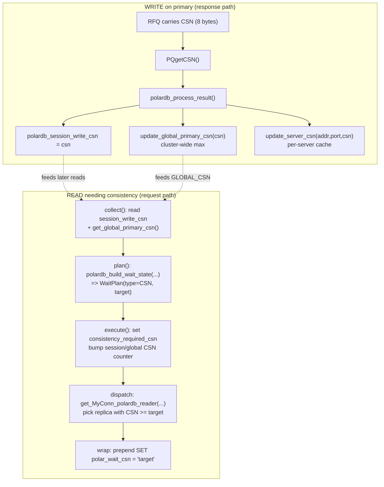
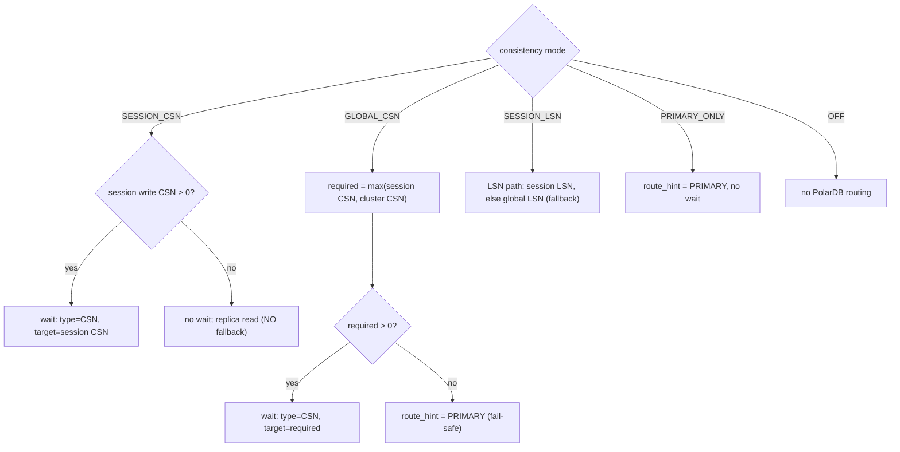
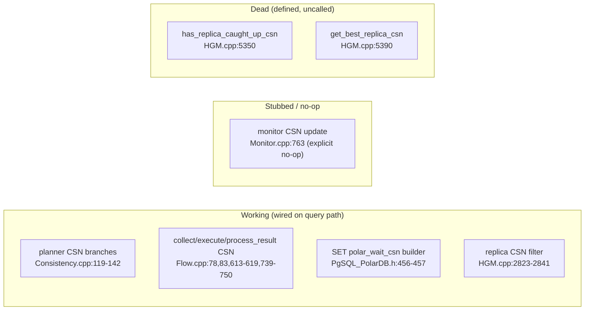

# 18 — Future: CSN Global-Consistency (Experimental)

> Scope: what a commit sequence number (CSN) is, the structures and flow that implement CSN consistency in the full implementation, how it would extend the LSN-only feature's collect/plan/execute/process_result pipeline and the wait condition, the schema, knobs, and counters it adds, and the risks — all as a delta from the current LSN-only feature. | Audience: R/M/O/C | Status: stable (describes an experimental, not-shipped feature) | Prereqs: [01-BACKGROUND-AND-DESIGN.md](01-BACKGROUND-AND-DESIGN.md), [06-ROUTING-PIPELINE.md](06-ROUTING-PIPELINE.md), [07-QUERY-WRAPPING.md](07-QUERY-WRAPPING.md), [09-PUBLISH-AND-WRITE-TRACKING.md](09-PUBLISH-AND-WRITE-TRACKING.md), [15-LIMITATIONS-AND-ROADMAP.md](15-LIMITATIONS-AND-ROADMAP.md) | Verified against: this branch

---

## 0. Read this first: status and two warnings

**This feature is NOT in this implementation.** This implementation is LSN-only. It has no CSN runtime path: `lib/PgSQL_PolarDB_Flow.cpp` contains no CSN handling, and the only CSN names in the active surface are reserved request-bit vocabulary. This document describes CSN as it exists in the **full implementation** and frames it as a future addition (a "delta") on top of this LSN-only implementation.

**Warning 1 — CSN is experimental and incomplete.** Three things are true and stated throughout this document:
1. CSN requires PolarDB backend support. The proxy sends a server-side wait command (`SET polar_wait_csn = '<target>'`); only a PolarDB backend that understands that command can honor it.
2. CSN is only meaningful in **global-consistency mode** as a cross-session feature. (The per-session CSN mode also exists but adds little over LSN; see Section 3.)
3. CSN-wait behavior is **not reliably verified**. No build or backend run was performed. Some CSN code in the full implementation is real and wired; other CSN code is a no-op stub or is defined but never called. This document keeps those two categories clearly separate (see Section 12).

**Warning 2 — line numbers differ between the two source trees.** The full implementation and this LSN-only branch are different code. The same symbol sits at a different line in each. Every citation below is tagged with its tree:
- **(full implementation)** = the full implementation — the CSN feature lives here.
- **(this implementation)** = the LSN-only baseline.

Do not look up a "(full implementation)" line number in the LSN-only tree; it will point at the wrong code.

---

## 1. Table of contents

(Section 2 is intentionally absent: this list is Section 1, and Section 3 follows. The numbers below match the section headers in the body exactly.)

- **Section 0** — Read this first: status and two warnings
- **Section 1** — Table of contents (this list)
- **Section 3** — What CSN is, in plain words
- **Section 4** — CSN versus LSN — the core differences
- **Section 5** — New state CSN adds (delta from the LSN-only feature)
- **Section 6** — The request/response flow — which LSN-only hooks CSN extends
- **Section 7** — The wait planner — exact CSN logic
- **Section 8** — The wait mechanism — the server-side GUCs
- **Section 9** — Schema changes (delta)
- **Section 10** — New knobs (thread variables)
- **Section 11** — New counters (stats)
- **Section 12** — Producer and consumer of the cluster-wide CSN
- **Section 13** — Working logic versus stubbed or dead logic
- **Section 14** — Risks and open questions
- **Section 15** — The minimal CSN re-add checklist
- **Section 16** — Status summary
- **Section 17** — Appendix: Mermaid diagrams

---

## 3. What CSN is, in plain words

First, the terms this document uses. Each is defined once here and used the same way everywhere.

| Term | Definition |
|---|---|
| **WAL (write-ahead log)** | PostgreSQL/PolarDB's append-only log of every change. Replicas replay it to catch up to the primary. |
| **LSN (log sequence number)** | A 64-bit **byte offset** into the WAL. Larger means more recent. It measures *how far the WAL has been written or replayed*. PolarDB exposes it as a string like `"0/1234ABCD"` and parses it with `PolarDB_Protocol::parse_lsn_string` (`include/PgSQL_PolarDB.h:421` (full implementation)). |
| **CSN (commit sequence number)** | A 64-bit **counter that PolarDB increments once per commit**. It measures *how many commits have happened*, not how many WAL bytes. It does **not** move in the middle of a transaction — only at commit. |
| **RFQ (ReadyForQuery)** | The PostgreSQL wire message a backend sends when it is ready for the next query. With the PolarDB libpq patch, the backend appends its current LSN — and, for CSN, its current CSN — to this message, so the proxy learns both values with no extra query. |
| **Read-after-write consistency** | The rule that after a session writes, a later read must not land on a replica that is "behind" that write. The proxy enforces this by telling the replica to wait until it has reached a required position before answering. |
| **Writer / primary** | The backend that accepts writes; always up to date. (Used interchangeably.) |
| **Reader / replica** | A read-only backend that replays the primary's WAL and may lag. (Used interchangeably.) |
| **Hostgroup (HG)** | A ProxySQL numbered group of backend servers. A PolarDB replication-hostgroup row pairs a writer HG with a reader HG. |
| **Session** | One client connection to ProxySQL and the state ProxySQL keeps for it. |
| **GUC** | A PostgreSQL runtime setting changed with `SET name = value`. CSN uses the GUC `polar_wait_csn`. |

**The one-sentence definition.** CSN consistency makes a read wait until the chosen replica has applied *at least N commits*, where N is a commit-sequence-number target the proxy supplies, instead of waiting until the replica has applied *up to byte offset X in the WAL* (which is what LSN consistency does).

**Why anyone would want CSN over LSN.** CSN's value over LSN is **commit-counting semantics**, not the cross-session ("global") mode by itself — this implementation already offers global consistency over LSN via `GLOBAL_LSN` (`max(session target, group LSN)`). This implementation's `SESSION_LSN` mode is per-session: it guarantees that *your* session sees *your own* writes, while `GLOBAL_LSN` extends that across sessions. Global CSN consistency guarantees that *any* session's read sees *all* commits that have happened cluster-wide up to now, not just its own — the same cross-session guarantee `GLOBAL_LSN` gives, but counted in commits rather than WAL bytes, useful when one client writes and a *different* client must immediately read that write.

**Two CSN modes.** The full implementation defines two CSN consistency modes, on top of this implementation's single `SESSION_LSN` mode:

| Mode (int) | Enum name | What it guarantees | Where the wait target comes from |
|---|---|---|---|
| 2 | `SESSION_CSN` (`POLARDB_CONSISTENCY_CSN`) | Read-your-own-writes, per session, but counted in commits | this session's last write CSN |
| 4 | `GLOBAL_CSN` (`POLARDB_CONSISTENCY_CSN_GLOBAL`) | Read-all-committed, across all sessions | `max(this session's write CSN, the cluster-wide primary CSN)` |

The enum values are `SESSION_CSN = 2` and `GLOBAL_CSN = 4` in `PolarDB_ConsistencyMode` (`include/PgSQL_PolarDB.h:77`, `:79` (full implementation)). The matching integer constants are `POLARDB_CONSISTENCY_CSN` and `POLARDB_CONSISTENCY_CSN_GLOBAL` in `include/PgSQL_Thread.h:61`, `:63` (full implementation).

Note the gap in the numbering: the full implementation's modes are 0 (`OFF`), 1 (`SESSION_LSN`), 2 (`SESSION_CSN`), 3 (`PRIMARY_ONLY`), 4 (`GLOBAL_CSN`). This implementation now defines 0, 1, 2, and 3 in its `PolarDB_ConsistencyMode` enum body (`include/PgSQL_PolarDB.h:1162-1167` (this implementation)) — with **2 = `GLOBAL_LSN`** — and its integer-to-enum function `polardb_consistency_from_int` (`include/PgSQL_PolarDB.h:1172-1184` (this implementation)) accepts 0/1/2/3. Note the collision: value 2 is now `GLOBAL_LSN`, so the full implementation's `SESSION_CSN = 2` (and, by extension, `GLOBAL_CSN = 4`) can no longer be re-added at those exact slots; a CSN merge must pick free values.

---

## 4. CSN versus LSN — the core differences

This table is the main part of the delta. It compares what this implementation does with LSN against what the full implementation does with CSN, row by row.

| Aspect | LSN (this implementation, shipped) | CSN (full implementation, experimental) |
|---|---|---|
| Unit | WAL byte offset | commit counter |
| What it measures | how far the WAL is written/replayed | how many commits have happened |
| Wire delivery | 8 bytes in RFQ, after the message type byte | 8 bytes in RFQ, **immediately after the LSN bytes** (`deps/postgresql/polardb_libpq.patch:341-354` (full implementation)) |
| libpq getter | `PQgetLSN` / `PQhasLSN` | `PQgetCSN` / `PQhasCSN` (`deps/postgresql/polardb_libpq.patch:191-192` (full implementation)) |
| Server-side wait command (GUC) | `SET polar_xact_split_wait_lsn = '<target>'` | `SET polar_wait_csn = '<target>'` (`include/PgSQL_PolarDB.h:457` (full implementation)) |
| Cross-session ("global") mode | **used** — `GLOBAL_LSN` = `max(session target, group LSN)` | `GLOBAL_CSN` = `max(session, cluster)` |
| Advances mid-transaction? | yes (each write moves the LSN) | **no** — CSN only moves at commit |
| Session fallback to a global value | no: target-free `SESSION_LSN` may read a replica and learns its first positioned RFQ; `GLOBAL_LSN` is the separate cross-session mode | **no for `SESSION_CSN`**: if the session has not committed, there is no wait at all; `GLOBAL_CSN` uses the cluster CSN directly |

The reference full implementation made `SESSION_LSN` fall back to a global LSN,
but the current branch deliberately does not: target-free `SESSION_LSN` and
cross-session `GLOBAL_LSN` are separate policies. A CSN merge must follow the
current branch's separation rather than copying that historical asymmetry.

**The mid-transaction rule matters for transaction-split.** Because CSN only moves at commit, a read that runs *inside* an open transaction has no meaningful committed CSN to wait on. The full implementation's transaction-split path (see [19-FUTURE-TXN-SPLIT-DESIGN.md](19-FUTURE-TXN-SPLIT-DESIGN.md)) deliberately uses the transaction's LSN and sets the CSN target to 0 for split reads (`lib/PgSQL_PolarDB_Flow.cpp:410-413` (full implementation)). So CSN and transaction-split affect each other; a CSN re-add must keep this special case for split reads.

---

## 5. New state CSN adds (delta from the LSN-only feature)

The current LSN-only tree already has the ownership boundaries CSN needs:
`PolarDB_SessionConsistency` owns durable per-session target state, and
`PolarDB_WaitSpec` owns the wait payload shape copied through plan, execute,
and wrap. CSN should extend those boundaries with parallel CSN fields and a CSN
wait type; it should not add a second planning pipeline.

### 5a. Per-session fields (`include/PgSQL_Session.h` (full implementation))

| Field | Line (full implementation) | Purpose | LSN-only equivalent (LSN) |
|---|---|---|---|
| `polardb_session_write_csn` | `:652` | The highest CSN this session has committed. The read-your-writes target for CSN. | `polardb_session_consistency.write_lsn` (`:650` full implementation) |
| `polardb_query.reader_plan.required_csn` | `:654` | The CSN the next read must reach. One value per query (one-shot). | `polardb_query.reader_plan.consistency_target_lsn` (`:653` full implementation) |

### 5b. Per-server cache (on the backend-server class in `include/PgSQL_HostGroups_Manager.h` (full implementation))

| Field | Line (full implementation) | Purpose | LSN-only equivalent (LSN) |
|---|---|---|---|
| `std::atomic<uint64_t> polardb_current_csn` | `:335` | The last CSN seen on this backend server. | `polardb_current_lsn` |
| `std::atomic<...> csn_updated_at` | `:336` | When that CSN was last set; used for freshness. | `lsn_updated_at` |

### 5c. Cluster-wide ("global") CSN (inside `status` in `include/PgSQL_HostGroups_Manager.h` (full implementation))

This is the state that makes the *global* mode possible. This implementation
already has the LSN equivalent: `GLOBAL_LSN` waits on `max(session target,
group LSN)`, reads the group observation through `get_polardb_group_lsn()`, and
combines it with `polardb_target_with_global_lsn()`. CSN's cluster state doubles
this existing global concept rather than introducing the first one.

| Field | Line (full implementation) | Purpose |
|---|---|---|
| `std::atomic<uint64_t> global_primary_csn` | `:915` | The highest CSN any writer has reported, across the whole cluster. |
| `std::atomic<...> global_primary_csn_updated_at` | `:916` | Freshness timestamp for the global CSN. |

### 5d. Request-scoped routing structs

The full implementation's request structs already carry CSN slots:

| Field | Line (full implementation) | Purpose |
|---|---|---|
| `PolarDB_Query_RouteCtx.session_write_csn` | `:649` | snapshot of the session's write CSN for this query |
| `PolarDB_Query_RouteCtx.global_primary_csn` | `:651` | snapshot of the cluster CSN for this query |
| `PolarDB_Query_RoutePlan.filter_min_csn` | `:727` | the minimum CSN a replica must have to be picked |
| `PolarDB_WaitType::CSN` | `:55` | a new wait type value alongside `LSN` |
| `PolarDB_WaitRuntime.target_csn` | `:181` | the CSN value to wait for, when `wait_type == CSN` |

A useful structural detail: this implementation already has a shared `PolarDB_WaitSpec.target` field for the LSN wait value. The full implementation used the same shape for CSN by adding a CSN wait type and deriving the CSN-specific value only at the emission boundary. So a CSN merge should extend the wait spec; it should not introduce a second parallel wait pipeline.

**State delta summary:** 2 session fields + 2 per-server fields + 2 cluster fields + the request-struct slots = the 7 persistent CSN fields a re-add must reintroduce (the 2 session, 2 per-server, 2 cluster, plus the wait-type enum value). The request-struct slots already exist in the full implementation.

---

## 6. The request/response flow — which LSN-only hooks CSN extends

CSN does **not** add a new pipeline stage. This implementation's pipeline is `collect → plan → execute → process_result`, plus the wait-wrapper layer and the backend-pick (dispatch) step. CSN extends each existing stage. (For the LSN-only stages themselves, see [06-ROUTING-PIPELINE.md](06-ROUTING-PIPELINE.md), [07-QUERY-WRAPPING.md](07-QUERY-WRAPPING.md), and [09-PUBLISH-AND-WRITE-TRACKING.md](09-PUBLISH-AND-WRITE-TRACKING.md).)

Here is the whole CSN data path, write side then read side:

```
WRITE on the primary (response path):
  RFQ carries CSN (8 bytes) ──► get_polardb_csn() [wraps libpq PQgetCSN()] ──► polardb_process_result()
       ├─ polardb_session_write_csn = csn                 (this session's RYW target)
       ├─ update_global_primary_csn(csn)                  (cluster-wide max)
       └─ update_server_csn(addr, port, csn)              (per-server cache)

READ that needs consistency (request path):
  collect():  read polardb_session_write_csn
              + PgHGM->get_global_primary_csn()    ──► RouteCtx (session/global CSN)
  plan():     polardb_build_wait_state(mode, snapshot, global_csn, global_lsn)
                                                   ──► WaitPlan(type=CSN, target=...)
  execute():  set polardb_query.reader_plan.required_csn from plan.wait_spec.target
              bump the session/global CSN routing counter
  dispatch:   get_MyConn_polardb_reader(hg, sess, consistency_target_lsn, required_csn, ...)
                                                   ──► pick a replica whose CSN ≥ target
  wrap:       prepend  "SET polar_wait_csn = '<target>';"  (+ optional timeout GUC)
```

The per-stage extension points:

| Stage | LSN-only hook (function) | What CSN adds | File:line (full implementation) |
|---|---|---|---|
| **collect** | `PgSQL_Session::polardb_collect` | also fills `route_ctx.session_write_csn` and `route_ctx.global_primary_csn = PgHGM->get_global_primary_csn()` | `lib/PgSQL_PolarDB_Flow.cpp:78`, `:83` |
| **plan** | `PgSQL_Session::polardb_plan` → `polardb_build_wait_state` | for non-split reads, copies the session write CSN into the snapshot; the planner emits a CSN wait, or forces the primary when there is no CSN | `lib/PgSQL_PolarDB_Flow.cpp:416`, `:419-421`; planner `lib/PgSQL_PolarDB_Consistency.cpp:119-142` |
| **execute** | `PgSQL_Session::polardb_execute` | when a future wait type is CSN, set `polardb_query.reader_plan.required_csn` from `plan.wait_spec.target` and bump the session-CSN or global-CSN routing counter | full implementation `lib/PgSQL_PolarDB_Flow.cpp:613-619` |
| **dispatch** (backend pick) | `PgSQL_Session::handler` | passes `polardb_query.reader_plan.required_csn` to `get_MyConn_polardb_reader(...)`, which filters replicas by CSN | `lib/PgSQL_Session.cpp:5984-5993`; filter `lib/PgSQL_HostGroups_Manager.cpp:2823-2841` |
| **wrap** | `polardb_build_wait_query` + `append_polar_wait_set` | emits `SET polar_wait_csn = '<target>'` instead of `SET polar_wait_lsn` | `lib/PgSQL_PolarDB_Wrap.cpp:104`, `:122-128`; helper `include/PgSQL_PolarDB.h:456-457` |
| **process_result** | `PgSQL_Session::polardb_process_result` | reads the RFQ CSN through the connection wrapper `get_polardb_csn()` (which calls libpq `PQgetCSN()` underneath); on a write, updates the session, the cluster, and the per-server CSN; bumps `polardb_csn_updates_from_query` | `lib/PgSQL_PolarDB_Flow.cpp:698`, `:719-721`, `:739-750` |

**The full implementation made the wrap layer type-generic.** This implementation does not emit CSN waits. It keeps the useful boundary (`PolarDB_WaitSpec` and the `append_polar_wait_set(...)` call site), but the active helper emits only the LSN wait. In the full implementation, the helper branches on the wait type and emits the right GUC name (`include/PgSQL_PolarDB.h:450-466` in that tree): for `CSN` it appends `SET polar_wait_csn = '`, for `LSN` it appends `SET polar_wait_lsn = '`, and for `NONE` or a zero target it appends nothing and returns false. A CSN re-add should extend this implementation's wait boundary in that same style rather than adding a parallel wait pipeline.

---

## 7. The wait planner — exact CSN logic

The decision "do we wait, on what value, and where do we route" is made by one pure function: `polardb_build_wait_state(...)` (`lib/PgSQL_PolarDB_Consistency.cpp:101-106` (full implementation)). "Pure" means it takes all inputs as arguments and touches no session or HostGroups-Manager state, so it is easy to reason about and to test. Its signature is:

```
PolarDB_Query_WaitPlan polardb_build_wait_state(
    PolarDB_ConsistencyMode mode,
    const PolarDB_SessionSnapshot& sess,   // last_write_csn, last_write_lsn, wait_mode, wait_timeout_ms
    uint64_t global_csn,                    // cluster-wide primary CSN
    uint64_t global_lsn,                    // cluster-wide primary LSN
    bool prefer_replica)
```

We read the body. The CSN branches (`lib/PgSQL_PolarDB_Consistency.cpp:119-142` (full implementation)) work like this:

**`SESSION_CSN` branch** (`:119-126`):
```
if sess.last_write_csn > 0:
    has_wait   = true
    wait_type  = CSN
    wait.target = sess.last_write_csn
else:
    # no wait: the read goes to a replica with NO wait. NO global fallback.
```

**`GLOBAL_CSN` branch** (`:127-142`):
```
required_csn = sess.last_write_csn
if global_csn > required_csn:
    required_csn = global_csn        # take the larger of session and cluster
if required_csn > 0:
    has_wait   = true
    wait_type  = CSN
    wait.target = required_csn
else:
    route_hint = PRIMARY             # nothing to wait on yet -> send to the writer
```

The two key behaviors to carry forward:
1. `SESSION_CSN` with no prior commit produces **no wait** — the read just goes to a replica. There is no fallback to the cluster CSN.
2. `GLOBAL_CSN` with no CSN anywhere (fresh cluster, nothing committed) sets the route hint to `PRIMARY` so the read goes to the always-consistent writer. This is the fail-safe for the global mode.

For contrast, the same function's LSN branch *does* fall back: `consistency_target_lsn = (sess.last_write_lsn > 0) ? sess.last_write_lsn : global_lsn` (`lib/PgSQL_PolarDB_Consistency.cpp:145` (full implementation)). That difference is the asymmetry from Section 4.

Truth table for the CSN modes (assuming the read is replica-eligible, autocommit, single-statement, and within the lag cap — the same controls this implementation applies):

| Mode | session write CSN | cluster CSN | Wait? | Wait target | Route |
|---|---|---|---|---|---|
| `SESSION_CSN` | 0 | (any) | no | — | replica, no wait |
| `SESSION_CSN` | > 0 | (any) | yes | session CSN | replica that has reached it |
| `GLOBAL_CSN` | 0 | 0 | no | — | **primary** (fail-safe) |
| `GLOBAL_CSN` | 0 | > 0 | yes | cluster CSN | replica that has reached it |
| `GLOBAL_CSN` | > 0 | > 0 | yes | `max(session, cluster)` | replica that has reached it |

---

## 8. The wait mechanism — the server-side GUCs

The proxy makes a replica wait by prepending one or more `SET` statements in front of the user's read (this is the "wait wrapper" — see [07-QUERY-WRAPPING.md](07-QUERY-WRAPPING.md) for how this implementation builds and sends the wrapper, and how it silently drops the extra result sets). CSN reuses that machinery; it only changes which GUCs get set.

| GUC | Who sets it | Meaning | File:line (full implementation) |
|---|---|---|---|
| `polar_wait_csn` | proxy, prefixed to the read | the server blocks until this replica's CSN ≥ the target before answering | `include/PgSQL_PolarDB.h:457` |
| `polar_proxy_wait_timeout_ms` | proxy, optional prefix | caps how long the server waits; the proxy probes whether the backend supports it first | `include/PgSQL_PolarDB.h:474-480`; probe `lib/PgSQL_Session.cpp:1579` |
| `_polar_send_csn=true` | proxy, in the connection startup string | asks PolarDB to append the CSN to every RFQ message | `lib/PgSQL_Connection.cpp:1288`; monitor variant `lib/PgSQL_HostGroups_Manager.cpp:3419` |

The startup-string request is worth highlighting: in the full implementation,
the connect path appends `_polar_send_csn=true` after the transaction/LSN request
parameters. This implementation has the LSN equivalent only: `v15_wait` and
`v15` emit `_polar_proxy_send_lsn=true`, `legacy` emits `_polar_send_lsn=true`,
and `off` emits no PolarDB startup request. `v15_wait` additionally emits
`_pq_.polar_proxy_wait_v1=1` to negotiate `W`. CSN would add `REQUEST_RFQ_CSN`
and the matching startup parameter in a future post-`V3_0_9_V15_WAIT` feature.

**Wait behavior on timeout** is one of three modes (`PolarDB_WaitMode`, `include/PgSQL_PolarDB.h:62-66` (full implementation)):
- `SERVER_DEFAULT` — let the backend decide.
- `BEST_EFFORT` — after the timeout, return possibly-stale data with a WARNING/NOTICE.
- `STRICT` — after the timeout, raise an ERROR.

For LSN, this implementation exposes the complete `action_lsn_timeout` outcome
(`warning`, `primary`, `error`, or `disconnect`) and derives best-effort only
for `warning`; the other outcomes use strict backend mode. A CSN addition should
fit that complete policy rather than expose a second mode knob. See
[08-WAIT-TIMEOUT-AND-NOTICES.md](08-WAIT-TIMEOUT-AND-NOTICES.md).

**No RESET needed.** PolarDB automatically clears `polar_wait_csn` (and `polar_wait_lsn`, and the split XID list) at COMMIT or ABORT, so the proxy does not have to send a RESET to undo the wait (`lib/PgSQL_PolarDB_Split.cpp:274-287` (full implementation)).

**Timeout detection** for CSN looks for the strings `"CSN wait timeout"` or `"polar_wait_csn timeout"` in the backend's error message (`lib/PgSQL_Connection.cpp:784` (full implementation); also `lib/PgSQL_PolarDB_Failure.cpp:67`, `:123`, `:142` (full implementation); and the notice path `lib/PgSQL_PolarDB_Notices.cpp:126-131` (full implementation)). This is a difference from this implementation's LSN path, which moved **away** from human-readable text matching to a stable structured marker (the constant `POLARDB_LSN_WAIT_TIMEOUT_DETAIL = 'polar_proxy_lsn_wait_timeout'`, matched in the `PG_DIAG_MESSAGE_DETAIL` field — see [08-WAIT-TIMEOUT-AND-NOTICES.md](08-WAIT-TIMEOUT-AND-NOTICES.md)). The CSN paths still use fragile string matching. A CSN re-add should give CSN the same structured-marker treatment that this implementation gave LSN; matching free text is a known weakness (user SQL could contain the same words).

---

## 9. Schema changes (delta)

CSN widens one column in the admin table `pgsql_replication_hostgroups`: `consistency_mode`.

This is a future migration, not part of this implementation's contract. The
current implementation uses `V3_0_9_V15_WAIT`, with `proxy_protocol` plus a
`txn_split_enabled` switch that requests/observes RFQ XID data for transaction
split reads. CSN-related schema values require a later coordinated schema
version and migration. `REQUEST_RFQ_CSN` remains named startup-profile
vocabulary until a future CSN feature requests it.

**This implementation (shipped)** restricts the column to five words:
`default`, `off`, `eventual`, `session_lsn`, and `global_lsn`, in
`ADMIN_SQLITE_TABLE_PGSQL_REPLICATION_HOSTGROUPS_V3_0_9_V15_WAIT`. A CSN merge
must add explicit CSN words without reusing these current meanings.

**full implementation (experimental)** adds `csn`, `session`, and `global` to the same CHECK:
```
consistency_mode VARCHAR CHECK (LOWER(consistency_mode) IN
   ('default','off','lsn','csn','session','global')) NOT NULL DEFAULT 'default'
```
(`include/PgSQL_HostGroups_Manager.h:52` (full implementation) — again, a different line than this implementation's `:61`.)

The string-to-enum mapping is done at config-commit time (`lib/PgSQL_HostGroups_Manager.cpp:1851-1858` (full implementation)):

| Schema string | Maps to enum int |
|---|---|
| `csn` | `POLARDB_CONSISTENCY_CSN` (2) |
| `session` | `POLARDB_CONSISTENCY_LSN` (1) — **aliases to LSN, not CSN** |
| `global_lsn` (current implementation) | `PolarDB_ConsistencyMode::GLOBAL_LSN` (2); a CSN mode needs a distinct word and enum value |

**Operator-confusion warning (carry this verbatim).** The word `session` in the schema maps to **LSN** (value 1), not to `SESSION_CSN` (value 2). We verified the mapping at `lib/PgSQL_HostGroups_Manager.cpp:1854` (full implementation). An operator who writes `consistency_mode = 'session'` expecting per-session *CSN* will get per-session *LSN* instead. A future CSN PR must decide whether `session` should keep meaning LSN or be changed to mean CSN, and document it loudly either way.

**Disk migration.** The wider column reaches the on-disk database through a schema upgrade step, V3_0_2 → V3_0_3, in `lib/ProxySQL_Admin_Disk_Upgrade.cpp` (full implementation). Two lines matter:
- `:641` — the comment that marks this PolarDB upgrade step (`PolarDB upgrade: V3_0_2 → V3_0_3 (add txn_split_enabled, consistency_mode, etc.)`).
- `:657` — the `INSERT INTO pgsql_replication_hostgroups(... consistency_mode ...) SELECT ... 'default' ... FROM pgsql_replication_hostgroups_v302`. This INSERT does **not** itself list the allowed words; it only copies a literal `'default'` into the new column. The set of allowed words (`csn`, `global`, …) lives in the **table-definition macro** that `build_table` uses one step earlier, i.e. the CHECK shown above (`include/PgSQL_HostGroups_Manager.h:52` (full implementation)).

So a CSN re-add must (a) add `csn` and settle the `session` alias in a new
post-`V3_0_9_V15_WAIT` table-definition macro and (b) add the matching
disk-upgrade step so an old on-disk table is rebuilt with the wider CHECK; the
INSERT statement itself needs no such literal.

---

## 10. New knobs (thread variables)

CSN does not add many knobs; it mostly raises the range of one and reuses two existing ones.

| Variable | This implementation (shipped) | full implementation (CSN) | File:line |
|---|---|---|---|
| `polardb_consistency_mode` (the global default mode) | **string**: `off`, `eventual`, `session_lsn`, or `global_lsn` | **int**, registered with maximum value `POLARDB_CONSISTENCY_CSN_GLOBAL` (4) | merge must retain the current string API or migrate it deliberately |
| `polardb_reader_lsn_max_age_ms` | controls reader LSN freshness | could also bound `csn_updated_at`, if that sharing is intentional | current `PgSQL_Thread.cpp`; full implementation HGM freshness checks |
| `polardb_lsn_wait_timeout_ms` | complete LSN wait deadline input | can feed the common wait timeout for CSN too | current flow timeout resolution |

**Representation mismatch to resolve at merge time.** This implementation stores `polardb_consistency_mode` as a **string** (`lib/PgSQL_Thread.cpp:1123` (this implementation)); the full implementation stores it as an **int** clamped to the range `[0,4]` (`lib/PgSQL_Thread.cpp:2366` (full implementation)). The full implementation's CSN routing code assumes the int form. A merge must pick one representation; if it picks the int form, it must also migrate the existing string-based admin variable.

**Stale comment to fix.** A header comment in the full implementation at `include/PgSQL_Thread.h:1108` (full implementation) says the mode is "0=off, 1=session, 2=global". That is **wrong** — the real constant set is 0/1/2/3/4 (`include/PgSQL_Thread.h:58-66` (full implementation)). Treat the constants as authoritative, not that comment, and correct the comment in any CSN PR.

---

## 11. New counters (stats)

CSN adds seven stat counters in the full implementation. That older full-tree code stores them as `std::atomic` accumulators on `PgHGM->status`, declared in `include/PgSQL_HostGroups_Manager.h`, zeroed together in `lib/PgSQL_HostGroups_Manager.cpp:875-881`, and exposed in the admin stats table by `lib/PgSQL_Thread.cpp`. If CSN is re-added on top of this branch, do not copy that storage model blindly: classify each new counter using this branch's current thread/global rule from [12-THREADVARS-AND-OBSERVABILITY.md](12-THREADVARS-AND-OBSERVABILITY.md). Per-query and degraded-path counters should use per-thread storage plus a global counter; monitor/config/rare counters may stay global atomics. The external operator surface is unchanged either way: `SELECT * FROM stats_pgsql_global WHERE Variable_Name LIKE 'PolarDB_%'`.

| Display name (stats_pgsql_global) | Field declaration (HGM.h, full implementation) | Stats export (Thread.cpp, full implementation) | Bumped at (full implementation) | Meaning |
|---|---|---|---|---|
| `PolarDB_CSN_Stale_Count` | `polardb_csn_stale_count` (`:882`) | `:4798` | `lib/PgSQL_HostGroups_Manager.cpp:2828` | reader acquisition skipped a replica because its cached CSN was stale (older than the freshness window) |
| `PolarDB_CSN_Updates_From_Query` | `polardb_csn_updates_from_query` (`:883`) | `:4804` | `lib/PgSQL_PolarDB_Flow.cpp:748` | a finished query's RFQ carried a CSN that advanced the per-server cache |
| `PolarDB_CSN_Updates_From_Monitor` | `polardb_csn_updates_from_monitor` (`:884`) | `:4810` | `lib/PgSQL_HostGroups_Manager.cpp:5498` | the monitor advanced a server's CSN — **but see Section 13: the monitor CSN path is a no-op today, so this counter does not move** |
| `PolarDB_Global_CSN_Routing` | `polardb_global_csn_routing` (`:885`) | `:4816` | `lib/PgSQL_PolarDB_Flow.cpp:618` | a read was routed under `GLOBAL_CSN` mode |
| `PolarDB_Session_CSN_Routing` | `polardb_session_csn_routing` (`:886`) | `:4822` | `lib/PgSQL_PolarDB_Flow.cpp:616` | a read was routed under `SESSION_CSN` mode |
| `PolarDB_Wait_CSN_Wait_Count` | `polardb_wait_csn_wait_count` (`:887`) | `:4828` | `lib/PgSQL_PolarDB_Flow.cpp:647` | a CSN wait wrapper was prepared |
| `PolarDB_Wait_CSN_Sum_Us` | `polardb_wait_csn_sum_us` (`:865`) | `:4673` | `lib/PgSQL_Session.cpp:294` | total microseconds spent in CSN waits (divide by the wait count for an average) |

We verified the two routing increments by reading them: `polardb_session_csn_routing` is bumped when the effective mode is `POLARDB_CONSISTENCY_CSN`, and `polardb_global_csn_routing` when it is `POLARDB_CONSISTENCY_CSN_GLOBAL`, both inside the execute stage right after setting `polardb_query.reader_plan.required_csn` (`lib/PgSQL_PolarDB_Flow.cpp:613-619` (full implementation)). We also verified the per-query CSN cache update bumps `polardb_csn_updates_from_query` only when the new CSN is greater than the previous one (`lib/PgSQL_PolarDB_Flow.cpp:739-750` (full implementation)).

These seven CSN counters are **in addition to** this implementation's current PolarDB counter set (generated from `include/PgSQL_PolarDB_Counters.h`, now far larger than the original 26 and already including `PolarDB_Global_LSN_Routing` and the split/warmup counters — see [12-THREADVARS-AND-OBSERVABILITY.md](12-THREADVARS-AND-OBSERVABILITY.md)) plus the `polardb_active` condition. A CSN re-add grows that total further unless the merge deliberately folds overlapping counters.

---

## 12. Producer and consumer of the cluster-wide CSN

The global mode depends on one shared value: `global_primary_csn`. Here is who writes it and who reads it.

**Producers (write side):**
- `update_global_primary_csn(...)` advances the cluster-wide CSN to the highest value any writer has reported (`lib/PgSQL_HostGroups_Manager.cpp:5547` (full implementation)).
- `update_server_csn(...)` advances the per-server CSN cache (`lib/PgSQL_HostGroups_Manager.cpp:5481` (full implementation)).
- Both are called from `polardb_process_result` on a write whose RFQ carried a CSN (`lib/PgSQL_PolarDB_Flow.cpp:739-750` (full implementation)).
- The monitor's connection-warmup path also seeds per-server CSN (`lib/PgSQL_HostGroups_Manager.cpp:3445-3451`, `:3591-3597` (full implementation)).

**Consumer (read side):**
- `get_global_primary_csn()` returns the cluster CSN, but returns 0 when the value is stale or when PolarDB is inactive (`lib/PgSQL_HostGroups_Manager.cpp:5560-5575` (full implementation)). Returning 0 makes the planner fall back to the primary for `GLOBAL_CSN` (the fail-safe from Section 7). It is read in `polardb_collect` (`lib/PgSQL_PolarDB_Flow.cpp:83` (full implementation)).

**Replica selection (where the CSN target is enforced before the wait even runs):**
- `get_MyConn_polardb_reader(hid, sess, consistency_target_lsn, required_csn, only_pooled)` picks a backend connection. When `required_csn > 0`, it first rejects any replica whose CSN data is stale (bumping `polardb_csn_stale_count`) and then rejects any replica whose `polardb_current_csn < required_csn`, before its weighted-random pick (`lib/PgSQL_HostGroups_Manager.cpp:2823-2841` (full implementation)).

We read the filter. There are two CSN controls inside it: a freshness condition ("Filter 4b: CSN data must be fresh") and a value condition ("Filter 5b: CSN must meet requirement"). So CSN routing uses two protections at once. First, the proxy tries to pick a replica that *already* meets the CSN target (the filter). Second, the `SET polar_wait_csn` GUC makes the chosen replica wait if it is still slightly behind (the server-side condition). This implementation's LSN path deliberately dropped the equivalent hard pre-filter: for LSN, "Filter 5" is lenient and lets the wait SET do the blocking instead (`lib/PgSQL_HostGroups_Manager.cpp:2837-2841` (full implementation) comments this). A CSN re-add should decide whether to keep the strict CSN pre-filter or relax it to match the LSN design.

---

## 13. Working logic versus stubbed or dead logic

This is the most important section for judging how "real" CSN is. "The full implementation has CSN" does **not** mean every CSN path works. We split the CSN code into three buckets.

### 13a. Working (real, wired, exercised on the query path)

| Piece | Where (full implementation) | Status |
|---|---|---|
| The wait planner CSN branches | `lib/PgSQL_PolarDB_Consistency.cpp:119-142` | real, pure, called from plan |
| collect fills session/global CSN | `lib/PgSQL_PolarDB_Flow.cpp:78`, `:83` | real |
| execute sets required CSN + counters | `lib/PgSQL_PolarDB_Flow.cpp:613-619` | real |
| result processing updates session/cluster/per-server CSN from RFQ | `lib/PgSQL_PolarDB_Flow.cpp:739-750` | real (on the **query** path) |
| the `SET polar_wait_csn` builder | `include/PgSQL_PolarDB.h:456-457` | real, type-generic |
| replica CSN filter in backend pick | `lib/PgSQL_HostGroups_Manager.cpp:2823-2841` | real |
| the libpq RFQ CSN parse + getters | `deps/postgresql/polardb_libpq.patch:191-192`, `:341-354` | real (in the patch) |

### 13b. Stubbed / no-op (present but does nothing today)

| Piece | Where (full implementation) | Why it is inert |
|---|---|---|
| **Monitor CSN update** | `lib/PgSQL_Monitor.cpp:763` (the comment block we read at lines `~770-773`) | The monitor health check explicitly keeps CSN as a no-op. The code comment says: *"Keep monitor CSN as a no-op for now. Monitor connections do not request RFQ metadata; CSN should come from a future SQL health query extension, matching the LSN path above."* So the monitor learns LSN but **not** CSN. The counter `PolarDB_CSN_Updates_From_Monitor` is wired (`lib/PgSQL_HostGroups_Manager.cpp:5498` (full implementation)) but the monitor never reaches a real CSN advance, so it stays at 0. |

The practical effect: between queries, the cluster CSN is only refreshed by **write traffic** flowing through `polardb_process_result`, not by the background monitor. On a quiet cluster the global CSN can go stale, and `get_global_primary_csn()` then returns 0 and `GLOBAL_CSN` reads fall back to the primary. This is safe (it never breaks consistency), but it means `GLOBAL_CSN` depends on writes happening to stay fresh. Without a working monitor CSN feed, the global mode refreshes less often than the LSN data, because this implementation already has a working monitor LSN feed.

### 13c. Dead (declared and defined but never called)

| Piece | Where (full implementation) | Status |
|---|---|---|
| `has_replica_caught_up_csn(...)` | declared `include/PgSQL_HostGroups_Manager.h:1216`; defined `lib/PgSQL_HostGroups_Manager.cpp:5350` | **no callers** (verified by grep). The real CSN replica filtering happens inside `get_MyConn_polardb_reader`, not via this helper. |
| `get_best_replica_csn(...)` | declared `include/PgSQL_HostGroups_Manager.h:1224`; defined `lib/PgSQL_HostGroups_Manager.cpp:5390` | **no callers**. Reserved surface; either wire it or drop it in a CSN PR. |

**Bottom line for reviewers:** the request-time CSN path (collect → plan → execute → wrap → backend pick → process_result on writes) is implemented. The background-refresh side (monitor CSN) is a deliberate no-op, and two replica-CSN helper functions are dead. "Re-add CSN" on top of this implementation is therefore partly "finish CSN", not a pure copy.

---

## 14. Risks and open questions

| # | Risk / open question | Detail | Source |
|---|---|---|---|
| R1 | **Needs PolarDB backend support** | `SET polar_wait_csn` and the `_polar_send_csn=true` RFQ extension only work on a PolarDB backend built to honor them. On stock PostgreSQL the wait is meaningless. | design premise; `include/PgSQL_PolarDB.h:457`, `lib/PgSQL_Connection.cpp:1288` (full implementation) |
| R2 | **CSN-wait behavior not reliably verified** | No build or live backend run was done. The on-wire CSN value and the server-side `polar_wait_csn` semantics are taken from the patch and code comments, not from observed runtime behavior. | this analysis |
| R3 | **Monitor CSN is a no-op** | The cluster CSN is only refreshed by write traffic, not by the monitor. On a quiet cluster, global CSN goes stale and `GLOBAL_CSN` reads fall back to the primary. | `lib/PgSQL_Monitor.cpp:763` (full implementation) |
| R4 | **`session` schema word means LSN, not CSN** | `consistency_mode = 'session'` maps to `POLARDB_CONSISTENCY_LSN` (1), not `SESSION_CSN` (2). High operator-confusion risk. | `lib/PgSQL_HostGroups_Manager.cpp:1854` (full implementation) |
| R5 | **Timeout detection uses fragile text matching** | CSN timeouts are detected by matching the strings "CSN wait timeout" / "polar_wait_csn timeout" in error text, unlike this implementation's stable structured marker for LSN. User SQL could contain those words. | `lib/PgSQL_Connection.cpp:784` (full implementation) |
| R6 | **Dead helper functions** | `has_replica_caught_up_csn` and `get_best_replica_csn` are defined but uncalled. Unclear if leftover or intended for a future path. | `include/PgSQL_HostGroups_Manager.h:1216`, `:1224` (full implementation) |
| R7 | **Two representations of the mode knob** | This implementation stores the mode as a string; the full implementation as an int. The CSN routing code assumes the int. A merge must reconcile this, and a stale comment (`include/PgSQL_Thread.h:1108` full implementation, "0=off,1=session,2=global") must be corrected. | `lib/PgSQL_Thread.cpp:1123` (this implementation) vs `:2366` (full implementation) |
| R8 | **Disk-upgrade audit not exhaustive** | The migration that reintroduces `csn`/`global` was confirmed only at `lib/ProxySQL_Admin_Disk_Upgrade.cpp:641`, `:657` (full implementation). Other schema-version paths were not fully audited for additional CSN-related statements. | this analysis |
| R9 | **Strict CSN pre-filter differs from the LSN design** | The CSN backend-pick filter hard-rejects replicas below the target CSN, while this implementation's LSN pick is lenient and relies on the wait SET. A re-add must pick one philosophy. | `lib/PgSQL_HostGroups_Manager.cpp:2823-2841` (full implementation) |

---

## 15. The minimal CSN re-add checklist

A future contributor bringing CSN back on top of this implementation needs to do this much. Each item names the hook it touches.

1. **Schema.** Add explicit CSN words to the `consistency_mode` CHECK in a new post-`V3_0_9_V15_WAIT` table-definition macro without changing the current meanings of `session_lsn` or `global_lsn`, and add the disk-upgrade step that rebuilds an old on-disk table with that wider CHECK.
2. **Enum.** The CSN modes can no longer take 2/4 unchanged: this implementation's enum body (`include/PgSQL_PolarDB.h:1162-1167` (this implementation)) already uses 2 = `GLOBAL_LSN`, and the integer-to-enum function `polardb_consistency_from_int` (`include/PgSQL_PolarDB.h:1172-1184` (this implementation)) already accepts 0/1/2/3. Assign the new CSN modes to free values and extend that function accordingly.
3. **State.** Re-add the 7 CSN fields from Section 5 (2 session, 2 per-server, 2 cluster, plus the `CSN` wait-type value). This implementation already has the merge-point comments at each spot (`include/PgSQL_PolarDB.h:290-293`, `:318-319`, `:334` (this implementation)).
4. **libpq.** Enable CSN RFQ parsing and `_polar_send_csn=true`; the patch block already exists (`deps/postgresql/polardb_libpq.patch:341-354` (full implementation)). Add the `PQgetCSN()`/`PQhasCSN()` accessors back.
5. **Flow.** Re-add the CSN reads/writes in collect, plan, execute, and process_result (the snapshot fills, the wait-spec CSN branches, the required-CSN handoff to dispatch, and the result-processing updates).
6. **Wrap.** Nothing new — `append_polar_wait_set` already emits `polar_wait_csn` (`include/PgSQL_PolarDB.h:456-457` (full implementation)).
7. **Knobs.** Extend the string-valued `polardb_consistency_mode`; decide whether CSN intentionally reuses `polardb_reader_lsn_max_age_ms` and `polardb_lsn_wait_timeout_ms` or receives clearly named CSN settings. Do not silently replace the current string API with the reference tree's integer representation.
8. **Counters.** Re-add the 7 CSN counters from Section 11.
9. **Finish the stubs (not just copy).** Implement the monitor CSN feed (Section 13b) so the cluster CSN refreshes between queries; decide the fate of the two dead helpers (Section 13c); give CSN timeouts a structured marker like LSN has (R5).

---

## 16. Status summary

| Capability | This implementation (shipped) | full implementation (experimental) | Reliably verified? |
|---|---|---|---|
| Per-session LSN read-your-writes | yes | yes | yes (this is the shipped feature) |
| Per-session CSN (`SESSION_CSN`) | no | code present, wired | no |
| Cross-session global CSN (`GLOBAL_CSN`) | no | code present, wired on the query path | no |
| Monitor-driven CSN refresh | n/a | **no-op stub** | n/a |
| `polar_wait_csn` server condition | no | emitted by the wrap layer | no (needs a PolarDB backend) |
| CSN replica pre-filter | no | present in backend pick | no |
| CSN counters | no | 7 counters present | partially (one never moves: R3) |

**One-line summary:** CSN is a future, experimental, backend-dependent feature. Its strongest case is the cross-session global mode. In the full implementation the request-time path is implemented but the monitor refresh is a deliberate no-op, two helpers are dead, and nothing has been verified against a live PolarDB backend. Treat it as a design that needs finishing, not a feature ready to ship.

See [15-LIMITATIONS-AND-ROADMAP.md](15-LIMITATIONS-AND-ROADMAP.md) for where CSN sits in the overall roadmap, and the sibling future-design docs [19-FUTURE-TXN-SPLIT-DESIGN.md](19-FUTURE-TXN-SPLIT-DESIGN.md), [20-FUTURE-READER-FAILURE-RETRY-DESIGN.md](20-FUTURE-READER-FAILURE-RETRY-DESIGN.md), and [21-FUTURE-OTHER-CAPABILITIES.md](21-FUTURE-OTHER-CAPABILITIES.md) for the other deferred capabilities.

---

## 17. Appendix: Mermaid diagrams

### Diagram 1 — CSN data path (write side and read side)



### Diagram 2 — CSN wait planner decision



### Diagram 3 — working versus stubbed versus dead CSN code



---

Verified against this branch.
