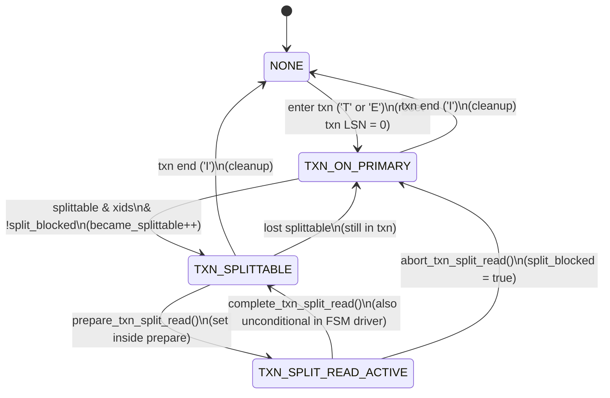
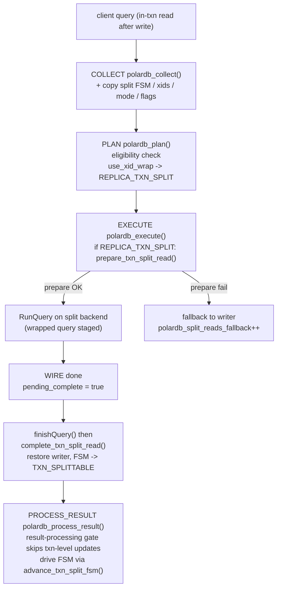
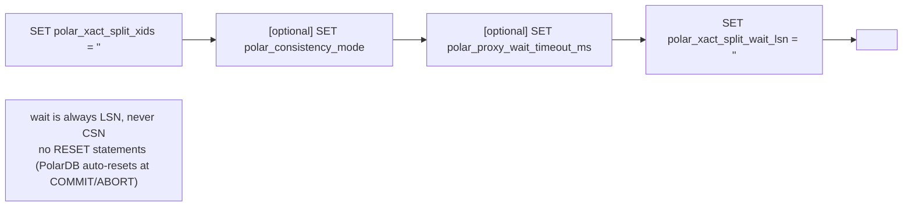

# 19 — Future: In-Transaction Read Offload (Split FSM)

> Scope: the full implementation's transaction-split feature — its state machine, backend swap, eligibility rules, and structures, described as a delta from the LSN-only baseline of this implementation. | Audience: R/M/O/C | Status: stable | Prereqs: [06-ROUTING-PIPELINE.md](06-ROUTING-PIPELINE.md), [07-QUERY-WRAPPING.md](07-QUERY-WRAPPING.md), [09-PUBLISH-AND-WRITE-TRACKING.md](09-PUBLISH-AND-WRITE-TRACKING.md), [15-LIMITATIONS-AND-ROADMAP.md](15-LIMITATIONS-AND-ROADMAP.md), [18-FUTURE-CSN-DESIGN.md](18-FUTURE-CSN-DESIGN.md) | Verified against: this branch

---

## 0. Read this first: what this document is and is not

This document describes a **future** feature called **transaction split** (also called **in-transaction read offload**). It is **NOT in this implementation**. This branch does **not** contain this feature at all. The file that implements it, `lib/PgSQL_PolarDB_Split.cpp`, **does not exist** in this implementation (confirmed: the path is absent).

Because the feature is not in this implementation, this document is grounded in a **different tree**: the full implementation. That tree is the only place the split code lives. Every code citation in this document that points at the split feature is tagged **(full implementation)** to make this clear. This implementation's own line numbers are different and are never used for split code.

Two important rules for reading this document:

1. **Directional, not literal, cross-tree mapping.** When this document says "split extends this implementation's routing pipeline," it means the *concept* is the same pipeline. The exact line numbers in the two trees do **not** line up one-to-one. Do not look up a full-implementation line number in this implementation.

### Term definitions used throughout (one term per concept)

| Term | Definition |
|------|------------|
| **Writer / primary** | The PolarDB backend that accepts writes and is always up to date. It is the only node that can hold an open transaction. The two words mean the same thing; the durable field name is `writer_hg` (writer hostgroup id). |
| **Reader / replica** | A read-only PolarDB backend that replays the writer's write-ahead log and may lag behind it. The two words mean the same thing; the field name is `reader_hg`. |
| **Autocommit read** | A `SELECT` (or other read) that runs on its own, **not** inside an open `BEGIN ... COMMIT` block. This implementation offloads these to a replica. |
| **In-transaction read** | A read that runs **between** `BEGIN` and `COMMIT`, after a write in the same transaction. This implementation keeps these on the writer. Transaction split is the feature that offloads them. |
| **LSN (Log Sequence Number)** | A 64-bit position in PostgreSQL's write-ahead log (WAL); larger means more recent. A replica that has replayed up to LSN X can serve a read whose data was written at or before X. |
| **WAL (Write-Ahead Log)** | PostgreSQL/PolarDB's append-only log of every change. Replicas replay it to catch up to the writer. LSN is a position in this log. |
| **GUC** | "Grand Unified Configuration" variable — a PostgreSQL runtime setting changed with `SET name = value`. PolarDB adds several PolarDB-specific GUCs. |
| **XID / xids** | PostgreSQL transaction id(s). Transaction split needs the open transaction's xids on the replica so the replica can see that transaction's not-yet-committed rows. |
| **Split backend** | A **second** replica connection that ProxySQL borrows for one in-transaction read, then switches away from. The writer transaction stays on its own connection the whole time. |
| **FSM** | Finite state machine — a small set of named states with rules for moving between them. The split feature has a 4-state FSM. |
| **RFQ (ReadyForQuery)** | The PostgreSQL wire message a backend sends after each command. It carries a one-byte transaction status: `'I'` = idle (no transaction), `'T'` = in a live transaction, `'E'` = in a failed transaction. The PolarDB patch also attaches the backend's current LSN and (for split) transaction metadata. |

---

## 1. Overview and where this sits in the pipeline

### 1.1 The one-paragraph summary

This implementation only offloads **autocommit** reads to a replica. It uses an LSN wait so the replica has replayed far enough to give a correct read-your-writes answer. This implementation never touches a read that runs **inside** an open transaction — those always stay on the writer (this implementation forces them to the writer with reason `IN_TRANSACTION`). **Transaction split** is the future feature that also offloads **in-transaction reads after a write** to a replica. It works because PolarDB exposes two server mechanisms: the GUC `polar_xact_split_xids` makes the open transaction's own **uncommitted** rows visible on the replica, and the GUC `polar_xact_split_wait_lsn` makes the replica wait until it has replayed the write's WAL. ProxySQL borrows a second backend connection (the **split backend**) for that one read, then switches back to the writer's connection. The write transaction itself never leaves the writer.

### 1.2 Where split sits in this implementation's pipeline

This implementation already has a four-stage request pipeline, all methods of `PgSQL_Session` in `lib/PgSQL_PolarDB_Flow.cpp`: **collect → plan → execute → process_result** (see [06-ROUTING-PIPELINE.md](06-ROUTING-PIPELINE.md) and [09-PUBLISH-AND-WRITE-TRACKING.md](09-PUBLISH-AND-WRITE-TRACKING.md)). Transaction split does **not** replace this pipeline. It **layers on top of it**:

- **collect** gains a few extra fields it copies from the session (the split FSM state, the transaction's xids, the split mode knob, two transaction flags).
- **plan** gains a new branch that decides "this in-transaction read is split-eligible" and a new route action, `REPLICA_TXN_SPLIT`.
- **execute** gains a new branch that performs the backend swap for a split read.
- **process_result** gains the FSM driver call and a gate that stops a replica reply from corrupting the writer-side transaction tracking.

The wait mechanism itself is **reused, not rewritten**. The wrapped split query still ends with the same `polar_xact_split_wait_lsn` SET that this implementation emits for autocommit reads. Split adds the `polar_xact_split_xids` SET in front of it.

```
                this implementation's pipeline (already present)   split additions (full implementation)
                ----------------------------             ---------------------------
client query ─► COLLECT  (snapshot routing inputs)  ───► + copy split FSM/xids/mode/flags
                  │
                  ▼
                PLAN     (decide route action)       ───► + new branch: REPLICA_TXN_SPLIT
                  │
                  ▼
                EXECUTE  (apply side effects)        ───► + backend swap for split read
                  │
                  ▼
              (RunQuery on the chosen backend)
                  │
                  ▼
                PROCESS_RESULT (read RFQ, advance state) ─► + drive split FSM + result-processing gate
```

---

## 2. Functions: the split module's entry points

All functions below are methods of `PgSQL_Session` and live in `lib/PgSQL_PolarDB_Split.cpp` (full implementation, 723 lines). The signature, what it does, what it changes, and where it is called from are listed for each. Line numbers are **(full implementation)**.

| Function | file:line | Responsibility | Key side effects | Called from |
|----------|-----------|----------------|------------------|-------------|
| `polardb_advance_txn_split_fsm(char txn_status)` | `Split.cpp:37` | Drive the FSM forward by one step using the RFQ transaction-status byte. | Changes `polardb_txn_split_state`; may call cleanup; bumps the "became splittable" counter. | result-processing stage (`Flow.cpp:826`, full implementation) |
| `polardb_update_txn_xids(const char* xids)` | `Split.cpp:145` | Store the transaction's xids (and a pre-escaped copy if they contain a quote). | Sets `polardb_txn_xids`, `polardb_txn_xids_escaped`, `polardb_txn_xids_needs_escape`. | result processing (refresh from RFQ); cleanup (clear with `nullptr`) |
| `polardb_build_txn_split_query(query, mode, timeout)` | `Split.cpp:195` | Build the multi-statement wrapped split query (SET xids; optional mode/timeout; SET wait_lsn; the read). | Sets `polardb_txn_split_expected_set_results`; bumps an LSN-wait counter. Returns the SQL string (empty string = abort). | `polardb_prepare_txn_split_read()` |
| `polardb_prepare_txn_split_read(int reader_hg)` | `Split.cpp:417` | The **backend swap**: get a replica connection, build the wrapped query, point `mybe` at the split backend, stage the query. | Many — see Section 4. Moves FSM to `TXN_SPLIT_READ_ACTIVE`. Returns true on success. | execute stage (`Flow.cpp:570`, full implementation) |
| `polardb_complete_txn_split_read()` | `Split.cpp:635` | Finalize a **successful** split read: record latency/success, restore the writer backend, move FSM back to `TXN_SPLITTABLE`. | Bumps success/latency counters; calls `polardb_reset_txn_split_state()`. | session, deferred after `finishQuery()` (`Session.cpp:4031-4036`, full implementation) |
| `polardb_abort_txn_split_read(const char* reason)` | `Split.cpp:691` | Finalize a **failed** split read: record fallback, restore the writer backend, move FSM to `TXN_ON_PRIMARY`, and **block** all further splits in this transaction. | Bumps fallback/cleanup counters; sets `polardb_txn_split_blocked = true`. | split error paths |
| `polardb_reset_txn_split_state()` | `Split.cpp:580` | Free per-read temporaries (wrapped SQL, stolen client packet, staged query pointer) and **restore `mybe`** to the saved writer backend. Does **not** change FSM state. | Restores `mybe`; clears active/pending flags; resets the wait runtime. | `complete`, `abort`, and the cleanup paths |
| `polardb_cleanup_txn_split_state()` | `Split.cpp:306` | Full transaction-end teardown: reset state, return/destroy the borrowed connection, clear all xid/split state, set FSM to `NONE`. | Releases the reader connection; clears xids and pins. | FSM on transaction end; error paths |
| `polardb_release_reader_backend(reader_mybe, want_reuse)` | `Split.cpp:325` | Return or destroy **only** the borrowed reader connection, discarding its staged result first. | Pools or destroys the reader connection; nulls `polardb_txn_split_backend`. | `polardb_cleanup_txn_split_state()`; reader-failure recovery (doc 20) |
| `polardb_clear_txn_xid_state()` | `Split.cpp:351` | Clear all transaction-level xid, splittable, blocked, force-primary, and force-writer-pin flags. | Clears the xid/pin fields. | cleanup; transaction completion; session reset |
| `polardb_clear_staged_session_state_for_reset(bool)` | `Split.cpp:365` | On a SQL `RESET` / `DISCARD ALL`, tear down only genuine in-flight staged split state, not the normal in-transaction FSM. | Resets staged split read; clears wait runtime and pending notices. | session RESET path |

---

## 3. Data the split feature owns and touches

### 3.1 New enum: the split FSM state

The FSM state is one enum, `PgSQL_TxnSplitState`, an `enum class : uint8_t` (full implementation `PgSQL_PolarDB.h:112-117`). It does **not** exist in this implementation.

| State | Value | Meaning | Is a split read running on the replica? |
|-------|------:|---------|-----------------------------------------|
| `NONE` | 0 | Not in a splittable transaction (autocommit, or a transaction not yet tracked). | no |
| `TXN_ON_PRIMARY` | 1 | Inside a transaction; only the writer has been used so far. | no |
| `TXN_SPLITTABLE` | 2 | The transaction has xids and PolarDB says the WAL is flushed, so reads may be offloaded. | no |
| `TXN_SPLIT_READ_ACTIVE` | 3 | A split read is executing on the replica right now. | **yes** |

### 3.2 New route action and action reasons

The full implementation adds one route action and several action reasons to `PolarDB_Query_RoutePlan` (full implementation `PgSQL_PolarDB.h:702-723`):

- New `RouteAction`: **`REPLICA_TXN_SPLIT`** (`PgSQL_PolarDB.h:704`) — route the read to a replica and prepend the xids SET plus the wait SET. This sits alongside this implementation's actions `PASSTHROUGH`, `REPLICA_WITH_WAIT`, and `FORCE_PRIMARY`.
- New `TxnContext` sub-enum (`PgSQL_PolarDB.h:692-697`): `AUTOCOMMIT`, `READ_PRE_WRITE` (in a transaction, before the first write), `READ_POST_WRITE` (in a transaction, after a write — the split-eligible case), and `WRITE`.
- New `RouteActionReason` values (`PgSQL_PolarDB.h:708-722`) that explain why a split was refused: `WAL_PENDING` (WAL not flushed yet), `SPLIT_BLOCKED` (a prior abort blocked further splits), `TXN_PINNED` (in a transaction but split disabled), `INVARIANT_VIOLATION` (a should-not-happen state), and `NO_REPLICA_CAUGHT_UP`. (The full implementation also carries `READER_FAILURE_FORCE_WRITER` for doc 20's reader-failure feature.)

### 3.3 New fields on `PolarDB_Query_RouteCtx` (collect output)

The full implementation adds these split-related fields to `PolarDB_Query_RouteCtx` (full implementation `PgSQL_PolarDB.h:646-685`); `polardb_collect()` fills them (`Flow.cpp:86-91`, `:120`, full implementation):

| Field | Type | Meaning |
|-------|------|---------|
| `txn_split_state` | `PgSQL_TxnSplitState` | Snapshot of the session's FSM state. |
| `txn_xids` | `std::string_view` | The open transaction's xids (backed by a session string). |
| `txn_split_mode` | `int8_t` | The split mode knob value (0/1/2). |
| `txn_wal_pending` | bool | True when xids exist but the WAL is not flushed yet. |
| `txn_splittable` | bool | True when PolarDB says the WAL is flushed and reads may be offloaded. |
| `txn_split_blocked` | bool | True after an abort blocked further splits in this transaction. |
| `txn_primary_lsn` | uint64_t | The LSN from the writer **within this transaction**, used as the split wait target (CSN does not advance mid-transaction). |
| `in_transaction` | bool | True if the FSM is past `NONE` **or** the backend reported an open transaction. |

### 3.4 New fields on `PolarDB_Query_RoutePlan` (plan output)

The full implementation adds (full implementation `PgSQL_PolarDB.h:736-740`):

| Field | Type | Meaning |
|-------|------|---------|
| `txn_context` | `TxnContext` | The classification (AUTOCOMMIT / READ_PRE_WRITE / READ_POST_WRITE / WRITE). |
| `use_xid_wrap` | bool | True means "this is a split read — emit the xids SET." This is the flag the final action assignment maps to `REPLICA_TXN_SPLIT`. |

### 3.5 New session fields (the durable split state)

These live on `PgSQL_Session` (full implementation `PgSQL_Session.h`, around `:665-687`) and do not exist in this implementation. Like all session state, they are **session-confined** (one thread drives one session at a time, so no locks are needed).

| Field | Type | Purpose |
|-------|------|---------|
| `polardb_txn_split_state` | `PgSQL_TxnSplitState` | The live FSM state. |
| `polardb_txn_xids` / `polardb_txn_xids_escaped` | std::string | The transaction's xids and a pre-escaped copy. |
| `polardb_txn_splittable` | bool | The PolarDB "WAL flushed, safe to split" marker. |
| `polardb_txn_split_blocked` | bool | True after an abort; blocks further splits this transaction. |
| `polardb_txn_split_backend` | `PgSQL_Backend*` | The borrowed replica connection used for split reads. |
| `polardb_txn_split_saved_mybe` | `PgSQL_Backend*` | The writer backend, saved while `mybe` points at the split backend. |
| `polardb_txn_split_active` | bool | Mirrors `state == TXN_SPLIT_READ_ACTIVE`; a fast check on the WIRE path. |
| `polardb_txn_split_pending_complete` | bool | Set when the WIRE finishes; tells the session to call `complete` after `finishQuery()`. |
| `polardb_txn_split_read_wrapped_query` | std::string | The wrapped split SQL for the in-flight read. |
| `polardb_txn_split_did_split` | bool | True if this transaction performed at least one split (used for commit classification). |
| `polardb_txn_primary_lsn` (referenced as `polardb_primary_lsn` in split build) | uint64_t | The transaction-scoped writer LSN used as the split wait target. |

---

## 4. Decision and flow

### 4.1 The split FSM — states and transitions

The FSM is driven by `polardb_advance_txn_split_fsm(char txn_status)` (`Split.cpp:37`, full implementation), called once per backend reply from the result-processing stage (`Flow.cpp:826`, full implementation). The driver looks at the RFQ transaction-status byte (`'I'`/`'T'`/`'E'`) and the session's already-refreshed xids/splittable flags, then moves the FSM one step.

```
                      enter txn ('T' or 'E')
         NONE ─────────────────────────────────────► TXN_ON_PRIMARY
           ▲                                                │
           │ txn end ('I')                                  │ splittable=1 AND xids non-empty
           │                                                │ AND NOT split_blocked
           │                                                ▼
           └──────────── txn end ('I') ──────────── TXN_SPLITTABLE ◄────────┐
                                                          │                  │
                              polardb_prepare_txn_split_read()    polardb_complete_txn_split_read()
                                  (set inside prepare, not FSM)   (set inside complete, not FSM)
                                                          ▼                  │
                                                  TXN_SPLIT_READ_ACTIVE ─────┘
                                                          │
                              polardb_abort_txn_split_read()  (error)
                                                          ▼
                                                  TXN_ON_PRIMARY  +  split_blocked = true
                                                  (no more split attempts this txn)
```

Transition rules, all in `polardb_advance_txn_split_fsm` (`Split.cpp:75-130`, full implementation):

| From | Condition | To | Side effect | file:line |
|------|-----------|----|-------------|-----------|
| `NONE` | RFQ is `'T'` or `'E'` | `TXN_ON_PRIMARY` | Resets the transaction-level LSN to 0. | `Split.cpp:79-82` |
| `TXN_ON_PRIMARY` | `splittable` AND xids non-empty AND NOT `split_blocked` | `TXN_SPLITTABLE` | Bumps `polardb_txn_became_splittable`. | `Split.cpp:91-93` |
| `TXN_ON_PRIMARY` | RFQ is `'I'` (transaction ended) | `NONE` (via cleanup) | Full cleanup. | `Split.cpp:101-104` |
| `TXN_SPLITTABLE` | RFQ is `'I'` (transaction ended) | `NONE` (via cleanup) | Full cleanup. | `Split.cpp:110-113` |
| `TXN_SPLITTABLE` | NOT `splittable`, still in transaction | `TXN_ON_PRIMARY` | Lost splittability. | `Split.cpp:116-118` |
| `TXN_SPLIT_READ_ACTIVE` | (any) | `TXN_SPLITTABLE` | **Unconditional** — see the tricky-behavior note in Section 9. | `Split.cpp:124-129` |

Two important facts about the FSM:

1. **The driver does not make the `TXN_SPLITTABLE → TXN_SPLIT_READ_ACTIVE` move.** That move is set inside `polardb_prepare_txn_split_read()` (`Split.cpp:558`, full implementation). The move back out is set inside `polardb_complete_txn_split_read()` (→ `TXN_SPLITTABLE`, `Split.cpp:677`) or `polardb_abort_txn_split_read()` (→ `TXN_ON_PRIMARY`, `Split.cpp:719`). So the work is split between two places: the FSM driver handles the transitions in the table above, and the prepare / complete / abort helpers handle the move into and out of the active-read state. The FSM driver by itself never sets `TXN_SPLIT_READ_ACTIVE`.
2. **There is a second way to split — a fast path.** From `TXN_ON_PRIMARY`, **before** the FSM has reached `TXN_SPLITTABLE`, the planner may still split if xids are present, the WAL is flushed (`!wal_pending`), and an LSN exists. This is the planner's fast-path (Section 4.2). So `TXN_SPLITTABLE` is one route to a split; the `TXN_ON_PRIMARY` fast-path is the other. Both end at the `REPLICA_TXN_SPLIT` action.

### 4.2 Split eligibility — who gets offloaded

Eligibility is decided in the planner `polardb_plan()` (`Flow.cpp:207`, full implementation), in its transaction-context logic. An in-transaction read is split-eligible only when **all** of the following hold:

| # | Condition | Where checked (full implementation) |
|---|-----------|---------------------------|
| 1 | It is a PolarDB hostgroup, a reader hostgroup is configured, and the replica is policy-eligible (`replica_eligible`). | `Flow.cpp:212-244` |
| 2 | No `/* route=primary */` hint and no reader-failure force-writer pin (doc 20). | `Flow.cpp:223-262` |
| 3 | FSM state is `TXN_SPLITTABLE`, **or** `TXN_ON_PRIMARY` with xids + `!wal_pending` + LSN > 0 (the fast path). | `Flow.cpp:324`, `:355-358` |
| 4 | `txn_xids` is non-empty. | `Flow.cpp:355` |
| 5 | The read is **not** multi-statement. | `Flow.cpp:324`, `:355`; hard guard repeated at `:492-499` |
| 6 | The split mode knob is non-zero (split enabled). | `Flow.cpp:324`, `:356` |
| 7 | The read is **not** extended protocol (Parse/Bind/Execute) — wrappers cannot be injected there. | `Flow.cpp:478-486` |
| 8 | `txn_split_blocked` is false — a prior abort forces all later reads to the writer. | `Flow.cpp:285-294`, `:346-354` |
| 9 | Lag is acceptable: writer LSN − best replica LSN ≤ `max_lag_bytes` (tri-state: -1 inherit, 0 off, >0 enforced). | `Flow.cpp:455-468` |
| 10 | `wal_pending` is false. If xids exist but the WAL is not flushed yet, the read stays on the writer (action reason `WAL_PENDING`). | `Flow.cpp:312-321` |

If eligible, the planner sets `plan.use_xid_wrap = true` and classifies `txn_context = READ_POST_WRITE` (`Flow.cpp:324-326`, `:357-358`). The final action assignment maps `use_xid_wrap` → `REPLICA_TXN_SPLIT` (`Flow.cpp:503-504`, full implementation).

The eligibility **decision matrix** (in-transaction reads only; autocommit reads follow this implementation's matrix in [06-ROUTING-PIPELINE.md](06-ROUTING-PIPELINE.md)):

| FSM state | xids? | wal_pending | split_blocked | multi-stmt | extended | lag OK | split_mode | Action |
|-----------|:-----:|:-----------:|:-------------:|:----------:|:--------:|:------:|:----------:|--------|
| `TXN_ON_PRIMARY` | no | — | — | — | — | — | — | FORCE_PRIMARY (READ_PRE_WRITE) |
| `TXN_ON_PRIMARY` | yes | yes | no | no | no | yes | >0 | FORCE_PRIMARY (action reason `WAL_PENDING`) |
| `TXN_ON_PRIMARY` | yes | no | no | no | no | yes | >0 | **REPLICA_TXN_SPLIT** (fast path) |
| `TXN_SPLITTABLE` | yes | — | no | no | no | yes | >0 | **REPLICA_TXN_SPLIT** |
| any | yes | no | **yes** | — | — | — | >0 | FORCE_PRIMARY (action reason `SPLIT_BLOCKED`) |
| any | yes | no | no | **yes** | — | — | >0 | FORCE_PRIMARY (action reason, multi-statement rejected) |
| any | yes | no | no | no | **yes** | — | >0 | FORCE_PRIMARY (action reason `EXTENDED_PROTOCOL`) |
| any | yes | no | no | no | no | **no** | >0 | FORCE_PRIMARY / writer fallback (reader status `READER_LAG_EXCEEDED`) |
| any (in txn) | — | — | — | — | — | — | **0** | FORCE_PRIMARY (action reason `TXN_PINNED`) |

Query classification (read vs write, multi-statement) is done earlier by the
query processor and arrives in `PolarDB_Query_RouteCtx`; the planner only ever runs
for reads.

### 4.3 The flow end-to-end (collect → plan → execute → process_result), split parts only

```
 client query (in-transaction read, after a write)
    │
    ▼
 [COLLECT]  polardb_collect()  — snapshot session fields into PolarDB_Query_RouteCtx
    │        copies: txn_split_state, txn_xids, txn_split_mode,
    │                txn_wal_pending, txn_splittable, txn_split_blocked, in_transaction
    ▼        (Flow.cpp:86-91, :120 — full implementation)
 [PLAN]     polardb_plan()  — eligibility (Section 4.2); on success:
    │            txn_context = READ_POST_WRITE; use_xid_wrap = true;
    │            final action = REPLICA_TXN_SPLIT
    ▼        (Flow.cpp:324-326, :503-504 — full implementation)
 [EXECUTE]  polardb_execute()
    │            if action == REPLICA_TXN_SPLIT:  polardb_prepare_txn_split_read(reader_hg)
    │              success → target = reader_hg ; FSM → TXN_SPLIT_READ_ACTIVE
    │              fail    → target = writer_hg ; action downgraded to FORCE_PRIMARY ;
    │                        counter polardb_split_reads_fallback++
    ▼        (Flow.cpp:566-581 — full implementation)
 RunQuery on the split backend (wrapped query already staged on its data stream)
    │
    ▼
 [WIRE done]  async result ready → polardb_txn_split_pending_complete = true
    │        (Session.cpp:6189 — full implementation)
    ▼
 finishQuery() then  polardb_complete_txn_split_read()  (deferred)
    │        (Session.cpp:4031-4036 — full implementation)  → restores writer, FSM → TXN_SPLITTABLE
    ▼
 [PROCESS_RESULT]  polardb_process_result()  — for the split-replica reply it SKIPS the
             transaction-level updates (the "result-processing gate") so the replica's RFQ
             (txn='I', no xids) does not overwrite the writer-side FSM
             (Flow.cpp:753-789 — full implementation); it still drives the FSM (Flow.cpp:826)
```

### 4.4 The backend swap (the main work of execute)

`polardb_prepare_txn_split_read(int reader_hg)` (`Split.cpp:417`, full implementation) performs the swap in this order:

| Step | What it does | file:line (full implementation) |
|------|--------------|------------------------|
| 1 | Resolve/allocate the split backend for `reader_hg` via `find_or_create_backend()`. | `Split.cpp:433-434` |
| 2 | Attach a pooled replica connection. **SMART** mode uses `get_MyConn_polardb_reader(reader_hg, this, primary_lsn, ...)` to prefer the least-lagging replica; **SIMPLE** mode uses `get_MyConn_from_pool(reader_hg, ...)`. If the pool is empty, request a warm-up connection and return false. | `Split.cpp:451-457`, `:469-479` |
| 3 | Build the wrapped split query (Section 5). If the build returns an empty string, abort. | `Split.cpp:516-521` |
| 4 | **Save the writer backend pointer** into `polardb_txn_split_saved_mybe`, then point `mybe` at the split backend. | `Split.cpp:532-533` |
| 5 | **Steal the original client packet** into `polardb_txn_split_read_original_pkt` and null the session `pkt` to avoid a double-free. | `Split.cpp:537-540` |
| 6 | Stage the wrapped SQL on the split backend's data stream `pgsql_real_query`. | `Split.cpp:544-545` |
| 7 | Mark `polardb_txn_split_active = true`, record the start time, move FSM → `TXN_SPLIT_READ_ACTIVE`, bump `polardb_split_reads_total`. | `Split.cpp:551-561` |

The **restore** happens in `polardb_reset_txn_split_state()` (`Split.cpp:580`, full implementation): it clears the split backend's staged query pointer, frees the wrapped query and the stolen packet, and **restores `mybe = polardb_txn_split_saved_mybe`** (`Split.cpp:608-611`). Both `complete` (`Split.cpp:635`) and `abort` (`Split.cpp:691`) call it. The **full** transaction-end teardown is `polardb_cleanup_txn_split_state()` (`Split.cpp:306`), which additionally returns or destroys the borrowed connection via `polardb_release_reader_backend()` (`Split.cpp:325`) and clears all xid/split state via `polardb_clear_txn_xid_state()` (`Split.cpp:351`).

---

## 5. The wrapped split query (what the replica receives)

`polardb_build_txn_split_query()` (`Split.cpp:195`, full implementation) builds one multi-statement string in this exact order (`Split.cpp:210-263`):

```sql
SET polar_xact_split_xids = '<xids>';      -- expose THIS txn's uncommitted rows on the replica
[ SET polar_consistency_mode = '...'; ]    -- only when a wait prefix is needed
[ SET polar_proxy_wait_timeout_ms = N; ]   -- only when the connection supports the GUC
SET polar_xact_split_wait_lsn = '<txn_primary_lsn>';  -- replica must replay to this LSN before answering
<original SELECT>                           -- the client's read
```

Key design points:

| Point | Detail | file:line (full implementation) |
|-------|--------|------------------------|
| The wait is **always LSN, never CSN** | CSN (commit sequence number) does not advance mid-transaction, so it cannot prove the replica replayed the in-flight write's WAL. Split always uses LSN. | `Split.cpp:221-222`, `:243` |
| No LSN target → abort | If there is no LSN target, the build returns an empty string and the split is aborted (falls back to the writer). | `Split.cpp:249-252` |
| Expected SET count | `polardb_txn_split_expected_set_results` = 2 (xids + wait) + 1 if a consistency-mode prefix was added + 1 if a timeout SET was added. The WIRE path skips exactly this many SET replies before forwarding the `SELECT` result to the client. | `Split.cpp:259` |
| **No RESET statements** | PolarDB auto-resets all split GUCs at COMMIT/ABORT. Sending `RESET polar_xact_split_xids` **before** the transaction ends is a server error ("polar_xact_split_xids is incorrectly reset"), so the wrapped query never includes a RESET. | `Split.cpp:268-292` |

This is the point where split **reuses this implementation's wait code**: the trailing `SET polar_xact_split_wait_lsn` is produced by the same `PolarDB_Protocol::append_polar_wait_set(LSN, ...)` helper this implementation uses for autocommit reads ([07-QUERY-WRAPPING.md](07-QUERY-WRAPPING.md)). Split only adds the leading `SET polar_xact_split_xids`.

---

## 6. Schema, knobs, counters (the configuration delta)

### 6.1 Schema column

The full implementation adds one column to `pgsql_replication_hostgroups` (full implementation `ProxySQL_Admin_Tables_Definitions.h:309`):

```
txn_split_enabled INT
  CHECK (txn_split_enabled IN (0,1)
         AND (txn_split_enabled = 0 OR LOWER(check_type) = 'polardb'))
  NOT NULL DEFAULT 0
```

Meaning: per writer/reader pair, **off by default**, and only settable to 1 when the hostgroup's `check_type` is `'polardb'`. This implementation's V3_0_4 schema does not have this column; its schema is the LSN-only eight-column form with `proxy_protocol`.

The full implementation also **widens** the `consistency_mode` CHECK to accept `'csn'`, `'session'`, and `'global'` in addition to this implementation's `'default'/'off'/'lsn'`. Those extra modes belong to the CSN feature, not split — and CSN is experimental and incomplete (it needs PolarDB backend support, applies only in global-consistency mode, and its wait behavior is not reliably verified) — see [18-FUTURE-CSN-DESIGN.md](18-FUTURE-CSN-DESIGN.md). (Operator-confusion note carried from the CSN doc: the schema word `'session'` maps to **LSN**, not to a session-CSN mode.)

Any future transaction-split schema re-add must use a post-V3_0_4 versioned macro and disk migration. `REQUEST_RFQ_XID` is the reserved startup-profile vocabulary for future XID payload requests; it does not imply a V3_0_4 schema column or shipped split capability in this implementation.

### 6.2 Thread knob

One new thread-local knob, `pgsql-polardb_split_mode` (full implementation `PgSQL_Thread.cpp:425`, default 0 at `:1213`, max value `POLARDB_SPLIT_SMART` at `:2365`):

| Value | Name | Behavior |
|------:|------|----------|
| 0 | `POLARDB_SPLIT_DISABLED` | No transaction split. All in-transaction reads go to the writer (this implementation's behavior). |
| 1 | `POLARDB_SPLIT_SIMPLE` | Split enabled; the split backend takes **any** available pooled replica connection. |
| 2 | `POLARDB_SPLIT_SMART` | Split enabled; the split backend prefers the **least-lagging** replica (LSN-aware connection pick). |

Constants: full implementation `PgSQL_Thread.h:45-47`.

### 6.3 Counters

Split adds a large block of counters in the full implementation (`PgSQL_HostGroups_Manager.h`). That older full-tree code stores all of them as `std::atomic<unsigned long long>` and increments them with `fetch_add(..., relaxed)`. If transaction split is re-added on top of this branch, apply this branch's current counter-storage rule instead: hot per-query counters and degraded-path counters should use per-thread storage plus a global counter, while monitor/config/rare counters may remain global atomics. They are still exposed through `stats_pgsql_global` under stable `PolarDB_*` names the same way this implementation's counters are ([12-THREADVARS-AND-OBSERVABILITY.md](12-THREADVARS-AND-OBSERVABILITY.md)). The main ones:

| Counter | Meaning | file:line (full implementation) |
|---------|---------|------------------------|
| `polardb_split_reads_total` | Split reads attempted. | `:840` |
| `polardb_split_reads_success` | Split read completed OK. | `:841` |
| `polardb_split_reads_fallback` | Could not prepare → fell back to the writer. | `:842` |
| `polardb_split_reads_error` | Completed with a timeout/error. | `:898` |
| `polardb_txn_became_splittable` | FSM entered `TXN_SPLITTABLE`. | `:824` |
| `polardb_txn_committed_with_split` / `polardb_txn_committed_no_split` | Commit classification. | `:826-827` |
| `polardb_split_wal_pending` | Read kept on the writer because the WAL was not flushed. | `:835` |
| `polardb_split_blocked_reads` | Read forced to the writer after a prior abort. | `:837` |
| `polardb_split_invariant_violations` | A should-not-happen FSM/planner state. | `:836` |
| `polardb_split_rejected_multistatement` | A multi-statement read was not split. | `:834` |
| `polardb_split_no_backend` | No split backend could be created. | `:843` |
| `polardb_split_pool_hit` / `polardb_split_pool_empty` / `polardb_split_conn_reused` | How the split connection was sourced. | `:851-853` |
| `polardb_split_pool_contention` | Pool contention events. | `:868` |
| `polardb_split_lsn_wait_count` | Number of LSN waits emitted by split builds. | `:862` |
| `polardb_split_latency_sum_us` / `polardb_split_latency_count` | Split read latency (sum and sample count). | `:902-903` |
| `polardb_split_conn_cleanup_success` / `polardb_split_conn_cleanup_failed` | Cleanup outcome of the borrowed connection. | `:856-857` |
| `polardb_split_error_connection_lost` / `polardb_split_error_timeout` / `polardb_split_error_lsn_wait_timeout` | Split error breakdown. | `:869-872` |
| `polardb_split_warmup_requested` / `polardb_split_warmup_created` / `polardb_split_warmup_failed` | Pool warm-up for split (depends on the warm-up feature — see [21-FUTURE-OTHER-CAPABILITIES.md](21-FUTURE-OTHER-CAPABILITIES.md)). | `:906-908` |

For context, this implementation's LSN set ships **26 stat counters + 1 `polardb_active` gate** (see [12-THREADVARS-AND-OBSERVABILITY.md](12-THREADVARS-AND-OBSERVABILITY.md)). The split counters above are **additional** and exist only in the full implementation.

---

## 7. Lifecycle bookkeeping (state never leaks to the next transaction)

The result-processing stage clears the per-transaction split flags on every transaction end. When the RFQ transaction status is `'I'` (transaction ended), result processing clears `polardb_txn_split_did_split`, `polardb_txn_split_was_splittable`, and `polardb_txn_split_blocked` (`Flow.cpp:858-861`, full implementation), and clears the `/* route=primary */` hint and the reader-failure force-writer pin (`Flow.cpp:833-837`). Commit classification (`with_split` vs `no_split`) runs in the same block (`Flow.cpp:850-857`). The FSM's own cleanup path (`Split.cpp:319` → `NONE`) clears the same flags a second time as a safety backup, in case the FSM path did not run.

The **result-processing gate** is the second part of leak prevention. A reply from a replica backend during a transaction must **not** update the writer-side transaction tracking, because the replica's RFQ reports `txn='I'` with no xids — reading those would reset the FSM and erase the xids set by earlier writer writes. The gate skips the transaction-level result-processing steps in two cases (`Flow.cpp:753-789`, full implementation):

1. **Split-read result** — detected by `pending_complete && active && backend match`. The deferred `polardb_complete_txn_split_read()` handles the bookkeeping instead.
2. **Consistency-wait read within a transaction** — a pre-write `SELECT` routed to a replica via `REPLICA_WITH_WAIT`. Detected by FSM state past `NONE` **and** the replica says `txn='I'` **and** this is not a write.

In both cases the gate `return`s before the transaction-level updates, but the per-server LSN update (result-processing steps 1-4) still runs because it is safe regardless of which backend produced the result.

---

## 8. Which hooks of this implementation split layers on (the reuse map)

| Mechanism of this implementation (already present) | How split reuses it |
|--------------------------------|---------------------|
| The `collect → plan → execute → process_result` pipeline (`PgSQL_PolarDB_Flow.cpp`) | Split adds the `REPLICA_TXN_SPLIT` branch plus transaction-context logic. Same entry points, no rewrite. |
| The LSN wait + `append_polar_wait_set(LSN, ...)` builder ([07-QUERY-WRAPPING.md](07-QUERY-WRAPPING.md)) | The wrapped split query ends with the **same** `polar_xact_split_wait_lsn` SET (`Split.cpp:243`, full implementation). |
| The `RouteCtx` / `RoutePlan` structs | Split adds the split fields (Sections 3.3-3.4) and the `REPLICA_TXN_SPLIT` action to the same routing pipeline shape. |
| Per-server LSN tracking (`polardb_update_server_lsn`) ([05-MONITOR-AND-HGM-LSN-STATE.md](05-MONITOR-AND-HGM-LSN-STATE.md)) | Reused for the lag check (eligibility rule 9) and the SMART connection pick. |
| The async `RunQuery` / `finishQuery` loop | Split runs on it by swapping `mybe`; completion is deferred via `polardb_txn_split_pending_complete` (`Session.cpp:6189`, `:4031-4036`, full implementation). |
| The connection pool getters | `get_MyConn_polardb_reader` / `get_MyConn_from_pool` source the borrowed replica connection (`Split.cpp:451-457`, full implementation). |
| The RFQ result-processing read ([09-PUBLISH-AND-WRITE-TRACKING.md](09-PUBLISH-AND-WRITE-TRACKING.md)) | Reused, but guarded by the result-processing gate (Section 7) so a replica reply does not overwrite the writer-side FSM. |

---

## 9. Notes for reviewers — tricky behaviors to be aware of

These are the details to design around if this feature is ever brought into the main branch.

1. **The active-read transition is unconditional.** `TXN_SPLIT_READ_ACTIVE → TXN_SPLITTABLE` fires regardless of the RFQ transaction status (`Split.cpp:124-129`, full implementation). If an `'I'` arrives during an active split read, the FSM lands on `TXN_SPLITTABLE` rather than `NONE`. The design relies on `complete`/`abort` running first. (Tracked in doc-04 P5, `04-TRANSACTION-SPLITTING.md` in the full implementation.)
2. **Split borrows a second backend in one transaction.** This breaks the upstream `tx_poisoned` recovery assumption that "the dead backend owned the transaction." The death of the split/reader backend must **not** poison the session; only the death of the transaction-owning **writer** should. The full case matrix and tests live in `22-TX-POISONED-AND-SPLIT-RECOVERY.md` (in the full implementation's `doc/polardb-arch/`, not in this docset), and the reader-failure recovery model (RETRY / FORWARD / force-writer pin) is in [20-FUTURE-READER-FAILURE-RETRY-DESIGN.md](20-FUTURE-READER-FAILURE-RETRY-DESIGN.md). Treat both as required companions to any split work.
3. **`abort` blocks; `prepare`-fail does not.** `polardb_abort_txn_split_read()` sets `split_blocked = true` for the rest of the transaction (no retries), but a `prepare` failure only falls back to the writer without blocking — an intentional retry-friendly choice for transient pool gaps. (doc 21 §2 "prepare-fail vs abort".)
4. **CSN is never used for the split wait.** This is correct (CSN does not advance mid-transaction), but note that it means split is **LSN-only by design** even in a CSN-enabled deployment. CSN itself remains experimental and incomplete — see [18-FUTURE-CSN-DESIGN.md](18-FUTURE-CSN-DESIGN.md).

---

## 10. Status and deferred items

| Item | Status |
|------|--------|
| Transaction split feature | **Future, not in this implementation.** Lives only in the full implementation (`lib/PgSQL_PolarDB_Split.cpp`, 723 lines). This implementation has no such file. |
| In-transaction reads in this implementation | Always forced to the writer (action reason `IN_TRANSACTION`). |
| Reader-failure recovery for split | **Design only** in the full implementation; see [20-FUTURE-READER-FAILURE-RETRY-DESIGN.md](20-FUTURE-READER-FAILURE-RETRY-DESIGN.md). The force-writer-pin fields and the planner check that forces the writer after a reader failure exist in the full implementation's code, but how much of the RETRY/FORWARD recovery is actually wired vs still planned was not verified end-to-end. |
| `tx_poisoned` coexistence | **Design only**; see `22-TX-POISONED-AND-SPLIT-RECOVERY.md` (full implementation). |
| Lazy pool warm-up (the split warm-up counters) | A companion future feature; see [21-FUTURE-OTHER-CAPABILITIES.md](21-FUTURE-OTHER-CAPABILITIES.md). |
| doc-04 function names / line count | **Stale.** doc-04 says 984 lines with `should_split_query()` / `maybe_prepare_split_read()` / `build_split_query()`; the live file is 723 lines and those functions are gone. The live code is authoritative. |

In-code deferred/TODO notes found in the split source (for [15-LIMITATIONS-AND-ROADMAP.md](15-LIMITATIONS-AND-ROADMAP.md)):

- `Split.cpp:552-554` (full implementation): a `TODO` warning that the fast-path split can bypass result processing's rising-edge commit-classification check, so `polardb_txn_split_was_splittable` is set in `prepare` as a safety backstop; it must not be removed without refactoring commit classification to track split attempts directly.

---

## Appendix: Mermaid diagrams

### A.1 The split FSM (states and transitions)



### A.2 Split layered on this implementation's pipeline



### A.3 The wrapped split query shape



### A.4 The backend swap (prepare → run → restore)

```mermaid
sequenceDiagram
    participant S as PgSQL_Session
    participant W as writer backend (mybe)
    participant R as split backend (replica)
    S->>S: save mybe into split_saved_mybe
    S->>R: find_or_create_backend(reader_hg)
    S->>R: attach pooled conn (SMART or SIMPLE)
    S->>S: build wrapped split query
    S->>S: steal client pkt; null session pkt
    S->>R: stage wrapped SQL on data stream
    S->>S: mybe = split backend; FSM -> TXN_SPLIT_READ_ACTIVE
    R-->>S: async result (SET replies skipped, SELECT forwarded)
    S->>S: pending_complete = true
    S->>S: finishQuery() then complete_txn_split_read()
    S->>S: reset_txn_split_state(): restore mybe = split_saved_mybe
    S->>S: FSM -> TXN_SPLITTABLE
```

---

Verified against this branch.
