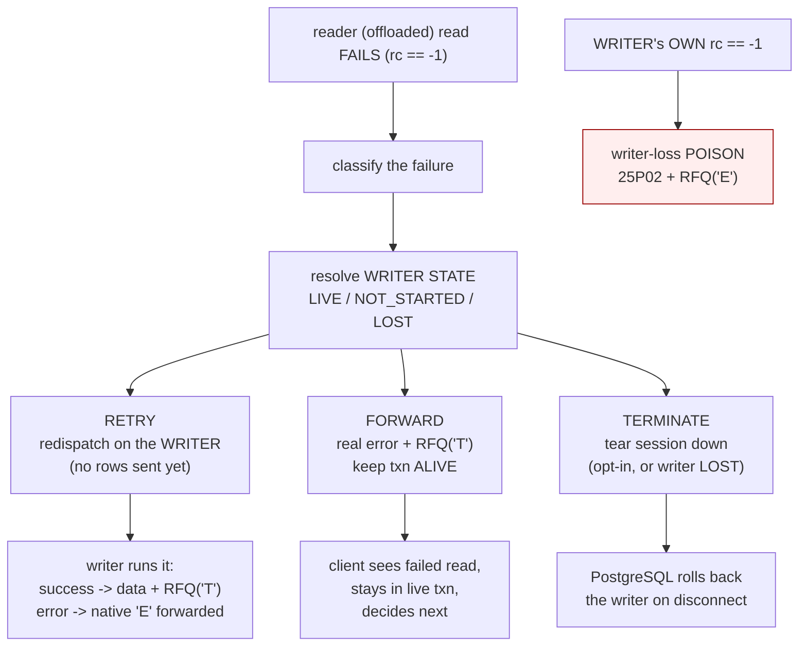
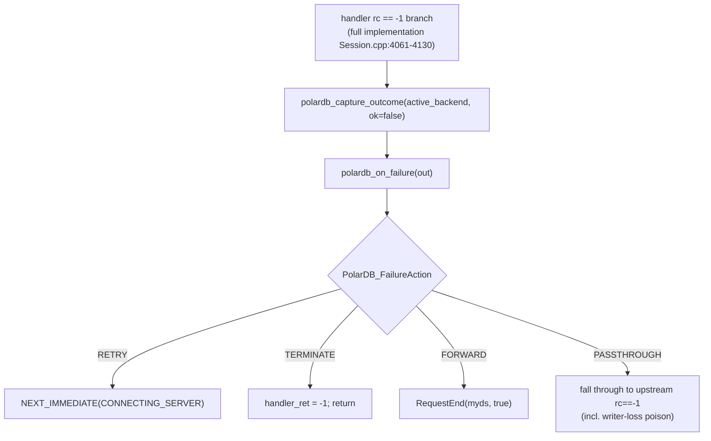
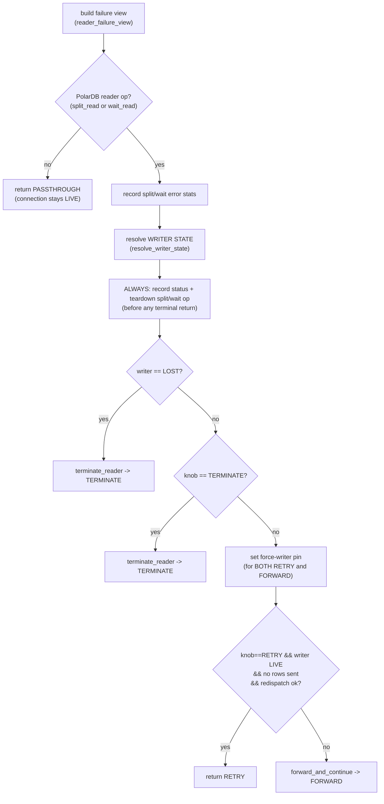
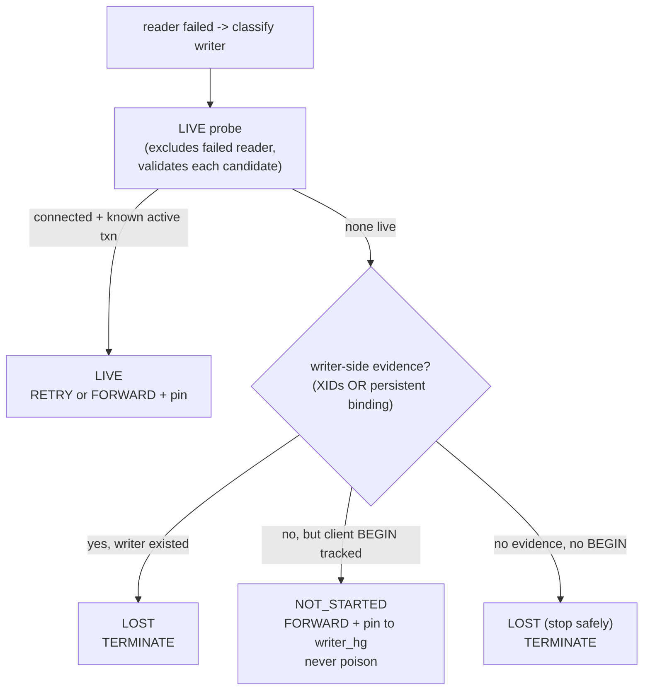
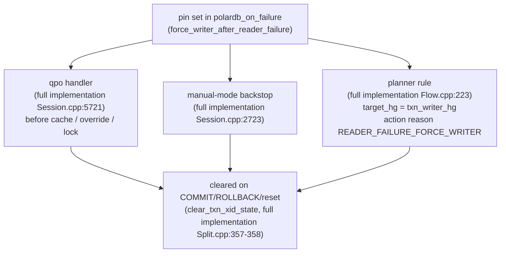

# 20 — Future: Reader-Failure Recovery and Retry

> Scope: how a failed replica read is recovered — RETRY (re-run on the writer), FORWARD (send the real error but keep the transaction alive), TERMINATE (close the session), and writer-loss poison (reserved for the writer's own death) — framed as a future delta on top of the current LSN-only PolarDB feature. | Audience: R/M/O/C | Status: stable (describes a FUTURE feature; NOT in this implementation) | Prereqs: [01-BACKGROUND-AND-DESIGN.md](01-BACKGROUND-AND-DESIGN.md), [06-ROUTING-PIPELINE.md](06-ROUTING-PIPELINE.md), [10-SESSION-INTEGRATION.md](10-SESSION-INTEGRATION.md), [14-INVARIANTS-AND-FAILURE-MODES.md](14-INVARIANTS-AND-FAILURE-MODES.md), [15-LIMITATIONS-AND-ROADMAP.md](15-LIMITATIONS-AND-ROADMAP.md), [19-FUTURE-TXN-SPLIT-DESIGN.md](19-FUTURE-TXN-SPLIT-DESIGN.md) | Verified against: this branch

## 0. Read this first: what this document is, and is NOT

This document describes the **future general reader-failure feature**. One narrow foundation is already present in this implementation: an autocommit wait-wrapped reader query can be retried once on the writer after a strict LSN wait timeout or reader connection loss, when no user result has started. The broader policy model in this document is not present yet.

We confirmed the missing full policy directly. In this implementation:

- `lib/PgSQL_PolarDB_Failure.cpp` exists, but it contains only the narrow autocommit wait-read retry foundation. It does not contain the general reader-failure policy model.
- A grep for `polardb_on_failure`, `PolarDB_ReaderAction`, `PolarDB_WriterState`, `PolarDB_FailureAction`, `READER_FAILURE_FORCE_WRITER`, `polardb_capture_outcome`, `terminate_reader`, and `polardb_reader_death_action` over `lib/` and `include/` returns **zero hits**.
- The current routing `RouteActionReason` enum in this implementation includes the base route reasons plus the LSN-policy reasons `WRITE_LSN_UNKNOWN`, `OBSERVED_LSN_UNKNOWN`, and `PRIMARY_LSN_UNKNOWN`. There is still no `READER_FAILURE_FORCE_WRITER`; the retry feature would add it as a new future reason.
- The current branch does have `PolarDB_WaitReadFailure`, `polardb_capture_wait_read_failure()`, and `polardb_retry_wait_read_on_writer()`. These are intentionally limited to autocommit wait-wrapped reads that fail before any user result because of strict LSN wait timeout or reader connection loss, and do not implement the policy matrix below.

The feature is **fully built in a separate full implementation**, in `lib/PgSQL_PolarDB_Failure.cpp` (410 lines), and specified in the design document `doc/polardb-arch/23-READ-SIDE-FAILURE-RECOVERY.md` (3029 lines, titled "PolarDB Reader Failure Recovery (V9 — Transparent Forwarding)"). This document draws on that full implementation and frames everything as a **delta from this implementation**.

**Citation convention in this document.** Because the same symbol can sit at a different line in each tree, every code citation is tagged:

- **(full implementation)** = the full implementation — where this feature actually lives.
- **(this implementation)** = the current LSN-only branch this document is committed into.

Do not look up a "(full implementation)" line number in this implementation; the numbers differ between trees.

### 0.1 The hard prerequisite

This feature is only useful **after** the transaction-split feature lands (see [19-FUTURE-TXN-SPLIT-DESIGN.md](19-FUTURE-TXN-SPLIT-DESIGN.md)). The reason is simple:

- This implementation routes a read to a replica **only when the session is in autocommit** (no open transaction). An in-transaction read is forced to the writer with action reason `IN_TRANSACTION` (this implementation `lib/PgSQL_PolarDB_Flow.cpp:269-272`).
- A reader-failure recovery model is about keeping a **live transaction** alive when one of its offloaded reads fails on a replica. This implementation has no in-transaction offloaded reads, so there is almost no transaction to rescue.

So the realistic reader failure in this implementation today is an **autocommit wait read** that times out on a replica in strict mode. This branch handles that one case by retrying the original read on the writer when no user result has started. Most of the machinery in this document is exercised only once in-transaction offload (split reads and in-transaction wait reads) exists. See §11 for the exact delta from this implementation to the future.

---

## 1. The problem in one paragraph

When a read that ProxySQL **offloaded to a replica** fails, the proxy must decide what the client sees, **without lying about the writer's transaction**. The design treats the proxy as a **transparent forwarder**: the proxy decides only *routing* (which backend runs a statement); the client owns *transaction control* (the `BEGIN` / `COMMIT` / `ROLLBACK` commands). A reader failure is **not** transaction-dooming — the offloaded read runs on a separate replica session, and its error does not abort the writer's transaction. (This is verified against the PolarDB database kernel; the design records it as the core finding at `doc/polardb-arch/23-READ-SIDE-FAILURE-RECOVERY.md:184` (full implementation).) So the proxy has **three honest outcomes**, plus **one synthetic outcome** reserved for when the writer connection itself dies.

---

## 2. Vocabulary (defined on first use)

| Term | Meaning |
|---|---|
| **writer** (primary) | The only backend that can *hold* a transaction. All writes and explicit transactions live here. |
| **reader** (replica) | A backend that runs *offloaded reads* only. It never holds the transaction. |
| **offloaded read** | A read the proxy sent to a replica instead of the writer. Two kinds: split read and wait read (below). |
| **wait read** | A read prefixed with `SET polar_xact_split_wait_lsn=...` so the replica waits for the writer's WAL position before answering (read-your-writes). **This implementation has this, but autocommit-only.** |
| **split read** | An in-transaction read run on a replica that *mimics* the writer's transaction by importing its transaction IDs (XIDs). **This implementation has none of this; it arrives with the transaction-split feature.** |
| **rc == -1** | The session handler's "the backend query failed" branch (full implementation `lib/PgSQL_Session.cpp:4061` onward). This is the single seam the feature hooks. |
| **RFQ** (ReadyForQuery) | The PostgreSQL wire message a backend sends after a command. It carries a transaction-status byte. |
| **RFQ('T') / RFQ('E') / RFQ('I')** | The transaction-status byte in RFQ: `'T'` = the client is in a live transaction; `'E'` = the transaction is in PostgreSQL's aborted state; `'I'` = idle (no transaction). The proxy must send the **truthful** byte. |
| **tx_poisoned** | An existing session flag in this implementation and upstream. When a backend dies mid-transaction, the proxy synthesizes `ERROR 25P02` (current transaction is aborted) + `RFQ('E')` and keeps the client alive so it can `ROLLBACK`. **Shared base; reused unchanged by this feature.** |
| **reusable** | `is_connection_in_reusable_state()` = `!(PQTRANS_UNKNOWN || PQTRANS_ACTIVE)`. It is the **death-vs-error discriminator**: a connection **death** maps to *not reusable*; a plain **SQL error** or a **strict wait-timeout** maps to *reusable* (full implementation `lib/PgSQL_Connection.cpp:2178`). |
| **force-writer pin** | Session state set after one reader failure that forces the **rest of the transaction** onto the writer. |
| **25P02** | The PostgreSQL SQLSTATE `ERRCODE_IN_FAILED_SQL_TRANSACTION` ("current transaction is aborted"). Used **only** by the writer-loss poison path, never by reader recovery (constant at full implementation `include/PgSQL_Error_Helper.h:506`; this implementation `include/PgSQL_Error_Helper.h:506`). |
| **08006** | The PostgreSQL SQLSTATE `ERRCODE_CONNECTION_FAILURE`. Synthesized when a reader **died with no result** and the proxy must forward something. |

---

## 3. The model — three honest outcomes plus one reserved synthetic outcome

When a reader (offloaded) read fails (`rc == -1`), the feature classifies the failure, resolves the writer's state, and picks one of four outcomes.

```
 a reader (offloaded) read FAILS  (rc == -1)
            |
            v
   classify the failure   ---------------------------------------------------+
            |                                                                 |
   resolve WRITER STATE (LIVE / NOT_STARTED / LOST)                           |
            |                                                                 |
   +--------+------------------+---------------------+--------------------+    |
   v                           v                     v                    v    |
 RETRY                      FORWARD               TERMINATE        (writer-loss |
 redispatch on             forward the REAL      tear the          POISON --    |
 the WRITER                error + RFQ('T')       session down      NOT reached  |
 (no rows sent yet)        keep the txn ALIVE    (opt-in)           from here)   |
   |                           |                     |                    |    |
 writer runs it:            client sees the       writer rolled       only the  |
  success -> data,           failed read,          back on            WRITER's  |
   RFQ('T'), continue        stays in live txn,    teardown           own death |
  error   -> native 'E',     decides next          no orphan          triggers  |
   forwarded, client         (re-issue / ROLLBACK)                     this <----+
   decides
```

A reader failure **never** poisons. Poison is reserved strictly for the **writer's own** death.

### 3.1 Outcome 1 — RETRY (redispatch on the writer)

Re-run the **client's own** query on the writer. This is allowed only when **both** are true:

1. the writer is `LIVE`, and
2. **no client-visible rows were sent yet** (otherwise a redispatch would double-send rows to the client).

Both possible results are correct and handled by the normal path:

- **success** returns the data with `RFQ('T')` and the transaction continues;
- a **genuine SQL error** puts the writer into PostgreSQL's native aborted state, and the proxy forwards that REAL error + `RFQ('E')`.

The proxy issues **no** `ROLLBACK`. The client's next command (`ROLLBACK` / `ROLLBACK TO SAVEPOINT` / `COMMIT`) routes to the writer, and PostgreSQL recovers natively. This is why redispatch (not a proxy-issued rollback) is the recovery mechanism: **the proxy must never guess the client's intent against a live transaction.**

Implementation: `polardb_try_redispatch_to_writer` (full implementation `lib/PgSQL_PolarDB_Failure.cpp:352`).

### 3.2 Outcome 2 — FORWARD (forward the real error, keep the transaction alive)

Reached when redispatch is **not** chosen (rows were already streamed to the client, or the policy for this failure type is FORWARD). The proxy forwards the replica's **REAL** `ErrorResponse` (or a synthesized `08006 connection_failure` if the replica died with no result), followed by **`RFQ('T')`**, and then releases the reader. The writer's transaction is genuinely alive, so `'T'` is the truth; sending `'E'` would lie. The client decides what to do next: re-issue the read (now pinned to the writer), continue, or `ROLLBACK`.

Implementation: `polardb_forward_and_continue` and `polardb_forward_reader_error` (full implementation `lib/PgSQL_PolarDB_Failure.cpp:391` and `:311`).

### 3.3 Outcome 3 — TERMINATE (fail-fast)

Opt-in. The proxy tears the session down. PostgreSQL rolls back the writer transaction on disconnect (every active-transaction backend is physically destroyed, never returned to the pool). Used in two cases: (a) the operator set a `TERMINATE` policy for this failure type, or (b) the writer turned out to be `LOST` (see §6).

Implementation: `terminate_reader` (full implementation `lib/PgSQL_PolarDB_Failure.cpp:404`).

### 3.4 Reserved — writer-loss POISON

This is the **only** place the proxy fabricates transaction control. It is triggered **only** by the *writer's own* `rc == -1` (the connection holding the transaction died), which is the existing `tx_poisoned` path — `handler_minus1_PoisonTransaction` (full implementation `lib/PgSQL_Session.cpp:3020`; the same function exists unchanged in this implementation at `lib/PgSQL_Session.cpp:2838`, see §11). A reader failure **never reaches this path**. If a reader failure *discovers* that the writer is already gone (writer state `LOST`), it `TERMINATE`s instead of poisoning — see §6.

### 3.5 The four outcomes at a glance

| Outcome | When | What the client sees | Transaction state afterwards | Who fabricates RFQ? |
|---|---|---|---|---|
| **RETRY** | writer `LIVE` and no rows sent yet, and the policy for this failure type is RETRY | the writer's real result (data, or the writer's native SQL error + `RFQ('E')`) | continues (or is in PostgreSQL's native aborted state, the truth) | no — the writer emits the real RFQ |
| **FORWARD** | redispatch not chosen (rows already sent, or policy = FORWARD), writer `LIVE` or `NOT_STARTED` | the reader's **real** error (or synthesized `08006`) + **`RFQ('T')`** | stays alive on the writer | yes, but **only the RFQ byte** — the error body is the reader's real error |
| **TERMINATE** | policy = TERMINATE, **or** writer `LOST` | connection closed | rolled back by PostgreSQL on disconnect | no |
| **writer-loss POISON** | **writer's own** `rc == -1` (not reachable from a reader failure) | synthesized `ERROR 25P02` + `RFQ('E')` | client kept alive to `ROLLBACK` | yes — this is the one place the proxy fabricates transaction control |

---

## 4. Where it plugs into this implementation — the single seam

The whole feature attaches at one place: the session handler's `rc == -1` branch. In the full implementation this is the dispatch block at `lib/PgSQL_Session.cpp:4061-4130`. It calls two functions and then switches on the result.

```cpp
// full implementation lib/PgSQL_Session.cpp:4066-4079 (control flow only)
PolarDB_RequestOutcome polardb_out = polardb_capture_outcome(active_backend(), /*ok=*/false);
const PolarDB_FailureAction polardb_act = polardb_on_failure(polardb_out);
if      (polardb_act == PolarDB_FailureAction::RETRY)     { NEXT_IMMEDIATE(CONNECTING_SERVER); }   // redispatch on the writer
else if (polardb_act == PolarDB_FailureAction::TERMINATE) { handler_ret = -1; return handler_ret; } // tear the session down
else if (polardb_act == PolarDB_FailureAction::FORWARD)   { RequestEnd(myds, true); }               // error on the wire; txn alive
else { /* PASSTHROUGH -> fall through to the existing upstream rc==-1 handling (incl. writer-loss poison) */ }
```

Two design rules govern this seam:

1. **The decision function holds no control flow.** `polardb_on_failure(out)` classifies and applies side effects, then returns a `PolarDB_FailureAction` value. The **handler** owns every control-flow macro (`NEXT_IMMEDIATE`, `RequestEnd`, the `return`). This keeps the decision logic unit-testable and the handler the single owner of session lifetime.
2. **This dispatch sits ABOVE the upstream retry logic.** The upstream `query_retries_on_failure` retry path must not run for a handled reader failure. RETRY is **single-shot**: the force-writer pin (§5) blocks any second attempt, so a handled reader failure and an upstream retry are mutually exclusive.

The dispatch's `PASSTHROUGH` value falls through to the **unchanged** upstream `rc == -1` handling, which still owns writer-loss poison and the non-PolarDB cases.

---

## 5. The force-writer pin — "the rest of the transaction stays on the writer"

After **one** reader failure, every later statement in the same transaction is forced onto the writer — for **both** RETRY and FORWARD. There is no second reader, no retry loop, and no later read routing back to a replica.

The pin is set centrally in `polardb_on_failure` once the writer resolves to `LIVE` or `NOT_STARTED`, via `polardb_force_writer_after_reader_failure` (full implementation `lib/PgSQL_PolarDB_Failure.cpp:280`). It sets two session fields:

- `polardb_txn_force_writer_after_reader_failure` (bool), and
- `polardb_txn_writer_hg` (the writer hostgroup id).

The pin is **authoritative** — it beats query rules and the query cache. It is honored at **three layers** (this implementation has none of these):

| Layer | Site (full implementation) | Why it is needed |
|---|---|---|
| qpo handler | `lib/PgSQL_Session.cpp:5721` | Runs first. Placed **after** the rule-driven returns but **before** the query cache, the destination override, and the hostgroup-lock — so a pinned read never serves from cache and is immune to a hostgroup lock. Returns `false` (it does **not** short-circuit the rest of routing). |
| manual-mode backstop | `lib/PgSQL_Session.cpp:2723` | Covers paths that skip the PolarDB planner (manual query-rule routing). |
| planner rule | `lib/PgSQL_PolarDB_Flow.cpp:223` | **Required**, because the writer hostgroup is itself a PolarDB hostgroup, so the planner re-runs on the redispatched query and would otherwise overwrite the target. It forces `target_hg = txn_writer_hg` and records action reason `READER_FAILURE_FORCE_WRITER`. It is **not** gated on `in_transaction`, because `NOT_STARTED` is pre-write. |

The pin is **cleared** on transaction end (`COMMIT` / `ROLLBACK`) and on session reset, inside `polardb_clear_txn_xid_state` (full implementation `lib/PgSQL_PolarDB_Split.cpp:351`; the two pin fields are reset at `:357-358`, setting `polardb_txn_force_writer_after_reader_failure = false` and `polardb_txn_writer_hg = -1`).

A new action reason `READER_FAILURE_FORCE_WRITER` is added **alongside** the existing reasons in this implementation in the `RouteActionReason` enum (full implementation `include/PgSQL_PolarDB.h:721`). This implementation already has the LSN-policy reasons `WRITE_LSN_UNKNOWN`, `OBSERVED_LSN_UNKNOWN`, and `PRIMARY_LSN_UNKNOWN`; retry adds one more reason for the force-writer pin.

---

## 6. Writer state is tri-state, not a boolean

A reader failure must classify the writer **before** deciding. A boolean "is there a live writer" is not enough: it makes a **pre-write** transaction look like writer loss and wrongly poisons it. The required model is a three-valued state, resolved by `polardb_resolve_writer_state` (full implementation `lib/PgSQL_PolarDB_Failure.cpp:248`).

| State | When (writer-side evidence only) | Action |
|---|---|---|
| **LIVE** | a connected writer backend holds the open transaction (validated: `is_connected()` **and** `IsKnownActiveTransaction()`) | RETRY or FORWARD; set the force-writer pin |
| **NOT_STARTED** | the client `BEGIN` is tracked but it is pre-write — **no XIDs, no persistent binding** yet | FORWARD + pin to the writer hostgroup; the client's next statement opens the transaction on the writer. **Never poison** — nothing is orphaned |
| **LOST** | a writer existed (XIDs present *or* `transaction_persistent_hostgroup != -1`) but its connection died | **TERMINATE** the session |

Two correctness rules govern the resolution:

1. **Evidence rule** (full implementation `lib/PgSQL_PolarDB_Failure.cpp:257-259`): use **only** XIDs imported from a write **or** a persistent writer binding (`transaction_persistent_hostgroup != -1`). Do **not** use `active_transactions`, because a failed reader could have set that, and that would make a pre-write transaction look like writer loss.
2. **LIVE probe excludes the failed reader** (full implementation `polardb_find_live_writer`, `lib/PgSQL_PolarDB_Failure.cpp:221-245`): the probe passes the failed reader as `exclude_reader` and **validates every candidate** with `is_connected() && IsKnownActiveTransaction()`. This is needed because the underlying `FindOneActiveTransaction(true)` is unguarded and can return a dead or unknown backend. A split read always implies a prior write (XIDs present), so "split read + no live writer" is always `LOST`, never `NOT_STARTED`.

### 6.1 The LOST -> TERMINATE subtlety (the one rule that is easy to get wrong)

`polardb_on_failure` runs **only** for reader failures, so the failing stream is the **reader**. If the writer turns out to be `LOST`, the proxy **cannot** hand this to the upstream writer-loss poison path — that path keys off the **writer's own** `rc == -1`. Handing a *reusable* reader to the upstream `rc == -1` logic would make it **FORWARD the reader's error** instead of poisoning, which would **orphan the dead writer's transaction**.

So when the writer is `LOST`, the reader stage **TERMINATE**s (full implementation `lib/PgSQL_PolarDB_Failure.cpp:160-161`). This is clean: PostgreSQL rolls the dead writer back on disconnect. Writer-loss poison stays strictly the writer's-own-failure path (design reference `doc/polardb-arch/23-READ-SIDE-FAILURE-RECOVERY.md:160` and `:1092` (full implementation)).

---

## 7. Per-failure policy — three tri-state knobs

The failure **type** picks the knob; the knob picks RETRY / FORWARD / TERMINATE. **None of the three knobs can poison.** The resolver is `polardb_reader_action_for` (full implementation `lib/PgSQL_PolarDB_Failure.cpp:272`); defaults are set in `lib/PgSQL_Thread.cpp:1222-1224` (full implementation).

| Failure type | Discriminator (in code, full implementation `Failure.cpp:272-275`) | Knob | Default |
|---|---|---|---|
| replica **died** | `!fail.reusable` | `pgsql-polardb_reader_death_action` | **RETRY** (0) |
| strict **timeout** (LSN/CSN wait) | `fail.timeout` | `pgsql-polardb_reader_timeout_action` | **RETRY** (0) |
| reusable **SQL error** | else | `pgsql-polardb_reader_error_action` | **FORWARD** (1) |

Values: `0 = RETRY`, `1 = FORWARD`, `2 = TERMINATE` (enum `PolarDB_ReaderAction`, full implementation `include/PgSQL_PolarDB.h:299`). The three knobs are registered with the valid range `[0..2]` (full implementation `lib/PgSQL_Thread.cpp:2377-2379`) and refreshed into the thread-local snapshot (full implementation `lib/PgSQL_Thread.cpp:4148-4150`).

**Rationale for the defaults.** A death or a timeout can often be re-run on the writer and succeed (the client sees no error at all), so the default is RETRY. A deterministic SQL error usually fails the same way on the writer, so re-running it would waste work; the default is therefore FORWARD. Either way the client gets the **real** SQLSTATE — never a generic `25P02` (that is writer-loss only).

---

## 8. The decision function and its helpers

`polardb_on_failure(out)` (full implementation `lib/PgSQL_PolarDB_Failure.cpp:94`) is a pure classify-and-side-effect stage. It returns a `PolarDB_FailureAction { PASSTHROUGH, RETRY, FORWARD, TERMINATE }` (enum at full implementation `include/PgSQL_PolarDB.h:290`) and runs **no** handler control flow.

### 8.1 The ordered steps inside `polardb_on_failure`

```
build the failure view   (polardb_reader_failure_view, Failure.cpp:185)
        |
        v
not a PolarDB reader op?  -> return PASSTHROUGH         (leaves the connection LIVE for upstream)
        |
        v
record the existing split / wait error stats           (timeout classification by raw error text)
        |
        v
resolve the WRITER STATE  (LIVE / NOT_STARTED / LOST)   (polardb_resolve_writer_state, Failure.cpp:248)
        |
        v
ALWAYS, before any terminal return:
   record reader-failure status   (Failure.cpp:153)
   tear down split or wait op state (Failure.cpp:154-155)
        |
        v
writer LOST          -> return terminate_reader(...)    (Failure.cpp:160-161)
        |
        v
knob == TERMINATE    -> return terminate_reader(...)    (Failure.cpp:165-166)
        |
        v
set the force-writer pin (for BOTH RETRY and FORWARD)    (Failure.cpp:169)
        |
        v
RETRY eligible? (knob==RETRY && writer LIVE && !rows_sent && redispatch succeeds)
        |                                  yes -> return RETRY   (Failure.cpp:173-177)
        v  no
return polardb_forward_and_continue(...)  -> FORWARD     (Failure.cpp:180)
```

Note the **"always, before any terminal return"** step. Status accounting and state teardown run for **every** handled outcome (including `LOST -> TERMINATE`), so `terminate_reader`'s contract holds: by the time it runs, status and teardown are already done (full implementation `lib/PgSQL_PolarDB_Failure.cpp:151-155`).

### 8.2 The helper functions

| Function (full implementation) | file:line | One-line responsibility |
|---|---|---|
| `polardb_capture_outcome(on, ok)` | `Failure.cpp:44` | Read the failed backend's connection **exactly once** into a `PolarDB_RequestOutcome` (error code/message, `reusable`, whether rows started, reader hostgroup/address/port). Later stages read the snapshot, never the connection again. |
| `polardb_on_failure(out)` | `Failure.cpp:94` | The decision tree above. Returns a `PolarDB_FailureAction`. |
| `polardb_reader_failure_view(out)` | `Failure.cpp:185` | Build a `PolarDB_ReaderFailure` view: error/identity from the snapshot, plus classification (`split_read` / `wait_read`) and the retry packet captured from live session state before any teardown frees it. |
| `polardb_writer_hgid()` | `Failure.cpp:215` | The configured writer hostgroup (the `NOT_STARTED` target). Thin wrapper over the same topology lookup `polardb_collect` uses. |
| `polardb_find_live_writer(...)` | `Failure.cpp:221` | The LIVE-writer probe. Excludes the failed reader; validates every candidate's liveness. |
| `polardb_resolve_writer_state(...)` | `Failure.cpp:248` | Resolve LIVE / NOT_STARTED / LOST from writer-side evidence only. |
| `polardb_reader_action_for(fail)` | `Failure.cpp:272` | Map the failure **type** to the knob value (RETRY/FORWARD/TERMINATE). |
| `polardb_force_writer_after_reader_failure(hg)` | `Failure.cpp:280` | Set the force-writer pin (called for both RETRY and FORWARD). |
| `polardb_record_reader_failure_status(fail)` | `Failure.cpp:327` | Error accounting + mark a died reader so it is destroyed, not pooled. Does **no** upstream retry. |
| `polardb_finish_reader_failure_wait_op(fail)` | `Failure.cpp:343` | Wait-op state teardown (latency, plan reset, drop staged notices). RETRY skips `RequestEnd`, so the teardown must happen here. |
| `polardb_try_redispatch_to_writer(...)` | `Failure.cpp:352` | RETRY mechanics: re-point both `mybe` and `current_hostgroup` at the writer, install the client's own query packet, and re-prime `CurrentQuery`. Preconditions are checked first with no side effects. |
| `polardb_forward_and_continue(fail)` | `Failure.cpp:391` | FORWARD mechanics: emit the real error + `RFQ('T')`, release the reader, bump the forward counter. |
| `polardb_forward_reader_error(fail, rfq)` | `Failure.cpp:311` | Emit `ErrorResponse(real error OR 08006)` + `ReadyForQuery(rfq)` onto the client output. Never synthesizes `25P02`; never routed through `generate_error_packet()` (which would hardcode `RFQ('I')`). |
| `terminate_reader(...)` | `Failure.cpp:404` | TERMINATE mechanics: free the retry packet, release (destroy) the reader, return TERMINATE. |

Split-domain teardown helpers it leans on — `polardb_release_reader_backend`, `polardb_clear_txn_xid_state`, `polardb_finish_reader_failure_split_op` — live in `lib/PgSQL_PolarDB_Split.cpp` (full implementation `:325`, `:351`, `:394`), which is itself a future file.

### 8.3 How RETRY rewires the request (mechanics)

`polardb_try_redispatch_to_writer` (full implementation `Failure.cpp:352-388`) does the following, **only after** all preconditions pass (writer connected, known active transaction, `async_state_machine == ASYNC_IDLE`, no rows started, a retry packet exists):

1. release the reader backend (with reuse if the reader is reusable);
2. **re-point both** `current_hostgroup = writer_hg` **and** `mybe = writer_mybe` — re-pointing `current_hostgroup` alone would be inert, because `CONNECTING_SERVER` drives `mybe->server_myds` and never re-resolves `mybe`;
3. install the client's own query packet into the writer's data stream (`pgsql_real_query`);
4. bump the retry counter (`polardb_split_reads_retried`; wait read retry reuses or generalizes the current `polardb_wait_reads_retried_on_writer`);
5. re-prime `CurrentQuery` from the writer's query packet and call `set_previous_status_mode3()` so the handler resumes correctly.

The handler then runs `NEXT_IMMEDIATE(CONNECTING_SERVER)` and the writer executes the query. The force-writer pin (already set by `polardb_on_failure`) prevents a second offload.

---

## 9. New state, knobs, and counters introduced (the delta)

### 9.1 New source file and types

| New item | Where (full implementation) |
|---|---|
| Translation unit `lib/PgSQL_PolarDB_Failure.cpp` (410 lines) | the whole feature body |
| enum `PolarDB_FailureAction { PASSTHROUGH, RETRY, FORWARD, TERMINATE }` | `include/PgSQL_PolarDB.h:290` |
| enum `PolarDB_ReaderAction { RETRY=0, FORWARD=1, TERMINATE=2 }` | `include/PgSQL_PolarDB.h:299` |
| enum `PolarDB_WriterState { LIVE, NOT_STARTED, LOST }` | `include/PgSQL_PolarDB.h:311` |
| struct `PolarDB_RequestOutcome` (captured once per failed request) | `include/PgSQL_PolarDB.h:254` |
| struct `PolarDB_ReaderFailure` (the working view) | full implementation header (consumed throughout `Failure.cpp`) |
| `RouteActionReason::READER_FAILURE_FORCE_WRITER` (added alongside the existing reasons) | `include/PgSQL_PolarDB.h:721` |
| session fields `polardb_txn_force_writer_after_reader_failure`, `polardb_txn_writer_hg` | `include/PgSQL_Session.h` (full implementation) |

### 9.2 New configuration knobs (three)

All three are `int` thread variables with valid range `[0..2]` and the value mapping `0=RETRY, 1=FORWARD, 2=TERMINATE`.

| Knob | Default | Fires when the failure is… |
|---|---|---|
| `pgsql-polardb_reader_death_action` | RETRY (0) | a replica **death** (not reusable) |
| `pgsql-polardb_reader_timeout_action` | RETRY (0) | a strict **wait timeout** (LSN/CSN) |
| `pgsql-polardb_reader_error_action` | FORWARD (1) | a reusable **SQL error** |

Registered at full implementation `lib/PgSQL_Thread.cpp:2377-2379`; defaults at `:1222-1224`; thread-local refresh at `:4148-4150`. None of these knobs exists in this implementation.

### 9.3 Counters

This branch already exports `PolarDB_Wait_Reads_Retried_On_Writer` for the narrow autocommit wait-read retry and `PolarDB_Wait_Error_Connection_Lost` for the connection-loss reason. The future feature keeps those signals and adds the remaining split/forwarding counters needed by the full policy matrix.

### 9.3.1 Future counters

The full implementation adds the following counters. In that older tree they are `std::atomic<unsigned long long>` fields on `PgSQL_HostGroups_Manager::status`; when re-adding them to this branch, classify them using the current thread/global counter rule from [12-THREADVARS-AND-OBSERVABILITY.md](12-THREADVARS-AND-OBSERVABILITY.md). New counters should be added to the shared PolarDB counter metadata so both `stats_pgsql_global` and Prometheus remain covered.

| Counter | Increment site (full implementation) | Meaning |
|---|---|---|
| `polardb_split_reads_retried` | `Failure.cpp:377` | a **split** read failure was RETRY-redispatched on the writer |
| `polardb_split_reads_forwarded` | `Failure.cpp:393` | a **split** read error was FORWARDed (real error + `RFQ('T')`, transaction continued) |
| `polardb_wait_reads_forwarded` | `Failure.cpp:394` | a **wait** read error was FORWARDed (real error + `RFQ('T')`, transaction continued) |

> **Reminder on counters in this implementation.** The current LSN set ships **26 stat counters + 1 `polardb_active` gate**. The deferred millisecond-lag knob (`pgsql-polardb_lag_ms`) and the byte-lag stale-sample counter (`PolarDB_LSN_Stale_Count`) are unrelated to this feature; see [15-LIMITATIONS-AND-ROADMAP.md](15-LIMITATIONS-AND-ROADMAP.md).

### 9.4 Hooks in this implementation that this feature extends (already present in this implementation / upstream)

| Existing hook | What this feature does to it |
|---|---|
| the `rc == -1` handler branch | adds the `polardb_capture_outcome` + `polardb_on_failure` dispatch above the upstream retry logic |
| the `tx_poisoned` writer-loss poison (`handler_minus1_PoisonTransaction`) + recovery (`handler_poisoned_simple_query`) | **reused unchanged**, plus one guarded `polardb_cleanup_txn_split_state()` call on the poison path (full implementation `lib/PgSQL_Session.cpp:3044`, inside `#if POLARDB_PROXY`) for when the writer dies while holding an open split |
| the `reusable` discriminator (`is_connection_in_reusable_state`) | reused as the death-vs-error classifier |
| the qpo handler and the PolarDB planner / `RouteActionReason` | extended with the force-writer pin override and the new action reason |

---

## 10. CSN note (scope boundary)

The reader-failure model handles **both** LSN-wait and CSN-wait timeouts in its timeout classification (it matches `"LSN wait timeout"` / `"polar_wait_lsn timeout"` and `"CSN wait timeout"` / `"polar_wait_csn timeout"` in the raw backend error text — full implementation `lib/PgSQL_PolarDB_Failure.cpp:64-67` and `:117-143`). However:

- **CSN itself is a separate future feature, and it is incomplete and experimental.** CSN (Commit Sequence Number, a global per-commit counter) requires PolarDB backend support, applies only in global-consistency mode, and its wait behavior is **not reliably verified**. Several CSN paths in the full implementation are explicit no-ops today. See [18-FUTURE-CSN-DESIGN.md](18-FUTURE-CSN-DESIGN.md) and mark CSN experimental wherever it appears.
- This document's reader-failure logic does not depend on CSN being complete. The CSN-timeout branch is simply already wired so that, once CSN lands, a CSN-wait timeout on a replica is recovered the same way an LSN-wait timeout is.

So: the reader-failure model is **LSN-first** in practice (the only wait type this implementation produces), with CSN-timeout handling **pre-wired but inert** until the experimental CSN feature is finished.

---

## 11. Concrete delta from this implementation (side-by-side)

| This implementation today (LSN-only series) | This future feature adds |
|---|---|
| Reads are offloaded to replicas **only when autocommit**; an in-transaction read is forced to the writer with `IN_TRANSACTION` (this implementation `Flow.cpp:269-272`) | In-transaction offloaded reads (via the split feature), so reader failures **can** happen mid-transaction and there is a live transaction to rescue |
| `rc == -1` has a narrow autocommit wait-read retry hook for strict timeout and reader connection loss before any user result | generalized hook: `polardb_capture_outcome` + `polardb_on_failure` dispatch above the upstream retry logic |
| no general reader-failure policy, FORWARD, or TERMINATE model | expanded `lib/PgSQL_PolarDB_Failure.cpp`; enums `PolarDB_FailureAction` / `PolarDB_ReaderAction` / `PolarDB_WriterState`; structs `PolarDB_RequestOutcome` and `PolarDB_ReaderFailure` |
| `RouteActionReason` has this implementation's base and LSN-policy reasons, but no reader-failure reason | `READER_FAILURE_FORCE_WRITER` action reason + the planner rule + the qpo / manual-mode overrides |
| `tx_poisoned` writer-loss poison + recovery exist as the shared base: the poison-set helper `handler_minus1_PoisonTransaction` (this implementation `lib/PgSQL_Session.cpp:2838`, called at `:2940` and `:3012`), the recovery helper `handler_poisoned_simple_query` (this implementation `:480`), the shared wire-write helper `write_tx_poisoned_error` (this implementation `:130`), and the reset clear (this implementation `:399`) | **reused unchanged**, plus one guarded `polardb_cleanup_txn_split_state()` on the poison path |
| no reader-failure knobs or counters | 3 knobs (`pgsql-polardb_reader_{death,timeout,error}_action`) + 4 counters (`polardb_{split,wait}_reads_{retried,forwarded}`) |

**Scope caveat for manually-routed extended-protocol reads.** The "no orphaned writer" guarantee holds only for reads routed by the **PolarDB pipeline** on the simple-query protocol (the `'Q'` message). A read manually routed to a replica by a query rule on the **extended protocol** inside a transaction **bypasses** the pipeline; the failure of its first statement is a documented follow-up, not covered by this model (design reference `doc/polardb-arch/23-READ-SIDE-FAILURE-RECOVERY.md:359` (full implementation)).

---

## 12. Worked traces

Each trace lists the backend involved, the outcome chosen, and the bytes the client receives. These describe the **future** behavior (full implementation), not this implementation.

### Trace A — wait read times out, writer LIVE, no rows sent -> RETRY (transparent success)

```
1. client (in txn) issues a read; pipeline offloads it to a replica with a wait wrapper
2. replica wait times out strictly -> backend ErrorResponse "LSN wait timeout"; reusable=true; rc==-1
3. polardb_capture_outcome: reusable=true, result_started=false, err="LSN wait timeout" -> is_timeout=true
4. polardb_on_failure:
      writer state = LIVE  (a connected writer holds the txn)
      knob = reader_timeout_action = RETRY (default)
      set force-writer pin
      RETRY eligible (LIVE && !rows_sent && redispatch ok) -> redispatch the client's own query on the writer
5. handler: NEXT_IMMEDIATE(CONNECTING_SERVER); writer runs the query -> rows + RFQ('T')
RESULT: client sees the real data and RFQ('T'); the failure was transparent. The wait read retry counter moves.
```

### Trace B — split read returns a SQL error, rows already streamed -> FORWARD (txn alive)

```
1. client (in txn, splittable) issues a read offloaded to a replica as a split read
2. replica streams some rows, then errors (e.g. 42P01 undefined_table); reusable=true; rc==-1
3. polardb_capture_outcome: reusable=true, result_started=true, real SQLSTATE captured
4. polardb_on_failure:
      writer state = LIVE
      knob = reader_error_action = FORWARD (default)  (and rows already sent -> RETRY ineligible anyway)
      set force-writer pin
      FORWARD -> emit the REAL ErrorResponse(42P01) + RFQ('T'); release the reader
RESULT: client sees the real 42P01 error and RFQ('T'); the txn is still live on the writer.
        The next statement routes to the writer (pin). polardb_split_reads_forwarded++.
```

### Trace C — reader dies, writer LOST -> TERMINATE (clean rollback)

```
1. client (in txn, after a write -> XIDs present) has a split read on a replica
2. the replica connection dies; simultaneously the writer connection is also gone; rc==-1 on the reader
3. polardb_capture_outcome: reusable=false (death), no result
4. polardb_on_failure:
      writer state = LOST  (XIDs present => writer existed; probe finds no live writer)
      status + teardown run first
      writer LOST -> terminate_reader  (must NOT hand a reusable reader to upstream poison)
5. handler: handler_ret = -1; return  -> session torn down
RESULT: PostgreSQL rolls back the dead writer's txn on disconnect. No orphan. No 25P02 fabricated here.
```

### Trace D — writer's OWN connection dies mid-transaction -> writer-loss POISON (not a reader failure)

```
1. the WRITER connection dies while holding an open txn; the writer's own query gets rc==-1
2. polardb_on_failure is for READER failures: this is the writer, so the failure view has
   neither split_read nor wait_read -> returns PASSTHROUGH
3. control falls through to the existing upstream rc==-1 handling
4. tx_poisoned path: handler_minus1_PoisonTransaction synthesizes ERROR 25P02 + RFQ('E');
   (full implementation) one guarded polardb_cleanup_txn_split_state() also runs (Session.cpp:3044)
RESULT: the client gets 25P02 + RFQ('E') and stays alive to ROLLBACK. This is the ONLY fabricated
        transaction control, and it is reached only by the writer's own death.
```

---

## 13. Notes for reviewers (subtleties and gotchas)

- **The proxy never fabricates transaction control on a live transaction.** RETRY and FORWARD always tell the truth: RETRY lets the writer emit the real RFQ; FORWARD sends the reader's real error with `RFQ('T')` because the transaction really is alive. Only writer-loss poison fabricates (`25P02` + `RFQ('E')`), and only on the writer's own death.
- **Tri-state writer resolution is the important rule.** The single most important correctness rule is the LIVE/NOT_STARTED/LOST distinction (§6) using writer-side evidence only, never `active_transactions`. A boolean live-writer check cannot distinguish pre-write transactions from writer loss.
- **LOST -> TERMINATE, never poison from the reader stage** (§6.1). Handing a reusable reader to the upstream poison path would FORWARD the reader's error and orphan the dead writer.
- **The pin must beat the cache.** The qpo-handler override is placed deliberately before the query-cache / destination-override / hostgroup-lock, so a pinned read never serves from cache (full implementation `Session.cpp:5721`).
- **RETRY is single-shot.** The pin (set before redispatch) prevents a second offload, and the dispatch sits above the upstream retry logic, so a handled reader failure and an upstream retry are mutually exclusive.
- **Capture once.** `polardb_capture_outcome` reads the failed connection exactly once into a snapshot; later stages never re-read a connection that may already be released. The reader address is **copied** while the connection is live for later error accounting (full implementation `Failure.cpp:58`, `:331-333`).
- **Status + teardown run before any terminal return** so every outcome — including `LOST -> TERMINATE` — has consistent accounting and clean state (full implementation `Failure.cpp:151-155`).
- **The manually-routed extended-protocol carve-out is a known hole** (§11): an extended-protocol read manually routed to a replica inside a transaction bypasses the pipeline and is not covered.

---

## 14. Status summary

| Item | Status |
|---|---|
| Reader-failure recovery (RETRY / FORWARD / TERMINATE) | **Future. Not in this implementation.** This branch's `lib/PgSQL_PolarDB_Failure.cpp` contains only the autocommit wait-read retry foundation; the full policy model is built in the full implementation. |
| Writer-loss poison (`tx_poisoned`) | **Present in this implementation** as the shared base; reused unchanged. A reader failure never reaches it. |
| Hard prerequisite | The transaction-split feature ([19-FUTURE-TXN-SPLIT-DESIGN.md](19-FUTURE-TXN-SPLIT-DESIGN.md)) must land first; this implementation offloads reads only in autocommit. |
| CSN-timeout handling inside this model | Pre-wired but **inert / experimental** until the CSN feature ([18-FUTURE-CSN-DESIGN.md](18-FUTURE-CSN-DESIGN.md)) is finished. CSN is incomplete and experimental: it needs PolarDB backend support, applies only in global-consistency mode, and its wait behavior is not reliably verified. |
| Manually-routed extended-protocol carve-out | Documented open follow-up; not covered by the no-orphan guarantee. |

For the full out-of-scope list and the roadmap that ties these future docs together, see [15-LIMITATIONS-AND-ROADMAP.md](15-LIMITATIONS-AND-ROADMAP.md).

---

## Appendix: Mermaid diagrams

### A.1 The three honest outcomes + reserved poison



### A.2 The single seam in the handler (`rc == -1` dispatch)



### A.3 Decision flow inside `polardb_on_failure`



### A.4 Writer state tri-state



### A.5 The force-writer pin honored at three layers



---

*This document describes a FUTURE feature that lives in the full implementation and is specified in `doc/polardb-arch/23-READ-SIDE-FAILURE-RECOVERY.md`. It is NOT present in this LSN-only branch. All "(this implementation)" facts were read from this branch.*

Verified against this branch.
