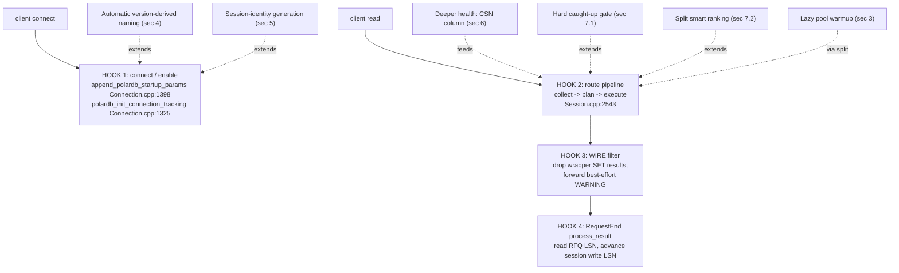
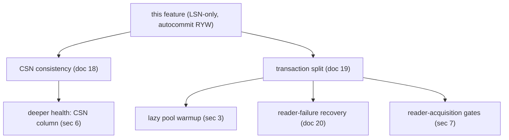
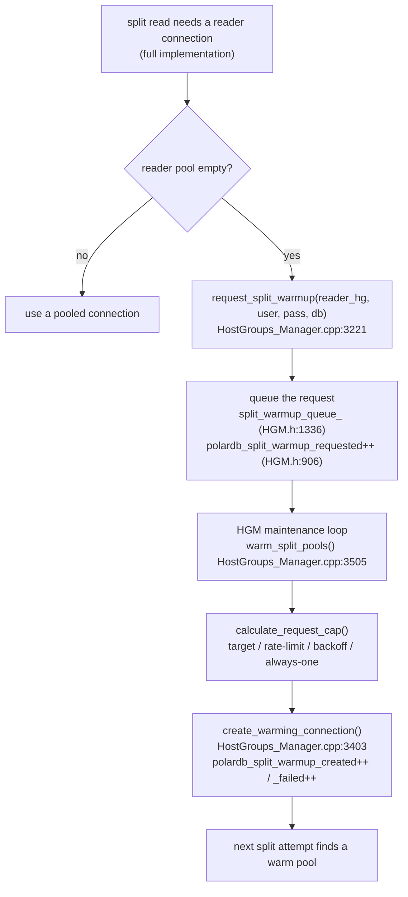
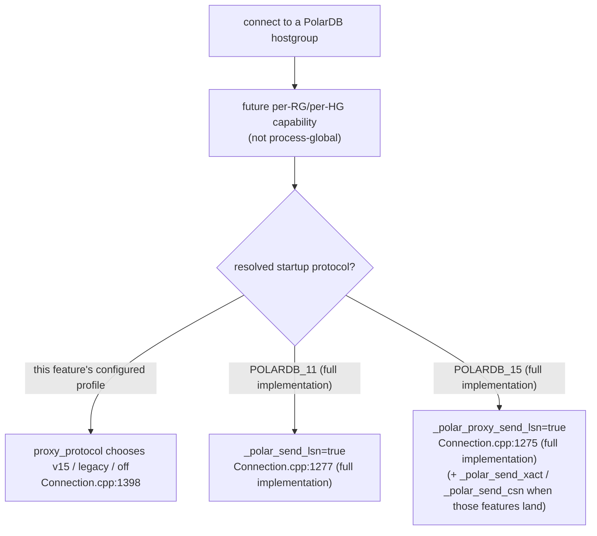

# 21 — Future: Other Capabilities from the full implementation

> Scope: the remaining PolarDB capabilities that exist in the full implementation but are NOT in this LSN-only PolarDB feature — connection-pool warmup, version-aware connection naming, session-identity generation, deeper health checks, the extra config knobs, and the reader-acquisition quality gates — described as a delta from this implementation: what each one does and exactly where it would slot back into this implementation's hooks. | Audience: R/M/O/C | Status: stable | Prereqs: [01-BACKGROUND-AND-DESIGN.md](01-BACKGROUND-AND-DESIGN.md), [05-MONITOR-AND-HGM-LSN-STATE.md](05-MONITOR-AND-HGM-LSN-STATE.md), [11-CONNECTION-AND-LIBPQ.md](11-CONNECTION-AND-LIBPQ.md), [12-THREADVARS-AND-OBSERVABILITY.md](12-THREADVARS-AND-OBSERVABILITY.md), [15-LIMITATIONS-AND-ROADMAP.md](15-LIMITATIONS-AND-ROADMAP.md) | Verified against: this branch

---

## 1. What this document is

This is a **future / not-in-this-feature** document. It describes the PolarDB capabilities that live in the **full implementation** but are **absent from this implementation**.

Three of the big future capabilities have their own dedicated documents:

| Capability | Document |
|---|---|
| CSN (commit sequence number) global consistency | [18-FUTURE-CSN-DESIGN.md](18-FUTURE-CSN-DESIGN.md) |
| In-transaction read offload (transaction split) | [19-FUTURE-TXN-SPLIT-DESIGN.md](19-FUTURE-TXN-SPLIT-DESIGN.md) |
| Reader-failure recovery / retry | [20-FUTURE-READER-FAILURE-RETRY-DESIGN.md](20-FUTURE-READER-FAILURE-RETRY-DESIGN.md) |

**This document (21) covers everything else**: the supporting and lower-profile capabilities that the full implementation has and this feature does not. They are:

1. Lazy connection-pool warmup (background opening of reader connections).
2. Version-aware connection naming (different startup parameter names for PolarDB 11 vs PolarDB 15).
3. Session-identity generation (proxy session id and cancel key).
4. Deeper health checks (the CSN health column — today a no-op even in the full implementation).
5. The reader-acquisition quality gates (the hard caught-up filter, and smart vs simple split-mode ranking).
6. The extra config knobs that go with capabilities #1–#5 above and with docs 18/19/20.

### 1.1 How to read the file:line citations in this document

This document spans **two source trees**. The rule is strict:

- **(this branch)** — a fact in this branch. This is the authority for "what this feature has and does not have."
- **(full implementation)** — a fact in the full implementation. This is the authority for "what the future code looks like."

Full-implementation citations are tagged explicitly. Check symbols
against the current checkout before using any line number.

### 1.2 Terms used here (defined on first use)

| Term | Definition |
|------|------------|
| PolarDB | An Alibaba PostgreSQL-compatible database with one primary (writer) node and one or more read replicas. |
| LSN (Log Sequence Number) | A 64-bit position in PostgreSQL's write-ahead log (WAL). Larger means newer. A replica that has replayed up to LSN X can serve any read whose data was committed at or before X. |
| CSN (Commit Sequence Number) | A 64-bit counter PolarDB increments once per commit. It supports cross-session consistency. It is a **future** feature, not in this implementation. See [18-FUTURE-CSN-DESIGN.md](18-FUTURE-CSN-DESIGN.md). |
| RYW (read-your-writes) | The guarantee that after a session writes, its own later reads see that write even when reads are routed to a replica. This implementation implements this for autocommit reads using LSN. |
| RFQ (ReadyForQuery) | The PostgreSQL wire message a backend sends after each command. With the PolarDB libpq patch the backend appends its current LSN to RFQ, so ProxySQL reads the LSN with no extra query. |
| writer / primary | The backend that takes writes and is always up to date. "writer" and "primary" mean the same node. |
| reader / replica | A read-only backend that replays the writer's WAL and may lag behind it. "reader" and "replica" mean the same node. |
| hostgroup (HG) | A ProxySQL numbered group of backend servers. A PolarDB replication-hostgroup row pairs a writer hostgroup with a reader hostgroup. |
| HGM (HostGroups Manager) | `PgSQL_HostGroups_Manager`: the class that owns backend topology and the connection pool. |
| connection pool | ProxySQL's cache of already-open, already-authenticated backend connections, reused across client requests so it does not pay connect cost per query. |
| transaction split | A future feature: running a read-only statement that sits **inside an open `BEGIN…COMMIT` transaction** on a replica. This implementation sends such reads to the writer. See [19-FUTURE-TXN-SPLIT-DESIGN.md](19-FUTURE-TXN-SPLIT-DESIGN.md). |
| GUC | "Grand Unified Configuration" variable — a PostgreSQL runtime setting changed with `SET name = value`. |
| collect / plan / execute / process_result | The four PolarDB request-pipeline stages in this implementation, all methods of `PgSQL_Session` in `lib/PgSQL_PolarDB_Flow.cpp`. See [06-ROUTING-PIPELINE.md](06-ROUTING-PIPELINE.md). |

---

## 2. Overview and where it sits in the pipeline

### 2.1 This feature ships the foundation files; the full implementation expands two domains

This branch ships **seven** PolarDB source files (this branch):

| PolarDB file (this branch) | Present in this feature? |
|---|---|
| `lib/PgSQL_PolarDB.cpp` | yes |
| `lib/PgSQL_PolarDB_Flow.cpp` | yes |
| `lib/PgSQL_PolarDB_Consistency.cpp` | yes |
| `lib/PgSQL_PolarDB_Wrap.cpp` | yes |
| `lib/PgSQL_PolarDB_Notices.cpp` | yes |
| `lib/PgSQL_PolarDB_Stubs.cpp` | yes |
| `lib/PgSQL_PolarDB_Split.cpp` | **no** (full implementation only) |
| `lib/PgSQL_PolarDB_Failure.cpp` | yes, narrow wait-read retry foundation only |

The full implementation ships the same foundation plus `lib/PgSQL_PolarDB_Split.cpp` (723 lines, full implementation) and a much larger `lib/PgSQL_PolarDB_Failure.cpp` (410 lines, full implementation). The full implementation also has a much larger HostGroups-Manager, Monitor, and Connection footprint. The capabilities in this document live in the larger HGM/Connection/Monitor code and in those expanded files.

This was confirmed by listing the files and checking symbols: this feature has no split implementation, and the split and warmup symbol names return **zero hits** in this tree (verified by grep). The local failure file contains only the autocommit wait-read retry foundation, not the full reader-failure policy.

### 2.2 The four hooks in this feature these capabilities would extend

This feature has exactly four integration hooks. Every future capability in this document attaches to one of them. The hooks are (this branch):

```
client connect ──► [HOOK 1: connect/enable + LSN request]
                         │   PgSQL_Connection::append_polardb_startup_params (Connection.cpp:1398)
                         │   PgSQL_Connection::polardb_init_connection_tracking (Connection.cpp:1325)
                         ▼
client read    ──► [HOOK 2: route pipeline] collect→plan→execute (Session.cpp:2543)
                         ▼
              [HOOK 3: WIRE filter] drop wrapper SET results; forward best-effort WARNING
                         ▼
              [HOOK 4: RequestEnd process_result] read RFQ LSN, advance session write LSN
```

The mapping from each future capability to the hook it extends:

| Future capability (this doc) | Extends which hook | Why |
|---|---|---|
| Lazy pool warmup | none directly (it is a background HGM maintenance loop); triggered only by transaction-split reads, which themselves extend HOOK 2 | warmup only fires when a split read finds an empty reader pool |
| Version-aware connection naming | HOOK 1 (connect/enable) | the conninfo emitter chooses the parameter name from the detected version |
| Session-identity generation | HOOK 1 (connect/enable) | the proxy session id / cancel key are added to the startup conninfo |
| Deeper health checks (CSN column) | the monitor (feeds HOOK 2's reader acquisition) | the monitor learns CSN the same way it learns LSN today |
| Reader-acquisition caught-up gate | HOOK 2 (route pipeline, reader acquisition) | a hard pre-filter inside the reader acquisition; this feature already has preference-only target-LSN selection |
| Smart vs simple split-mode ranking | HOOK 2 (route pipeline, reader acquisition) | split-mode reader ranking beyond this feature's target-LSN preference |
| Extra config knobs | the config layer that all hooks read | each knob lands with its owning feature |

### 2.3 The dependency order

Most of these capabilities depend on other future features. The order to layer them onto this feature:

```
this feature (LSN-only, autocommit RYW)
        │
        ├── CSN consistency (doc 18) .... independent of split; mirrors the LSN path everywhere
        │        └── deeper health check: CSN column (this doc §6)
        │
        └── transaction split (doc 19) ... enables reads inside open transactions
                 ├── lazy pool warmup (this doc §3) ...... only split reads queue warmup
                 ├── reader-failure recovery (doc 20) .... only matters once reads run inside txns
                 └── reader-acquisition extensions (this doc §7) hard caught-up gate / split smart ranking
```

CSN (doc 18) can land before or after split. **Warmup (§3) and the reader-acquisition split-mode ranking (§7) both require transaction split (doc 19) first.** Version-aware naming (§4) and session identity (§5) are independent of all of the above — they could land on their own.

---

## 3. Capability: lazy connection-pool warmup

### 3.1 What it does

In ProxySQL, a reader hostgroup that only ever serves **transaction-split reads** has a problem: split reads borrow a connection from the pool but never *create* one. So if the reader pool starts empty, it stays empty, and every split attempt fails for lack of a connection. Lazy pool warmup fixes this. When a split read needs a reader connection and the pool is empty, the session hands its **already-authenticated** credentials to the HGM. A background HGM maintenance loop then opens reader connections so the **next** split attempt finds a warm pool. It is demand-driven: the pool grows in response to real split failures, not from pre-configuration.

It also throttles. It does not open connections without limit — it caps how many it opens per interval based on a target pool size, a per-second rate limit, and an adaptive backoff that slows down when connection attempts are failing.

### 3.2 Why it is not in this feature

Warmup exists **only to support transaction-split reads**. This feature has no transaction split: this feature sends every read that is inside an open transaction to the writer (the `IN_TRANSACTION` action reason). So in this feature there is never a split read, never an empty-reader-pool-during-split situation, and nothing to warm. Warmup is tied 1:1 to the split feature (doc 19). All warmup symbols return zero hits in this tree (verified by grep).

### 3.3 The full-implementation code

| Piece | Location (full implementation) | What it is |
|---|---|---|
| Request a warmup | `PgSQL_HostGroups_Manager::request_split_warmup` (`lib/PgSQL_HostGroups_Manager.cpp:3221`) | The session calls this when a split read finds an empty pool. It queues the credentials. |
| The maintenance loop | `PgSQL_HostGroups_Manager::warm_split_pools` (`lib/PgSQL_HostGroups_Manager.cpp:3505`) | Drains the queue and opens reader connections. Called from the HGM maintenance path (`lib/PgSQL_HostGroups_Manager.cpp:3172`). |
| Open one connection | `PgSQL_HostGroups_Manager::create_warming_connection` (`lib/PgSQL_HostGroups_Manager.cpp:3403`) | Opens a single reader connection for the pool. |
| The queued request | `struct PgSQL_SplitWarmupRequest` (`include/PgSQL_HostGroups_Manager.h:121`) | Holds the reader hostgroup id plus the username/password/dbname to connect with. |
| The throttle state | `struct PgSQL_WarmupThrottleState` (`include/PgSQL_HostGroups_Manager.h:165`) | Per-hostgroup counters for adaptive throttling. |
| The caller | `lib/PgSQL_PolarDB_Split.cpp:474` (full implementation) | The split path is the only caller of `request_split_warmup`. |

The throttle decision is computed in `PgSQL_WarmupThrottleState::calculate_request_cap` (full implementation, method at `include/PgSQL_HostGroups_Manager.h:187`, inside the `PgSQL_WarmupThrottleState` struct that starts at `:165`). It applies four rules in order:

1. **Target-based**: how many connections are needed = target pool size minus current free connections.
2. **Rate-limited**: do not exceed the per-second throttle from the hostgroup attributes.
3. **Adaptive backoff**: if more than 50% of recent attempts failed, cut the cap by 75%; if more than 25% failed, cut it by 50%.
4. **Always allow one**: never return a cap below 1, to prevent starvation.

### 3.4 The state it adds

Warmup adds per-hostgroup state on the HGM (full implementation):

| State item | Location (full implementation) | Purpose |
|---|---|---|
| `split_warmup_queue_` | `include/PgSQL_HostGroups_Manager.h:1336` | The queue of pending warmup requests. |
| `warmup_throttle` | `include/PgSQL_HostGroups_Manager.h:414` | The smart throttling state for this hostgroup. |
| `pending_split_warmup` | `include/PgSQL_HostGroups_Manager.h:413` | A simple gauge of how many warmups are pending. |

### 3.5 The counters it adds

Warmup adds four stat counters to `PgHGM->status` (full implementation); this feature has **none** of them (verified absent in this branch):

| Counter (full implementation) | Location | Meaning |
|---|---|---|
| `polardb_split_warmup_requested` | `include/PgSQL_HostGroups_Manager.h:906` | Warmup requests queued (incremented at the top of `request_split_warmup`). |
| `polardb_split_warmup_created` | `include/PgSQL_HostGroups_Manager.h:907` | Connections successfully created for warmup. |
| `polardb_split_warmup_failed` | `include/PgSQL_HostGroups_Manager.h:908` | Warmup connection attempts that failed. |
| `polardb_warmup_pending` | `include/PgSQL_HostGroups_Manager.h:909` | Currently-pending warmups (a gauge). |

For comparison, this feature's LSN set has **26 stat counters + 1 `polardb_active` gate** (see [12-THREADVARS-AND-OBSERVABILITY.md](12-THREADVARS-AND-OBSERVABILITY.md)). These four warmup counters would be additions on top of that set, not part of it.

### 3.6 The knobs it adds

Warmup adds four config knobs (full implementation); this feature has **none** of them:

| Knob (full implementation) | Default | Range | Purpose |
|---|---|---|---|
| `polardb_lazy_warmup_split` | `true` | bool | Enable lazy warmup for split reads. (`lib/PgSQL_Thread.cpp:1220`, full implementation) |
| `polardb_warmup_queue_min` | `10` | 1..10000 | Floor for the warmup queue size. (`lib/PgSQL_Thread.cpp:1226`, full implementation) |
| `polardb_warmup_queue_max` | `1000` | 10..100000 | Ceiling for the warmup queue size. (`lib/PgSQL_Thread.cpp:1227`, full implementation) |
| `polardb_warmup_queue_pct` | `10` | 1..100 | Warmup queue size as a percent of `max_connections`. (`lib/PgSQL_Thread.cpp:1228`, full implementation) |

The effective queue capacity in the full implementation is computed as `clamp(pct * max_connections, min, max)` (full-implementation comment, `lib/PgSQL_Thread.cpp:1225`).

### 3.7 Where it slots into this feature

Warmup does **not** attach to a hook in this feature on its own. It attaches to the transaction-split feature (doc 19). To bring it in:

1. First bring in transaction split (doc 19) — without split reads there is nothing to warm.
2. Re-add the warmup code to the HGM and call `warm_split_pools()` from the HGM maintenance path.
3. Have the split read path call `request_split_warmup()` when it finds an empty reader pool.
4. Re-add the four knobs (§3.6) and the four counters (§3.5).

### 3.8 Warmup implementation note

Lazy warmup should be implemented directly against the current HGM/Session
flow, using the split feature's real dispatch points as the producer.

---

## 4. Capability: automatic version-derived connection naming

### 4.1 What this feature does today

This feature intentionally does **not** include automatic backend-version-derived
startup protocol selection. Startup naming is explicit: global/per-HG
`proxy_protocol` resolves to `v15`, `legacy`, or `off`. A future
`proxy_protocol=auto` should store detected capabilities per replication group
or hostgroup; a process-global version cache is the wrong shape for deployments
with different replication groups/clusters.

### 4.2 What is missing from this feature

This feature has profile-driven startup naming, not automatic version-derived naming. The connection-info emitter `append_polardb_startup_params` resolves the effective startup profile from per-HG/global `proxy_protocol`: `v15` emits `_polar_proxy_client_host`, `_polar_proxy_client_port`, and `_polar_proxy_send_lsn=true`; `legacy` emits `_polar_origin_client_ip`, `_polar_origin_client_port`, and `_polar_send_lsn=true`; `off` emits no PolarDB proxy startup params (`lib/PgSQL_Connection.cpp:1398-1436`). It still does not use the detected backend version to pick the parameter name automatically, and it never emits CSN or transaction parameters.

The full implementation uses the detected version to **choose the parameter name**, and emits more parameters. In the full implementation (`lib/PgSQL_Connection.cpp`):

| Concept | Parameter name for PolarDB 11 (full implementation) | Parameter name for PolarDB 15 (full implementation) |
|---|---|---|
| Request the LSN on RFQ | `_polar_send_lsn` (`:1277`) | `_polar_proxy_send_lsn` (`:1275`) |
| Request transaction-split metadata | `_polar_send_xact` (`:1282`) | `_polar_proxy_send_xact` (doc comment `:1231`) |
| Request the CSN on RFQ | `_polar_send_csn` (`:1288`) | (the proxy-prefixed variant per the same table) |

The full implementation picks the version with a global getter and
`PolarDB_Protocol::supports_session_id`, then emits the LSN parameter under the
version-correct name. Do not copy that shape directly into this feature; rework it as a
per-replication-group / per-hostgroup capability.

### 4.3 Where it slots into this feature

This is a change to **HOOK 1** (connect/enable). The slot is the startup-profile
resolver before `append_polardb_startup_params`. To bring automatic
version-derived naming in, add a real `auto` profile and resolve it from
per-replication-group / per-hostgroup detected capabilities, then emit `v15` or
`legacy` params.

---

## 5. Capability: session-identity generation

### 5.1 What is in this feature and what is not

This feature has no session-id/cancel-key state and no
`generate_polar_session_id` / `generate_polar_cancel_key` helpers. Session
identity is a future PolarDB15 cancel-session capability.

### 5.2 What it does (full implementation)

Session-identity generation gives each client session a unique proxy session id and a cancel key, so that PolarDB's cancel protocol can target the right session. In the full implementation:

| Piece | Location (full implementation) | What it does |
|---|---|---|
| `generate_polar_session_id` | `lib/PgSQL_PolarDB.cpp:168` | A monotonic counter starting at a base value, via an atomic add. It is built to avoid colliding with backend process ids. |
| `generate_polar_cancel_key` | `lib/PgSQL_PolarDB.cpp:195` | A cryptographically-random cancel key. |
| Declarations | `include/PgSQL_PolarDB.h:597` and `:604` (full implementation) | The free-function prototypes. |
| Call sites | `lib/PgSQL_Connection.cpp:1294` (session id) and `:1303` (cancel key), full implementation | Populate session-side cancel metadata at connect. |

The full implementation only generates the session id / cancel key when
the detected version supports them. In this feature this should be revisited as part of a
dedicated PolarDB15 cancel-session feature, not mixed into RFQ-LSN routing.

### 5.3 Where it slots into this feature

This is a change to **HOOK 1** (connect/enable). To bring it in:

1. Re-add `generate_polar_session_id` and `generate_polar_cancel_key` to `lib/PgSQL_PolarDB.cpp`.
2. Add the session-side state they populate.
3. Emit `_polar_proxy_session_id` / `_polar_proxy_cancel_key` in
   `append_polardb_startup_params`, gated on the resolved v15 capability.
4. Add cancel request routing and tests in the same feature series.

---

## 6. Capability: deeper health checks (the CSN column)

### 6.1 What this feature already does (for clarity)

The **3-column LSN health check is already in this feature.** The monitor runs a health query that returns three columns — node type, availability, and the current LSN — and parses them with `parse_polardb_full_health_check` (this branch, `lib/PgSQL_PolarDB.cpp:75`), which fills a `PolarDB_HealthCheck` (node type at `lib/PgSQL_PolarDB.cpp:77`, availability at `:78`, LSN at `:79`). The health query constant is `POLARDB_CHECK_WITH_LSN_QUERY` (defined in this branch at `lib/PgSQL_Monitor.cpp:58`, and described in the full-implementation header at `include/PgSQL_PolarDB.h:254`). This is the source that keeps each replica's cached LSN fresh between queries. See [05-MONITOR-AND-HGM-LSN-STATE.md](05-MONITOR-AND-HGM-LSN-STATE.md).

So "deeper health checks" does **not** mean this feature lacks health checks. This feature has the full LSN health path. The only missing piece is a **CSN column**.

### 6.2 What is missing — and the important caveat

The CSN health column is part of the **CSN feature (doc 18)**, and it is **incomplete and experimental even in the full implementation.** Three facts matter here:

1. **CSN requires PolarDB backend support.** Plain PostgreSQL does not expose a CSN.
2. **CSN applies only in global-consistency mode.** It is the mechanism for cross-session consistency, not single-session RYW.
3. **CSN-wait behavior is not reliably verified.** We did not run a live PolarDB backend, so the on-wire CSN value and the backend's wait semantics are taken from comments and the patch, not from observation.

Critically, in the **full implementation** the monitor's CSN update path is an **explicit no-op**, not working code:

- `lib/PgSQL_Monitor.cpp:763` (full implementation): a comment states "Keep monitor CSN as a no-op for now. Monitor connections do not request RFQ metadata; CSN should come from a future SQL health column."
- `lib/PgSQL_Monitor.cpp:1961` (full implementation): a comment states "CSN remains a no-op until the PolarDB health SQL returns it." The call to `update_server_csn` (full implementation, `lib/PgSQL_Monitor.cpp:1963`) sits behind that no-op note.

So "re-add the CSN health column" is partly "**finish** the CSN health column": the full implementation has the wiring placeholders but the monitor does not yet feed CSN. The amount of genuinely working CSN logic versus stubbed CSN logic in the full implementation was not fully measured.

### 6.3 Where it slots into this feature

The CSN column feeds the monitor, which feeds reader acquisition in **HOOK 2**. The natural slot is the existing LSN health query (`POLARDB_CHECK_WITH_LSN_QUERY`) — add a CSN column to that query and a CSN parse step alongside `parse_polardb_full_health_check`. This is one piece of the larger CSN feature; see [18-FUTURE-CSN-DESIGN.md](18-FUTURE-CSN-DESIGN.md) for the full CSN picture.

---

## 7. Capability: reader-acquisition quality gates

This feature keeps reader acquisition preference-only on purpose. The reader acquisition is `get_MyConn_polardb_reader`. It runs one filter pass for the original weighted candidate set (online, has capacity, pooled-if-asked), and when `consistency_target_lsn > 0` it also builds a fresh cached caught-up subset whose LSN is `>= consistency_target_lsn`. It tries that subset first, then falls back to the full weighted candidate set. It does **not** reject a replica solely for being behind; the `SET polar_xact_split_wait_lsn` wait gate does the catching-up.

**Important naming note:** the function name `get_MyConn_polardb_reader` is the **same in both trees**, but the body differs. This feature has consistency-target preference counters (`PolarDB_Target_LSN_Preferred`, `PolarDB_Target_LSN_Fallback_Wait`) and the explicit no-hard-reject rule (`lib/PgSQL_HostGroups_Manager.cpp:5109-5111`; `include/PgSQL_HostGroups_Manager.h:1073-1078`). The two mechanisms below are future additions or extensions to a function that already exists, not a brand-new function.

The full implementation has two extra reader-acquisition mechanisms that this feature deliberately dropped or never added.

### 7.1 The caught-up gate (a hard LSN/CSN filter)

**What it does (full implementation):** the reader acquisition **rejects** any replica whose monitor-observed LSN is below the LSN the read needs (and the CSN equivalent). It only picks replicas that are already caught up. In the full implementation this is "Filter 5" inside `get_MyConn_polardb_reader` (full implementation, `lib/PgSQL_HostGroups_Manager.cpp:2773`, the filter near `:2836`), backed by the predicates `has_replica_caught_up` (full implementation, `lib/PgSQL_HostGroups_Manager.cpp:5273`) and `has_replica_caught_up_csn` (full implementation, `lib/PgSQL_HostGroups_Manager.cpp:5350`).

**Why this feature dropped it:** this feature does not use a hard caught-up pre-filter. It prefers readers that are already fresh and caught up to the target, then falls back to the full candidate set and relies on the wait `SET` to block the read until the replica catches up. The lag cap in this feature is a **safety-only** byte bound (`max_lag_bytes`), not the correctness gate — see [14-INVARIANTS-AND-FAILURE-MODES.md](14-INVARIANTS-AND-FAILURE-MODES.md) and the glossary entry for "lag cap." Removing the hard gate keeps this feature simpler and avoids rejecting a replica that the wait would have caught up anyway.

**Caveat:** in the full implementation, `has_replica_caught_up_csn` and the CSN reader-acquisition branch have **no callers** in `lib/`, `include/`, or `test/` (verified by grep in the full implementation) — the CSN side of the gate is currently dead. The LSN side is wired.

**Where it would slot into this feature:** **HOOK 2**, inside the existing reader-acquisition helper `get_MyConn_polardb_reader`. It would replace the current preference-only fallback with an optional pre-filter, or a stricter policy mode, before the full-set weighted fallback.

### 7.2 Smart vs simple split-mode ranking

**What it does (full implementation):** when transaction split is on, the reader acquisition can run in one of two modes:

| Mode (full implementation) | Value | Behavior |
|---|---|---|
| `POLARDB_SPLIT_SIMPLE` | 1 | Take any available replica. |
| `POLARDB_SPLIT_SMART` | 2 | Sort replicas by LSN and prefer the least-lagging one. |

The selector is `get_MyConn_polardb_reader` (full implementation, `lib/PgSQL_HostGroups_Manager.cpp:2773`); the mode is chosen by the `polardb_split_mode` knob (0 disables split entirely). The smart path sorts replicas by LSN and prefers the freshest.

**Why this exact split-mode ranking is not in this feature:** smart ranking is part of transaction-split reader acquisition. This feature has no transaction split and no `polardb_split_mode` knob. This feature does have target-LSN preference for autocommit RYW reads, but it does not sort all replicas by freshness or add split-mode simple/smart policy.

**Where it would slot into this feature:** **HOOK 2**, as part of the transaction-split feature (doc 19) reader acquisition, extending the existing consistency-target preference path inside `get_MyConn_polardb_reader`.

### 7.3 The monitor CSN update

This was covered in §6.2: the full implementation's monitor CSN update (`update_server_csn`, full implementation `lib/PgSQL_Monitor.cpp:1963`) is an explicit no-op pending a CSN health column. It is listed here too because it feeds the CSN side of the caught-up gate in §7.1.

---

## 8. Capability: the extra config knobs

This feature keeps **twelve** PolarDB knobs (`lib/PgSQL_Thread.cpp` registration block):

| Knob in this feature | Default |
|---|---|
| `polardb_consistency_mode` | `"off"` |
| `polardb_lag_bytes` | `0` |
| `polardb_lag_ms` | `0` (deferred — see below) |
| `polardb_lag_wait_ms` | `1000` |
| `polardb_lsn_freshness_ms` | `5000` |
| `polardb_monitor_lsn_updates` | `true` |
| `polardb_wait_timeout_mode` | `"best_effort"` |
| `polardb_proxy_protocol` | `"v15"` |
| `polardb_route_rfq_policy` | `"strict"` |
| `polardb_session_lsn_baseline` | `"observed"` |
| `polardb_proxy_identity_host` | `""` |
| `polardb_proxy_identity_port` | `0` |

The full implementation adds **eight more** knobs that this feature does not ship. Each future knob lands **with its owning feature** — this feature's rule is "no dead knobs": do not add a knob before the feature that uses it.

| Future knob (full implementation) | Owning feature | Location (full implementation) |
|---|---|---|
| `polardb_split_mode` | transaction split (doc 19) + smart ranking (§7.2) | `lib/PgSQL_Thread.cpp:425`, default 0 |
| `polardb_lazy_warmup_split` | lazy pool warmup (§3) | `lib/PgSQL_Thread.cpp:432`, default true |
| `polardb_warmup_queue_min` | lazy pool warmup (§3) | `lib/PgSQL_Thread.cpp:433`, default 10 |
| `polardb_warmup_queue_max` | lazy pool warmup (§3) | `lib/PgSQL_Thread.cpp:434`, default 1000 |
| `polardb_warmup_queue_pct` | lazy pool warmup (§3) | `lib/PgSQL_Thread.cpp:435`, default 10 |
| `polardb_reader_death_action` | reader-failure recovery (doc 20) | `lib/PgSQL_Thread.cpp:437`, default RETRY (0) |
| `polardb_reader_timeout_action` | reader-failure recovery (doc 20) | `lib/PgSQL_Thread.cpp:438`, default RETRY (0) |
| `polardb_reader_error_action` | reader-failure recovery (doc 20) | `lib/PgSQL_Thread.cpp:439`, default FORWARD (1) |

The three reader-action knobs take values from `enum class PolarDB_ReaderAction { RETRY = 0, FORWARD = 1, TERMINATE = 2 }` (full implementation, `include/PgSQL_PolarDB.h:299`), validated to the range 0..2 (full implementation, `lib/PgSQL_Thread.cpp:2377-2379`). See [20-FUTURE-READER-FAILURE-RETRY-DESIGN.md](20-FUTURE-READER-FAILURE-RETRY-DESIGN.md).

### 8.1 The deferred ms-lag knob (inert in this feature today)

One knob in this feature is registered but **inert**: `polardb_lag_ms`. Its default is 0 (set in this branch at `lib/PgSQL_Thread.cpp:1125`, name entry at `:377`, runtime range 0 only at `:2417`), but it has **no producer** — the PolarDB path has no millisecond-lag source feeding it. The header says so directly: the freshness/lag comment states the millisecond lag is "intentionally deferred" and "Do not treat `polardb_lag_ms` as a supported routing gate" (this branch, `include/PgSQL_PolarDB.h:510-513`), and the time-lag-cap predicate carries "TODO: wire only after PgSQL/PolarDB has a real millisecond-lag producer" (this branch, `include/PgSQL_PolarDB.h:542`).

Because of this, the ms-lag path is inactive in this feature. `PolarDB_LSN_Stale_Count` is still active for the separate byte-lag safety path when `max_lag_bytes` is enabled, so operator and tuning docs must not describe it as a millisecond-lag signal. See [12-THREADVARS-AND-OBSERVABILITY.md](12-THREADVARS-AND-OBSERVABILITY.md) and [15-LIMITATIONS-AND-ROADMAP.md](15-LIMITATIONS-AND-ROADMAP.md).

---

## 9. Summary delta table

Every capability in this document, as a delta from this feature:

| Capability | In this feature? | Home in the full implementation | New state | New knobs | New counters | Hook it extends |
|---|---|---|---|---|---|---|
| Lazy pool warmup | no | HGM (`HostGroups_Manager.cpp:3221/3403/3505`) | queue + throttle (`HGM.h:165/413/414/1336`) | 4 (`Thread.cpp:432-435`) | 4 (`HGM.h:906-909`) | via transaction split (doc 19); HGM maintenance loop |
| Automatic version-derived naming | no (this feature uses configured startup profiles; `v15` already emits `_polar_proxy_send_lsn`) | `Connection.cpp:1275/1277` | none | none | none | HOOK 1 (connect) |
| Session-identity generation | no | `PgSQL_PolarDB.cpp:168/195` | session-side cancel metadata | none | none | HOOK 1 (connect) |
| Deeper health (CSN column) | no (LSN column present); **experimental, no-op in full implementation** | `Monitor.cpp:763/1961/1963` | per-server CSN cache | (part of doc 18) | (part of doc 18) | monitor → HOOK 2 |
| Caught-up gate (hard filter) | no (selector exists; this feature implements preference-only target-LSN selection, not rejection) | `HostGroups_Manager.cpp:2773/5273/5350` | optional hard pre-filter / stricter policy | none | none | HOOK 2 (reader acquisition) |
| Smart split-mode ranking | no (this feature has target-LSN preference, but no split-mode knob or sorted least-lagging policy) | `HostGroups_Manager.cpp:2773` | split-mode reader ranking | 1 (`polardb_split_mode`) | none | HOOK 2 (reader acquisition) |
| Extra knobs (8 total) | no | `Thread.cpp:425-439` | varies | 8 | varies | config layer (each with its feature) |

The "no" rows mark capabilities that are absent from this branch (verified by grep): the warmup/split/reader-action/CSN symbol names return zero hits in this feature. The two reader-acquisition rows are subtler — the selector function `get_MyConn_polardb_reader` exists in this feature and includes target-LSN preference, but deliberately omits a hard caught-up rejection gate and the split-mode sorted ranking policy (see §7). All full-implementation line numbers are tagged `(full implementation)` because this tree has different line numbers for the same symbols.

---

## 10. Notes for reviewers

- **Tree confusion is the main risk.** Every line number in §3–§8 that names a full-implementation symbol is tagged `(full implementation)`. The same symbol, if it existed in this feature, would be at a different line. Do not cross-look-up. The discrepancy is real and important (the prior design notes flags it as "DISCREPANCY 3").
- **Earlier design notes are not reflected in the current branch for session identity.** Part G.4 of the earlier design notes said session-identity generation is "in this feature." This feature has neither generator functions nor session-side cancel fields. This document follows the code, which is the authority.
- **CSN is experimental and partly stubbed even in the full implementation.** The deeper-health CSN column (§6) and the CSN side of the caught-up gate (§7.1) are no-ops or have no callers in the full implementation. "Re-add CSN" is partly "finish CSN." Keep the working-vs-stubbed line clear; the full CSN picture is in [18-FUTURE-CSN-DESIGN.md](18-FUTURE-CSN-DESIGN.md).
- **Warmup is downstream of split.** Do not plan warmup as a standalone feature — it has no purpose without transaction-split reads (doc 19) to create the empty-pool situation it solves.
- **Warmup implementation source.** Implement warmup directly in the current
  tree rather than applying a standalone patch.

---

## 11. Status and deferred

| Item | Status |
|---|---|
| Lazy pool warmup | Future. In the full implementation only. Requires transaction split (doc 19) first. |
| Automatic version-derived connection naming | Future. Independent. This feature uses configured startup profiles; `v15` already emits `_polar_proxy_send_lsn`. |
| Session-identity generation | Future. Independent. This feature has no session-side cancel fields and no generators. |
| Deeper health checks (CSN column) | Future and **experimental**. No-op even in the full implementation. Part of CSN (doc 18). |
| Caught-up gate (hard reader filter) | Future. Deliberately not used in this feature; target-LSN preference is implemented. CSN side is dead in the full implementation. |
| Smart split-mode ranking | Future. Part of transaction split (doc 19), beyond this feature's target-LSN preference. |
| Extra knobs (8) | Future. Each lands with its owning feature; this feature keeps 7 knobs. |
| `polardb_lag_ms` knob | Registered in this feature but **inert** (no producer). Deferred. |
| `PolarDB_LSN_Stale_Count` counter | Active for this feature's byte-lag stale/missing samples; not a millisecond-lag signal. |

For the consolidated roadmap and the implemented-vs-next status matrix, see [15-LIMITATIONS-AND-ROADMAP.md](15-LIMITATIONS-AND-ROADMAP.md).

---

## Appendix: Mermaid diagrams

### A1. The four hooks in this feature and which future capability extends each



### A2. Dependency order for layering the capabilities onto this feature



### A3. Lazy pool warmup flow (full implementation)



### A4. Automatic version-derived connection naming (full implementation vs this feature)



---

Verified against this branch.
