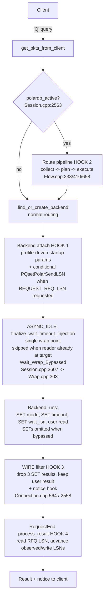
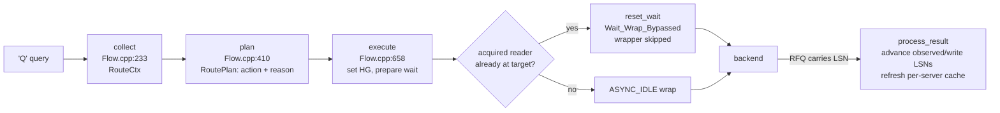
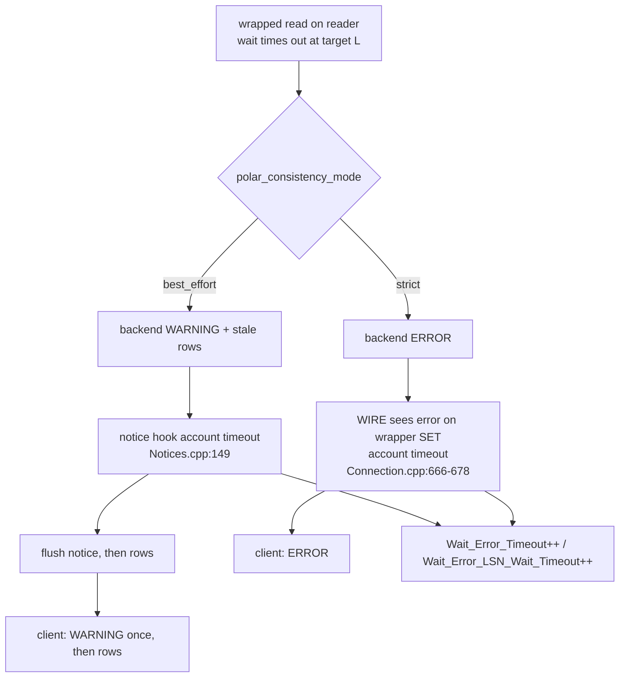

# PolarDB LSN Session-Consistency — Architecture

> Scope: the whole PolarDB read-your-writes (LSN-only) feature — components, the four integration hooks, the collect/plan/execute/process_result pipeline, query-flow diagrams, config, observability, build, and the implemented-vs-deferred status matrix. | Audience: R (PR reviewer) / M (maintainer) / O (operator) / C (contributor) | Status: stable | Prereqs: read this first; it links down to the numbered deep-dive docs (`01-BACKGROUND-AND-DESIGN.md` … `17-OPERATOR-GUIDE.md`) and to `POLARDB_STRUCTURES.md`. | Verified against: this branch

This is the main entry point for the PolarDB documentation set. It gives the complete picture of the feature in one place and links **down** into the numbered deep-dive docs for full detail. It does not repeat their depth.

---

## Table of contents

1. [What this is / scope / non-goals](#1-what-this-is--scope--non-goals)
2. [Background in one page](#2-background-in-one-page)
3. [High-level architecture](#3-high-level-architecture)
4. [Domain map and component responsibilities](#4-domain-map-and-component-responsibilities)
5. [The four integration hooks](#5-the-four-integration-hooks)
6. [The collect → plan → execute → process_result pipeline](#6-the-collect--plan--execute--process_result-pipeline)
7. [Query-flow diagrams](#7-query-flow-diagrams)
8. [Configuration at a glance](#8-configuration-at-a-glance)
9. [Observability at a glance](#9-observability-at-a-glance)
10. [Build and compatibility](#10-build-and-compatibility)
11. [Correctness summary](#11-correctness-summary)
12. [Status: implemented vs deferred](#12-status-implemented-vs-deferred)
13. [Source map and line counts](#13-source-map-and-line-counts)
14. [Glossary (quick reference)](#14-glossary-quick-reference)
15. [Document cross-reference index](#15-document-cross-reference-index)
16. [Appendix: Mermaid diagrams](#appendix-mermaid-diagrams)

---

## 1. What this is / scope / non-goals

### What this feature does

ProxySQL routes client queries to backend servers. For PostgreSQL, ProxySQL can split traffic: send writes to a **primary** (the writer node) and reads to **replicas** (reader nodes). Replicas can lag behind the primary, so a naive split breaks **read-your-writes (RYW)**: a client that just wrote data might read a replica that has not yet caught up and see stale data.

This feature adds RYW consistency for **PolarDB** (an Alibaba PostgreSQL-compatible database with one primary and read replicas). It works like this:

1. After a write, ProxySQL records the write's position in the write-ahead log — the **LSN (Log Sequence Number)**, a 64-bit number that grows with every write.
2. On a later read that is allowed to go to a replica, ProxySQL tells the replica: "do not answer until you have replayed past LSN X." Simple queries use prepended `SET` statements (the **wait wrapper**); negotiated `v15_wait` extended queries put a `W` message before Parse or Execute in the same flush. The replica blocks until it has caught up, then runs the read.
3. ProxySQL learns the LSN with no extra query: a patched libpq reads it from the **ReadyForQuery (RFQ)** message the backend already sends after every command.

The result: the client's own reads always see its own writes, even when those reads run on a replica.

### Scope (what this feature ships)

| In scope | Notes |
|---|---|
| LSN-based session RYW | The session's own writes are visible to its own later reads. |
| Autocommit reads plus simple-query transaction split | Eligible autocommit reads use normal reader routing; when `txn_split_enabled=1`, one eligible simple-query read inside a splittable transaction may temporarily use a reader. |
| Simple and extended autocommit reads | Extended reads require the negotiated `v15_wait` profile when a wait target exists. |
| `best_effort` and `strict` timeout modes | On a wait timeout, `best_effort` serves stale data with a WARNING; `strict` raises an ERROR. |
| Byte-lag safety cap | An optional cap that keeps reads off a replica that is too far behind. |
| Compile-time isolation | PolarDB-specific runtime surfaces are behind `POLARDB_PROXY`; generic extended-protocol correctness is shared. |

### Non-goals (explicitly NOT in this feature)

These are described, framed as future work, in `15-LIMITATIONS-AND-ROADMAP.md` and the future-design docs `18-FUTURE-CSN-DESIGN.md` … `21-FUTURE-OTHER-CAPABILITIES.md`. They describe the **full implementation**, not this branch.

| Non-goal | Why out of scope here |
|---|---|
| **CSN (Commit Sequence Number) / global consistency** | A different consistency unit (commit counter, not WAL byte position) for cross-session consistency. **Experimental and incomplete** even in the full implementation: it requires PolarDB backend support, applies only in global-consistency mode, and its wait behavior is not reliably verified. Not present in this branch at all. |
| **Advanced transaction-split extensions** | The branch ships simple-query transaction split, split counters, lazy warmup, and the common reader-failure policy. Advanced split-mode ranking, CSN integration, and circuit-breaker reader quarantine remain future work. |
| **Extended reader-failure policies** | RETRY / FORWARD / TERMINATE is implemented for autocommit wait reads and simple-query split reads. Per-error-class policy tables, retry budgets, and reader circuit-breakers remain future work. |
| **Extended-protocol transaction split** | Autocommit extended RYW is implemented with `v15_wait`; importing an open transaction into an extended reader flow remains out of scope. |
| **Millisecond lag cap** | A time-based (vs byte-based) lag check. The knob exists but is inert — see [§12](#12-status-implemented-vs-deferred). |

---

## 2. Background in one page

Full detail is in `01-BACKGROUND-AND-DESIGN.md`. The short version:

**The RYW problem.** Read/write splitting sends writes to the primary and reads to replicas to spread load. Replicas apply the primary's changes asynchronously, so a replica is usually slightly behind. If a client writes a row and then immediately reads it from a replica, the replica may not have that row yet. The client "loses its own write." That is the bug this feature prevents.

**PolarDB's mechanism.** PolarDB exposes two things ProxySQL uses:

- It can **append the current WAL LSN to every ReadyForQuery (RFQ) message**. With a patched libpq, ProxySQL reads that LSN for free after each query (`lib/PgSQL_Connection.cpp:1349-1359`). No extra round-trip.
- It honors a server setting, `polar_xact_split_wait_lsn`. When a read on a replica is preceded by `SET polar_xact_split_wait_lsn = '<target>'`, the replica blocks until it has replayed up to that LSN before running the read.

**The wait-on-replica condition.** ProxySQL records each session's highest write LSN (`polardb_session_consistency.write_lsn`, `include/PgSQL_Session.h:505`). When that session next issues a replica-eligible read, ProxySQL prefixes the read with the `SET` that makes the replica wait for that LSN. The wait — not any LSN comparison inside ProxySQL — is the actual consistency guarantee. Any LSN check ProxySQL does on its own is only a **safety** filter (see [§11](#11-correctness-summary)).

**Two timeout modes.** The replica's wait can time out (it never catches up in time). `polar_consistency_mode` chooses the outcome:

- `best_effort` — the replica returns possibly-stale rows and emits a WARNING. The read still succeeds.
- `strict` — the replica raises an ERROR and the read fails.

---

## 3. High-level architecture

The feature sits inside the normal PostgreSQL session path. The PolarDB code only runs when a PolarDB hostgroup is configured; otherwise a worker-local `polardb_is_active()` check skips all of it. The shared HGM atomic is consumed during publication refresh, not per query.

A **hostgroup (HG)** is a numbered group of backend servers. A PolarDB pair links one writer HG and one reader HG.

```
                          ┌───────────────────────── PgSQL_Session (one per client) ──────────────────────────┐
                          │                                                                                   │
   client ──('Q' query)──►│  get_pkts_from_client()                                                           │
                          │     │                                                                             │
                          │     │  if (thread->polardb_is_active())   ◄── worker-local fast bypass           │
                          │     ▼                                          (Session.cpp:2543)                 │
                          │  ┌─────────── PolarDB route pipeline (HOOK 2) ───────────┐                        │
                          │  │ collect  → plan      → execute                        │   Flow.cpp:233/410/658  │
                          │  │ (snapshot) (decide)    (set current_hostgroup,        │                        │
                          │  │                         prepare wait state)           │                        │
                          │  └───────────────────────────────────────────────────────┘                        │
                          │     │                                                                             │
                          │     ▼  find_or_create_backend(current_hostgroup)                                  │
                          │  ┌──────────── backend attach (HOOK 1) ────────────┐                              │
                          │  │ fresh connect: profile-driven proxy startup +   │  Connection.cpp              │
                          │  │   PQsetPolarSendLSN(conn,1)                     │  Connection.cpp:1335         │
                          │  │ pooled/fresh: is_polardb_enabled = true         │  Session.cpp:5696/5710       │
                          │  └─────────────────────────────────────────────────┘                              │
                          │     │                                                                             │
                          │     ▼  ASYNC_IDLE: finalize_wait_timeout_injection()  (build wrapper)             │
                          │        (single wrap point, Session.cpp:3607 → Wrap.cpp:303)                       │
                          │     │                                                                             │
                          └─────┼─────────────────────────────────────────────────────────────────────────────┘
                                │
                                ▼  backend runs:  SET mode ; SET timeout ; SET wait_lsn ; <user read>
                          ┌──────────── PgSQL_Connection (backend, HOOK 3) ─────────────┐
                          │ WIRE filter: drop the 3 SET results, forward only the user  │  Connection.cpp:564-592
                          │ result. notice hook captures best_effort timeout WARNING.   │  Connection.cpp:2558-2563
                          └─────────────────────────────────────────────────────────────┘
                                │
                                ▼  RequestEnd() success (HOOK 4)
                          ┌────────── process_result ───────┐
                          │ read RFQ LSN, advance           │  Session.cpp:6098-6105 →
                          │ polardb_session_consistency.write_lsn       │
                          └─────────────────────────────────┘
                                │
                                ▼  result (+ any captured notice) returned to client
```

Cross-thread state has two owners. The **HostGroups Manager (HGM)** owns topology,
configuration snapshots, and process-wide counters. Each `PgSQL_SrvC` owns its
FREE/USED connection lists, exact-key index, counts, and one pool mutex. Session
state remains driven by one worker at a time. A selected connection may be retained
by that worker for the current event-loop pass, but only after the server has been
chosen. `POLARDB_STRUCTURES.md` is the full ownership reference, and
`51-READERPOOL-TRANSFER-AND-LOCKING.md` describes the transfer and lock order.

---

## 4. Domain map and component responsibilities

This section maps the feature two ways. First as **domains** — subsystems grouped by what they are responsible for. Then as the **files** that implement them. The domain view is the better way to understand the design; the file view is the better way to find code. They describe the same feature at two zoom levels.

### The domains (subsystems)

The feature is grouped into nine documentation domains. Six run inside one client
session and are driven by one worker at a time. Shared state uses two lock levels:
the HGM read/write lock for topology and per-server pool mutexes for connection
list transfers. Two domains (admin schema and build) are set up once and then read.

```
┌──────────── PgSQL_Session  (one client; one driving thread; no locks) ─────────────┐
│                                                                                    │
│  REQUEST PATH                                              RESPONSE PATH           │
│  ┌─────────────────────┐   ┌──────────────────┐    ┌──────────────────┐            │
│  │ 1 Routing pipeline  │──►│ 2 Query wrapping │──► │ 3 Wait & notices │            │
│  │   (consistency      │   │   single wrap pt │    │   timeout mode,  │            │
│  │    planner)         │   │   build SETs +   │    │   capture/forward│            │
│  │   collect→plan→     │   │   inject; latency│    │   the NOTICE     │            │
│  │   execute; matrix;  │   │   doc 07         │    │   doc 08         │            │
│  │   lag cap; doc 06   │   └──────────────────┘    └──────────────────┘            │
│  └─────────┬───────────┘                                     │                     │
│            │                                       ┌──────────▼───────────┐        │
│            │                                       │ 4 Process result &   │        │
│            │                                       │   write tracking:    │        │
│            │                                       │   read RFQ           │        │
│            │                                       │   LSN, advance       │        │
│            │                                       │   session consistency│        │
│            │                                       │   LSN state          │        │
│            │                                       │   doc 09             │        │
│            │                                       └──────────────────────┘        │
│  ┌─────────▼──────────────────────────────────────────────────────────────────┐    │
│  │ 5 Session orchestration — the four hooks, the per-query reset, all call    │    │
│  │   sites that drive domains 1–4.  doc 10                                    │    │
│  └────────────────────────────────────────────────────────────────────────────┘    │
└─────────────────────────────────────────┬──────────────────────────────────────────┘
                                          │
   ┌─────────────── 6 Connection & libpq  (backend side, per session) ───────────────┐
   │ startup profile • PQsetPolarSendLSN • inline SET filter • get RFQ LSN           │
   │ doc 11                                                                          │
   └─────────────────────────────────────────┬───────────────────────────────────────┘
                                             │
 ═════════ shared across threads: HGM rwlock + per-server pool mutexes + atomics ═════════
   ┌─────────────────────────── 7 Monitor & HGM LSN state ───────────────────────────────┐
   │ polardb_active condition • per-server LSN cache • topology maps • lag inputs • counters  │
   │ doc 05                                                                              │
   └─────────────────────────────────────────────────────────────────────────────────────┘
                                              │
 ─────────────────────────── set up once, then read ───────────────────────────
   ┌────────── 8 Admin schema & policy (doc 04) ──────────┐  ┌──── 9 Build & compatibility (doc 02) ────┐
   │ pgsql_replication_hostgroups columns • three-tier    │  │ POLARDB_PROXY toggle • empty stub TU •   │
   │ config resolution • thread-vars • load/save/sync     │  │ libpq RFQ-LSN patch • byte-equivalence   │
   └──────────────────────────────────────────────────────┘  └──────────────────────────────────────────┘
```

| # | Domain (subsystem) | What it owns | Main files | Thread model | Deep-dive |
|---|---|---|---|---|---|
| 1 | Routing pipeline (consistency planner) | The per-query decision: gather inputs, plan the action, apply it. The decision matrix, the safe writer-fallback rules, the lag cap. | `lib/PgSQL_PolarDB_Flow.cpp`, `lib/PgSQL_PolarDB_Consistency.cpp`, inline helpers in `include/PgSQL_PolarDB.h` | per-session (no locks) | `06-ROUTING-PIPELINE.md` |
| 2 | Query wrapping | Build and inject the wait-wrapper SQL once (the single wrap point). Wait-latency accounting. RESET cleanup. | `lib/PgSQL_PolarDB_Wrap.cpp` | per-session | `07-QUERY-WRAPPING.md` |
| 3 | Wait-timeout & notices | best_effort vs strict timeout behavior. Structured timeout-marker detection. Capture the timeout NOTICE and forward it ahead of the result. | `lib/PgSQL_PolarDB_Notices.cpp` | per-session | `08-WAIT-TIMEOUT-AND-NOTICES.md` |
| 4 | Result processing & write tracking | Read the backend RFQ LSN once. Advance `polardb_session_consistency.write_lsn` on a write. Refresh the per-server LSN cache. The write/read heuristic. | `lib/PgSQL_PolarDB_Flow.cpp` (polardb_process_result), `lib/PgSQL_PolarDB.cpp` | per-session | `09-PUBLISH-AND-WRITE-TRACKING.md` |
| 5 | Session orchestration | The four hook points, the unconditional per-query reset, and every call site into domains 1–4. | `lib/PgSQL_Session.cpp`, `include/PgSQL_Session.h` | per-session | `10-SESSION-INTEGRATION.md` |
| 6 | Connection & libpq | Ask the backend to report its LSN (conninfo + `PQsetPolarSendLSN`). The inline SET-result filter. Read the RFQ LSN. | `lib/PgSQL_Connection.cpp`, `include/PgSQL_Connection.h`, the libpq patch | per-session (backend side) | `11-CONNECTION-AND-LIBPQ.md` |
| 7 | Monitor, HGM, and server-pool state | The `polardb_active` condition, topology snapshots, per-server LSN cache, exact-key FREE/USED ownership, lag inputs, and counters. | `lib/PgSQL_HostGroups_Manager.cpp`, `include/PgSQL_HostGroups_Manager.h`, `lib/PgSQL_PolarDB_ReaderPool.cpp`, `lib/PgSQL_Monitor.cpp` | **shared** (atomics, HGM rwlock, per-server pool mutex) | `05-MONITOR-AND-HGM-LSN-STATE.md`, `51-READERPOOL-TRANSFER-AND-LOCKING.md`, `99-GLOBAL-PIPELINE-AND-LOCKING.md` |
| 8 | Admin schema & policy | The `pgsql_replication_hostgroups` columns. Three-tier config resolution. The thread-vars. Load / save / sync / disk-upgrade. | `lib/ProxySQL_Admin.cpp`, `include/ProxySQL_Admin_Tables_Definitions.h`, `include/proxysql_structs.h`, `lib/PgSQL_Thread.cpp`, `ProxySQL_Cluster/Config/Disk_Upgrade` | process-wide (set once) | `04-ADMIN-SCHEMA-AND-CONFIG.md` |
| 9 | Build & compatibility | The `POLARDB_PROXY` toggle. The empty stub TU. The libpq RFQ-LSN patch. Both-tier byte-equivalence. | `Makefile`s, `lib/PgSQL_PolarDB_Stubs.cpp`, `deps/postgresql/polardb_libpq.patch`, checks in `include/PgSQL_PolarDB.h` | build / link time | `02-BUILD-TOGGLE-AND-LIBPQ.md` |

### How the domains connect

- **A read flows through the per-session domains in order.** Session orchestration (5) calls the routing pipeline (1). For a replica-with-wait read, the pipeline hands wait intent to query wrapping (2); the connection (6) sends the wrapped query and filters out the prepended SET results; wait & notices (3) handle a best_effort timeout; result processing (4) records the result LSN. Orchestration (5) ties them together at exactly four hooks (see section 5).
- **Shared ownership is explicit.** HGM protects topology changes. A selected
  server protects only its own FREE/USED transfer. The legal nested order is HGM
  then server; server then HGM is forbidden.
- **The query path keeps the shared boundary narrow.** Routing reads immutable
  topology plus atomic server signals without a mutex. After server selection,
  exact local reuse needs no mutex; a shared take/return uses only that server's
  mutex. Result processing also refreshes the per-server LSN cache atomically.
- **Two domains are foundations.** Admin schema & policy (8) and Build & compatibility (9) are set up once — at config load and at compile time — and then only read by the domains above.
- **The full implementation has more domains.** This tree carries the LSN route/wait path, simple-query transaction split, lazy split warmup, split counters, and common reader-failure policy. Advanced split ranking, CSN, retry budgets, and reader circuit-breaker quarantine remain future work in [15-LIMITATIONS-AND-ROADMAP.md](15-LIMITATIONS-AND-ROADMAP.md) and docs 18–21.

### Dedicated PolarDB sources

The authoritative inventory is the `lib/Makefile` object list, not historical line counts. Shared declarations live in `PgSQL_PolarDB.h`, `PgSQL_PolarDB_Counters.h`, and `PgSQL_PolarDB_ReaderPool.h`. Implementation is split by domain across `Consistency`, `Failure`, `Flow`, `Notices`, `Protocol`, four `ReaderPool` translation units, `Split`, `Topology`, and `Wrap`. `PgSQL_PolarDB_Stubs.cpp` is intentionally empty because generic off-build code calls no PolarDB symbol. Generic extended-protocol frame/error/RFQ fixes live in core session/connection files and compile in both tiers.

### Core files carrying `#if POLARDB_PROXY` blocks (integration points)

| File | Carries |
|---|---|
| `include/PgSQL_Session.h` | PolarDB session members + method declarations (`:476-534`). |
| `include/PgSQL_Connection.h` | Per-connection wrap-state + LSN members and the documented wire-sequence comment. |
| `include/PgSQL_HostGroups_Manager.h` | `status.polardb_active` condition, per-HG and per-server LSN cache, and the status fields fed by the generated PolarDB counter metadata. |
| `include/PgSQL_Query_Processor.h` | `replica_eligible` and `force_primary_hint` query-rule/QPO fields. |
| `include/ProxySQL_Admin_Tables_Definitions.h` | Schema for `pgsql_replication_hostgroups` (the `polardb` `check_type` and LSN columns) at `:308`. |
| `include/proxysql_structs.h` | The twelve `pgsql_thread___polardb_*` thread-local config variables. |
| `lib/PgSQL_Connection.cpp` | **Hooks 1 + 3** — conninfo, `is_polardb_enabled`, LSN parsing enable/read, WIRE filter, notice hook. |
| `lib/PgSQL_Session.cpp` | **Hooks 2 + 4** — route pipeline call site, pooled/fresh enable, wrap finalize, result processing. |
| `lib/PgSQL_HostGroups_Manager.cpp` | Topology maps, per-server LSN cache, `polardb_update_server_lsn`, `polardb_active` set at `:1864`. |
| `lib/PgSQL_Monitor.cpp` | `polardb` `check_type` health probe + monitor-driven per-server LSN cache updates. |
| `lib/PgSQL_Query_Processor.cpp` | Propagates `replica_eligible` through query-rule match/apply/log. |
| `lib/PgSQL_Thread.cpp` | Declares / initializes / get / set the `pgsql-polardb_*` config variables. |
| `lib/ProxySQL_Admin.cpp`, `ProxySQL_Admin_Disk_Upgrade.cpp`, `ProxySQL_Cluster.cpp`, `ProxySQL_Config.cpp` | Load/save/sync/disk-upgrade of the PolarDB columns. |
| `src/Makefile`, `lib/Makefile`, `Makefile` | The `-DPOLARDB_PROXY` flag and helper targets. |

Deep-dives: `10-SESSION-INTEGRATION.md`, `11-CONNECTION-AND-LIBPQ.md`, `05-MONITOR-AND-HGM-LSN-STATE.md`, `04-ADMIN-SCHEMA-AND-CONFIG.md`, `12-THREADVARS-AND-OBSERVABILITY.md`.

---

## 5. The four integration hooks

The whole feature attaches to the normal session path at exactly four points. This is the most useful map for a reviewer to start from.

```
client write ──► [HOOK 1: connect / enable + request LSN reporting]
                       │
client read  ──► [HOOK 2: route pipeline]  collect → plan → execute   (in get_pkts_from_client)
                       │  (REPLICA_WITH_WAIT saves intent only; wrapper built later)
                       ▼
              ASYNC_IDLE: finalize_wait_timeout_injection (build wrapper packet, single point)
                       ▼  backend runs:  SET mode ; SET timeout ; SET wait_lsn ; <user read>
              [HOOK 3: WIRE filter] drop the 3 SET results, keep the user result
                                    + notice hook forwards the best_effort timeout WARNING
                       ▼
              [HOOK 4: RequestEnd process_result] read RFQ LSN, advance session write/observed LSNs
```

### HOOK 1 — connect / enable

Marks the session as PolarDB-enabled and asks the backend to report its LSN. Three sites, because a connection can be fresh or reused from the pool:

| Site | What it does | file:line |
|---|---|---|
| Fresh-connect startup profile | When the backend HG is a PolarDB HG, resolve per-HG/global `proxy_protocol`, emit v15, legacy, or no PolarDB proxy startup params, record the startup profile, and set `is_polardb_enabled = true`. | `lib/PgSQL_Connection.cpp` |
| After a successful connect | `polardb_init_connection_tracking()` calls `PQsetPolarSendLSN(conn, 1)` so the patched libpq parses the LSN PolarDB appends to RFQ. | `lib/PgSQL_Connection.cpp:1325` (function definition); `:1335` (the `PQsetPolarSendLSN` call). |
| Pooled or fresh, in the session | A reused pooled connection never runs `connect`, so the session enable flag is also set when getting/creating a backend for a PolarDB HG. | `lib/PgSQL_Session.cpp:5696-5697` (pooled), `:5710-5711` (fresh). |

Detail: `11-CONNECTION-AND-LIBPQ.md`, `02-BUILD-TOGGLE-AND-LIBPQ.md`.

### HOOK 2 — route pipeline

In `PgSQL_Session::get_pkts_from_client()`, enabled by the worker-local `thread->polardb_is_active()` snapshot. It unconditionally resets the per-query LSN target, skips the pipeline for manual routing, then runs `collect → plan → execute` and overwrites `current_hostgroup`.

| Step | file:line |
|---|---|
| Per-query reset of `polardb_query.reader_plan.consistency_target_lsn` | `lib/PgSQL_Session.cpp:2532` |
| condition on worker-local `polardb_is_active()` | `lib/PgSQL_Session.cpp` |
| Manual-mode skip (`replica_eligible == -1` and a rule set a destination HG) | `lib/PgSQL_Session.cpp:2546-2551` |
| `polardb_collect(...)` | `lib/PgSQL_Session.cpp:2554` |
| `polardb_plan(...)` | `lib/PgSQL_Session.cpp:2556` |
| `polardb_execute(...)` → `current_hostgroup` | `lib/PgSQL_Session.cpp:2558-2559` |
| PASSTHROUGH with an explicit target HG | `lib/PgSQL_Session.cpp:2560-2564` |

Detail: `06-ROUTING-PIPELINE.md`.

### HOOK 3 — WIRE filter + wait/notice

Three coordinated sites on the backend connection:

| Site | What it does | file:line |
|---|---|---|
| Wrapper build/install | At `ASYNC_IDLE`, `finalize_wait_timeout_injection(myconn, myds)` builds the multi-statement wait wrapper exactly once and replaces the `'Q'` packet; on FAILED it sends a clean error and ends the request instead of sending an unwrapped replica read. | `lib/PgSQL_Session.cpp:3590-3604` (call at `:3595`). |
| WIRE result filter | In `PgSQL_Connection::handler()`, each prepended `SET` result (`PGRES_COMMAND_OK`/`PGRES_EMPTY_QUERY`) is silently consumed and its buffer recycled; only the (N+1)th result — the user's read — reaches the client. A wrapper `SET` ERROR (e.g. a strict-mode timeout) is accounted, then flows through normally. | `lib/PgSQL_Connection.cpp:564-592`. |
| Notice forwarding | `notice_handler_cb` always calls `polardb_handle_notice(conn, result)` so a `best_effort` wait-timeout WARNING is accounted and re-queued to be sent ahead of the user result — even when the generic result was already rotated out. | `lib/PgSQL_Connection.cpp:2558-2563` → `lib/PgSQL_PolarDB_Notices.cpp:97`. |

Detail: `07-QUERY-WRAPPING.md`, `08-WAIT-TIMEOUT-AND-NOTICES.md`.

### HOOK 4 — RequestEnd / process_result

In `PgSQL_Session::RequestEnd()` on the success path (`called_on_failure == false`), when `is_polardb_enabled`, call `polardb_process_result(myds, query_digest_text)`. It reads the RFQ LSN (no extra round-trip) and, on a write that carried an LSN, advances `polardb_session_consistency.write_lsn`.

| Step | file:line |
|---|---|
| check + call | `lib/PgSQL_Session.cpp` (call at `:6103`). |

Detail: `09-PUBLISH-AND-WRITE-TRACKING.md`.

---

## 6. The collect → plan → execute → process_result pipeline

This is the core of the feature. There are four stages, all methods of `PgSQL_Session`, all in `lib/PgSQL_PolarDB_Flow.cpp`. The first three run on the request path before the backend is chosen; the fourth runs on the response path.

| Stage | Entry point | Side effects? | One-line job |
|---|---|---|---|
| collect | `polardb_collect()` `Flow.cpp:233` | May clear stale session LSN state after writer-epoch change | Snapshot every routing input into `PolarDB_Query_RouteCtx`. |
| plan | `polardb_plan()` `Flow.cpp:410` | None (reads HGM only for the lag cap) | Decide PASSTHROUGH / FORCE_PRIMARY / REPLICA_WITH_WAIT into `PolarDB_Query_RoutePlan`. |
| execute | `polardb_execute()` `Flow.cpp:658` | Yes — sets the target HG and prepares the wait state | Apply the decision. For REPLICA_WITH_WAIT, snapshot the query and prepare the wait. |
| process_result | `polardb_process_result()` | Yes — advances session write/observed LSN state and flags | On a positioned RFQ, advance observed LSN; on a positioned write, advance write LSN; maintain missing-LSN flags; refresh the per-server LSN cache. |

```
 REQUEST PATH                                                      RESPONSE PATH
 ───────────────────────────────────────────────                  ──────────────────────────────
 client 'Q'
   │
   ▼  collect()            ── PolarDB_Query_RouteCtx (all inputs) ──►
   │  Flow.cpp:233
   ▼  plan()               ── PolarDB_Query_RoutePlan (action + reason) ─►          polardb_process_result()
   │  Flow.cpp:410                                                              reads RFQ LSN
   ▼  execute()            ── current_hostgroup, prepared wait state ──►       if is_write && has_lsn:
   │  Flow.cpp:658                                                               session.write_lsn = max(..)
   ▼  acquire reader → if reader already at target: reset_wait() (Wait_Wrap_Bypassed)
   ▼  (ASYNC_IDLE) wrap   (skipped when bypassed)                              refresh per-server LSN cache
   ▼  backend                                                       ◄─── RFQ (carries LSN) ───
```

### The decision matrix (what `plan()` decides)

`plan()` is evaluated strictly top-down; the **first** matching rule returns. Assume the pipeline is entered: a PolarDB HG is configured, it is not manual mode, `is_polar_hg` is true, and a reader HG exists. Columns show the resulting **action** and **action reason**. A dash means "that input does not matter at the row that decides."

| consistency_mode | in txn | multi-stmt | extended | session has LSN target? | lag over cap | Action | Action reason | Decided at |
|---|---|---|---|---|---|---|---|---|
| `replica_eligible = 0` (rule did not opt in) | — | — | — | — | — | PASSTHROUGH (writer) | — | `Flow.cpp:428` |
| any, with `/* route=primary */` hint | — | — | — | — | — | FORCE_PRIMARY | HINT_PRIMARY | `Flow.cpp:440` |
| OFF | — | — | — | — | — | PASSTHROUGH (rules own, target = -1) | — | `Flow.cpp:466` |
| EVENTUAL | no | no | no | no | no | PASSTHROUGH (reader) | — | `PgSQL_PolarDB_Flow.cpp` |
| any, `read_target=primary` | — | — | — | — | — | FORCE_PRIMARY | READ_TARGET_PRIMARY | `PgSQL_PolarDB_Flow.cpp` |
| SESSION_LSN | yes | — | — | — | — | FORCE_PRIMARY | IN_TRANSACTION | `Flow.cpp:474-483` |
| SESSION_LSN | no | yes | — | — | — | FORCE_PRIMARY | MULTI_STATEMENT | `Flow.cpp:474-483` |
| SESSION_LSN | no | no | yes | no (`polardb_session_consistency.target() == 0`) | — | PASSTHROUGH (reader, no `W`) | — | extended-operation route |
| SESSION_LSN | no | no | yes | yes (`> 0`) | usable `v15_wait` reader acquired | REPLICA_WITH_WAIT (reader + in-band `W`), or target-ready bypass | NONE | extended-operation route + `HGM.cpp` |
| SESSION_LSN | no | no | yes | yes (`> 0`) | no usable `v15_wait` reader | FORCE_PRIMARY | EXTENDED_PROTOCOL / acquisition status | extended-operation route + `HGM.cpp` |
| SESSION_LSN | no | no | no | no (`polardb_session_consistency.target() == 0`) | — | PASSTHROUGH (reader, no wait) | — | `Flow.cpp` |
| SESSION_LSN | no | no | no | yes (`> 0`) | cap attached to `plan.reader`; reader safety checked during backend acquisition | REPLICA_WITH_WAIT, or one-query writer fallback if acquisition returns a safety status | NONE at plan time; `PolarDB_ReaderStatus` at acquisition time | `Flow.cpp`, `HGM.cpp` |
| SESSION_LSN | no | no | no | yes (`> 0`) | no cap failure and compatible reader acquired | REPLICA_WITH_WAIT (reader + SQL LSN wait) | NONE | `Flow.cpp`, `HGM.cpp` |

**A common mistake to avoid:** the "session has LSN target?" column does **not** mean "the current query is a write." The current query is already known to be a replica-safe read (`replica_eligible == 1`). The column means "does this session already have a monotonic target" — i.e. `polardb_session_consistency.target() > 0`, derived from prior positioned writes and prior positioned observations. There is no per-query is-write flag in `plan()`. `is_write_query()` is used only on the result-processing path, never in routing (`lib/PgSQL_PolarDB.cpp:102`).

Other things you can read off the matrix:

- `/* route=primary */` and `read_target=primary` both force the writer regardless of consistency mode.
- `consistency_mode = OFF` returns PASSTHROUGH with target `-1`, which means "leave routing to the query rules" — it is **not** a force-to-reader.
- Extended autocommit reads share the same route plan. Manual routes remain authoritative; target-free reads can use a reader without `W`; known-target reads use `W` on `v15_wait` or a confirmed target-ready bypass; other startup profiles, unknown targets, ambiguous/multi-operation frames, and in-transaction extended reads use the writer.

Full per-stage detail, every action reason, and the lag-cap internals: `06-ROUTING-PIPELINE.md`.

---

## 7. Query-flow diagrams

Four common flows. Full step-by-step traces with the exact GUCs emitted and the session state before and after each stage are in `13-QUERY-LIFECYCLE-AND-TRACES.md` (scenarios T1–T6). These diagrams are the summary.

### Flow A — no-PolarDB passthrough

No PolarDB HG is configured, so the worker-local condition is false and the entire pipeline is skipped.

```
client 'Q' ──► get_pkts_from_client()
                  │  thread->polardb_is_active() == false
                  ▼  (PolarDB block skipped entirely)
               find_or_create_backend(current_hostgroup)   ── normal ProxySQL routing
                  ▼
               backend runs the user query unchanged
                  ▼
               RequestEnd(): is_polardb_enabled == false → no process_result
                  ▼
               result returned to client
```

### Flow B — RYW write→read (the core case)

A write sets the session LSN; the next replica-eligible read is wrapped to wait for it.

```
WRITE (e.g. INSERT/UPDATE), routed to the writer:
   ... runs on primary ...
   RequestEnd success → polardb_process_result()
       is_write = true, RFQ LSN = L
       polardb_session_consistency.write_lsn = max(0, L) = L         Flow.cpp:944-949

READ (replica_eligible, autocommit, simple query):
   collect()  → polardb_session_consistency.write_lsn = L
   plan()     → SESSION_LSN, session has written, lag OK
              → REPLICA_WITH_WAIT (target = L)            Flow.cpp:599-603
   execute()  → current_hostgroup = reader_hg
              → prepare wait state, snapshot query        Flow.cpp:714-728
   backend acquisition:
     ├─ reader already at L (acquired from the
     │    target-reached prefix → wait_bypass_allowed):
     │      reset_wait(); Wait_Wrap_Bypassed++
     │      → wrapper SKIPPED, the bare <user SELECT> goes to the reader
     │        (the reader is already caught up, so the wait would be a no-op)
     └─ reader behind L (fell back to the full set): keep the staged wait
   ASYNC_IDLE → finalize_wait_timeout_injection()  (emits nothing when bypassed)  Wrap.cpp:303
       backend receives ONE packet (non-bypass path):
         SET polar_consistency_mode = 'best_effort';
         SET polar_proxy_wait_timeout_ms = <ms>;
         SET polar_xact_split_wait_lsn = '<L>';
         <user SELECT>
   WIRE filter → drop 3 SET results, forward SELECT      Connection.cpp:564
   result returned to client  (guaranteed to include the write)
```

### Flow C — best_effort timeout

The replica does not catch up in time; in `best_effort` it serves stale data with a WARNING.

```
wrapped read on reader, polar_consistency_mode='best_effort'
   replica waits up to <ms>, does NOT reach target L
   backend emits a WARNING/NOTICE (structured detail = "polar_proxy_lsn_wait_timeout")
   backend runs the SELECT anyway and returns (possibly stale) rows
        │
        ▼
   notice_handler_cb → polardb_handle_notice()           Notices.cpp:97
        marker matches → account timeout                 Notices.cpp:149
        build a NoticeResponse, enqueue pending_notices  Notices.cpp:198
        │
        ▼
   flush pending notice, THEN normal or streamed result rows
        │
        ▼
   client sees: WARNING (once), then rows
   counters: Wait_Error_Timeout++ , Wait_Error_LSN_Wait_Timeout++
```

### Flow D — strict timeout

Same wait, but `polar_consistency_mode = 'strict'`: the replica raises an ERROR instead of serving stale data.

```
wrapped read on reader, polar_consistency_mode='strict'
   replica waits up to <ms>, does NOT reach target L
   backend raises an ERROR (structured detail = "polar_proxy_lsn_wait_timeout")
        │
        ▼
   WIRE filter sees an error status on a wrapper SET             Connection.cpp:579-590
        polardb_account_wrapper_set_error() → account timeout    (via Connection.cpp:70)
        stop consuming; let the ERROR flow to the client
        │
        ▼
   client sees: ERROR (read fails)
   counters: Wait_Error_Timeout++ , Wait_Error_LSN_Wait_Timeout++
```

---

## 8. Configuration at a glance

Full detail in `04-ADMIN-SCHEMA-AND-CONFIG.md`. Two configuration surfaces feed one resolver.

### Per-hostgroup-pair: `pgsql_replication_hostgroups`

The PolarDB build uses the nine-column `V3_0_9_V15_WAIT` schema; the off build keeps the four-column upstream shape. The added columns carry LSN policy, startup protocol, and transaction-split configuration.

| Column | Type / allowed values | Default | Meaning |
|---|---|---|---|
| `writer_hostgroup` | INT `>= 0`, PRIMARY KEY | — | Writer (primary) HG id. |
| `reader_hostgroup` | INT `<> writer`, `>= 0`, UNIQUE | — | Reader (replica) HG id. |
| `check_type` | VARCHAR in `('read_only','polardb')` | `'read_only'` | `'polardb'` turns the pair into a PolarDB pair; only then do the LSN columns apply. |
| `txn_split_enabled` | INT in `(0,1)`, and `1` only for `check_type='polardb'` | `0` | Transaction-split switch; requests/observes RFQ XID data and allows one split-readable transaction read to take a replica connection from the pool. |
| `consistency_mode` | VARCHAR in `('default','off','eventual','session_lsn','global_lsn')` | `'default'` | Per-HG policy; `'default'` defers to the global knob. |
| `max_lag_bytes` | INT | `-1` | Per-HG reader byte-lag cap; `-1` = inherit global, `0` = off, `> 0` = cap. |
| `lsn_wait_timeout_ms` | INT | `-1` | Per-HG wait timeout (ms); `-1` = inherit global, `0` = wait indefinitely, `> 0` = explicit. |
| `proxy_protocol` | VARCHAR in `('default','v15_wait','v15','legacy','off')` | `'default'` | Per-HG startup protocol; `'default'` inherits the global knob. `v15_wait` negotiates in-band extended wait support. |
| `comment` | VARCHAR | `''` | Free text. |

CSN consistency values are not part of this schema. `GLOBAL_LSN` is WAL-position consistency, not CSN. `txn_split_enabled` drives the active simple-query split path; extended-protocol transaction split remains future work.

### Global: the `pgsql-polardb_*` admin variables

| Admin variable | Type | Range | Default | Meaning |
|---|---|---|---|---|
| `polardb_profile` | word | named profile | `session_fallback` | Atomically selects the coherent default policy bundle. |
| `polardb_consistency_mode` | word | `off` \| `eventual` \| `session_lsn` \| `global_lsn` | `session_lsn` | Global consistency policy (lowest tier). |
| `polardb_read_target` | word | `primary` \| `replica` | `replica` | Automatic read destination. |
| `polardb_action_read_fallback` | word | `primary` \| `error` | `primary` | Action when a safe reader route cannot be built. |
| `polardb_action_lsn_timeout` | word | `primary` \| `warning` \| `error` | `primary` | Structured LSN wait-timeout policy. |
| `polardb_action_missing_lsn` | word | `primary` \| `warning` \| `error` | `primary` | Missing target/evidence policy. |
| `polardb_proxy_protocol` | word | `v15_wait` \| `v15` \| `legacy` \| `off` | `v15` | Startup dialect; only `v15_wait` supports extended `W`. |
| `polardb_proxy_identity_host` | string | empty or non-wildcard IP literal | empty | Fallback startup identity host; non-empty host may be staged while port is `0`. |
| `polardb_proxy_identity_port` | int | `0 .. 65535` | `0` | Fallback startup identity port; completed fallback pairs require port `1..65535`. |
| `polardb_max_reader_lsn_gap_bytes` | int | `0 .. INT_MAX` | `0` | Global reader byte-lag cap; `0` disables it. |
| `polardb_max_reader_lag_ms` | int | `0` only | `0` | Reserved until a real time-lag producer exists. |
| `polardb_lsn_wait_timeout_ms` | int | `0 .. 60000` | `1000` | Backend wait timeout; `0` disables only the PolarDB wait deadline. |
| `polardb_reader_lsn_max_age_ms` | int | bounded positive | `5000` | Max age of a cached reader LSN trusted by routing. |
| `polardb_monitor_lsn_updates` | bool | `0 \| 1` | `1` | Allow the monitor to refresh the per-server LSN cache. |

The word knobs are stored as strings but exposed to the hot path as parsed ints in thread-local copies.

`LOAD PGSQL SERVERS TO RUNTIME` and `LOAD PGSQL VARIABLES TO RUNTIME` validate effective policy/profile combinations and log warnings for unsafe or incomplete startup configuration while allowing staged changes where the schema permits them.

### Three-tier resolution

The consistency mode resolves through one pure function, `polardb_resolve_consistency_mode()` (`include/PgSQL_PolarDB.h:1277`), wired through `polardb_collect()`:

```
session override (set via SET on the client)   tier 1   (-1 = unset)
        │ if >= 0 use it
per-HG  consistency_mode (from the schema)      tier 2   (-1 = "default"/unset)
        │ else if >= 0 use it
global  pgsql-polardb_consistency_mode          tier 3   (always defined)
        ▼
effective_consistency_mode
```

The wait timeout resolves in two tiers (per-HG, then global; no session tier) via `polardb_resolve_wait_timeout_ms()`. The byte-lag cap also resolves in two tiers (per-HG, then global).

---

## 9. Observability at a glance

There are **299 always-on exported stat counters + 1 `PolarDB_Warmup_Pending` gauge + 1 internal `polardb_active` condition**. The
condition is a boolean, not a counter. The exported counter names are stable SQL
rows. Internally, 252 thread-backed counters use per-thread storage plus a global
counter: a PolarDB-local `stvar[]` slot on `PgSQL_Thread` plus the matching
`PgHGM->status.polardb_*` global counter. The generated list also contains 47
global-only counters; those remain global
atomics. Worker teardown folds the per-thread slots into the global counters so
shutdown-time scrapes and any future worker lifecycle changes keep monotonic
totals.

**Exposure:** SQL and Prometheus. The counters surface in the admin table `stats_pgsql_global` (filter `WHERE Variable_Name LIKE 'PolarDB_%'`) and as `proxysql_polardb_*_total` Prometheus counters. Prometheus uses the active PgSQL HGM metrics path; it does not revive the commented generic PgSQL thread-variable export loop.

Full per-counter semantics, lockstep partners, and operator interpretation are in `12-THREADVARS-AND-OBSERVABILITY.md`. The main counters:

| Counter (display name) | Increment site | What a non-zero value tells an operator |
|---|---|---|
| `PolarDB_Server_LSN_Updates_From_RFQ` | `Flow.cpp:916` | LSN learning over the query path is being accepted for the current writer group+epoch. Should grow under traffic; flat-zero means the LSN-on-RFQ patch is not active, traffic is not returning RFQ LSN, or result processing is rejecting stale/missing writer group/epoch data. |
| `PolarDB_LSN_Updates_From_Monitor` | `Monitor.cpp:1947` | The monitor is refreshing LSN data between queries. |
| `PolarDB_Session_LSN_Routing` | `Flow.cpp:716` | Reads are being routed to a replica with an LSN wait (RYW routing is happening). |
| `PolarDB_Wait_Wrap_Prepared` | `Flow.cpp:728` | A wait-wrapper intent was prepared. Tracks `Session_LSN_Routing` 1:1 in this implementation. |
| `PolarDB_Wait_Wrap_Bypassed` | backend acquisition | The selected reader already reached the consistency target, so the staged wait wrapper was cleared before dispatch. |
| `PolarDB_Wait_LSN_Sent` | `Wrap.cpp:244` | The wait actually went on the wire. `Prepared - Sent` is expected to include bypassed waits plus any safety aborts. |
| `PolarDB_Wait_LSN_Sum_Us` | `Wrap.cpp:272` | Total microseconds spent waiting. Divide by `Wait_LSN_Sent` for the average wait. |
| `PolarDB_Wait_Wrap_Safety_Abort` | `Wrap.cpp:185` | Wrapper construction failed before the read could be protected. Should be 0; each one is also logged, and the read is not sent unwrapped to a replica. |
| `PolarDB_Wait_Error_Timeout` | `Wrap.cpp:298` | RYW waits are timing out (replicas can't catch up in time). |
| `PolarDB_Wait_Error_LSN_Wait_Timeout` | `Wrap.cpp:300` | The LSN subset of the timeout total. Equals `Wait_Error_Timeout` in this implementation (LSN is the only wait type). |
| `PolarDB_Wait_Error_Connection_Lost` | dispatch error handling | A wait-wrapped reader lost its backend connection before any user result reached the client. |
| `PolarDB_LSN_Stale_Count` | reader acquisition | Active for byte-lag enforcement. It increments when an enabled `max_lag_bytes` check sees missing or stale group/reader LSN state. The deferred millisecond-lag branch is still protected by `POLARDB_PROXY_TODO`. |
| `PolarDB_Write_Missing_LSN` | process_result | Writer query completed without RFQ LSN; later automatic LSN-mode reads in that session follow `action_missing_lsn` until a primary-sourced RFQ clears the flag. |
| `PolarDB_Read_Missing_LSN` | process_result | Tracked SESSION_LSN read completed without RFQ LSN. |
| `PolarDB_Group_LSN_Unknown` | plan | `GLOBAL_LSN` required a group target but no current group LSN was available. |
| `PolarDB_RFQ_Best_Effort_Degraded_Routes` | plan | Best-effort policy allowed a degraded reader route without a wait target. |
| `PolarDB_Consistency_Writer_Fallback` | dispatch | Reader acquisition used the writer because RFQ was unavailable under strict policy, group LSN was unknown under a cap, or every viable reader was missing/stale/over-lagged. |
| `PolarDB_Wait_Reads_Retried_On_Writer` | dispatch error handling | A wait-wrapped reader query was retried once on the writer after strict wait timeout or reader connection loss, before any user result reached the client. |
| `PolarDB_RFQ_Profile_Skipped` | pool selection | Pooled connection skipped because its startup profile did not request RFQ LSN. |
| `PolarDB_RFQ_Profile_Evicted` | pool selection | Incompatible free pooled connections evicted to make room for RFQ-LSN-capable replacements. |
| `PolarDB_Target_LSN_Preferred` | reader acquisition | Fresh cached reader at or beyond the target was preferred and acquired. |
| `PolarDB_Target_LSN_Fallback_Wait` | reader acquisition | Acquisition fell back to the full weighted candidate set and relied on the wait wrapper. |
| `PolarDB_Session_Target_Epoch_Reset` | collect/process_result | At least one session LSN target or missing-LSN flag was discarded after the session writer group or epoch changed. |
| `PolarDB_Monitor_Health_Invalid_Role` | `Monitor.cpp:838` | Monitor health rows reported a role ProxySQL cannot route to (including POLAR_UNKNOWN / POLAR_STANDALONE_DATAMAX); a topology or backend-config problem the monitor is rejecting. |
| `PolarDB_Monitor_Health_Invalid_Values` | `Monitor.cpp:842` | Monitor health rows had an invalid availability or LSN text field; the monitor could not parse the health probe result. |

Known observability gaps: no wait-**success** counter, no generic FORCE_PRIMARY reason breakdown outside the consistency reader-acquisition fallback counter, no per-server LSN/lag gauge in stats, and only a sum (not max/p99) for wait latency. These are catalogued in `12-THREADVARS-AND-OBSERVABILITY.md` and `15-LIMITATIONS-AND-ROADMAP.md`.

---

## 10. Build and compatibility

Full detail in `02-BUILD-TOGGLE-AND-LIBPQ.md`.

### The build toggle

The PolarDB-specific runtime surface is enabled by one make variable, default ON:

```
POLARDB_PROXY ?= 1      # Makefile:149
```

Build with `make POLARDB_PROXY=0` to compile the feature out. The flag becomes the `-DPOLARDB_PROXY` C++ define in each compile stage (`lib/Makefile`, `src/Makefile`); the source tests it with `#if POLARDB_PROXY`. The helper target `make polardb-check` clean-builds both tiers.

### Off-build compatibility

- Off mode removes PolarDB routing, configuration, counters, startup negotiation, `W`, and patched libpq.
- Generic extended frame/error/RFQ correctness remains shared and calls no PolarDB symbol.
- `PgSQL_PolarDB_Stubs.cpp` is therefore empty today.
- `make polardb-check` proves both tiers compile and link from clean state. The compatibility contract is behavioral, not byte identity.

### The libpq patch requirement (mandatory for RYW)

RYW depends on a patched libpq that reads the LSN PolarDB appends to ReadyForQuery. The patch (`deps/postgresql/polardb_libpq.patch`) is applied **only** when `POLARDB_PROXY=1`; a `POLARDB_PROXY=0` build links vanilla libpq.

What the patch adds:

- Fourteen public exports: ten PolarDB LSN/xact/`W` APIs at ordinals 188-194 and 199-201, plus four row-run helpers at 195-198.
- New `struct pg_conn` runtime fields and a set of connection-string options, including `_polar_send_lsn`.
- A change to `getReadyForQuery()` that, after the normal RFQ parse, reads a network-order 64-bit LSN if `polar_proxy_send_lsn` is set and at least 8 bytes remain, then skips any unparsed trailing bytes (`conn->inCursor = msg_end`). That boundary check is the documented fix for the extended-protocol length mismatch.

**Deployment consequence:** RYW requires both a genuine PolarDB backend (that appends the LSN) and the patched libpq (that reads it). Without them the feature degrades safely: result processing cannot advance `polardb_session_consistency.write_lsn` / `.observed_lsn`, and missing-LSN events are handled by flags plus `action_missing_lsn`. See `17-OPERATOR-GUIDE.md`.

---

## 11. Correctness summary

Full checks and the failure-mode catalogue are in `14-INVARIANTS-AND-FAILURE-MODES.md`. The key points:

**The RYW guarantee.** After positioned write evidence is recorded, a later eligible autocommit simple or extended read uses a target-ready reader, a simple-query SQL wait wrapper, an extended `W`, or the writer. The replica must reach the target before the semantic command runs. **Preconditions:** matching patched libpq/server protocol support and a genuine PolarDB backend.

**The single most important point.** The wait `SET` — run on the replica — is the default consistency condition. ProxySQL may skip that `SET` only after backend acquisition binds the query to a specific reader whose fresh cached LSN is already at or beyond the same consistency target. Fallback readers still use the backend wait. The byte-lag cap remains a safety-only bound: it keeps reads off a replica that is so far behind the wait would likely time out.

**Safe writer fallback.** When anything is uncertain, the read goes to the writer, which is always consistent, instead of risking a stale replica read. Every safe fallback path:

| # | Trigger | Where |
|---|---|---|
| 1 | `/* route=primary */` hint | `Flow.cpp:440` |
| 2 | `read_target = PRIMARY` | `PgSQL_PolarDB_Flow.cpp` |
| 3 | Inside an explicit transaction | `Flow.cpp:474-483` |
| 4 | Multi-statement read | `Flow.cpp:474-483` |
| 5 | Extended protocol reached the planner | `Flow.cpp:580-592` |
| 6 | Consistency helper returned PRIMARY (defensive) | `Flow.cpp:553-560` |
| 7 | Reader lag over the cap | `Flow.cpp:597` plus HGM reader acquisition |
| 8 | Cap enabled but a group/reader LSN is stale or missing | `Flow.cpp` plus HGM reader acquisition |
| 9 | Malformed simple-query packet (`size < 7`) | `Flow.cpp:691-697` |
| 10 | `polardb_wait_disabled` (a prior wrapper build failed this session) | `Flow.cpp:703-711` |
| 11 | Wrapper build fails for the current query | `Wrap.cpp:263` → caller sends an ERROR (`Session.cpp:3595`); sets `polardb_wait_disabled` for future reads (#10) |

**Other invariants:** `polardb_process_result()` reads the LSN from RFQ only (never an extra SQL probe on the hot path); `polardb_session_consistency.write_lsn` advances monotonically via `max()` and survives RESET but is zero per new client session; timeout accounting is idempotent (the `wait_started_at_us == 0` de-dup) so the same backend timeout cannot be double-counted.

---

## 12. Status: implemented vs deferred

| Capability | Status | Notes / next-step doc |
|---|---|---|
| LSN session RYW (autocommit, simple query) | **Implemented** | The core feature. `06`, `07`, `08`, `09`. |
| `best_effort` / `strict` timeout modes | **Implemented** | Structured-marker detection. `08-WAIT-TIMEOUT-AND-NOTICES.md`. |
| Byte-lag safety cap (`polardb_max_reader_lsn_gap_bytes` / `max_lag_bytes`) | **Implemented** | Safety only, not the condition. `05`, `06`. |
| Per-server LSN cache (RFQ + monitor) | **Implemented** | `05-MONITOR-AND-HGM-LSN-STATE.md`. |
| Consistency-target reader preference | **Implemented** | Readers with fresh cached LSN `>= consistency_target_lsn` are preferred first; fallback keeps the full weighted reader set and the wait wrapper remains the correctness enforcement. `06`, `12`. |
| Generated PolarDB stat counters + `polardb_active` condition | **Implemented** | SQL and Prometheus exposure are driven by `include/PgSQL_PolarDB_Counters.h`; `polardb_active` is internal only. `12-THREADVARS-AND-OBSERVABILITY.md`. |
| Compile toggle + libpq RFQ-LSN patch | **Implemented** | `02-BUILD-TOGGLE-AND-LIBPQ.md`. |
| **Millisecond lag cap** (`polardb_max_reader_lag_ms`) | **DEFERRED / inert** | Runtime accepts only `0`; no producer and no routing effect. The future `polardb_reader_lag_ms_within_cap()` predicate is compiled only under `POLARDB_PROXY_TODO`. |
| **`PolarDB_LSN_Stale_Count`** | **ACTIVE for byte-lag; ms-lag deferred** | Increments when an enabled `max_lag_bytes` check cannot trust a primary or reader LSN sample. The millisecond-lag producer remains deferred. |
| Hard caught-up reader-acquisition condition | **Not implemented by design** | ProxySQL does not reject the original reader set solely because cached LSN is below target; the backend wait (SQL wrapper or extended `W`) is the condition. |
| CSN / global consistency | **Future (not in branch)** | **Experimental, incomplete**; needs PolarDB backend support; global-mode only; wait behavior not reliably verified. `18-FUTURE-CSN-DESIGN.md`. |
| Transaction-split read offload | **Implemented** | Route/state, xact RFQ libpq surface, stored per-HG config, primary RFQ evidence collection, split-read dispatch, split counters, and lazy warmup exist. CSN integration and advanced split ranking remain future work. `19-FUTURE-TXN-SPLIT-DESIGN.md`. |
| Reader-failure recovery / retry | **Implemented for wait reads and split reads** | Common policy chooses RETRY/FORWARD/TERMINATE. Wait reads retry on the writer. Split connection-loss retry first tries another compatible reader, then falls back to the writer; wait timeouts retry on the writer to avoid a second tail timeout. `20-FUTURE-READER-FAILURE-RETRY-DESIGN.md`. |
| Extended-protocol RYW | **Implemented for autocommit with `v15_wait`** | There is no SQL SET wrapper. A negotiated backend receives in-band `W` immediately before Parse or Bind/Execute in the same flush; target-ready readers bypass it, and unsupported profiles or unsafe shapes use the writer. Extended transaction split remains deferred. |
| Cancel-session metadata | **Not present** | Future PolarDB15 extension; this implementation keeps no inert session-id/cancel-key state. |

The roadmap hub with the extension path to v2 is `15-LIMITATIONS-AND-ROADMAP.md`.

---

## 13. Source map and line counts

Dedicated files:

| File | Lines |
|---|---:|
| `include/PgSQL_PolarDB.h` | 1926 |
| `include/PgSQL_PolarDB_Counters.h` | 127 |
| `lib/PgSQL_PolarDB.cpp` | 111 |
| `lib/PgSQL_PolarDB_Flow.cpp` | 1030 |
| `lib/PgSQL_PolarDB_Consistency.cpp` | 62 |
| `lib/PgSQL_PolarDB_Wrap.cpp` | 449 |
| `lib/PgSQL_PolarDB_Failure.cpp` | 322 |
| `lib/PgSQL_PolarDB_Notices.cpp` | 293 |
| `lib/PgSQL_PolarDB_Stubs.cpp` | 34 |
| **Total (dedicated)** | **4350** |

Key entry points to jump to:

| What | Where |
|---|---|
| Route pipeline call site (HOOK 2) | `lib/PgSQL_Session.cpp:2543-2568` |
| collect / plan / execute / process_result | `lib/PgSQL_PolarDB_Flow.cpp:233 / :410 / :658 / :846` |
| Single wrap point | `lib/PgSQL_PolarDB_Wrap.cpp:303` (called from `lib/PgSQL_Session.cpp:3607`) |
| WIRE filter (HOOK 3) | `lib/PgSQL_Connection.cpp:564-592` |
| Notice hook | `lib/PgSQL_Connection.cpp:2558-2563` → `lib/PgSQL_PolarDB_Notices.cpp:97` |
| Process-result hook (HOOK 4) | `lib/PgSQL_Session.cpp` |
| Connect/enable (HOOK 1) | `lib/PgSQL_Connection.cpp:1204-1221`, `:1325/:1335`; `lib/PgSQL_Session.cpp:5696/5710` |
| `polardb_active` condition set | `lib/PgSQL_HostGroups_Manager.cpp:1864` |
| Counters | `include/PgSQL_HostGroups_Manager.h:677-714` |
| Schema | `include/ProxySQL_Admin_Tables_Definitions.h:308` |

---

## 14. Glossary (quick reference)

The authoritative glossary is in `01-BACKGROUND-AND-DESIGN.md`. One term per concept, used the same way everywhere.

| Term | Meaning |
|---|---|
| **PolarDB** | An Alibaba PostgreSQL-compatible database with one primary (writer) and read replicas. |
| **writer / reader** | Writer = primary node (takes writes). Reader = replica (read-only, may lag). Used throughout instead of "primary/replica" for the durable field names (`writer_hg` / `reader_hg`). |
| **hostgroup (HG)** | A numbered group of backend servers in ProxySQL. A PolarDB pair links a writer HG and a reader HG. |
| **LSN (Log Sequence Number)** | A 64-bit position in the write-ahead log (WAL); larger = more recent. Carried as `XLogRecPtr` (`uint64_t`, `InvalidXLogRecPtr = 0`). |
| **WAL (Write-Ahead Log)** | PostgreSQL/PolarDB's append-only log of changes; replicas replay it to catch up. |
| **RYW (read-your-writes)** | After a session writes, its own later reads see that write, even on a replica. |
| **RFQ (ReadyForQuery)** | The PostgreSQL message a backend sends after each command. Patched PolarDB libpq appends the WAL LSN to it. |
| **wait wrapper** | The `SET` statements ProxySQL prepends to a replica-eligible read so the replica waits for the target LSN. The same concept; not called "wrap" elsewhere. |
| **process_result** | The response-path step that reads the RFQ LSN, advances session write/observed LSNs, maintains missing-LSN flags, and refreshes per-server cache state. |
| **CSN (Commit Sequence Number)** | A future, experimental commit counter for cross-session consistency. Not in this branch. |
| **GUC** | A PostgreSQL server setting changed with `SET name = value`. |

---

## 15. Document cross-reference index

This document is the entry point. The set is organized as: three self-contained reference docs (this doc, structures, and the structure-domain map), numbered per-concern deep-dives (01–12), cross-cutting docs (13–17), and future-design docs (18–21).

| Doc | What it covers |
|---|---|
| `POLARDB_STRUCTURES.md` | Every struct, enum, field, and counter: ownership, lifecycle, thread-safety. The data reference. |
| `POLARDB_STRUCTURE_DOMAIN_MAP.md` | Structure relationships: ownership roots, shared leaf values, suffix vocabulary, per-query flow, and normalization audit. |
| `01-BACKGROUND-AND-DESIGN.md` | The RYW problem, PolarDB's LSN mechanism, why LSN-only first, design principles, glossary. |
| `02-BUILD-TOGGLE-AND-LIBPQ.md` | `POLARDB_PROXY` controlling, the empty stub TU, the libpq RFQ-LSN patch surface. |
| `03-TYPES-AND-ENUMS.md` | All `PgSQL_PolarDB.h` enums, structs, and constants. |
| `04-ADMIN-SCHEMA-AND-CONFIG.md` | The `pgsql_replication_hostgroups` schema, the knobs, the three-tier resolution. |
| `05-MONITOR-AND-HGM-LSN-STATE.md` | Per-server LSN cache, topology maps, lag cap, freshness condition. |
| `06-ROUTING-PIPELINE.md` | The collect/plan/execute pipeline and the full decision matrix (the most important part). |
| `07-QUERY-WRAPPING.md` | The wait-wrapper SQL, the single wrap point, the consume loop. |
| `08-WAIT-TIMEOUT-AND-NOTICES.md` | best_effort WARNING vs strict ERROR, structured-marker detection, accounting de-dup. |
| `09-PUBLISH-AND-WRITE-TRACKING.md` | RFQ LSN capture → `polardb_session_consistency.write_lsn` and per-server cache. |
| `10-SESSION-INTEGRATION.md` | Session fields, the hook points, per-query and reset lifecycle. |
| `11-CONNECTION-AND-LIBPQ.md` | conninfo, RFQ accessors, `dispatch_state`, the wrap-state filter, the notice receiver. |
| `12-THREADVARS-AND-OBSERVABILITY.md` | Thread-local knobs + every counter with full semantics + stats exposure. |
| `13-QUERY-LIFECYCLE-AND-TRACES.md` | Stage-by-stage trace + worked scenarios T1–T6 with state snapshots. |
| `14-INVARIANTS-AND-FAILURE-MODES.md` | The RYW guarantee, safe fallback checks, the failure catalogue. |
| `15-LIMITATIONS-AND-ROADMAP.md` | Out-of-scope items, deferred knobs, the status matrix, the path to v2. |
| `16-TESTING-AND-VALIDATION.md` | The libpq smoke test, the integration suite, the RYW invariants to assert, CI gaps. |
| `17-OPERATOR-GUIDE.md` | Deployment requirements, config recipes, troubleshooting by counter/log. |
| `18-FUTURE-CSN-DESIGN.md` | **Future, experimental:** CSN global consistency, as a delta from this feature. |
| `19-FUTURE-TXN-SPLIT-DESIGN.md` | **Future:** in-transaction read offload (split FSM), as a delta from this feature. |
| `20-FUTURE-READER-FAILURE-RETRY-DESIGN.md` | **Future:** reader-failure recovery / retry, as a delta from this feature. |
| `21-FUTURE-OTHER-CAPABILITIES.md` | **Future:** remaining full-implementation parts (warmup, version detection, deeper health checks). |

---

## Appendix: Mermaid diagrams

These render the same diagrams from the body, for viewers (e.g. GitHub) that show Mermaid.

### A1. High-level architecture (from §3)



### A2. The four hooks on the timeline (from §5)

```mermaid
sequenceDiagram
    participant Cl as Client
    participant Se as PgSQL_Session
    participant Co as PgSQL_Connection (backend)
    participant Be as PolarDB backend
    Note over Se,Co: HOOK 1 connect/enable (Connection.cpp:1204/1335, Session.cpp:5696/5710)
    Cl->>Se: read 'Q'
    Note over Se: HOOK 2 route pipeline collect->plan->execute (Session.cpp:2543)
    Se->>Co: dispatch (ASYNC_IDLE wrap, Wrap.cpp:303)
    Co->>Be: SET mode; SET timeout; SET wait_lsn; user read
    Be-->>Co: 3x SET result, then user result (+ best_effort WARNING)
    Note over Co: HOOK 3 WIRE filter drops 3 SET results + notice hook (Connection.cpp:564/2558)
    Co-->>Se: user result only
    Note over Se: HOOK 4 process_result read RFQ LSN, advance observed/write LSNs
    Se-->>Cl: result (+ notice)
```

### A3. The pipeline (from §6)



### A4. The decision matrix as a flow (from §6)

```mermaid
flowchart TD
    S[plan: enter<br/>polar HG, reader exists] --> E{replica_eligible?}
    E -- no --> PW1[PASSTHROUGH writer<br/>Flow.cpp:222]
    E -- yes --> H{route=primary hint?}
    H -- yes --> FP1[FORCE_PRIMARY HINT_PRIMARY<br/>Flow.cpp:234]
    H -- no --> M{consistency_mode}
    M -- OFF --> PT[PASSTHROUGH target=-1<br/>rules own routing<br/>Flow.cpp:260]
    M -- EVENTUAL --> ER[reader placement, no wait]
    M -- SESSION_LSN --> T{in transaction?}
    M -- GLOBAL_LSN --> T
    T -- yes --> FP3[FORCE_PRIMARY IN_TRANSACTION<br/>Flow.cpp:269]
    T -- no --> MS{multi-statement?}
    MS -- yes --> FP4[FORCE_PRIMARY MULTI_STATEMENT<br/>Flow.cpp:277]
    MS -- no --> W{session has target LSN?}
    W -- no --> PR[PASSTHROUGH reader, no wait]
    W -- yes --> RW[REPLICA_WITH_WAIT plan<br/>reader acquisition enforces cap/status]
    RW --> ACQ{reader acquired?}
    ACQ -- yes --> AT{from target-reached<br/>prefix? (wait_bypass_allowed)}
    AT -- yes --> BYP[reader, wrapper bypassed<br/>Wait_Wrap_Bypassed]
    AT -- no --> XP{extended protocol?}
    XP -- yes --> SENDW[reader + in-band W<br/>same backend flush]
    XP -- no --> SEND[reader + SQL wait wrapper<br/>Target_LSN_Fallback_Wait]
    ACQ -- safety status --> FP6[one-query writer fallback]
```

### A5. Flow B — RYW write→read (from §7)

```mermaid
sequenceDiagram
    participant Cl as Client
    participant Se as PgSQL_Session
    participant Wr as Writer
    participant Rd as Reader
    Cl->>Se: WRITE
    Se->>Wr: run write
    Wr-->>Se: RFQ LSN = L
    Note over Se: process_result: polardb_session_consistency.write_lsn = max(0,L) = L (Flow.cpp:944-949)
    Cl->>Se: READ (replica_eligible, autocommit)
    Note over Se: plan -> REPLICA_WITH_WAIT target=L (Flow.cpp:599-603)
    alt acquired reader already at L (wait_bypass_allowed, from target-reached prefix)
        Note over Se: reset_wait(); Wait_Wrap_Bypassed++ — wrapper skipped
        Se->>Rd: bare user SELECT (no SETs)
        Rd-->>Se: rows (reader already at L)
    else reader behind L (fell back to full set)
        Se->>Rd: SET wait_lsn='L'; user SELECT
        Rd-->>Se: (waits to L) rows
        Note over Se: WIRE filter drops SET results (Connection.cpp:564)
    end
    Se-->>Cl: rows (include the write)
```

### A6. Flow C / D — timeout (from §7)



---

Verified against this branch.
