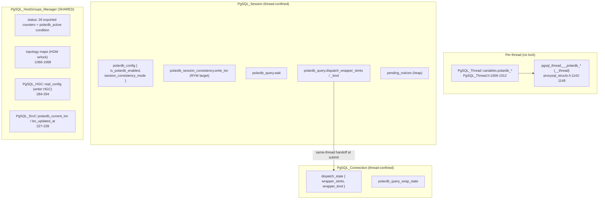
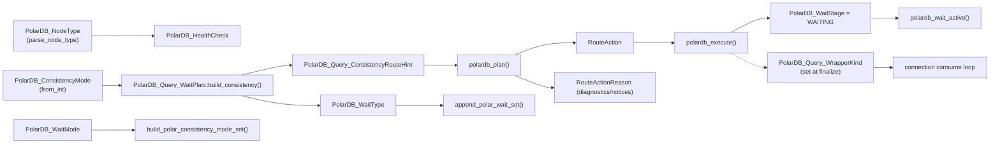
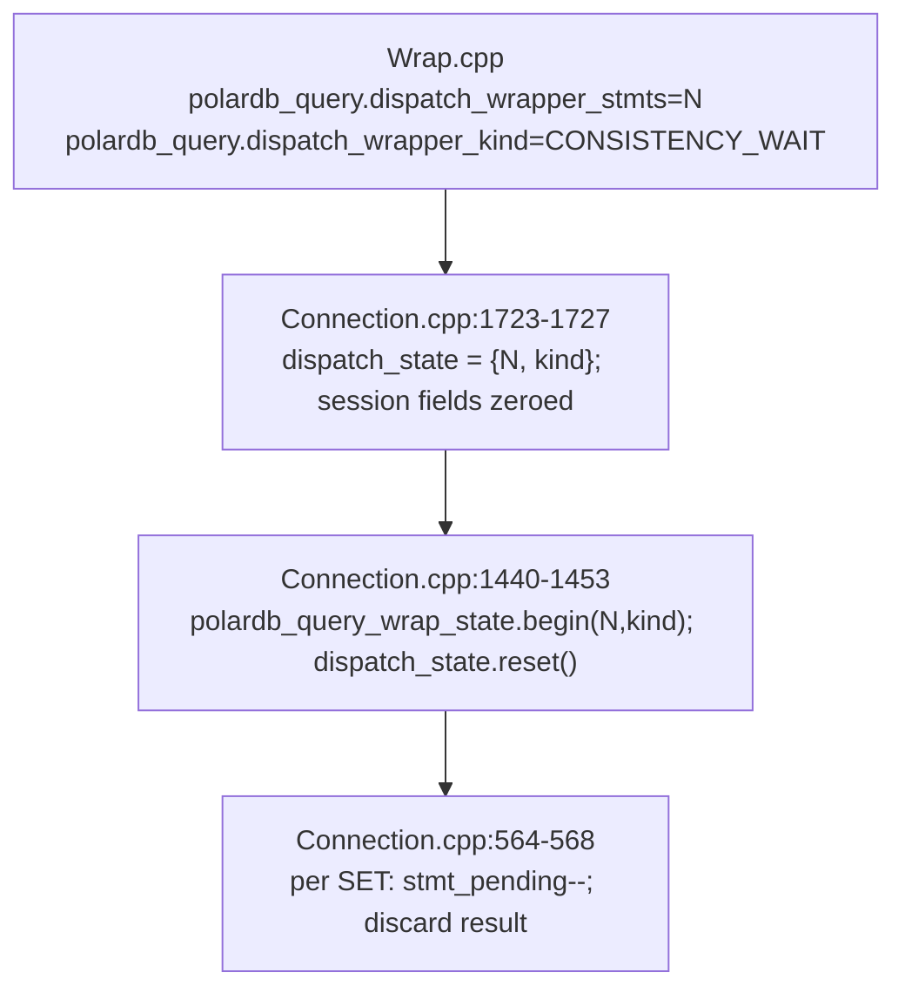

# PolarDB LSN — Data Structures and State

> Scope: every PolarDB struct, enum, field, and counter in the LSN-only branch — ownership, field-by-field tables, request/response data flow, enum-dependency map, thread-safety boundaries, lifecycle, and a dead/vestigial inventory. | Audience: R/M/O/C | Status: stable | Prereqs: [POLARDB_ARCHITECTURE.md](POLARDB_ARCHITECTURE.md), [03-TYPES-AND-ENUMS.md](03-TYPES-AND-ENUMS.md) | Verified against: this branch

This document is the data reference for the PolarDB **LSN-only branch**. It
lists the PolarDB data items relevant to the current RFQ routing model, says
which class owns them, when they are created and cleared, who reads and writes
them, and how they are kept safe across threads. If you want the architecture
and flow narrative, read [POLARDB_ARCHITECTURE.md](POLARDB_ARCHITECTURE.md)
first. If you want a relationship map showing how the structs compose and flow
through the request path, read
[POLARDB_STRUCTURE_DOMAIN_MAP.md](POLARDB_STRUCTURE_DOMAIN_MAP.md). If you want
the routing decision rules, read [06-ROUTING-PIPELINE.md](06-ROUTING-PIPELINE.md).

Everything PolarDB is gated behind one compile flag, `POLARDB_PROXY`. When
`POLARDB_PROXY=0`, the whole surface compiles out (`include/PgSQL_PolarDB.h:82`,
`:872`), and `lib/PgSQL_PolarDB_Stubs.cpp` is intentionally empty
(`lib/PgSQL_PolarDB_Stubs.cpp:28`). So when the flag is off, ProxySQL behaves
exactly like upstream and none of the state below exists.

---

## 0. Terms used in this document

Each term is defined once here and used the same way throughout. The project
glossary in `README.md` is the authority for this docset; the curated Foundation
Pack glossary lives at `doc/polardb-arch/34-DOCS-FOUNDATION-PACK.md` in the full implementation.

| Term | Plain meaning |
|------|---------------|
| **PolarDB** | An Alibaba PostgreSQL-compatible database. It has one primary (writer) node and read replicas. |
| **LSN** (Log Sequence Number) | A 64-bit number that marks a position in PostgreSQL's write-ahead log (WAL). Higher means newer. A replica that has "replayed up to LSN X" can serve any read whose data was written at or before X. |
| **RYW** (read-your-writes) | The guarantee that after a session writes, its own later reads see that write, even when the read goes to a replica. |
| **HG** (hostgroup) | A ProxySQL group of backend servers. A "writer HG" holds the primary; a "reader HG" holds replicas. |
| **RFQ** (ReadyForQuery) | The PostgreSQL wire message a backend sends when it is ready for the next query. A patched PolarDB backend, when asked, appends its current WAL LSN to RFQ. |
| **Wrapper / wrap** | ProxySQL prepends `SET ...` statements in front of a user read so the replica waits for the needed LSN before answering. Each prepended `SET` returns its own result set that ProxySQL must silently drop. |
| **Process result** | The response-side step that reads RFQ payloads, advances observed/write LSNs, maintains missing-LSN latches, and refreshes the per-server LSN cache. |
| **Thread-confined** | A value touched by exactly one OS thread on the hot path, so it needs no lock. |
| **Atomic** | A value read and written through `std::atomic` so two threads cannot tear it. |
| **HGM** | The HostGroups Manager (`PgSQL_HostGroups_Manager`), the class that owns backend topology and the only PolarDB state shared across threads. |

`XLogRecPtr` is a `typedef uint64_t` with `InvalidXLogRecPtr = 0`
(`include/PgSQL_PolarDB.h:101-103`).

---

## 1. Ownership map

PolarDB state lives in four places. The diagram shows which class holds what and
the one bridge that crosses a class boundary (still on the same thread).

```
  PER-THREAD (one copy per worker thread, __thread, no lock)
  ┌──────────────────────────────────────────────────────────────────────────┐
  │ PgSQL_Thread::variables   (admin-facing config; char*/int/bool)            │  PgSQL_Thread.h:1006-1012
  │ pgsql_thread___polardb_*  (hot-path snapshots; __thread int/bool)          │  proxysql_structs.h:1142-1148
  └──────────────────────────────────────────────────────────────────────────┘

  PER-CLIENT-SESSION (driven by ONE thread at a time → thread-confined, no lock)
  ┌──────────────────────────────────────────────────────────────────────────┐
  │ PgSQL_Session                                                              │  PgSQL_Session.h:476-534
  │   polardb_config { is_polardb_enabled, session_consistency_mode }          │
  │   polardb_session_consistency.write_lsn         (own-write component)                  │
  │   polardb_session_consistency.observed_lsn      (monotonic-read component)             │
  │   polardb_session_*_lsn_unknown     (missing-LSN latches)                  │
  │   polardb_session_consistency.writer_scope : WriterScope                                  │
  │   polardb_query.request_writer_scope : WriterScope      (per-query)              │
  │   polardb_query.reader_plan.consistency_target_lsn  (per-query reader target)       │
  │   polardb_query.wait      : WaitState      (in-flight wait runtime)        │
  │   polardb_query.wrapped_query_buf, mode_set_cache(+_mode)                        │
  │   polardb_query.dispatch_wrapper_stmts / _kind   ─────────────────┐ same-thread  │
  │   polardb_wait_disabled, pending_notices (heap)             │ handoff      │
  └────────────────────────────────────────────────────────────┼─────────────┘
                                                                 ▼
  PER-BACKEND-CONNECTION (driven by ONE thread at a time → thread-confined)
  ┌──────────────────────────────────────────────────────────────────────────┐
  │ PgSQL_Connection                                                          │  PgSQL_Connection.h:647-777
  │   dispatch_state { wrapper_stmts, wrapper_kind }   (receives the handoff)    │
  │   polardb_query_wrap_state { was_wrapped, stmt_failed, stmt_total,     │
  │                                  stmt_pending, wrapper_kind }              │
  └──────────────────────────────────────────────────────────────────────────┘

  SHARED ACROSS THREADS (the ONLY PolarDB state that needs locks/atomics)
  ┌──────────────────────────────────────────────────────────────────────────┐
  │ PgSQL_HostGroups_Manager                                                  │
  │   status.polardb_* : 26 exported counters + polardb_active atomic gate     │
  │   polardb_writer_to_reader_ / polardb_reader_to_writer_ /                  │
  │   polardb_hostgroups_   (topology maps, under HGM wrlock())                │  PgSQL_HostGroups_Manager.h:1066-1068
  │ PgSQL_HGC::repl_config  (writer-HGC policy snapshot; per-HG)               │  PgSQL_HostGroups_Manager.h:284-294
  │ PgSQL_SrvC::polardb_current_lsn / lsn_updated_at  (per-server, atomic)     │  PgSQL_HostGroups_Manager.h:227-228
  └──────────────────────────────────────────────────────────────────────────┘
```

Key rule: **only the HGM block is shared across threads.** Session and Connection
state are each driven by one thread at a time on the hot path, so they use no
locking. The one cross-class move — session → connection wrapper-skip counters —
happens on the same thread at query submit (see §6 and §8).

---

## 2. Enums

All enums live in `include/PgSQL_PolarDB.h`. The table gives the underlying type,
the values, what each enum is for, and the exact line.

| Enum | Underlying type | Values | Purpose | file:line |
|------|-----------------|--------|---------|-----------|
| `PolarDB_NodeType` | `int` (plain enum class) | UNKNOWN=0, PRIMARY=1, REPLICA=2, STANDBY=3 | Backend role parsed from `polar_node_type()` in the health check | `:109` |
| `PolarDB_WaitType` | `uint8_t` | NONE=0, LSN=2 | Kind of consistency wait. Only NONE and LSN are used; the value `2` keeps a wire mapping for `polar_xact_split_wait_lsn` | `:122` |
| `PolarDB_WaitMode` | `uint8_t` | BEST_EFFORT=1, STRICT=2 | What happens on timeout: best-effort returns stale data with a WARNING; strict raises an ERROR | `:130` |
| `PolarDB_RfqRoutePolicy` | `uint8_t` | BEST_EFFORT=1, STRICT=2 | Routing policy when an RFQ-derived target is unknown | `:143` |
| `PolarDB_SessionLsnBaseline` | `uint8_t` | OBSERVED=1, PRIMARY=2 | First-read SESSION_LSN baseline source | `:155` |
| `PolarDB_ProxyProtocol` | `uint8_t` | OFF=0, LEGACY=1, V15=2 | Startup protocol for PolarDB proxy parameters | `:183` |
| `PolarDB_StartupIdentitySource` | `uint8_t` | NONE=0, CLIENT=1, LISTENER_PROXY=2, CONFIGURED_FALLBACK=3 | Source of identity used in startup params | `:189` |
| `PolarDB_Query_WrapperKind` | `uint8_t` | NONE=0, CONSISTENCY_WAIT=1 | Tags which kind of wrapper `SET`s precede a query | `:172` |
| `PolarDB_ConsistencyMode` | `uint8_t` | OFF=0, SESSION_LSN=1, PRIMARY_ONLY=3 | Resolved per-session routing mode. Values match the `POLARDB_CONSISTENCY_*` ints (see below) | `:184` |
| `PolarDB_Query_ConsistencyRouteHint` | `uint8_t` | NONE=0, PRIMARY, REPLICA | Advisory hint from the wait planner. NOT the final route — the planner decides that | `:218` |
| `PolarDB_WaitStage` | `uint8_t` | IDLE=0, WAITING=1 | Whether a wait is in flight; drives wrap-state filtering | `:227` |
| `PolarDB_WrapFinalizeResult` | `uint8_t` | CONTINUE=0, FAILED=1 | Outcome of attaching the wrapper before dispatch | `:240` |
| `PolarDB_ReaderStatus` | `uint8_t` | ACQUIRED=0, READER_UNAVAILABLE, READER_BUSY, RFQ_UNAVAILABLE, PRIMARY_LSN_UNKNOWN, READER_LSN_UNKNOWN, READER_LSN_STALE, READER_LAG_EXCEEDED | Outcome of acquiring a reader for an LSN-targeted query | `:167` |
| `PolarDB_Query_RoutePlan::RouteAction` | `uint8_t` | PASSTHROUGH=0, REPLICA_WITH_WAIT, FORCE_PRIMARY | The routing decision | `:835` |
| `PolarDB_Query_RoutePlan::RouteActionReason` | `uint8_t` | NONE=0, EXTENDED_PROTOCOL, IN_TRANSACTION, MULTI_STATEMENT, MODE_PRIMARY, HINT_PRIMARY, WRITE_LSN_UNKNOWN, OBSERVED_LSN_UNKNOWN, PRIMARY_LSN_UNKNOWN | Why the planner rejected or degraded a replica route | `:1253` |

### Companion integer constants

Where the code needs a plain `int` with a `-1` "unset" sentinel, it uses three
constants in `include/PgSQL_Thread.h:48-50`. They mirror `PolarDB_ConsistencyMode`
on purpose, so the resolver functions can compare ints and the typed enum maps
back cleanly:

| Constant | Value | Mirrors |
|----------|-------|---------|
| `POLARDB_CONSISTENCY_OFF` | 0 | `PolarDB_ConsistencyMode::OFF` |
| `POLARDB_CONSISTENCY_LSN` | 1 | `PolarDB_ConsistencyMode::SESSION_LSN` |
| `POLARDB_CONSISTENCY_PRIMARY` | 3 | `PolarDB_ConsistencyMode::PRIMARY_ONLY` |

The helper `polardb_consistency_from_int(int)` (`include/PgSQL_PolarDB.h:192`)
converts a resolved int to the typed enum and maps any unsupported value to
`OFF`. It asserts the input is not the `-1` "unresolved" sentinel.

### Note on the `LSN=2` and `PRIMARY_ONLY=3` gaps

The value gaps are deliberate, not bugs. `PolarDB_WaitType::LSN=2` and
`PolarDB_ConsistencyMode::PRIMARY_ONLY=3` skip `1`/`2` so the same numbers can be
reused by a future wait family (for example CSN) without renumbering. CSN
(commit sequence number) is **not implemented in this branch and is
experimental**: it would need PolarDB backend support, it would apply only in a
global-consistency mode, and its wait behavior is not reliably verified. These
value gaps only reserve the numbering; they add no working CSN logic today. See
[15-LIMITATIONS-AND-ROADMAP.md](15-LIMITATIONS-AND-ROADMAP.md) and
[18-FUTURE-CSN-DESIGN.md](18-FUTURE-CSN-DESIGN.md).

---

## 3. Structs in `include/PgSQL_PolarDB.h`

Every struct here is a **plain value type**. None of them is shared across
threads on its own and none carries internal locking. Thread-safety comes from
where the struct lives (a session field, a connection field, or a request-stack
local) — see the per-class tables in §5 to §8.

| Struct | Fields (type) | Purpose / lifecycle | file:line |
|--------|---------------|---------------------|-----------|
| `PolarDB_HealthCheck` | `node_type` (PolarDB_NodeType), `is_available` (bool, default true), `current_lsn` (uint64_t) | Output of one monitor health check. Built in `parse_polardb_full_health_check()` (`lib/PgSQL_PolarDB.cpp:75`); read by the monitor (`is_available` at `lib/PgSQL_Monitor.cpp:746`, `current_lsn` at `:747`). Stack-scoped. | `:256` |
| `PolarDB_WaitSpec` | `type` (PolarDB_WaitType), `target` (uint64_t), `timeout_ms` (uint32_t), `mode` (PolarDB_WaitMode); `has_wait()`, `reset()`, `lsn()` | Immutable wait payload shape. Embedded in WaitPlan, RoutePlan, and WaitState so the wait quartet is owned once. | header |
| `PolarDB_Query_WaitPlan` | `spec` (PolarDB_WaitSpec), `route_hint`; `has_wait()`, `reset()`, `build_consistency()` | Consistency helper output inside `polardb_plan()`. `route_hint` is consumed by planning; `spec` is copied into `RoutePlan.wait_spec`. | header |
| `PolarDB_Query_WaitState` | `spec` (PolarDB_WaitSpec), `wait_stage`, `wrapper_stmts`, `wait_started_at_us`, `wrapper_finalized`, `timeout_error` (bool, default false), `fallback_writer_hg` (int, default -1), `original_query`; `reset()`, `prepare_from_spec()` | The in-flight wait runtime for one wrapped read. Lives on the session as `polardb_query.wait`; the connection-side WrapState consumes wrapper results. | header |
| `PolarDB_Query_ReaderPlan` | `consistency_target_lsn`, `primary_lsn`, `max_lag_bytes`, `fallback_writer_hg`, `route_rfq_policy`, `allow_best_effort_degrade`; `reset()` | Query-scoped reader acquisition requirements. The planner fills it; `get_MyConn_polardb_reader()` consumes it when acquiring the actual reader connection. | `:1212` |
| `PolarDB_ReaderResult` | `conn`, `srv`, `status`, `wait_bypass_allowed` (bool, default false); `acquired()` | Result of `get_MyConn_polardb_reader()`. Carries either the acquired connection/server or the exact `PolarDB_ReaderStatus` explaining why acquisition did not produce a usable reader. `wait_bypass_allowed` is set true only when the reader was acquired from the fresh target-reached prefix (its cached LSN already reaches the target); it lets the session clear the staged wait and skip the wrapper (`PolarDB_Wait_Wrap_Bypassed`). It stays false for any other reader, so the wrapper remains the RYW gate. | `:1233` |
| `PolarDB_Query_RouteCtx` | see the field table in §9 | All routing inputs, filled once per query by `polardb_collect()`, immutable after. Request-stack scoped only. | `:811` |
| `PolarDB_Query_RoutePlan` | `wait_spec` (PolarDB_WaitSpec), `reader` (`PolarDB_Query_ReaderPlan`), `target_hg` (int, =-1), `action` (RouteAction), `action_reason` (RouteActionReason), `degraded_rfq_route` (bool) | The routing decision from `polardb_plan()`, consumed by `polardb_execute()`. `reader` carries query-scoped backend acquisition requirements; `wait_spec` carries the wrapper payload; `degraded_rfq_route` marks best-effort reader routing without an enforceable RFQ target. Request-stack scoped only. | `:1244` |
| `PolarDB_Query_ExecuteResult` | `final_target_hg` (int, =-1), `executed_action` (RouteAction) | The final HG after any execute-time fallback. Request-stack scoped only. | `:867` |

There is also one stateless helper class:

- `PolarDB_Protocol` (`:575`) — all-static parsing and formatting helpers
  (`parse_node_type`, `parse_is_available`, `parse_lsn_string`, `is_write_query`,
  `append_polar_wait_set`, `append_polar_timeout_set`). It holds **no state**;
  it is a namespace of functions.

### Header-inline policy helpers (side-effect free, no state)

These live in the header so unit tests can exercise the exact policy code the
hot path runs, without a `POLARDB_PROXY=1` library. They take all inputs as
parameters and return a value:

| Helper | Returns | file:line |
|--------|---------|-----------|
| `polardb_resolve_wait_timeout_ms(hg, global)` | resolved timeout ms (0 = wait indefinitely) | `:417` |
| `polardb_resolve_consistency_mode(session, hg, global)` | resolved mode int (or -1) | `:435` |
| `PolarDB_Query_WaitPlan::build_consistency(mode, session_lsn, timeout_ms, wait_mode, prefer_replica)` | a `PolarDB_Query_WaitPlan` | header |
| `polardb_lsn_cache_fresh(updated_at_us, now_us, freshness_ms)` | bool: cached LSN still fresh | `:525` |
| `polardb_lag_ms_within_cap(lag_us, max_lag_ms)` | bool — **DEFERRED, no producer** (see §10 and §11) | `:544` |
| `PolarDB_Query_ReaderPlan::within_byte_cap(replica_lsn)` | bool: within byte cap (member; uses the plan's `primary_lsn` + `max_lag_bytes`) | `:1604` |
| `polardb_should_update_monitor_lsn(monitor_on, observed_lsn)` | bool: should refresh cache | `:564` |

---

## 4. Enum-dependency map (enum → where it is set → where it is consumed)

This shows the chain each enum travels: which function produces a value and which
function acts on it. File:line references in this document are best-effort
anchors for this branch and should be checked against the checkout
when reviewing code.

| Enum value source | Carried in | Consumed by |
|-------------------|-----------|-------------|
| `PolarDB_NodeType` ← `PolarDB_Protocol::parse_node_type()` (`PgSQL_PolarDB.cpp` via `parse_polardb_full_health_check` `:75`) | `PolarDB_HealthCheck.node_type` | monitor read-only mapping (`is_writer`/`node_type_to_read_only`) |
| `PolarDB_ConsistencyMode` ← `polardb_consistency_from_int()` over the resolved mode int | `PolarDB_Query_RouteCtx.effective_consistency_mode` (as int) → typed enum inside `polardb_plan()` | `PolarDB_Query_WaitPlan::build_consistency()` switch (`:476`); `polardb_plan()` mode decisions |
| `PolarDB_Query_ConsistencyRouteHint` ← `PolarDB_Query_WaitPlan::build_consistency()` (`:474-490`) | `PolarDB_Query_WaitPlan.route_hint` | `polardb_plan()` (advisory only — final route is `RouteAction`) |
| `PolarDB_WaitType` ← `PolarDB_Query_WaitPlan::build_consistency()` (`LSN` when `session_lsn>0`) | `WaitPlan.spec.type` → `RoutePlan.wait_spec.type` → `WaitState.spec.type` (`prepare_from_spec`) | `PolarDB_Protocol::append_polar_wait_set()` (emits the `SET` only for `LSN`); timeout-subset counter |
| `PolarDB_WaitMode` ← resolved `wait_timeout_mode` (`Flow.cpp:73`) | `WaitPlan.spec.mode` / `WaitState.spec.mode` / `RoutePlan.wait_spec.mode` | `build_polar_consistency_mode_set()` chooses `'strict'` vs `'best_effort'` (`Wrap.cpp:101-108`) |
| `PolarDB_WaitStage` ← `polardb_execute()` sets `WAITING` (`Flow.cpp:722`) | `WaitState.wait_stage` | `polardb_wait_active()` gate (filters wrapper results, drives the WIRE path) |
| `PolarDB_Query_WrapperKind` ← `finalize_wait_timeout_injection()` sets `CONSISTENCY_WAIT` (`Wrap.cpp:242`) | session `polardb_query.dispatch_wrapper_kind` → connection `dispatch_state.wrapper_kind` → `polardb_query_wrap_state.wrapper_kind` (`Connection.cpp:1725,1442`) | connection consume loop (`is_consistency_wait()`, `Connection.cpp` helpers) |
| `RouteAction` ← `polardb_plan()` | `RoutePlan.action` → `ExecuteResult.executed_action` | `polardb_execute()` side effects; `Session.cpp` route block (`:2554-2558`) |
| `RouteActionReason` ← `polardb_plan()` route decision branches | `RoutePlan.action_reason` | diagnostics / `POLARDB_TRACE` and degraded-route notices (records *why* a replica route was rejected or degraded) |
| `PolarDB_WrapFinalizeResult` ← `finalize_wait_timeout_injection()` return | return value | `Session.cpp` at `ASYNC_IDLE` (`:3590-3605`): `FAILED` sends a clean error and ends the request |

---

## 5. `PgSQL_Session` PolarDB fields

These are **flat session members** declared at `include/PgSQL_Session.h:476-534`.
They were deliberately kept flat (not a sub-object) to keep the feature local and
avoid a broad core-session refactor; the header says so at `:478`. A
`PgSQL_Session` is owned and driven by exactly one `PgSQL_Thread` at a time, so
these fields are **thread-confined; no locking is used or needed.** Every field
is initialized by an in-class member initializer at construction; per-query and
per-reset clearing is explicit.

### 5.1 The nested config struct (`polardb_config`, `:495-500`)

| Field | Type (default) | Purpose | Lifecycle | Readers / Writers | Thread-safety |
|-------|----------------|---------|-----------|-------------------|---------------|
| `is_polardb_enabled` | bool (=false) | True once the session is bound to a PolarDB HG | Set true on backend attach; **never reset to false** | R: `Flow.cpp:488`, `Session.cpp:6102`, `Connection.cpp:1216`; W: `Connection.cpp:1219`, `Session.cpp:5697,5711` | session-confined |
| `session_consistency_mode` | int (=-1) | Per-session mode override (-1 = inherit HG/global) | Set by `polardb_set_session_override()` (`Consistency.cpp:42`); cleared to -1 on RESET via `polardb_clear_staged_wait_state_for_reset(true)` (`Wrap.cpp:324`) | R: `Flow.cpp:67`, `Connection.cpp:1217`; W: `Consistency.cpp:42` | session-confined |

### 5.2 The flat session fields (`:505-533`)

| Field | Type (default) | Purpose | Lifecycle | Readers / Writers | Thread-safety |
|-------|----------------|---------|-----------|-------------------|---------------|
| `polardb_session_consistency.write_lsn` | uint64_t (=0) | Own-write LSN component for RYW diagnostics and future policy | Advanced (max) on positioned write RFQ. **Deliberately NOT cleared on RESET** — it lives for the whole client session; zero-init per new client | R/W: process_result and plan | session-confined |
| `polardb_session_consistency.observed_lsn` | uint64_t (=0) | Monotonic-read LSN component from any positioned RFQ | Advanced (max) on any RFQ carrying LSN. **Deliberately NOT cleared on RESET** — it lives for the whole client session | R/W: process_result and plan | session-confined |
| `polardb_session_consistency.write_unknown` | bool (=false) | A write completed without RFQ LSN; later SESSION_LSN reads need route-RFQ policy | Set on missing write RFQ LSN; cleared only by a primary-sourced positioned RFQ | R/W: process_result and plan | session-confined |
| `polardb_session_consistency.observed_unknown` | bool (=false) | A tracked SESSION_LSN read completed without RFQ LSN; later SESSION_LSN reads need route-RFQ policy | Set on missing tracked read RFQ LSN; cleared only by a primary-sourced positioned RFQ | R/W: process_result and plan | session-confined |
| `polardb_session_consistency.writer_scope` | `PolarDB_WriterScope` (`hg=-1`, `epoch=0`) | Writer hostgroup + writer-identity epoch attached to this session's LSN targets/latches; `valid() == false` means no scope is attached | Clean first PolarDB collect seeds it with the writer scope for the current replication group. Accepted result processing tags newly-created state with the request writer scope. Later writer-scope mismatches clear write/observed LSNs plus both missing-LSN latches; unscoped pre-scope state is also cleared. `PolarDB_Session_Target_Epoch_Reset` increments only if at least one target or latch was discarded. | R/W: collect, process_result | session-confined |
| `polardb_query.request_writer_scope` | `PolarDB_WriterScope` (`hg=-1`, `epoch=0`) | Writer hostgroup + writer-identity epoch captured for the in-flight request | Reset before each query and at cleanup. Set by collect, or by manual-route staging from the effective scope hostgroup (destination HG unless a transaction-persistent HG is already active). Result processing rejects RFQ session/cache updates if the backend resolves to a different writer scope. | R/W: route, collect, process_result | session-confined |
| `polardb_query.reader_plan` | `PolarDB_Query_ReaderPlan` | Per-query reader acquisition requirements, including required LSN | Set in `polardb_execute()` from `plan.reader`; reset before routing and once backend acquisition consumes/degrades/redirects it | R: `Session.cpp` targeted-acquisition path; W: `Flow.cpp`, resets | session-confined |
| `polardb_query.wait` | `PolarDB_Query_WaitState` | In-flight wait state; drives wrapper generation and latency accounting | `prepare_from_spec(plan.wait_spec)` then `wait_stage=WAITING` in execute; reset on new query, RESET, wrap-finalize failure, and cleanup | R: `polardb_wait_active()` checks `wait_stage`; W: `Flow.cpp`, `Wrap.cpp`, `Session.cpp` | session-confined |
| `polardb_query.wrapped_query_buf` | std::string | Reused buffer holding the wrapped query text | Built in `finalize_wait_timeout_injection()` (`Wrap.cpp:225,239`); `.clear()` on wrap failure (`Wrap.cpp:193`) and on RESET (`Wrap.cpp:328`) | R/W: `Wrap.cpp` | session-confined |
| `polardb_consistency_mode_set_cache` | std::string | Cached `SET polar_consistency_mode='...'` text | (Re)built lazily in `build_polar_consistency_mode_set()` only when the mode changes (`Wrap.cpp:101-108`); persists across queries | R/W: `Wrap.cpp` | session-confined |
| `polardb_consistency_mode_set_cache_mode` | int (=-1) | Which mode the cache string was built for | Set when the cache is rebuilt (`Wrap.cpp:103`) | R: `Wrap.cpp:101`; W: `Wrap.cpp:103` | session-confined |
| `polardb_query.dispatch_wrapper_stmts` | uint32_t (=0) | How many wrapper `SET` results the connection must skip | Set after the wrap installs; copied to the connection's `dispatch_state` then zeroed; reset on each query reset | R: `Connection.cpp`; W: `Wrap.cpp`, resets | session-confined (handoff to connection) |
| `polardb_query.dispatch_wrapper_kind` | `PolarDB_Query_WrapperKind` (=NONE) | Wrapper kind for the same handoff | Set by wrap finalize; copied then cleared by connection dispatch; reset on query reset | R: `Connection.cpp`; W: `Wrap.cpp`, resets | session-confined (handoff to connection) |
| `polardb_wait_disabled` | bool (=false) | Safety latch: force the writer instead of an unwrapped replica read | Set true when the wrap build fails (`Wrap.cpp:192`); back to false on RESET (`Wrap.cpp:330`) | R: `polardb_plan()` (`Flow.cpp`); W: `Wrap.cpp:192,330` | session-confined |
| `pending_notices` | `PtrSizeArray*` (=nullptr) | Notices captured from a wrapped read, forwarded with the user's result (for example a best-effort timeout WARNING) | Lazily `new`-ed on first capture (`Notices.cpp`); freed and nulled by `clear_pending_notices(true)` on reset/failure; forwarded then cleared with `free_buffers=false` after sending (`polardb_flush_pending_notices_to_client()`). The destructor calls `reset()`, and `reset()` frees it | R: `Session.cpp`, `Notices.cpp`; W: `Notices.cpp` | session-confined; heap-owned |

### 5.3 Per-query and per-reset clearing

There are two clearing points and one helper:

- **Session reset** (`PgSQL_Session::reset()`, `lib/PgSQL_Session.cpp:354`) clears
  the per-query set: `polardb_query.reset_reader_target()`,
  `polardb_query.wait.reset()`,
  the two dispatch fields, and `clear_pending_notices(true)`. The destructor
  (`:409`) runs `reset()`, so the heap-owned `pending_notices` is always freed.
- **After each query** (`lib/PgSQL_Session.cpp:6122-6128`) the same per-query set
  is cleared again, plus `record_wait_latency(polardb_query.wait)` is charged
  first (`:6122`).
- **The RESET/DISCARD helper** `polardb_clear_staged_wait_state_for_reset()`
  (`lib/PgSQL_PolarDB_Wrap.cpp:324`) additionally clears the session override and
  the wrapped buffer and resets `polardb_wait_disabled` to false. It is the only
  place `session_consistency_mode` returns to -1.

Note the asymmetry, by design: `polardb_session_consistency.write_lsn`,
`polardb_session_consistency.observed_lsn`, and the missing-LSN latches survive ordinary
per-query cleanup; the effective wait target is
`max(write_lsn, observed_lsn)`. A first-read `primary` baseline is handled at
plan time from the primary mirror and is not persisted as session LSN state.
Everything per-query is wiped. See
[09-PUBLISH-AND-WRITE-TRACKING.md](09-PUBLISH-AND-WRITE-TRACKING.md) and
[14-INVARIANTS-AND-FAILURE-MODES.md](14-INVARIANTS-AND-FAILURE-MODES.md).

---

## 6. `PgSQL_Connection` PolarDB fields

A `PgSQL_Connection` (a backend connection) is, like the session, driven by one
thread at a time on the hot path, so these are **connection-confined; no
locking.** The connection layer is the **sole owner of wrap-state
filtering** — it counts down and silently drops the first N result sets and
forwards only the user's result. Declared at `include/PgSQL_Connection.h:647-777`.

| Field / nested struct | Type | Purpose | Lifecycle | Readers / Writers | Thread-safety |
|-----------------------|------|---------|-----------|-------------------|---------------|
| `dispatch_state` | `PolarDB_Query_DispatchState { wrapper_stmts uint32_t, wrapper_kind WrapperKind }` (`:661-669`) | Per-dispatch handoff: how many `SET` results to skip and which kind | Snapshotted from the session at submit (`Connection.cpp:1721-1727`); consumed in `query_start()` then `reset()` (`Connection.cpp:1440-1453`); also reset on connection cleanup (`:2921`) | R/W: `Connection.cpp` only | connection-confined |
| `polardb_query_wrap_state` | `PolarDB_Query_WrapState { was_wrapped bool, stmt_failed bool, stmt_total uint32_t, stmt_pending uint32_t, wrapper_kind WrapperKind }` (`:746-776`) | Counts wrapper result sets down and drops them; forwards only the user result | `begin(n,kind)` at query_start (`Connection.cpp:1442`); `stmt_pending--` per consumed `SET` (`:568`); `mark_wrapper_set_failed()` on a failed wrapper `SET` (`:50,74`); `clear()` at the next query_start and on cleanup (`:1440,2922`) | R/W: `Connection.cpp` (incl. helpers `:34-74`) | connection-confined |

Sub-field semantics for `polardb_query_wrap_state`:

| Sub-field | Meaning | Sticky? |
|-----------|---------|---------|
| `was_wrapped` | This query was sent wrapped (set by `begin(n,...)` when `n>0`) | Yes — survives consumption (the result path uses it to know a wrap happened) |
| `stmt_failed` | A wrapper `SET` failed before the user result | Yes — survives consumption |
| `stmt_total` | How many wrapper statements were prepended (set once by `begin`) | n/a |
| `stmt_pending` | How many wrapper result sets are still to consume; decremented per `SET` | No — counts down to 0 |
| `wrapper_kind` | `CONSISTENCY_WAIT` when wrapped, else `NONE` | n/a |

The header carries a long comment block (`:671-745`) documenting the exact
wrapped-read wire sequence (`SET polar_consistency_mode`,
`SET polar_proxy_wait_timeout_ms`, `SET polar_xact_split_wait_lsn`, then the user
query) and the PolarDB backend behavior it relies on. There are **no other
persistent PolarDB state fields** on the connection beyond these two.

---

## 7. `PgSQL_HostGroups_Manager` shared state

This is the **only** PolarDB state shared across threads, so thread-safety
matters here. It comes in four groups: per-server LSN cache, per-HGC policy
snapshot, internal topology maps, and the stat counters plus the master gate.

### 7.1 Per-server LSN cache, on `PgSQL_SrvC` (`:227-228`)

| Field | Type (default) | Purpose | Lifecycle | Readers / Writers | Thread-safety |
|-------|----------------|---------|-----------|-------------------|---------------|
| `polardb_current_lsn` | `std::atomic<uint64_t>` (=0) | Latest WAL LSN observed for this server | Advanced with a max update in `polardb_update_server_lsn()` from both the monitor and RFQ result processing; never reset on reload | R: reader acquisition; W: `polardb_update_server_lsn()` / `PgSQL_SrvC::polardb_advance_lsn()` | **atomic** (relaxed) |
| `lsn_updated_at` | `std::atomic<unsigned long long>` (=0) | `monotonic_time()` microseconds when a valid LSN sample was last observed; used to judge freshness | Refreshed on every valid non-zero LSN sample, even when the max LSN does not advance | R: freshness checks; W: `PgSQL_SrvC::polardb_advance_lsn()` | **atomic** (relaxed) |

### 7.2 Per-HGC replication policy, on `PgSQL_HGC::repl_config` (`:284-294`)

This anonymous struct is cached on the **writer** HGC and populated under the HGM
write lock during config commit (`HGM.cpp:1836-1842`), so reads during routing
see a consistent snapshot.

| Field | Type (default) | Purpose | Lifecycle | Readers / Writers | Thread-safety |
|-------|----------------|---------|-----------|-------------------|---------------|
| `configured` | bool (=false) | True if this HG is in `pgsql_replication_hostgroups` | Set on commit (`HGM.cpp:1806,1836`) | R: `HGM.cpp:4498,4567,4594`; W: commit | HGM lock for map writes; atomic gate `polardb_active` |
| `reader_hostgroup` | unsigned int (=0) | Paired reader HG | Set `HGM.cpp:1837` | **write-only** — topology lookups use the maps instead (see §7.3) | HGM lock |
| `writer_hostgroup` | unsigned int (=0) | Paired writer HG | Set on commit | Used for diagnostics/future local policy; topology lookups use the snapshot/maps | HGM lock |
| `max_lag_bytes` | int (=0) | Reader lag cap in bytes (0 = off) | Set `HGM.cpp:1841` | R: `HGM.cpp:4501`; W: commit | HGM lock |
| `check_type` | std::string | e.g. "polardb" / "read_only" | Set `HGM.cpp:1838` | **write-only** (the enum is read, not this string) | HGM lock |
| `consistency_mode` | std::string | Mode word (off/lsn/primary) | Set `HGM.cpp:1839` | **write-only** (only the parsed enum is read) | HGM lock |
| `consistency_mode_enum` | int (=-1) | Parsed mode; -1 = use global | Set `HGM.cpp:1840` via `polardb_consistency_mode_from_string()` | R: `HGM.cpp:4499`; W: commit | HGM lock |
| `lsn_wait_timeout_ms` | int (=0) | Per-HG wait timeout | Set `HGM.cpp:1842` | R: `HGM.cpp:4500`; W: commit | HGM lock |
| `proxy_protocol` | std::string | Per-HG startup dialect word (default/v15/legacy/off) | Set at commit (`HGM.cpp:2084`) | **write-only** (only the parsed enum / published snapshot is read) | HGM lock |
| `proxy_protocol_enum` | int (=-1) | Parsed per-HG dialect; -1 = inherit global | Set at commit (`HGM.cpp:2085`) via `polardb_proxy_protocol_from_string()` | W: commit; the resolved value is read on the connection-creation path through the published `PolarDB_HG_Config.policy.proxy_protocol` snapshot (e.g. `PgSQL_Connection.cpp:1382`, `HGM.cpp:1982,5462`) | HGM lock |
| `polardb_primary_lsn` | `shared_ptr<atomic<uint64_t>>` (=0 cell) | Latest primary LSN, for baseline and byte-lag calculations | Advanced in `polardb_update_server_lsn()`; the cell is preserved across reload and reset to 0 only when the writer identity set changes | R: snapshot readers through `PolarDB_HG_Config.primary_lsn`; W: monitor/RFQ result processing and epoch reset | **shared atomic cell** (relaxed load/store, CAS-max for advance) |
| `polardb_writer_epoch` | `shared_ptr<atomic<uint64_t>>` (=0 cell) | Per-writer-HG epoch for writer identity changes | Bumped only when the sorted non-`OFFLINE_HARD` writer `address:port` set changes | R: collect through `PolarDB_HG_Config.writer_epoch`; W: HGM movement/reload paths | **shared atomic cell** |
| `polardb_writer_identity` + `_initialized` | string + bool | Last sorted active writer identity set for change detection | Seeded on first refresh; compared after replication-hostgroup reload, server-table reload, and `read_only_action_v2` movement | HGM helper only | HGM lock |

### 7.3 HGM-internal topology maps (`:1066-1068`, `private`)

| Field | Type | Purpose | Lifecycle | Readers / Writers | Thread-safety |
|-------|------|---------|-----------|-------------------|---------------|
| `polardb_writer_to_reader_` | `unordered_map<uint,uint>` | writer HG → reader HG | Cleared and rebuilt on commit (`HGM.cpp:1811,1828`) | R: `HGM.cpp:4464,4492`; W: commit | **HGM `wrlock()`** |
| `polardb_reader_to_writer_` | `unordered_map<uint,uint>` | reader HG → writer HG | Cleared and rebuilt (`HGM.cpp:1812,1827`) | R: `HGM.cpp:4455,4486`; W: commit | **HGM `wrlock()`** |
| `polardb_hostgroups_` | `unordered_set<uint>` | All HGs in the PolarDB config | Cleared and rebuilt (`HGM.cpp:1810,1825-1826`) | R: `HGM.cpp:4444,4478` (`is_polardb_hostgroup`); W: commit | **HGM `wrlock()`** |

Every public accessor first checks `status.polardb_active` and returns "not
configured" (or 0/-1) when it is false, so an empty config fails safe
(`HGM.cpp:4442,4453,4462,4475,4513,4544,4588`).

The published `PolarDB_TopologySnapshot` is generation-cached and contains plain
topology/policy values plus two shared atomic cells in each `PolarDB_HG_Config`:
`primary_lsn` and `writer_epoch`. It deliberately contains no `PgSQL_HGC` or
`PgSQL_SrvC` raw pointers. `get_polardb_primary_lsn(writer_hg)` is a snapshot map
lookup followed by `primary_lsn->load()`, with no HGM lock.

### 7.4 Stat counters and the master gate, on `PgSQL_HostGroups_Manager::status`

There are **26 exported stat counters + 1 internal `polardb_active` gate**. The
external `PolarDB_*` names are stable SQL rows in `stats_pgsql_global`.
Internally, 19 thread-backed counters are per-thread
`PgSQL_Thread::polardb_status_variables.stvar[]` slots plus a global counter;
7 global-only counters remain global atomics. Worker teardown folds the per-thread
slots into the global counters before the worker object is freed. Full operator
meaning is in
[12-THREADVARS-AND-OBSERVABILITY.md](12-THREADVARS-AND-OBSERVABILITY.md); this
table is the data inventory.

| Field (declared) | Display name in `stats_pgsql_global` | Type | Counts | Writer (file:line) |
|------------------|--------------------------------------|------|--------|--------------------|
| `polardb_server_lsn_updates_from_rfq` | `PolarDB_Server_LSN_Updates_From_RFQ` | atomic ull | every finished query whose RFQ carried an LSN and was accepted by the direct current-group/current-epoch HGM update path | `Flow.cpp:516` |
| `polardb_lsn_updates_from_monitor` | `PolarDB_LSN_Updates_From_Monitor` | atomic ull | LSN *advances* seen by the monitor (only when `polardb_update_server_lsn()` returned true) | `Monitor.cpp:1947` |
| `polardb_monitor_health_invalid_role` | `PolarDB_Monitor_Health_Invalid_Role` | atomic ull | monitor health row reported a role ProxySQL cannot route to | monitor result parsing |
| `polardb_monitor_health_invalid_values` | `PolarDB_Monitor_Health_Invalid_Values` | atomic ull | monitor health row had invalid availability or invalid LSN text | monitor result parsing |
| `polardb_lsn_stale_count` | `PolarDB_LSN_Stale_Count` | atomic ull | active stale-LSN counter for byte-lag enforcement. It increments when an enabled max_lag_bytes check finds missing or stale primary/reader LSN state | reader acquisition |
| `polardb_write_missing_lsn` | `PolarDB_Write_Missing_LSN` | atomic ull | writer RFQ carried no LSN; automatic LSN-mode reads follow `route_rfq_policy` until a primary-sourced RFQ clears the latch | process_result |
| `polardb_read_missing_lsn` | `PolarDB_Read_Missing_LSN` | atomic ull | tracked SESSION_LSN read RFQ carried no LSN | process_result |
| `polardb_primary_lsn_unknown` | `PolarDB_Primary_LSN_Unknown` | atomic ull | primary baseline requested but the primary mirror was empty | plan |
| `polardb_rfq_best_effort_degraded_routes` | `PolarDB_RFQ_Best_Effort_Degraded_Routes` | atomic ull | best-effort policy allowed a degraded reader route without a wait target | plan |
| `polardb_consistency_writer_fallback` | `PolarDB_Consistency_Writer_Fallback` | atomic ull | consistency read was redirected to writer after reader acquisition returned a safety status or strict RFQ-unavailable status | session dispatch |
| `polardb_wait_reads_retried_on_writer` | `PolarDB_Wait_Reads_Retried_On_Writer` | atomic ull | wait-wrapped reader query was retried once on the writer after strict wait timeout or reader connection loss, before any user result reached the client | session dispatch |
| `polardb_rfq_profile_skipped` | `PolarDB_RFQ_Profile_Skipped` | atomic ull | pooled connection skipped because its startup profile did not request RFQ LSN | pool selection |
| `polardb_rfq_profile_evicted` | `PolarDB_RFQ_Profile_Evicted` | atomic ull | incompatible free pooled connections evicted to make room for RFQ-LSN-capable replacements | pool selection |
| `polardb_tl_cache_bypassed_for_target` | `PolarDB_TL_Cache_Bypassed_For_Target` | atomic ull | thread-local backend cache was bypassed because the query had an RFQ-LSN target | pool selection |
| `polardb_target_lsn_preferred` | `PolarDB_Target_LSN_Preferred` | atomic ull | fresh cached reader at or beyond target was preferred and acquired | reader acquisition |
| `polardb_target_lsn_fallback_wait` | `PolarDB_Target_LSN_Fallback_Wait` | atomic ull | reader acquisition fell back to the full weighted candidate set and relied on wait wrapper | reader acquisition |
| `polardb_session_target_epoch_reset` | `PolarDB_Session_Target_Epoch_Reset` | atomic ull | collect or accepted result processing discarded at least one session LSN target or missing-LSN latch because the writer group or epoch changed | collect, process_result |
| `polardb_session_lsn_routing` | `PolarDB_Session_LSN_Routing` | atomic ull | reads route-planned to a reader with a session-LSN wait (the `REPLICA_WITH_WAIT` decision) | `Flow.cpp:433` |
| `polardb_wait_wrap_prepared` | `PolarDB_Wait_Wrap_Prepared` | atomic ull | wait-wrapper intent prepared for that routed read | `Flow.cpp:451` |
| `polardb_wait_wrap_bypassed` | `PolarDB_Wait_Wrap_Bypassed` | atomic ull | selected reader already reached the consistency target, so the staged wait was cleared before wrapping | backend acquisition |
| `polardb_wait_lsn_sent` | `PolarDB_Wait_LSN_Sent` | atomic ull | LSN wrappers actually built and installed on the wire | `Wrap.cpp:244` |
| `polardb_wait_lsn_sum_us` | `PolarDB_Wait_LSN_Sum_Us` | atomic ull | total microseconds spent in LSN waits | `Wrap.cpp:272` |
| `polardb_wait_wrap_safety_abort` | `PolarDB_Wait_Wrap_Safety_Abort` | atomic ull | wrap build failed → wait aborted (sets `polardb_wait_disabled`) | `Wrap.cpp:185` |
| `polardb_wait_error_timeout` | `PolarDB_Wait_Error_Timeout` | atomic ull | confirmed wait-timeout events accounted (total) | `Wrap.cpp:298` |
| `polardb_wait_error_lsn_wait_timeout` | `PolarDB_Wait_Error_LSN_Wait_Timeout` | atomic ull | the LSN-wait subset of the timeout total | `Wrap.cpp:300` |
| `polardb_wait_error_connection_lost` | `PolarDB_Wait_Error_Connection_Lost` | atomic ull | wait-wrapped reader lost its backend connection before any user result reached the client | session dispatch |
| `polardb_active` | (not exported as a stat) | `atomic<bool>` (=false) | true when `polardb_hostgroups_` is non-empty | `HGM.cpp:1864` |

`polardb_active` is the master gate. It is read by every HGM accessor (§7.3) and
by the session route block at `Session.cpp:2543` before any PolarDB routing runs.
When false, the whole feature is bypassed.

The same 26 counters surface in the admin SQL table `stats_pgsql_global` and in
Prometheus as `proxysql_polardb_*_total`. Prometheus updates run only during
metrics collection; query-path increments remain per-thread/global-counter only.

---

## 8. The session → connection bridge (same thread)

Two session fields move into the connection at query submit. This is the only
PolarDB cross-class data move, and it happens **on one thread** at the
`ASYNC_IDLE` submit step, so no lock is needed.

```
SESSION (after finalize_wait_timeout_injection, Wrap.cpp:241-242)
   polardb_query.dispatch_wrapper_stmts  = N
   polardb_query.dispatch_wrapper_kind   = CONSISTENCY_WAIT
            │
            │  PgSQL_Connection::async_query() at submit  (Connection.cpp:1723-1727)
            ▼
CONNECTION
   dispatch_state.wrapper_stmts = N            session fields zeroed right after the copy
   dispatch_state.wrapper_kind  = CONSISTENCY_WAIT
            │
            │  query_start()  (Connection.cpp:1440-1453)
            ▼
   polardb_query_wrap_state.begin(N, CONSISTENCY_WAIT)   then dispatch_state.reset()
            │
            │  result loop, per wrapper SET  (Connection.cpp:564-568)
            ▼
   stmt_pending-- ; the SET result is discarded (buffer recycled), only the user result is forwarded
```

The handoff exists so the connection layer never has to read session state during
the result loop — it only needs the count and kind. The session fields are
zeroed immediately after the copy (`Connection.cpp:1726-1727`) so a stale value
cannot leak into a later query.

---

## 9. `PolarDB_Query_RouteCtx` fields

Filled once per query by `polardb_collect()` (`lib/PgSQL_PolarDB_Flow.cpp:233`),
then **read-only**. Request-stack scoped — it lives on the call stack of one
query, is never shared, and needs no locking. Declared at
`include/PgSQL_PolarDB.h:1550`.

| Field | Type (default) | Purpose | Set by (file:line) |
|-------|----------------|---------|--------------------|
| `writer_scope` | `PolarDB_WriterScope` (`hg=-1`, `epoch=0`) | Writer HG + writer identity epoch copied from the topology snapshot | `Flow.cpp` |
| `session` | `PolarDB_SessionConsistency` | Value snapshot of `polardb_session_consistency` after collect applies any writer-scope reset | `Flow.cpp` |
| `wait_timeout_ms` | uint32_t (1000) | Resolved wait timeout (per-HG or global) | `Flow.cpp:72` |
| `reader_hg` | int (-1) | Reader HG (-1 if none configured) | `Flow.cpp:63` |
| `effective_consistency_mode` | int (0) | Resolved mode: session > HG > global | `Flow.cpp:66` |
| `wait_timeout_mode` | int (BEST_EFFORT) | best-effort vs strict, as an int | `Flow.cpp:73` |
| `route_rfq_policy` | int (STRICT) | Missing RFQ target routing policy: strict or best_effort | `Flow.cpp` |
| `session_lsn_baseline` | int (OBSERVED) | Empty-session SESSION_LSN baseline source: observed or primary | `Flow.cpp` |
| `max_lag_bytes` | int (-1) | Reader byte-lag cap; -1 = use the thread default | `Flow.cpp:74` |
| `is_polar_hg` | bool (false) | From the HGM cache (resolved once) | `polardb_collect()` (`Flow.cpp`) |
| `replica_eligible` | bool (false) | From the query rules (`qpo->replica_eligible`) | `polardb_collect()` (`Flow.cpp`) |
| `is_multi_statement` | bool (false) | Semicolon-scan safety guard | `polardb_collect()` (`Flow.cpp`) |
| `is_extended_protocol` | bool (false) | Parse/Bind/Execute → no wait wrapper | `polardb_collect()` (`Flow.cpp`) |
| `in_transaction` | bool (false) | Inside an explicit transaction | `Flow.cpp:103` |
| `force_primary_hint` | bool (false) | `/* route=primary */` first-comment hint | `Flow.cpp:106` |

The companion structs `PolarDB_Query_RoutePlan` (`:834`) and
`PolarDB_Query_ExecuteResult` (`:867`) are also request-stack scoped; their fields
are listed in §3. See [06-ROUTING-PIPELINE.md](06-ROUTING-PIPELINE.md) for how
these flow through `collect → plan → execute`.

`polardb_plan()` computes the effective SESSION_LSN target as
`route_ctx.session.target()` (`max(write_lsn, observed_lsn)`). When both are zero and
`session_lsn_baseline=primary`, plan may seed the target from the primary LSN
mirror. If that mirror is empty, `PRIMARY_LSN_UNKNOWN` goes through
`route_rfq_policy` instead of inventing a target.

---

## 10. `PgSQL_Thread` global config (two layers)

PolarDB config exists in two layers. Both are per-thread, so each worker reads
its own copy with no lock. Operator-facing detail (ranges, recipes) is in
[04-ADMIN-SCHEMA-AND-CONFIG.md](04-ADMIN-SCHEMA-AND-CONFIG.md) and
[12-THREADVARS-AND-OBSERVABILITY.md](12-THREADVARS-AND-OBSERVABILITY.md).

### 10.1 Admin-facing config, on `PgSQL_Thread::variables`

Loaded with defaults in `PgSQL_Thread.cpp`, registered for `SET`/`SHOW`,
validated on `SET`, and freed during shutdown.

| Field | Type | Default | Purpose |
|-------|------|---------|---------|
| `polardb_consistency_mode` | char* | "off" | Global mode word: off / lsn / primary |
| `polardb_lag_bytes` | int | 0 (off) | Reader byte-lag cap |
| `polardb_lag_ms` | int | 0 | **DEFERRED**: ms lag cap. No PgSQL producer exists yet, so this knob is inert (see §11) |
| `polardb_lag_wait_ms` | int | 1000 | `polar_xact_split_wait_lsn` timeout; 0 = wait indefinitely |
| `polardb_lsn_freshness_ms` | int | 5000 | Max age of a cached per-server LSN to trust |
| `polardb_monitor_lsn_updates` | bool | true | Enable monitor-driven LSN cache updates |
| `polardb_wait_timeout_mode` | char* | "best_effort" | Global timeout mode: best_effort / strict |
| `polardb_proxy_protocol` | char* | "v15" | Global startup protocol: v15 / legacy / off |
| `polardb_route_rfq_policy` | char* | "strict" | Missing RFQ target route policy: strict / best_effort |
| `polardb_session_lsn_baseline` | char* | "observed" | First-read SESSION_LSN baseline: observed / primary |
| `polardb_proxy_identity_host` | char* | "" | Fallback startup identity host; empty or non-wildcard IP literal |
| `polardb_proxy_identity_port` | int | 0 | Fallback startup identity port; `0` = unset/staging, completed fallback uses `1..65535` |

### 10.2 Per-thread hot-path snapshots

Refreshed from `variables` in `PgSQL_Thread.cpp`. These are **thread-local
(`__thread`)**. Word-valued knobs are stored as strings in `variables` but
parsed to ints here for the hot path.

| Variable | Type | Notes |
|----------|------|-------|
| `pgsql_thread___polardb_consistency_mode` | int | off=0, lsn=1, primary=3 (word parsed to int) |
| `pgsql_thread___polardb_lag_bytes` | int | byte lag cap |
| `pgsql_thread___polardb_lag_ms` | int | **DEFERRED** — no producer (see §11) |
| `pgsql_thread___polardb_lag_wait_ms` | int | wait timeout (global fallback) |
| `pgsql_thread___polardb_lsn_freshness_ms` | int | LSN cache freshness |
| `pgsql_thread___polardb_monitor_lsn_updates` | bool | monitor LSN updates on/off |
| `pgsql_thread___polardb_wait_timeout_mode` | int | best_effort=1, strict=2 (word parsed to int) |
| `pgsql_thread___polardb_proxy_protocol` | int | off=0, legacy=1, v15=2 |
| `pgsql_thread___polardb_route_rfq_policy` | int | best_effort=1, strict=2 |
| `pgsql_thread___polardb_session_lsn_baseline` | int | observed=1, primary=2 |
| `pgsql_thread___polardb_proxy_identity_host` | char* | fallback startup identity host |
| `pgsql_thread___polardb_proxy_identity_port` | int | fallback startup identity port |

---

## 11. No process-global version cache

This implementation does not keep a process-global PolarDB major-version cache. Startup
parameter emission is driven by the explicit startup profile (`v15`, `legacy`,
or `off`). A future `proxy_protocol=auto` feature should resolve capabilities
per replication group / hostgroup so different PolarDB clusters can use
different startup dialects.

---

## 12. Request/response data-flow diagram

This ties the structs together for one query: how routing inputs flow forward
into a wrapped read, and how the LSN flows back on the response.

```
                          REQUEST PATH (forward)
client read ─► get_pkts_from_client(), gated by PgHGM->status.polardb_active   Session.cpp:2543
                  │
                  ▼  polardb_collect()                                          Flow.cpp:233
       reads: HGM topology + repl_config + polardb_session_consistency.write_lsn
              + thread knobs + qpo->replica_eligible + protocol/txn flags
                  │  fills
                  ▼
            PolarDB_Query_RouteCtx  (request-stack, immutable)                 PgSQL_PolarDB.h:811
                  │
                  ▼  polardb_plan()  (pure decision)                            Flow.cpp:410
       calls PolarDB_Query_WaitPlan::build_consistency(), applies route gates
                  │  produces
                  ▼
            PolarDB_Query_RoutePlan  { action, wait_spec, reader, ... }        PgSQL_PolarDB.h
                  │
                  ▼  polardb_execute()  (side effects)                          Flow.cpp:658
       on REPLICA_WITH_WAIT:
         polardb_query.reader_plan = plan.reader                               Flow.cpp
         Session_LSN_Routing++                                                 Flow.cpp:433
         polardb_query.wait.prepare_from_spec(plan.wait_spec); wait_stage = WAITING Flow.cpp
         Wait_Wrap_Prepared++                                                  Flow.cpp:451
                  │
                  ├─ backend acquisition proves selected reader reached target:
                  │       reset_wait(); Wait_Wrap_Bypassed++                   Session.cpp
                  │
                  ▼  ASYNC_IDLE: finalize_wait_timeout_injection()             Session.cpp:3607 / Wrap.cpp:303
       builds: SET polar_consistency_mode; SET polar_proxy_wait_timeout_ms;
               SET polar_xact_split_wait_lsn='<target>'; <user query>
       into polardb_query.wrapped_query_buf; sets dispatch fields; Wait_LSN_Sent++   Wrap.cpp:241-244
                  │  same-thread handoff (see §8)
                  ▼
            PgSQL_Connection.dispatch_state → polardb_query_wrap_state        Connection.cpp:1721-1727,1440-1453
                  │
                  ▼  result loop: drop N SET results, forward only the user result
                                                                                Connection.cpp:564-591

                          RESPONSE PATH (backward)
backend RFQ (with appended LSN) ─► get_polardb_lsn() (no extra round-trip)      Connection.cpp:1335 enables it
                  │
                  ▼  RequestEnd() success path, if is_polardb_enabled           Session.cpp:6102
            polardb_process_result()
       lsn = myds->myconn->get_polardb_lsn()
       if request writer group/epoch is stale or cross-group: skip all RFQ session/cache updates
       if RFQ result processing is accepted: scope session LSN state to request writer group+epoch
       if write && lsn>prev:  polardb_session_consistency.write_lsn = lsn                   Flow.cpp:501-502
       if lsn present and direct HGM update path accepts current epoch:
              PgHGM->polardb_update_server_lsn(backend_srv, backend_hg, backend_config, lsn, request_writer_scope) ; RFQ counter++
                  │
                  ▼  polardb_update_server_lsn(): CAS-max PgSQL_SrvC.polardb_current_lsn = lsn
                     CAS-max writer shared primary-LSN cell when source is primary
                     query threads read that cell through the topology snapshot, without HGM lock
```

A second LSN source runs in the background, independent of any client query: the
monitor health check reads each replica's LSN and calls the same
`polardb_update_server_lsn()` (`Monitor.cpp:1946`), bumping
`PolarDB_LSN_Updates_From_Monitor` when the LSN advances (`Monitor.cpp:1947`).

---

## 13. Thread-safety boundaries (summary)

| Storage class | Mechanism | Why it is safe | Examples |
|---------------|-----------|----------------|----------|
| Per-thread | `__thread` / per-`PgSQL_Thread` | each thread owns its copy | `pgsql_thread___polardb_*`, `variables.polardb_*` |
| Per-session | thread-confined (one thread drives the session) | no concurrent access on the hot path | every `PgSQL_Session` PolarDB field |
| Per-connection | thread-confined (one thread drives the connection) | no concurrent access on the hot path | `dispatch_state`, `polardb_query_wrap_state` |
| Request-stack | local to one query's call stack | not shared at all | `PolarDB_Query_RouteCtx`, `RoutePlan`, `ExecuteResult` |
| HGM per-server / per-HGC LSN | `std::atomic` (relaxed) and shared atomic cells | read locklessly by the reader acquisition/snapshot, written by monitor/result processing | `polardb_current_lsn`, `lsn_updated_at`, `polardb_primary_lsn` |
| HGM topology maps | HGM `wrlock()` | rebuilt only at config commit; read under lock | `polardb_*_to_*_`, `polardb_hostgroups_` |
| HGM counters + gate | local per-thread `stvar[]` slots plus global counters for thread-backed rows; global atomics for global-only rows; `atomic<bool>` for the gate | worker-owned increments for thread-backed rows; atomic `fetch_add` / `load` for global-only and global-counter rows | 26 exported counters + `polardb_active` |

The two cross-class bridges (session → connection dispatch fields in §8; the
notice callback that fills `pending_notices`) both run **on the same thread**, so
they need no lock either.

---

## 14. Lifecycle table

| Struct / field group | Created / initialized | Active during | Reset / destroyed |
|----------------------|-----------------------|---------------|-------------------|
| `polardb_config` (session) | session construction (member initializers) | whole session | `is_polardb_enabled` never resets; `session_consistency_mode` → -1 on RESET (`Wrap.cpp:324`) |
| `polardb_session_consistency.write_lsn` / `polardb_session_consistency.observed_lsn` | session construction (=0) | whole session | survive RESET; gone when the session is destroyed |
| missing-LSN latches | session construction (=false) | until a primary-sourced positioned RFQ clears them | survive RESET; gone when the session is destroyed |
| `polardb_session_consistency.writer_scope` | session construction (`hg=-1`, `epoch=0`) | whole session | seeded on clean first PolarDB collect; attached by accepted result processing; updated on writer group or epoch reset |
| `polardb_query.reader_plan` | session construction (reset defaults) | one query | reset before routing, after targeted acquisition is handled, at query cleanup, and on RESET |
| `polardb_query.wait` | session construction | one query | `.reset()` per query, on RESET, on failure, and at cleanup |
| `polardb_query.wrapped_query_buf` | filled at wrap time (`Wrap.cpp:225`) | one wrapped read | `.clear()` on wrap failure / RESET (`Wrap.cpp:193,328`) |
| `polardb_consistency_mode_set_cache` (+ `_mode`) | lazily on first/changed mode (`Wrap.cpp:101-108`) | many queries | persists; rebuilt only when the mode changes |
| dispatch fields (session) | set at wrap (`Wrap.cpp:241-242`) | until copied to connection | zeroed right after copy (`Connection.cpp:1726-1727`); reset per query |
| `polardb_wait_disabled` | session construction (=false) | until RESET | true on wrap failure (`Wrap.cpp:192`), false on RESET (`Wrap.cpp:330`) |
| `pending_notices` (heap) | lazily `new` on first capture (`Notices.cpp`) | until forwarded | forwarded then cleared by `polardb_flush_pending_notices_to_client()`; freed on reset/destructor |
| `dispatch_state` (connection) | snapshotted at submit (`Connection.cpp:1721-1727`) | until query_start | `reset()` in query_start (`:1453`) and on cleanup (`:2921`) |
| `polardb_query_wrap_state` (connection) | `begin()` at query_start (`Connection.cpp:1442`) | one query's result loop | `clear()` at next query_start / cleanup (`:1440,2922`) |
| `PolarDB_Query_RouteCtx` / `RoutePlan` / `ExecuteResult` | constructed per query on the stack | one query | destroyed when the stack frame returns |
| `PgSQL_SrvC` LSN fields | server creation (=0) | server lifetime | advanced by `polardb_update_server_lsn`; reset only when the writer identity set changes |
| `repl_config` (HGC) | HGC creation (defaults) | between config commits | cleared/rebuilt at commit; LSN/epoch cells preserved across reload and reset only on writer identity change |
| topology maps + `polardb_active` | empty at startup | between commits | cleared and rebuilt at each commit (`HGM.cpp:1810-1864`) |
| HGM counters | zero at startup | process lifetime | monotonic; never reset |

---

## 15. Dead / vestigial / write-only inventory

This is the honest list of PolarDB data items that exist in the source but are
not fully wired today. Each carries a status. The deferred counter and knob tie
to [15-LIMITATIONS-AND-ROADMAP.md](15-LIMITATIONS-AND-ROADMAP.md).

| Item | Where | Status | Detail |
|------|-------|--------|--------|
| `repl_config.reader_hostgroup` | `PgSQL_HostGroups_Manager.h:286` | **WRITE-ONLY** | Set at commit (`HGM.cpp:1837`) but never read; topology lookups use `polardb_writer_to_reader_` instead. |
| `repl_config.check_type` | `PgSQL_HostGroups_Manager.h:289` | **WRITE-ONLY** | Set at commit (`HGM.cpp:1838`) but never read on the routing path. |
| `repl_config.consistency_mode` (string) | `PgSQL_HostGroups_Manager.h:290` | **WRITE-ONLY** | Set at commit (`HGM.cpp:1839`); routing reads only the parsed `consistency_mode_enum`. |
| `pgsql-polardb_lag_ms` knob + `pgsql_thread___polardb_lag_ms` | `PgSQL_Thread.h:1008`, `proxysql_structs.h:1144` | **DEFERRED (inert)** | A millisecond reader-lag cap with **no PgSQL producer**. PgSQL/PolarDB does not yet produce a real per-reader time-lag value. Marked TODO in source (`PgSQL_Thread.h:1008`, `proxysql_structs.h:1144`, registered with a TODO at `PgSQL_Thread.cpp:2417`). Do not treat it as a working routing gate. |
| `PolarDB_LSN_Stale_Count` counter | `PgSQL_HostGroups_Manager.h:683`, exported `PgSQL_Thread.cpp:4533` | **ACTIVE for byte-lag; ms-lag remains deferred** | Byte-lag enforcement increments this counter when a required primary/reader LSN sample is missing or stale. The separate millisecond-lag branch remains inside `POLARDB_PROXY_TODO` and has no producer. |
| `polardb_lag_ms_within_cap()` helper | `PgSQL_PolarDB.h:544` | **DEFERRED (unused predicate)** | Header-inline predicate for the future ms-lag cap. Carries an explicit TODO at `PgSQL_PolarDB.h:536`: wire only after a real ms-lag producer exists. The supported byte-lag gate is the `PolarDB_Query_ReaderPlan::within_byte_cap()` member (`:1604`). |

In-code deferral notes found in the current branch (these belong in
[15-LIMITATIONS-AND-ROADMAP.md](15-LIMITATIONS-AND-ROADMAP.md)):

- `PgSQL_PolarDB.h:510-513` — millisecond replica lag intentionally deferred; no
  per-reader time-lag producer.
- `PgSQL_PolarDB.h:536` (inside the `:533-543` comment block) — TODO: wire
  `polardb_lag_ms_within_cap()` only after a real ms-lag producer.
- `PgSQL_HostGroups_Manager.h:220-222` — deferred PolarDB TODO: PgSQL does not
  produce a real `aws_aurora_current_lag_us` value.
- `PgSQL_HostGroups_Manager.h:1073-1078` and
  `PgSQL_HostGroups_Manager.cpp` — consistency-target reader acquisition
  prefers fresh cached readers already at or beyond the required LSN, but never
  rejects the original replica set merely because cached LSN is below target or
  stale. The wait wrapper remains the correctness gate.
- `PgSQL_Thread.h:1008`, `proxysql_structs.h:1144`, `PgSQL_Thread.cpp:2417` —
  `polardb_lag_ms` deferred, no producer.
- `PgSQL_PolarDB_Flow.cpp:363,442` — the actual query wrapping is deferred from
  `polardb_execute()` to `finalize_wait_timeout_injection()` (a design choice,
  not a gap).
- `PgSQL_Connection.h:737-744` — postponed optimization: per-connection
  mode/timeout `SET` skipping (must live on the connection, not the session).
- `PgSQL_PolarDB_Stubs.cpp:18-22` — note for future commits: if an unguarded core
  reference to a PolarDB symbol is ever added, a stub must be added here.

---

## Appendix: Mermaid diagrams

### A.1 Ownership map



### A.2 Enum-dependency map



### A.3 Request/response data flow

```mermaid
sequenceDiagram
  participant C as Client
  participant S as PgSQL_Session
  participant N as PgSQL_Connection
  participant H as HGM
  participant B as PolarDB backend
  Note over S: gate PgHGM->status.polardb_active (Session.cpp:2543)
  C->>S: read query
  S->>S: polardb_collect → RouteCtx (Flow.cpp:233)
  S->>S: polardb_plan → RoutePlan (Flow.cpp:410)
  S->>S: polardb_execute: consistency_target_lsn, WaitState=WAITING (Flow.cpp:658)
  S->>H: backend acquisition (tl-cache or get_MyConn_polardb_reader)
  opt selected reader already at target (tl-cache hit or wait_bypass_allowed)
    S->>S: reset_wait(); Wait_Wrap_Bypassed++ — wrapper skipped, bare query sent
  end
  S->>S: finalize_wait_timeout_injection: build wrapped query, unless bypassed (Wrap.cpp:303)
  S->>N: dispatch fields → dispatch_state (Connection.cpp:1721-1727)
  N->>B: SET mode; SET timeout; SET wait_lsn; user query (SETs omitted when bypassed)
  B-->>N: N SET results + user result + RFQ(LSN)
  N->>N: drop N SET results, forward user result (Connection.cpp:564-591)
  N-->>C: user result
  S->>S: RequestEnd: polardb_process_result
  S->>S: polardb_session_consistency.write_lsn = max(prev, lsn)
  S->>H: polardb_update_server_lsn
```

### A.4 Session → connection bridge



---

Verified against this branch.
